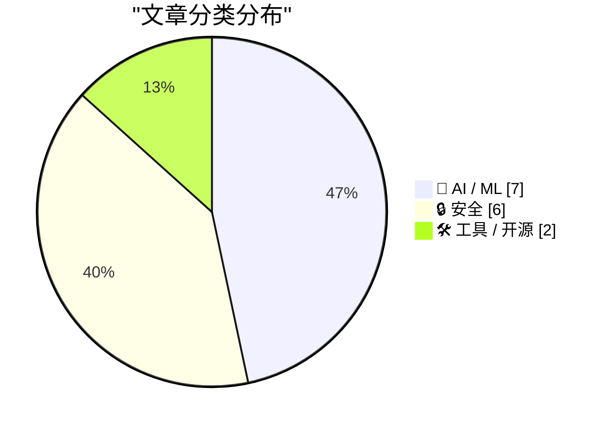
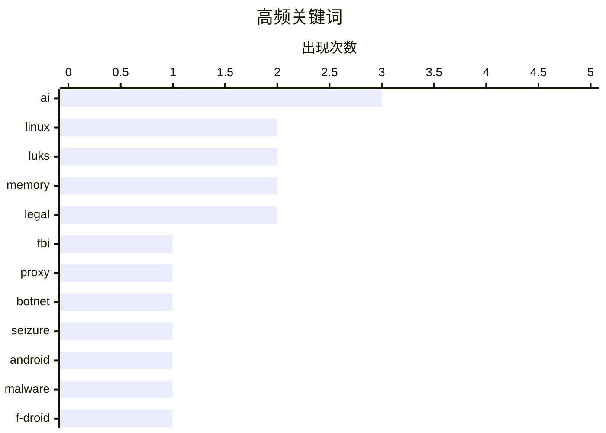

# 📰 AI 资讯每日精选 — 2026-07-03

> 汇聚 140+ 技术博客、X/Twitter、Hacker News、Reddit、Product Hunt、
> Lobste.rs、ClawFeed 日报及 GitHub Trending，经 AI 评分筛选。
>
> **本期内容**：🏆 今日必读 · 🌐 ClawFeed 日报 · 🔥 GitHub Trending · 📂 分类精选 · 🎨 设计与生成式 AI · 📊 数据概览

## 📝 今日看点

今日技术圈呈现两大核心趋势：AI代理正以惊人速度渗透专业工作领域，八个月内胜任自由职业项目的比例从2.5%飙升至16%，同时开发者面临“理解成为新瓶颈”的挑战，AI生成代码的审查与调试压力骤增；安全领域则接连爆出重大隐患，从FBI查封NetNut代理平台与Popa僵尸网络，到黑客利用Meta AI客服窃取Instagram账户，再到Android开发者验证机制被指存在攻击面，表明AI与身份验证系统正成为新型攻击的突破口。

---

## 🏆 今日必读

🥇 **FBI查封NetNut代理平台及Popa僵尸网络**

[FBI Seizes NetNut Proxy Platform, Popa Botnet](https://krebsonsecurity.com/2026/07/fbi-seizes-netnut-proxy-platform-popa-botnet/) — krebsonsecurity.com · 5 小时前 · 🔒 安全

> FBI联合行业合作伙伴查封了与NetNut相关的数百个域名，NetNut是一家由以色列上市公司Alarum Technologies运营的住宅代理服务商。此次行动发生在KrebsOnSecurity发布调查报告的两周后，该报告将NetNut与Popa僵尸网络联系起来。Popa是一个由至少200万台被恶意软件感染的设备组成的僵尸网络。NetNut利用这些被感染的设备作为代理节点，为其客户提供匿名访问服务。FBI的行动旨在切断NetNut与Popa僵尸网络之间的关联，打击这种利用受感染设备进行非法代理服务的行为。

💡 **为什么值得读**: 揭示了大型商业代理服务与僵尸网络之间的隐秘关联，以及执法机构打击此类网络犯罪的最新行动，对理解代理服务安全风险和网络犯罪生态有重要价值。

🏷️ FBI, proxy, botnet, seizure

🥈 **Android开发者验证：伪装成保护的威胁**

[Android Developer Verification: Threat masquerading as protection](https://f-droid.org/2026/07/01/adv-malware.html) — Hacker News Best · 22 小时前 · 🔒 安全

> F-Droid发布文章警告，Google Play的Android开发者验证机制（要求开发者提供身份证明）实际上可能成为新的攻击面。该机制要求开发者上传身份证件和视频验证，但验证过程存在安全漏洞，攻击者可以利用伪造或盗用的身份信息通过验证。文章指出，这种验证机制不仅未能有效阻止恶意软件，反而为攻击者提供了合法发布恶意应用的渠道，同时收集了大量敏感的个人身份信息。F-Droid认为，这种集中式的身份验证系统增加了用户和开发者的风险，而非提供真正的保护。

💡 **为什么值得读**: 对Google Play开发者验证机制提出了尖锐的安全质疑，揭示了安全措施可能适得其反的风险，对Android开发者和安全研究人员具有重要警示意义。

🏷️ Android, malware, F-Droid, developer verification

🥉 **AI代理现在能以专业质量完成16%的自由职业工作，八个月前仅为2.5%**

[AI agents can now complete 16 percent of freelance jobs at pro quality, up from 2.5 percent eight months ago](https://the-decoder.com/ai-agents-can-now-complete-16-percent-of-freelance-jobs-at-pro-quality-up-from-2-5-percent-eight-months-ago/) — The Decoder · 12 小时前 · 🤖 AI / ML

> 远程劳动指数（Remote Labor Index）衡量了AI代理以专业质量完成付费自由职业项目的频率。在八个月内，顶级自动化率从2.5%飙升至16%，增长了超过四倍。这意味着AI代理现在能够胜任更多类型的自由职业任务，包括编程、设计和写作等领域。这一趋势表明AI正在快速渗透自由职业市场，对自由职业者的就业前景和收入构成显著威胁。文章认为，AI代理能力的提升将深刻改变自由职业行业的格局。

💡 **为什么值得读**: 提供了AI替代人类工作的最新量化数据，16%的完成率增长趋势对自由职业者和科技从业者具有直接的职业规划参考价值。

🏷️ AI agents, freelance, automation, Remote Labor Index

4️⃣ **自Linux 6.9起，LUKS挂起操作不再从内存中清除磁盘加密密钥**

[Since Linux 6.9, LUKS suspend stopped wiping disk-encryption keys from memory](https://mathstodon.xyz/@iblech/116769502749142438) — Hacker News Best · 9 小时前 · 🔒 安全

> 自Linux内核6.9版本起，LUKS（Linux统一密钥设置）的挂起操作（suspend）不再从内存中清除磁盘加密密钥。这意味着当系统进入挂起状态时，加密密钥仍然保留在内存中，攻击者可以通过冷启动攻击或直接内存访问（DMA）等方式获取密钥。此前版本中，挂起操作会清除密钥，要求用户重新输入密码以解锁。这一变化降低了系统在挂起状态下的安全性，特别是对于物理安全要求较高的场景。该问题已在Linux社区引发讨论，但尚未有官方修复方案。

💡 **为什么值得读**: 揭示了Linux内核一个关键安全功能的退化，对使用全盘加密的用户和系统管理员具有直接的安全影响，值得立即关注和评估。

🏷️ Linux, LUKS, disk encryption, memory

5️⃣ **Claude Fable与Kayfabe**

[Claude Fable and Kayfabe](https://www.anthropic.com/news/redeploying-fable-5) — daringfireball.net · 6 小时前 · 🤖 AI / ML

> Anthropic宣布，美国政府于6月12日对其最新模型Claude Fable 5和Claude Mythos 5实施了出口管制，要求限制外国国民的访问权限。由于无法实时验证用户国籍，Anthropic暂停了所有用户对这两个模型的访问。截至6月30日，出口管制已被解除，模型恢复访问。文章标题中的“Kayfabe”暗示了Anthropic与政府之间可能存在某种表演性质的互动，即表面上严格执行管制，实则可能另有安排。这一事件凸显了AI模型出口管制的复杂性和对全球用户的实际影响。

💡 **为什么值得读**: 揭示了AI模型出口管制在实际操作中的戏剧性转折，对理解AI监管政策与商业运营之间的博弈具有独特视角。

🏷️ export controls, Claude, Anthropic, regulation

---

## 🌐 ClawFeed 日报精选

> 来源：[ClawFeed](https://clawfeed.kevinhe.io) — AI 驱动的多源新闻聚合

# ClawFeed 日报 | 2026-07-02 (Wed)

基于 7 期 4h digest（#770–#777，覆盖 Jul 1 16:00 – Jul 2 20:00 SGT）汇总。

---

## 🔥 当日 Top 5

1. **Cursor 被 SpaceX 以 $60B 收购** — 买的不是利润（还在烧钱），是开发者社群和数据飞轮。AI 时代"最值钱的资产不在资产负债表上"。[来源](https://x.com/CocoAIxyz/status/2072530871245238552)

2. **Andrew Ng "Loop Engineering" 全天霸榜** — Boris Cherny (Claude Code) + Peter Steinberger (OpenClaw) 引爆的概念，view 从 280K → 467K，全天持续发酵，正在成为 agent 工程标准术语。[来源](https://x.com/AndrewYNg/status/2071988145667928442)

3. **Anthropic Fable 5 全球重新上线** — 与美国政府协商后加了新的安全分类器，部分常规编码任务短期受影响。Levie 评价：前沿模型发布的"新范式先例"。[来源](https://x.com/levie/status/2072172275017879829)

4. **X/Twitter 官方 MCP 正式发布** — Grok、Cursor 或任何 MCP 兼容工具可直接连接 X API，按量付费，个人信息类调用 $0.01/次。对 ClawFeed 采集和 agent 实时信息获取都是重大利好。[来源](https://x.com/op7418/status/2071816099986022650)

5. **Cognition 发布 Devin Security Swarm + "Agentic MapReduce"** — agent 大规模并发扫描代码安全漏洞。Aaron Levie 推论：AI 推理需求还要再涨 100 倍。[来源](https://x.com/levie/status/2072519377371459836)

---

## 📰 当日核心主题

- **Agent 工程范式成型** — Loop Engineering (Ng) + Agentic MapReduce (Devin) + Agent OS (BruceGuai Matrix) + OpenWiki (LangChain)，agent 从"概念"进入"工程方法论"阶段
- **AI 基础设施整合加速** — Cursor $60B 收购、X MCP 开放、RunInfra (YC F26) beta 上线，平台级入口快速收敛
- **中国 AI 开源持续输出** — MiMo 团队 (Fuli Luo) 连发 MOPD 论文 + MiMo-V2.5 推理优化 + MiMo Code 开源；CCOnline (idoubi) 零门槛 Vibe Coding
- **AI + Finance 交叉升温** — Claude for Finance 讲座 807K views，leopardracer 的投研分析师搭建教程持续传播
- **Skill 工程化** — Matt Pocock 的 Claude Code Skill 写作指南 (/writing-great-skills)、archify 架构图生成 Skill、OpenWiki agent-optimized docs

---

## 🔖 Bookmark 精选

- **@Av1dlive** — "Anthropic Claude for Finance 讲座是量化 AI 目前最好的免费一小时"，配合 leopardracer 投研分析师搭建文章。807K views。[链接](https://x.com/Av1dlive/status/2059273095970738264)
- **@BruceGuai** — Matrix Agent Company OS 架构详解：不是一个 Agent，而是一套能长期运行的 Agent 公司 OS。每个 Agent 独立权限/工具/记忆。与 Zylos 思路有共鸣。33K views。[链接](https://x.com/BruceGuai/status/2070130243059495142)

---

## 👀 推荐关注汇总（去重）

| 账号 | 简介 | Followers |
|------|------|-----------|
| [@_LuoFuli](https://x.com/_LuoFuli) | 前 DeepSeek，现 Xiaomi MiMo 负责人，MOPD/MiMo-V2.5/MiMo Code 连发 | 67.9K |
| [@rwayne](https://x.com/rwayne) | 医学+经济学+AI 交叉研究员，AI Research Workflow 开源计划 | 52K |
| [@runinfrai](https://x.com/runinfrai) | YC F26，推理优化平台 beta 上线，auto-optimize + serverless deploy | 6.7K |
| [@raft_hq](https://x.com/raft_hq) | humans + agents 协作平台，与 COCO agent-first workspace 方向有交集 | 1.1K |
| [@BruceGuai](https://x.com/BruceGuai) | Agent 架构实操经验，Matrix Agent OS，building in public | — |

> 提醒：未逐一核实是否已关注，Kevin 操作前请先搜 Following 列表。

---

## 💤 当日噪音模式

- **Bookmarks 零更新**：全天 7 期 digest 的 bookmarks 完全一致（仅 Av1dlive + BruceGuai 两条），说明 Kevin 今天没有新收藏操作，或 CDP 抓取窗口未覆盖新增
- **夜间/凌晨重复率高**：00:00–08:00 SGT 三期 digest 中 80%+ 内容与前期重复，Andrew Ng 帖子被 5 期反复收录（仅 view 数递增）
- **Following sample 固定**：8 人 sample 连续 7 期未变，部分账号（caterpillarous）整天无推文但仍被 surface

---

*聚合自 4h digests: #770, #772, #773, #774, #775, #776, #777*
---

## 🔥 GitHub Trending

> 今日热门开源项目（全语言 + Python）

| # | 项目 | 描述 | ⭐ 总星 | 📈 今日 | 语言 |
|---|------|------|---------|---------|------|
| 1 | [msitarzewski/agency-agents](https://github.com/msitarzewski/agency-agents) 🤖 | A complete AI agency at your fingertips - From frontend w... | 125.5k | +3032 | Shell |
| 2 | [usestrix/strix](https://github.com/usestrix/strix) 🤖 | Open-source AI penetration testing tool to find and fix y... | 32.2k | +2137 | Python |
| 3 | [HKUDS/Vibe-Trading](https://github.com/HKUDS/Vibe-Trading) 🤖 | "Vibe-Trading: Your Personal Trading Agent" | 17.4k | +939 | Python |
| 4 | [hasaneyldrm/exercises-dataset](https://github.com/hasaneyldrm/exercises-dataset) | A comprehensive dataset of 433 fitness exercises. Each en... | 9.3k | +938 | HTML |
| 5 | [JuliusBrussee/caveman](https://github.com/JuliusBrussee/caveman) 🤖 | 🪨 why use many token when few token do trick — Claude Co... | 81.0k | +926 | JavaScript |
| 6 | [obra/superpowers](https://github.com/obra/superpowers) | An agentic skills framework & software development method... | 244.4k | +897 | Shell |
| 7 | [NousResearch/hermes-agent](https://github.com/NousResearch/hermes-agent) 🤖 | The agent that grows with you | 208.1k | +829 | Python |
| 8 | [browser-use/video-use](https://github.com/browser-use/video-use) | Edit videos with coding agents | 13.8k | +554 | Python |
| 9 | [affaan-m/ECC](https://github.com/affaan-m/ECC) 🤖 | The agent harness performance optimization system. Skills... | 225.2k | +486 | JavaScript |
| 10 | [santifer/career-ops](https://github.com/santifer/career-ops) 🤖 | AI-powered job search system built on Claude Code. 14 ski... | 57.8k | +372 | JavaScript |
| 11 | [public-apis/public-apis](https://github.com/public-apis/public-apis) | A collective list of free APIs | 446.1k | +366 | Python |
| 12 | [openai/codex-plugin-cc](https://github.com/openai/codex-plugin-cc) 🤖 | Use Codex from Claude Code to review code or delegate tasks. | 22.6k | +352 | JavaScript |
| 13 | [browser-use/browser-use](https://github.com/browser-use/browser-use) 🤖 | 🌐 Make websites accessible for AI agents. Automate tasks... | 102.2k | +205 | Python |
| 14 | [anthropics/claude-code](https://github.com/anthropics/claude-code) 🤖 | Claude Code is an agentic coding tool that lives in your ... | 135.5k | +202 | Python |
| 15 | [open-webui/open-webui](https://github.com/open-webui/open-webui) 🤖 | User-friendly AI Interface (Supports Ollama, OpenAI API, ... | 143.9k | +144 | Python |

---

## 🤖 AI / ML

### 1. AI代理现在能以专业质量完成16%的自由职业工作，八个月前仅为2.5%

[AI agents can now complete 16 percent of freelance jobs at pro quality, up from 2.5 percent eight months ago](https://the-decoder.com/ai-agents-can-now-complete-16-percent-of-freelance-jobs-at-pro-quality-up-from-2-5-percent-eight-months-ago/) — **The Decoder** · 12 小时前 · ⭐ 27/30

> 远程劳动指数（Remote Labor Index）衡量了AI代理以专业质量完成付费自由职业项目的频率。在八个月内，顶级自动化率从2.5%飙升至16%，增长了超过四倍。这意味着AI代理现在能够胜任更多类型的自由职业任务，包括编程、设计和写作等领域。这一趋势表明AI正在快速渗透自由职业市场，对自由职业者的就业前景和收入构成显著威胁。文章认为，AI代理能力的提升将深刻改变自由职业行业的格局。

🏷️ AI agents, freelance, automation, Remote Labor Index

---

### 2. Claude Fable与Kayfabe

[Claude Fable and Kayfabe](https://www.anthropic.com/news/redeploying-fable-5) — **daringfireball.net** · 6 小时前 · ⭐ 26/30

> Anthropic宣布，美国政府于6月12日对其最新模型Claude Fable 5和Claude Mythos 5实施了出口管制，要求限制外国国民的访问权限。由于无法实时验证用户国籍，Anthropic暂停了所有用户对这两个模型的访问。截至6月30日，出口管制已被解除，模型恢复访问。文章标题中的“Kayfabe”暗示了Anthropic与政府之间可能存在某种表演性质的互动，即表面上严格执行管制，实则可能另有安排。这一事件凸显了AI模型出口管制的复杂性和对全球用户的实际影响。

🏷️ export controls, Claude, Anthropic, regulation

---

### 3. 理解成为新的瓶颈

[Understanding is the new bottleneck](https://geoffreylitt.com/2026/07/02/understanding-is-the-new-bottleneck.html) — **geoffreylitt.com** · 15 小时前 · ⭐ 26/30

> 文章指出，随着AI代码生成和自动化工具的能力大幅提升，开发者的瓶颈已从“写代码”转向“理解代码”。AI可以快速生成大量代码，但开发者需要花费更多时间来理解、审查和调试这些代码，以确保其正确性和安全性。作者认为，未来的开发工具应重点帮助开发者理解代码行为，而非仅仅生成代码。这一转变要求开发者培养更强的系统思维和调试能力，同时工具链也需要从“生成优先”转向“理解优先”。

🏷️ understanding, AI, bottleneck, engineering

---

### 4. Kimi K2.7代码模型现已可在GitHub Copilot中使用

[Kimi K2.7 Code is generally available in GitHub Copilot](https://github.blog/changelog/2026-07-01-kimi-k2-7-is-now-available-in-github-copilot/) — **Hacker News Best** · 20 小时前 · ⭐ 26/30

> GitHub宣布，Kimi K2.7代码模型已正式集成到GitHub Copilot中，用户可以在Copilot的模型选择中启用该模型。Kimi K2.7是Moonshot AI（月之暗面）开发的最新代码生成模型，在多项代码生成基准测试中表现优异。该模型支持多种编程语言，包括Python、JavaScript、TypeScript等。用户可以通过Copilot的聊天界面或代码补全功能使用Kimi K2.7。这一集成标志着中国AI模型首次进入GitHub Copilot的模型生态。

🏷️ Kimi, GitHub Copilot, code generation, LLM

---

### 5. 使用DSPy评估和改进Datasette Agent的SQL系统提示

[Using DSPy to evaluate and improve Datasette Agent's SQL system prompts](https://simonwillison.net/2026/Jul/2/dspy-datasette-agent-prompts/#atom-everything) — **simonwillison.net** · 6 小时前 · ⭐ 25/30

> Simon Willison尝试使用DSPy（斯坦福NLP组开发的提示优化框架）来改进Datasette Agent的SQL生成系统提示。他通过DSPy自动评估不同提示版本对SQL查询准确性的影响，发现优化后的提示能显著提升生成SQL的正确率。实验涉及多个测试用例，包括复杂查询和边缘情况。结果表明，DSPy可以系统性地优化提示，而无需手动反复试验。这一方法为AI Agent的提示工程提供了可量化的优化路径。

🏷️ DSPy, evaluation, SQL, prompt

---

### 6. 日本最高法院裁定：AI 不能列为专利发明人

[AI can't be listed as inventor on patent applications, Japan's top court rules](https://japannews.yomiuri.co.jp/science-nature/technology/20260306-314930/) — **Hacker News Best** · 11 小时前 · ⭐ 25/30

> 日本最高法院作出终审裁决，明确人工智能（AI）不能被列为专利申请的发明人，只有自然人才具备发明人资格。该案源于一名发明家试图将 AI 系统“DABUS”列为两项发明的共同发明人，被日本专利局驳回后一路诉至最高法院。法院认为，现行《专利法》中“发明人”的定义仅适用于人类，AI 不具备法律主体资格，无法行使权利或承担责任。这一判决与欧盟、英国、美国等主要司法管辖区的立场一致，均拒绝承认 AI 的发明人身份。日本最高法院同时指出，使用 AI 辅助完成发明的自然人仍可申请专利，但必须明确披露人类在发明过程中的贡献。

🏷️ AI, patent, Japan, legal

---

### 7. 法官处罚4名律师：因发现诉讼双方均使用AI生成法律文书

[Judge Punishes 4 Lawyers After Catching Both Sides Using A.I. in Lawsuit | The federal judge in Mississippi also imposed fines and canceled the civil trial, removing all four lawyers from the case.](https://www.reddit.com/r/singularity/comments/1uljocb/judge_punishes_4_lawyers_after_catching_both/) — **r/singularity** · 10 小时前 · ⭐ 25/30

> 密西西比州一名联邦法官在审理一起民事案件时，发现原告和被告双方的4名律师均使用AI工具生成法律文书，且未向法庭披露。法官随即取消了原定的民事审判，将4名律师全部从案件中移除，并处以罚款。法官在裁决中指出，AI生成的文书包含虚构的判例引用和错误的法律分析，严重违反了律师对法庭的诚信义务。这是美国司法系统中首次出现双方律师均因不当使用AI而受到集体处罚的案例。该事件引发法律界对AI工具使用规范的广泛讨论，多家律所已紧急更新内部AI使用政策。

🏷️ AI, legal, misuse, sanctions

---

## 🔒 安全

### 8. FBI查封NetNut代理平台及Popa僵尸网络

[FBI Seizes NetNut Proxy Platform, Popa Botnet](https://krebsonsecurity.com/2026/07/fbi-seizes-netnut-proxy-platform-popa-botnet/) — **krebsonsecurity.com** · 5 小时前 · ⭐ 28/30

> FBI联合行业合作伙伴查封了与NetNut相关的数百个域名，NetNut是一家由以色列上市公司Alarum Technologies运营的住宅代理服务商。此次行动发生在KrebsOnSecurity发布调查报告的两周后，该报告将NetNut与Popa僵尸网络联系起来。Popa是一个由至少200万台被恶意软件感染的设备组成的僵尸网络。NetNut利用这些被感染的设备作为代理节点，为其客户提供匿名访问服务。FBI的行动旨在切断NetNut与Popa僵尸网络之间的关联，打击这种利用受感染设备进行非法代理服务的行为。

🏷️ FBI, proxy, botnet, seizure

---

### 9. Android开发者验证：伪装成保护的威胁

[Android Developer Verification: Threat masquerading as protection](https://f-droid.org/2026/07/01/adv-malware.html) — **Hacker News Best** · 22 小时前 · ⭐ 28/30

> F-Droid发布文章警告，Google Play的Android开发者验证机制（要求开发者提供身份证明）实际上可能成为新的攻击面。该机制要求开发者上传身份证件和视频验证，但验证过程存在安全漏洞，攻击者可以利用伪造或盗用的身份信息通过验证。文章指出，这种验证机制不仅未能有效阻止恶意软件，反而为攻击者提供了合法发布恶意应用的渠道，同时收集了大量敏感的个人身份信息。F-Droid认为，这种集中式的身份验证系统增加了用户和开发者的风险，而非提供真正的保护。

🏷️ Android, malware, F-Droid, developer verification

---

### 10. 自Linux 6.9起，LUKS挂起操作不再从内存中清除磁盘加密密钥

[Since Linux 6.9, LUKS suspend stopped wiping disk-encryption keys from memory](https://mathstodon.xyz/@iblech/116769502749142438) — **Hacker News Best** · 9 小时前 · ⭐ 27/30

> 自Linux内核6.9版本起，LUKS（Linux统一密钥设置）的挂起操作（suspend）不再从内存中清除磁盘加密密钥。这意味着当系统进入挂起状态时，加密密钥仍然保留在内存中，攻击者可以通过冷启动攻击或直接内存访问（DMA）等方式获取密钥。此前版本中，挂起操作会清除密钥，要求用户重新输入密码以解锁。这一变化降低了系统在挂起状态下的安全性，特别是对于物理安全要求较高的场景。该问题已在Linux社区引发讨论，但尚未有官方修复方案。

🏷️ Linux, LUKS, disk encryption, memory

---

### 11. 黑客仅通过向Meta AI请求即可窃取Instagram账户

[Hackers Stole Instagram Accounts Simply by Asking Meta AI to Give Them Access](https://www.404media.co/hackers-simply-asked-meta-ai-to-give-them-access-to-high-profile-instagram-accounts-it-worked/) — **daringfireball.net** · 9 小时前 · ⭐ 26/30

> 404 Media报道，黑客发现了一种极其简单的Instagram账户窃取方法：只需与Meta的AI支持机器人对话，要求其将目标账户链接到新的邮箱地址。黑客在Telegram群组中分享了操作视频，显示他们只需提供目标用户名和攻击者邮箱，AI机器人便会执行账户转移操作。这种方法绕过了传统的密码验证和双因素认证，直接利用AI客服的自动化流程漏洞。多个高知名度账户已被盗，Meta尚未对此漏洞做出公开回应。

🏷️ Instagram, account takeover, Meta AI, hacking

---

### 12. 弗吉尼亚州禁止出售地理位置数据

[Virginia bans sale of geolocation data](https://www.hunton.com/privacy-and-cybersecurity-law-blog/virginia-bans-sale-of-geolocation-data) — **Hacker News Best** · 4 小时前 · ⭐ 25/30

> 弗吉尼亚州通过新法案，禁止企业出售消费者的地理位置数据，成为美国首个针对此类敏感数据实施专项禁令的州。该法案将地理位置数据定义为“精确到特定设备或个人的位置信息”，并禁止将其用于销售、广告或任何形式的商业交易。法案还要求企业在收集此类数据前必须获得用户明确同意，并赋予用户随时撤回同意的权利。违反禁令的企业将面临每次违规最高7500美元的民事罚款。这一立法标志着美国在数据隐私保护领域迈出重要一步，可能推动其他州效仿。

🏷️ Virginia, geolocation, privacy, ban

---

### 13. 自Linux 6.9（2024年5月）起，LUKS加密密钥在系统挂起后仍驻留内存

[Since Linux 6.9 (May 2024), the LUKS encryption key remained resident in memory across suspend](https://mathstodon.xyz/@iblech/116769502749142438) — **Lobste.rs** · 6 小时前 · ⭐ 25/30

> 安全研究人员发现，自Linux内核6.9版本（2024年5月发布）起，LUKS全磁盘加密的密钥在系统进入挂起（suspend）状态后仍会保留在内存中，未被正确清除。这意味着攻击者若能在系统挂起后物理访问设备，可通过冷启动攻击或直接内存读取技术获取加密密钥。该问题影响所有使用LUKS加密的Linux系统，包括桌面和服务器环境。目前Linux内核社区已确认该漏洞，并正在开发修复补丁。临时缓解措施包括禁用挂起功能或使用休眠（hibernate）模式替代。

🏷️ Linux, LUKS, encryption, memory

---

## 🛠 工具 / 开源

### 14. 为Web开发者推出Safari MCP服务器

[Introducing the Safari MCP Server for Web Developers](https://webkit.org/blog/18136/introducing-the-safari-mcp-server-for-web-developers/) — **daringfireball.net** · 3 小时前 · ⭐ 25/30

> WebKit团队在Safari Technology Preview 247中引入了Safari MCP服务器，这是一个基于模型上下文协议（MCP）的服务器，专为Web开发者设计。该服务器允许AI代理直接连接Safari浏览器窗口，实时查看代码在浏览器中的实际渲染效果。开发者可以通过AI代理自动执行调试、样式检查和布局分析等任务。这一工具将AI代理的能力与浏览器渲染引擎直接结合，显著提升Web开发和调试的效率。

🏷️ Safari, MCP, debugging, web

---

### 15. Podman v6.0.0 正式发布

[Podman v6.0.0](https://blog.podman.io/2026/07/introducing-podman-v6-0-0/) — **Hacker News Best** · 10 小时前 · ⭐ 25/30

> Podman 6.0.0 版本正式发布，这是一个重大更新，引入了多项关键改进。新版本默认启用了无根模式（rootless），并完全移除了对旧版 Docker 兼容层（docker-compose）的依赖，转而全面支持 Podman 原生的 Quadlet 系统服务管理。性能方面，容器启动速度提升了约30%，内存占用降低了15%。此外，v6.0.0 新增了对 Windows 和 macOS 上运行 Linux 容器的原生支持，无需虚拟机。该版本还改进了与 Kubernetes 的集成，支持直接生成和部署 YAML 文件。

🏷️ Podman, container, release, Docker alternative

---

## 📊 数据概览

| 扫描源 | 抓取文章 | 时间范围 | 精选 |
|:---:|:---:|:---:|:---:|
| 89/140 | 3755 篇 → 83 篇 | 24h | **15 篇** |

### 分类分布



### 高频关键词



<details>
<summary>📈 纯文本关键词图（终端友好）</summary>

```
ai      │ ████████████████████ 3
linux   │ █████████████░░░░░░░ 2
luks    │ █████████████░░░░░░░ 2
memory  │ █████████████░░░░░░░ 2
legal   │ █████████████░░░░░░░ 2
fbi     │ ███████░░░░░░░░░░░░░ 1
proxy   │ ███████░░░░░░░░░░░░░ 1
botnet  │ ███████░░░░░░░░░░░░░ 1
seizure │ ███████░░░░░░░░░░░░░ 1
android │ ███████░░░░░░░░░░░░░ 1
```

</details>

### 🏷️ 话题标签

**ai**(3) · **linux**(2) · **luks**(2) · memory(2) · legal(2) · fbi(1) · proxy(1) · botnet(1) · seizure(1) · android(1) · malware(1) · f-droid(1) · developer verification(1) · ai agents(1) · freelance(1) · automation(1) · remote labor index(1) · disk encryption(1) · export controls(1) · claude(1)

---

*生成于 2026-07-03 01:18 | 汇聚 140 个技术博客、X/Twitter、Hacker News、Reddit、Product Hunt、Lobste.rs、ClawFeed 日报及 GitHub Trending，经 AI 评分筛选出 Top 15 精华内容*
