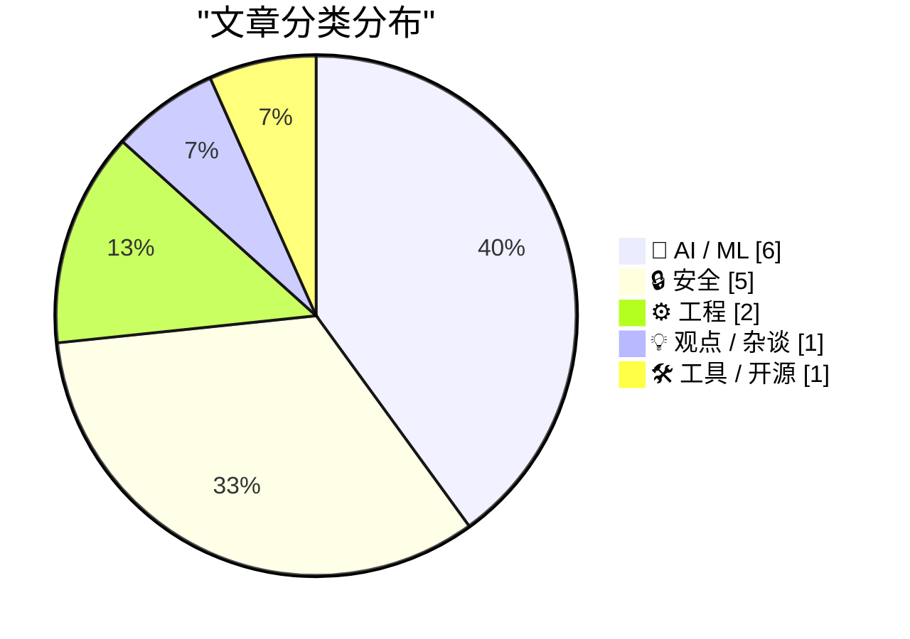
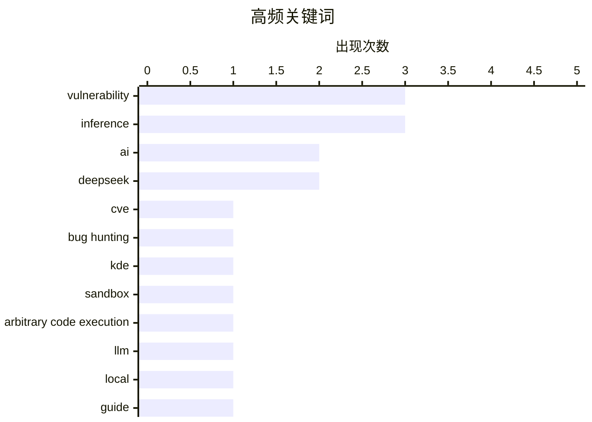

# 📰 AI 资讯每日精选 — 2026-07-04

> 汇聚 140+ 技术博客、X/Twitter、Hacker News、Reddit、Product Hunt、
> Lobste.rs、ClawFeed 日报及 GitHub Trending，经 AI 评分筛选。
>
> **本期内容**：🏆 今日必读 · 🌐 ClawFeed 日报 · 🔥 GitHub Trending · 📂 分类精选 · 🎨 设计与生成式 AI · 📊 数据概览

## 📝 今日看点

今日技术圈呈现两大焦点：AI安全与性能的双重爆发。一方面，AI驱动的漏洞挖掘导致安全报告激增三倍，同时Pegasus间谍软件入侵欧洲议会、KDE与Guix相继曝出高危漏洞，表明从企业到开源生态的安全防线正面临前所未有的压力。另一方面，DeepSeek发布DSpark推理速度突破，本地运行SOTA大模型的指南与集群部署实践同步涌现，AI智能体能力被低估的发现也引发对评估标准的反思。此外，ClickHouse在可观测性领域的胜出，则标志着工程基础设施正加速向实时、大规模分析演进。

---

## 🏆 今日必读

🥇 **自AI模型开始搜寻漏洞以来，安全漏洞报告数量激增**

[Security vulnerability reports have exploded since AI models started hunting for bugs](https://the-decoder.com/security-vulnerability-reports-have-exploded-since-ai-models-started-hunting-for-bugs/) — The Decoder · 8 小时前 · 🔒 安全

> Epoch AI报告显示，安全漏洞报告数量出现急剧增长。2026年6月，21家组织报告了约1500个高严重性和关键性的CVE漏洞，是此前月度记录的三倍多。这一激增与AI驱动的漏洞搜寻项目的启动时间点高度吻合。AI工具正在显著改变网络安全领域的攻防态势，使得漏洞发现的速度和规模都达到了前所未有的水平。

💡 **为什么值得读**: 用具体数据（1500个CVE、3.5倍增长）直观展示了AI对网络安全领域的颠覆性影响，是了解AI安全应用现状的关键参考。

🏷️ AI, vulnerability, CVE, bug hunting

🥈 **KDE Plasma中的沙箱逃逸与任意代码执行漏洞**

[Arbitrary code execution breaking sandboxes in KDE Plasma](https://blog.kimiblock.top/2026/07/01/arbitrary-code-execution-in-kde-plasma/) — Lobste.rs · 22 小时前 · 🔒 安全

> 文章披露了KDE Plasma桌面环境中存在的一个严重安全漏洞，攻击者可以利用该漏洞实现沙箱逃逸并执行任意代码。该漏洞影响了KDE Plasma的多个版本，对使用该桌面环境的Linux用户构成直接威胁。漏洞的具体细节和利用方式在博客中进行了技术性分析。

💡 **为什么值得读**: 对于所有KDE Plasma用户和Linux安全研究人员来说，这是必须立即关注的高危漏洞预警，涉及沙箱逃逸这一核心安全机制。

🏷️ KDE, sandbox, arbitrary code execution, vulnerability

🥉 **Jamesob的本地运行SOTA大语言模型指南**

[Jamesob's guide to running SOTA LLMs locally](https://github.com/jamesob/local-llm) — Hacker News Best · 10 小时前 · 🤖 AI / ML

> 这是一份详尽的GitHub指南，旨在帮助用户在本地硬件上运行当前最先进（SOTA）的大语言模型。指南涵盖了模型选择、量化技术、推理框架（如llama.cpp）的配置以及性能调优等关键步骤。它提供了从硬件需求到具体命令行操作的完整流程，目标是让非专业人士也能在消费级GPU上运行强大的开源模型。

💡 **为什么值得读**: 这是目前最实用的本地LLM部署实操手册之一，对于希望摆脱API依赖、实现数据隐私保护和离线使用的开发者与爱好者极具价值。

🏷️ LLM, local, inference, guide

4️⃣ **消息人士称，阿里巴巴因涉嫌后门风险将在工作场所禁用Claude Code**

[Alibaba to ban Claude Code in workplace over alleged backdoor risks, source says](https://www.reuters.com/world/china/alibaba-ban-claude-code-workplace-over-alleged-backdoor-risks-source-says-2026-07-03/) — Hacker News Best · 16 小时前 · 🔒 安全

> 据路透社援引消息人士报道，阿里巴巴计划在其工作场所禁止使用Anthropic公司的AI编程工具Claude Code。禁令的原因是阿里巴巴安全团队认为该工具存在“后门”风险，可能导致公司内部代码和敏感数据泄露。此举反映了大型科技公司在引入外部AI工具时对数据安全和供应链安全的高度警惕。

💡 **为什么值得读**: 该事件揭示了AI工具在企业级应用中面临的核心安全与信任挑战，对理解AI监管和企业数据安全策略有重要参考意义。

🏷️ Alibaba, Claude Code, backdoor, ban

5️⃣ **DeepSeek发布重大突破DSpark，速度远超MTP**

[Deepseek drops another HUGE breakthrough - DSpark. Waaay faster than MTP [Video explaining it]](https://www.reddit.com/r/LocalLLaMA/comments/1um9j5q/deepseek_drops_another_huge_breakthrough_dspark/) — r/LocalLLaMA · 15 小时前 · 🤖 AI / ML

> DeepSeek发布了名为DSpark的新技术突破，据称其推理速度远超此前备受关注的Multi-Token Prediction (MTP)技术。一篇视频解析详细介绍了DSpark的工作原理，认为这可能是大模型推理效率领域的一次巨大变革。该技术有望显著降低推理延迟和成本，对本地部署和实时应用场景影响深远。

💡 **为什么值得读**: DeepSeek作为开源模型领域的领军者，其DSpark技术可能重新定义LLM推理效率的标杆，是关注模型架构和性能优化的必读信息。

🏷️ DeepSeek, DSpark, inference, breakthrough

---

## 🌐 ClawFeed 日报精选

> 来源：[ClawFeed](https://clawfeed.kevinhe.io) — AI 驱动的多源新闻聚合

📅 ClawFeed 日报 | 2026-07-03 (Thu)

覆盖 5 期 4h digest（#780–#784），时段 00:00–19:59 SGT。20:00–23:59 期尚未生成。

---

## 🔥 当日 Top 5

1. **Browser Use CLI 3.0 发布** — 体积缩小 6 倍、token 消耗大幅下降，通过 Chrome CDP 协议直接操作浏览器，可作为 skill 装进 Claude Code / Codex。Agent 工具链基础层正在重构。(#784)
   https://x.com/xiaohu/status/2072987979979837620

2. **Microsoft "Frontier Co" $2.5B + 6,000 工程师** — Microsoft/Amazon/OpenAI/Anthropic 全部入场 Palantir 式企业 AI 落地赛道。Aaron Levie 评论：企业 AI 部署远不止 chatbot，需要真正对齐底层业务流程。(#782 #784)
   https://x.com/levie/status/2072875685811716182

3. **Cognition Devin Security Swarm** — 基于 "Agentic MapReduce" 架构扫描复杂代码库漏洞，Levie 跟进：这正是未来需要 100X 推理算力的缩影——swarm 将指数级放大处理大数据任务的算力需求。(#784)
   https://x.com/levie/status/2072519377371459836

4. **ElevenLabs $2M pre-seed → $11B 估值，三年，$780M+ 融资** — a16z/ICONIQ/Sequoia/Nat Friedman，原始 seed deck 公开。语音 AI 赛道标杆融资路径。(#782)
   https://x.com/Collateral_com/status/2072387293587898768

5. **Elvis Fable 5 /goal + Loss Functions 实战 Playbook** — "99% 的人用 /goal 和 loops 都用错了"——30 小时用一条 prompt 提炼产品的完整方法论。核心观点：顶级 agentic 工程师精确定义 loss function 让 agent 在循环中收敛。418 likes / 100K views。(#781)
   https://x.com/elvissun/status/2072728995532255669

---

## 📰 当日核心主题

**1. Agent 工具链重构**
Browser Use CLI 3.0（CDP 直控）、archify 架构图生成 skill（#780 #781 持续传播 129K views）——agent 操作浏览器和可视化文档的基础能力正在从"封装 API"转向"原生协议"。

**2. 企业 AI 落地赛道加速**
Microsoft Frontier Co $2.5B、Levie 反复评论企业 AI 部署复杂度——从 chatbot 到 business process alignment，巨头和创业公司在同一赛道竞争。

**3. Agent 架构范式**
Devin Security Swarm（Agentic MapReduce）、Raft "We build Raft entirely in Raft" 自举、BruceGuai Matrix Agent OS 深度拆解——"一个超级 agent 扛所有" 正在让位给有分工有问责的 agent 组织。

**4. 融资与估值信号**
ElevenLabs $11B（语音 AI）、DoveyWanCN 披露 Google 内部视角（TPU 自研 vs GPU 采购、广告业务 AI-native）——资本在往哪走，底层架构在怎么变。

**5. 推理基础设施**
RunInfra beta（YC F26）——推理侧 DevOps 抽象层，描述 use case 自动完成 kernel/量化/serverless 部署。Google TPU 战略。

---

## 🔖 Bookmarks 精选

全天无新增收藏，维持两条长期标注：
- @Av1dlive — Claude for Finance 讲座（808K+ views），金融 x AI 工具化实操标杆
- @BruceGuai — Matrix Agent 架构拆解，harness 工程 > 单模型能力

---

## 👀 推荐关注汇总

- **@runinfrai** (RunInfra YC F26) — 推理基础设施自动优化方向，刚上 beta
- **@BruceGuai** — Agent 架构工程深度输出，中文 AI 圈少有的 harness 级别思考者

*上述未验证是否已关注，操作前请先在 Following 搜索确认。*

---

## 💤 当日噪音模式

- **Bookmarks 停滞**：连续多期完全相同（Av1dlive + BruceGuai），无新增——可能需要调整收藏习惯或扩大 monitoring 范围
- **Feed 薄 + 重复**：凌晨/上午/午间三个时段（#780 #781 #783）feed 条数极少（各 3 条），大量内容为前期持续传播
- **币圈 spam**：@Soft6161 DeFi 付费推广，已过滤
- **非 AI 噪音**：caterpillarous Steve Jobs 感怀、AmandaAskell 球赛吐槽——与 AI/tech 无信号价值

---

聚合自 4h digest: #780, #781, #782, #783, #784---

## 🔥 GitHub Trending

> 今日热门开源项目（全语言 + Python）

| # | 项目 | 描述 | ⭐ 总星 | 📈 今日 | 语言 |
|---|------|------|---------|---------|------|
| 1 | [JuliusBrussee/caveman](https://github.com/JuliusBrussee/caveman) 🤖 | 🪨 why use many token when few token do trick — Claude Co... | 82.9k | +2863 | JavaScript |
| 2 | [usestrix/strix](https://github.com/usestrix/strix) 🤖 | Open-source AI penetration testing tool to find and fix y... | 34.6k | +2803 | Python |
| 3 | [obra/superpowers](https://github.com/obra/superpowers) | An agentic skills framework & software development method... | 245.5k | +1209 | Shell |
| 4 | [msitarzewski/agency-agents](https://github.com/msitarzewski/agency-agents) 🤖 | A complete AI agency at your fingertips - From frontend w... | 126.5k | +1208 | Shell |
| 5 | [facebook/astryx](https://github.com/facebook/astryx) 🤖 | An open source design system that's fully customizable an... | 4.6k | +885 | TypeScript |
| 6 | [harvard-edge/cs249r_book](https://github.com/harvard-edge/cs249r_book) 🤖 | Machine Learning Systems | 26.2k | +793 | Python |
| 7 | [openai/codex-plugin-cc](https://github.com/openai/codex-plugin-cc) 🤖 | Use Codex from Claude Code to review code or delegate tasks. | 23.2k | +634 | JavaScript |
| 8 | [langflow-ai/langflow](https://github.com/langflow-ai/langflow) 🤖 | Langflow is a powerful tool for building and deploying AI... | 151.1k | +531 | Python |
| 9 | [ogulcancelik/herdr](https://github.com/ogulcancelik/herdr) 🤖 | agent multiplexer that lives in your terminal. | 10.8k | +478 | Rust |
| 10 | [HKUDS/Vibe-Trading](https://github.com/HKUDS/Vibe-Trading) 🤖 | "Vibe-Trading: Your Personal Trading Agent" | 17.7k | +464 | Python |
| 11 | [agentskills/agentskills](https://github.com/agentskills/agentskills) 🤖 | Specification and documentation for Agent Skills | 22.0k | +406 | Python |
| 12 | [ChromeDevTools/chrome-devtools-mcp](https://github.com/ChromeDevTools/chrome-devtools-mcp) | Chrome DevTools for coding agents | 45.5k | +405 | TypeScript |
| 13 | [pytorch/pytorch](https://github.com/pytorch/pytorch) 🤖 | Tensors and Dynamic neural networks in Python with strong... | 101.4k | +293 | Python |
| 14 | [rommapp/romm](https://github.com/rommapp/romm) | A beautiful, powerful, self-hosted rom manager and player. | 9.8k | +239 | Python |
| 15 | [anthropics/claude-code](https://github.com/anthropics/claude-code) 🤖 | Claude Code is an agentic coding tool that lives in your ... | 135.8k | +221 | Python |

---

## 🤖 AI / ML

### 1. Jamesob的本地运行SOTA大语言模型指南

[Jamesob's guide to running SOTA LLMs locally](https://github.com/jamesob/local-llm) — **Hacker News Best** · 10 小时前 · ⭐ 26/30

> 这是一份详尽的GitHub指南，旨在帮助用户在本地硬件上运行当前最先进（SOTA）的大语言模型。指南涵盖了模型选择、量化技术、推理框架（如llama.cpp）的配置以及性能调优等关键步骤。它提供了从硬件需求到具体命令行操作的完整流程，目标是让非专业人士也能在消费级GPU上运行强大的开源模型。

🏷️ LLM, local, inference, guide

---

### 2. DeepSeek发布重大突破DSpark，速度远超MTP

[Deepseek drops another HUGE breakthrough - DSpark. Waaay faster than MTP [Video explaining it]](https://www.reddit.com/r/LocalLLaMA/comments/1um9j5q/deepseek_drops_another_huge_breakthrough_dspark/) — **r/LocalLLaMA** · 15 小时前 · ⭐ 26/30

> DeepSeek发布了名为DSpark的新技术突破，据称其推理速度远超此前备受关注的Multi-Token Prediction (MTP)技术。一篇视频解析详细介绍了DSpark的工作原理，认为这可能是大模型推理效率领域的一次巨大变革。该技术有望显著降低推理延迟和成本，对本地部署和实时应用场景影响深远。

🏷️ DeepSeek, DSpark, inference, breakthrough

---

### 3. 英国AI安全研究所发现，标准基准测试系统性低估了AI智能体的实际能力

[UK's AI Security Institute finds standard benchmarks systematically underestimate what AI agents can actually do](https://the-decoder.com/uks-ai-security-institute-finds-standard-benchmarks-systematically-underestimate-what-ai-agents-can-actually-do/) — **The Decoder** · 9 小时前 · ⭐ 25/30

> 英国AI安全研究所（AISI）的一项研究覆盖了七个基准测试，结果表明，由于限制了计算预算（token预算），标准的AI评估方法系统性低估了AI智能体的真实能力。在软件工程任务中，当token预算增加十倍时，成功率提升了约25%。AISI指出，根据token预算的不同，前沿模型的实际能力进步速度比此前测量结果陡峭约60%。

🏷️ AI agents, benchmarks, capabilities, evaluation

---

### 4. 开源AI差距地图

[Open Source AI Gap Map](https://simonwillison.net/2026/Jul/3/open-source-ai-gap-map/#atom-everything) — **simonwillison.net** · 3 小时前 · ⭐ 24/30

> Current AI是一个在2025年2月巴黎AI行动峰会上成立的非营利组织，已获得4亿美元承诺资金，旨在构建“AI公共选项”。该组织近日发布了“差距地图”（Gap Map）v0.1版，试图系统性地索引当前开源AI生态中存在的空白和不足。该地图通过可视化方式展示开源AI在基础设施、数据、模型、工具链等关键环节与闭源方案之间的差距。其核心目标是帮助社区和资助者识别最需要投入的领域，从而加速开源AI的发展。

🏷️ Open Source, AI, non-profit, policy

---

### 5. Mistral发布Leanstral-1.5-119B-A6B模型

[Mistral released Leanstral-1.5-119B-A6B](https://www.reddit.com/r/LocalLLaMA/comments/1umgdhx/mistral_released_leanstral15119ba6b/) — **r/LocalLLaMA** · 10 小时前 · ⭐ 24/30

> Mistral发布了Leanstral 1.5模型，参数规模为119B但仅激活6B（119B-A6B），采用Apache-2.0开源协议。该模型是Mistral在MoE（混合专家）架构上的最新成果，旨在以极低的推理成本实现接近大模型的性能。Leanstral 1.5延续了Mistral一贯的开源策略，允许商业使用和自由修改。社区关注点在于其实际推理速度、显存占用以及与小尺寸密集模型的对比表现。

🏷️ Mistral, Leanstral, MoE, model

---

### 6. 实测跟进：DeepSeek V4 Flash在2x RTX PRO 6000上完成真实编程任务的速度超过Sonnet和Opus，质量接近Sonnet

[Follow-up: DeepSeek V4 Flash on 2x RTX PRO 6000 finishes real coding tasks faster than Sonnet and Opus, at about Sonnet quality](https://www.reddit.com/r/LocalLLaMA/comments/1um84bd/followup_deepseek_v4_flash_on_2x_rtx_pro_6000/) — **r/LocalLLaMA** · 17 小时前 · ⭐ 24/30

> 用户实测报告显示，DeepSeek V4 Flash模型在双路RTX PRO 6000（共96GB显存）的本地部署环境下，完成真实编程任务的速度超过了Claude Sonnet和Opus。在代码质量评估上，DeepSeek V4 Flash的表现与Sonnet相当，略低于Opus。该测试验证了本地部署的大模型在延迟敏感型编程任务中，可以超越顶级云端闭源模型。这一结果对追求低延迟、数据隐私和成本控制的开发者具有重要参考价值。

🏷️ DeepSeek, local-LLM, coding, benchmark

---

## 🔒 安全

### 7. 自AI模型开始搜寻漏洞以来，安全漏洞报告数量激增

[Security vulnerability reports have exploded since AI models started hunting for bugs](https://the-decoder.com/security-vulnerability-reports-have-exploded-since-ai-models-started-hunting-for-bugs/) — **The Decoder** · 8 小时前 · ⭐ 27/30

> Epoch AI报告显示，安全漏洞报告数量出现急剧增长。2026年6月，21家组织报告了约1500个高严重性和关键性的CVE漏洞，是此前月度记录的三倍多。这一激增与AI驱动的漏洞搜寻项目的启动时间点高度吻合。AI工具正在显著改变网络安全领域的攻防态势，使得漏洞发现的速度和规模都达到了前所未有的水平。

🏷️ AI, vulnerability, CVE, bug hunting

---

### 8. KDE Plasma中的沙箱逃逸与任意代码执行漏洞

[Arbitrary code execution breaking sandboxes in KDE Plasma](https://blog.kimiblock.top/2026/07/01/arbitrary-code-execution-in-kde-plasma/) — **Lobste.rs** · 22 小时前 · ⭐ 27/30

> 文章披露了KDE Plasma桌面环境中存在的一个严重安全漏洞，攻击者可以利用该漏洞实现沙箱逃逸并执行任意代码。该漏洞影响了KDE Plasma的多个版本，对使用该桌面环境的Linux用户构成直接威胁。漏洞的具体细节和利用方式在博客中进行了技术性分析。

🏷️ KDE, sandbox, arbitrary code execution, vulnerability

---

### 9. 消息人士称，阿里巴巴因涉嫌后门风险将在工作场所禁用Claude Code

[Alibaba to ban Claude Code in workplace over alleged backdoor risks, source says](https://www.reuters.com/world/china/alibaba-ban-claude-code-workplace-over-alleged-backdoor-risks-source-says-2026-07-03/) — **Hacker News Best** · 16 小时前 · ⭐ 26/30

> 据路透社援引消息人士报道，阿里巴巴计划在其工作场所禁止使用Anthropic公司的AI编程工具Claude Code。禁令的原因是阿里巴巴安全团队认为该工具存在“后门”风险，可能导致公司内部代码和敏感数据泄露。此举反映了大型科技公司在引入外部AI工具时对数据安全和供应链安全的高度警惕。

🏷️ Alibaba, Claude Code, backdoor, ban

---

### 10. 针对欧洲议会的间谍活动：调查间谍软件委员会成员遭Pegasus入侵

[Espionage Against the European Parliament: Member of Committee Investigating Spyware Hacked with Pegasus](https://citizenlab.ca/research/member-of-committee-investigating-spyware-hacked-with-pegasus/) — **Lobste.rs** · 2 小时前 · ⭐ 26/30

> 公民实验室（Citizen Lab）的研究揭露了一起严重的间谍软件攻击事件：欧洲议会一个负责调查间谍软件问题的委员会成员，其手机被以色列NSO集团开发的Pegasus间谍软件入侵。这一发现表明，即使是调查网络间谍活动的最高级别机构，其成员也无法幸免于国家级间谍软件的威胁，凸显了Pegasus等商业间谍软件对民主制度的侵蚀。

🏷️ Pegasus, spyware, European Parliament, espionage

---

### 11. ‘guix substitute’ 和 ‘guix pull’ 命令存在安全漏洞

[‘guix substitute‘ and ‘guix pull‘ vulnerabilities](https://guix.gnu.org/en/blog/2026/guix-substitute-pull-vulnerabilities/) — **Lobste.rs** · 18 小时前 · ⭐ 26/30

> GNU Guix官方博客披露了其包管理器中的两个关键安全漏洞，分别涉及`guix substitute`和`guix pull`命令。这些漏洞可能允许攻击者在用户更新或安装软件包时执行恶意代码或破坏系统完整性。Guix项目团队已发布修复补丁，并强烈建议所有用户立即更新其系统。

🏷️ Guix, vulnerability, substitute, pull

---

## ⚙️ 工程

### 12. 后续：在四台DGX Spark上运行GLM-5.2 NVFP4——MTP之谜已解，128K上下文下速度达~24 tok/s

[Follow-up: GLM-5.2 NVFP4 on four DGX Sparks — the MTP mystery is solved, and it's now ~24 tok/s at 128K context](https://www.reddit.com/r/LocalLLaMA/comments/1um6pea/followup_glm52_nvfp4_on_four_dgx_sparks_the_mtp/) — **r/LocalLLaMA** · 18 小时前 · ⭐ 25/30

> 这是一篇关于在四台DGX Spark集群上运行GLM-5.2模型（NVFP4量化版本）的后续报告。作者解决了此前遇到的MTP（多Token预测）性能问题，成功在128K长上下文下实现了约24 tok/s的推理速度，同时解决了之前128K上下文与高速度不可兼得的痛点。该结果展示了通过硬件集群和模型优化实现高效本地推理的可行性。

🏷️ GLM, NVFP4, DGX-Spark, inference

---

### 13. ClickHouse正在赢得可观测性之战

[Clickhouse is winning the Observability Wars](https://matduggan.com/clickhouse-is-winning-the-observability-wars/) — **Lobste.rs** · 19 小时前 · ⭐ 25/30

> 文章论证了ClickHouse为何在可观测性领域（日志、指标、追踪）的数据库选型中胜出。它分析了ClickHouse在列式存储、实时查询性能和压缩率方面的核心优势，使其成为处理海量可观测性数据的理想选择。文章指出，越来越多的头部可观测性平台（如Grafana、Datadog的底层组件）正在转向或基于ClickHouse构建，这标志着它已成为该领域的事实标准。

🏷️ ClickHouse, observability, database, monitoring

---

## 💡 观点 / 杂谈

### 14. ★ Claude的Electron Mac应用糟糕透顶，原来是内部人干的

[★ Claude’s Criminally Bad Electron Mac App Is an Inside Job](https://daringfireball.net/2026/07/claudes_criminally_bad_mac_app_is_an_inside_job) — **daringfireball.net** · 3 小时前 · ⭐ 24/30

> 文章尖锐批评了Claude的Mac桌面应用，指出其基于Electron框架构建是导致性能差、体验糟糕的根本原因。作者发现，Claude应用的主要开发者Felix Rieseberg恰好是Electron框架的联合创始人和核心维护者。文章讽刺地比喻：这就像发现一栋楼里所有螺丝都被锤子砸进墙里，而负责施工的人恰好是全世界最大锤子制造商的创始人。作者的核心观点是，这种利益冲突导致Claude用户被迫忍受一个本可以做得更好的原生应用。

🏷️ Claude, Electron, app performance, critique

---

## 🛠 工具 / 开源

### 15. [audio.cpp] GGML的声音——原生C++/GGML实现ACE-Step、Stable Audio、HeartMuLa、RoFormer、HTDemucs，10分钟音乐60秒生成

[[audio.cpp] The Sound of GGML — C++/GGML native ACE-Step, Stable Audio, HeartMuLa, RoFormer, HTDemucs released. 10-Minute Music in 60 Seconds!](https://www.reddit.com/r/LocalLLaMA/comments/1um2tbf/audiocpp_the_sound_of_ggml_cggml_native_acestep/) — **r/LocalLLaMA** · 22 小时前 · ⭐ 24/30

> audio.cpp项目发布了基于C++和GGML原生实现的多个音频生成模型，包括ACE-Step、Stable Audio、HeartMuLa、RoFormer和HTDemucs。这些模型完全脱离Python和PyTorch依赖，可在CPU或低端GPU上高效运行。项目宣称可将10分钟的音乐生成任务压缩至60秒内完成，性能提升约10倍。该方案延续了llama.cpp的生态理念，将大模型推理能力扩展到音频生成领域，支持本地化、低延迟的音乐和音频处理。

🏷️ audio.cpp, GGML, music-generation, C++

---

## 🎨 Design & Generative AI

### 🌍 世界模型 / 3D

- **[微世界——AMD打造的可交互动作控制世界模型](https://www.reddit.com/r/LocalLLaMA/comments/1umey6p/microworld_actioncontrolled_interactive_world/)** — r/LocalLLaMA · 11 小时前
  > AMD发布了一种支持动作控制的交互式世界模型，用于模拟和响应环境变化。

### 🎬 生成式视频

- **[中国AI视频生成器Kling融资20亿美元，筹备香港IPO](https://the-decoder.com/chinese-ai-video-maker-kling-raises-2-billion-as-it-gears-up-for-hong-kong-ipo/)** — The Decoder · 16 小时前
  > 快手旗下AI视频部门Kling从投资者处筹集约20亿美元，为香港上市做准备。

---

## 📊 数据概览

| 扫描源 | 抓取文章 | 时间范围 | 精选 |
|:---:|:---:|:---:|:---:|
| 92/140 | 3812 篇 → 72 篇 | 24h | **15 篇** |

### 分类分布



### 高频关键词



<details>
<summary>📈 纯文本关键词图（终端友好）</summary>

```
vulnerability            │ ████████████████████ 3
inference                │ ████████████████████ 3
ai                       │ █████████████░░░░░░░ 2
deepseek                 │ █████████████░░░░░░░ 2
cve                      │ ███████░░░░░░░░░░░░░ 1
bug hunting              │ ███████░░░░░░░░░░░░░ 1
kde                      │ ███████░░░░░░░░░░░░░ 1
sandbox                  │ ███████░░░░░░░░░░░░░ 1
arbitrary code execution │ ███████░░░░░░░░░░░░░ 1
llm                      │ ███████░░░░░░░░░░░░░ 1
```

</details>

### 🏷️ 话题标签

**vulnerability**(3) · **inference**(3) · **ai**(2) · deepseek(2) · cve(1) · bug hunting(1) · kde(1) · sandbox(1) · arbitrary code execution(1) · llm(1) · local(1) · guide(1) · alibaba(1) · claude code(1) · backdoor(1) · ban(1) · dspark(1) · breakthrough(1) · pegasus(1) · spyware(1)

---

*生成于 2026-07-04 01:16 | 汇聚 140 个技术博客、X/Twitter、Hacker News、Reddit、Product Hunt、Lobste.rs、ClawFeed 日报及 GitHub Trending，经 AI 评分筛选出 Top 15 精华内容*
