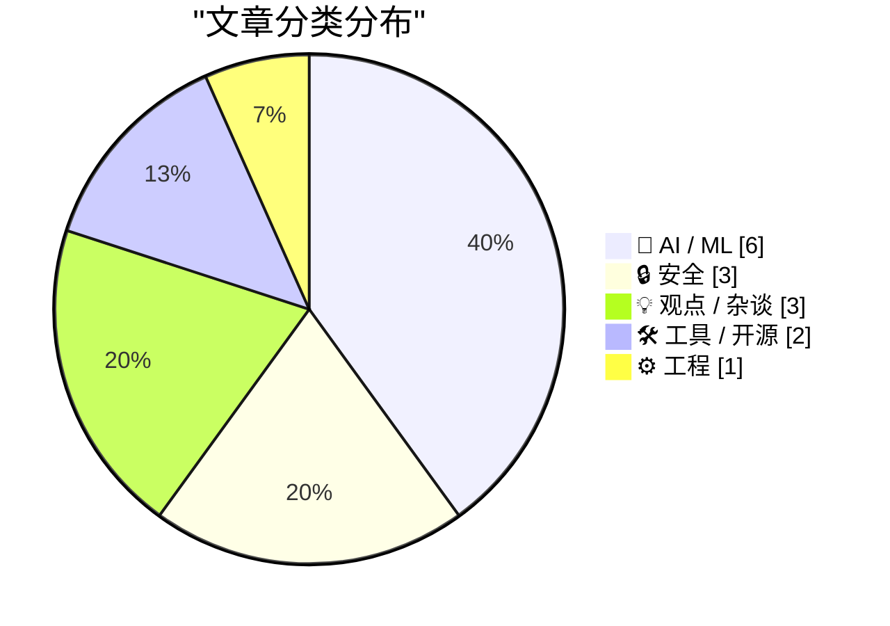
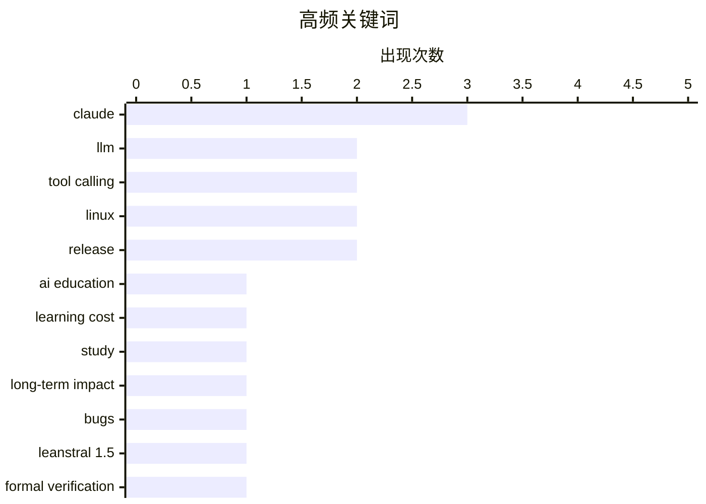

# 📰 AI 资讯每日精选 — 2026-07-05

> 汇聚 140+ 技术博客、X/Twitter、Hacker News、Reddit、Product Hunt、
> Lobste.rs、ClawFeed 日报及 GitHub Trending，经 AI 评分筛选。
>
> **本期内容**：🏆 今日必读 · 🌐 ClawFeed 日报 · 🔥 GitHub Trending · 📂 分类精选 · 🎨 设计与生成式 AI · 📊 数据概览

## 📝 今日看点

今日技术圈聚焦于AI工具的双刃剑效应：一方面，大规模研究揭示AI辅助学习存在隐性成本，其对学生考试表现的负面影响需两年才完全显现；另一方面，多个案例显示，更强大的AI模型反而在工具调用中暴露出更严重的幻觉与安全漏洞，如Claude新模型在编辑工具中凭空捏造数据，以及Claude Code存在会话缓存泄露风险。与此同时，开源AI在形式化验证领域取得突破，Mistral的Leanstral 1.5不仅能解数学题，还成功捕获真实代码漏洞，而OpenAI联合创始人则预言“几乎无界面”的隐形智能体未来，暗示人机交互范式正面临根本性转变。

---

## 🏆 今日必读

🥇 **一项2.6万名学生研究表明：AI的隐性学习成本需要整整两年才会显现**

[A 26,000-student study shows AI's hidden learning cost takes two full years to surface](https://the-decoder.com/a-26000-student-study-shows-ais-hidden-learning-cost-takes-two-full-years-to-surface/) — The Decoder · 16 小时前 · 🤖 AI / ML

> 一项针对超过26,000名中国学生的研究发现，使用AI辅助学习的学生虽然作业完成速度更快、分数更高，但在考试中的表现却差达24%。这种对升学考试成绩的全面负面影响大约需要两年时间才会完全显现，意味着短期研究系统性地低估了AI带来的损害。研究揭示了AI工具在短期提升效率与长期损害知识内化之间的根本矛盾。

💡 **为什么值得读**: 用大规模实证数据戳破了“AI提分”的短期幻觉，揭示了教育领域AI应用最被忽视的长期风险，对教育政策制定者和家长极具警示意义。

🏷️ AI education, learning cost, study, long-term impact

🥈 **更好的模型，更差的工具**

[Better Models: Worse Tools](https://simonwillison.net/2026/Jul/4/better-models-worse-tools/#atom-everything) — simonwillison.net · 2 小时前 · 🤖 AI / ML

> Armin Ronacher在开发Pi工具时发现一个奇怪问题：新版Claude模型（包括Opus 4.8）在调用Pi的编辑工具时，会在嵌套的`edits[]`数组中凭空捏造出不符合schema的额外字段。虽然编辑内容本身通常是正确的，但参数格式已严重偏离定义。这表明模型在工具调用行为上出现了倒退，旧模型反而表现更可靠。

💡 **为什么值得读**: 揭示了AI模型能力提升反而导致工具调用可靠性下降的反直觉现象，对依赖LLM进行自动化编程的开发者有直接警示价值。

🏷️ Claude, LLM, tool calling, bugs

🥉 **Mistral开源模型Leanstral 1.5在形式化数学基准中表现出色，并捕获真实代码漏洞**

[Mistral's open-source Leanstral 1.5 aces formal math benchmarks and catches real bugs in code](https://the-decoder.com/mistrals-open-source-leanstral-1-5-aces-formal-math-benchmarks-and-catches-real-bugs-in-code/) — The Decoder · 18 小时前 · 🤖 AI / ML

> Mistral AI发布了开源模型Leanstral 1.5，专为Lean 4形式化验证设计。该模型不仅在形式化数学基准测试中取得优异成绩，还在扫描57个开源代码仓库时发现了5个此前未知的漏洞。这标志着开源模型在形式化验证和代码可靠性领域迈出了重要一步。

💡 **为什么值得读**: 展示了开源模型在形式化验证这一高难度领域取得突破性进展，且具备发现真实世界代码漏洞的实用能力，对安全研究和数学验证社区意义重大。

🏷️ Leanstral 1.5, formal verification, Mistral, open-source

4️⃣ **泄露YouTube创作者的私密视频**

[Leaking YouTube creators' private videos](https://javoriuski.com/post/youtube) — Hacker News Best · 8 小时前 · 🔒 安全

> 文章披露了一种安全漏洞，能够导致YouTube创作者的私密视频被泄露。该问题涉及YouTube平台权限控制机制的缺陷，使得未授权用户可能访问到本应设为私密的视频内容。具体的技术细节和攻击路径在原文中有详细说明。

💡 **为什么值得读**: 直接关系到YouTube上数百万创作者的隐私安全，揭示了主流视频平台一个严重且可能被广泛利用的权限漏洞。

🏷️ YouTube, privacy, vulnerability, leak

5️⃣ **工作区实例或消费者账户之间潜在的会话/缓存泄露问题**

[Potential session/cache leakage between workspace instances or consumer accounts](https://github.com/anthropics/claude-code/issues/74066) — Hacker News Best · 11 小时前 · 🔒 安全

> Anthropic的Claude Code工具存在一个严重的安全问题（Issue #74066），可能导致不同工作区实例或消费者账户之间的会话数据或缓存发生泄露。这意味着一个用户的操作状态可能被另一个用户意外访问到，涉及多租户环境下的数据隔离失效。该问题已在GitHub上公开，并引发了广泛讨论。

💡 **为什么值得读**: 涉及AI编程工具在多用户环境下的核心数据隔离安全，对使用Claude Code的企业和团队具有紧急安全警示意义。

🏷️ session leakage, cache, Claude Code, security

---

## 🌐 ClawFeed 日报精选

> 来源：[ClawFeed](https://clawfeed.kevinhe.io) — AI 驱动的多源新闻聚合

# ClawFeed Daily Digest | 2026-07-04 (SGT)

聚合 5 期 4h digest (#787 #788 #789 #790 #791)，覆盖 00:00–19:59 SGT。20:00–23:59 期尚未生成。

---

## 🔥 当日全场最重要 5 条

1. **桥水 × Thinking Machines (Mira Murati) 联合技术报告：Qwen3-235B 私有化微调碾压闭源模型**
   金融文档筛选+央行报告解读，Accuracy 84.7%，错误率比 GPT-5 / Claude 4.8 低 29.8%。信号：企业垂直场景中，开源模型微调正在系统性超越通用闭源模型。
   来源: https://x.com/FeitengLi/status/2073046885896728625 (#787)

2. **Fable 5 autoresearch 实战报告（当日最高热度内容）**
   Superpowers 作者跑了 25 个完整实验，花费 $165，构建速度 +50%、token 开销 -60%。最有价值的不是数字，而是完整记录了每次失败和 3 个中途纠正的测量 bug——目前最完整的"用 Fable 做 autoresearch"案例参考。
   来源: https://x.com/yibie/status/2072965594484543525 (#787 #788)

3. **@trq212《A Field Guide to Fable: Finding Your Unknowns》持续爆量至 664K+ views**
   核心方法论：用 Fable 最重要的不是 prompt 技巧，而是先暴露自己的认知盲区再迭代 prompt——map is not the territory。当日从 350K 涨到 664K views，是 Jul 4 传播量最大的单条推文。
   来源: https://x.com/trq212/status/2073101078145724589 (#788 #789 #790)

4. **Agent Loop 设计模式库开源：ForwardFuture Loop Library**
   收录 20+ agent loop 设计模式（retry、reflection、planning、multi-agent 等），配套文章《20 Loop Design Patterns Every AI Engineer Should Know》166K views。对 agent 架构选型有直接工程参考价值。
   来源: https://x.com/sairahul1/status/2072749611471835229 (#789)

5. **idoubi 发布 Agent-Native 终端 Termany**
   工作区+文件树+标签栏+窗格组合，支持无限多开 Agent 对话窗口，搭建并行 Agent 集群。后续版本将加 Agent 调度、Token 统计。核心卖点："把效率瓶颈收敛到人的注意力带宽"——对标 Claude Code 多 worktree 模式但走桌面端路线。
   来源: https://x.com/idoubicc/status/2073311678440321117 (#790)

---

## 📰 当日核心主题

### 1. Fable 5 方法论井喷
当日 Fable 相关内容三连刷屏：autoresearch 实战数据 (#787 #788)、"Finding Your Unknowns" 方法论 (#788 #789 #790)、"How to build a second brain with Fable 5" (#788)。趋势：社区正从"Fable 能干嘛"转向"怎么系统性地用 Fable"——方法论贴的传播量远超功能介绍贴。

### 2. AI 之战 = Context 之战
Aaron Levie (Box CEO) 连续多期输出：Agent 有效性取决于领域专长 + 正确上下文 + 工具链组合。企业部署 AI 不是"空降 agent"，需要真正对齐底层业务流程。与 Microsoft $2.5B Frontier Co 部署公司同期出现，"deployco"正在成为一个品类。

### 3. Agent 架构工程化
- @BruceGuai Matrix Agent OS 架构详解（跨 5 期持续被引用）：不是单体 Agent 塞所有工具，而是角色分工+问责链+长期运行循环
- ForwardFuture Loop Library：20+ agent loop 设计模式开源
- @_avichawla 图解 Agent 四层工程（Prompt → Context → Harness → Loop），引用 Boris Cherny "I don't prompt Claude anymore"
- Addy Osmani "Agentic Autonomy Levels"：从 prompting 到 operating 的范式转移

### 4. 开源微调 vs 闭源通用模型
桥水×Thinking Machines 的 Qwen3-235B 微调报告是当日最大信号：企业垂直场景下，开源大模型微调正在系统性碾压闭源通用模型。小米 MiMo-V2.5 的推理优化 (Hybrid SWA) + MOPD 后训练 pipeline 被广泛采用，进一步佐证。

### 5. AI 工具链基础设施重构
- Browser Use CLI 3.0：体积缩 6 倍，作为 skill 装进 Claude Code / Codex，直接 CDP 控制浏览器
- Claude Code 前端 Skill 横评 (@vista8)：5 个流行 Skill 的实操对比
- RunInfra (YC F26)：推理基础设施自动优化平台 beta 上线

---

## 🔖 累计 bookmark 精选

以下两条 bookmark 在多期 4h digest 中被反复提及，确认为高优先级收藏：

- **@Av1dlive** — Anthropic Claude for Finance 讲座："quant AI 领域最值得的免费 1 小时"，配套文章《How I Set Up Claude Code as My Investment Research Analyst》。808K views。https://x.com/Av1dlive/status/2059273095970738264
- **@BruceGuai** — Matrix Agent 公司架构全景图：Agent OS 理念与 Zylos 多 agent 架构高度共振。https://x.com/BruceGuai/status/2070130243059495142

---

## 👀 推荐关注汇总（去重后）

| 账号 | 方向 | 推荐理由 | 来源期 |
|------|------|----------|--------|
| @idoubicc | Agent-Native 终端 | Termany 创建者，building in public，产品思路清晰 | #790 |
| @_LuoFuli | 模型架构 | 前 DeepSeek → 小米 MiMo 团队负责人，一手模型架构信息源 | #790 |
| @runinfrai | AI Infra | YC F26，推理优化平台，beta 刚上线 | #789 |
| @raft_hq | 多 Agent 协作 | 人+Agent 协作平台，方向与 COCO Workspace 有交集 | #789 |
| @BruceGuai | Agent 架构 | 中文 AI 圈少有的 harness 级别工程思考者 | #784(Jul3) |

提醒：以上未通过浏览器核实是否已关注，Kevin 操作前请先在 Following 里搜一下避免重复。

### 建议取关（去重后）

| 账号 | 理由 |
|------|------|
| @HeXiaobo | 最后发推 2018 年，超 8 年不活跃，僵尸号 |
| @0xJasonBateman | 8 followers，无 AI/tech 原创内容（注：Follows you，取关前确认私交） |
| @Soft6161 | crypto follow-for-follow / 营销帖为主，偏 spam |
| @caterpillarous | 45+ 天不活跃，内容为个人感悟非 AI/tech 方向 |
| @Tradermayne | crypto 交易/K线分析为主，非 AI builder 方向（如仍关注 crypto 交易可保留） |

---

## 💤 当日重复噪音模式

1. **算法推荐延迟/重复推送**：@trq212 的 Fable Field Guide 和 @vista8 的 Skill 横评在 #789/#790/#791 三期被重复推荐，说明 Twitter 算法在高热度帖上存在 12-24h 推送延迟。后续 4h digest 应加强去重。

2. **Bookmark 重复收录**：@Av1dlive 量化金融讲座和 @BruceGuai Matrix 架构帖在 5 期中每期都出现，因为 bookmark 列表未变。建议 4h digest 仅在 bookmark 有新增时报告。

3. **深夜/凌晨时段信号稀薄**：00:00-07:59 SGT 两期 (#787 #788) feed 仅各 3 条，噪声比偏高。非异常——美西时段 feed 自然稀薄。

4. **FollowingSample 重复评估**：多期对同一组 8 个样本账号重复评估（levie/raft_hq/runinfrai 等），建议 followingSample 在同日内做去重轮换。

---

*Generated: 2026-07-04 23:59 SGT | Aggregated from 4h digests #787 #788 #789 #790 #791*
---

## 🔥 GitHub Trending

> 今日热门开源项目（全语言 + Python）

| # | 项目 | 描述 | ⭐ 总星 | 📈 今日 | 语言 |
|---|------|------|---------|---------|------|
| 1 | [usestrix/strix](https://github.com/usestrix/strix) 🤖 | Open-source AI penetration testing tool to find and fix y... | 36.1k | +1904 | Python |
| 2 | [JuliusBrussee/caveman](https://github.com/JuliusBrussee/caveman) 🤖 | 🪨 why use many token when few token do trick — Claude Co... | 84.0k | +1089 | JavaScript |
| 3 | [mattpocock/skills](https://github.com/mattpocock/skills) 🤖 | Skills for Real Engineers. Straight from my .claude direc... | 156.6k | +973 | Shell |
| 4 | [alibaba/page-agent](https://github.com/alibaba/page-agent) 🤖 | JavaScript in-page GUI agent. Control web interfaces with... | 23.1k | +742 | TypeScript |
| 5 | [openai/codex-plugin-cc](https://github.com/openai/codex-plugin-cc) 🤖 | Use Codex from Claude Code to review code or delegate tasks. | 24.5k | +718 | JavaScript |
| 6 | [Zackriya-Solutions/meetily](https://github.com/Zackriya-Solutions/meetily) 🤖 | Privacy first, AI meeting assistant with 4x faster Parake... | 15.3k | +718 | Rust |
| 7 | [ogulcancelik/herdr](https://github.com/ogulcancelik/herdr) 🤖 | agent multiplexer that lives in your terminal. | 11.5k | +707 | Rust |
| 8 | [asgeirtj/system_prompts_leaks](https://github.com/asgeirtj/system_prompts_leaks) 🤖 | Extracted system prompts from Anthropic - Claude Fable 5,... | 48.9k | +471 | JavaScript |
| 9 | [harvard-edge/cs249r_book](https://github.com/harvard-edge/cs249r_book) 🤖 | Machine Learning Systems | 26.6k | +443 | Python |
| 10 | [rommapp/romm](https://github.com/rommapp/romm) | A beautiful, powerful, self-hosted rom manager and player. | 10.2k | +398 | Python |
| 11 | [anthropics/claude-code](https://github.com/anthropics/claude-code) 🤖 | Claude Code is an agentic coding tool that lives in your ... | 136.1k | +357 | Python |
| 12 | [agentskills/agentskills](https://github.com/agentskills/agentskills) 🤖 | Specification and documentation for Agent Skills | 22.3k | +351 | Python |
| 13 | [ChromeDevTools/chrome-devtools-mcp](https://github.com/ChromeDevTools/chrome-devtools-mcp) | Chrome DevTools for coding agents | 45.8k | +304 | TypeScript |
| 14 | [immich-app/immich](https://github.com/immich-app/immich) | High performance self-hosted photo and video management s... | 105.6k | +201 | TypeScript |
| 15 | [chthollyphile/folia-major](https://github.com/chthollyphile/folia-major) | 专注于绚丽的歌词动画效果的本地音乐/navidrome/第三方网易云播放器 | 989 | +175 | TypeScript |

---

## 🤖 AI / ML

### 1. 一项2.6万名学生研究表明：AI的隐性学习成本需要整整两年才会显现

[A 26,000-student study shows AI's hidden learning cost takes two full years to surface](https://the-decoder.com/a-26000-student-study-shows-ais-hidden-learning-cost-takes-two-full-years-to-surface/) — **The Decoder** · 16 小时前 · ⭐ 26/30

> 一项针对超过26,000名中国学生的研究发现，使用AI辅助学习的学生虽然作业完成速度更快、分数更高，但在考试中的表现却差达24%。这种对升学考试成绩的全面负面影响大约需要两年时间才会完全显现，意味着短期研究系统性地低估了AI带来的损害。研究揭示了AI工具在短期提升效率与长期损害知识内化之间的根本矛盾。

🏷️ AI education, learning cost, study, long-term impact

---

### 2. 更好的模型，更差的工具

[Better Models: Worse Tools](https://simonwillison.net/2026/Jul/4/better-models-worse-tools/#atom-everything) — **simonwillison.net** · 2 小时前 · ⭐ 25/30

> Armin Ronacher在开发Pi工具时发现一个奇怪问题：新版Claude模型（包括Opus 4.8）在调用Pi的编辑工具时，会在嵌套的`edits[]`数组中凭空捏造出不符合schema的额外字段。虽然编辑内容本身通常是正确的，但参数格式已严重偏离定义。这表明模型在工具调用行为上出现了倒退，旧模型反而表现更可靠。

🏷️ Claude, LLM, tool calling, bugs

---

### 3. Mistral开源模型Leanstral 1.5在形式化数学基准中表现出色，并捕获真实代码漏洞

[Mistral's open-source Leanstral 1.5 aces formal math benchmarks and catches real bugs in code](https://the-decoder.com/mistrals-open-source-leanstral-1-5-aces-formal-math-benchmarks-and-catches-real-bugs-in-code/) — **The Decoder** · 18 小时前 · ⭐ 25/30

> Mistral AI发布了开源模型Leanstral 1.5，专为Lean 4形式化验证设计。该模型不仅在形式化数学基准测试中取得优异成绩，还在扫描57个开源代码仓库时发现了5个此前未知的漏洞。这标志着开源模型在形式化验证和代码可靠性领域迈出了重要一步。

🏷️ Leanstral 1.5, formal verification, Mistral, open-source

---

### 4. 更好的模型，更差的工具

[Better Models: Worse Tools](https://lucumr.pocoo.org/2026/7/4/better-models-worse-tools/) — **Lobste.rs** · 3 小时前 · ⭐ 25/30

> 作者在追踪Anthropic最新一代模型的工具调用行为回归问题时，发现了一个令人困惑且严重的问题。新模型（如Opus 4.8）似乎被强烈强化学习（RL）训练于其闭源的Claude Code框架上，导致当用户提供的工具声明与官方框架略有差异时，模型会生成错误的工具调用参数，而旧模型反而没有这个问题。

🏷️ LLM, tool calling, Anthropic, regression

---

### 5. Midjourney wants the Hollywood studios that sued it to show the court how they use AI

[Midjourney wants the Hollywood studios that sued it to show the court how they use AI](https://www.reddit.com/r/midjourney/comments/1un8361/midjourney_wants_the_hollywood_studios_that_sued/) — **r/midjourney** · 12 小时前 · ⭐ 23/30

> <table> <tr><td> <a href="https://www.reddit.com/r/midjourney/comments/1un8361/midjourney_wants_the_hollywood_studios_that_sued/">  Anthropic developer Thariq Shihipar argues that with Claude's new model, Fable 5, the bottleneck is no longer the model itself but the user's blind spots. He describes techniques like blindspot passes

🏷️ prompting, Claude, Fable 5, blind spots

---

## 🔒 安全

### 7. 泄露YouTube创作者的私密视频

[Leaking YouTube creators' private videos](https://javoriuski.com/post/youtube) — **Hacker News Best** · 8 小时前 · ⭐ 25/30

> 文章披露了一种安全漏洞，能够导致YouTube创作者的私密视频被泄露。该问题涉及YouTube平台权限控制机制的缺陷，使得未授权用户可能访问到本应设为私密的视频内容。具体的技术细节和攻击路径在原文中有详细说明。

🏷️ YouTube, privacy, vulnerability, leak

---

### 8. 工作区实例或消费者账户之间潜在的会话/缓存泄露问题

[Potential session/cache leakage between workspace instances or consumer accounts](https://github.com/anthropics/claude-code/issues/74066) — **Hacker News Best** · 11 小时前 · ⭐ 25/30

> Anthropic的Claude Code工具存在一个严重的安全问题（Issue #74066），可能导致不同工作区实例或消费者账户之间的会话数据或缓存发生泄露。这意味着一个用户的操作状态可能被另一个用户意外访问到，涉及多租户环境下的数据隔离失效。该问题已在GitHub上公开，并引发了广泛讨论。

🏷️ session leakage, cache, Claude Code, security

---

### 9. Bad Epoll（CVE-2026-46242）

[Bad Epoll (CVE-2026-46242)](https://github.com/J-jaeyoung/bad-epoll) — **Lobste.rs** · 6 小时前 · ⭐ 25/30

> Linux epoll机制中发现了一个编号为CVE-2026-46242的安全漏洞。该漏洞被命名为“Bad Epoll”，可能影响依赖epoll进行高性能I/O事件处理的应用程序。具体的漏洞细节、影响范围和修复方案在GitHub仓库中有详细说明。

🏷️ epoll, CVE, Linux, kernel

---

## 💡 观点 / 杂谈

### 10. 也许你应该学点东西

[Maybe you should learn something](https://www.marginalia.nu/log/a_135_learn/) — **Hacker News Best** · 21 小时前 · ⭐ 24/30

> 文章探讨了在AI时代持续学习和掌握新技能的重要性。作者认为，尽管AI工具日益强大，但个人主动学习、深入理解知识本质的价值并未降低，反而可能变得更加关键。文章鼓励读者不要过度依赖AI，而应保持好奇心和求知欲。

🏷️ learning, curiosity, career, programming

---

### 11. OpenAI联合创始人展望“几乎无界面”的未来：没人再学习软件

[OpenAI cofounder envisions "almost no interface" future where nobody learns software anymore](https://the-decoder.com/openai-cofounder-envisions-almost-no-interface-future-where-nobody-learns-software-anymore/) — **The Decoder** · 15 小时前 · ⭐ 23/30

> OpenAI联合创始人Greg Brockman承认，2023年大力推广的ChatGPT插件失败了，原因是“当时的模型还没准备好”。他设想未来将是一个由上下文感知的隐形智能体主导的“几乎无界面”世界，用户无需再学习如何使用软件。但他同时指出，OpenAI自家的Codex距离这一愿景仍有巨大差距。

🏷️ AI agents, interface, OpenAI, future vision

---

### 12. The bottleneck might be the air in the room

[The bottleneck might be the air in the room](https://blog.mikebowler.ca/2026/07/03/co2-and-decision-making/) — **Hacker News Best** · 18 小时前 · ⭐ 22/30

> Article URL: https://blog.mikebowler.ca/2026/07/03/co2-and-decision-making/
Comments URL: https://news.ycombinator.com/item?id=48783117
Points: 757
# Comments: 436

🏷️ CO2, productivity, office environment, decision making

---

## 🛠 工具 / 开源

### 13. sqlite-utils 4.0rc2：主要由Claude Fable编写（花费约149.25美元）

[sqlite-utils 4.0rc2, mostly written by Claude Fable (for about $149.25)](https://simonwillison.net/2026/Jul/5/sqlite-utils-fable/#atom-everything) — **simonwillison.net** · 23 分钟前 · ⭐ 23/30

> 作者利用Claude Fable模型辅助完成了sqlite-utils 4.0rc2版本的开发，总花费约149.25美元。整个开发过程包括从初始提示到代码生成、调试和测试，展示了AI辅助开源项目维护的可行性和成本效益。作者详细记录了与AI协作完成重大版本迭代的实践过程。

🏷️ sqlite-utils, Claude, AI-assisted, release

---

### 14. Immich v3.0.0 Released

[Immich v3.0.0 Released](https://immich.app/blog/v3.0.0-release) — **Lobste.rs** · 6 小时前 · ⭐ 23/30

> <p><a href="https://lobste.rs/s/otepg9/immich_v3_0_0_released">Comments</a></p>

🏷️ Immich, self-hosted, photo-management, release

---

## ⚙️ 工程

### 15. Explanation of everything you can see in htop/top on Linux (2019)

[Explanation of everything you can see in htop/top on Linux (2019)](https://peteris.rocks/blog/htop/) — **Hacker News Best** · 13 小时前 · ⭐ 23/30

> Article URL: https://peteris.rocks/blog/htop/
Comments URL: https://news.ycombinator.com/item?id=48784777
Points: 384
# Comments: 52

🏷️ htop, Linux, system monitoring, performance

---

## 🎨 Design & Generative AI

### 🖼️ 生成式图片

- **[Midjourney要求起诉它的好莱坞工作室向法庭展示如何使用AI](https://www.reddit.com/r/midjourney/comments/1un8361/midjourney_wants_the_hollywood_studios_that_sued/)** — r/midjourney · 12 小时前
  > Midjourney要求起诉它的好莱坞工作室在法庭上公开其AI使用方式。

- **[失落之城 #159](https://www.reddit.com/r/midjourney/comments/1un5l7x/lost_cities_159/)** — r/midjourney · 14 小时前
  > 一幅由Midjourney生成的失落城市主题图像。

- **[文艺复兴外星人](https://www.reddit.com/r/midjourney/comments/1uncbwq/renaissance_alien/)** — r/midjourney · 9 小时前
  > 一幅融合文艺复兴风格与外星人形象的Midjourney作品。

- **[火焰马提尼](https://www.reddit.com/r/midjourney/comments/1un8f7i/fiery_martini/)** — r/midjourney · 12 小时前
  > 一杯燃烧着火焰的马提尼鸡尾酒图像。

- **[特斯拉](https://www.reddit.com/r/midjourney/comments/1un03jp/tesla/)** — r/midjourney · 20 小时前
  > 一幅以特斯拉为主题的Midjourney生成图像。

- **[“雕塑”](https://www.reddit.com/r/midjourney/comments/1ungk9y/sculptures/)** — r/midjourney · 6 小时前
  > 一组由Midjourney生成的雕塑风格图像。

- **[乌达德罗战士](https://www.reddit.com/r/midjourney/comments/1umw14k/udadrow_warrior/)** — r/midjourney · 23 小时前
  > 一幅描绘乌达德罗战士的Midjourney图像。

- **[新京都的动能艺术桥（2047年大地震后重建）](https://www.reddit.com/r/midjourney/comments/1un74ch/new_kyotos_kinetic_art_bridge_after_the_great/)** — r/midjourney · 13 小时前
  > 一幅描绘未来京都重建后动能艺术桥的Midjourney图像。

- **[与屠宰场之主无和可谈](https://www.reddit.com/r/midjourney/comments/1un00zr/there_will_be_no_parley_with_lord_of_the_abattoir/)** — r/midjourney · 20 小时前
  > 一幅充满黑暗奇幻风格的Midjourney图像。

- **[悔恨之路](https://www.reddit.com/r/midjourney/comments/1unhp8w/paths_of_regret/)** — r/midjourney · 5 小时前
  > 一幅名为《悔恨之路》的Midjourney生成图像。

- **[垃圾DNA是生物涂鸦](https://www.reddit.com/r/midjourney/comments/1umy00v/junk_dna_is_biological_graffiti/)** — r/midjourney · 22 小时前
  > 一幅以生物涂鸦为主题的Midjourney图像。

- **[泳池](https://www.reddit.com/r/midjourney/comments/1unnlo7/the_pool/)** — r/midjourney · 1 小时前
  > 一幅描绘泳池场景的Midjourney图像。

- **[双人机械降神](https://www.reddit.com/r/midjourney/comments/1umxbu0/duo_deus_ex_machina/)** — r/midjourney · 22 小时前
  > 一幅展现双人机械降神主题的Midjourney图像。

- **[墨西哥城第二天](https://www.reddit.com/r/midjourney/comments/1unbj9l/cdmx_day_2/)** — r/midjourney · 10 小时前
  > 一幅记录墨西哥城第二天见闻的Midjourney图像。

- **[故障（|）](https://www.reddit.com/r/midjourney/comments/1unanki/glitch/)** — r/midjourney · 10 小时前
  > 一幅以故障艺术风格呈现的Midjourney图像。

---

## 📊 数据概览

| 扫描源 | 抓取文章 | 时间范围 | 精选 |
|:---:|:---:|:---:|:---:|
| 93/140 | 3803 篇 → 58 篇 | 24h | **15 篇** |

### 分类分布



### 高频关键词



<details>
<summary>📈 纯文本关键词图（终端友好）</summary>

```
claude           │ ████████████████████ 3
llm              │ █████████████░░░░░░░ 2
tool calling     │ █████████████░░░░░░░ 2
linux            │ █████████████░░░░░░░ 2
release          │ █████████████░░░░░░░ 2
ai education     │ ███████░░░░░░░░░░░░░ 1
learning cost    │ ███████░░░░░░░░░░░░░ 1
study            │ ███████░░░░░░░░░░░░░ 1
long-term impact │ ███████░░░░░░░░░░░░░ 1
bugs             │ ███████░░░░░░░░░░░░░ 1
```

</details>

### 🏷️ 话题标签

**claude**(3) · **llm**(2) · **tool calling**(2) · linux(2) · release(2) · ai education(1) · learning cost(1) · study(1) · long-term impact(1) · bugs(1) · leanstral 1.5(1) · formal verification(1) · mistral(1) · open-source(1) · youtube(1) · privacy(1) · vulnerability(1) · leak(1) · session leakage(1) · cache(1)

---

*生成于 2026-07-05 01:24 | 汇聚 140 个技术博客、X/Twitter、Hacker News、Reddit、Product Hunt、Lobste.rs、ClawFeed 日报及 GitHub Trending，经 AI 评分筛选出 Top 15 精华内容*
