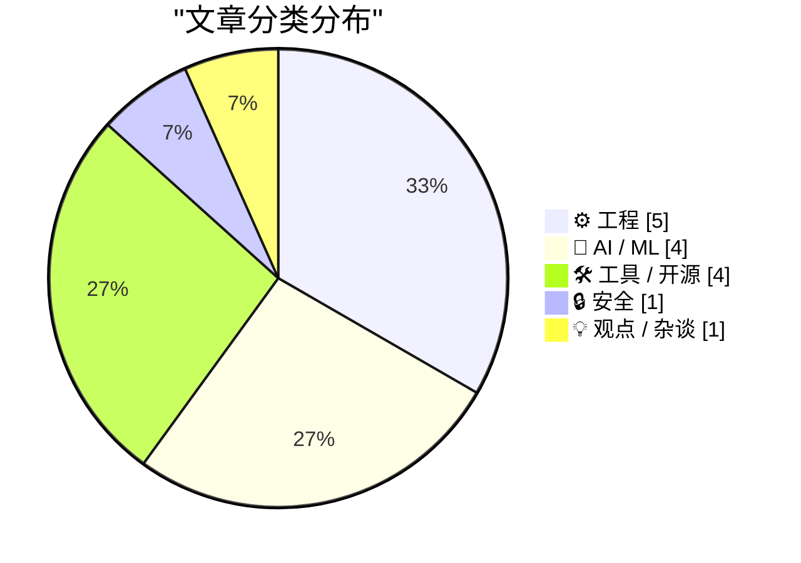
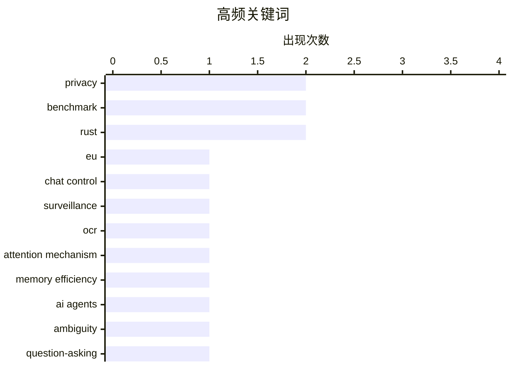

# 📰 AI 资讯每日精选 — 2026-07-06

> 汇聚 140+ 技术博客、X/Twitter、Hacker News、Reddit、Product Hunt、
> Lobste.rs、ClawFeed 日报及 GitHub Trending，经 AI 评分筛选。
>
> **本期内容**：🏆 今日必读 · 🌐 ClawFeed 日报 · 🔥 GitHub Trending · 📂 分类精选 · 🎨 设计与生成式 AI · 📊 数据概览

## 📝 今日看点

今日技术圈聚焦三大趋势：AI应用正从“能处理”向“会提问”进化，百度无限OCR突破文档处理极限，而AI搜索代理的短板暴露在模糊查询时缺乏主动澄清能力；开源与隐私保护成为工具开发的核心价值，Organic Maps与Flipper Zero等产品强调无追踪、可扩展；同时，专有AI模型的数据安全争议升温，Mistral CEO警告企业依赖封闭模型可能导致商业机密暴露，而欧盟强制扫描加密消息的立法则进一步激化了隐私与安全的全球博弈。

---

## 🏆 今日必读

🥇 **欧盟理事会通过快速通道强制推行“聊天控制”**

[EU Council forces Chat Control via fast-track](https://www.heise.de/en/news/Chat-Control-1-0-EU-Council-forces-messenger-scans-via-fast-track-11353659.html) — Hacker News Best · 13 小时前 · 🔒 安全

> 欧盟理事会正通过快速立法程序，强制要求即时通讯软件扫描用户消息以打击儿童性虐待内容。该提案绕过常规的民主审议流程，引发了关于隐私和加密通信的激烈争议。批评者认为，这种大规模扫描将破坏端到端加密，并可能被滥用于监控政治异见。文章指出，该法案一旦通过，将迫使Signal、WhatsApp等应用在加密通信中植入后门。核心结论是：欧盟以安全为名，正在以牺牲公民隐私和通信安全为代价推行监控措施。

💡 **为什么值得读**: 这是关于欧盟强制扫描加密消息的最新立法动态，直接关系到全球数亿用户的隐私安全和加密通信的未来。

🏷️ EU, chat control, surveillance, privacy

🥈 **百度“无限OCR”通过模拟人类遗忘机制，单次处理数十页文档**

[Baidu's "Unlimited OCR" processes dozens of document pages in one pass by treating memory like human forgetting](https://the-decoder.com/baidus-unlimited-ocr-processes-dozens-of-document-pages-in-one-pass-by-treating-memory-like-human-forgetting/) — The Decoder · 9 小时前 · 🤖 AI / ML

> 百度提出的“无限OCR”技术突破了传统OCR系统单次处理约10页的限制，能一次性读取数十页文档。其核心创新在于修改了注意力机制，使内存消耗不随处理页数增加而增长，模拟了人类“遗忘”不必要信息的过程。该模型目前在最重要的OCR基准测试中排名第一。这项技术解决了长文档识别中内存爆炸的瓶颈问题。

💡 **为什么值得读**: 百度用“模拟遗忘”的思路解决了OCR的内存瓶颈，技术方案新颖且效果显著，对文档数字化领域有重要参考价值。

🏷️ OCR, attention mechanism, memory efficiency, benchmark

🥉 **AI搜索代理的失败不在搜索，而在查询模糊时不会提问**

[AI search agents don't fail at searching, they fail at asking the right questions when queries get ambiguous](https://the-decoder.com/ai-search-agents-dont-fail-at-searching-they-fail-at-asking-the-right-questions-when-queries-get-ambiguous/) — The Decoder · 17 小时前 · 🤖 AI / ML

> AI搜索代理在多步研究中的失败根源并非搜索能力不足，而是当用户查询模糊时，它们不会主动要求澄清。新基准测试DiscoBench显示，那些反复搜索而不提问的模型，准确率仅为51.9%，甚至低于直接猜测的模型。表现最好的模型整体准确率也仅有43%。然而，当查询中的歧义被消除后，准确率最高可提升40个百分点。这表明，提升AI搜索代理的关键在于增强其主动澄清歧义的能力。

💡 **为什么值得读**: 该研究精准指出了当前AI搜索代理的核心短板——不会提问，并提供了量化数据，对改进搜索型AI产品设计极具启发。

🏷️ AI agents, ambiguity, benchmark, question-asking

4️⃣ **三年、十万行游戏代码后，Zig语言表现如何？**

[How is Zig working out after 3 years and 100k lines of game code?](https://www.youtube.com/watch?v=HXpUShkr2VQ) — Lobste.rs · 15 小时前 · ⚙️ 工程

> 这是一场关于Zig语言在游戏开发领域实战经验的分享，基于作者三年间编写超过10万行游戏代码的实践。演讲将深入探讨Zig在性能、内存管理、编译速度和跨平台开发方面的实际表现。内容会涉及Zig与C/C++在游戏开发中的对比，以及其无GC、无运行时开销等特性带来的具体优势与挑战。结论将给出Zig是否适合作为游戏开发主力语言的评估。

💡 **为什么值得读**: 来自一线开发者三年十万行代码的实战复盘，是评估Zig语言在游戏开发领域真实表现的最直接、最可信的参考。

🏷️ Zig, game development, experience report

5️⃣ **Mistral CEO警告：专有AI模型让实验室对你的业务流程一览无余**

[Mistral CEO Mensch says proprietary AI models give labs a front-row seat to your business processes](https://the-decoder.com/mistral-ceo-mensch-says-proprietary-ai-models-give-labs-a-front-row-seat-to-your-business-processes/) — The Decoder · 15 小时前 · 💡 观点 / 杂谈

> Mistral创始人Arthur Mensch警告企业不要依赖封闭的AI模型，声称AI实验室正在存储越来越多的客户数据，甚至在某些情况下利用这些数据与自己的客户展开竞争。虽然这一担忧有其合理性，但Mistral在性能上无法与OpenAI或Anthropic的前沿模型竞争，因此其战略重心是押注于欧盟的数字主权。文章核心观点是：选择AI供应商时，数据隐私和主权风险应与模型性能同等考量。

💡 **为什么值得读**: Mistral CEO作为竞争对手的直言警告，揭示了专有AI模型背后被忽视的数据安全与商业竞争风险，对企业选型有重要警示意义。

🏷️ proprietary AI, data privacy, vendor lock-in, Mistral

---

## 🌐 ClawFeed 日报精选

> 来源：[ClawFeed](https://clawfeed.kevinhe.io) — AI 驱动的多源新闻聚合

# ClawFeed Daily Digest | 2026-07-05 (Sat)

聚合 5 期 4h digest (#794 #795 #796 #797 #798)，覆盖 00:00–19:59 SGT。周六 + 美国独立日长周末余波，feed 全天偏薄。

---

## 🔥 当日 Top 5

1. **Fable 5 "第二大脑"教程刷屏 949K views** — @EXM7777 (Machina) 手把手教用 Fable 5 构建个人知识系统，让模型深度理解你的业务并输出差异化内容。这个 view 数说明 Fable 5 mindshare 正从开发者圈向更广泛 builder 人群扩散。
   https://x.com/EXM7777/status/2073045719020343705

2. **.claude/ 文件夹配置 = Claude Code 生产力上限，639K views** — @ArchiveExplorer "Anthropic 工程师年薪 $1.2M 靠 .claude/ 文件夹"引发讨论，社区纠正帖主是公开 repo 非内部配置，但核心观点成立：harness > model 选择。
   https://x.com/ArchiveExplorer/status/2073136973162872897

3. **@lennysan 引 Phil Chen "Career advice in the age of AI"，404K views** — AI 模型在任何能写 loss function 的事上都会变强，学校教的大多是 loss function 能覆盖的。言下之意：有价值的工作在"无法被 loss function 定义"的模糊边界上。
   https://x.com/lennysan/status/2073498491360530497

4. **Loop engineering 持续破圈，345K views** — @milesdeutscher 推广 Boris Cherny 方法："不再 prompt Claude Code，而是写 loop 让 Fable 跑"。从热议话题变成实践教程，正在形成新的 workflow 范式。
   https://x.com/milesdeutscher/status/2073143246428221562

5. **@levie (Box CEO) "AI 之战 = Context 之战"，49K+97K views** — Agent 效能取决于领域专长 + 上下文接入 + 工具配置。企业 AI 部署不是 chatbot 直接落地，需要真正对齐底层业务流程。MSFT $2.5B Frontier Co 同期佐证。
   https://x.com/levie/status/2073138135014502777

---

## 📰 当日核心主题

### 1. Fable 5 方法论 + Loop Engineering 主导全天
949K views 教程 + 345K views loop engineering + Anthropic 内部人 @trq212 实战指南 + Superpowers 6.0 速度+50%/token-60%。社区从"Fable 能干嘛"彻底转向"怎么系统性地用 Fable"。

### 2. Agent 架构思考持续深化
- @BruceGuai Matrix Agent OS 跨多期被引用：不是单体 Agent 塞所有工具，而是角色分工 + 权限隔离 + 可审计的 OS 模式
- @YuLin807 拆解 pi Agent 8 个 subAgent，发现底层四个基础工具 read/write/edit/bash 覆盖一切——大道至简
- Cloudflare 开源 Agentic Inbox：自托管邮件 + AI agent 自动回复，全栈 CF 服务

### 3. AI 时代职业重估
@lennysan 引 Phil Chen 长文 404K views：well-defined tasks 的人类溢价正在消失。@trq212 (Anthropic) 补充：模型强到一定程度后，瓶颈在人——能不能把"不确定的部分"说清楚。

### 4. 中国 AI 研究输出
@_LuoFuli (小米 MiMo) MiMo-V2.5 推理优化技术博客 + MOPD 后训练方法论文被广泛采用，138K+20K views。

---

## 🔖 Bookmark 精选

全天无新增收藏，维持两条长期标注：
- **@Av1dlive** — Claude for Finance 讲座 808K views，金融 × AI 工具化实操标杆
- **@BruceGuai** — Matrix Agent OS 架构拆解，harness 工程 > 单模型能力

---

## 👀 推荐关注汇总

本日 feed 较薄，无新推荐。持续观察中：@runinfrai (YC F26)、@raft_hq。

---

## 🧹 建议取关

| 账号 | 理由 |
|------|------|
| @caterpillarous | 近 7 周未发推，bio "comfortably numb"，无 AI/tech 内容。连续 5 期建议取关 |
| @Tradermayne | 纯 crypto 交易/prop firm 营销，561K followers 但无 AI/tech builder 信号。连续 5 期建议取关 |

---

## 💤 当日噪音模式

- **周末+假期效应极强**：5 期 digest 中 feed 条数均为 3 条（正常工作日 6-10 条），bookmarks 全天零更新
- **跨期重复率高**：lennysan/levie/milesdeutscher 同一条推文在 3+ 期 digest 中被重复收录（view 数递增但内容无增量）
- **followingSample 固定循环**：多期对同一组样本账号重复评估，节假日无新推文属正常

---

*Generated: 2026-07-05 23:59 SGT | Aggregated from 4h digests #794 #795 #796 #797 #798*---

## 🔥 GitHub Trending

> 今日热门开源项目（全语言 + Python）

| # | 项目 | 描述 | ⭐ 总星 | 📈 今日 | 语言 |
|---|------|------|---------|---------|------|
| 1 | [openai/codex-plugin-cc](https://github.com/openai/codex-plugin-cc) 🤖 | Use Codex from Claude Code to review code or delegate tasks. | 25.5k | +1532 | JavaScript |
| 2 | [Zackriya-Solutions/meetily](https://github.com/Zackriya-Solutions/meetily) 🤖 | Privacy first, AI meeting assistant with 4x faster Parake... | 17.0k | +1409 | Rust |
| 3 | [usestrix/strix](https://github.com/usestrix/strix) 🤖 | Open-source AI penetration testing tool to find and fix y... | 37.1k | +1114 | Python |
| 4 | [JuliusBrussee/caveman](https://github.com/JuliusBrussee/caveman) 🤖 | 🪨 why use many token when few token do trick — Claude Co... | 84.9k | +1052 | JavaScript |
| 5 | [asgeirtj/system_prompts_leaks](https://github.com/asgeirtj/system_prompts_leaks) 🤖 | Extracted system prompts from Anthropic - Claude Fable 5,... | 50.0k | +981 | JavaScript |
| 6 | [Leonxlnx/taste-skill](https://github.com/Leonxlnx/taste-skill) 🤖 | Taste-Skill - gives your AI good taste. stops the AI from... | 57.5k | +863 | JavaScript |
| 7 | [alibaba/page-agent](https://github.com/alibaba/page-agent) 🤖 | JavaScript in-page GUI agent. Control web interfaces with... | 23.9k | +805 | TypeScript |
| 8 | [ogulcancelik/herdr](https://github.com/ogulcancelik/herdr) 🤖 | agent multiplexer that lives in your terminal. | 12.1k | +651 | Rust |
| 9 | [facebook/astryx](https://github.com/facebook/astryx) 🤖 | An open source design system that's fully customizable an... | 5.9k | +522 | TypeScript |
| 10 | [cheahjs/free-llm-api-resources](https://github.com/cheahjs/free-llm-api-resources) 🤖 | A list of free LLM inference resources accessible via API. | 25.4k | +482 | Python |
| 11 | [immich-app/immich](https://github.com/immich-app/immich) | High performance self-hosted photo and video management s... | 106.1k | +470 | TypeScript |
| 12 | [CoplayDev/unity-mcp](https://github.com/CoplayDev/unity-mcp) 🤖 | Unity MCP acts as a bridge between AI assistants and your... | 11.9k | +414 | C# |
| 13 | [rommapp/romm](https://github.com/rommapp/romm) | A beautiful, powerful, self-hosted rom manager and player. | 10.5k | +410 | Python |
| 14 | [alirezarezvani/claude-skills](https://github.com/alirezarezvani/claude-skills) 🤖 | 337 Claude Code skills & agent skills & plugins (30+ Agen... | 20.6k | +392 | Python |
| 15 | [bradautomates/claude-video](https://github.com/bradautomates/claude-video) 🤖 | Give Claude the ability to watch any video. /watch downlo... | 3.5k | +368 | Python |

---

## ⚙️ 工程

### 1. 三年、十万行游戏代码后，Zig语言表现如何？

[How is Zig working out after 3 years and 100k lines of game code?](https://www.youtube.com/watch?v=HXpUShkr2VQ) — **Lobste.rs** · 15 小时前 · ⭐ 24/30

> 这是一场关于Zig语言在游戏开发领域实战经验的分享，基于作者三年间编写超过10万行游戏代码的实践。演讲将深入探讨Zig在性能、内存管理、编译速度和跨平台开发方面的实际表现。内容会涉及Zig与C/C++在游戏开发中的对比，以及其无GC、无运行时开销等特性带来的具体优势与挑战。结论将给出Zig是否适合作为游戏开发主力语言的评估。

🏷️ Zig, game development, experience report

---

### 2. Rust错误处理的新视角

[A Novel Look at Error Handling in Rust](https://jtjlehi.github.io/2026/06/25/novel-rust-error-handling.html) — **Lobste.rs** · 1 小时前 · ⭐ 23/30

> 文章提出了一种新颖的Rust错误处理方法，旨在解决现有`Result`和`?`操作符在复杂错误传播场景下的局限性。作者可能引入了新的抽象或模式，以简化错误类型的转换、组合和上下文附加。该方法试图在保持Rust零成本抽象和类型安全的同时，减少样板代码并提高错误处理的表达能力。核心观点是：通过重新思考错误处理的基本抽象，可以显著提升Rust代码的健壮性和可维护性。

🏷️ Rust, error handling, pattern

---

### 3. 进行中的 Rust 工作

[Work In Progress Rust](https://blog.dureuill.net/articles/wip/) — **Lobste.rs** · 7 小时前 · ⭐ 22/30

> 文章探讨了 Rust 语言在大型项目开发中“工作在进行中”（Work In Progress）状态的管理挑战。作者提出了一种基于 Git 分支和 Cargo 工作区的模块化开发方案，允许开发者在不破坏主分支稳定性的前提下并行开发多个特性。关键方案包括使用 `[patch]` 表来临时覆盖依赖，以及通过 `cfg` 属性实现条件编译。文章还对比了 feature flag 和分支策略的优劣，认为 feature flag 更适合长期维护。结论是：合理的 WIP 管理能显著减少合并冲突，提升 Rust 项目的迭代速度。

🏷️ Rust, progress, language design

---

### 4. 使用 Prolly 树实现版本控制的数据库

[Version-controlled databases using Prolly trees](https://lwn.net/Articles/1068864/) — **Lobste.rs** · 5 小时前 · ⭐ 22/30

> 文章介绍了 Prolly 树（Probabilistic B-tree）在构建版本控制数据库中的应用。Prolly 树通过概率性分页机制，使得数据在插入、删除或更新时仅需局部重写，而非全量复制，从而高效支持历史版本回溯。与传统的 Git 对象模型相比，Prolly 树在存储效率和查询性能上更优，尤其适合需要频繁分支和合并的场景。文章以 Dolt 数据库为例，展示了如何利用 Prolly 树实现类似 Git 的版本控制语义。结论是：Prolly 树为数据库版本控制提供了一种可扩展且高性能的底层数据结构。

🏷️ database, version control, Prolly trees

---

### 5. PEP 814：添加 frozendict 内置类型

[PEP 814: Add frozendict built-in type](https://vstinner.github.io/pep-814-add-frozendict-builtin-type.html) — **Lobste.rs** · 18 小时前 · ⭐ 22/30

> PEP 814 提议为 Python 添加一个不可变字典类型 `frozendict`，作为内置类型而非第三方库。该提案的核心动机是解决当前 `types.MappingProxyType` 只读但非哈希、且无法直接用于类型注解的问题。`frozendict` 将支持哈希、可序列化，并可作为字典的键或集合的元素。提案对比了 `frozendict` 与现有方案（如 `dataclasses.frozen` 和 `NamedTuple`）的适用场景，认为前者在动态配置和函数默认参数场景中更简洁。结论是：`frozendict` 能填补 Python 类型系统中不可变映射的空白，提升代码安全性和可读性。

🏷️ Python, frozendict, PEP

---

## 🤖 AI / ML

### 6. 百度“无限OCR”通过模拟人类遗忘机制，单次处理数十页文档

[Baidu's "Unlimited OCR" processes dozens of document pages in one pass by treating memory like human forgetting](https://the-decoder.com/baidus-unlimited-ocr-processes-dozens-of-document-pages-in-one-pass-by-treating-memory-like-human-forgetting/) — **The Decoder** · 9 小时前 · ⭐ 25/30

> 百度提出的“无限OCR”技术突破了传统OCR系统单次处理约10页的限制，能一次性读取数十页文档。其核心创新在于修改了注意力机制，使内存消耗不随处理页数增加而增长，模拟了人类“遗忘”不必要信息的过程。该模型目前在最重要的OCR基准测试中排名第一。这项技术解决了长文档识别中内存爆炸的瓶颈问题。

🏷️ OCR, attention mechanism, memory efficiency, benchmark

---

### 7. AI搜索代理的失败不在搜索，而在查询模糊时不会提问

[AI search agents don't fail at searching, they fail at asking the right questions when queries get ambiguous](https://the-decoder.com/ai-search-agents-dont-fail-at-searching-they-fail-at-asking-the-right-questions-when-queries-get-ambiguous/) — **The Decoder** · 17 小时前 · ⭐ 25/30

> AI搜索代理在多步研究中的失败根源并非搜索能力不足，而是当用户查询模糊时，它们不会主动要求澄清。新基准测试DiscoBench显示，那些反复搜索而不提问的模型，准确率仅为51.9%，甚至低于直接猜测的模型。表现最好的模型整体准确率也仅有43%。然而，当查询中的歧义被消除后，准确率最高可提升40个百分点。这表明，提升AI搜索代理的关键在于增强其主动澄清歧义的能力。

🏷️ AI agents, ambiguity, benchmark, question-asking

---

### 8. Claude Code和Fable 5在“几小时内”将2003年PC游戏《命令与征服》移植到原生iOS

[Claude Code and Fable 5 ported the 2003 PC game Command & Conquer to native iOS in "a few hours"](https://the-decoder.com/claude-code-and-fable-5-ported-the-2003-pc-game-command-conquer-to-native-ios-in-a-few-hours/) — **The Decoder** · 9 小时前 · ⭐ 22/30

> 一位Google DeepMind开发者使用Anthropic的Claude Code工具，在数小时内将2003年的PC游戏《命令与征服：将军 绝命时刻》移植到了iPhone和iPad上。首次构建仅耗时40分钟。整个项目的完整源代码已发布在GitHub上。这展示了AI代码生成工具在大型、复杂代码库移植和重构方面的惊人潜力。

🏷️ Claude Code, game porting, iOS, AI-assisted development

---

### 9. 好莱坞希望封禁 Seedance，但据报道也打算继续使用它

[Hollywood wants Seedance banned and reportedly also wants to keep using it](https://the-decoder.com/hollywood-wants-seedance-banned-and-reportedly-also-wants-to-keep-using-it/) — **The Decoder** · 16 小时前 · ⭐ 21/30

> 文章揭露了好莱坞对字节跳动 AI 视频工具 Seedance 的矛盾态度。一方面，因一段 AI 生成的布拉德·皮特和汤姆·克鲁斯视频走红，美国电影协会首次向一家 AI 公司发出停止侵权函，要求封禁 Seedance。另一方面，《辛普森一家》动画制片人 Joel Kuwahara 透露，多家制片厂正在“不问不说”的默契下秘密使用该工具进行前期制作。文章指出，好莱坞既恐惧 AI 对版权的冲击，又无法抗拒其在降低制作成本上的巨大潜力。核心结论是：好莱坞对 AI 工具的态度是“公开抵制，私下拥抱”，这种双重标准反映了行业在技术变革中的深层焦虑。

🏷️ AI video, copyright, Hollywood, Seedance

---

## 🛠 工具 / 开源

### 10. Organic Maps

[Organic Maps](https://organicmaps.app/) — **Hacker News Best** · 11 小时前 · ⭐ 23/30

> Organic Maps是一款完全免费、无广告、无追踪的开源离线地图应用。它基于OpenStreetMap数据，支持全球离线导航、步行、骑行和驾车路线规划。该应用不收集任何用户数据，所有功能均可在无网络连接的情况下使用。它被视为Google Maps等商业地图服务的隐私友好型替代品。

🏷️ OpenStreetMap, offline maps, privacy, FOSS

---

### 11. Flipper Zero的未来发展

[The future of Flipper Zero development](https://blog.flipper.net/future-of-flipper-zero-development/) — **Hacker News Best** · 7 小时前 · ⭐ 22/30

> Flipper Zero团队发布了其未来开发路线图，概述了硬件和软件方面的重大更新计划。文章可能涉及新的固件功能、社区驱动的开发方向、以及应对各国监管挑战的策略。团队承诺将继续保持设备的开放性和可扩展性，同时探索新的应用场景。核心信息是：Flipper Zero不会停止进化，将持续巩固其作为多功能渗透测试工具的地位。

🏷️ Flipper Zero, IoT, hacking, development

---

### 12. Shadcn/UI 默认组件库从 Radix 切换为 Base UI

[Shadcn/UI now defaults to Base UI instead of Radix](https://ui.shadcn.com/docs/changelog) — **Hacker News Best** · 20 小时前 · ⭐ 22/30

> 流行的React UI组件集合Shadcn/UI在其最新版本中，将默认的底层组件库从Radix切换为了Base UI。这一变更意味着新项目将默认使用Base UI提供的无样式、可访问的组件原语。文章解释了切换的原因，可能涉及Base UI在性能、可定制性或API设计上的优势。对于现有用户，这是一个需要关注的重要迁移变更。

🏷️ shadcn/ui, Base UI, Radix, React

---

### 13. 厌倦了“需要哪些自定义节点？”——我构建了一个免费本地工具，可自动为任何工作流生成文档

[Tired of "what custom nodes do I need?" — I built a free local tool that auto-documents any workflow](https://www.reddit.com/r/comfyui/comments/1uo5rqs/tired_of_what_custom_nodes_do_i_need_i_built_a/) — **r/comfyui** · 9 小时前 · ⭐ 22/30

> ComfyUI 用户常因分享工作流时无法清晰列出所需自定义节点而困扰。作者开发了一款名为“Workflow Documenter”的免费本地工具，能自动解析工作流 JSON 文件，提取所有节点名称、版本及依赖关系。该工具无需联网，完全在本地运行，保护用户隐私。它支持导出为 Markdown 或 HTML 格式的文档，方便直接嵌入 GitHub 或论坛帖子。作者在 Reddit 上开源了该工具，并提供了详细的安装与使用指南。核心结论是：该工具能显著降低 ComfyUI 工作流的分享门槛，提升社区协作效率。

🏷️ ComfyUI, workflow, documentation, tool

---

## 🔒 安全

### 14. 欧盟理事会通过快速通道强制推行“聊天控制”

[EU Council forces Chat Control via fast-track](https://www.heise.de/en/news/Chat-Control-1-0-EU-Council-forces-messenger-scans-via-fast-track-11353659.html) — **Hacker News Best** · 13 小时前 · ⭐ 27/30

> 欧盟理事会正通过快速立法程序，强制要求即时通讯软件扫描用户消息以打击儿童性虐待内容。该提案绕过常规的民主审议流程，引发了关于隐私和加密通信的激烈争议。批评者认为，这种大规模扫描将破坏端到端加密，并可能被滥用于监控政治异见。文章指出，该法案一旦通过，将迫使Signal、WhatsApp等应用在加密通信中植入后门。核心结论是：欧盟以安全为名，正在以牺牲公民隐私和通信安全为代价推行监控措施。

🏷️ EU, chat control, surveillance, privacy

---

## 💡 观点 / 杂谈

### 15. Mistral CEO警告：专有AI模型让实验室对你的业务流程一览无余

[Mistral CEO Mensch says proprietary AI models give labs a front-row seat to your business processes](https://the-decoder.com/mistral-ceo-mensch-says-proprietary-ai-models-give-labs-a-front-row-seat-to-your-business-processes/) — **The Decoder** · 15 小时前 · ⭐ 23/30

> Mistral创始人Arthur Mensch警告企业不要依赖封闭的AI模型，声称AI实验室正在存储越来越多的客户数据，甚至在某些情况下利用这些数据与自己的客户展开竞争。虽然这一担忧有其合理性，但Mistral在性能上无法与OpenAI或Anthropic的前沿模型竞争，因此其战略重心是押注于欧盟的数字主权。文章核心观点是：选择AI供应商时，数据隐私和主权风险应与模型性能同等考量。

🏷️ proprietary AI, data privacy, vendor lock-in, Mistral

---

## 🎨 Design & Generative AI

### 🖼️ 生成式图片

- **[自动文档工具：告别ComfyUI自定义节点困扰](https://www.reddit.com/r/comfyui/comments/1uo5rqs/tired_of_what_custom_nodes_do_i_need_i_built_a/)** — r/comfyui · 9 小时前
  > 一款免费本地工具可自动记录任何ComfyUI工作流，解决自定义节点依赖问题。

- **[ComfyUI新转换节点：支持FP16/FP8/NVFP4/INT8格式](https://www.reddit.com/r/comfyui/comments/1uo55pl/new_converter_node_for_comfyui_fp16_fp8_nvfp4/)** — r/comfyui · 9 小时前
  > 新节点实现多种精度格式转换，提升模型兼容性与效率。

- **[GGUF支持与ComfyUI动态VRAM对比：3080用户实测](https://www.reddit.com/r/comfyui/comments/1unulfp/gguf_support_and_comfy_dev_teams_take/)** — r/comfyui · 19 小时前
  > 用户反馈动态VRAM在10GB显存卡上不如GGUF方案稳定。

- **[ZIT LoRA训练：混合分辨率图像是否可行？](https://www.reddit.com/r/comfyui/comments/1unwz8d/is_it_okay_to_train_a_zit_lora_with_mixed_image/)** — r/comfyui · 16 小时前
  > 探讨使用不同分辨率图像训练ZIT LoRA的可行性与注意事项。

- **[区域提示词中如何添加LoRA？](https://www.reddit.com/r/comfyui/comments/1unyr0f/regional_prompt_with_lora/)** — r/comfyui · 14 小时前
  > 寻求在ComfyUI工作流中为每个区域提示词单独绑定LoRA的简便方法。

- **[ComfyUI一键批量漫画上色：参考色+快速一致结果](https://www.reddit.com/r/comfyui/comments/1uo52jb/comfyui_manga_colorization_with_color_reference/)** — r/comfyui · 9 小时前
  > 更新版工作流实现黑白漫画批量上色，保持色彩一致性与处理速度。

- **[开源模型vs闭源模型：GPT-4o图像生成对比Flux](https://www.reddit.com/r/comfyui/comments/1uod1bs/open_models_vs_proprietary_gpt_images_20/)** — r/comfyui · 4 小时前
  > 用户实测发现GPT-4o图像生成效果优于本地开源模型Flux Dev。

- **[Krea 2 Edit LoRA：细节增强新方法](https://www.reddit.com/r/comfyui/comments/1uobnuu/krea_2_edit_lora_detail_enhancer/)** — r/comfyui · 5 小时前
  > Ostris发布基于AI Toolkit的LoRA训练新方法，专注图像细节增强。

- **[Booru提示词生成器：首个模型发布](https://www.reddit.com/r/comfyui/comments/1uo0x5t/booru_prompt_generator/)** — r/comfyui · 12 小时前
  > 基于Nanochat训练的小模型可自动生成Booru风格提示词。

- **[最佳图像编辑节点或工作流推荐](https://www.reddit.com/r/comfyui/comments/1unxws8/image_editing/)** — r/comfyui · 15 小时前
  > 社区讨论当前最实用的ComfyUI图像编辑节点与工作流方案。

- **[Stable Diffusion新手教程：提示词与资源汇总](https://www.reddit.com/r/comfyui/comments/1uo6wmr/tutorials_list_of_all_prompts_etc/)** — r/comfyui · 8 小时前
  > 为初学者整理ComfyUI+SDXL的提示词列表、教程及入门指南。

### 🎬 生成式视频

- **[Wan 2.2逼真人物动画：你用什么工作流？](https://www.reddit.com/r/comfyui/comments/1unzid7/realistic_human_animation_with_wan_22what/)** — r/comfyui · 14 小时前
  > 用户分享使用Wan 2.2生成真实人脸视频时避免面部扭曲的逐帧处理经验。

- **[LTX 2.3音乐视频创作展示](https://www.reddit.com/r/comfyui/comments/1unq4na/ltx_23_music_video/)** — r/comfyui · 23 小时前
  > 用户分享使用LTX 2.3生成的音乐视频作品链接。

- **[SCAIL-2动画：儿童朗读视频中的卡通鸟](https://www.reddit.com/r/comfyui/comments/1unuswk/scail2_was_used_to_animate_the_cartoon_bird_in/)** — r/comfyui · 18 小时前
  > SCAIL-2技术被用于生成儿童故事朗读视频中的卡通鸟类动画。

- **[视频中替换持物人物：工作流求助](https://www.reddit.com/r/comfyui/comments/1uohmni/workflow_to_replace_a_person_holding_an_object/)** — r/comfyui · 1 小时前
  > 寻求将10秒视频中手持物体的人物替换为生成人物的ComfyUI工作流方案。

---

## 📊 数据概览

| 扫描源 | 抓取文章 | 时间范围 | 精选 |
|:---:|:---:|:---:|:---:|
| 90/140 | 3772 篇 → 57 篇 | 24h | **15 篇** |

### 分类分布



### 高频关键词



<details>
<summary>📈 纯文本关键词图（终端友好）</summary>

```
privacy             │ ████████████████████ 2
benchmark           │ ████████████████████ 2
rust                │ ████████████████████ 2
eu                  │ ██████████░░░░░░░░░░ 1
chat control        │ ██████████░░░░░░░░░░ 1
surveillance        │ ██████████░░░░░░░░░░ 1
ocr                 │ ██████████░░░░░░░░░░ 1
attention mechanism │ ██████████░░░░░░░░░░ 1
memory efficiency   │ ██████████░░░░░░░░░░ 1
ai agents           │ ██████████░░░░░░░░░░ 1
```

</details>

### 🏷️ 话题标签

**privacy**(2) · **benchmark**(2) · **rust**(2) · eu(1) · chat control(1) · surveillance(1) · ocr(1) · attention mechanism(1) · memory efficiency(1) · ai agents(1) · ambiguity(1) · question-asking(1) · zig(1) · game development(1) · experience report(1) · proprietary ai(1) · data privacy(1) · vendor lock-in(1) · mistral(1) · openstreetmap(1)

---

*生成于 2026-07-06 01:24 | 汇聚 140 个技术博客、X/Twitter、Hacker News、Reddit、Product Hunt、Lobste.rs、ClawFeed 日报及 GitHub Trending，经 AI 评分筛选出 Top 15 精华内容*
