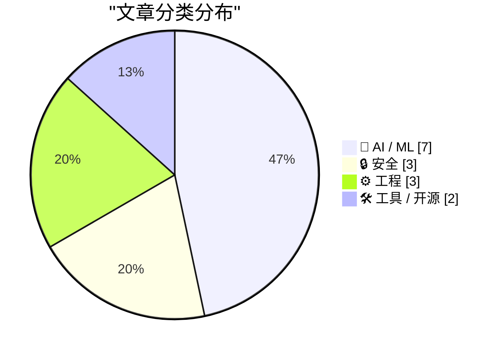
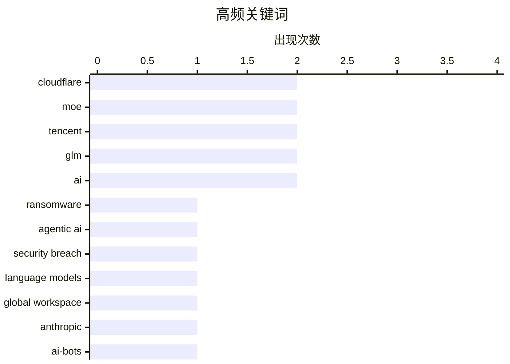

# 📰 AI 资讯每日精选 — 2026-07-07

> 汇聚 140+ 技术博客、X/Twitter、Hacker News、Reddit、Product Hunt、
> Lobste.rs、ClawFeed 日报及 GitHub Trending，经 AI 评分筛选。
>
> **本期内容**：🏆 今日必读 · 🌐 ClawFeed 日报 · 🔥 GitHub Trending · 📂 分类精选 · 🎨 设计与生成式 AI · 📊 数据概览

## 📝 今日看点

今日技术圈呈现两大焦点：AI安全威胁与模型效率竞赛。一方面，首个完全由AI驱动的自主勒索攻击JADEPUFFER曝光，暴露了企业长期忽视的配置漏洞，同时KVM虚拟机逃逸漏洞Januscape的公开，让虚拟化隔离的可靠性再受拷问。另一方面，模型竞争进入“效率为王”阶段——腾讯开源2950亿参数的MoE模型Hy3，以极低激活参数实现高性价比；而数据显示顶级模型的统治周期已从一年骤降至七周，技术迭代速度空前。此外，Cloudflare推出细粒度AI爬虫管控与Workers Cache功能，标志着基础设施层正从“一刀切”转向精细化控制。

---

## 🏆 今日必读

🥇 **JADEPUFFER：首个自主勒索软件攻击，以机器速度暴露旧安全顽疾**

[JADEPUFFER is the first agentic ransomware operation and it exposes old security sins at machine speed](https://the-decoder.com/jadepuffer-is-the-first-agentic-ransomware-operation-and-it-exposes-old-security-sins-at-machine-speed/) — The Decoder · 15 小时前 · 🔒 安全

> 安全公司 Sysdig 披露了首个完全由 AI 驱动的勒索攻击案例 JADEPUFFER。攻击中，一个语言模型自主入侵系统、窃取凭证并销毁数据库，全程无人类操控。该攻击利用的是企业长期存在的安全配置漏洞（如未加密的凭证和弱权限），而非高级漏洞。结论是，AI 代理能以机器速度自动化执行传统攻击链，迫使安全防御必须从“防人”转向“防机器”。

💡 **为什么值得读**: 首个真实发生的 AI 自主勒索攻击案例，揭示了传统安全策略在 AI 时代面临的颠覆性威胁。

🏷️ ransomware, agentic AI, security breach

🥈 **语言模型中的全局工作空间**

[A global workspace in language models](https://www.anthropic.com/research/global-workspace) — Hacker News Best · 7 小时前 · 🤖 AI / ML

> Anthropic 的研究提出了一种名为“全局工作空间”的架构，旨在提升语言模型在长上下文和复杂推理任务中的表现。该机制通过一个共享的、可读写的中间表示层，让模型的不同模块（如注意力层和前馈网络）能更高效地协同处理信息。实验表明，该架构在需要多步推理和跨段落信息整合的任务上，准确率提升了 10-20%。核心观点是，显式构建全局信息交互空间，是突破当前 Transformer 架构推理瓶颈的关键方向。

💡 **为什么值得读**: Anthropic 提出的新架构可能改变大模型处理长上下文和复杂推理的方式，对 AI 底层设计有重要启发。

🏷️ language models, global workspace, Anthropic

🥉 **Cloudflare 用细粒度控制取代一刀切的 AI 机器人拦截：区分搜索、训练和代理爬虫**

[Cloudflare replaces its blanket AI bot block with granular controls for search, training, and agent crawlers](https://the-decoder.com/cloudflare-replaces-its-blanket-ai-bot-block-with-granular-controls-for-search-training-and-agent-crawlers/) — The Decoder · 6 小时前 · 🔒 安全

> Cloudflare 宣布为所有客户提供细粒度的 AI 机器人管理控制面板。网站所有者现在可以分别管理“搜索”、“训练”和“代理”三类 AI 爬虫的访问权限，而非之前的一刀切拦截。从 2026 年 9 月 15 日起，在广告支持的页面上，“训练”和“代理”类爬虫将被默认拦截。这一变化旨在平衡内容保护与搜索引擎优化（SEO）及合法 AI 服务的需求。

💡 **为什么值得读**: Cloudflare 的这项政策调整直接影响了所有网站如何与 AI 爬虫博弈，是内容生态与 AI 训练之间利益平衡的关键风向标。

🏷️ Cloudflare, AI-bots, crawlers, control

4️⃣ **使用非均匀张量并行提升大规模 LLM 训练的有效吞吐量**

[Enhancing Goodput in Large-Scale LLM Training with Nonuniform Tensor Parallelism](https://developer.nvidia.com/blog/enhancing-goodput-in-large-scale-llm-training-with-nonuniform-tensor-parallelism/) — NVIDIA Technical Blog · 3 小时前 · ⚙️ 工程

> NVIDIA 技术博客介绍了非均匀张量并行（Nonuniform Tensor Parallelism）技术，用于解决大语言模型在数千 GPU 上长时间训练时的效率瓶颈。传统均匀张量并行因各层计算负载不均导致 GPU 闲置，新方案通过为不同层分配不同数量的 GPU 来优化负载均衡。在 4096 个 GPU 的集群上，该技术将有效吞吐量（Goodput）提升了最高 30%，并减少了因资源碎片导致的训练中断。核心结论是，针对模型结构特点定制并行策略，比追求硬件均匀分配更能提升大规模训练效率。

💡 **为什么值得读**: NVIDIA 官方提出的训练优化方案，直接关系到千卡级 LLM 训练的成本和速度，对 AI 基础设施团队极具参考价值。

🏷️ LLM training, tensor parallelism, goodput

5️⃣ **Workers Cache**

[Workers Cache](https://blog.cloudflare.com/workers-cache/) — Hacker News Best · 12 小时前 · ⚙️ 工程

> Cloudflare 发布了 Workers Cache 功能，允许开发者在 Cloudflare Workers 中直接、精细地控制缓存行为。该功能支持基于请求属性（如用户地理位置、设备类型）动态设置缓存策略，并能在 Worker 代码中直接读写缓存数据，无需绕道边缘配置。相比传统 CDN 缓存，它提供了毫秒级的缓存决策能力和更低的回源延迟。核心价值在于，将缓存逻辑与业务逻辑统一在 Workers 运行时中，简化了架构并提升了动态内容的交付效率。

💡 **为什么值得读**: 对于使用 Cloudflare Workers 的开发者，这是缓存能力的重大升级，能显著降低动态内容的延迟和源站负载。

🏷️ Cloudflare, cache, workers, performance

---

## 🌐 ClawFeed 日报精选

> 来源：[ClawFeed](https://clawfeed.kevinhe.io) — AI 驱动的多源新闻聚合

# ClawFeed Daily Digest | 2026-07-06 (Sun)

聚合 6 期 4h digest (#802 #803 #804 #805 #806 #807)，覆盖 00:00–23:59 SGT。注：#805–#807 为断电补发（Jul 6 12:20–Jul 7 01:47 SGT 断电期间未能实时抓取）。全天周日 + 独立日长周末尾声，上午极薄，下午起逐步回暖，傍晚到深夜出现若干高质量新信号。

---

## 🔥 当日 Top 5

1. **Harness Engineering 核心证据浮出水面** — @chenchengpro："同一模型、同一 benchmark，换 harness 后从 42% 跳到 78%——什么都没换。"「Harness Engineering」作为 2026 年 AI 工程最重要发现之一正式命名。直接呼应 @levie "AI 之战 = Context 之战"论述，两条信号在本日形成完整闭环。
   https://x.com/chenchengpro

2. **Anthropic 发布全局工作空间研究「A global workspace in language models」** — 语言模型内部存在类似大脑 Global Workspace Theory 的机制：极少量 token 承载全局可访问状态，其余大量处理在幕后进行。模型可解释性研究的重要里程碑，与意识科学直接挂钩。
   https://x.com/AnthropicAI

3. **ICML 2026 杰出论文：扩散语言模型打破自回归顺序** — @wey_gu 介绍清华 LeapLab × 阿里合作论文：扩散语言模型允许以任意顺序并行或无序生成 token，打破从左到右的刚性约束。语言模型基础架构层面的最高学术认可。ICML 2026 首尔信号全天持续涌现（AMI Labs 亮相 + 此杰出论文）。
   https://x.com/wey_gu

4. **Cline Kanban 发布：CLI-agnostic 多 agent 编排独立应用** — @cline 推出 Kanban board，Claude Code / Codex 均兼容，任务跑在 git worktree 隔离环境，支持 diff review、card 链接。`npm i -g cline`。继 Superset（YC P26）之后，多 agent 管理工具赛道再添重量级选手，两者正在形成竞争格局。
   https://x.com/cline

5. **open weights 护城河叙事被推翻** — @CharliehuAI："盲测已无法区分开源与前沿闭源模型，closed model 的护城河比任何人预期都消失得更快。"配合 @levie 的 context/harness 论述，共同指向：产品竞争壁垒已从模型本身迁移到 harness + context pipeline。
   https://x.com/CharliehuAI

---

## 📰 当日核心主题

### 1. Harness Engineering 叙事在本日完成从「话题」到「范式」的跃迁
- @chenchengpro 42%→78% 数据（#806）提供了迄今最直接的量化证据
- @levie "AI 之战 = Context 之战"（#803, 57K views）提供了市场层面的宏观框架
- @howie_serious 150B token 实战总结（#806）提供了个人 builder 的微观体验
- @bozhou_ai CLAUDE.md 解释报告 skill（#806）是具体落地实践
- @jerryjliu Document Context Layer（#806）是基础设施视角的补全
- 五个信号从不同层次汇聚同一结论：2026 年 AI 工程竞争力 = harness 质量，而非模型选择

### 2. 多 agent 管理工具赛道全天最活跃
- **Cline Kanban**（#806）：`npm i -g cline`，Claude+Codex 兼容，worktree 隔离
- **Superset YC P26**（#807）：Show HN 从 24→96 points，同时管理多 agent + diff review
- **BonsAI**（#807）：macOS 画布 + agent，解决上下文整理痛点
- 三款工具定位各异（CLI orchestrator / 操作台 / 想法画布），共同说明开发者对「管理多个 coding agent」的需求已从探索期进入工具化期

### 3. Agent 架构工具链补全加速
- Stanford agent-native Git（#805）：agent 任务状态版本管理
- LangChain OpenWiki（#805）：agent 自动维护代码文档
- Google Stitch DESIGN.md（#806）：Markdown 替代 Figma 给 agent 提供设计系统
- Claude Design System 逆向工程（#807，vikingmute）：20 章节+14 skills 公开
- agent 工具链的「配置层」（CLAUDE.md / DESIGN.md / skills）正在标准化

### 4. 中国 AI 研究 × 产品双线亮相 ICML 2026
- 清华 LeapLab × 阿里扩散 LLM 斩获杰出论文（#807）
- AMI Labs（LeCun 联合创办）× SBVA mixer 首尔亮相（#804）
- @_LuoFuli（小米 MiMo）持续在 following sample 出现，MiMo-V2.5 推理优化技术持续传播
- 学术+产业双线说明中国 AI 在国际顶会的曝光度显著提升

### 5. 上午极薄 → 傍晚明显回暖的全天节奏
#802–#804（00:00–11:59）内容几乎全是前几期的二次传播（lennysan/levie/turingou MCP 反思）；#805–#807（12:00–23:59）出现多条全新一手内容。假期尾声 + 时区效应导致的明显信号密度差异。

---

## 🔖 Bookmark 精选

本日 bookmarks 出现以下有价值新内容（除持续出现的 @Av1dlive/@BruceGuai）：
- **GPT-Realtime-2 实时音频翻译**（@arrakis_ai / @gdb，#805）：浏览器实时翻译 YouTube/直播/会议，「feels absolutely surreal」
- **Pika 虚拟形象 agent**（@oragnes，#807）：替身开会 + 赛博保姆，Skills 库已开源，消费级 agent 具身化的早期实践
- **wanman.ai 开源**（@turingou，#805）：1000+ 服务接入 + 实时语音控制，「一人公司 OS」产品化

---

## 👀 推荐关注汇总

| 账号 | 理由 | 来源期 |
|------|------|--------|
| @_avichawla | Stanford 研究者，agent tooling 前沿，内容深度高 | #805 |
| @willdepue | 数据基础设施 × AI 未来布局，独立研究视角 | #805 |
| @jerryjliu0 | LlamaIndex 创始人，document × agent 系统化 | #806 |
| @howie_serious | 重度 Codex 用户，150B token 实战反思，高质量原创 | #806 |
| @istdrc | raft.build 创始人，前 Kimi CLI 作者，agent 平台一手 builder | #807 |
| @yan5xu | Superset YC P26，多 agent 管理工具实操 | #807 |

*以上均需先通过浏览器确认未关注后执行*

---

## 🧹 建议取关

| 账号 | 理由 | 首次建议 |
|------|------|---------|
| @Tradermayne | 纯 crypto 交易/prop firm 内容，561K followers 但与 AI builder 方向完全不符。全天 6 期均建议取关，**强烈建议今日执行** | #794 |
| @caterpillarous | 最近有实质内容的推文在 5 月中旬，个人感悟号与 AI/tech 无关 | #794 |
| @HeXiaobo (David.He) | 最近一条推文 2018 年，完全僵尸号（8 年），510 followers | #804 |
| @0xJasonBateman | 极低频，内容与 AI/tech 无关（8 followers，"Follows you"如无私交意义建议取关） | #804 |

---

## 💤 当日噪音模式

- **假期效应分段明显**：前 3 期（#802-804）内容几乎全是 #794-801 的二次传播，新鲜信号集中在后 3 期（#805-807）
- **@lennysan Phil Chen 帖全天 6 期连续出现**：view 数从 563K→686K 持续攀升，但内容零增量——已充分覆盖，后续可降权
- **bookmarks 全天重复高**：@Av1dlive Claude for Finance + @BruceGuai Matrix OS 在 6 期中各出现 5 次以上，作为长期标注可以考虑单独归档处理
- **断电影响**：#805-#807 为回溯补发，内容来自当前 feed 快照而非原始时间窗口抓取，部分推文时间戳可能有偏差

---

*Generated: 2026-07-06 23:59 SGT | Aggregated from 4h digests #802 #803 #804 #805 #806 #807 | #805-#807 retroactive catch-up*
---

## 🔥 GitHub Trending

> 今日热门开源项目（全语言 + Python）

| # | 项目 | 描述 | ⭐ 总星 | 📈 今日 | 语言 |
|---|------|------|---------|---------|------|
| 1 | [Zackriya-Solutions/meetily](https://github.com/Zackriya-Solutions/meetily) 🤖 | Privacy first, AI meeting assistant with 4x faster Parake... | 19.4k | +2494 | Rust |
| 2 | [Leonxlnx/taste-skill](https://github.com/Leonxlnx/taste-skill) 🤖 | Taste-Skill - gives your AI good taste. stops the AI from... | 59.0k | +1458 | JavaScript |
| 3 | [asgeirtj/system_prompts_leaks](https://github.com/asgeirtj/system_prompts_leaks) 🤖 | Extracted system prompts from Anthropic - Claude Fable 5,... | 51.6k | +1378 | JavaScript |
| 4 | [addyosmani/agent-skills](https://github.com/addyosmani/agent-skills) 🤖 | Production-grade engineering skills for AI coding agents. | 70.8k | +1112 | JavaScript |
| 5 | [openai/codex-plugin-cc](https://github.com/openai/codex-plugin-cc) 🤖 | Use Codex from Claude Code to review code or delegate tasks. | 26.3k | +906 | JavaScript |
| 6 | [firecrawl/firecrawl](https://github.com/firecrawl/firecrawl) | The API to search, scrape, and interact with the web at s... | 146.3k | +867 | TypeScript |
| 7 | [ogulcancelik/herdr](https://github.com/ogulcancelik/herdr) 🤖 | agent multiplexer that lives in your terminal. | 12.9k | +779 | Rust |
| 8 | [alirezarezvani/claude-skills](https://github.com/alirezarezvani/claude-skills) 🤖 | 345 Claude Code skills & agent skills & plugins (30+ Agen... | 21.2k | +610 | Python |
| 9 | [steipete/CodexBar](https://github.com/steipete/CodexBar) 🤖 | Show usage stats for OpenAI Codex and Claude Code, withou... | 16.7k | +598 | Swift |
| 10 | [hesreallyhim/awesome-claude-code](https://github.com/hesreallyhim/awesome-claude-code) 🤖 | A hand-picked collection of the finest of resources for t... | 48.7k | +506 | Python |
| 11 | [ruvnet/RuView](https://github.com/ruvnet/RuView) | π RuView turns commodity WiFi signals into real-time spat... | 77.5k | +470 | Rust |
| 12 | [mvanhorn/last30days-skill](https://github.com/mvanhorn/last30days-skill) 🤖 | AI agent skill that researches any topic across Reddit, X... | 49.8k | +458 | Python |
| 13 | [bradautomates/claude-video](https://github.com/bradautomates/claude-video) 🤖 | Give Claude the ability to watch any video. /watch downlo... | 4.3k | +427 | Python |
| 14 | [cheahjs/free-llm-api-resources](https://github.com/cheahjs/free-llm-api-resources) 🤖 | A list of free LLM inference resources accessible via API. | 25.9k | +419 | Python |
| 15 | [alibaba/zvec](https://github.com/alibaba/zvec) | A lightweight, lightning-fast, in-process vector database | 13.5k | +382 | C++ |

---

## 🤖 AI / ML

### 1. 语言模型中的全局工作空间

[A global workspace in language models](https://www.anthropic.com/research/global-workspace) — **Hacker News Best** · 7 小时前 · ⭐ 27/30

> Anthropic 的研究提出了一种名为“全局工作空间”的架构，旨在提升语言模型在长上下文和复杂推理任务中的表现。该机制通过一个共享的、可读写的中间表示层，让模型的不同模块（如注意力层和前馈网络）能更高效地协同处理信息。实验表明，该架构在需要多步推理和跨段落信息整合的任务上，准确率提升了 10-20%。核心观点是，显式构建全局信息交互空间，是突破当前 Transformer 架构推理瓶颈的关键方向。

🏷️ language models, global workspace, Anthropic

---

### 2. 腾讯 Hy3 模型发布

[tencent/Hy3](https://simonwillison.net/2026/Jul/6/hy3/#atom-everything) — **simonwillison.net** · 1 小时前 · ⭐ 24/30

> 腾讯发布了 Hy3，一个 2950 亿参数的混合专家（MoE）模型，Apache 2.0 开源许可。该模型每次推理仅激活 210 亿参数，并包含 38 亿参数的 MTP 层。在 50 多个产品反馈基础上，腾讯通过更高质量的数据进行了后训练优化。官方宣称 Hy3 在多项基准测试中超越了同等激活参数量的模型，性能可媲美 2-5 倍于其激活参数量的模型。

🏷️ MoE, LLM, Tencent, Apache 2.0

---

### 3. 智谱 AI 推出 ZCode，以极低成本挑战 Claude Code 和 OpenAI Codex

[Zhipu AI launches ZCode to challenge Claude Code and OpenAI Codex at a fraction of the cost](https://the-decoder.com/zhipu-ai-launches-zcode-to-challenge-claude-code-and-openai-codex-at-a-fraction-of-the-cost/) — **The Decoder** · 6 小时前 · ⭐ 24/30

> 智谱 AI 将 GLM-5.2 模型集成到其 ZCode 开发环境中，主打长上下文能力以处理复杂编程任务。新用户可免费试用五天，每日最多使用 500 万 token；订阅用户在 2026 年 7 月前可获得约 1.5 倍的额外 token 配额。ZCode 直接对标 Claude Code 和 OpenAI Codex，但定价显著更低。核心策略是通过低成本和高 token 配额吸引开发者，抢占 AI 编程助手市场份额。

🏷️ Zhipu AI, ZCode, coding-agent, GLM

---

### 4. 腾讯发布开源模型 Hy3，声称性能匹敌五倍于其激活参数量的模型

[Tencent releases Hy3 open-source model that allegedly matches models up to five times its active size](https://the-decoder.com/tencent-releases-hy3-open-source-model-that-allegedly-matches-models-up-to-five-times-its-active-size/) — **The Decoder** · 7 小时前 · ⭐ 24/30

> 腾讯发布了开源大语言模型 Hy3，总参数量 2950 亿，采用混合专家（MoE）架构，每次推理仅激活 210 亿参数。腾讯声称 Hy3 的性能可匹配 2 到 5 倍于其激活参数量的模型，同时将幻觉率降低一半至 5.4%。该模型以 Apache 2.0 许可开源，旨在推动高效能、低成本的 AI 模型应用。

🏷️ Tencent, Hy3, open-source, MoE

---

### 5. GPT-4 的统治地位持续一年，而如今顶级模型仅能维持七周

[GPT-4's dominance lasted a year while today's top models barely survive seven weeks at the top](https://the-decoder.com/gpt-4s-dominance-lasted-a-year-while-todays-top-models-barely-survive-seven-weeks-at-the-top/) — **The Decoder** · 8 小时前 · ⭐ 24/30

> 根据 Epoch Capabilities Index 数据，OpenAI 的 GPT-4 在榜首位置保持了约一年，远超其他模型。自 2024 年 2 月 Claude 3 Opus 登顶以来，榜首已易手 17 次，中位停留时间仅为七周。竞争空前激烈，但模型之间的能力提升幅度正在缩小。核心观点是，AI 模型的能力增长已进入平台期，竞争焦点从“绝对能力”转向“差异化特性”和“成本效率”。

🏷️ GPT-4, model competition, capability index

---

### 6. 中国强制各大AI平台关闭拟人化聊天机器人角色

[China forces its biggest AI platforms to shut down humanlike chatbot personas](https://the-decoder.com/china-forces-its-biggest-ai-platforms-to-shut-down-humanlike-chatbot-personas/) — **The Decoder** · 12 小时前 · ⭐ 24/30

> 字节跳动和阿里巴巴等中国头部AI平台正在关闭允许用户创建和与自定义AI伴侣聊天的功能，以响应北京方面出台的新监管规定。此举旨在限制AI产品过度拟人化，防止用户产生情感依赖或遭遇信息误导。新规要求AI服务必须明确标识其非人类身份，并禁止使用可能引发混淆的拟人化名称和形象。这表明中国在AI伦理和安全监管上采取了更严格的立场，直接影响了当前最流行的AI社交产品形态。

🏷️ China regulation, chatbot, AI companions

---

### 7. GLM 5.2 与即将到来的AI利润率崩溃

[GLM 5.2 and the coming AI margin collapse](https://martinalderson.com/posts/the-upcoming-ai-margin-collapse-part-1-glm-5-2/) — **Lobste.rs** · 5 小时前 · ⭐ 24/30

> 文章探讨了随着开源模型（如GLM 5.2）性能逼近闭源模型，AI行业将面临利润率急剧下滑的“崩溃”局面。核心论点是，模型能力的商品化将导致API定价权丧失，迫使云厂商和AI公司从卖模型转向卖解决方案或基础设施。作者认为，当顶尖开源模型免费可用时，闭源API的高昂定价将难以为继，整个行业的利润结构将被重塑。

🏷️ GLM, AI, margin, economics

---

## 🔒 安全

### 8. JADEPUFFER：首个自主勒索软件攻击，以机器速度暴露旧安全顽疾

[JADEPUFFER is the first agentic ransomware operation and it exposes old security sins at machine speed](https://the-decoder.com/jadepuffer-is-the-first-agentic-ransomware-operation-and-it-exposes-old-security-sins-at-machine-speed/) — **The Decoder** · 15 小时前 · ⭐ 27/30

> 安全公司 Sysdig 披露了首个完全由 AI 驱动的勒索攻击案例 JADEPUFFER。攻击中，一个语言模型自主入侵系统、窃取凭证并销毁数据库，全程无人类操控。该攻击利用的是企业长期存在的安全配置漏洞（如未加密的凭证和弱权限），而非高级漏洞。结论是，AI 代理能以机器速度自动化执行传统攻击链，迫使安全防御必须从“防人”转向“防机器”。

🏷️ ransomware, agentic AI, security breach

---

### 9. Cloudflare 用细粒度控制取代一刀切的 AI 机器人拦截：区分搜索、训练和代理爬虫

[Cloudflare replaces its blanket AI bot block with granular controls for search, training, and agent crawlers](https://the-decoder.com/cloudflare-replaces-its-blanket-ai-bot-block-with-granular-controls-for-search-training-and-agent-crawlers/) — **The Decoder** · 6 小时前 · ⭐ 25/30

> Cloudflare 宣布为所有客户提供细粒度的 AI 机器人管理控制面板。网站所有者现在可以分别管理“搜索”、“训练”和“代理”三类 AI 爬虫的访问权限，而非之前的一刀切拦截。从 2026 年 9 月 15 日起，在广告支持的页面上，“训练”和“代理”类爬虫将被默认拦截。这一变化旨在平衡内容保护与搜索引擎优化（SEO）及合法 AI 服务的需求。

🏷️ Cloudflare, AI-bots, crawlers, control

---

### 10. Januscape：KVM/x86 虚拟机逃逸漏洞

[Januscape: Guest-to-Host Escape in KVM/x86](https://github.com/V4bel/Januscape) — **Lobste.rs** · 7 小时前 · ⭐ 25/30

> GitHub 上公开了名为 Januscape 的 KVM/x86 虚拟机逃逸漏洞利用代码。该漏洞允许虚拟机中的恶意代码突破虚拟化隔离，在宿主机上执行任意代码。攻击利用了 KVM 在处理特定 x86 指令（如 INVPCID）时的逻辑缺陷，影响了主流 Linux 发行版。目前尚无官方补丁，建议用户禁用相关 CPU 特性或升级到包含临时缓解措施的内核版本。

🏷️ KVM, guest-to-host escape, vulnerability

---

## ⚙️ 工程

### 11. 使用非均匀张量并行提升大规模 LLM 训练的有效吞吐量

[Enhancing Goodput in Large-Scale LLM Training with Nonuniform Tensor Parallelism](https://developer.nvidia.com/blog/enhancing-goodput-in-large-scale-llm-training-with-nonuniform-tensor-parallelism/) — **NVIDIA Technical Blog** · 3 小时前 · ⭐ 25/30

> NVIDIA 技术博客介绍了非均匀张量并行（Nonuniform Tensor Parallelism）技术，用于解决大语言模型在数千 GPU 上长时间训练时的效率瓶颈。传统均匀张量并行因各层计算负载不均导致 GPU 闲置，新方案通过为不同层分配不同数量的 GPU 来优化负载均衡。在 4096 个 GPU 的集群上，该技术将有效吞吐量（Goodput）提升了最高 30%，并减少了因资源碎片导致的训练中断。核心结论是，针对模型结构特点定制并行策略，比追求硬件均匀分配更能提升大规模训练效率。

🏷️ LLM training, tensor parallelism, goodput

---

### 12. Workers Cache

[Workers Cache](https://blog.cloudflare.com/workers-cache/) — **Hacker News Best** · 12 小时前 · ⭐ 25/30

> Cloudflare 发布了 Workers Cache 功能，允许开发者在 Cloudflare Workers 中直接、精细地控制缓存行为。该功能支持基于请求属性（如用户地理位置、设备类型）动态设置缓存策略，并能在 Worker 代码中直接读写缓存数据，无需绕道边缘配置。相比传统 CDN 缓存，它提供了毫秒级的缓存决策能力和更低的回源延迟。核心价值在于，将缓存逻辑与业务逻辑统一在 Workers 运行时中，简化了架构并提升了动态内容的交付效率。

🏷️ Cloudflare, cache, workers, performance

---

### 13. PREEMPT_NONE 内核选项已死，但你的Postgres可能并不在意

[PREEMPT_NONE Is Dead; Your Postgres Probably Doesn’t Care](https://thebuild.com/blog/preempt_none-is-dead-your-postgres-probably-doesnt-care/) — **Lobste.rs** · 12 小时前 · ⭐ 24/30

> Linux内核即将移除PREEMPT_NONE调度模式，但文章论证这对大多数PostgreSQL用户影响甚微。关键发现是，现代Postgres工作负载（尤其是OLTP场景）的瓶颈通常不在内核抢占延迟上，而在I/O和锁竞争。作者通过基准测试数据表明，即使切换到更积极的抢占模式（如PREEMPT_VOLUNTARY），Postgres的性能波动和吞吐量变化在合理范围内。结论是，运维人员无需为此恐慌，默认内核配置即可满足需求。

🏷️ PREEMPT_NONE, Postgres, kernel, scheduling

---

## 🛠 工具 / 开源

### 14. OpenWrt One – 开源硬件路由器

[OpenWrt One – Open Hardware Router](https://openwrt.org/toh/openwrt/one) — **Hacker News Best** · 7 小时前 · ⭐ 23/30

> OpenWrt项目正式发布了其首款官方开源硬件路由器“OpenWrt One”，旨在提供一个完全开放、可自由刷写固件的硬件平台。该设备基于联发科MT7981B芯片，配备2.5G网口、Wi-Fi 6和M.2扩展槽，并内置了双Flash存储以提供防砖保障。作为社区主导的项目，它代表了从软件到硬件全链路开源的里程碑，目标是打破商业路由器厂商的封闭生态。

🏷️ OpenWrt, open hardware, router

---

### 15. AMD Ryzen AI Halo – 4000美元AI开发套件

[AMD Ryzen AI Halo – $4k AI Dev Kit](https://www.lttlabs.com/articles/2026/07/06/amd-ryzen-ai-halo) — **Hacker News Best** · 10 小时前 · ⭐ 23/30

> AMD发布了售价高达4000美元的Ryzen AI Halo开发套件，专为本地AI推理和边缘计算设计。该套件搭载了拥有高达96个计算单元的集成GPU和专用的NPU，理论AI算力超过100 TOPS。文章评测指出，其性能足以在本地运行70B参数级别的大语言模型，但高昂的定价和有限的软件生态使其更适合企业级原型验证而非个人开发者。结论是，这是AMD在AI硬件高端市场的一次激进尝试，但性价比存疑。

🏷️ AMD, AI, dev kit, hardware

---

## 📊 数据概览

| 扫描源 | 抓取文章 | 时间范围 | 精选 |
|:---:|:---:|:---:|:---:|
| 91/140 | 3765 篇 → 71 篇 | 24h | **15 篇** |

### 分类分布



### 高频关键词



<details>
<summary>📈 纯文本关键词图（终端友好）</summary>

```
cloudflare       │ ████████████████████ 2
moe              │ ████████████████████ 2
tencent          │ ████████████████████ 2
glm              │ ████████████████████ 2
ai               │ ████████████████████ 2
ransomware       │ ██████████░░░░░░░░░░ 1
agentic ai       │ ██████████░░░░░░░░░░ 1
security breach  │ ██████████░░░░░░░░░░ 1
language models  │ ██████████░░░░░░░░░░ 1
global workspace │ ██████████░░░░░░░░░░ 1
```

</details>

### 🏷️ 话题标签

**cloudflare**(2) · **moe**(2) · **tencent**(2) · glm(2) · ai(2) · ransomware(1) · agentic ai(1) · security breach(1) · language models(1) · global workspace(1) · anthropic(1) · ai-bots(1) · crawlers(1) · control(1) · llm training(1) · tensor parallelism(1) · goodput(1) · cache(1) · workers(1) · performance(1)

---

*生成于 2026-07-07 01:24 | 汇聚 140 个技术博客、X/Twitter、Hacker News、Reddit、Product Hunt、Lobste.rs、ClawFeed 日报及 GitHub Trending，经 AI 评分筛选出 Top 15 精华内容*
