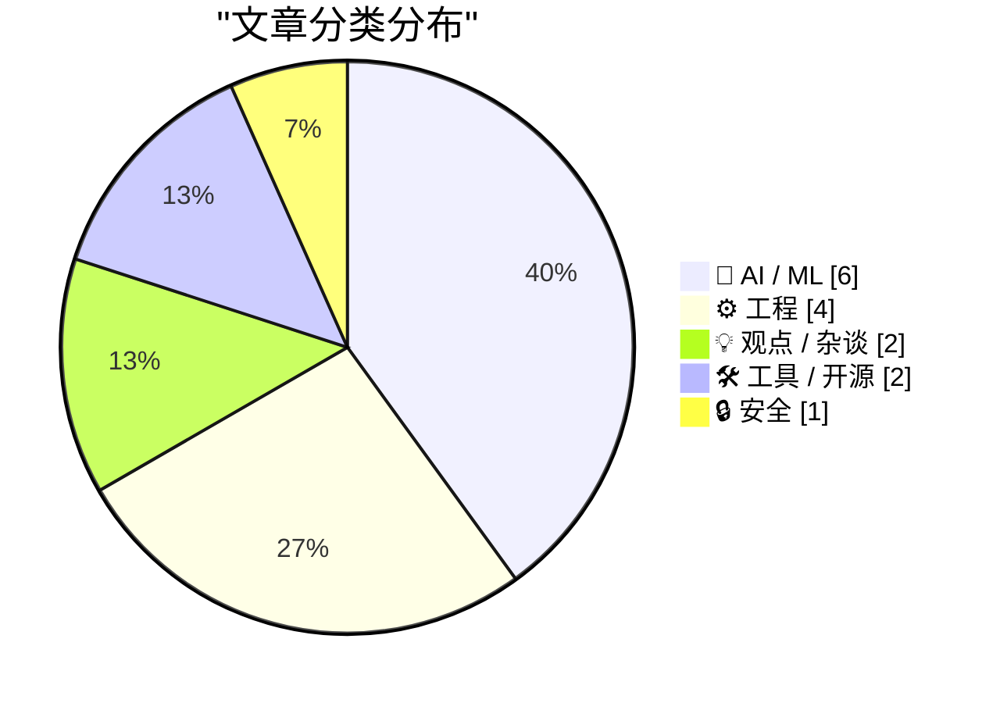
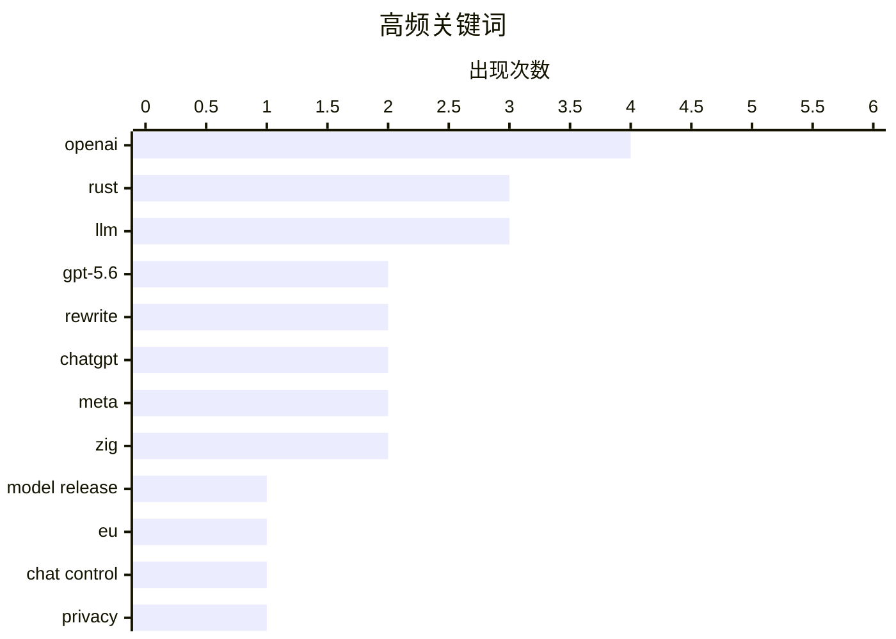

# 📰 AI 资讯每日精选 — 2026-07-10

> 汇聚 140+ 技术博客、X/Twitter、Hacker News、Reddit、Product Hunt、
> Lobste.rs、ClawFeed 日报及 GitHub Trending，经 AI 评分筛选。
>
> **本期内容**：🏆 今日必读 · 🌐 ClawFeed 日报 · 🔥 GitHub Trending · 📂 分类精选 · 🎨 设计与生成式 AI · 📊 数据概览

## 📝 今日看点

今日技术圈呈现两大主线：AI 模型竞赛持续升温，OpenAI 发布 GPT-5.6 系列并推出面向复杂任务的 ChatGPT Work，Meta 也同步更新多模态模型 API，行业正加速向分层化、专业化方向演进；与此同时，Rust 在基础设施领域势头强劲，不仅 PostgreSQL 的 Rust 重写项目通过全部回归测试，Bun 运行时也选择转向 Rust，叠加 Rust 1.97.0 稳定版发布，Rust 正从语言特性走向工程生态的全面落地。此外，欧盟通过“聊天控制”法案引发隐私争议，以及开发者对 LLM 倦怠的反思，也提醒行业在技术狂奔中需平衡安全、伦理与人的可持续性。

---

## 🏆 今日必读

🥇 **GPT-5.6**

[GPT-5.6](https://openai.com/index/gpt-5-6/) — Hacker News Best · 8 小时前 · 🤖 AI / ML

> OpenAI 发布了其最新旗舰模型 GPT-5.6，包含三个尺寸版本：Luna（最小）、Terra（中等）和 Sol（最大）。定价按每百万输入/输出 token 计算，分别为 Luna $1/$6、Terra $2.50/$15、Sol $5/$30，与 Claude Opus 系列（$5/$25）和 Claude Fable 5（$10/$50）形成竞争。由于推理 token 数量在不同模型间差异显著，单纯比较每百万 token 价格已不足以反映实际成本。该模型已正式开放通用访问。

💡 **为什么值得读**: OpenAI 最新旗舰模型发布，三档定价与 Claude 系列直接对标，是评估大模型选型和成本的关键参考。

🏷️ GPT-5.6, OpenAI, model release

🥈 **欧盟议会批准“聊天控制 1.0”法案**

[EU Parliament greenlights Chat Control 1.0](https://www.patrick-breyer.de/en/eu-parliament-greenlights-chat-control-1-0-breyer-our-children-lose-out/) — Hacker News Best · 14 小时前 · 🔒 安全

> 欧盟议会投票通过了备受争议的“聊天控制 1.0”（Chat Control 1.0）法案，该法案要求平台扫描用户私密通信以检测儿童性虐待材料。批评者认为此举将大规模破坏端到端加密，侵犯公民隐私权。活动家帕特里克·布雷耶（Patrick Breyer）表示，该法案名义上保护儿童，实则让儿童失去隐私保护。该法案仍需欧盟理事会最终批准才能成为法律。

💡 **为什么值得读**: 涉及隐私、加密与儿童保护的核心冲突，对科技行业和所有互联网用户具有深远影响。

🏷️ EU, Chat Control, privacy, surveillance

🥉 **用 Rust 重写的 PostgreSQL 已通过 100% 回归测试**

[Postgres rewritten in Rust, now passing 100% of the Postgres regression tests](https://github.com/malisper/pgrust) — Hacker News Best · 18 小时前 · ⚙️ 工程

> 开源项目 pgrust 成功用 Rust 语言重写了 PostgreSQL 数据库，并已通过全部 PostgreSQL 回归测试。该项目旨在利用 Rust 的内存安全特性，在保持与原生 PostgreSQL 完全兼容的同时，消除内存相关漏洞。目前代码已在 GitHub 上开源，吸引了大量开发者关注。

💡 **为什么值得读**: Rust 重写经典数据库的里程碑式成果，展示了 Rust 在系统软件领域替代 C 语言的可行性。

🏷️ Postgres, Rust, rewrite, regression tests

4️⃣ **ChatGPT Work：为最具雄心的任务而生**

[ChatGPT Work](https://openai.com/index/chatgpt-for-your-most-ambitious-work/) — Hacker News Best · 8 小时前 · 🤖 AI / ML

> OpenAI 发布了 ChatGPT Work，定位为面向复杂、高要求工作场景的 AI 助手。该产品旨在处理更长的上下文、更复杂的推理任务，并支持更深入的多轮协作。OpenAI 强调其适用于编程、研究分析、内容创作等需要深度思考的场景。

💡 **为什么值得读**: OpenAI 对 ChatGPT 产品线的高端定位，揭示了 AI 助手从聊天工具向专业生产力平台演进的趋势。

🏷️ ChatGPT, productivity, OpenAI

5️⃣ **Muse Spark 1.1 发布**

[Muse Spark 1.1](https://ai.meta.com/blog/introducing-muse-spark-meta-model-api/) — Hacker News Best · 11 小时前 · 🤖 AI / ML

> Meta 发布了 Muse Spark 1.1，这是一个面向多模态 AI 应用的模型 API。该版本在性能、效率和功能上均有显著提升，具体评估细节已发布在技术报告中。Meta 同时提供了开发者资源，并宣布与 Bloomberg 等媒体合作，推动其在内容生成领域的应用。

💡 **为什么值得读**: Meta 在多模态 AI 领域的最新进展，对关注图像、视频生成和媒体行业应用的开发者具有直接参考价值。

🏷️ Muse Spark, Meta, AI model, evaluation

---

## 🌐 ClawFeed 日报精选

> 来源：[ClawFeed](https://clawfeed.kevinhe.io) — AI 驱动的多源新闻聚合

📅 ClawFeed 日报 | 2026-07-09 (SGT)

基于 4 期 4h digest（#824 00:00 / #825 04:00 / #826 08:00 / #827 16:00）汇总。12:00-15:59 窗口缺失（scrape 未产出）。

---

## 🔥 当日全场最重要 5 条

**1. Harness Engineering 提出者 Ryan Lopopolo 加入 Google Cloud 任首席 Agent 工程师**
Agent 工程化从"开发者工具链"正式升级为"云平台基础设施"——GCP 用人事信号宣告 agent infra 是下一代云战场。此前 Lopopolo 在 OpenAI 提出 Harness Engineering 概念，现在 GCP 将其落地为 Agentic GCP 方向。
来源: https://x.com/MaxForAI/status/2075123203366854681

**2. xAI 发布 Grok 4.5——性能接近 Opus 4.8，价格低近 90%**
专为编码和 Agent 场景训练，与 Cursor 联合调优。Elon 定位"roughly comparable to Opus 4.7, but much faster"——不在 eval 上卷，而在落地速度和成本上做差异化。Frontier 模型价格战加速，高端智能正在商品化。对 OpenMax 的启示：模型层竞争进入实用主义阶段，harness/orchestration 层的价值进一步凸显。
来源: https://x.com/indigox/status/2074989568441680362 / https://x.com/elonmusk/status/2074911038286295049

**3. 企业 AI Agent 落地瓶颈是 Operating Model，不是技术**
Aaron Levie（Box CEO）与数十位企业 IT leader 密集会面后的核心共识：组织结构、审批流、权责边界没跟上，工具再强也空转。数据基础设施和 context engine 是企业 AI 落地的真正战场。Glean AI Gateway 同日发布，论点一致——interface 层变化太快，该标准化的是 platform 层。
来源: https://x.com/levie/status/2074719479377109312 / https://x.com/jainarvind/status/2074871518191054952

**4. OpenClaw Foundation 成立非营利，Personal AI 脱离商业大厂走向独立运营**
Peter Steinberger 澄清：OpenAI 雇了他本人，但 OpenClaw Foundation 独立——非营利、有赞助商而非 owner、首次配备全职团队。Personal AI 最重要的开源项目走向组织化独立运营，与商业 AI 公司保持距离。
来源: https://x.com/steipete/status/2075046949896736835

**5. Agent Harness 工程化全面升温——从极简框架到自我进化**
三条主线同步推进：(1) Pi Agent SDK 极简化——核心 agent 仅 ~15 行代码，extension 系统可将 tool token 用量砍掉 80-96%；(2) Raven agent harness 达 1K GitHub stars，核心差异是 Proactive Engine（主动感知环境并行动，不等用户输入）；(3) Self-evolving Agents 进入系统化——Hermes Agent 自动可复用 skills、RSI Lab 递归算法发现。Agent 从"loop + tools"走向自我进化。
来源: https://x.com/jasonzhou1993/status/2074811444038894078 / https://x.com/elliotchen100/status/2074781116066849232 / https://x.com/Shilong_Liu_AI/status/2074800880017342665

---

## 📰 当日核心主题

### 1. Agent Engineering → 云基础设施
当日最强信号。Ryan Lopopolo 入职 GCP、Anthropic 发布 5 个 agentic workshop（从零构建→自我改进→记忆→主动→多 agent 编排）、Raven Proactive Engine、Pi SDK 极简化——Agent 工程正从"开发者个人实践"变为"可标准化的云服务"。

### 2. Frontier 模型商品化加速
Grok 4.5 以 Opus 4.8 九折价格入场；GPT-5.6 Sol 早期评价涌入（"各方面重大飞跃"但 @rezosh 泼冷水：benchmark 可能被高估）；Haseeb (Dragonfly VC) 坦承"没有任何单一 well-scoped 智力任务我能赢 frontier AI"。模型能力趋同+价格战=orchestration/harness 层价值凸显。

### 3. 企业 AI：从 PoC 到组织变革
Levie 的 operating model 论贯穿全天。Coda 更名 Superhuman Docs（AI-native 协作文档）、Glean AI Gateway（企业 AI 统一 control plane）、PromptQL 融 $136M 要做"AI 版 Slack"——企业 AI 战场从模型选型移向基础设施和组织层。

### 4. AI 安全与评测可信度危机
Anthropic 发布 dual-use AI 安全研究（off-switch 机制）；OpenAI 审计 SWE-Bench Pro 发现 30% 测试任务有问题并撤回推荐；PG 转发的 Brown 大学期中/期末成绩散点图（AI 作弊可视化证据）4.6M views——AI 对教育评估体系冲击已不可逆。

### 5. 小模型 + 本地化趋势
LingBot-Vision 1B 击败 7B 深度估计；Nutrient 本地 PDF-to-Markdown 性能跃升（隐私友好 RAG）；Hermes Agent 上云 60 秒部署；定制化小模型 vs frontier 全能大模型的路线之争持续。

---

## 🔖 累计 Bookmark 精选

• **@BruceGuai** - Matrix Agent 架构：不是单一 Agent + 全部工具，而是"Agent 公司 OS"——多角色长期运行、职责分离、可审计。与 OpenMax 多 agent 团队理念高度共振。
• **@mardehaym / @LimestoneHQ** - "AI-Native Engineering 的五个阶段"+ 完整方法论免费公开。大多数团队还在第零阶段。
• **@arrakis_ai** - Chormex 用 GPT-Realtime-2 实现 Chrome 内实时 AI 翻译，Greg Brockman 转推背书。
• **@Av1dlive** - Anthropic "Claude for Finance" 讲座——quant AI 领域最值得看的免费 1 小时。
• **@mntruell** (Cursor CEO) - "AI 软件开发的第三纪元"，7.2M views。
• **@turingou** - wanman.ai 开源：AI agent 团队帮任何人从零创办/运营一人公司。
• **@levie** - "The Era of Context"：AI 时代 context 是企业的灵魂。

---

## 👀 推荐关注汇总（去重）

| 账号 | 推荐理由 |
|------|---------|
| @MaxForAI | 中文圈 Agent/AI 工程化深度评论，Harness Engineering 人事动态最早报道 |
| @shao__meng | 中文圈少见的 Agent Engineering 深度评论者，持续引介一线工程实践 |
| @elliotchen100 | Raven/EverMind 创始人，Proactive Engine 理念与 OpenMax always-on agent 方向对齐 |
| @joshwoodward | Google VP/GM，负责 Gemini 产品，公开征集用户痛点，态度开放 |
| @BruceGuai | Agent 架构深度思考者，Matrix/Agent OS 设计者 |
| @huang_chao4969 | DeepTutor 作者，agent-native 教育方向 |
| @atasteoff | Self-evolving agents 分类学综述作者 |

⚠️ 上述未通过浏览器逐一核实是否已关注，操作前请先搜 Following 避免重复。

---

## 💤 当日重复噪音模式

1. **Crypto KOL 互撕 / 八卦连续剧**：Metagent/李博杰投资纠纷连续第三天、Gate.io 170 万被盗争议——占 feed 多条但信息增量递减
2. **Meme token / referral 推广**：$BRIDGE launch、Ondo Perps 拉人、TronBid 软广、GitReverse token 推、WEEX 大富翁——每期 3-5 条，可安全过滤
3. **生活方式 / 非 AI 内容串**：国足段子串（400 万播放擦边视频带节奏）、蜜雪冰城品控讨论、giffgaff 电话卡代购——关注列表中混入的非目标内容源
4. **活动宣传 / 软广**：WAIC 活动、PANews 投资软文、CoinW 周报——信息密度低，形式固定---

## 🔥 GitHub Trending

> 今日热门开源项目（全语言 + Python）

| # | 项目 | 描述 | ⭐ 总星 | 📈 今日 | 语言 |
|---|------|------|---------|---------|------|
| 1 | [MadsLorentzen/ai-job-search](https://github.com/MadsLorentzen/ai-job-search) 🤖 | AI-powered job application framework built on Claude Code... | 19.0k | +3716 | TypeScript |
| 2 | [addyosmani/agent-skills](https://github.com/addyosmani/agent-skills) 🤖 | Production-grade engineering skills for AI coding agents. | 75.9k | +2554 | JavaScript |
| 3 | [iOfficeAI/OfficeCLI](https://github.com/iOfficeAI/OfficeCLI) 🤖 | OfficeCLI is the first and best Office suite purpose-buil... | 13.4k | +1929 | C# |
| 4 | [VoltAgent/awesome-design-md](https://github.com/VoltAgent/awesome-design-md) | A collection of DESIGN.md files analysis by popular brand... | 99.7k | +1391 | - |
| 5 | [asgeirtj/system_prompts_leaks](https://github.com/asgeirtj/system_prompts_leaks) 🤖 | Extracted system prompts from Anthropic - Claude Fable 5,... | 55.2k | +1125 | JavaScript |
| 6 | [Graphify-Labs/graphify](https://github.com/Graphify-Labs/graphify) 🤖 | AI coding assistant skill (Claude Code, Codex, OpenCode, ... | 81.3k | +909 | Python |
| 7 | [bradautomates/claude-video](https://github.com/bradautomates/claude-video) 🤖 | Give Claude the ability to watch any video. /watch downlo... | 6.7k | +718 | Python |
| 8 | [vxcontrol/pentagi](https://github.com/vxcontrol/pentagi) 🤖 | Fully autonomous AI Agents system capable of performing c... | 19.4k | +535 | Go |
| 9 | [SmartlyDressedGames/U3-SDK](https://github.com/SmartlyDressedGames/U3-SDK) | Source code for Unturned, a free open-world zombie surviv... | 2.0k | +524 | C# |
| 10 | [huxingyi/autoremesher](https://github.com/huxingyi/autoremesher) | Automatic quad remeshing tool | 2.4k | +403 | C++ |
| 11 | [prisma/prisma](https://github.com/prisma/prisma) | Next-generation ORM for Node.js & TypeScript | PostgreSQL... | 46.9k | +376 | TypeScript |
| 12 | [microsoft/SkillOpt](https://github.com/microsoft/SkillOpt) 🤖 | SkillOpt is a text-space optimizer that trains reusable n... | 12.0k | +276 | Python |
| 13 | [imthenachoman/How-To-Secure-A-Linux-Server](https://github.com/imthenachoman/How-To-Secure-A-Linux-Server) | An evolving how-to guide for securing a Linux server. | 29.1k | +243 | - |
| 14 | [kyutai-labs/pocket-tts](https://github.com/kyutai-labs/pocket-tts) | A TTS that fits in your CPU (and pocket) | 7.0k | +235 | Python |
| 15 | [unclecode/crawl4ai](https://github.com/unclecode/crawl4ai) 🤖 | 🚀🤖 Crawl4AI: Open-source LLM Friendly Web Crawler & Scr... | 71.8k | +215 | Python |

---

## 🤖 AI / ML

### 1. GPT-5.6

[GPT-5.6](https://openai.com/index/gpt-5-6/) — **Hacker News Best** · 8 小时前 · ⭐ 29/30

> OpenAI 发布了其最新旗舰模型 GPT-5.6，包含三个尺寸版本：Luna（最小）、Terra（中等）和 Sol（最大）。定价按每百万输入/输出 token 计算，分别为 Luna $1/$6、Terra $2.50/$15、Sol $5/$30，与 Claude Opus 系列（$5/$25）和 Claude Fable 5（$10/$50）形成竞争。由于推理 token 数量在不同模型间差异显著，单纯比较每百万 token 价格已不足以反映实际成本。该模型已正式开放通用访问。

🏷️ GPT-5.6, OpenAI, model release

---

### 2. ChatGPT Work：为最具雄心的任务而生

[ChatGPT Work](https://openai.com/index/chatgpt-for-your-most-ambitious-work/) — **Hacker News Best** · 8 小时前 · ⭐ 27/30

> OpenAI 发布了 ChatGPT Work，定位为面向复杂、高要求工作场景的 AI 助手。该产品旨在处理更长的上下文、更复杂的推理任务，并支持更深入的多轮协作。OpenAI 强调其适用于编程、研究分析、内容创作等需要深度思考的场景。

🏷️ ChatGPT, productivity, OpenAI

---

### 3. Muse Spark 1.1 发布

[Muse Spark 1.1](https://ai.meta.com/blog/introducing-muse-spark-meta-model-api/) — **Hacker News Best** · 11 小时前 · ⭐ 27/30

> Meta 发布了 Muse Spark 1.1，这是一个面向多模态 AI 应用的模型 API。该版本在性能、效率和功能上均有显著提升，具体评估细节已发布在技术报告中。Meta 同时提供了开发者资源，并宣布与 Bloomberg 等媒体合作，推动其在内容生成领域的应用。

🏷️ Muse Spark, Meta, AI model, evaluation

---

### 4. 新的 GPT-5.6 系列：Luna、Terra、Sol

[The new GPT-5.6 family: Luna, Terra, Sol](https://simonwillison.net/2026/Jul/9/gpt-5-6/#atom-everything) — **simonwillison.net** · 5 小时前 · ⭐ 26/30

> OpenAI 的 GPT-5.6 系列包含三个尺寸：Luna、Terra 和 Sol（从小到大）。定价为每百万输入/输出 token：Luna $1/$6、Terra $2.50/$15、Sol $5/$30。与 Claude Opus 系列（$5/$25）和 Claude Fable 5（$10/$50）相比，单纯的价格比较已不足以反映实际成本，因为不同模型的推理 token 数量差异巨大。

🏷️ GPT-5.6, OpenAI, LLM, pricing

---

### 5. Meta 将 Instagram 账户默认设置为允许 AI 复用内容

[Meta Sets Default for Instagram Accounts to Permit Content Reuse by AI](https://www.nytimes.com/2026/07/08/technology/meta-instagram-ai.html?unlocked_article_code=1.wVA.Q5Do.Uvg5yPwCEB5H) — **daringfireball.net** · 11 小时前 · ⭐ 24/30

> Meta 在推出名为 Muse Image 的 AI 图像生成器时，默认将成年用户的公开 Instagram 账户设置为允许 AI 基于其照片生成新图像。用户通过 Meta AI 独立聊天机器人应用即可使用该功能。此举意味着数亿用户的公开照片被自动纳入 AI 训练和生成素材库，引发了关于隐私和用户数据控制权的广泛争议。文章指出，用户需手动在设置中关闭此选项才能退出，而许多用户可能并未意识到这一默认变更。核心问题在于科技公司在未明确告知并获得主动同意的情况下，利用用户生成内容训练和驱动 AI 产品。

🏷️ Meta, Instagram, AI, image generation

---

### 6. Show HN：在我的慢速电脑上运行 GLM 5.2

[Show HN: Getting GLM 5.2 running on my slow computer](https://github.com/JustVugg/colibri) — **Hacker News Best** · 17 小时前 · ⭐ 24/30

> 作者尝试在普通消费级电脑上运行 GLM 5.2 大语言模型，并成功实现了本地部署。GLM 5.2 在能力和安全性上给作者留下了深刻印象，认为其表现与 Claude 或 GPT 等主流模型相当。作者通过使用代理和模型转换技术，解决了在有限内存（OOM）环境下运行大模型的核心难题。该项目展示了即使是资源受限的个人电脑，也能通过优化运行高性能开源 LLM，降低了使用先进 AI 模型的门槛。

🏷️ GLM, LLM, local inference, performance

---

## ⚙️ 工程

### 7. 用 Rust 重写的 PostgreSQL 已通过 100% 回归测试

[Postgres rewritten in Rust, now passing 100% of the Postgres regression tests](https://github.com/malisper/pgrust) — **Hacker News Best** · 18 小时前 · ⭐ 28/30

> 开源项目 pgrust 成功用 Rust 语言重写了 PostgreSQL 数据库，并已通过全部 PostgreSQL 回归测试。该项目旨在利用 Rust 的内存安全特性，在保持与原生 PostgreSQL 完全兼容的同时，消除内存相关漏洞。目前代码已在 GitHub 上开源，吸引了大量开发者关注。

🏷️ Postgres, Rust, rewrite, regression tests

---

### 8. 我对 Bun 用 Rust 重写的看法

[My thoughts on the Bun Rust rewrite](https://andrewkelley.me/post/my-thoughts-bun-rust-rewrite.html) — **Hacker News Best** · 15 小时前 · ⭐ 27/30

> Zig 语言创始人 Andrew Kelley 撰文评论 Bun 运行时从 Zig 转向 Rust 重写的决策。他分析了 Bun 团队选择 Rust 的可能原因，包括生态成熟度、人才获取和工具链优势。Kelley 同时指出，Zig 在某些底层系统编程场景仍有独特优势，但 Rust 在大型项目协作和库生态方面更胜一筹。文章引发了关于编程语言选型与运行时性能的广泛讨论。

🏷️ Bun, Rust, rewrite, Zig

---

### 9. Rust 1.97.0 发布公告

[Announcing Rust 1.97.0](https://blog.rust-lang.org/2026/07/09/Rust-1.97.0/) — **Lobste.rs** · 10 小时前 · ⭐ 27/30

> Rust 官方发布了 1.97.0 稳定版，包含多项语言特性改进、编译器优化和库更新。具体变更包括新的 API 稳定化、性能提升以及开发者体验的改善。该版本延续了 Rust 每六周发布一次的节奏。

🏷️ Rust, release, language update

---

### 10. Lobsters 对 Mitchell Hashimoto 的访谈

[Lobsters Interview with mitchellh](https://alexalejandre.com/programming/interview-with-mitchell-hashimoto/) — **Lobste.rs** · 9 小时前 · ⭐ 25/30

> Lobsters 社区对 Mitchell Hashimoto 进行了深度访谈。Mitchell 是 Vagrant、Packer、Consul、Terraform、Vault、Nomad 和 Waypoint 等知名开源项目的创始人。访谈涵盖了他的职业生涯、开源项目设计哲学、从 HashiCorp 离开后的思考，以及对基础设施软件未来发展的见解。

🏷️ Mitchell Hashimoto, Vagrant, HashiCorp, interview

---

## 💡 观点 / 杂谈

### 11. 我想我得了 LLM 倦怠症

[I think I have LLM burnout](https://www.alecscollon.com/blog/llm-burnout/) — **Hacker News Best** · 23 小时前 · ⭐ 25/30

> 作者 Alec Scollon 分享了自己对大型语言模型（LLM）感到倦怠的个人体验。他描述了从最初兴奋到逐渐感到信息过载、同质化内容泛滥以及创新疲劳的过程。文章反思了 AI 行业快速迭代对从业者和用户心理的影响，呼吁更可持续的节奏和更有意义的应用方向。

🏷️ LLM, burnout, AI fatigue, tech culture

---

### 12. 今天 OpenAI 搞砸了 ChatGPT Mac 应用

[Today’s the Day OpenAI Fucked Up the ChatGPT Mac App](https://9to5mac.com/2026/07/09/openai-announcing-the-next-chapter-for-chatgpt-today-watch-here/) — **daringfireball.net** · 5 小时前 · ⭐ 23/30

> OpenAI 在今日的产品发布中对 ChatGPT 桌面应用进行了重大调整：原 ChatGPT 应用更名为 ChatGPT Classic，而原 Codex 应用被重新命名为新的 ChatGPT 桌面应用。新 ChatGPT 应用包含 ChatGPT Work 和 ChatGPT Codex 两种模式，两者共享插件生态，其中 Codex 模式会向用户展示更多技术细节。这一改名和功能整合策略引发了用户困惑，批评者认为此举破坏了原有产品的品牌认知和用户习惯，将专业开发工具（Codex）与通用聊天产品（ChatGPT）强行合并。

🏷️ OpenAI, ChatGPT, Mac app, Codex

---

## 🛠 工具 / 开源

### 13. Hy3

[Hy3](https://hy.tencent.com/research/hy3) — **Hacker News Best** · 9 小时前 · ⭐ 24/30

> 腾讯发布了 Hy3，一个全新的混合 AI 模型架构。Hy3 的核心创新在于将 Transformer 与状态空间模型（SSM）进行深度融合，旨在同时获得 Transformer 的长程依赖建模能力和 SSM 的线性计算复杂度优势。在多个基准测试中，Hy3 在保持与同等规模 Transformer 模型相当性能的同时，推理速度提升了 2-3 倍，显存占用降低了约 40%。该架构特别针对长序列任务（如代码生成和文档分析）进行了优化，展示了混合架构在平衡效率与效果方面的潜力。

🏷️ Hy3, window manager, Linux, tiling

---

### 14. 开箱：Zig

[Unboxed: Zig](https://nesbitt.io/2026/07/09/unboxed-zig.html) — **nesbitt.io** · 15 小时前 · ⭐ 23/30

> 文章深入剖析了 Zig 编程语言的包管理器，从机制、分类、治理和威胁模型四个维度进行了系统性分析。在机制上，文章解释了 Zig 包管理器如何通过构建缓存和依赖解析来管理包。在分类上，它区分了标准库包、第三方包和系统包的不同管理方式。治理方面讨论了 Zig 社区如何通过包索引和签名机制来维护包生态。威胁模型部分则重点分析了供应链攻击、恶意包和依赖混淆等安全风险，并评估了 Zig 包管理器现有的防御措施。

🏷️ Zig, package manager, security

---

## 🔒 安全

### 15. 欧盟议会批准“聊天控制 1.0”法案

[EU Parliament greenlights Chat Control 1.0](https://www.patrick-breyer.de/en/eu-parliament-greenlights-chat-control-1-0-breyer-our-children-lose-out/) — **Hacker News Best** · 14 小时前 · ⭐ 28/30

> 欧盟议会投票通过了备受争议的“聊天控制 1.0”（Chat Control 1.0）法案，该法案要求平台扫描用户私密通信以检测儿童性虐待材料。批评者认为此举将大规模破坏端到端加密，侵犯公民隐私权。活动家帕特里克·布雷耶（Patrick Breyer）表示，该法案名义上保护儿童，实则让儿童失去隐私保护。该法案仍需欧盟理事会最终批准才能成为法律。

🏷️ EU, Chat Control, privacy, surveillance

---

## 🎨 Design & Generative AI

### 🖼️ 生成式图片

- **[如何保留风格几何但更换调色板？](https://www.reddit.com/r/midjourney/comments/1us2odl/how_to_grab_the_geometry_of_a_style_but_not_the/)** — r/midjourney · 4 小时前
  > 用户询问如何在Midjourney中保留tarot卡牌艺术风格的几何结构，同时更换有限的调色板。

- **[动态/运动中的提示词技巧](https://www.reddit.com/r/midjourney/comments/1uru5ck/dynamicinmotion_prompts/)** — r/midjourney · 9 小时前
  > 用户寻求生成武器挥砍、撞击等动态效果的最佳提示词建议。

- **[科幻风景](https://www.reddit.com/r/midjourney/comments/1urv1qb/scifi_scenery/)** — r/midjourney · 8 小时前
  > 分享一幅科幻风格的风景图像作品。

- **[决斗](https://www.reddit.com/r/midjourney/comments/1urorpv/the_duel/)** — r/midjourney · 12 小时前
  > 展示一幅名为“决斗”的Midjourney生成图像。

- **[采矿机甲](https://www.reddit.com/r/midjourney/comments/1uru2xz/mining_mech/)** — r/midjourney · 9 小时前
  > 展示一幅采矿机甲主题的Midjourney图像。

- **[风暴女王](https://www.reddit.com/r/midjourney/comments/1urtdco/storm_queen/)** — r/midjourney · 9 小时前
  > 展示一幅名为“风暴女王”的Midjourney生成图像。

- **[洞穴](https://www.reddit.com/r/midjourney/comments/1urxf18/cavernz/)** — r/midjourney · 7 小时前
  > 展示一幅洞穴主题的Midjourney图像。

- **[霓虹无圣徒：第一集](https://www.reddit.com/r/midjourney/comments/1urdu2e/no_saints_in_neon_episode_i/)** — r/midjourney · 22 小时前
  > 展示一幅赛博朋克风格系列图像“霓虹无圣徒”的第一集。

- **[复仇圣骑士](https://www.reddit.com/r/midjourney/comments/1uryuj6/vengeance_paladin/)** — r/midjourney · 6 小时前
  > 展示一幅名为“复仇圣骑士”的Midjourney角色图像。

- **[吉祥物恐惧症](https://www.reddit.com/r/midjourney/comments/1us4vgl/ive_always_found_mascots_creepy_ever_since_i/)** — r/midjourney · 3 小时前
  > 用户分享因童年阴影而对吉祥物感到恐惧的Midjourney图像。

- **[痛苦而缓慢的蜕变](https://www.reddit.com/r/midjourney/comments/1us3bki/the_metamorphosis_was_as_painful_as_it_was_slow/)** — r/midjourney · 4 小时前
  > 展示一幅描绘痛苦蜕变过程的Midjourney图像。

- **[洞穴城市](https://www.reddit.com/r/midjourney/comments/1us0mrp/cavern_city/)** — r/midjourney · 5 小时前
  > 展示一幅名为“洞穴城市”的Midjourney图像。

- **[德鲁伊哨兵：角色肖像系列](https://www.reddit.com/r/midjourney/comments/1uru5m8/druidic_sentinels_a_series_of_mj_character/)** — r/midjourney · 9 小时前
  > 展示一组由Midjourney生成的德鲁伊哨兵角色肖像。

- **[华盛顿高地新网吧散步](https://www.reddit.com/r/midjourney/comments/1uri1mw/going_for_a_walk_by_the_new_cybercafe_in/)** — r/midjourney · 18 小时前
  > 展示一幅赛博朋克风格的城市街景图像。

- **[冲突 [原创角色]](https://www.reddit.com/r/midjourney/comments/1uri7t3/choque_oc/)** — r/midjourney · 18 小时前
  > 展示一幅名为“冲突”的原创角色Midjourney图像。

---

## 📊 数据概览

| 扫描源 | 抓取文章 | 时间范围 | 精选 |
|:---:|:---:|:---:|:---:|
| 92/140 | 3815 篇 → 66 篇 | 24h | **15 篇** |

### 分类分布



### 高频关键词



<details>
<summary>📈 纯文本关键词图（终端友好）</summary>

```
openai        │ ████████████████████ 4
rust          │ ███████████████░░░░░ 3
llm           │ ███████████████░░░░░ 3
gpt-5.6       │ ██████████░░░░░░░░░░ 2
rewrite       │ ██████████░░░░░░░░░░ 2
chatgpt       │ ██████████░░░░░░░░░░ 2
meta          │ ██████████░░░░░░░░░░ 2
zig           │ ██████████░░░░░░░░░░ 2
model release │ █████░░░░░░░░░░░░░░░ 1
eu            │ █████░░░░░░░░░░░░░░░ 1
```

</details>

### 🏷️ 话题标签

**openai**(4) · **rust**(3) · **llm**(3) · gpt-5.6(2) · rewrite(2) · chatgpt(2) · meta(2) · zig(2) · model release(1) · eu(1) · chat control(1) · privacy(1) · surveillance(1) · postgres(1) · regression tests(1) · productivity(1) · muse spark(1) · ai model(1) · evaluation(1) · bun(1)

---

*生成于 2026-07-10 01:16 | 汇聚 140 个技术博客、X/Twitter、Hacker News、Reddit、Product Hunt、Lobste.rs、ClawFeed 日报及 GitHub Trending，经 AI 评分筛选出 Top 15 精华内容*
