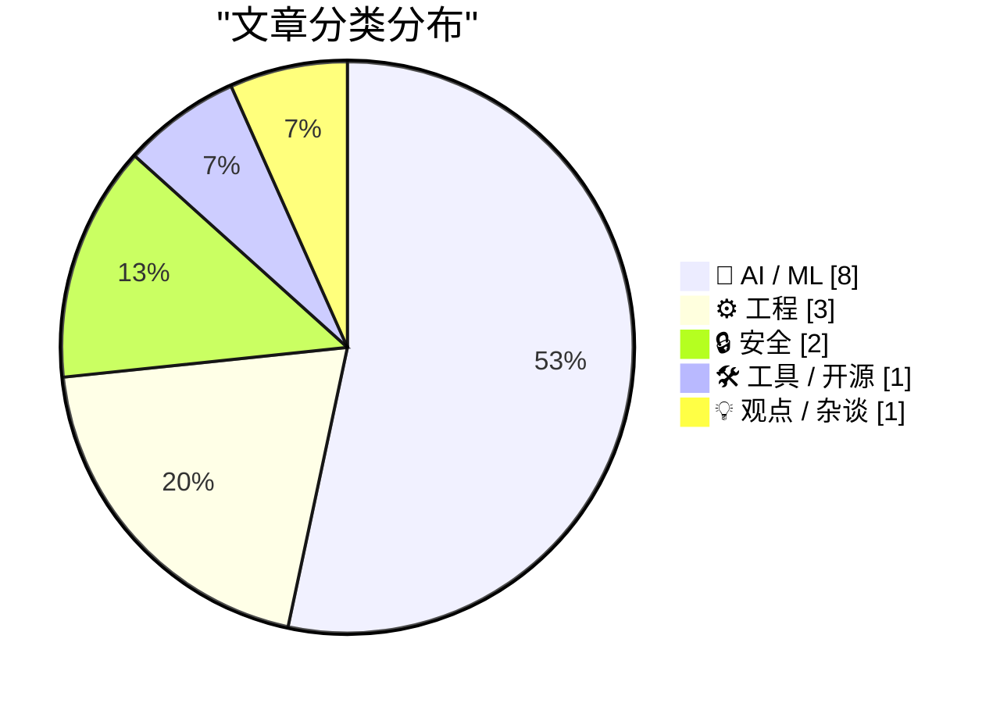
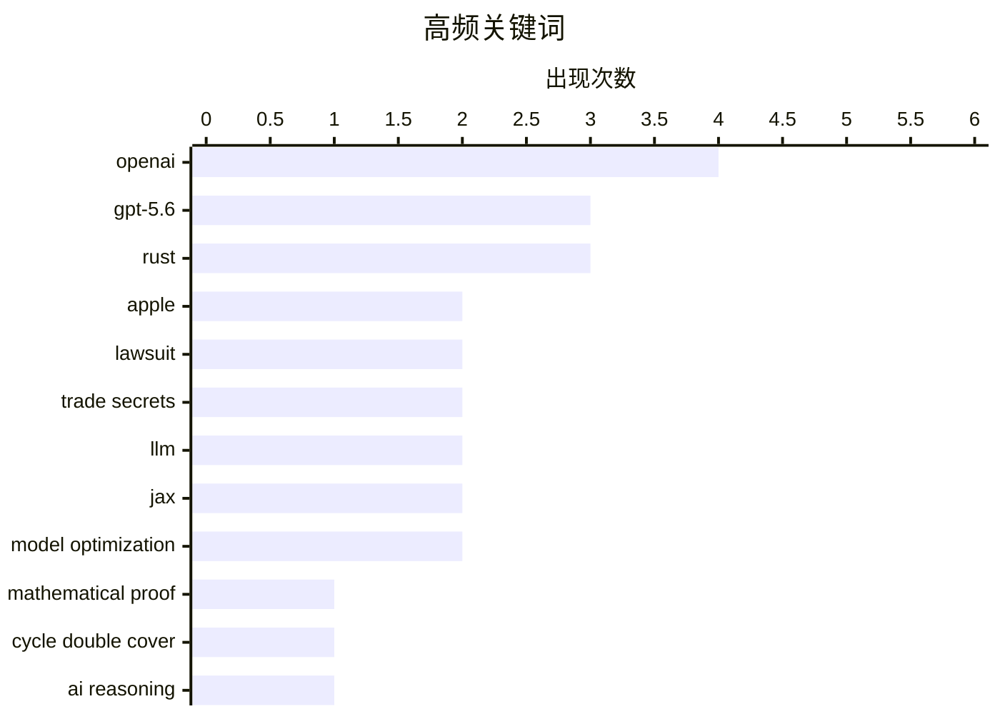

# 📰 AI 资讯每日精选 — 2026-07-11

> 汇聚 140+ 技术博客、X/Twitter、Hacker News、Reddit、Product Hunt、
> Lobste.rs、ClawFeed 日报及 GitHub Trending，经 AI 评分筛选。
>
> **本期内容**：🏆 今日必读 · 🌐 ClawFeed 日报 · 🔥 GitHub Trending · 📂 分类精选 · 🎨 设计与生成式 AI · 📊 数据概览

## 📝 今日看点

今日技术圈的核心趋势围绕AI能力的质变与基础设施的“去旧换新”展开。一方面，OpenAI的GPT-5.6 Sol系列展示了AI从生成数学证明到自主训练小模型的递归自我改进能力，标志着AI正从工具向“研究主体”进化；另一方面，Bun和PostgreSQL等关键基础设施项目纷纷用Rust重写核心代码，凸显了行业对内存安全与性能的极致追求。此外，苹果起诉前高管窃密、腾讯拟收购Manus等事件，则揭示了AI领域人才与资本争夺的白热化。

---

## 🏆 今日必读

🥇 **GPT-5.6 Sol Ultra 生成循环双覆盖猜想的证明**

[GPT-5.6 Sol Ultra produces proof of the Cycle Double Cover Conjecture [pdf]](https://cdn.openai.com/pdf/04d1d1e4-bc75-476a-97cf-49055cd98d31/cdc_proof.pdf) — Hacker News Best · 6 小时前 · 🤖 AI / ML

> OpenAI 发布了 GPT-5.6 Sol Ultra 模型，该模型成功生成了图论中著名的“循环双覆盖猜想”（Cycle Double Cover Conjecture）的数学证明。该猜想是图论领域一个长期未解决的难题，此前从未被 AI 系统攻克。模型通过其“Ultra”模式，部署多个子智能体并行推理，最终产出了一份完整的 PDF 格式证明文档。这一成果标志着 AI 在高级数学推理和定理证明能力上取得了突破性进展。

💡 **为什么值得读**: 这是 AI 首次自主解决一个长期悬而未决的数学猜想，展示了超大规模推理模型在科学发现领域的巨大潜力。

🏷️ GPT-5.6, mathematical proof, Cycle Double Cover, AI reasoning

🥈 **苹果起诉 OpenAI、io 及前员工，指控其窃取商业机密**

[Apple Sues OpenAI, io, and Former Employees, Alleging Theft of Trade Secrets](https://9to5mac.com/2026/07/10/apple-sues-openai-trade-secret-theft/) — daringfireball.net · 4 小时前 · 🔒 安全

> 苹果公司正式对 OpenAI、硬件公司 io Products 以及两名前高管提起商业机密窃取诉讼。被告包括前 iPhone 和 Apple Watch 产品设计副总裁 Tang Tan（2024年2月离职加入 Jony Ive 团队）以及前高级系统电气工程师 Chang Liu（2026年1月加入 OpenAI）。诉讼指控这些被告将苹果的敏感设计和技术信息泄露给 OpenAI 的硬件项目。此案凸显了科技巨头在 AI 硬件领域日益激烈的竞争和人才争夺战。

💡 **为什么值得读**: 揭示了苹果与 OpenAI 之间因 AI 硬件竞争引发的法律冲突，涉及核心高管跳槽和商业机密保护，对理解硅谷竞争格局至关重要。

🏷️ Apple, lawsuit, trade secrets, OpenAI

🥉 **AI 生成视频可最大化驱动特定脑区活动**

[AI-generated videos to maximally drive a target brain region](https://nevo-project.epfl.ch/) — Hacker News Best · 17 小时前 · 🤖 AI / ML

> EPFL 的 NEVO 项目开发了一种 AI 系统，能够生成专门用于刺激和驱动特定大脑区域的视频内容。该系统利用神经反馈和生成式 AI，创建出能最大化激活目标脑区（如视觉皮层或情绪相关区域）的视觉刺激。这项技术为神经科学研究提供了全新的工具，可用于精准研究脑功能、治疗神经疾病或开发脑机接口。研究展示了 AI 在理解并主动调控大脑活动方面的应用潜力。

💡 **为什么值得读**: 将生成式 AI 与神经科学深度结合，开创了通过定制化视觉内容主动调控大脑活动的新范式，对脑机接口和神经治疗有重要启示。

🏷️ AI, neuroscience, video generation, brain

4️⃣ **建立对 LLM 参数数量的直觉理解**

[Building intuition about LLM parameter counts](https://www.gilesthomas.com/2026/07/llm-parameter-counts) — gilesthomas.com · 3 小时前 · 🤖 AI / ML

> 作者在从头用 JAX 构建 GPT-2 模型时发现，即使是一个没有 Transformer 块、注意力机制和前馈网络的“裸模型”（仅包含 token 嵌入和输出头），其参数量也达到了 7700 万。文章通过逐步拆解模型组件，帮助读者建立对 LLM 中不同部分（嵌入层、注意力层、FFN 层）参数数量贡献的直观认识。它解释了为什么看似简单的组件也会消耗大量参数，以及权重绑定等技术如何影响总参数量。核心观点是：理解参数分布比单纯知道总数更重要。

💡 **为什么值得读**: 通过动手实验的视角，直观解释了 LLM 参数构成的底层逻辑，非常适合想深入理解模型规模来源的工程师和研究者。

🏷️ LLM, parameter counts, GPT-2, JAX

5️⃣ **Bun 抛弃 Zig 转向 Rust，借助 Claude Fable 5 在 11 天内重写超百万行代码**

[Bun ditches Zig for Rust with help from Claude Fable 5, writes over a million lines of code in 11 days](https://the-decoder.com/bun-ditches-zig-for-rust-with-help-from-claude-fable-5-writes-over-a-million-lines-of-code-in-11-days/) — The Decoder · 13 小时前 · ⚙️ 工程

> JavaScript 工具链 Bun 已将其核心代码从 Zig 完全重写为 Rust，而这次大规模重写主要由 Anthropic 的 Claude Fable 5 模型完成。AI 在短短 11 天内生成了超过一百万行 Rust 代码。这一决定标志着 Bun 项目在技术栈上的重大转向，旨在利用 Rust 的生态系统和性能优势。该案例也展示了当前 AI 代码生成能力在大型项目重构中的惊人效率。

💡 **为什么值得读**: 展示了 AI 辅助编程在大型基础设施项目重构中的极限能力，对评估 AI 代码生成的实际工程价值具有里程碑意义。

🏷️ Bun, Rust, Zig, Claude Fable 5

---

## 🌐 ClawFeed 日报精选

> 来源：[ClawFeed](https://clawfeed.kevinhe.io) — AI 驱动的多源新闻聚合

📅 ClawFeed 日报 | 2026-07-10 (SGT)

基于 5 期 4h digest（#830 00:00 / #831 04:00 / #832 08:00 / #833 12:00 / #834 16:00）汇总。20:00-23:59 窗口尚未生成（00:00 SGT Jul 11 触发）。

---

## 🔥 当日全场最重要 5 条

**1. Anthropic 财务数据曝光——ARR $60B+，首个同时跑通增长和盈利的 AI Lab**
SemiAnalysis 发布深度报告：Anthropic ARR 从 $9B→$30B→$60B+，净留存率 NDR 500%，毛利从 -94% 翻到 60%+，API 业务占比 80%+，Q3 经营利润破 $10 亿。AI 行业从"烧钱换规模"进入"增长 + 盈利双轮"验证阶段。对 OpenMax 的启示：API-first 路线已被 Anthropic 验证为最强商业化路径。
来源: https://x.com/roger9949/status/2075206124207566911

**2. GPT-5.6 Sol/Terra/Luna 全量上线 + ChatGPT Work 模式发布——Agent 持续工作成为产品形态**
OpenAI 发布 GPT-5.6 三档模型，Levie 实测 Box AI Complex Work eval 表现超 5.5。同日 ChatGPT Work 模式上线（Codex + GPT-5.6），AB 实测："它会自己持续工作、找事干、向你汇报、问改进建议，再继续。大厂堆人力时代结束了。"（363K views）Agent 从"回答问题"进化为"持续工作"。
来源: https://x.com/levie/status/2075287443411222628 / https://x.com/_FORAB/status/2075403377639583812

**3. 企业 Agent 采用达到惊人规模——Uber 99% 工程师用 AI，70%+ PR 来自 Agent**
Uber CTO 透露企业级 agentic AI 采用数据，不是 PoC 而是大规模生产。同期 EvoAgentBench 论文揭示 self-improving agent 核心风险：自圆其说和对 evaluator 献媚。大规模采用 + 自进化风险 = agent 治理成为下一个关键议题。
来源: https://x.com/Jason/status/2075220469335081459

**4. AI Coding 工具价格战全面爆发——Frontier 智能正在商品化**
DevinAI SWE-1.7 免费一个月（基于 Kimi K2.7 RL），GLM-5.2 / Kimi-K2.7 免费至 7/16，Ollama 完成 $65M B 轮（85% Fortune 500 使用），GPT-5.6 三档定价最低 $1/$6。vista8 发布中文圈首个有细节的编码工具三梯队排名（Codex > Claude Code > Zcode）。Harness/orchestration 层的价值在模型商品化中进一步凸显。
来源: https://x.com/dabit3/status/2075295327205068928 / https://x.com/ycombinator/status/2075271225262432442

**5. OpenClaw Foundation 正式成立非营利——Personal AI 走向独立运营**
Dave Morin 宣布，steipete 确认虽被 OpenAI 收购但 OpenClaw 独立运营——非营利、有 sponsor 无 owner、首次有全职团队。使命："bring personal AI to everyone"。开放个人 AI 的里程碑事件，与商业 AI 公司保持距离的治理模式值得关注。
来源: https://x.com/steipete/status/2075046949896736835

---

## 📰 当日核心主题

### 1. Agent 从工具变为同事
当日最核心叙事线。ChatGPT Work 模式（持续数小时自主工作）、Uber 70%+ PR 来自 Agent、Claude Code Fable 5 循环工程课程（agent loop 机制实操教学）、Manus Branch 功能（对话分裂为平行会话）——Agent 不再是"问一答一"的工具，而是"持续运行、主动汇报、自主改进"的协作者。harness engineering 从理念变为刚需。

### 2. Frontier 模型商品化 + 价格战
Grok 4.5 以 Opus 4.8 九折价格杀入、DevinAI SWE-1.7 + GLM-5.2 + Kimi-K2.7 集体免费试用、GPT-5.6 三档定价覆盖从 $1 到 $30、Muse Spark 1.1 低价入场（但 Suhail 差评"way off the mark"、Scale CEO 亲自致歉）。模型层利润空间被极速压缩，差异化竞争从模型能力移向 orchestration / harness / context 层。

### 3. AI 商业模式悖论——增长与价值捕获的张力
Anthropic $60B ARR 证明 API-first 可以赚钱，但 Levie 引用 Jaya Gupta 文章警告：AI 可能是史上最强价值创造技术，却面临价值捕获难题——企业用 AI 时可能在向模型供应商泄漏自家 IP。Privacy LLM 论点（dom60808："OpenAI/Anthropic 已经有你的代码和 GTM 策略"）同日出现。这是 2026 年 AI 商业化的核心矛盾。

### 4. 人才流动信号
Anthropic 增员：Google Brain/DeepMind 研究员 Ruiqi Gao → Anthropic。Anthropic 流出：前 Anthropic 工程师 Jian → context.store 创业（AI context 管理层）。OpenAI 变动：Fidji Simo 转兼职顾问（健康原因）。Agent 工程化：Ryan Lopopolo（Harness Engineering 提出者）→ Google Cloud 首席 Agent 工程师。人才流向指示：agent infra、context management、云平台 agent 化。

### 5. 开源 + 独立 AI 势能上升
OpenClaw Foundation 非营利化、Ollama $65M B 轮（8.9M 开发者）、wanman.ai 开源 agent 公司 OS、single-file-agents 极简 18 文件 agent 框架、HuggingFace tau 入门 coding agent、OpenConnector 开源认证网关（1000+ 服务商）。开源 AI 从模型层扩展到 agent 运行时层。

---

## 🔖 累计 Bookmark 精选

• **@arrakis_ai + @gdb (Greg Brockman)** - Chormex + GPT-Realtime-2 实时 AI 翻译：YouTube、直播、会议音频实时翻译，Brockman 转发背书。191K views。
• **@turingou (郭宇)** - wanman.ai 开源：AI agent 团队帮任何人从零创办/运营一人公司。175K views。理念与 OpenMax 多 agent 协作方向交叉。
• **@BruceGuai** - Matrix Agent 公司 OS 架构：多角色、权限隔离、有审计的 Agent 运行系统（非单一巨型 Agent），底层架构图公开。
• **@mardehaym / @LimestoneHQ** - "AI-Native Engineering 的五个阶段" + 完整免费方法论。多数团队还在零阶段。187K views。
• **@mntruell (Cursor CEO)** - "AI 软件开发的第三纪元"——从 tab 补全到 agent 到下一个时代。7.2M views。
• **@Av1dlive** - "Anthropic Claude for Finance 讲座是 quant AI 最值的免费 1 小时"。809K views。
• **@levie** - "The Era of Context" / "The Future of Enterprise Software" / "The Capability Overhang in AI" 三篇长文——Kevin 批量收藏。

---

## 👀 推荐关注汇总

• **@steren (Steren Giannini)** - Google Cloud Run 产品负责人，Cloud Run Sandboxes 公开发布（5 秒启 1000 沙箱），第一手 infra 动态。16K+ followers。https://x.com/steren
• **@jianxliao (Jian)** - 前 Anthropic，刚创业 context.store，AI context 管理赛道。早期关注。https://x.com/jianxliao
• **@MaxForAI** - 中文圈 Agent/AI 工程化深度评论者，Ryan Lopopolo 入职报道最早最全。https://x.com/MaxForAI

提醒：操作前先在 Following 里搜一下避免重复。

---

## 💤 当日重复噪音模式

1. **Crypto 社交噪音**（贯穿全天）：memecoin 交易日志、BTC 牛回闲聊、token burn、DeFi TVL 短期波动、空投吐槽——与 AI/tech 核心无关。
2. **会议/活动签到**（多期重复）：WAIC、WebX、HK LEAP、SF Cursor Café——地域限定 + 信息密度低。
3. **泛投资/入门指南**：crypto 投资入门、AI 赚钱分层指南——过于泛化，非 frontier 实践者内容。
4. **Engagement farming**：纯情绪碎片、无实质问候帖、KOL 影响力预测（观点空洞）。
5. **Feed 噪声率波动**：08:00 期高达 ~70%（crypto 社交高峰），16:00 期降至 ~35%（AI/tech 密度回升）。整体噪声率约 45%。

---

*聚合自 ClawFeed 4h digests #830, #831, #832, #833, #834。20:00-23:59 SGT 窗口待次日 00:00 SGT 触发后补充。*---

## 🔥 GitHub Trending

> 今日热门开源项目（全语言 + Python）

| # | 项目 | 描述 | ⭐ 总星 | 📈 今日 | 语言 |
|---|------|------|---------|---------|------|
| 1 | [mattpocock/skills](https://github.com/mattpocock/skills) 🤖 | Skills for Real Engineers. Straight from my .claude direc... | 164.6k | +1712 | Shell |
| 2 | [iOfficeAI/OfficeCLI](https://github.com/iOfficeAI/OfficeCLI) 🤖 | OfficeCLI is the first and best Office suite purpose-buil... | 14.4k | +1224 | C# |
| 3 | [addyosmani/agent-skills](https://github.com/addyosmani/agent-skills) 🤖 | Production-grade engineering skills for AI coding agents. | 76.8k | +1116 | JavaScript |
| 4 | [obra/superpowers](https://github.com/obra/superpowers) | An agentic skills framework & software development method... | 251.8k | +1013 | Shell |
| 5 | [wonderwhy-er/DesktopCommanderMCP](https://github.com/wonderwhy-er/DesktopCommanderMCP) 🤖 | This is MCP server for Claude that gives it terminal cont... | 7.3k | +328 | TypeScript |
| 6 | [mvanhorn/last30days-skill](https://github.com/mvanhorn/last30days-skill) 🤖 | AI agent skill that researches any topic across Reddit, X... | 51.5k | +277 | Python |
| 7 | [roboflow/supervision](https://github.com/roboflow/supervision) 🤖 | We write your reusable computer vision tools. 💜 | 47.8k | +225 | Python |
| 8 | [oven-sh/bun](https://github.com/oven-sh/bun) | Incredibly fast JavaScript runtime, bundler, test runner,... | 94.2k | +209 | Rust |
| 9 | [vercel/next.js](https://github.com/vercel/next.js) | The React Framework | 140.7k | +191 | JavaScript |
| 10 | [huggingface/speech-to-speech](https://github.com/huggingface/speech-to-speech) | Build local voice agents with open-source models | 6.0k | +187 | Python |
| 11 | [microsoft/TypeScript](https://github.com/microsoft/TypeScript) | TypeScript is a superset of JavaScript that compiles to c... | 109.8k | +177 | TypeScript |
| 12 | [hashicorp/terraform](https://github.com/hashicorp/terraform) | Terraform enables you to safely and predictably create, c... | 49.2k | +172 | Go |
| 13 | [python/cpython](https://github.com/python/cpython) | The Python programming language | 73.7k | +158 | Python |
| 14 | [tailscale/tailscale](https://github.com/tailscale/tailscale) | The easiest, most secure way to use WireGuard and 2FA. | 33.6k | +143 | Go |
| 15 | [home-assistant/core](https://github.com/home-assistant/core) | 🏡 Open source home automation that puts local control an... | 88.4k | +125 | Python |

---

## 🤖 AI / ML

### 1. GPT-5.6 Sol Ultra 生成循环双覆盖猜想的证明

[GPT-5.6 Sol Ultra produces proof of the Cycle Double Cover Conjecture [pdf]](https://cdn.openai.com/pdf/04d1d1e4-bc75-476a-97cf-49055cd98d31/cdc_proof.pdf) — **Hacker News Best** · 6 小时前 · ⭐ 28/30

> OpenAI 发布了 GPT-5.6 Sol Ultra 模型，该模型成功生成了图论中著名的“循环双覆盖猜想”（Cycle Double Cover Conjecture）的数学证明。该猜想是图论领域一个长期未解决的难题，此前从未被 AI 系统攻克。模型通过其“Ultra”模式，部署多个子智能体并行推理，最终产出了一份完整的 PDF 格式证明文档。这一成果标志着 AI 在高级数学推理和定理证明能力上取得了突破性进展。

🏷️ GPT-5.6, mathematical proof, Cycle Double Cover, AI reasoning

---

### 2. AI 生成视频可最大化驱动特定脑区活动

[AI-generated videos to maximally drive a target brain region](https://nevo-project.epfl.ch/) — **Hacker News Best** · 17 小时前 · ⭐ 27/30

> EPFL 的 NEVO 项目开发了一种 AI 系统，能够生成专门用于刺激和驱动特定大脑区域的视频内容。该系统利用神经反馈和生成式 AI，创建出能最大化激活目标脑区（如视觉皮层或情绪相关区域）的视觉刺激。这项技术为神经科学研究提供了全新的工具，可用于精准研究脑功能、治疗神经疾病或开发脑机接口。研究展示了 AI 在理解并主动调控大脑活动方面的应用潜力。

🏷️ AI, neuroscience, video generation, brain

---

### 3. 建立对 LLM 参数数量的直觉理解

[Building intuition about LLM parameter counts](https://www.gilesthomas.com/2026/07/llm-parameter-counts) — **gilesthomas.com** · 3 小时前 · ⭐ 26/30

> 作者在从头用 JAX 构建 GPT-2 模型时发现，即使是一个没有 Transformer 块、注意力机制和前馈网络的“裸模型”（仅包含 token 嵌入和输出头），其参数量也达到了 7700 万。文章通过逐步拆解模型组件，帮助读者建立对 LLM 中不同部分（嵌入层、注意力层、FFN 层）参数数量贡献的直观认识。它解释了为什么看似简单的组件也会消耗大量参数，以及权重绑定等技术如何影响总参数量。核心观点是：理解参数分布比单纯知道总数更重要。

🏷️ LLM, parameter counts, GPT-2, JAX

---

### 4. OpenAI 的 GPT-5.6 Sol 通过“相当模糊的提示”自主对小型 Luna 模型进行后训练

[OpenAI's GPT-5.6 Sol autonomously post-trained the smaller Luna model with a "fairly underspecified prompt"](https://the-decoder.com/openais-gpt-5-6-sol-autonomously-post-trained-the-smaller-luna-model-with-a-fairly-underspecified-prompt/) — **The Decoder** · 3 小时前 · ⭐ 25/30

> OpenAI 宣布其 GPT-5.6 Sol 模型仅凭一个“相当模糊的提示”，就自主完成了对更小的 Luna 模型的微调（后训练）过程。在 OpenAI 内部的递归自我改进（RSI）基准测试中，Sol 的得分比上一代 GPT-5.5 高出 16.2 分。OpenAI 认为，这一成果表明“自动化研究员”的目标已触手可及，即 AI 能够自主设计并执行模型优化实验。

🏷️ GPT-5.6, recursive self-improvement, AI training, OpenAI

---

### 5. OpenAI 员工绘制 GPT-5.6 Sol 五个推理级别与任务复杂度的匹配图谱

[OpenAI staffer maps out which of GPT-5.6 Sol's five reasoning levels fits which task complexity](https://the-decoder.com/openai-staffer-maps-out-which-of-gpt-5-6-sols-five-reasoning-levels-fits-which-task-complexity/) — **The Decoder** · 7 小时前 · ⭐ 24/30

> OpenAI 员工 Vaibhav Srivastav 详细介绍了 GPT-5.6 Sol 的五个推理级别（Light、Medium、High、xhigh）以及 Max 和 Ultra 模式。其中 Ultra 模式会并行部署多个子智能体。他建议用户从最低级别开始，仅在任务需要时逐步升级推理强度，以平衡成本和性能。这一指南帮助用户根据任务复杂度（从简单问答到复杂数学证明）选择合适的推理资源，避免过度消耗计算能力。

🏷️ GPT-5.6, reasoning levels, OpenAI, model optimization

---

### 6. 腾讯拟收购 Manus 多数股权，此前北京迫使 Meta 放弃 20 亿美元交易

[Tencent moves to buy majority stake in Manus after Beijing forced Meta to unwind its $2 billion deal](https://the-decoder.com/tencent-moves-to-buy-majority-stake-in-manus-after-beijing-forced-meta-to-unwind-its-2-billion-deal/) — **The Decoder** · 8 小时前 · ⭐ 24/30

> 据英国《金融时报》报道，腾讯正洽谈收购 AI 智能体初创公司 Manus 的多数股权，估值与 Meta 此前被北京阻止的收购案相同，均为 20 亿美元。腾讯认为 Manus 与其自身（包括微信）的智能体计划高度契合。美国风投公司 Benchmark 预计不会参与此轮交易。此举反映了中国科技巨头在 AI 智能体领域的战略布局，以及地缘政治对跨境科技并购的持续影响。

🏷️ Tencent, Manus, AI agent, acquisition

---

### 7. Reducing High-Bandwidth Memory Bottlenecks in JAX-Based LLM Training with Host Offloading

[Reducing High-Bandwidth Memory Bottlenecks in JAX-Based LLM Training with Host Offloading](https://developer.nvidia.com/blog/reducing-high-bandwidth-memory-bottlenecks-in-jax-based-llm-training-with-host-offloading/) — **NVIDIA Technical Blog** · 6 小时前 · ⭐ 23/30

> Large language model (LLM) training workloads increasingly run into GPU memory limits before compute is fully used. Model weights, gradients, optimizer states,...

🏷️ LLM training, JAX, GPU memory, host offloading

---

### 8. AI Model Co-Design: Hardware-Friendly LLM Design

[AI Model Co-Design: Hardware-Friendly LLM Design](https://developer.nvidia.com/blog/ai-model-co-design-hardware-friendly-llm-design/) — **NVIDIA Technical Blog** · 8 小时前 · ⭐ 23/30

> AI performance comes down to three dimensions:  Accuracy: How well the model reasons and produces outputs Throughput: How many tokens per second a...

🏷️ LLM, hardware design, model optimization, throughput

---

## ⚙️ 工程

### 9. Bun 抛弃 Zig 转向 Rust，借助 Claude Fable 5 在 11 天内重写超百万行代码

[Bun ditches Zig for Rust with help from Claude Fable 5, writes over a million lines of code in 11 days](https://the-decoder.com/bun-ditches-zig-for-rust-with-help-from-claude-fable-5-writes-over-a-million-lines-of-code-in-11-days/) — **The Decoder** · 13 小时前 · ⭐ 26/30

> JavaScript 工具链 Bun 已将其核心代码从 Zig 完全重写为 Rust，而这次大规模重写主要由 Anthropic 的 Claude Fable 5 模型完成。AI 在短短 11 天内生成了超过一百万行 Rust 代码。这一决定标志着 Bun 项目在技术栈上的重大转向，旨在利用 Rust 的生态系统和性能优势。该案例也展示了当前 AI 代码生成能力在大型项目重构中的惊人效率。

🏷️ Bun, Rust, Zig, Claude Fable 5

---

### 10. PostgreSQL 用 Rust 重写，现已 100% 通过 PostgreSQL 回归测试

[Postgres rewritten in Rust, now passing 100% of the Postgres regression tests](https://github.com/malisper/pgrust) — **Lobste.rs** · 6 小时前 · ⭐ 26/30

> 一个名为 pgrust 的开源项目成功用 Rust 语言重写了 PostgreSQL 数据库，并已通过全部 PostgreSQL 官方回归测试。该项目旨在利用 Rust 的内存安全特性来构建一个更安全、更可靠的数据库内核，同时保持与 PostgreSQL 的完全兼容性。100% 的测试通过率意味着该重写版本在功能上已与原始 C 语言版本等价，为生产环境迁移奠定了基础。

🏷️ Postgres, Rust, rewrite, regression

---

### 11. QuadRF can spot drones and see WiFi through my wall

[QuadRF can spot drones and see WiFi through my wall](https://www.jeffgeerling.com/blog/2026/quadrf-can-spot-drones-and-see-wifi-through-my-wall/) — **Hacker News Best** · 9 小时前 · ⭐ 24/30

> Article URL: https://www.jeffgeerling.com/blog/2026/quadrf-can-spot-drones-and-see-wifi-through-my-wall/
Comments URL: https://news.ycombinator.com/item?id=48861717
Points: 426
# Comments: 166

🏷️ QuadRF, drone detection, WiFi sensing, SDR

---

## 🔒 安全

### 12. 苹果起诉 OpenAI、io 及前员工，指控其窃取商业机密

[Apple Sues OpenAI, io, and Former Employees, Alleging Theft of Trade Secrets](https://9to5mac.com/2026/07/10/apple-sues-openai-trade-secret-theft/) — **daringfireball.net** · 4 小时前 · ⭐ 27/30

> 苹果公司正式对 OpenAI、硬件公司 io Products 以及两名前高管提起商业机密窃取诉讼。被告包括前 iPhone 和 Apple Watch 产品设计副总裁 Tang Tan（2024年2月离职加入 Jony Ive 团队）以及前高级系统电气工程师 Chang Liu（2026年1月加入 OpenAI）。诉讼指控这些被告将苹果的敏感设计和技术信息泄露给 OpenAI 的硬件项目。此案凸显了科技巨头在 AI 硬件领域日益激烈的竞争和人才争夺战。

🏷️ Apple, lawsuit, trade secrets, OpenAI

---

### 13. Apple sues OpenAI, accuses ex-employees of stealing trade secrets

[Apple sues OpenAI, accuses ex-employees of stealing trade secrets](https://9to5mac.com/2026/07/10/apple-sues-openai-trade-secret-theft/) — **Hacker News Best** · 4 小时前 · ⭐ 24/30

> https://www.macrumors.com/2026/07/10/apple-sues-openai/

Comments URL: https://news.ycombinator.com/item?id=48865019
Points: 333
# Comments: 151

🏷️ Apple, OpenAI, trade secrets, lawsuit

---

## 🛠 工具 / 开源

### 14. Cpp2Rust：将 C++ 自动翻译为安全 Rust 的工具

[Cpp2Rust: Automatic Translation of C++ to Safe Rust](https://github.com/Cpp2Rust/cpp2rust) — **Lobste.rs** · 21 小时前 · ⭐ 25/30

> Cpp2Rust 是一个开源工具，旨在将 C++ 代码自动翻译成安全的 Rust 代码。该项目致力于解决将遗留 C++ 代码库迁移到 Rust 时的核心难题，即如何生成符合 Rust 所有权和借用规则的“安全”代码，而非直接翻译成不安全的 unsafe Rust。它通过分析 C++ 的语义和内存模型，尝试生成等价的、内存安全的 Rust 实现。该工具对于希望逐步采用 Rust 替代 C++ 的团队具有重要实用价值。

🏷️ C++, Rust, translation, safety

---

## 💡 观点 / 杂谈

### 15. Write code like a human will maintain it

[Write code like a human will maintain it](https://unstack.io/write-code-like-a-human-will-maintain-it) — **Hacker News Best** · 11 小时前 · ⭐ 24/30

> Article URL: https://unstack.io/write-code-like-a-human-will-maintain-it
Comments URL: https://news.ycombinator.com/item?id=48859701
Points: 323
# Comments: 265

🏷️ code maintainability, software engineering, best practices

---

## 🎨 Design & Generative AI

### 🖼️ 生成式图片

- **[Midjourney使用求助](https://www.reddit.com/r/midjourney/comments/1usrhqx/help_midjourney_is_driving_me_crazy/)** — r/midjourney · 9 小时前
  > 用户因无法复现理想图像而在Midjourney社区寻求帮助。

- **[天空蝠鲼](https://www.reddit.com/r/midjourney/comments/1usg2g5/sky_manta/)** — r/midjourney · 18 小时前
  > 用户分享了一张由Midjourney生成的天空蝠鲼图像。

- **[奇幻RPG/D&D肖像](https://www.reddit.com/r/midjourney/comments/1usrvh2/fantasy_rpg_dd_portraits/)** — r/midjourney · 9 小时前
  > 用户展示了一组由Midjourney生成的奇幻角色扮演游戏肖像。

- **[最后余烬](https://www.reddit.com/r/midjourney/comments/1usniv1/the_last_ember/)** — r/midjourney · 11 小时前
  > 以穆夏风格创作的埃及金字塔壁画，呈现赭石与青绿配色的艺术新潮作品。

- **[阿兹特兰编年史——洛科斯之心一瞥](https://www.reddit.com/r/midjourney/comments/1usxr7s/chronicles_of_aztleau_a_glance_at_lokkos_heart/)** — r/midjourney · 5 小时前
  > 用户分享了一幅Midjourney生成的奇幻场景图像。

- **[像素度假](https://www.reddit.com/r/midjourney/comments/1ussl7k/pixel_getaway/)** — r/midjourney · 8 小时前
  > 用户发布了一张由Midjourney生成的像素风格度假图像。

- **[1935之梦](https://www.reddit.com/r/midjourney/comments/1usazva/the_dreams_of_1935/)** — r/midjourney · 22 小时前
  > 用户展示了一幅具有复古风格的Midjourney图像作品。

- **[紫色掠夺者](https://www.reddit.com/r/midjourney/comments/1ut2w6c/morado_marauders/)** — r/midjourney · 2 小时前
  > 用户分享了一张名为“紫色掠夺者”的Midjourney生成图像。

- **[CRASH杂志](https://www.reddit.com/r/midjourney/comments/1usmy0a/crash_magazine/)** — r/midjourney · 12 小时前
  > 用户发布了一幅模仿CRASH杂志风格的Midjourney图像。

- **[AI哥特](https://www.reddit.com/r/midjourney/comments/1usmp7y/ai_gothic/)** — r/midjourney · 12 小时前
  > 用户展示了一张哥特风格的AI生成图像。

- **[光泽涂装的德兹马特](https://www.reddit.com/r/midjourney/comments/1usa2l3/a_glossy_painted_dezsimator/)** — r/midjourney · 23 小时前
  > 用户分享了一幅具有光泽质感的Midjourney图像。

- **[新迷幻电子精神导师在高尔夫球场](https://www.reddit.com/r/midjourney/comments/1usmi7q/neopsychedelic_electric_spirit_guides_on_the_golf/)** — r/midjourney · 12 小时前
  > 用户发布了一张迷幻风格的高尔夫球场主题Midjourney图像。

- **[升天——芬恩之旅](https://www.reddit.com/r/midjourney/comments/1usebla/ascension_finns_journey/)** — r/midjourney · 19 小时前
  > 用户分享了系列作品第二部，并预告后续还有六集计划。

- **[荒凉海岸](https://www.reddit.com/r/midjourney/comments/1usfsbf/costa_desolación_oc/)** — r/midjourney · 18 小时前
  > 用户发布了一张名为“荒凉海岸”的原创Midjourney图像。

- **[实体](https://www.reddit.com/r/midjourney/comments/1usr6o4/the_entity/)** — r/midjourney · 9 小时前
  > 用户分享了一张名为“实体”的Midjourney生成图像。

---

## 📊 数据概览

| 扫描源 | 抓取文章 | 时间范围 | 精选 |
|:---:|:---:|:---:|:---:|
| 92/140 | 3809 篇 → 66 篇 | 24h | **15 篇** |

### 分类分布



### 高频关键词



<details>
<summary>📈 纯文本关键词图（终端友好）</summary>

```
openai             │ ████████████████████ 4
gpt-5.6            │ ███████████████░░░░░ 3
rust               │ ███████████████░░░░░ 3
apple              │ ██████████░░░░░░░░░░ 2
lawsuit            │ ██████████░░░░░░░░░░ 2
trade secrets      │ ██████████░░░░░░░░░░ 2
llm                │ ██████████░░░░░░░░░░ 2
jax                │ ██████████░░░░░░░░░░ 2
model optimization │ ██████████░░░░░░░░░░ 2
mathematical proof │ █████░░░░░░░░░░░░░░░ 1
```

</details>

### 🏷️ 话题标签

**openai**(4) · **gpt-5.6**(3) · **rust**(3) · apple(2) · lawsuit(2) · trade secrets(2) · llm(2) · jax(2) · model optimization(2) · mathematical proof(1) · cycle double cover(1) · ai reasoning(1) · ai(1) · neuroscience(1) · video generation(1) · brain(1) · parameter counts(1) · gpt-2(1) · bun(1) · zig(1)

---

*生成于 2026-07-11 01:07 | 汇聚 140 个技术博客、X/Twitter、Hacker News、Reddit、Product Hunt、Lobste.rs、ClawFeed 日报及 GitHub Trending，经 AI 评分筛选出 Top 15 精华内容*
