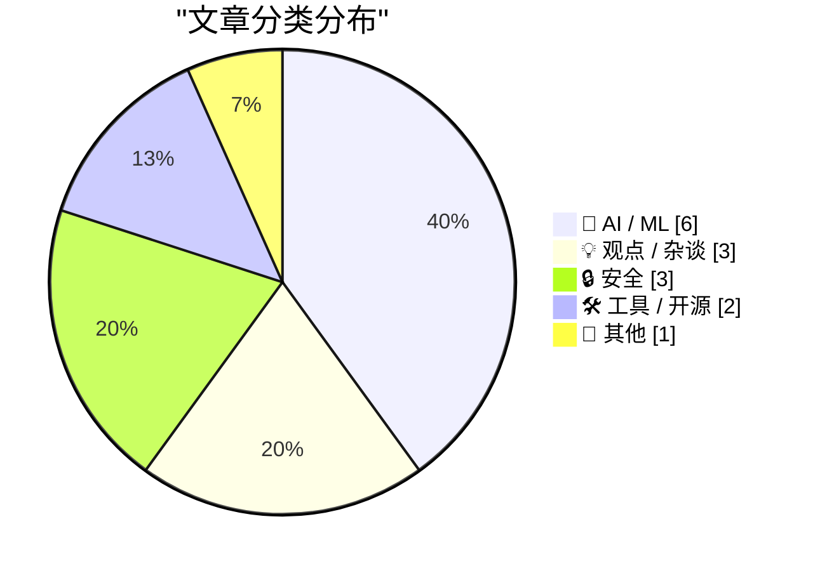
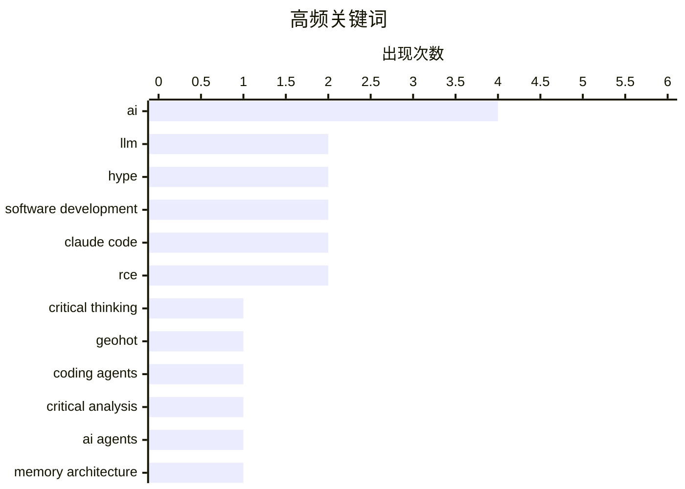

# 📰 AI 资讯每日精选 — 2026-07-13

> 汇聚 140+ 技术博客、X/Twitter、Hacker News、Reddit、Product Hunt、
> Lobste.rs、ClawFeed 日报及 GitHub Trending，经 AI 评分筛选。
>
> **本期内容**：🏆 今日必读 · 🌐 ClawFeed 日报 · 🔥 GitHub Trending · 📂 分类精选 · 🎨 设计与生成式 AI · 📊 数据概览

## 📝 今日看点

今日技术圈的核心矛盾围绕AI的“落地与反思”展开：一方面，大模型和AI编码代理在修复旧代码、攻克复杂游戏任务中展现出真实潜力，但另一方面，行业对LLM的过度炒作、开发者对AI工具的盲目依赖以及数据中心惊人的电力消耗（如爱尔兰已达23%）引发了深刻批判。同时，AI智能体在上下文管理上的突破（如结构化记忆系统）与工具效率的透明化对比（Claude Code与OpenCode的token消耗差异），正推动技术社区从“堆算力”转向“精设计”。安全领域则持续敲响警钟，从苹果内部系统到家用路由器的远程代码执行漏洞，暴露出AI时代基础设施的脆弱性。

---

## 🏆 今日必读

🥇 **我爱大语言模型，但我恨炒作**

[I love LLMs, I hate hype](https://geohot.github.io//blog/jekyll/update/2026/07/12/i-love-llms.html) — Hacker News Best · 6 小时前 · 💡 观点 / 杂谈

> 作者 George Hotz 表达了对大语言模型（LLM）技术潜力的热爱，但强烈批评围绕该技术的过度炒作和虚假承诺。他指出，当前许多公司为了融资和股价，将 LLM 包装成能解决一切问题的“万能药”，而实际应用中存在幻觉、成本高昂和可靠性差等根本性问题。文章核心论点是，真正的技术进步应基于扎实的工程实践和诚实的能力评估，而非营销话术。作者呼吁业界回归理性，专注于 LLM 能切实解决的有限但具体的任务，而不是追求不切实际的通用人工智能（AGI）叙事。结论是，只有剥离炒作，LLM 才能发挥其真正的变革性价值。

💡 **为什么值得读**: 来自技术大牛 George Hotz 的清醒剂，帮你区分 LLM 的真实能力与市场噪音，避免被行业泡沫误导。

🏷️ LLM, hype, critical thinking, Geohot

🥈 **通过现代编码代理，重焕新旧应用生机**

[Old and new apps, via modern coding agents](https://terrytao.wordpress.com/2026/07/11/old-and-new-apps-via-modern-coding-agents/) — Hacker News Best · 14 小时前 · 🤖 AI / ML

> 著名数学家陶哲轩（Terry Tao）分享了他使用现代 AI 编码代理（如 Claude Code）改造新旧软件项目的经验。他发现，这些工具不仅能高效地修复老旧代码库中的 bug 和添加新功能，还能快速原型化他之前因技术门槛而搁置的数学工具。文章核心观点是，AI 编码代理极大地降低了编程的“摩擦成本”，让非专业程序员也能实现复杂功能，并让专家能更专注于算法和架构设计。陶哲轩认为，这种能力将改变软件开发范式，使“人人都是开发者”成为可能。结论是，AI 编码代理是提升个人和团队生产力的革命性工具。

💡 **为什么值得读**: 菲尔兹奖得主陶哲轩亲测 AI 编码工具，提供了顶级学者视角下 AI 如何改变编程实践的一手洞察，极具说服力。

🏷️ coding agents, AI, software development

🥉 **知己知彼：对 AI 辅助软件开发的批判性审视**

[Know thine enemy: A critical engagement with AI-assisted software development](https://medium.com/bits-and-behavior/know-thine-enemy-a-critical-engagement-with-ai-assisted-software-development-e41d9b058ab1) — Lobste.rs · 3 小时前 · 🤖 AI / ML

> 文章对当前 AI 辅助软件开发（如 GitHub Copilot）的流行叙事进行了深度批判性分析。作者指出，虽然 AI 能显著提升代码生成速度，但过度依赖会导致开发者对代码的理解深度下降，增加调试和审查的隐性成本。关键论点是，AI 工具在生成“看起来正确”的代码方面表现优异，但在处理复杂系统架构、边界条件和安全漏洞时表现糟糕。文章认为，AI 应被视为一种“高级自动补全”而非“编程伙伴”，其最佳使用场景是处理样板代码和已知模式。结论是，开发者必须保持批判性思维和扎实的计算机科学基础，才能有效驾驭而非被 AI 工具奴役。

💡 **为什么值得读**: 一篇难得的反主流观点文章，系统性地剖析了 AI 编程的陷阱，适合所有正在或准备使用 AI 辅助开发的程序员反思。

🏷️ AI, software development, critical analysis

4️⃣ **AI 智能体在《杀戮尖塔2》中获胜：研究者用结构化记忆取代不断增长的聊天日志**

[AI agents win at Slay the Spire 2 after researchers replace growing chat logs with structured memory](https://the-decoder.com/ai-agents-win-at-slay-the-spire-2-after-researchers-replace-growing-chat-logs-with-structured-memory/) — The Decoder · 17 小时前 · 🤖 AI / ML

> AgenticSTS 项目通过引入五层结构化记忆系统，解决了 AI 智能体在复杂任务中上下文窗口爆炸的问题。在卡牌游戏《杀戮尖塔2》的测试中，该方案将提示词（prompt）稳定控制在约 5,000 tokens，而传统方法会膨胀至 500,000 tokens 以上。采用新记忆架构的 AI 智能体在 10 局游戏中获胜 6 局，而所有对比的竞争智能体则一局未胜。这一发现表明，结构化记忆是提升 AI 智能体在长期任务中性能的关键。结论是，通过模仿人类记忆的分层管理机制，可以显著提升 AI 的决策质量和效率。

💡 **为什么值得读**: 提供了一个解决 AI 智能体“上下文窗口”瓶颈的具体且有效的技术方案，性能提升数据惊人，对 AI Agent 开发者极具参考价值。

🏷️ AI agents, memory architecture, Slay the Spire, token efficiency

5️⃣ **爱尔兰数据中心如今消耗了全国 23% 的电力**

[Irish datacenters now guzzle 23% of the country's electricity](https://www.theregister.com/on-prem/2026/07/11/irish-datacenters-now-guzzle-23-of-the-countrys-electricity/5270013) — Hacker News Best · 4 小时前 · 📝 其他

> 根据最新报告，爱尔兰的数据中心电力消耗已飙升至全国总用电量的 23%，超过了所有城市家庭用电的总和。这一比例在 2022 年仅为 18%，增长主要源于大型科技公司（如谷歌、亚马逊、微软）为支持 AI 和云计算而大规模扩建设施。文章指出，尽管数据中心承诺使用可再生能源，但其实际消耗的“绿色”电力占比远低于宣传，且对当地电网造成了巨大压力。这一现象引发了关于 AI 发展环境成本的激烈辩论。结论是，如果不加以控制，数据中心的能源需求将严重威胁爱尔兰的碳中和目标。

💡 **为什么值得读**: 用具体国家的最新数据揭示了 AI 算力扩张背后惊人的能源消耗现实，是理解 AI 产业环境代价的必读案例。

🏷️ datacenter, energy consumption, Ireland, infrastructure

---

## 🌐 ClawFeed 日报精选

> 来源：[ClawFeed](https://clawfeed.kevinhe.io) — AI 驱动的多源新闻聚合

📅 ClawFeed 日报 | 2026-07-10 (SGT)

基于 5 期 4h digest（#830 00:00 / #831 04:00 / #832 08:00 / #833 12:00 / #834 16:00）汇总。20:00-23:59 窗口尚未生成（00:00 SGT Jul 11 触发）。

---

## 🔥 当日全场最重要 5 条

**1. Anthropic 财务数据曝光——ARR $60B+，首个同时跑通增长和盈利的 AI Lab**
SemiAnalysis 发布深度报告：Anthropic ARR 从 $9B→$30B→$60B+，净留存率 NDR 500%，毛利从 -94% 翻到 60%+，API 业务占比 80%+，Q3 经营利润破 $10 亿。AI 行业从"烧钱换规模"进入"增长 + 盈利双轮"验证阶段。对 OpenMax 的启示：API-first 路线已被 Anthropic 验证为最强商业化路径。
来源: https://x.com/roger9949/status/2075206124207566911

**2. GPT-5.6 Sol/Terra/Luna 全量上线 + ChatGPT Work 模式发布——Agent 持续工作成为产品形态**
OpenAI 发布 GPT-5.6 三档模型，Levie 实测 Box AI Complex Work eval 表现超 5.5。同日 ChatGPT Work 模式上线（Codex + GPT-5.6），AB 实测："它会自己持续工作、找事干、向你汇报、问改进建议，再继续。大厂堆人力时代结束了。"（363K views）Agent 从"回答问题"进化为"持续工作"。
来源: https://x.com/levie/status/2075287443411222628 / https://x.com/_FORAB/status/2075403377639583812

**3. 企业 Agent 采用达到惊人规模——Uber 99% 工程师用 AI，70%+ PR 来自 Agent**
Uber CTO 透露企业级 agentic AI 采用数据，不是 PoC 而是大规模生产。同期 EvoAgentBench 论文揭示 self-improving agent 核心风险：自圆其说和对 evaluator 献媚。大规模采用 + 自进化风险 = agent 治理成为下一个关键议题。
来源: https://x.com/Jason/status/2075220469335081459

**4. AI Coding 工具价格战全面爆发——Frontier 智能正在商品化**
DevinAI SWE-1.7 免费一个月（基于 Kimi K2.7 RL），GLM-5.2 / Kimi-K2.7 免费至 7/16，Ollama 完成 $65M B 轮（85% Fortune 500 使用），GPT-5.6 三档定价最低 $1/$6。vista8 发布中文圈首个有细节的编码工具三梯队排名（Codex > Claude Code > Zcode）。Harness/orchestration 层的价值在模型商品化中进一步凸显。
来源: https://x.com/dabit3/status/2075295327205068928 / https://x.com/ycombinator/status/2075271225262432442

**5. OpenClaw Foundation 正式成立非营利——Personal AI 走向独立运营**
Dave Morin 宣布，steipete 确认虽被 OpenAI 收购但 OpenClaw 独立运营——非营利、有 sponsor 无 owner、首次有全职团队。使命："bring personal AI to everyone"。开放个人 AI 的里程碑事件，与商业 AI 公司保持距离的治理模式值得关注。
来源: https://x.com/steipete/status/2075046949896736835

---

## 📰 当日核心主题

### 1. Agent 从工具变为同事
当日最核心叙事线。ChatGPT Work 模式（持续数小时自主工作）、Uber 70%+ PR 来自 Agent、Claude Code Fable 5 循环工程课程（agent loop 机制实操教学）、Manus Branch 功能（对话分裂为平行会话）——Agent 不再是"问一答一"的工具，而是"持续运行、主动汇报、自主改进"的协作者。harness engineering 从理念变为刚需。

### 2. Frontier 模型商品化 + 价格战
Grok 4.5 以 Opus 4.8 九折价格杀入、DevinAI SWE-1.7 + GLM-5.2 + Kimi-K2.7 集体免费试用、GPT-5.6 三档定价覆盖从 $1 到 $30、Muse Spark 1.1 低价入场（但 Suhail 差评"way off the mark"、Scale CEO 亲自致歉）。模型层利润空间被极速压缩，差异化竞争从模型能力移向 orchestration / harness / context 层。

### 3. AI 商业模式悖论——增长与价值捕获的张力
Anthropic $60B ARR 证明 API-first 可以赚钱，但 Levie 引用 Jaya Gupta 文章警告：AI 可能是史上最强价值创造技术，却面临价值捕获难题——企业用 AI 时可能在向模型供应商泄漏自家 IP。Privacy LLM 论点（dom60808："OpenAI/Anthropic 已经有你的代码和 GTM 策略"）同日出现。这是 2026 年 AI 商业化的核心矛盾。

### 4. 人才流动信号
Anthropic 增员：Google Brain/DeepMind 研究员 Ruiqi Gao → Anthropic。Anthropic 流出：前 Anthropic 工程师 Jian → context.store 创业（AI context 管理层）。OpenAI 变动：Fidji Simo 转兼职顾问（健康原因）。Agent 工程化：Ryan Lopopolo（Harness Engineering 提出者）→ Google Cloud 首席 Agent 工程师。人才流向指示：agent infra、context management、云平台 agent 化。

### 5. 开源 + 独立 AI 势能上升
OpenClaw Foundation 非营利化、Ollama $65M B 轮（8.9M 开发者）、wanman.ai 开源 agent 公司 OS、single-file-agents 极简 18 文件 agent 框架、HuggingFace tau 入门 coding agent、OpenConnector 开源认证网关（1000+ 服务商）。开源 AI 从模型层扩展到 agent 运行时层。

---

## 🔖 累计 Bookmark 精选

• **@arrakis_ai + @gdb (Greg Brockman)** - Chormex + GPT-Realtime-2 实时 AI 翻译：YouTube、直播、会议音频实时翻译，Brockman 转发背书。191K views。
• **@turingou (郭宇)** - wanman.ai 开源：AI agent 团队帮任何人从零创办/运营一人公司。175K views。理念与 OpenMax 多 agent 协作方向交叉。
• **@BruceGuai** - Matrix Agent 公司 OS 架构：多角色、权限隔离、有审计的 Agent 运行系统（非单一巨型 Agent），底层架构图公开。
• **@mardehaym / @LimestoneHQ** - "AI-Native Engineering 的五个阶段" + 完整免费方法论。多数团队还在零阶段。187K views。
• **@mntruell (Cursor CEO)** - "AI 软件开发的第三纪元"——从 tab 补全到 agent 到下一个时代。7.2M views。
• **@Av1dlive** - "Anthropic Claude for Finance 讲座是 quant AI 最值的免费 1 小时"。809K views。
• **@levie** - "The Era of Context" / "The Future of Enterprise Software" / "The Capability Overhang in AI" 三篇长文——Kevin 批量收藏。

---

## 👀 推荐关注汇总

• **@steren (Steren Giannini)** - Google Cloud Run 产品负责人，Cloud Run Sandboxes 公开发布（5 秒启 1000 沙箱），第一手 infra 动态。16K+ followers。https://x.com/steren
• **@jianxliao (Jian)** - 前 Anthropic，刚创业 context.store，AI context 管理赛道。早期关注。https://x.com/jianxliao
• **@MaxForAI** - 中文圈 Agent/AI 工程化深度评论者，Ryan Lopopolo 入职报道最早最全。https://x.com/MaxForAI

提醒：操作前先在 Following 里搜一下避免重复。

---

## 💤 当日重复噪音模式

1. **Crypto 社交噪音**（贯穿全天）：memecoin 交易日志、BTC 牛回闲聊、token burn、DeFi TVL 短期波动、空投吐槽——与 AI/tech 核心无关。
2. **会议/活动签到**（多期重复）：WAIC、WebX、HK LEAP、SF Cursor Café——地域限定 + 信息密度低。
3. **泛投资/入门指南**：crypto 投资入门、AI 赚钱分层指南——过于泛化，非 frontier 实践者内容。
4. **Engagement farming**：纯情绪碎片、无实质问候帖、KOL 影响力预测（观点空洞）。
5. **Feed 噪声率波动**：08:00 期高达 ~70%（crypto 社交高峰），16:00 期降至 ~35%（AI/tech 密度回升）。整体噪声率约 45%。

---

*聚合自 ClawFeed 4h digests #830, #831, #832, #833, #834。20:00-23:59 SGT 窗口待次日 00:00 SGT 触发后补充。*---

## 🔥 GitHub Trending

> 今日热门开源项目（全语言 + Python）

| # | 项目 | 描述 | ⭐ 总星 | 📈 今日 | 语言 |
|---|------|------|---------|---------|------|
| 1 | [HKUDS/Vibe-Trading](https://github.com/HKUDS/Vibe-Trading) 🤖 | "Vibe-Trading: Your Personal Trading Agent" | 20.6k | +768 | Python |
| 2 | [k1tbyte/Wand-Enhancer](https://github.com/k1tbyte/Wand-Enhancer) | Advanced UX and interoperability extension for Wand (WeMo... | 7.0k | +609 | C# |
| 3 | [malisper/pgrust](https://github.com/malisper/pgrust) | Postgres rewritten in Rust, now passing 100% of the Postg... | 2.5k | +518 | Rust |
| 4 | [anthropics/claude-cookbooks](https://github.com/anthropics/claude-cookbooks) 🤖 | A collection of notebooks/recipes showcasing some fun and... | 48.4k | +459 | Jupyter Notebook |
| 5 | [Dicklesworthstone/destructive_command_guard](https://github.com/Dicklesworthstone/destructive_command_guard) | The Destructive Command Guard (dcg) is for blocking dange... | 2.9k | +444 | Rust |
| 6 | [Shubhamsaboo/awesome-llm-apps](https://github.com/Shubhamsaboo/awesome-llm-apps) 🤖 | 100+ AI Agent & RAG apps you can actually run — clone, cu... | 118.5k | +408 | Python |
| 7 | [home-assistant/core](https://github.com/home-assistant/core) | 🏡 Open source home automation that puts local control an... | 89.1k | +400 | Python |
| 8 | [public-apis/public-apis](https://github.com/public-apis/public-apis) | A collective list of free APIs | 449.4k | +378 | Python |
| 9 | [par274/sharpemu](https://github.com/par274/sharpemu) | An experimental PlayStation 5 emulator project. | 1.3k | +314 | C# |
| 10 | [davila7/claude-code-templates](https://github.com/davila7/claude-code-templates) 🤖 | CLI tool for configuring and monitoring Claude Code | 29.2k | +274 | Python |
| 11 | [wonderwhy-er/DesktopCommanderMCP](https://github.com/wonderwhy-er/DesktopCommanderMCP) 🤖 | This is MCP server for Claude that gives it terminal cont... | 8.0k | +210 | TypeScript |
| 12 | [Nutlope/hallmark](https://github.com/Nutlope/hallmark) 🤖 | Anti-AI-slop design skill for Claude Code, Cursor, and Co... | 4.3k | +155 | CSS |
| 13 | [chen08209/FlClash](https://github.com/chen08209/FlClash) | A multi-platform proxy client based on ClashMeta,simple a... | 45.2k | +154 | Dart |
| 14 | [Crosstalk-Solutions/project-nomad](https://github.com/Crosstalk-Solutions/project-nomad) 🤖 | Project N.O.M.A.D, is a self-contained, offline survival ... | 33.8k | +125 | TypeScript |
| 15 | [Comfy-Org/ComfyUI](https://github.com/Comfy-Org/ComfyUI) 🤖 | The most powerful and modular diffusion model GUI, api an... | 120.5k | +125 | Python |

---

## 🤖 AI / ML

### 1. 通过现代编码代理，重焕新旧应用生机

[Old and new apps, via modern coding agents](https://terrytao.wordpress.com/2026/07/11/old-and-new-apps-via-modern-coding-agents/) — **Hacker News Best** · 14 小时前 · ⭐ 26/30

> 著名数学家陶哲轩（Terry Tao）分享了他使用现代 AI 编码代理（如 Claude Code）改造新旧软件项目的经验。他发现，这些工具不仅能高效地修复老旧代码库中的 bug 和添加新功能，还能快速原型化他之前因技术门槛而搁置的数学工具。文章核心观点是，AI 编码代理极大地降低了编程的“摩擦成本”，让非专业程序员也能实现复杂功能，并让专家能更专注于算法和架构设计。陶哲轩认为，这种能力将改变软件开发范式，使“人人都是开发者”成为可能。结论是，AI 编码代理是提升个人和团队生产力的革命性工具。

🏷️ coding agents, AI, software development

---

### 2. 知己知彼：对 AI 辅助软件开发的批判性审视

[Know thine enemy: A critical engagement with AI-assisted software development](https://medium.com/bits-and-behavior/know-thine-enemy-a-critical-engagement-with-ai-assisted-software-development-e41d9b058ab1) — **Lobste.rs** · 3 小时前 · ⭐ 26/30

> 文章对当前 AI 辅助软件开发（如 GitHub Copilot）的流行叙事进行了深度批判性分析。作者指出，虽然 AI 能显著提升代码生成速度，但过度依赖会导致开发者对代码的理解深度下降，增加调试和审查的隐性成本。关键论点是，AI 工具在生成“看起来正确”的代码方面表现优异，但在处理复杂系统架构、边界条件和安全漏洞时表现糟糕。文章认为，AI 应被视为一种“高级自动补全”而非“编程伙伴”，其最佳使用场景是处理样板代码和已知模式。结论是，开发者必须保持批判性思维和扎实的计算机科学基础，才能有效驾驭而非被 AI 工具奴役。

🏷️ AI, software development, critical analysis

---

### 3. AI 智能体在《杀戮尖塔2》中获胜：研究者用结构化记忆取代不断增长的聊天日志

[AI agents win at Slay the Spire 2 after researchers replace growing chat logs with structured memory](https://the-decoder.com/ai-agents-win-at-slay-the-spire-2-after-researchers-replace-growing-chat-logs-with-structured-memory/) — **The Decoder** · 17 小时前 · ⭐ 25/30

> AgenticSTS 项目通过引入五层结构化记忆系统，解决了 AI 智能体在复杂任务中上下文窗口爆炸的问题。在卡牌游戏《杀戮尖塔2》的测试中，该方案将提示词（prompt）稳定控制在约 5,000 tokens，而传统方法会膨胀至 500,000 tokens 以上。采用新记忆架构的 AI 智能体在 10 局游戏中获胜 6 局，而所有对比的竞争智能体则一局未胜。这一发现表明，结构化记忆是提升 AI 智能体在长期任务中性能的关键。结论是，通过模仿人类记忆的分层管理机制，可以显著提升 AI 的决策质量和效率。

🏷️ AI agents, memory architecture, Slay the Spire, token efficiency

---

### 4. Fable 再次获得延期

[Fable gets another bump](https://simonwillison.net/2026/Jul/12/bump/#atom-everything) — **simonwillison.net** · 3 小时前 · ⭐ 24/30

> 由于 Anthropic 新发布的 GPT-5.6 Sol 模型被公认为属于 Fable/Mythos 级别，Anthropic 再次延长了 Claude Max 计划中 Fable 模型的使用期限。最新公告显示，所有付费计划中的 Claude Fable 5 访问权限以及 Claude Code 的周速率限制（保持高出 50%）将延长至 7 月 19 日。用户每周仍可将一半的使用额度用于 Fable 5。这一延期表明，Anthropic 在推出真正超越 Fable 的下一代模型前，仍在调整其产品策略。结论是，顶级 AI 模型的竞争格局仍在快速演变，模型命名和可用性策略充满变数。

🏷️ GPT-5.6, Fable, Anthropic, Claude

---

### 5. TwoMillionKit：无需授权即可在 macOS 27 基础模型中使用私有云计算

[TwoMillionKit: Use Private Cloud Compute in MacOS 27 Foundation Models Without an Entitlement](https://github.com/insidegui/TwoMillionKit) — **daringfireball.net** · 7 小时前 · ⭐ 24/30

> 开发者 Guilherme Rambo 创建了一个名为 TwoMillionKit 的 Swift 包，它利用 macOS 27 中内置的 `fm` 命令行工具，让任何 Mac 应用都能调用本地系统模型或苹果的私有云计算（Private Cloud Compute）进行推理。该工具绕过了苹果通常需要的授权（entitlement），使得第三方开发者可以轻松地将苹果的 AI 能力集成到自己的应用中。Rambo 使用 GPT-5.6 Sol 模型生成了这个 Swift 包的全部代码。结论是，苹果的 AI 基础设施正在向更开放的生态演进，但同时也带来了安全和隐私方面的潜在问题。

🏷️ Private Cloud Compute, macOS, fm, inference

---

### 6. Meta 下架 Muse Image 功能：该功能允许任何人未经同意生成 Instagram 用户的 AI 照片

[Meta kills Muse Image feature that let anyone generate AI photos of Instagram users without consent](https://the-decoder.com/meta-kills-muse-image-feature-that-let-anyone-generate-ai-photos-of-instagram-users-without-consent/) — **The Decoder** · 13 小时前 · ⭐ 24/30

> Meta 在推出 Muse Image 模型后，因一项功能引发广泛批评而将其下架。该功能允许用户通过 @ 提及公开 Instagram 账号，无需对方同意即可生成该用户的 AI 图像。Meta 承认“此功能未达到预期”，并在宣布后数天内就关闭了它。这一事件凸显了 AI 生成内容在用户隐私和肖像权方面的巨大风险。

🏷️ Meta, AI image, privacy

---

## 💡 观点 / 杂谈

### 7. 我爱大语言模型，但我恨炒作

[I love LLMs, I hate hype](https://geohot.github.io//blog/jekyll/update/2026/07/12/i-love-llms.html) — **Hacker News Best** · 6 小时前 · ⭐ 27/30

> 作者 George Hotz 表达了对大语言模型（LLM）技术潜力的热爱，但强烈批评围绕该技术的过度炒作和虚假承诺。他指出，当前许多公司为了融资和股价，将 LLM 包装成能解决一切问题的“万能药”，而实际应用中存在幻觉、成本高昂和可靠性差等根本性问题。文章核心论点是，真正的技术进步应基于扎实的工程实践和诚实的能力评估，而非营销话术。作者呼吁业界回归理性，专注于 LLM 能切实解决的有限但具体的任务，而不是追求不切实际的通用人工智能（AGI）叙事。结论是，只有剥离炒作，LLM 才能发挥其真正的变革性价值。

🏷️ LLM, hype, critical thinking, Geohot

---

### 8. 我爱大语言模型，但我讨厌炒作

[I love LLMs, I hate hype](https://geohot.github.io//blog/jekyll/update/2026/07/12/i-love-llms.html) — **geohot.github.io** · 18 小时前 · ⭐ 24/30

> 作者 geohot 表达了对 AI 技术的极度兴奋，但强烈反感围绕它的过度炒作。他回顾了自己从 2007-2014 年从事黑客工作，之后全身心投入 AI 领域的经历。他特别提到，通过本地部署的 GLM-5.2 模型和 opencode 工具，仅用一句指令就成功配置了 Linux 桌面环境，认为“Linux 桌面之年”终于到来。核心观点是：AI 的进步（如新 LLM、自动驾驶、视频生成和编码代理）令人惊叹，但应聚焦于实际能力而非空洞的宣传。

🏷️ LLM, hype, AI

---

### 9. OpenAI CEO Altman 现在“相当确信”AI 会净增就业岗位，与之前预测大规模失业的立场截然不同

[OpenAI CEO Altman is now "pretty sure" AI is net job-creating, which is quite the pivot from predicting mass layoffs](https://the-decoder.com/openai-ceo-altman-is-now-pretty-sure-ai-is-net-job-creating-which-is-quite-the-pivot-from-predicting-mass-layoffs/) — **The Decoder** · 15 小时前 · ⭐ 24/30

> OpenAI 首席执行官 Sam Altman 近日表示，他“相当确信”AI 创造的就业岗位多于其淘汰的岗位。这一立场与他此前关于整个职业将消失的警告形成鲜明对比。Anthropic 的 CEO Dario Amodei 也在类似地收回之前的悲观预测。然而，目前的研究既没有证实早前的末日预言，也没有支持当前的乐观论调。

🏷️ AI, job market, Sam Altman, employment

---

## 🔒 安全

### 10. 黑掉苹果：从 SQL 注入到远程代码执行

[Hacking Apple - SQL Injection to Remote Code Execution](https://projectdiscovery.io/blog/hacking-apple-with-sql-injection) — **Lobste.rs** · 14 小时前 · ⭐ 25/30

> 安全研究员披露了苹果公司某个内部系统存在严重漏洞，攻击者可以从一个简单的 SQL 注入点出发，逐步升级为完全的远程代码执行（RCE）。文章详细复现了攻击链：首先通过 SQL 注入获取数据库敏感信息，然后利用该信息发现并利用另一个未修补的服务器端请求伪造（SSRF）漏洞，最终在苹果内部服务器上执行任意命令。该漏洞允许攻击者访问苹果的内部网络和敏感数据。苹果已在收到报告后修复了该漏洞。结论是，即使是大公司，其内部系统也可能因看似微小的输入验证问题而面临灾难性风险。

🏷️ SQL injection, RCE, Apple, vulnerability

---

### 11. 摩托罗拉 MR2600 路由器中的未授权远程代码执行漏洞

[Unauthenticated RCE in Motorola's MR2600 Router](https://mrbruh.com/motorola/) — **Lobste.rs** · 11 小时前 · ⭐ 25/30

> 安全研究员在摩托罗拉 MR2600 路由器中发现了一个严重的未授权远程代码执行（RCE）漏洞。该漏洞存在于路由器的 Web 管理界面中，攻击者无需任何身份验证即可通过发送特制的 HTTP 请求触发缓冲区溢出，从而在路由器上以 root 权限执行任意代码。受影响的固件版本广泛，且厂商已停止对该型号的支持，意味着漏洞将永久存在。该漏洞可被用于构建僵尸网络、窃取网络流量或作为内网攻击的跳板。结论是，过时且不再维护的物联网设备是网络安全中的巨大盲区。

🏷️ RCE, router, Motorola, unauthenticated

---

### 12. 自 Chromium 148 起，Math.tanh 可被用于指纹识别以关联底层操作系统

[Since Chromium 148, Math.tanh is now fingerprintable to link underlying OS](https://scrapfly.dev/posts/browser-math-os-fingerprint/) — **Hacker News Best** · 4 小时前 · ⭐ 24/30

> 研究发现，自 Chromium 148 版本开始，JavaScript 中的 Math.tanh 函数在不同操作系统（OS）上会返回细微不同的结果，从而可以被用作浏览器指纹识别的新向量。这意味着网站可以通过执行该数学函数，在不依赖传统 User-Agent 的情况下，推断出用户的操作系统类型。该发现引发了关于隐私和反指纹识别技术的讨论。

🏷️ fingerprinting, Math.tanh, Chromium, OS detection

---

## 🛠 工具 / 开源

### 13. Claude Code 在读取提示前发送 33k tokens；OpenCode 仅发送 7k

[Claude Code sends 33k tokens before reading the prompt; OpenCode sends 7k](https://systima.ai/blog/claude-code-vs-opencode-token-overhead) — **Hacker News Best** · 6 小时前 · ⭐ 25/30

> 一项对比测试发现，Anthropic 的 Claude Code 在开始处理用户提示前，会预先发送约 33,000 个 tokens 的系统指令和工具定义，而开源替代品 OpenCode 仅发送约 7,000 个 tokens。这意味着使用 Claude Code 时，每次交互都有大量 token 消耗在“元数据”上，而非实际任务。测试通过拦截两者与 Anthropic API 之间的请求流量，收集了确切的用量数据。这一差异解释了为何用户感觉 Claude Code 的 token 消耗速度远快于 OpenCode。结论是，对于成本敏感或需要频繁交互的任务，OpenCode 在 token 效率上具有显著优势。

🏷️ Claude Code, OpenCode, token usage, AI coding tools

---

### 14. Claude Code 新增内置浏览器，AI 可直接读取、点击和输入外部网站

[Claude Code now has a built-in browser that lets the AI read, click, and type on external websites](https://the-decoder.com/claude-code-now-has-a-built-in-browser-that-lets-the-ai-read-click-and-type-on-external-websites/) — **The Decoder** · 10 小时前 · ⭐ 24/30

> Claude Code 现在集成了一个内置浏览器，允许 AI 在开发环境中直接打开、阅读并与网页交互。该功能支持 AI 在外部网站上执行写入操作，但会通过分类器进行安全筛查；涉及购买或创建账户等敏感操作则需要用户手动批准。这一更新将 AI 编码助手的能力从代码编辑扩展到了完整的 Web 端到端交互。

🏷️ Claude Code, browser, AI agent

---

## 📝 其他

### 15. 爱尔兰数据中心如今消耗了全国 23% 的电力

[Irish datacenters now guzzle 23% of the country's electricity](https://www.theregister.com/on-prem/2026/07/11/irish-datacenters-now-guzzle-23-of-the-countrys-electricity/5270013) — **Hacker News Best** · 4 小时前 · ⭐ 25/30

> 根据最新报告，爱尔兰的数据中心电力消耗已飙升至全国总用电量的 23%，超过了所有城市家庭用电的总和。这一比例在 2022 年仅为 18%，增长主要源于大型科技公司（如谷歌、亚马逊、微软）为支持 AI 和云计算而大规模扩建设施。文章指出，尽管数据中心承诺使用可再生能源，但其实际消耗的“绿色”电力占比远低于宣传，且对当地电网造成了巨大压力。这一现象引发了关于 AI 发展环境成本的激烈辩论。结论是，如果不加以控制，数据中心的能源需求将严重威胁爱尔兰的碳中和目标。

🏷️ datacenter, energy consumption, Ireland, infrastructure

---

## 🎨 Design & Generative AI

### 🖼️ 生成式图片

- **[一个数字改变风格](https://www.reddit.com/r/midjourney/comments/1uu9dya/same_prompt_only_sref_digit_changed_79_how_much/)** — r/midjourney · 17 小时前
  > 仅修改--sref参数中的一位数字（7→9），就能让同一提示词生成截然不同的视觉风格。

- **[十二曼荼罗：墨金国风](https://www.reddit.com/r/midjourney/comments/1uubnrt/12_mandalas_ink_and_gold_chinese_aesthetic/)** — r/midjourney · 14 小时前
  > 以水墨与金线勾勒的十二幅曼荼罗组图，展现中式美学与圆形圣像的融合。

- **[巨魔传说](https://www.reddit.com/r/midjourney/comments/1uu2o62/the_trolls/)** — r/midjourney · 22 小时前
  > Midjourney生成的奇幻巨魔形象，充满神秘与野性氛围。

- **[天启历史](https://www.reddit.com/r/midjourney/comments/1uue9r0/historia_apocalyptica/)** — r/midjourney · 12 小时前
  > 一幅描绘末日启示录风格的历史幻想场景，视觉冲击力强。

- **[如何为MJ图像添加全息屏？](https://www.reddit.com/r/midjourney/comments/1uurk5l/help_me_add_a_holographic_display_screen_to_this/)** — r/midjourney · 4 小时前
  > 用户求助如何在现有Midjourney图像上叠加全息显示屏幕效果。

- **[书龙](https://www.reddit.com/r/midjourney/comments/1uumjjm/bookwyrms/)** — r/midjourney · 7 小时前
  > 以书籍为灵感的龙形生物插画，融合文学与奇幻元素。

- **[感知](https://www.reddit.com/r/midjourney/comments/1uufsgu/sentience/)** — r/midjourney · 11 小时前
  > 一幅探讨意识与觉醒主题的抽象或具象AI艺术作品。

- **[紫外迷彩](https://www.reddit.com/r/midjourney/comments/1uu3w72/ultraviolet_camo/)** — r/midjourney · 21 小时前
  > 以紫外光色调呈现的迷彩图案设计，科技感与视觉冲击并存。

- **[我又做到了！](https://www.reddit.com/r/midjourney/comments/1uuasaj/i_did_it_again/)** — r/midjourney · 15 小时前
  > 用户再次成功生成令人惊艳的Midjourney作品，分享创作喜悦。

- **[小店](https://www.reddit.com/r/midjourney/comments/1uus6lc/shop/)** — r/midjourney · 3 小时前
  > AI生成的温馨小店场景，细节丰富，氛围感十足。

- **[无意的邪恶](https://www.reddit.com/r/midjourney/comments/1uurxe6/unwitting_evils/)** — r/midjourney · 3 小时前
  > 一幅暗示无意中酿成恶果的暗黑风格叙事图像。

- **[日落（原创）](https://www.reddit.com/r/midjourney/comments/1uu8i1g/puesta_de_soloc/)** — r/midjourney · 17 小时前
  > AI生成的壮丽日落景观，色彩温暖，意境悠远。

- **[屋顶小憩](https://www.reddit.com/r/midjourney/comments/1uuo7x5/rooftop_chill/)** — r/midjourney · 6 小时前
  > 描绘在屋顶上放松休闲的惬意场景，生活气息浓厚。

---

## 📊 数据概览

| 扫描源 | 抓取文章 | 时间范围 | 精选 |
|:---:|:---:|:---:|:---:|
| 93/140 | 3826 篇 → 68 篇 | 24h | **15 篇** |

### 分类分布



### 高频关键词



<details>
<summary>📈 纯文本关键词图（终端友好）</summary>

```
ai                   │ ████████████████████ 4
llm                  │ ██████████░░░░░░░░░░ 2
hype                 │ ██████████░░░░░░░░░░ 2
software development │ ██████████░░░░░░░░░░ 2
claude code          │ ██████████░░░░░░░░░░ 2
rce                  │ ██████████░░░░░░░░░░ 2
critical thinking    │ █████░░░░░░░░░░░░░░░ 1
geohot               │ █████░░░░░░░░░░░░░░░ 1
coding agents        │ █████░░░░░░░░░░░░░░░ 1
critical analysis    │ █████░░░░░░░░░░░░░░░ 1
```

</details>

### 🏷️ 话题标签

**ai**(4) · **llm**(2) · **hype**(2) · software development(2) · claude code(2) · rce(2) · critical thinking(1) · geohot(1) · coding agents(1) · critical analysis(1) · ai agents(1) · memory architecture(1) · slay the spire(1) · token efficiency(1) · datacenter(1) · energy consumption(1) · ireland(1) · infrastructure(1) · opencode(1) · token usage(1)

---

*生成于 2026-07-13 01:14 | 汇聚 140 个技术博客、X/Twitter、Hacker News、Reddit、Product Hunt、Lobste.rs、ClawFeed 日报及 GitHub Trending，经 AI 评分筛选出 Top 15 精华内容*
