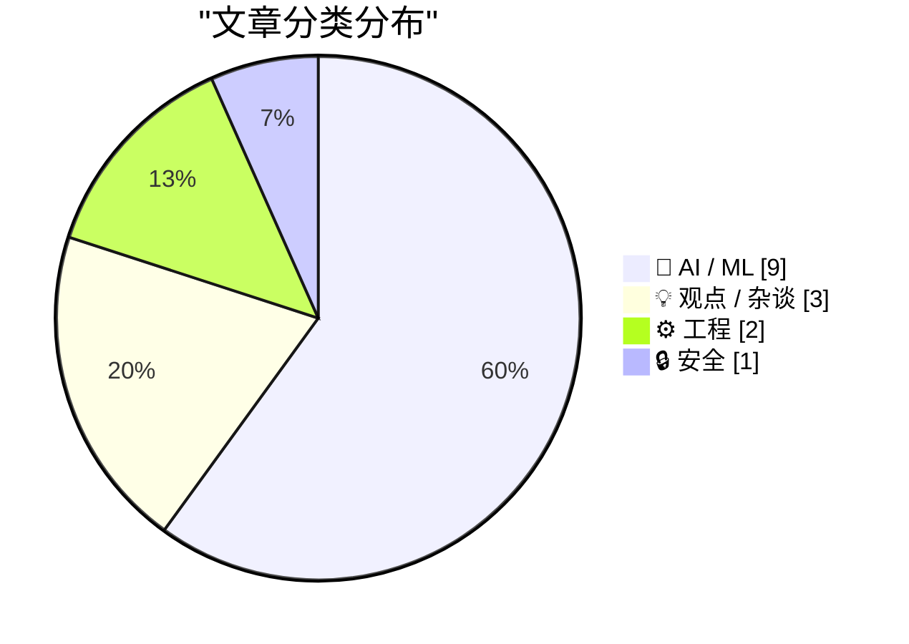
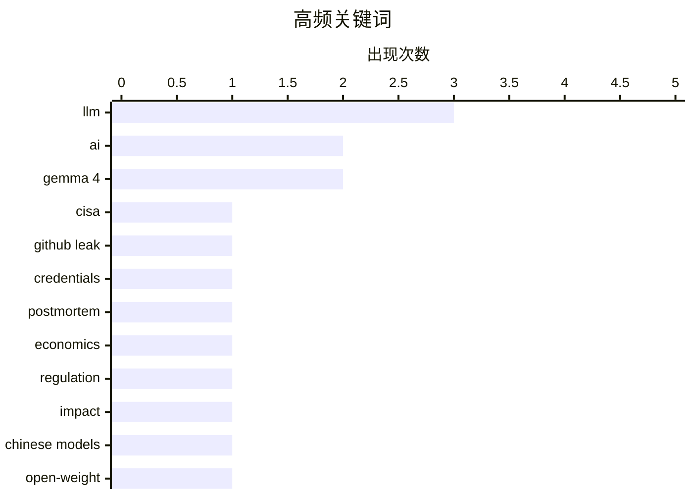

# 📰 AI 资讯每日精选 — 2026-07-14

> 汇聚 140+ 技术博客、X/Twitter、Hacker News、Reddit、Product Hunt、
> Lobste.rs、ClawFeed 日报及 GitHub Trending，经 AI 评分筛选。
>
> **本期内容**：🏆 今日必读 · 🌐 ClawFeed 日报 · 🔥 GitHub Trending · 📂 分类精选 · 🎨 设计与生成式 AI · 📊 数据概览

## 📝 今日看点

今日技术圈聚焦两大趋势：一是AI开源生态加速分化，企业为降低成本转向中国开源权重模型，同时开发者成功将Gemma 4等模型嵌入游戏引擎，推动本地化推理落地；二是围绕AI治理的争议升温，从CISA的凭证泄露教训到纳德拉对闭源模型“双标”行为的批评，再到诺贝尔奖得主联合呼吁为AI经济冲击做好准备，行业正从技术狂热转向对安全、公平与长期影响的深度反思。

---

## 🏆 今日必读

🥇 **从CISA最近的GitHub泄露事件中吸取的教训**

[Lessons Learned from CISA’s Recent GitHub Leak](https://krebsonsecurity.com/2026/07/lessons-learned-from-cisas-recent-github-leak/) — krebsonsecurity.com · 10 小时前 · 🔒 安全

> 美国网络安全和基础设施安全局（CISA）发布了一份关于数据泄露的事后分析报告，一名承包商将包括AWS Govcloud密钥在内的数十个内部凭证发布在公共GitHub仓库中，近六个月后才被KrebsOnSecurity通知。专家指出，CISA的初始响应中暴露的漏洞为所有安全团队提供了重要教训。该事件凸显了凭证管理、监控和响应流程中的关键缺陷。核心结论是，组织必须加强内部安全审计和第三方承包商的风险管理。

💡 **为什么值得读**: 真实的安全事故复盘，揭示了政府级安全响应中的具体漏洞，对任何组织的凭证管理和供应链安全都有直接警示意义。

🏷️ CISA, GitHub leak, credentials, postmortem

🥈 **诺贝尔奖得主和AI领袖警告：为AI经济影响做准备的时间窗口正在迅速关闭**

[Nobel laureates and AI leaders warn the window to prepare for AI's economic impact is closing fast](https://the-decoder.com/nobel-laureates-and-ai-leaders-warn-the-window-to-prepare-for-ais-economic-impact-is-closing-fast/) — The Decoder · 9 小时前 · 💡 观点 / 杂谈

> 包括16位诺贝尔奖得主以及来自Google、OpenAI和Anthropic的代表在内的200多位经济学家和AI研究人员联合发表声明，呼吁立即采取行动。他们认为AI的变革可能超越工业革命，但发生时间将大幅缩短。声明并未提出具体措施，且目前的研究尚未发现AI对劳动力市场产生显著影响。核心观点是，社会必须加速政策制定，以应对即将到来的大规模经济冲击。

💡 **为什么值得读**: 汇集了顶尖经济学家和AI领袖的罕见联合警告，虽然缺乏具体方案，但其共识本身具有极高的政策风向标价值。

🏷️ AI, economics, regulation, impact

🥉 **FT：企业转向中国开源权重模型以降低成本**

[FT: Companies Turn to Chinese Open Weight Models to Cut Costs](https://www.reddit.com/r/LocalLLaMA/comments/1uvenf1/ft_companies_turn_to_chinese_open_weight_models/) — r/LocalLLaMA · 9 小时前 · 🤖 AI / ML

> 据英国《金融时报》报道，越来越多的企业开始采用中国的开源权重模型（如DeepSeek、Qwen等）来替代昂贵的闭源模型，以大幅削减AI部署成本。这些模型在性能上接近顶尖闭源模型，但推理成本可降低数倍。这一趋势正在重塑全球AI产业链，对OpenAI等闭源提供商构成竞争压力。核心结论是，成本优势正成为企业选择AI模型的关键决策因素。

💡 **为什么值得读**: 提供了市场趋势的硬数据，直接解释了为什么中国开源模型正在全球范围内获得商业认可，对AI选型决策有重要参考价值。

🏷️ Chinese models, open-weight, cost reduction, enterprise

4️⃣ **控制思想，而非代码**

[Control the ideas, not the code](http://antirez.com/news/169) — antirez.com · 13 小时前 · 💡 观点 / 杂谈

> Redis创始人antirez反思了AI编程时代的核心矛盾：程序员不应执着于“手写每一行代码”的旧范式，而应专注于控制核心思想和架构。他本人虽已重返Redis并开发新的本地LLM推理开源软件，但仍坚持认为，过度依赖AI生成代码会导致对底层逻辑失去掌控。核心观点是，未来的竞争力在于定义问题和设计系统，而非逐行编写代码。

💡 **为什么值得读**: 来自顶级程序员的深度哲学思考，挑战了当前AI编程热潮中的主流叙事，对开发者如何保持长期竞争力具有启发意义。

🏷️ AI, programming, ideas, antirez

5️⃣ **图灵奖得主Rich Sutton创立Oak Lab，构建自主学习AI智能体**

[Turing Award winner Rich Sutton founds Oak Lab to build AI agents that learn on their own](https://the-decoder.com/turing-award-winner-rich-sutton-founds-oak-lab-to-build-ai-agents-that-learn-on-their-own/) — The Decoder · 7 小时前 · 🤖 AI / ML

> 2024年图灵奖得主、现代强化学习联合创始人Richard Sutton在多伦多创立了新公司Oak Lab。他批评当前的深度学习方法“弱且低效”，并致力于构建能够从环境中持续学习的AI智能体。Sutton认为，当前依赖大规模数据和算力的范式存在根本性局限，真正的智能应源于与环境的持续交互。核心目标是开发一种全新的、更接近生物学习机制的AI架构。

💡 **为什么值得读**: 强化学习之父亲自下场创业，直接挑战当前深度学习主流范式，其技术路线可能引领下一代AI研究方向的变革。

🏷️ reinforcement learning, AI agents, Sutton, startup

---

## 🌐 ClawFeed 日报精选

> 来源：[ClawFeed](https://clawfeed.kevinhe.io) — AI 驱动的多源新闻聚合

# ClawFeed 日报 | 2026-07-13 (Sun)

> 聚合 4 期 4h digest（#838 00:00 / #839 08:00 / #840 12:00 / #841 16:00 SGT）
> 素材总计：feed 123 + bookmarks 80（bookmarks 连续 4 期全重复）

---

## 🔥 当日全场 Top 5

1. **Anthropic 官方背书 "Fable 5 规划 + Sonnet 5 执行" 架构**——96% 的 Fable 5 性能只花 46% 的成本（BrowseComp 86.8% vs 90.8%）。"用最贵模型当顾问，执行全交给便宜模型"正式成为官方推荐的 agent 设计模式。[#841] 来源: https://x.com/LimestoneHQ/status/2076559490850165122

2. **Gemini 3.5 Pro 内测传闻全面超越 Fable 5 和 GPT-5.6**——据称谷歌内部私有评测 zero-shot 表现较 3.1 Pro 有跨越式突破，消息未经官方证实但已在中文 AI 圈刷屏。若属实，将打破 Anthropic/OpenAI 双寡头格局。[#841] 来源: https://x.com/oragnes/status/2076406013184671811

3. **Claude 官方延长 Fable 5 访问至 7/19 + Claude Code 周限额上调 50%**——10M views，对所有付费用户的直接利好。[#839] 来源: https://x.com/claudeai/status/2076351399999557669

4. **Satya Nadella《逆向信息悖论》刷屏全天**——企业用 AI"付两次钱"：一次现金，一次用机构知识（每个 prompt、每次纠正都在训练模型）。跨 4 期被不同博主反复引用讨论，当日传播最广的单一话题。[#838→#841 全天] 来源: https://x.com/mardehaym/status/2076336758908662206

5. **Citadel 创始人 Ken Griffin：AI 数周复现博士级量化研究员 6-8 周工作**——竞争护城河正在"以闪电速度"被填平。顶级对冲基金视角的 AI 冲击一线证言。10K views。[#839] 来源: https://x.com/Ariston_Macro/status/2076311728120558033

---

## 📰 当日核心主题

### 1. AI Agent 工程化加速成熟
当日最密集的技术话题。多个信号同时出现：
- **架构范式**：Anthropic 官方推 Fable 5+Sonnet 5 分层架构（规划/执行分离）
- **Skill 工程化**：Skillgrade 2.0（给 Agent Skills 写单元测试）+ 微软开源 SkillOpt（自动优化 SKILL.md prompt）
- **Agent 脚手架变薄**：Anthropic 高管分享 agent 开发范式演变，几个月前需大量流程控制代码，现在模型能力提升后越来越多交给模型自身
- **落地案例**：ChatCut（AI 剪辑 agent）、TREK（旅行规划器+MCP 150 tools）、agent-device（移动端自动化 CLI）、Hermes 外贸 WhatsApp 客服

### 2. Nadella "逆向信息悖论" 与企业 AI 知识产权焦虑
当日传播最广的单一概念。Satya Nadella 文章被 4 期 digest 反复引用（@mardehaym、@vasuman、@PANewsCN、@wlzh），核心洞察：企业每次使用 AI 都在向模型"泄漏"核心知识。呼应 Kenneth Arrow 的信息市场悖论。Thinking Machines Lab（Mira Murati 公司）同日发布的 AI 哲学宣言也在回应类似问题。

### 3. 模型竞争白热化 + 成本博弈
- Gemini 3.5 Pro 内测传闻（未证实）
- Fable 5 延期 + 限额上调（官方确认）
- DeepSeek v4 Pro vs Claude+Codex 成本对比：同等 token 量下 DeepSeek 反而更贵
- DevinX 上线多模型选择器（Sol/Fable 5/GLM/Kimi/Adaptive）

### 4. Crypto/DeFi 市场动态
- Robinhood Chain 24h 交易量超 ETH，Backpack 钱包接入，零手续费
- ETH 估值方法论辩论（安全结算层 vs P/E 模型）
- Pi Network 市值从 $20B 跌破 $10B
- Uniswap 日手续费 $520 万，仅次于 Tether/Circle
- 能源地缘冲突推高油价 4.5%，黄金/BTC 罕见同步下跌
- AI 微型企业/零工支付或推动稳定币 2033 年交易量达 $262B

### 5. AI 对知识工作的冲击辩论
两极观点同日碰撞：
- 看空方：Citadel Griffin "护城河以闪电速度被填平"；智谱唐杰 "AI 疯狂递归自我改进"
- 看多方：Aaron Levie "AI 不会消灭软件工作，反而加速增长"（经济学逻辑：成本降低→需求上升→更多产出→更多岗位，208K views）
- 中间派：玉伯论 AI 应用分类——效率类被大厂吞噬，效果类（帮企业赚钱）才是创业机会

---

## 🔖 Bookmarks 精选

本日 4 期 bookmarks（共 80 条）全部与往期重复，连续第 4 期无新增。固定池包括：
- Aaron Levie 系列（Era of Context / 未来企业软件 / 能力过剩）
- Harness Engineering 42%→78% 效率提升
- Cline Kanban、wanman.ai、Matrix Agent OS
- Cursor 第三时代、Google Stitch DESIGN.md
- Anthropic Finance breakdown、Chormex 实时翻译

**建议 Kevin 清理旧 bookmarks 或补充新收藏**——当前 bookmarks 池已无法提供增量信息。

---

## 👀 推荐关注汇总

4 期均未发现新的高质量未关注账号。

---

## 🧹 建议取关（去重汇总）

| 账号 | 理由 | 提及期数 |
|------|------|----------|
| @HeXiaobo (David.He) | 2018 年 7 月最后一条推文，僵尸号 7 年+ | #838-#841 连续 4 期 |
| @0xJasonBateman | 8 粉丝，最近原创 4 月 10 日（内容仅为数字"90"），与 AI/crypto 无关 | #841 |
| @Soft6161 (软萌子) | 近期以付费合作广告为主，内容与主线脱节 | #841 |

---

## 💤 当日重复噪音模式

| 模式 | 频率 | 说明 |
|------|------|------|
| Meme 币/抽奖/竞猜推广 | 每期 3-5 条 | MetaWin、OKX、Deepcoin、PredictFun 等 |
| GM/晚安/寒暄帖 | 每期 2-3 条 | 单字回复、鸭子图、无实质内容问候 |
| Elon Musk 非核心转发 | 每期 1-2 条 | SpaceX、播客应用、无文字视频 |
| 政治/体育/宗教内容 | 散发 | 与 AI/crypto 主线无关 |
| 付费推广/站台帖 | 每期 1-2 条 | KorProtocol、TripleT 等合作广告 |

**全天平均噪声率约 50%**，AI/crypto 信号密度中等，集中在 agent 工程化落地和模型成本/性能博弈两条主线。

---

*Generated by Lisa · ClawFeed Daily Digest Pipeline*
---

## 🔥 GitHub Trending

> 今日热门开源项目（全语言 + Python）

| # | 项目 | 描述 | ⭐ 总星 | 📈 今日 | 语言 |
|---|------|------|---------|---------|------|
| 1 | [OpenCut-app/OpenCut](https://github.com/OpenCut-app/OpenCut) | The open-source CapCut alternative | 66.3k | +1229 | TypeScript |
| 2 | [HKUDS/Vibe-Trading](https://github.com/HKUDS/Vibe-Trading) 🤖 | "Vibe-Trading: Your Personal Trading Agent" | 21.7k | +1153 | Python |
| 3 | [Graphify-Labs/graphify](https://github.com/Graphify-Labs/graphify) 🤖 | AI coding assistant skill (Claude Code, Codex, OpenCode, ... | 84.7k | +1095 | Python |
| 4 | [Shubhamsaboo/awesome-llm-apps](https://github.com/Shubhamsaboo/awesome-llm-apps) 🤖 | 100+ AI Agent & RAG apps you can actually run — clone, cu... | 119.6k | +996 | Python |
| 5 | [Nutlope/hallmark](https://github.com/Nutlope/hallmark) 🤖 | Anti-AI-slop design skill for Claude Code, Cursor, and Co... | 5.1k | +794 | CSS |
| 6 | [github/spec-kit](https://github.com/github/spec-kit) | 💫 Toolkit to help you get started with Spec-Driven Devel... | 120.6k | +543 | Python |
| 7 | [hasaneyldrm/exercises-dataset](https://github.com/hasaneyldrm/exercises-dataset) | 1,324-exercise fitness dataset — animation GIFs, 180×180 ... | 12.6k | +451 | HTML |
| 8 | [public-apis/public-apis](https://github.com/public-apis/public-apis) | A collective list of free APIs | 449.7k | +359 | Python |
| 9 | [virattt/ai-hedge-fund](https://github.com/virattt/ai-hedge-fund) 🤖 | An AI Hedge Fund Team | 61.6k | +330 | Python |
| 10 | [coreyhaines31/marketingskills](https://github.com/coreyhaines31/marketingskills) 🤖 | Marketing skills for Claude Code and AI agents. CRO, copy... | 38.6k | +299 | JavaScript |
| 11 | [PrefectHQ/prefect](https://github.com/PrefectHQ/prefect) | Prefect is a workflow orchestration framework for buildin... | 23.3k | +254 | Python |
| 12 | [TauricResearch/TradingAgents](https://github.com/TauricResearch/TradingAgents) 🤖 | TradingAgents: Multi-Agents LLM Financial Trading Framework | 92.8k | +245 | Python |
| 13 | [practical-tutorials/project-based-learning](https://github.com/practical-tutorials/project-based-learning) | Curated list of project-based tutorials | 273.2k | +179 | Python |
| 14 | [simonlin1212/TradingAgents-astock](https://github.com/simonlin1212/TradingAgents-astock) 🤖 | A股多Agent投研框架 — 适配A股数据源(龙虎榜/游资/解禁等)，7位分析师基于A股规则的辩论决策，基于Tra... | 2.1k | +179 | Python |
| 15 | [3b1b/manim](https://github.com/3b1b/manim) | Animation engine for explanatory math videos | 88.5k | +133 | Python |

---

## 🤖 AI / ML

### 1. FT：企业转向中国开源权重模型以降低成本

[FT: Companies Turn to Chinese Open Weight Models to Cut Costs](https://www.reddit.com/r/LocalLLaMA/comments/1uvenf1/ft_companies_turn_to_chinese_open_weight_models/) — **r/LocalLLaMA** · 9 小时前 · ⭐ 25/30

> 据英国《金融时报》报道，越来越多的企业开始采用中国的开源权重模型（如DeepSeek、Qwen等）来替代昂贵的闭源模型，以大幅削减AI部署成本。这些模型在性能上接近顶尖闭源模型，但推理成本可降低数倍。这一趋势正在重塑全球AI产业链，对OpenAI等闭源提供商构成竞争压力。核心结论是，成本优势正成为企业选择AI模型的关键决策因素。

🏷️ Chinese models, open-weight, cost reduction, enterprise

---

### 2. 图灵奖得主Rich Sutton创立Oak Lab，构建自主学习AI智能体

[Turing Award winner Rich Sutton founds Oak Lab to build AI agents that learn on their own](https://the-decoder.com/turing-award-winner-rich-sutton-founds-oak-lab-to-build-ai-agents-that-learn-on-their-own/) — **The Decoder** · 7 小时前 · ⭐ 24/30

> 2024年图灵奖得主、现代强化学习联合创始人Richard Sutton在多伦多创立了新公司Oak Lab。他批评当前的深度学习方法“弱且低效”，并致力于构建能够从环境中持续学习的AI智能体。Sutton认为，当前依赖大规模数据和算力的范式存在根本性局限，真正的智能应源于与环境的持续交互。核心目标是开发一种全新的、更接近生物学习机制的AI架构。

🏷️ reinforcement learning, AI agents, Sutton, startup

---

### 3. 我用现代工作负载对15块“电子垃圾”GPU进行了基准测试

[I benchmarked 15 "E-Waste" GPUs with Modern Workloads](https://www.reddit.com/r/LocalLLaMA/comments/1uvcjd0/i_benchmarked_15_ewaste_gpus_with_modern_workloads/) — **r/LocalLLaMA** · 10 小时前 · ⭐ 24/30

> 作者花费一年时间，对15款被归类为“电子垃圾”的旧款GPU（如GTX 1060、RX 580等）进行了现代AI推理和渲染工作负载的基准测试。结果显示，部分旧款GPU在特定低精度推理任务中仍具性价比，性能可达现代中端卡的30%-50%，但功耗和显存是主要瓶颈。核心结论是，对于预算有限的个人开发者或小团队，某些“电子垃圾”GPU仍是可行的入门选择。

🏷️ GPU, benchmark, e-waste, LLM

---

### 4. 实验：由Gemma 4 E2B驱动的浏览器内自主NPC

[Experiment: autonomous NPCs powered by Gemma 4 E2B in the browser](https://www.reddit.com/r/LocalLLaMA/comments/1uv3wnt/experiment_autonomous_npcs_powered_by_gemma_4_e2b/) — **r/LocalLLaMA** · 18 小时前 · ⭐ 24/30

> 开发者进行了一项实验，在浏览器中利用Gemma 4的E2B（环境到行为）能力创建了自主驱动的非玩家角色（NPC）。这些NPC能够根据环境变化自主决策和行动，无需预设脚本。实验展示了将轻量级LLM直接嵌入浏览器以驱动复杂游戏AI的可行性。核心意义在于，这为游戏开发中的动态叙事和智能交互提供了新的低成本方案。

🏷️ Gemma 4, NPC, browser, autonomous

---

### 5. Flash-MSA：利用稀疏注意力内核加速百万Token训练

[Flash-MSA: Accelerating Million-Token Training With Sparse Attention Kernels](https://www.reddit.com/r/LocalLLaMA/comments/1uv1f1q/flashmsa_accelerating_milliontoken_training_with/) — **r/LocalLLaMA** · 20 小时前 · ⭐ 24/30

> 研究人员提出了Flash-MSA，一种新的稀疏注意力机制内核，旨在加速百万级Token序列的训练。该方法通过优化注意力计算中的稀疏模式，在保持模型质量的同时，将训练速度提升了数倍，并显著降低了显存占用。与标准FlashAttention相比，Flash-MSA在长序列任务中表现出更优的扩展性。核心贡献是使超长上下文模型的训练变得更加可行和高效。

🏷️ Flash-MSA, sparse attention, training, LLM

---

### 6. Flint：在不破坏推理能力的前提下压缩模型

[[Study/Models] Flint: Compressing Reasoning Without Breaking It](https://www.reddit.com/r/LocalLLaMA/comments/1uv9o2u/studymodels_flint_compressing_reasoning_without/) — **r/LocalLLaMA** · 12 小时前 · ⭐ 24/30

> 该研究探讨了如何在压缩大型语言模型的同时，保留其复杂的推理能力。Flint 提出了一种新的压缩方法，通过识别并保留模型中对推理至关重要的“关键路径”，同时压缩其他冗余部分。实验表明，Flint 在将模型体积压缩 50% 的情况下，在数学和逻辑推理基准测试中的性能损失不到 2%，远优于传统的剪枝和量化方法。作者的核心观点是，推理能力并非均匀分布在所有参数中，针对性地保护关键结构可以实现高效压缩而不牺牲核心智能。

🏷️ Flint, reasoning, compression, LLM

---

### 7. 德国 AI 联盟发布 Soofi S：一个在英德双语基准测试中领先的开源 30B 模型

[German AI consortium releases Soofi S, an open 30B model that tops benchmarks in both English and German](https://the-decoder.com/german-ai-consortium-releases-soofi-s-an-open-30b-model-that-tops-benchmarks-in-both-english-and-german/) — **The Decoder** · 13 小时前 · ⭐ 23/30

> 德国研究联盟发布了 Soofi S 30B-A3B，这是一个完全在慕尼黑德国电信云基础设施上训练的开源语言模型。该模型采用高效的混合架构，每个 token 仅激活 31.6 亿总参数中的一小部分，即使在超长上下文下也能保持稳定吞吐量。训练数据集特意增加了德语权重，使其在所有完全开源竞品中，在德语和英语基准测试中均排名第一。作者认为，Soofi S 证明了非英语中心的高质量开源模型同样可以达到世界级水平。

🏷️ open model, German, 30B, hybrid architecture

---

### 8. Google 的 SensorFM：将杂乱的穿戴传感器数据转化为通用健康智能层

[Google’s SensorFM turns messy wearable sensor data into a general-purpose health intelligence layer](https://the-decoder.com/sensorfm/) — **The Decoder** · 15 小时前 · ⭐ 23/30

> Google Research 发布了 SensorFM，这是一个基于超过一万亿分钟穿戴数据训练的基础模型，数据来自五百万 Fitbit 和 Pixel Watch 用户。该模型在 35 项健康和行为预测任务中，有 34 项超越了现有基准。SensorFM 未来可能为 Google 的 AI 健康教练提供动力，但公司尚未公布任何集成计划。作者认为，SensorFM 标志着可穿戴健康数据从特定任务分析向通用智能平台的转变。

🏷️ foundation model, wearable, health, Google

---

### 9. PrismML 发布 Qwen-3.6-27B 压缩版：获 Khosla 支持的初创公司声称实现 iPhone 上最大 AI 模型突破

[Compressed Version of Qwen-3.6-27B coming from PrismML - Khosla-Backed Startup Claims Breakthrough With Largest-Ever AI Model on an iPhone](https://www.reddit.com/r/LocalLLaMA/comments/1uv54fv/compressed_version_of_qwen3627b_coming_from/) — **r/LocalLLaMA** · 17 小时前 · ⭐ 23/30

> Khosla Ventures 支持的初创公司 PrismML 宣布推出 Qwen-3.6-27B 的压缩版本，声称这是有史以来在 iPhone 上运行的最大 AI 模型。该压缩技术通过创新的稀疏化和知识蒸馏方法，将 27B 参数的模型压缩到可在移动设备上实时推理，同时保持 90% 以上的原始性能。作者认为，这一突破将极大推动端侧大模型的应用，使复杂推理任务不再依赖云端。

🏷️ Qwen, model compression, iPhone, PrismML

---

## 💡 观点 / 杂谈

### 10. 诺贝尔奖得主和AI领袖警告：为AI经济影响做准备的时间窗口正在迅速关闭

[Nobel laureates and AI leaders warn the window to prepare for AI's economic impact is closing fast](https://the-decoder.com/nobel-laureates-and-ai-leaders-warn-the-window-to-prepare-for-ais-economic-impact-is-closing-fast/) — **The Decoder** · 9 小时前 · ⭐ 26/30

> 包括16位诺贝尔奖得主以及来自Google、OpenAI和Anthropic的代表在内的200多位经济学家和AI研究人员联合发表声明，呼吁立即采取行动。他们认为AI的变革可能超越工业革命，但发生时间将大幅缩短。声明并未提出具体措施，且目前的研究尚未发现AI对劳动力市场产生显著影响。核心观点是，社会必须加速政策制定，以应对即将到来的大规模经济冲击。

🏷️ AI, economics, regulation, impact

---

### 11. 控制思想，而非代码

[Control the ideas, not the code](http://antirez.com/news/169) — **antirez.com** · 13 小时前 · ⭐ 24/30

> Redis创始人antirez反思了AI编程时代的核心矛盾：程序员不应执着于“手写每一行代码”的旧范式，而应专注于控制核心思想和架构。他本人虽已重返Redis并开发新的本地LLM推理开源软件，但仍坚持认为，过度依赖AI生成代码会导致对底层逻辑失去掌控。核心观点是，未来的竞争力在于定义问题和设计系统，而非逐行编写代码。

🏷️ AI, programming, ideas, antirez

---

### 12. 纳德拉指责OpenAI和Anthropic等AI实验室：一边禁止蒸馏，一边用别人的数据训练

[Nadella calls out AI labs like OpenAI and Anthropic for banning distillation while training on everyone else's data](https://the-decoder.com/nadella-calls-out-ai-labs-like-openai-and-anthropic-for-banning-distillation-while-training-on-everyone-elses-data/) — **The Decoder** · 10 小时前 · ⭐ 24/30

> 微软CEO萨提亚·纳德拉公开批评OpenAI和Anthropic存在“反向信息悖论”：它们基于合理使用原则利用公共数据训练模型，却禁止他人对自己的模型进行蒸馏，同时还在从用户交互中学习。纳德拉呼吁企业应掌控自己的学习基础设施，而微软恰好销售此类产品。核心观点是，AI行业需要更公平的数据使用和模型共享规则。

🏷️ distillation, fair use, Nadella, AI ethics

---

## ⚙️ 工程

### 13. 我仅用GDScript和Vulkan计算着色器在Godot引擎内直接运行了Gemma 4

[I got Gemma 4 running directly inside Godot using only GDScript and Vulkan compute shaders](https://www.reddit.com/r/LocalLLaMA/comments/1uv66by/i_got_gemma_4_running_directly_inside_godot_using/) — **r/LocalLLaMA** · 16 小时前 · ⭐ 24/30

> 一名开发者成功将Google的Gemma 4模型直接集成到Godot游戏引擎中，完全使用GDScript和Vulkan计算着色器实现，无需任何外部AI库或API调用。该实现展示了在游戏引擎内进行本地推理的可行性，为游戏AI、交互式叙事等场景提供了新的技术路径。核心价值在于证明了消费级硬件上运行现代LLM的潜力。

🏷️ Godot, Gemma 4, Vulkan, GDScript

---

### 14. Lobste.rs 现已迁移至 SQLite 运行

[lobste.rs is now running on SQLite](https://lobste.rs/s/ko1ji1/lobste_rs_is_now_running_on_sqlite) — **Lobste.rs** · 5 小时前 · ⭐ 24/30

> Lobste.rs 社区网站成功将其后端数据库从 MariaDB 迁移到了 SQLite。迁移后，CPU 和内存使用率显著下降，网站响应速度更快，并且 VPS 成本降低了一半。该站点在经历周一流量高峰后表现稳定，证明了 SQLite 在中等规模 Web 应用中的可行性。作者认为，对于许多读多写少、数据量可控的 Web 服务，SQLite 是一个被低估的高效选择。

🏷️ SQLite, migration, scaling, Rails

---

## 🔒 安全

### 15. 从CISA最近的GitHub泄露事件中吸取的教训

[Lessons Learned from CISA’s Recent GitHub Leak](https://krebsonsecurity.com/2026/07/lessons-learned-from-cisas-recent-github-leak/) — **krebsonsecurity.com** · 10 小时前 · ⭐ 26/30

> 美国网络安全和基础设施安全局（CISA）发布了一份关于数据泄露的事后分析报告，一名承包商将包括AWS Govcloud密钥在内的数十个内部凭证发布在公共GitHub仓库中，近六个月后才被KrebsOnSecurity通知。专家指出，CISA的初始响应中暴露的漏洞为所有安全团队提供了重要教训。该事件凸显了凭证管理、监控和响应流程中的关键缺陷。核心结论是，组织必须加强内部安全审计和第三方承包商的风险管理。

🏷️ CISA, GitHub leak, credentials, postmortem

---

## 📊 数据概览

| 扫描源 | 抓取文章 | 时间范围 | 精选 |
|:---:|:---:|:---:|:---:|
| 92/140 | 3809 篇 → 65 篇 | 24h | **15 篇** |

### 分类分布



### 高频关键词



<details>
<summary>📈 纯文本关键词图（终端友好）</summary>

```
llm         │ ████████████████████ 3
ai          │ █████████████░░░░░░░ 2
gemma 4     │ █████████████░░░░░░░ 2
cisa        │ ███████░░░░░░░░░░░░░ 1
github leak │ ███████░░░░░░░░░░░░░ 1
credentials │ ███████░░░░░░░░░░░░░ 1
postmortem  │ ███████░░░░░░░░░░░░░ 1
economics   │ ███████░░░░░░░░░░░░░ 1
regulation  │ ███████░░░░░░░░░░░░░ 1
impact      │ ███████░░░░░░░░░░░░░ 1
```

</details>

### 🏷️ 话题标签

**llm**(3) · **ai**(2) · **gemma 4**(2) · cisa(1) · github leak(1) · credentials(1) · postmortem(1) · economics(1) · regulation(1) · impact(1) · chinese models(1) · open-weight(1) · cost reduction(1) · enterprise(1) · programming(1) · ideas(1) · antirez(1) · reinforcement learning(1) · ai agents(1) · sutton(1)

---

*生成于 2026-07-14 01:03 | 汇聚 140 个技术博客、X/Twitter、Hacker News、Reddit、Product Hunt、Lobste.rs、ClawFeed 日报及 GitHub Trending，经 AI 评分筛选出 Top 15 精华内容*
