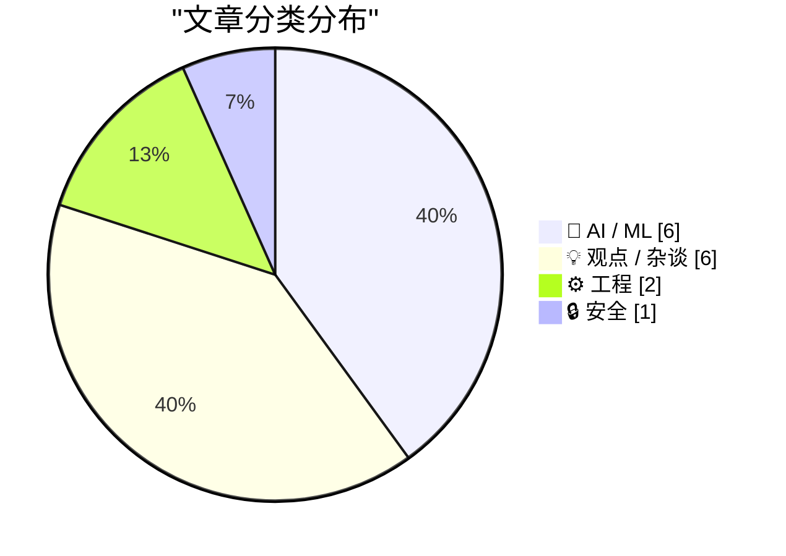
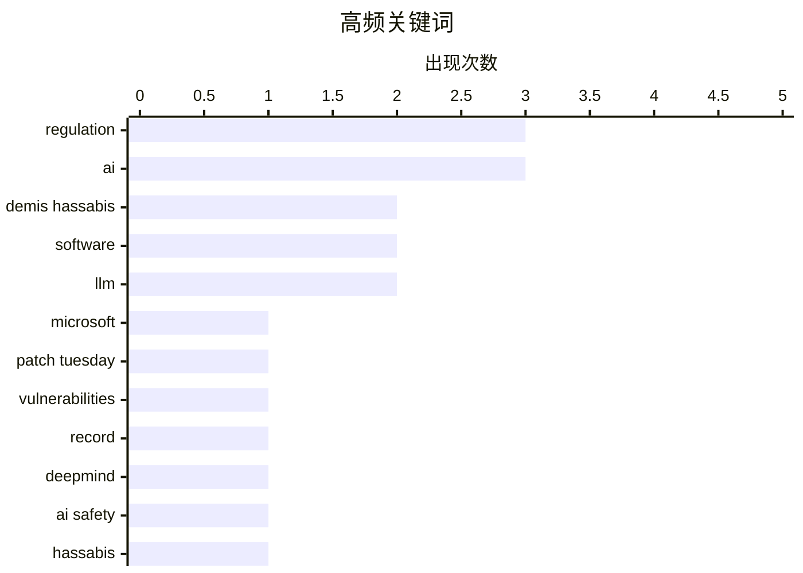

# 📰 AI 资讯每日精选 — 2026-07-15

> 汇聚 140+ 技术博客、X/Twitter、Hacker News、Reddit、Product Hunt、
> Lobste.rs、ClawFeed 日报及 GitHub Trending，经 AI 评分筛选。
>
> **本期内容**：🏆 今日必读 · 🌐 ClawFeed 日报 · 🔥 GitHub Trending · 📂 分类精选 · 🎨 设计与生成式 AI · 📊 数据概览

## 📝 今日看点

今日技术圈聚焦两大趋势：一是AI安全与治理进入关键博弈期，DeepMind CEO哈萨比斯提出建立美国主导的前沿AI标准机构并实施强制性安全测试，同时微软因AI辅助漏洞发现修复了创纪录的570个安全漏洞；二是AI落地的现实挑战浮出水面，既有企业因成本过高开始限制模型使用，也有技术突破让超大模型可在无GPU环境下本地运行，而关于“认知外包”的反思则警示人类独立思考能力可能退化。

---

## 🏆 今日必读

🥇 **微软修复创纪录的570个安全漏洞**

[Microsoft Patches a Record 570 Security Flaws](https://krebsonsecurity.com/2026/07/microsoft-patches-a-record-570-security-flaws/) — krebsonsecurity.com · 5 小时前 · 🔒 安全

> 微软在7月补丁星期二发布了安全更新，修复了至少570个安全漏洞，几乎是上个月创纪录修复数量的三倍。此次漏洞数量激增主要归因于人工智能辅助的漏洞发现。修复范围涵盖Windows操作系统及其他软件产品。这标志着微软单月修复漏洞数量的历史新高。

💡 **为什么值得读**: 了解AI如何推动安全漏洞发现数量激增，以及这对Windows用户安全意味着什么。

🏷️ Microsoft, Patch Tuesday, vulnerabilities, record

🥈 **DeepMind CEO哈萨比斯称“没人知道接下来会发生什么”，因此“谨慎乐观”意味着现在就要建立护栏**

[Deepmind CEO Hassabis says "nobody in the world knows what happens next" so "cautious optimism" means building guardrails now](https://the-decoder.com/deepmind-ceo-hassabis-says-nobody-in-the-world-knows-what-happens-next-so-cautious-optimism-means-building-guardrails-now/) — The Decoder · 13 小时前 · 🤖 AI / ML

> Google DeepMind CEO Demis Hassabis发布了一项关于如何管理高级AI的全面提案。他提议美国效仿金融监管机构FINRA，成立一个新的标准机构，负责制定前沿模型的评估协议，并在必要时协调放缓AI开发速度。初创公司和研究模型将被豁免。该提案的核心是在不确定性中通过建立监管框架来确保安全。

💡 **为什么值得读**: 了解AI领域顶级领袖对AGI风险的监管思路和具体行动方案。

🏷️ DeepMind, AI safety, regulation, Hassabis

🥉 **我们是否将过多的思考外包给了AI？**

[Are we offloading too much of our thinking to AI?](https://www.artfish.ai/p/offloading-thinking-to-ai) — Hacker News Best · 9 小时前 · 💡 观点 / 杂谈

> 文章探讨了过度依赖AI进行思考可能带来的认知风险。核心论点是，频繁使用AI替代人类思考过程，可能导致批判性思维和问题解决能力的退化。作者担忧这种“认知卸载”会削弱人类的独立思考能力。结论是需要在利用AI效率和保持人类认知能力之间找到平衡。

💡 **为什么值得读**: 引发对AI依赖负面影响的深度反思，适合所有日常使用AI工具的人。

🏷️ AI, thinking, cognition, offloading

4️⃣ **终于发生了：我们因为成本问题不再使用模型**

[Well it finally happened: we’re not using models because of cost](https://www.reddit.com/r/singularity/comments/1uwa1mv/well_it_finally_happened_were_not_using_models/) — r/singularity · 10 小时前 · 💡 观点 / 杂谈

> 一位在“AI优先”的财富500强公司工作三年的员工分享，公司因成本问题开始限制AI模型的使用。尽管公司曾投入大量资源进行全员AI培训，并要求所有工作必须涉及AI，但高昂的运营成本最终导致策略转向。这揭示了企业大规模部署AI面临的现实经济挑战。

💡 **为什么值得读**: 从一线员工视角揭示企业AI落地的真实成本困境，打破“AI免费”的幻想。

🏷️ AI cost, enterprise, Fortune 500, adoption

5️⃣ **Demis Hassabis在X上分享罕见文章：AGI几年内到来，我们处于奇点山麓，提议建立美国主导的前沿AI标准机构并最终实施强制性安全测试**

[Demis Hassabis shared a rare essay on X: AGI is few years away, we're in the singularity foothills, proposes US-led Frontier AI Standards Body with eventual mandatory safety testing](https://www.reddit.com/r/singularity/comments/1uw40fb/demis_hassabis_shared_a_rare_essay_on_x_agi_is/) — r/singularity · 15 小时前 · 🤖 AI / ML

> Demis Hassabis发表文章，核心观点包括：AGI可能仅需几年就能实现，当前是“奇点的山麓”阶段。他认为AGI不应与互联网或智能手机等普通技术突破相提并论，其影响更为深远。他提议建立由美国主导的前沿AI标准机构，并最终实施强制性安全测试。

💡 **为什么值得读**: 直接获取DeepMind CEO对AGI时间线和监管框架的最新、最权威观点。

🏷️ AGI, Demis Hassabis, safety, regulation

---

## 🌐 ClawFeed 日报精选

> 来源：[ClawFeed](https://clawfeed.kevinhe.io) — AI 驱动的多源新闻聚合

# ClawFeed 日报 | 2026-07-14 (Mon)

基于 6 档 4h digest（#842 #845 #846 #847 #848 #849，覆盖 00:00-23:59 SGT）汇总。

---

## 🔥 当日全场最重要 5 条

**1. Grok CLI 安全事件：全量上传用户代码库至 Google Cloud**
Limestone 创始人 @mardehaym 通过 wire capture 发现 Grok Build 0.2.93 将用户整个 Git 仓库（含完整历史和 .env）上传至 Google Cloud bucket——不是 agent 打开的文件，而是全量上传。@GergelyOrosz 也收到多名开发者投诉。**正在使用 Grok CLI 的团队应立即停下检查。**
来源: https://x.com/mardehaym/status/2076790621462044876
（#848 16:00 SGT）

**2. Harness Engineering：同一模型同一 benchmark，42% → 78%，唯一变量是 harness**
@chenchengpro 提出的 "Harness Engineering" 概念被多个关注账号转引——包裹在模型外面的规则、工具和反馈循环决定了产出质量，而非模型本身。可能是 2026 AI 工程最重要的发现。
来源: https://x.com/chenchengpro/status/2037332209003282747
（#842 00:00 SGT）

**3. NVIDIA Rubin 准时出货：黄仁勋亲自辟谣 SemiAnalysis 延期传闻**
确认 2027 年准时发货，800V 和光互联按原计划推进，同时表示竞争对手自研芯片计划正在被降维打击。上期 SemiAnalysis 延误报告引发的市场恐慌得到官方回应，对 AI 算力投资链条是重要定心丸。
来源: https://x.com/oragnes/status/2076861384462393367
（#849 20:00 SGT）

**4. Devin Fusion 架构：Fable + Sidekick 混用降本 54%，分数不变**
Devin 团队实证：贵模型留给难题、便宜模型跑常规，成本砍半效果不减。模型混用已成为本日最重要的工程模式之一，同样思路适用于 GPT-5.6 Sol + Terra/Luna 组合。
来源: https://x.com/omarsar0/status/2076724568325025920
（#846 08:00 SGT）

**5. Fields Medal 2026 名单因 AI 工具意外泄露**
ICM 2026 官网日程表前端代码中藏有四条 HIDDEN 字段，通过 Codex 生成的 curl 命令完整抓取——邓煜（Yu Deng）、John Pardon、Jacob Tsimerman、王虹。数学界最高荣誉因一个前端疏忽 + 一个 AI 工具被提前曝光。AI 加速信息发现的速度已超出传统保密机制的设计预期。
来源: https://x.com/PANewsCN/status/2076861721051091416
（#848 16:00 SGT）

---

## 📰 当日核心主题

### 1. AI 工具安全与信任危机
Grok CLI 全量上传代码库事件是今日最直接的安全警报。同日 Nadella 提出"信息反转悖论"（企业付钱用 AI，核心知识却可能被 AI 带走）形成呼应。开发者工具的信任边界正在被重新审视。

### 2. Harness/混用工程：模型不是瓶颈，包装才是
三条独立信号共振：Harness Engineering（42%→78%）、Devin Fusion（降本 54%）、Muse Spark 1.1（1/7 成本打平 GPT-5.6 Sol 临床分数）。2026 年 AI 工程的核心竞争力正从"用哪个模型"转向"怎么包裹模型"。

### 3. AI-native 组织与劳动力形态
Matrix Agent 公司 OS 架构（@BruceGuai，全天反复被引用）、全 AI 员工公司实战（26 AI 员工/5 部门/150 天/成本 1/4）、Cursor CEO "第三纪元"、AI 已写 100% Claude Code + 90% OpenAI 生产代码——AI 从工具到组织成员的转变正在实际发生。

### 4. AI 算力供应链信号
NVIDIA Rubin 准时出货定心、Tom Blomfield（YC 合伙人/Monzo 创始人）加入 Anthropic 算力团队、SemiAnalysis 给出 Anthropic $6T 估值分析、训练数据供应链已跑出寡头格局（4 家公司占 75%+ 的 ~$8.5B 市场）。顶级人才和资本加速向 AI 基础设施聚集。

### 5. Crypto 制度化加速
UK tokenized finance 路线图（£33B/2035，2027 Q1 政府数字债券）、Trump 推 Clarity Act、Tokenized Stocks 向 Pre-IPO 延伸、TRON 6 月处理 3.86 亿笔交易创历史新高。主权级别的加密资产落地时间表正在成形。

### 6. Sam Altman vs Claude 品牌心智
Sam Altman 看到 @claudeai 推文以为是恶搞号——"kept looking for the handle to be spelled c1audeai"。OpenAI CEO 公开承认 Claude 品牌存在感已强到让他反复确认真假。AI 行业竞争进入品牌心智阶段。5.8K likes, 1.1M views。

---

## 🔖 累计 Bookmark 精选（当日高频出现）

以下条目在 6 档 digest 中反复被 bookmark 系统推荐，代表持续高价值内容：

• **@BruceGuai** - Matrix Agent 公司 OS 架构：不是一个巨型 agent，而是分权、分责、可审计的多 agent 体系。https://x.com/BruceGuai/status/2070130243059495142
• **@mardehaym + @LimestoneHQ** - 《Five Stages of AI-Native Engineering》+《How to Make a Company AI-Native》：从零到五分阶 + 非十亿级公司适用的 AI-native 实操指南。https://x.com/mardehaym/status/2070557674966573570 / https://x.com/LimestoneHQ/status/2074483555510448582
• **@chenchengpro / @heynavtoor** - Harness Engineering 系统总结：同一模型同一测试，harness 不同分数翻倍。https://x.com/heynavtoor/status/2037200578842157462
• **@Av1dlive** - Anthropic "Claude for Finance" 讲座 + Claude Code 投研分析师搭建教程，quant AI 最有价值的 1 小时。https://x.com/Av1dlive/status/2059273095970738264
• **@mntruell** (Cursor CEO) - 《The Third Era of AI Software Development》：逐键敲码 → Tab 补全 → Agent。https://x.com/mntruell/status/2026736314272591924
• **@yangyi** - Google Stitch DESIGN.md：一个 Markdown 教会 AI Agent 整套设计系统。https://x.com/yangyi/status/2040272305277079728
• **@yq_acc** - AI agent 代码产出统计：Claude 100%、OpenAI 90%、Microsoft 30%、Google 25%。https://x.com/yq_acc/status/2022493263236861959
• **@cline** - Cline Kanban：CLI 无关的多 agent 编排独立 app，兼容 Claude Code + Codex。https://x.com/cline/status/2037182739695493399
• **@levie** - 三篇长文：《The Era of Context》《The Future of Enterprise Software》《The Capability Overhang in AI》。https://x.com/levie/status/2007958155137876183

---

## 👀 推荐关注汇总（去重）

• **antirez (Salvatore Sanfilippo)** - Redis 作者，讨论 AI 时代开发者该不该看代码，一手工程判断力。
• **Erik Brynjolfsson** - 斯坦福数字经济学者，"We Must Act Now" AI 经济声明主要作者，数据驱动不堆 buzzword。
• **@omarsar0 (elvis / DAIR.AI)** - AI 论文和工程模式持续跟踪，Fable+Sidekick 混用分析有一手判断。https://x.com/omarsar0
• **@DottChen (Dott)** - SEO/GEO 领域用一手数据证伪流行观点，不是搬运而是原创研究。https://x.com/DottChen
• **@yan5xu** - AI 公司研究库 "Oh My AI Company" 作者，bb-browser co-founder，持续高质量市场分析。https://x.com/yan5xu
• **Yucheng Shi (@minchoi)** - Long-Horizon-Terminal-Bench 作者，长程 agent 评测一手数据来源。

提醒：以上未通过浏览器逐一核实是否已关注，**Kevin 操作前请先在 Following 搜一下**避免重复。

---

## 🧹 建议取关

• **@HeXiaobo (David.He)** — 最后推文停留在 2018 年 7 月，超 8 年零活跃，典型僵尸号。全天 6 档连续标记。强烈建议取关。
• **@0xJasonBateman (Jason)** — 仅 36 条推文，最近 4 月转发 NASA，8 followers，与 AI/crypto/tech 无关。
• **@Soft6161 (软萌子)** — 近期推文几乎全是 Paid partnership 付费合作推广，从 crypto alpha 变成纯营销号。

---

## 💤 当日重复噪音模式

1. **GM/打卡帖** — 每档都有，@sanjaybuilds_ @camski @OnlyCapi 等，零信息量。
2. **交易所/项目营销推广** — MetaWin 抽奖、Bitget CPI 直播、Binance 周年活动、Deepcoin 周边开箱，纯获客内容。
3. **加密赌博/短线喊单** — ForeGate AI 足球博彩、@Im_Aman2 喊单、@YelowMc 预测市场实时单。
4. **个人感慨/鸡汤** — 情感类、玄学类、晚安帖，跨多档重复出现。
5. **Paid partnership 变质账号** — 原 crypto alpha 账号转型为纯付费推广，内容质量断崖式下降。
6. **空推/低信息** — 空内容、"快发快发"、段子转发、动物视频。

---

*日报生成时间: 2026-07-14 23:59 SGT | 数据源: 6 × 4h digests (#842 #845 #846 #847 #848 #849)*---

## 🔥 GitHub Trending

> 今日热门开源项目（全语言 + Python）

| # | 项目 | 描述 | ⭐ 总星 | 📈 今日 | 语言 |
|---|------|------|---------|---------|------|
| 1 | [OpenCut-app/OpenCut](https://github.com/OpenCut-app/OpenCut) | The open-source CapCut alternative | 69.2k | +4276 | TypeScript |
| 2 | [Graphify-Labs/graphify](https://github.com/Graphify-Labs/graphify) 🤖 | AI coding assistant skill (Claude Code, Codex, OpenCode, ... | 86.4k | +1851 | Python |
| 3 | [mattpocock/skills](https://github.com/mattpocock/skills) 🤖 | Skills for Real Engineers. Straight from my .claude direc... | 170.2k | +1679 | Shell |
| 4 | [HKUDS/Vibe-Trading](https://github.com/HKUDS/Vibe-Trading) 🤖 | "Vibe-Trading: Your Personal Trading Agent" | 22.9k | +1256 | Python |
| 5 | [Shubhamsaboo/awesome-llm-apps](https://github.com/Shubhamsaboo/awesome-llm-apps) 🤖 | 100+ AI Agent & RAG apps you can actually run — clone, cu... | 120.8k | +1106 | Python |
| 6 | [Nutlope/hallmark](https://github.com/Nutlope/hallmark) 🤖 | Anti-AI-slop design skill for Claude Code, Cursor, and Co... | 6.1k | +1015 | CSS |
| 7 | [hasaneyldrm/exercises-dataset](https://github.com/hasaneyldrm/exercises-dataset) | 1,324-exercise fitness dataset — animation GIFs, 180×180 ... | 13.5k | +851 | HTML |
| 8 | [Raphire/Win11Debloat](https://github.com/Raphire/Win11Debloat) | A simple, lightweight PowerShell script that allows you t... | 51.7k | +783 | PowerShell |
| 9 | [github/spec-kit](https://github.com/github/spec-kit) | 💫 Toolkit to help you get started with Spec-Driven Devel... | 121.3k | +753 | Python |
| 10 | [microsoft/markitdown](https://github.com/microsoft/markitdown) | Python tool for converting files and office documents to ... | 165.9k | +507 | Python |
| 11 | [Dicklesworthstone/destructive_command_guard](https://github.com/Dicklesworthstone/destructive_command_guard) | The Destructive Command Guard (dcg) is for blocking dange... | 4.4k | +473 | Rust |
| 12 | [penpot/penpot](https://github.com/penpot/penpot) | Penpot: The open-source design platform for Product teams... | 56.2k | +395 | Clojure |
| 13 | [par274/sharpemu](https://github.com/par274/sharpemu) | An experimental PlayStation 5 emulator project. | 2.1k | +332 | C# |
| 14 | [chenyme/grok2api](https://github.com/chenyme/grok2api) | 面向 Grok Build、Grok Web 与 Grok Console 的多账号 API 网关 | 5.8k | +186 | Go |
| 15 | [google/skills](https://github.com/google/skills) 🤖 | Agent Skills for Google products and technologies | 14.8k | +153 | Python |

---

## 🤖 AI / ML

### 1. DeepMind CEO哈萨比斯称“没人知道接下来会发生什么”，因此“谨慎乐观”意味着现在就要建立护栏

[Deepmind CEO Hassabis says "nobody in the world knows what happens next" so "cautious optimism" means building guardrails now](https://the-decoder.com/deepmind-ceo-hassabis-says-nobody-in-the-world-knows-what-happens-next-so-cautious-optimism-means-building-guardrails-now/) — **The Decoder** · 13 小时前 · ⭐ 26/30

> Google DeepMind CEO Demis Hassabis发布了一项关于如何管理高级AI的全面提案。他提议美国效仿金融监管机构FINRA，成立一个新的标准机构，负责制定前沿模型的评估协议，并在必要时协调放缓AI开发速度。初创公司和研究模型将被豁免。该提案的核心是在不确定性中通过建立监管框架来确保安全。

🏷️ DeepMind, AI safety, regulation, Hassabis

---

### 2. Demis Hassabis在X上分享罕见文章：AGI几年内到来，我们处于奇点山麓，提议建立美国主导的前沿AI标准机构并最终实施强制性安全测试

[Demis Hassabis shared a rare essay on X: AGI is few years away, we're in the singularity foothills, proposes US-led Frontier AI Standards Body with eventual mandatory safety testing](https://www.reddit.com/r/singularity/comments/1uw40fb/demis_hassabis_shared_a_rare_essay_on_x_agi_is/) — **r/singularity** · 15 小时前 · ⭐ 26/30

> Demis Hassabis发表文章，核心观点包括：AGI可能仅需几年就能实现，当前是“奇点的山麓”阶段。他认为AGI不应与互联网或智能手机等普通技术突破相提并论，其影响更为深远。他提议建立由美国主导的前沿AI标准机构，并最终实施强制性安全测试。

🏷️ AGI, Demis Hassabis, safety, regulation

---

### 3. Colibri 上手体验：无需GPU本地运行GLM 5.2（744B参数）

[Colibri Hands-on: Running GLM 5.2 (744B) Locally without GPU](https://www.reddit.com/r/singularity/comments/1uwkzw6/colibri_handson_running_glm_52_744b_locally/) — **r/singularity** · 4 小时前 · ⭐ 25/30

> 文章展示了使用Colibri工具在无GPU环境下本地运行GLM 5.2（744B参数）大模型的实际体验。这证明了通过优化和量化技术，超大模型可以在消费级硬件上运行。该方案为无法访问高端GPU的用户提供了本地运行前沿模型的可能性。

🏷️ LLM, local inference, GLM, no GPU

---

### 4. DeepSeek 在完成首轮 70 亿美元融资仅数周后再次急需现金

[DeepSeek needs more cash just weeks after closing its first $7 billion round](https://the-decoder.com/deepseek-needs-more-cash-just-weeks-after-closing-its-first-7-billion-round/) — **The Decoder** · 8 小时前 · ⭐ 24/30

> 中国 AI 实验室 DeepSeek 在刚刚完成首轮 70 亿美元融资后，仅隔数周便再次启动新一轮融资。资金需求源于其计划自建数据中心和自研芯片，以维持激进的定价策略。这表明 DeepSeek 在快速扩张中面临巨大的资本消耗压力，尤其是在基础设施投入方面。

🏷️ DeepSeek, funding, AI, infrastructure

---

### 5. Bonsai 27B：可在手机上运行的 270 亿参数模型

[Bonsai 27B: A 27B-Class model that runs on a phone](https://prismml.com/news/bonsai-27b) — **Hacker News Best** · 7 小时前 · ⭐ 24/30

> PrismML 发布了 Bonsai 27B，一个拥有 270 亿参数的大语言模型，其最大亮点是能够在手机上本地运行。该模型在保持较高性能的同时，通过极致的量化与压缩技术实现了移动端部署。这标志着大模型在端侧推理能力上的重大突破，有望推动 AI 应用的离线化和隐私保护。

🏷️ Bonsai, 27B, on-device, LLM

---

### 6. 如何阻止 Claude 频繁使用“load-bearing”一词

[How to stop Claude from saying load-bearing](https://jola.dev/posts/how-to-stop-claude-from-saying-load-bearing) — **Hacker News Best** · 13 小时前 · ⭐ 24/30

> 文章探讨了 Claude 等大语言模型在回答中过度使用“load-bearing”（承重/关键）这一特定词汇的问题。作者通过提示工程技巧，如明确禁止使用该词、提供替代词汇列表以及调整系统提示，成功减少了该词的出现频率。核心观点是，通过精细化的提示约束可以有效纠正模型的语言习惯，但需要反复迭代。

🏷️ Claude, prompt engineering, LLM behavior, AI quirks

---

## 💡 观点 / 杂谈

### 7. 我们是否将过多的思考外包给了AI？

[Are we offloading too much of our thinking to AI?](https://www.artfish.ai/p/offloading-thinking-to-ai) — **Hacker News Best** · 9 小时前 · ⭐ 26/30

> 文章探讨了过度依赖AI进行思考可能带来的认知风险。核心论点是，频繁使用AI替代人类思考过程，可能导致批判性思维和问题解决能力的退化。作者担忧这种“认知卸载”会削弱人类的独立思考能力。结论是需要在利用AI效率和保持人类认知能力之间找到平衡。

🏷️ AI, thinking, cognition, offloading

---

### 8. 终于发生了：我们因为成本问题不再使用模型

[Well it finally happened: we’re not using models because of cost](https://www.reddit.com/r/singularity/comments/1uwa1mv/well_it_finally_happened_were_not_using_models/) — **r/singularity** · 10 小时前 · ⭐ 26/30

> 一位在“AI优先”的财富500强公司工作三年的员工分享，公司因成本问题开始限制AI模型的使用。尽管公司曾投入大量资源进行全员AI培训，并要求所有工作必须涉及AI，但高昂的运营成本最终导致策略转向。这揭示了企业大规模部署AI面临的现实经济挑战。

🏷️ AI cost, enterprise, Fortune 500, adoption

---

### 9. [Demis Hassabis] 前沿AI框架与新纪元曙光

[[Demis Hassabis] A Framework for Frontier AI and the Dawning of a New Age](https://www.reddit.com/r/singularity/comments/1uw40ji/demis_hassabis_a_framework_for_frontier_ai_and/) — **r/singularity** · 15 小时前 · ⭐ 26/30

> 该帖子是Demis Hassabis在X上发布的文章《A Framework for Frontier AI and the Dawning of a New Age》的链接分享。文章内容与索引4和索引1高度相关，提出了关于AGI临近、建立监管框架等核心观点。这是Hassabis罕见的长文论述。

🏷️ Demis Hassabis, frontier AI, framework, regulation

---

### 10. 高塔仍在攀升

[The Tower Keeps Rising](https://lucumr.pocoo.org/2026/7/13/the-tower-keeps-rising/) — **Hacker News Best** · 8 小时前 · ⭐ 25/30

> 文章标题“The Tower Keeps Rising”是一个隐喻，可能讨论软件工程复杂性、技术债务或系统架构的持续膨胀。作者Armin Ronacher（Flask作者）通常探讨软件设计中的深层问题。具体内容需阅读原文，但主题很可能围绕技术系统的不可控增长。

🏷️ complexity, software, engineering, essay

---

### 11. 2026年对AI的憎恨

[Hating AI in 2026](https://www.eamoncaddigan.net/posts/ai-in-2026/) — **Lobste.rs** · 13 小时前 · ⭐ 25/30

> 文章探讨了2026年公众对AI的负面情绪和批评。可能分析AI技术普及后引发的社会反弹、伦理争议或失望情绪。具体观点需阅读原文，但主题聚焦于AI发展中的反作用力。

🏷️ AI, criticism, future, culture

---

### 12. 引用 Armin Ronacher：软件项目的共享语言

[Quoting Armin Ronacher](https://simonwillison.net/2026/Jul/14/armin-ronacher/#atom-everything) — **simonwillison.net** · 6 小时前 · ⭐ 24/30

> Armin Ronacher 指出，软件项目的共享语言并非英语或 Python，而是团队对概念含义、边界、不变量、所有权和系统形态的共同理解。这种语言很少被集中记录，而是分散在文档、代码、代码审查、对话和争论中。它通过解释系统的经验而不断形成和演化。作者的核心观点是，这种隐性的共享语言才是项目真正的沟通基础，远比编程语言或自然语言更重要。

🏷️ software, shared language, concepts, invariants

---

## ⚙️ 工程

### 13. Lobste.rs 现已运行在 SQLite 上

[lobste.rs is now running on SQLite](https://simonwillison.net/2026/Jul/14/lobsters-sqlite/#atom-everything) — **simonwillison.net** · 5 小时前 · ⭐ 25/30

> 社区网站Lobsters完成了从MariaDB到SQLite的数据库迁移。该迁移计划自2018年8月开始，最初目标是PostgreSQL，但去年决定转而研究SQLite。迁移成功证明了SQLite在特定规模的Web应用场景下可以作为传统数据库的可行替代方案。

🏷️ SQLite, migration, Lobsters, database

---

### 14. Linux 输入延迟实测：X11 vs. Wayland、VRR 与 DXVK

[Measuring Input Latency on Linux: X11 vs. Wayland, VRR, and DXVK](https://marco-nett.de/blog/measuring-input-latency-on-linux-x11-vs-wayland-vrr-dxvk/) — **Hacker News Best** · 8 小时前 · ⭐ 24/30

> 该文章通过精确测量工具对比了 Linux 下 X11 与 Wayland 显示服务器的输入延迟，并评估了可变刷新率（VRR）和 DXVK（DirectX 到 Vulkan 转换层）的影响。测试结果显示，Wayland 在多数场景下延迟低于 X11，而 VRR 能进一步降低延迟。DXVK 的引入在某些情况下会引入额外延迟，但整体表现可接受。结论是 Wayland 结合 VRR 是当前 Linux 上降低输入延迟的最佳组合。

🏷️ Linux, input latency, Wayland, X11

---

## 🔒 安全

### 15. 微软修复创纪录的570个安全漏洞

[Microsoft Patches a Record 570 Security Flaws](https://krebsonsecurity.com/2026/07/microsoft-patches-a-record-570-security-flaws/) — **krebsonsecurity.com** · 5 小时前 · ⭐ 27/30

> 微软在7月补丁星期二发布了安全更新，修复了至少570个安全漏洞，几乎是上个月创纪录修复数量的三倍。此次漏洞数量激增主要归因于人工智能辅助的漏洞发现。修复范围涵盖Windows操作系统及其他软件产品。这标志着微软单月修复漏洞数量的历史新高。

🏷️ Microsoft, Patch Tuesday, vulnerabilities, record

---

## 📊 数据概览

| 扫描源 | 抓取文章 | 时间范围 | 精选 |
|:---:|:---:|:---:|:---:|
| 93/140 | 3835 篇 → 82 篇 | 24h | **15 篇** |

### 分类分布



### 高频关键词



<details>
<summary>📈 纯文本关键词图（终端友好）</summary>

```
regulation      │ ████████████████████ 3
ai              │ ████████████████████ 3
demis hassabis  │ █████████████░░░░░░░ 2
software        │ █████████████░░░░░░░ 2
llm             │ █████████████░░░░░░░ 2
microsoft       │ ███████░░░░░░░░░░░░░ 1
patch tuesday   │ ███████░░░░░░░░░░░░░ 1
vulnerabilities │ ███████░░░░░░░░░░░░░ 1
record          │ ███████░░░░░░░░░░░░░ 1
deepmind        │ ███████░░░░░░░░░░░░░ 1
```

</details>

### 🏷️ 话题标签

**regulation**(3) · **ai**(3) · **demis hassabis**(2) · software(2) · llm(2) · microsoft(1) · patch tuesday(1) · vulnerabilities(1) · record(1) · deepmind(1) · ai safety(1) · hassabis(1) · thinking(1) · cognition(1) · offloading(1) · ai cost(1) · enterprise(1) · fortune 500(1) · adoption(1) · agi(1)

---

*生成于 2026-07-15 00:59 | 汇聚 140 个技术博客、X/Twitter、Hacker News、Reddit、Product Hunt、Lobste.rs、ClawFeed 日报及 GitHub Trending，经 AI 评分筛选出 Top 15 精华内容*
