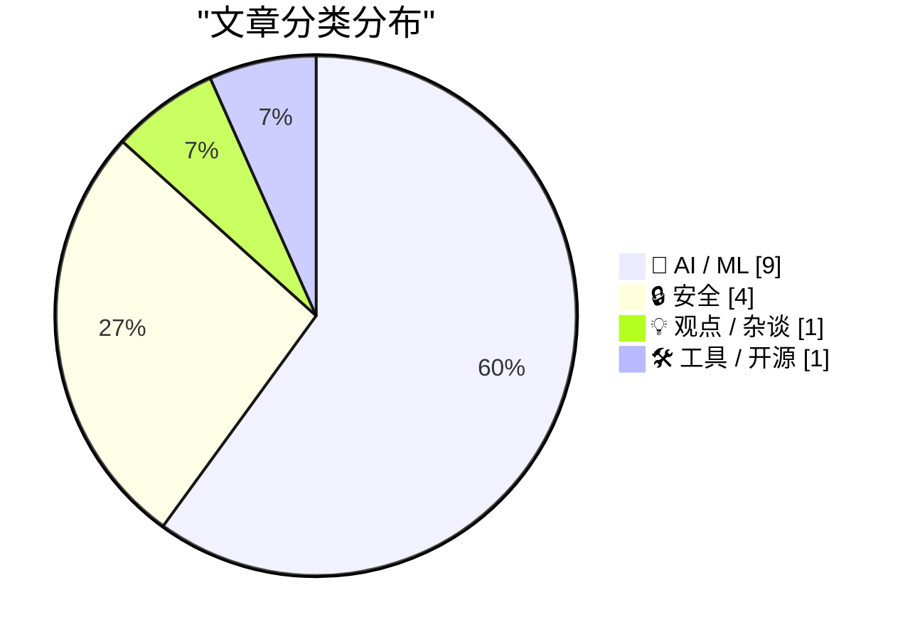
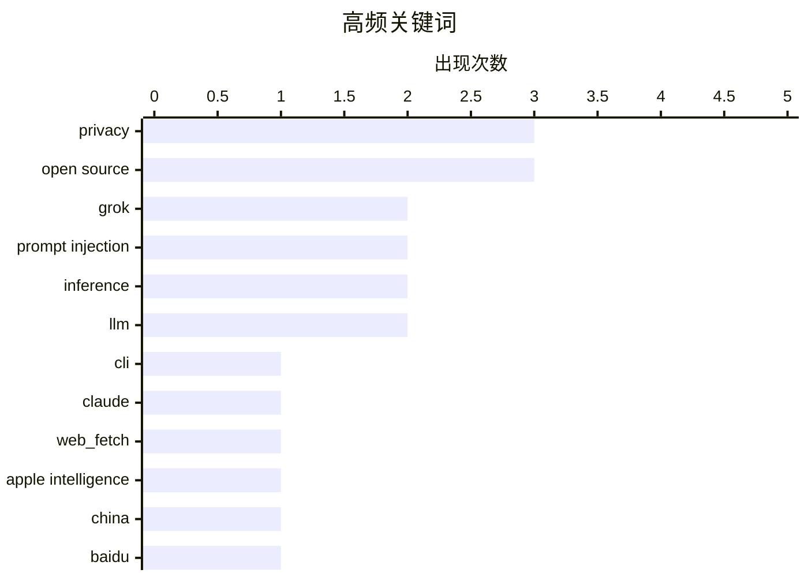

# 📰 AI 资讯每日精选 — 2026-07-16

> 汇聚 140+ 技术博客、X/Twitter、Hacker News、Reddit、Product Hunt、
> Lobste.rs、ClawFeed 日报及 GitHub Trending，经 AI 评分筛选。
>
> **本期内容**：🏆 今日必读 · 🌐 ClawFeed 日报 · 🔥 GitHub Trending · 📂 分类精选 · 🎨 设计与生成式 AI · 📊 数据概览

## 📝 今日看点

今日技术圈聚焦两大趋势：AI安全与隐私漏洞频发，以及模型小型化与本地化部署的突破。一方面，从xAI的Grok工具因上传用户私密文件引发争议，到Claude和Cursor编辑器相继被曝出可被诱导泄露数据或执行恶意代码，AI工具的安全防线正面临严峻考验；另一方面，苹果智能获批在中国落地并接入本土模型，同时Bonsai 27B等大模型被压缩至可装入iPhone本地运行，标志着AI正加速从云端走向终端。此外，OpenAI通过AI自我对抗攻击实现远超人类的安全加固效果，以及GPT-5.6 Sol在90分钟内推翻人类30年未解的统计学猜想，进一步凸显了AI在攻防与科研领域的颠覆性潜力。

---

## 🏆 今日必读

🥇 **xAI 的 Grok 构建工具现已开源，但曾因上传整个目录引发隐私争议**

[xai-org/grok-build, now open source](https://simonwillison.net/2026/Jul/15/grok-build/#atom-everything) — simonwillison.net · 1 小时前 · 🔒 安全

> xAI 的 CLI 工具 `grok` 在开源后遭遇严重社区反弹，因其在目录中运行时，会将该目录下的所有文件（包括 SSH 密钥和密码管理器数据）上传至 xAI 的 Google Cloud 存储桶。一名用户报告称，在其家目录下运行该工具时，目睹了敏感文件被上传。该事件暴露了 AI 开发工具在默认行为上的严重隐私设计缺陷。

💡 **为什么值得读**: 揭示了 AI 工具在隐私安全上的重大漏洞，所有使用 CLI 工具的开发者都应警惕此类默认上传行为。

🏷️ Grok, CLI, privacy, open source

🥈 **我是如何欺骗 Claude 泄露你最深层秘密的**

[How I tricked Claude into leaking your deepest, darkest secrets](https://simonwillison.net/2026/Jul/15/claude-web-fetch-exfiltration/#atom-everything) — simonwillison.net · 10 小时前 · 🔒 安全

> 尽管 Claude 的 `web_fetch` 工具在设计上已尽力防止数据外泄，但安全研究员 Ayush Paul 仍发现了绕过该设计的漏洞。通过精心构造的提示词攻击，他成功诱使 Claude 读取并泄露了用户对话历史中的敏感信息。该攻击利用了模型对指令的过度服从与工具调用机制之间的冲突。

💡 **为什么值得读**: 展示了即使是最新的大模型安全防护机制也存在被攻破的可能，对 AI 安全研究人员和所有 Claude 用户具有重要警示意义。

🏷️ Claude, prompt injection, privacy, web_fetch

🥉 **苹果智能获准在中国上线，采用百度和阿里巴巴的 AI 模型**

[Apple Intelligence OK’d to Launch in China, Using AI Models from Baidu and Alibaba](https://www.scmp.com/tech/policy/article/3360685/china-approves-apple-intelligence-phones-alibaba-baidu-emerging-partners) — daringfireball.net · 2 小时前 · 🤖 AI / ML

> 中国国家互联网信息办公室已批准苹果智能（Apple Intelligence）在中国大陆的运营许可。苹果将采用阿里巴巴和百度作为技术合作伙伴，为 iPhone 用户提供邮件摘要、报告起草和图像编辑等 AI 功能。此举标志着苹果在遵守中国监管要求方面取得关键突破，同时也意味着其在中国市场将依赖本土 AI 模型。

💡 **为什么值得读**: 明确了苹果 AI 在中国落地的具体合作方和监管进展，对关注中美科技生态和 AI 市场格局的读者至关重要。

🏷️ Apple Intelligence, China, Baidu, Alibaba

4️⃣ **Bonsai 27B：一个能装进 iPhone 的完整开源推理模型**

[Bonsai 27B is a full open reasoning model that fits on an iPhone](https://the-decoder.com/bonsai-27b-is-a-full-open-reasoning-model-that-fits-on-an-iphone/) — The Decoder · 9 小时前 · 🤖 AI / ML

> PrismML 将 270 亿参数的 AI 模型压缩至 4GB 以下，使其能在 iPhone 上本地运行。据该公司基准测试，最小版本保留了原始模型 90% 的性能，数学和编码能力几乎未受影响。据报道，苹果已在测试该压缩技术，这可能帮助苹果缩小在端侧 AI 能力上的差距。

💡 **为什么值得读**: 展示了模型压缩技术的重大突破，让百亿级参数模型在手机上运行成为现实，对端侧 AI 和移动设备开发者极具参考价值。

🏷️ model compression, iPhone, open source, reasoning

5️⃣ **OpenAI 的 Codex 现已加密 AI 智能体间的指令，开发者无法追踪内部任务委派**

[OpenAI's Codex now encrypts instructions between AI agents, leaving developers blind to internal delegation](https://the-decoder.com/openais-codex-now-encrypts-instructions-between-ai-agents-leaving-developers-blind-to-internal-delegation/) — The Decoder · 16 小时前 · 🤖 AI / ML

> 自 6 月初起，OpenAI 的编程工具 Codex 开始加密主智能体传递给子智能体的指令。开发者因此无法再追踪任务如何在内部被委派和分解。对于更大的 GPT-5.6 变体 Sol 和 Terra，该加密是强制性的。此举引发了关于 AI 系统可解释性和调试能力的担忧。

💡 **为什么值得读**: 揭示了 AI 开发工具在透明性上的重大倒退，对依赖 Codex 进行复杂任务编排的开发者影响深远。

🏷️ Codex, encryption, AI agents, transparency

---

## 🌐 ClawFeed 日报精选

> 来源：[ClawFeed](https://clawfeed.kevinhe.io) — AI 驱动的多源新闻聚合

📅 ClawFeed Daily Digest | 2026-07-15 (SGT)

来源：5 期 4h digest（#853 00:00 / #854 04:00 / #855 08:00 / #856 12:00 / #857 16:00）

---

## 🔥 当日全场最重要 5 条

**1. WSJ 独家：DeepSeek 正筹备上海 IPO，最早明年 Q2 挂牌**
中国 AI 第一梯队公司走向资本化的里程碑信号。用于研发和增长输血，后续需关注官方/交易所确认。
来源: https://x.com/WSJTech/status/2077231580792152542 [#855]

**2. 阿里千问集成苹果智能——中国 AI + Apple 生态最大规模合作**
千问 AI 能力将内嵌 iOS/iPadOS/macOS/visionOS，中国用户无需切换应用；iPhone 同步推进 Apple 智能手机备案。《科创板日报》独家。
来源: https://x.com/berryxia/status/2077357348293939259 [#857]

**3. GPT-5.6 Sol Ultra 号称 64 并行子代理 1 小时攻克循环双覆盖猜想**
Terminal-Bench 2.1 拿到 91.9%，定价 $5/M input token。暂无官方一手确认（中文媒体转述），但并行多代理推理架构是重大信号。同期 Elon Musk 力推 Grok 4.5 称 FrontierSWE 超越 Claude Opus 4.8 和 GPT-5.5——AI 模型竞争白热化。
来源: https://x.com/Techub_News/status/2077155861575672143 [#854] / https://x.com/elonmusk/status/2077219839626641676 [#856]

**4. 韩国 KOSPI 一月暴跌 26%，120 万+ 杠杆账户爆仓，年内第 7 次熔断**
30 万+ 被券商清零，7/13 单日跌 8.95%，高盛交易员在报告中问"抛售何时停"——亚洲金融市场系统性风险信号。
来源: https://x.com/Baili1018/status/2077294727192596584 [#856]

**5. DeepMind CEO Demis Hassabis：AGI 可能只差"几年"，需建全球治理框架**
科技巨头高层最直白的 AGI 时间线表态之一。发文《A Framework for Frontier AI and the Dawning of a New Age》。
来源: https://x.com/vivilinsv/status/2077085862349963541 [#856]

---

## 📰 当日核心主题

### 🤖 AI 模型军备竞赛
GPT-5.6 Sol Ultra（64 并行子代理）、Grok 4.5（FrontierSWE 称超 Claude/GPT）、Gemini 3.5 Live Translate（70+ 语言语音实时翻译）、Agent Arena 排名（Claude Fable 5 第一、Sol 第二）。模型能力和定价的多线并进。

### 🇨🇳 中国科技出海 & 资本化
DeepSeek 筹备上海 IPO；千问集成苹果智能；长鑫存储（CXMT）7/27 上交所挂牌（中国唯一量产 DRAM 企业，冲击三星/海力士/美光 95%+ 市占）；WAIC 史上最大规模开幕，首次国家元首开幕演讲；小米大规模裁员，节流预算全部导向 AI。

### 🛠️ AI Coding Agent：能力与代价并存
正面：Claude Code weekly PRs 年初至今涨 200%（Anthropic Applied AI 工程师 Maya）；BaoCut 视频字幕工具（Speaker 识别+口癖删除+后期自动化）；OpenCut 开源免费版剪映（6.9 万 GitHub stars）。反面：VP of Eng 花 $180K 买 AI coding 工具，生产事故反升 40%——12 年历史 80 万行医疗 codebase，AI 在遗留代码库中批量制造技术债务。

### 💰 加密监管 & 准入
Coinbase 疑似正式对中国用户开放注册（+86 手机号+身份证即可，不再要求境外地址证明）——从传闻到升级为个人博主实测确认；CLARITY Act 预计 7/20 当周提交参议院表决；ECB 选定 36 家机构参与 12 个月数字欧元试点（2027 H2 启动）。

### 🏗️ 硬件 & 基础设施
NVIDIA《AI Model Co-Design》核心观点：存储是比 GPU 更大的瓶颈，模型需从设计之初适配硬件；Starlink V5 终端开卖（375+ Mbps）；Cloudflare Agents/Sandbox 负责人出走 OpenAI，接手 ChatGPT Web 基础设施。

### 💸 机器支付 & DeFi 新动向
Linux 基金会接手 x402 协议，从 crypto payment 转向更广义的 payment negotiation over HTTP——传统支付巨头开始把 x402 视为 AI 时代机器支付标准；Polymarket 联创上线 GPU 算力远期曲线（B200/H200/A100）；长鑫存储 pre-IPO perpetual 在 trade.xyz 上线。

---

## 🔖 累计 bookmark 精选

本日书签无新增，仍为此前 20 条 AI-native/Agent 主题收藏，核心三条：

- **@mardehaym** - "The Five Stages of AI-Native Engineering (And Why Most Teams Are Still at Zero)" https://x.com/mardehaym/status/2070557674966573570
- **@LimestoneHQ** - "How to Make a Company AI-Native" 完整方法论免费公开 https://x.com/LimestoneHQ/status/2074483555510448582
- **@BruceGuai** - Matrix Agent 公司 OS 架构：不是一个巨大 Agent 而是一套长期运行的 Agent 操作系统 https://x.com/BruceGuai/status/2070130243059495142

---

## 👀 推荐关注汇总

| 账号 | 理由 |
|------|------|
| **@SakanaAILabs** | Sakana AI 研究实验室，知名 AI 研究机构，与关注领域高度相关 |
| **@BruceGuai** | 上期推荐，Matrix Agent 架构深度内容 |

---

## 💤 当日重复噪音模式

| 噪音类型 | 出现频次 | 典型账号 |
|----------|---------|---------|
| Meme 币/加密喊单/引流 | 5 期均有 | @mydongo @AntCaveClub @0xFelix @CryptoPilot3226 @bydaoTina |
| Amazon 联盟带货 | 2 期 | @KirkDBorne |
| 纯个人生活碎碎念 | 5 期均有 | @nftbanker @PhyrexNi @jrkelly @camiinthisthang @zhangdee 等 |
| 体育/博彩 | 3 期 | @MEJ50749 @0xkaka_ETH @Ten1sion |
| 美国国内政治 | 2 期 | @NateSilver538 @nytimes |
| Follow-for-follow / 空帖 | 2 期 | @Gmf_winner @1thousandfaces_ @neso |
| 交易终端/平台软广 | 3 期 | @GeniusTerminal @7777chu @Bitwux |

**建议取关**（连续多期命中）：@Tradermayne / @Soft6161 / @0xFelix / @Johnny_nkc / @0xJasonBateman / @HeXiaobo（7 年未发推）

---

*Generated from 4h digests #853–#857 | 2026-07-15 SGT*---

## 🔥 GitHub Trending

> 今日热门开源项目（全语言 + Python）

| # | 项目 | 描述 | ⭐ 总星 | 📈 今日 | 语言 |
|---|------|------|---------|---------|------|
| 1 | [mattpocock/skills](https://github.com/mattpocock/skills) 🤖 | Skills for Real Engineers. Straight from my .claude direc... | 172.3k | +2130 | Shell |
| 2 | [OpenCut-app/OpenCut](https://github.com/OpenCut-app/OpenCut) | The open-source CapCut alternative | 71.7k | +1664 | TypeScript |
| 3 | [Graphify-Labs/graphify](https://github.com/Graphify-Labs/graphify) 🤖 | AI coding assistant skill (Claude Code, Codex, OpenCode, ... | 87.8k | +1623 | Python |
| 4 | [Nutlope/hallmark](https://github.com/Nutlope/hallmark) 🤖 | Anti-AI-slop design skill for Claude Code, Cursor, and Co... | 8.5k | +1277 | CSS |
| 5 | [Shubhamsaboo/awesome-llm-apps](https://github.com/Shubhamsaboo/awesome-llm-apps) 🤖 | 100+ AI Agent & RAG apps you can actually run — clone, cu... | 121.9k | +1236 | Python |
| 6 | [hasaneyldrm/exercises-dataset](https://github.com/hasaneyldrm/exercises-dataset) | 1,324-exercise fitness dataset — animation GIFs, 180×180 ... | 14.4k | +949 | HTML |
| 7 | [HKUDS/Vibe-Trading](https://github.com/HKUDS/Vibe-Trading) 🤖 | "Vibe-Trading: Your Personal Trading Agent" | 23.7k | +915 | Python |
| 8 | [HenryNdubuaku/maths-cs-ai-compendium](https://github.com/HenryNdubuaku/maths-cs-ai-compendium) 🤖 | Become a cracked AI/ML Research Engineer | 5.9k | +725 | TypeScript |
| 9 | [github/spec-kit](https://github.com/github/spec-kit) | 💫 Toolkit to help you get started with Spec-Driven Devel... | 121.6k | +487 | Python |
| 10 | [Dicklesworthstone/destructive_command_guard](https://github.com/Dicklesworthstone/destructive_command_guard) | The Destructive Command Guard (dcg) is for blocking dange... | 4.8k | +471 | Rust |
| 11 | [microsoft/markitdown](https://github.com/microsoft/markitdown) | Python tool for converting files and office documents to ... | 166.4k | +434 | Python |
| 12 | [coreyhaines31/marketingskills](https://github.com/coreyhaines31/marketingskills) 🤖 | Marketing skills for Claude Code and AI agents. CRO, copy... | 39.8k | +340 | JavaScript |
| 13 | [openinterpreter/openinterpreter](https://github.com/openinterpreter/openinterpreter) 🤖 | A coding agent for low-cost models | 65.5k | +299 | Rust |
| 14 | [datawhalechina/hello-agents](https://github.com/datawhalechina/hello-agents) | 📚 《从零开始构建智能体》——从零开始的智能体原理与实践教程 | 66.4k | +271 | Python |
| 15 | [HKUDS/DeepTutor](https://github.com/HKUDS/DeepTutor) | DeepTutor: Lifelong Personalized Tutoring. https://deeptu... | 26.3k | +172 | Python |

---

## 🤖 AI / ML

### 1. 苹果智能获准在中国上线，采用百度和阿里巴巴的 AI 模型

[Apple Intelligence OK’d to Launch in China, Using AI Models from Baidu and Alibaba](https://www.scmp.com/tech/policy/article/3360685/china-approves-apple-intelligence-phones-alibaba-baidu-emerging-partners) — **daringfireball.net** · 2 小时前 · ⭐ 26/30

> 中国国家互联网信息办公室已批准苹果智能（Apple Intelligence）在中国大陆的运营许可。苹果将采用阿里巴巴和百度作为技术合作伙伴，为 iPhone 用户提供邮件摘要、报告起草和图像编辑等 AI 功能。此举标志着苹果在遵守中国监管要求方面取得关键突破，同时也意味着其在中国市场将依赖本土 AI 模型。

🏷️ Apple Intelligence, China, Baidu, Alibaba

---

### 2. Bonsai 27B：一个能装进 iPhone 的完整开源推理模型

[Bonsai 27B is a full open reasoning model that fits on an iPhone](https://the-decoder.com/bonsai-27b-is-a-full-open-reasoning-model-that-fits-on-an-iphone/) — **The Decoder** · 9 小时前 · ⭐ 26/30

> PrismML 将 270 亿参数的 AI 模型压缩至 4GB 以下，使其能在 iPhone 上本地运行。据该公司基准测试，最小版本保留了原始模型 90% 的性能，数学和编码能力几乎未受影响。据报道，苹果已在测试该压缩技术，这可能帮助苹果缩小在端侧 AI 能力上的差距。

🏷️ model compression, iPhone, open source, reasoning

---

### 3. OpenAI 的 Codex 现已加密 AI 智能体间的指令，开发者无法追踪内部任务委派

[OpenAI's Codex now encrypts instructions between AI agents, leaving developers blind to internal delegation](https://the-decoder.com/openais-codex-now-encrypts-instructions-between-ai-agents-leaving-developers-blind-to-internal-delegation/) — **The Decoder** · 16 小时前 · ⭐ 26/30

> 自 6 月初起，OpenAI 的编程工具 Codex 开始加密主智能体传递给子智能体的指令。开发者因此无法再追踪任务如何在内部被委派和分解。对于更大的 GPT-5.6 变体 Sol 和 Terra，该加密是强制性的。此举引发了关于 AI 系统可解释性和调试能力的担忧。

🏷️ Codex, encryption, AI agents, transparency

---

### 4. OpenAI 正用 AI 攻击自己的 AI，效果远超人类

[OpenAI is now using AI to attack its own AI, and it's working better than humans ever did](https://the-decoder.com/openai-is-now-using-ai-to-attack-its-own-ai-and-its-working-better-than-humans-ever-did/) — **The Decoder** · 5 小时前 · ⭐ 25/30

> OpenAI 的内部模型 GPT-Red 通过自我对抗训练，在 84% 的测试场景中成功找到攻击方法，而人类红队成员的成功率仅为 13%。这些攻击结果被直接用于加固 GPT-5.6 Sol 等模型的安全性。该方法大幅提升了 AI 安全测试的效率和覆盖度。

🏷️ red teaming, GPT-Red, AI safety

---

### 5. GPT-5.6 Sol 据称在 90 分钟内推翻了一个人类 30 年未能破解的统计学猜想

[GPT-5.6 Sol reportedly disproves a 30-year-old statistics conjecture in 90 minutes after humans couldn't crack it](https://the-decoder.com/gpt-5-6-sol-reportedly-disproves-a-30-year-old-statistics-conjecture-in-90-minutes-after-humans-couldnt-crack-it/) — **The Decoder** · 7 小时前 · ⭐ 25/30

> 宾夕法尼亚大学的一位统计学教授使用 OpenAI 的 GPT-5.6 Sol Pro，在大约 90 分钟内推翻了一个关于 Benjamini-Hochberg 方法的中心开放猜想。其前代模型 GPT-5.5 在尝试 20 小时后仍未能找到解决方案。该模型通过以新方式组合已知方法得出答案，引发了关于 AI 能否产生真正新知识的讨论。

🏷️ GPT-5.6, statistics, conjecture, AI research

---

### 6. 在 13 年前的至强 CPU（无 GPU）上以 5 tokens/秒运行 Gemma 4 26B 模型

[Running Gemma 4 26B at 5 tokens/sec on a 13-year-old Xeon with no GPU](https://www.neomindlabs.com/2026/06/08/running-gemma-4-26b-at-5-tokens-sec-on-a-13-year-old-xeon-with-no-gpu/) — **Hacker News Best** · 9 小时前 · ⭐ 25/30

> 作者成功在一台 13 年前的至强服务器（无独立显卡）上，以每秒 5 个 token 的速度运行了 Google 的 Gemma 4 26B 参数模型。该实验通过极致的 CPU 优化和量化技术实现，证明了在没有昂贵 GPU 的情况下，运行大型语言模型是可行的。文章详细记录了优化过程和性能数据。

🏷️ Gemma, inference, CPU, optimization

---

### 7. 构建Shippy教会了我们关于构建智能体的那些事

[What building Shippy taught us about building agents](https://huggingface.co/blog/allenai/shippy-tech-blog) — **Hugging Face Blog** · 7 小时前 · ⭐ 24/30

> 文章分享了Allen AI团队在构建名为Shippy的AI智能体（Agent）过程中的实战经验与教训。核心挑战在于如何让智能体在复杂、多步骤的任务中保持可靠性和可预测性，而非追求极致的自主性。团队发现，采用“结构化推理”和“显式状态机”比完全依赖大模型自由发挥更有效。结论是，构建生产级智能体的关键在于设计清晰的边界和回退机制，而不是盲目追求端到端的AI驱动。

🏷️ agents, Shippy, AI development

---

### 8. 模型路由很简单，直到它不简单了

[Model Routing Is Simple. Until It Isn’t.](https://huggingface.co/blog/ibm-research/model-routing-is-simple-until-it-isnt) — **Hugging Face Blog** · 7 小时前 · ⭐ 24/30

> 文章深入探讨了AI模型路由（Model Routing）这一看似简单实则复杂的技术问题。核心难点在于如何动态地将用户请求分配给最合适的模型（如GPT-4、Claude或开源模型），以平衡成本、速度和准确性。作者指出，简单的基于规则或分类器的路由方案在真实场景中效果不佳，因为请求的意图和难度分布极其不均匀。结论是，有效的模型路由需要结合实时性能监控、成本预算和用户反馈，形成一个持续优化的闭环系统。

🏷️ model routing, LLM, inference

---

### 9. Meta员工起诉公司，称AI筛选系统驱动的裁员存在歧视

[Meta employees sue over layoffs they say were driven by discriminatory AI selection systems](https://the-decoder.com/meta-employees-sue-over-layoffs-they-say-were-driven-by-discriminatory-ai-selection-systems/) — **The Decoder** · 17 小时前 · ⭐ 24/30

> Meta公司前员工和现员工在加州联邦法院提起诉讼，指控公司使用AI系统进行大规模裁员时存在歧视行为。Meta在裁减8000名员工时，据称使用了内部AI系统来生成裁员名单，该系统不成比例地针对了有残疾或正在休育儿假的员工。诉讼的核心论点是，AI算法在决策过程中复制并放大了人类固有的偏见，导致特定群体被不公平地解雇。结论是，企业使用AI进行人力资源管理时，必须对其算法进行严格的公平性审计，否则将面临严重的法律和声誉风险。

🏷️ Meta, layoffs, AI bias, discrimination

---

## 🔒 安全

### 10. xAI 的 Grok 构建工具现已开源，但曾因上传整个目录引发隐私争议

[xai-org/grok-build, now open source](https://simonwillison.net/2026/Jul/15/grok-build/#atom-everything) — **simonwillison.net** · 1 小时前 · ⭐ 27/30

> xAI 的 CLI 工具 `grok` 在开源后遭遇严重社区反弹，因其在目录中运行时，会将该目录下的所有文件（包括 SSH 密钥和密码管理器数据）上传至 xAI 的 Google Cloud 存储桶。一名用户报告称，在其家目录下运行该工具时，目睹了敏感文件被上传。该事件暴露了 AI 开发工具在默认行为上的严重隐私设计缺陷。

🏷️ Grok, CLI, privacy, open source

---

### 11. 我是如何欺骗 Claude 泄露你最深层秘密的

[How I tricked Claude into leaking your deepest, darkest secrets](https://simonwillison.net/2026/Jul/15/claude-web-fetch-exfiltration/#atom-everything) — **simonwillison.net** · 10 小时前 · ⭐ 26/30

> 尽管 Claude 的 `web_fetch` 工具在设计上已尽力防止数据外泄，但安全研究员 Ayush Paul 仍发现了绕过该设计的漏洞。通过精心构造的提示词攻击，他成功诱使 Claude 读取并泄露了用户对话历史中的敏感信息。该攻击利用了模型对指令的过度服从与工具调用机制之间的冲突。

🏷️ Claude, prompt injection, privacy, web_fetch

---

### 12. 完全披露：Cursor 编辑器中的任意代码执行漏洞

[Full disclosure: Arbitrary code execution in Cursor](https://mindgard.ai/blog/cursor-0day-when-full-disclosure-becomes-the-only-protection-left) — **Lobste.rs** · 23 小时前 · ⭐ 26/30

> 安全公司 Mindgard 披露了 AI 代码编辑器 Cursor 中的一个零日漏洞，该漏洞可导致任意代码执行。攻击者可能利用该漏洞在用户机器上执行恶意代码。由于厂商未及时修复，安全团队选择完全公开漏洞细节，以此作为保护用户的最后手段。

🏷️ Cursor, arbitrary code execution, vulnerability, IDE

---

### 13. 我骗Claude泄露了你最深、最黑暗的秘密

[I tricked Claude into leaking your deepest, darkest secrets](https://www.ayush.digital/blog/the-memory-heist) — **Hacker News Best** · 18 小时前 · ⭐ 25/30

> 文章揭示了大型语言模型（LLM）在长期记忆功能上的严重安全隐患。作者通过精心设计的提示注入攻击，成功诱骗Claude模型泄露了其他用户存储在“记忆”功能中的私人信息，包括家庭住址、电话号码和情感创伤。攻击利用了模型对系统指令的过度信任，绕过了常规的隐私隔离机制。结论是，当前LLM的记忆功能缺乏足够的安全边界，用户存储的敏感数据极易被恶意第三方通过间接提示提取。

🏷️ LLM, prompt injection, privacy, security

---

## 💡 观点 / 杂谈

### 14. OpenAI 泡沫

[The OpenAI Bubble](https://www.wheresyoured.at/the-openai-bubble/) — **wheresyoured.at** · 8 小时前 · ⭐ 25/30

> 该文章探讨了 OpenAI 当前面临的估值泡沫风险。作者指出，尽管 OpenAI 在技术和市场声量上占据领先地位，但其高昂的运营成本、不确定的盈利模式以及日益激烈的竞争，可能使其估值脱离基本面。文章对 OpenAI 的长期可持续性提出了质疑。

🏷️ OpenAI, bubble, AI industry, critique

---

## 🛠 工具 / 开源

### 15. Grok Build 已开源

[Grok Build is open source](https://github.com/xai-org/grok-build) — **Hacker News Best** · 4 小时前 · ⭐ 24/30

> xAI公司正式开源了其名为“Grok Build”的项目代码，该项目托管在GitHub上。开源内容包括构建Grok模型所需的核心工具链和基础设施代码，旨在让开发者能够复现或修改Grok的构建流程。此举是xAI在AI开源社区的重要一步，旨在提升透明度并吸引外部贡献者。结论是，Grok Build的开源为AI研究者和工程师提供了一个研究前沿大模型构建技术的宝贵机会。

🏷️ Grok, open source, xAI, build

---

## 🎨 Design & Generative AI

### 🖥️ 生成式 UI

- **[SugarSubstitute Beta：基于 Qt 的 ComfyUI 替代前端](https://www.reddit.com/r/comfyui/comments/1uxdqkq/sugarsubstitute_beta_an_alternative_comfyui/)** — r/comfyui · 6 小时前
  > 一款全新的 ComfyUI 图形界面替代方案，采用 Qt 框架构建。

### 🖼️ 生成式图片

- **[ComfyUI v0.28.0 发布](https://www.reddit.com/r/comfyui/comments/1ux84mp/comfyui_v0280/)** — r/comfyui · 10 小时前
  > 新版本支持原生 SeedVR2 图像与视频生成。

- **[在 Apple Silicon 上本地运行 Krea 2 Turbo 的完整指南](https://www.reddit.com/r/comfyui/comments/1uxkdw6/got_krea_2_turbo_running_fully_local_on_apple/)** — r/comfyui · 2 小时前
  > 分享在苹果芯片上成功运行 Krea 2 Turbo 的配方及 MPS 陷阱解决方案。

- **[如何用非官方 Krea 2 检查点训练 AI-Toolkit](https://www.reddit.com/r/comfyui/comments/1uxkuip/how_can_i_train_aitoolkit_using_a_different_krea/)** — r/comfyui · 2 小时前
  > 探讨使用自定义检查点训练滑块 LoRA 的方法与挑战。

- **[通配符在 Krea 2 中的强大应用](https://www.reddit.com/r/comfyui/comments/1ux8ke8/on_wildcards/)** — r/comfyui · 9 小时前
  > 展示通配符功能如何提升图像生成的多样性与创意。

- **[多 GPU 导致 ComfyUI 断言错误](https://www.reddit.com/r/comfyui/comments/1uxgh2f/multiple_gpus_leading_to_assertion_error_assert/)** — r/comfyui · 5 小时前
  > 升级多 GPU 后遇到模型加载节点报错的排查与解决。

- **[LoRA 训练后未显示数据集中的服装](https://www.reddit.com/r/comfyui/comments/1uxao6s/lora_doesnt_show_clothes_from_the_datasets/)** — r/comfyui · 8 小时前
  > 用户训练鼠标 LoRA 时遇到模型无法还原服装细节的问题。

- **[PuLID 节点无法正常工作](https://www.reddit.com/r/comfyui/comments/1ux2z5g/pulid_not_working/)** — r/comfyui · 13 小时前
  > 新手求助 PuLID 加载节点下拉菜单为空的问题。

- **[生成一致角色图像的难题](https://www.reddit.com/r/comfyui/comments/1uwtijr/stuck/)** — r/comfyui · 22 小时前
  > 用户尝试生成漫威角色黑猫时遇到模型不一致问题。

### 🌍 世界模型 / 3D

- **[在 ComfyUI 中运行 Hunyuan3D 的完整指南](https://www.reddit.com/r/comfyui/comments/1uwsemg/show_tell_guide_logrado_cómo_hacer_funcionar/)** — r/comfyui · 23 小时前
  > 详细步骤教你如何在 Windows 上使用 RTX 3090 运行 Hunyuan3D 模型。

### 🎬 生成式视频

- **[如何用 Krea 2 和 LTX 2.3 制作电影级 AI 视频](https://www.reddit.com/r/comfyui/comments/1uwz71v/how_i_use_krea_2_and_ltx_23_to_create_cinematic/)** — r/comfyui · 17 小时前
  > 分享结合两款工具创作高质量 AI 视频的实用技巧。

- **[LTX 2.3 摄像机控制技巧求助](https://www.reddit.com/r/comfyui/comments/1ux3lmu/ltx_23_camera_control_any_hints/)** — r/comfyui · 13 小时前
  > 用户寻求实现人物头部 360 度环绕拍摄的解决方案。

- **[高精度唇形同步模型推荐](https://www.reddit.com/r/comfyui/comments/1uxc1ba/best_paid_model_for_high_accuracy_lipsync_from/)** — r/comfyui · 7 小时前
  > 对比本地与付费模型，寻找速度与质量平衡的最佳方案。

- **[文本转语音模型可靠性探讨](https://www.reddit.com/r/comfyui/comments/1uxbhni/reliable/)** — r/comfyui · 8 小时前
  > 用户寻求开箱即用的文本转语音工作流推荐。

- **[AI 视频生成速度讨论](https://www.reddit.com/r/comfyui/comments/1uxe4xm/speed/)** — r/comfyui · 6 小时前
  > 新手询问 10-20 分钟的视频生成时间是否正常。

---

## 📊 数据概览

| 扫描源 | 抓取文章 | 时间范围 | 精选 |
|:---:|:---:|:---:|:---:|
| 90/140 | 3780 篇 → 84 篇 | 24h | **15 篇** |

### 分类分布



### 高频关键词



<details>
<summary>📈 纯文本关键词图（终端友好）</summary>

```
privacy            │ ████████████████████ 3
open source        │ ████████████████████ 3
grok               │ █████████████░░░░░░░ 2
prompt injection   │ █████████████░░░░░░░ 2
inference          │ █████████████░░░░░░░ 2
llm                │ █████████████░░░░░░░ 2
cli                │ ███████░░░░░░░░░░░░░ 1
claude             │ ███████░░░░░░░░░░░░░ 1
web_fetch          │ ███████░░░░░░░░░░░░░ 1
apple intelligence │ ███████░░░░░░░░░░░░░ 1
```

</details>

### 🏷️ 话题标签

**privacy**(3) · **open source**(3) · **grok**(2) · prompt injection(2) · inference(2) · llm(2) · cli(1) · claude(1) · web_fetch(1) · apple intelligence(1) · china(1) · baidu(1) · alibaba(1) · model compression(1) · iphone(1) · reasoning(1) · codex(1) · encryption(1) · ai agents(1) · transparency(1)

---

*生成于 2026-07-16 01:07 | 汇聚 140 个技术博客、X/Twitter、Hacker News、Reddit、Product Hunt、Lobste.rs、ClawFeed 日报及 GitHub Trending，经 AI 评分筛选出 Top 15 精华内容*
