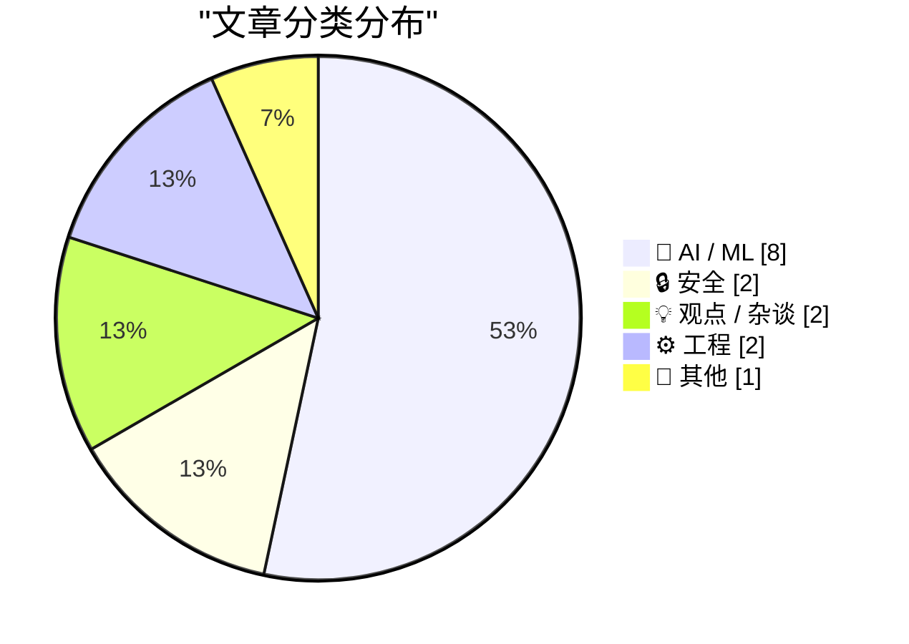
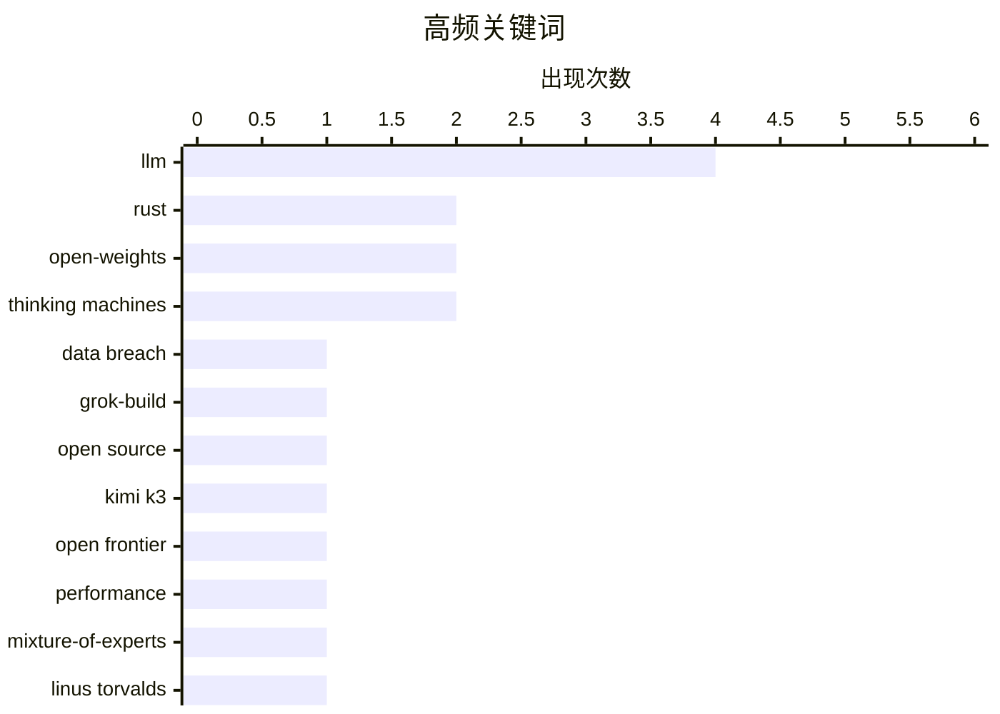

# 📰 AI 资讯每日精选 — 2026-07-17

> 汇聚 140+ 技术博客、X/Twitter、Hacker News、Reddit、Product Hunt、
> Lobste.rs、ClawFeed 日报及 GitHub Trending，经 AI 评分筛选。
>
> **本期内容**：🏆 今日必读 · 🌐 ClawFeed 日报 · 🔥 GitHub Trending · 📂 分类精选 · 🎨 设计与生成式 AI · 📊 数据概览

## 📝 今日看点

今日技术圈呈现两大焦点：一是开源与安全之间的激烈碰撞，xAI 因工具静默上传用户敏感数据引发信任危机，而多家机构则密集发布超大规模开放权重模型，包括 Moonshot AI 的 2.8 万亿参数 Kimi K3 和 Thinking Machines Lab 的 Inkling，标志着 AI 模型竞赛进入“万亿参数”时代；二是 AI 的监管与开发边界被重新审视，德国首次将 AI 概览纳入媒体法管辖，同时 Linus Torvalds 对 LLM 用于内核开发表达审慎态度，凸显技术落地中安全与合规的紧迫性。

---

## 🏆 今日必读

🥇 **xAI 在发生大规模数据泄露后在 GitHub 上开源“Grok-Build”**

[xAI open-sources "Grok-Build" on GitHub after massive data breach](https://the-decoder.com/xai-open-sources-grok-build-on-github-after-massive-data-breach/) — The Decoder · 17 小时前 · 🔒 安全

> xAI 的命令行工具“Grok Build”被发现静默将整个目录（包括 SSH 密钥和密码数据库）上传至 Google Cloud 服务器。事件引发强烈抗议后，埃隆·马斯克承诺删除所有已上传的用户数据。作为回应，xAI 在 Apache 2.0 许可下开源了完整的 844,530 行 Rust 代码库。该事件暴露了 AI 工具在用户数据隐私保护方面的严重缺陷。

💡 **为什么值得读**: 了解 AI 公司如何应对严重的安全事故，以及开源作为危机公关手段的典型案例。

🏷️ data breach, Grok-Build, open source, Rust

🥈 **Kimi K3：开放前沿智能**

[Kimi K3: Open Frontier Intelligence](https://www.kimi.com/blog/kimi-k3) — Hacker News Best · 10 小时前 · 🤖 AI / ML

> 中国 AI 实验室 Moonshot AI 发布了 Kimi K3，号称拥有 2.8 万亿参数，是其“最强大的模型”。该模型目前可通过网站和 API 使用，并承诺在 2026 年 7 月 27 日前开放权重。Moonshot 称其为首个“开放 3T 级模型”，在性能上超越了 DeepSeek 等竞争对手。

💡 **为什么值得读**: 关注中国 AI 实验室在超大参数开放权重模型上的最新突破和发布计划。

🏷️ Kimi K3, LLM, open frontier, performance

🥉 **Inkling：我们的开放权重模型**

[Inkling: Our open-weights model](https://simonwillison.net/2026/Jul/16/inkling/#atom-everything) — simonwillison.net · 9 小时前 · 🤖 AI / ML

> Mira Murati 创立的 Thinking Machines Lab 发布了其首个开放权重模型 Inkling。该模型是一个混合专家（MoE）Transformer，总参数 975B，激活参数 41B，采用 Apache-2.0 许可，并在 45 万亿 token 的文本、图像、音频和视频数据上训练。公司还承诺将推出更小的 Inkling-Small 模型（276B 总参数，12B 激活参数），但仍在测试中。

💡 **为什么值得读**: 了解前 OpenAI CTO 新公司的首个大模型技术规格和开源策略。

🏷️ open-weights, Mixture-of-Experts, LLM, Thinking Machines

4️⃣ **Linus Torvalds 谈 LLM 在内核开发中的使用**

[Linus Torvalds on LLM usage in kernel development](https://lore.kernel.org/linux-media/CAHk-=wi4zC+Ze8e+p3tMv8TtG_80KzsZ1syL9anBtmEh5Z40vg@mail.gmail.com/) — Lobste.rs · 21 小时前 · 💡 观点 / 杂谈

> Linus Torvalds 在 Linux 内核邮件列表中发表了对 LLM 在内核开发中使用的看法。他表达了对 LLM 生成代码质量的担忧，认为其可能引入难以发现的错误。Torvalds 强调内核开发需要严格的人工审查和长期积累的经验，而非依赖自动化工具。

💡 **为什么值得读**: 直接听取 Linux 之父对 AI 辅助编程在关键基础设施项目中应用的真实态度。

🏷️ Linus Torvalds, LLM, kernel, AI

5️⃣ **Firefox 在 WebAssembly 中运行**

[Firefox in WebAssembly](https://simonwillison.net/2026/Jul/16/firefox-in-webassembly/#atom-everything) — simonwillison.net · 1 小时前 · ⚙️ 工程

> Puter 项目成功将 Firefox 编译为 WebAssembly，使其能够在另一个浏览器中完整运行。演示中，一个 Chrome 窗口内的标签页加载了 Firefox UI，并成功显示了博客页面，同时 Chrome 网络面板显示加载了 233MB 的 gecko.wasm 文件。这一技术展示了 WebAssembly 在运行复杂原生应用方面的巨大潜力。

💡 **为什么值得读**: 见证“浏览器中的浏览器”这一令人惊叹的技术实现，了解 WebAssembly 的最新应用边界。

🏷️ WebAssembly, Firefox, browser, compilation

---

## 🌐 ClawFeed 日报精选

> 来源：[ClawFeed](https://clawfeed.kevinhe.io) — AI 驱动的多源新闻聚合

# ClawFeed 日报 | 2026-07-16 (Wednesday)

基于 5 档 4h digest（#857 16:00 / #859 20:00 / #860 00:00 / #861 04:00 / #862 08:00，覆盖 2026-07-15 16:00 至 2026-07-16 11:59 SGT）汇总。

---

## 🔥 当日全场最重要 5 条

**1. DeepMind CEO Demis Hassabis 发万字 AGI 框架文：AGI "probably only a few short years away"**
Google DeepMind 掌门人迄今最明确的 AGI 时间表表态。《A Framework for Frontier AI and the Dawning of a New Age》获 10M+ 阅读量，呼吁全球治理框架。Coinbase CEO Brian Armstrong 专门回应其中 SRO 监管模式建议，称双重监管往往适得其反。这是科技/金融两大阵营罕见的围绕 AGI 治理展开直接对话。
（#860 00:00-03:59 SGT）

**2. DTCC 完成首笔代币化美国证券生产级交易——RWA 从叙事进入生产**
Chainlink 提供支持，参与机构超 30 家：BlackRock、J.P. Morgan、Goldman Sachs、Vanguard、NYSE、Nasdaq、CME Group、Microsoft、State Street。这不是 PoC 或测试网——是美国证券基础设施核心节点的真实生产交易。RWA 机构化最重要的里程碑之一。
（#861 04:00-07:59 SGT）

**3. 日本上议院通过立法，加密货币重新归类为"金融工具"**
纳入金融工具交易法监管，最高 55% 加密税有望降至股票同等 20%，同时为现货 BTC ETF 铺路——东京证交所可能 2027-2028 上线。已过下议院，全院投票基本走形式。继美国 ETF 通过后，亚太最大的加密监管利好。
（#862 08:00-11:59 SGT）

**4. 阿里千问集成苹果智能——中国 AI + Apple 生态最大规模合作**
千问 AI 能力将内嵌 iOS/iPadOS/macOS/visionOS，中国用户无需切换应用即可体验文本与图像理解、内容生成。iPhone 同步推进 Apple 智能手机备案。数亿中国 Apple 用户将首次直接触达国产大模型能力。
（#857 16:00-19:59 SGT, #859 20:00-23:59 SGT）

**5. 韩国 KOSPI 暴跌超 6%，SK 海力士 -11%，三星电子 -8%**
韩国央行加息 25bp 至 2.75%，同时启动程序化交易暂停机制。半导体巨头领跌，链上杠杆清算与传统市场共振。连日韩国市场系统性风险信号，值得关注对全球半导体和加密市场的外溢效应。
（#862 08:00-11:59 SGT）

---

## 📰 当日核心主题

### 1. RWA 机构化全面提速
DTCC+Chainlink 生产级交易是标志性事件，但不是孤例：UK Finance 选中 Quant Network 为英国代币化英镑存款提供底层技术（政府报告称其"exceptionally important to the UK"）；ADI Chain 定位中东北非首个面向稳定币与 RWA 的机构级 zkRollup L2（BlackRock/Mastercard 同列 Open USD 标准联盟）；Gate Pre-IPO 第二期上线 OpenAI 股票认购，1 小时认购近 1.48 亿美元（739% 认购率）；FalconX 收购 bloXroute 加速资本市场链上化。从美国到英国到中东，机构级 RWA 基础设施同步落地。

### 2. AI 模型格局三线分化
闭源前沿：Grok 4.5 FrontierSWE benchmark #2（Elon 转发确认），Kimi 3 即将发布；开源专精：Thinking Machines 发布 Inkling 多模态推理模型全量权重公开，Aaron Levie 点评"前沿智能做编排 + 低成本/微调模型做 workhorse"混合路线越来越清晰，Vercel 同日接入 AI Gateway；AGI 叙事：Hassabis 万字框架文 10M+ 阅读量。模型竞争从"谁更强"分化为"闭源编排 vs 开源专精 vs AGI 治理"三条并行赛道。

### 3. 亚太监管与市场双重震荡
日本加密金融工具法案（税率从 55% 降至 20%、BTC ETF 铺路）是利好里程碑；韩国 KOSPI 暴跌 6%+ 是风险信号——央行加息+半导体领跌+程序化交易暂停。两个信号叠加：亚太正成为加密监管最活跃的区域，同时传统金融市场的波动在加剧与加密市场的共振。

### 4. Agent 协作工具集中爆发
Raft 1.0（前 Kimi CLI 作者，human-agent 团队协作平台，173K 曝光）、Matrix Agent OS（不是一个巨大 Agent 而是 Agent 公司操作系统）、Claude Code Routines（coding agent 自动触发文档更新，weekly PRs +200%）、Cline Kanban（CLI-agnostic 多 agent 编排）、BaoCut（Agent+Skill 路线做视频编辑）。Agent 从"单点工具"向"协作系统"转型的信号密集且来自不同方向。

### 5. AI 编程的真实 ROI 两极化
反面：VP of Engineering 花 $180K 买 AI coding 工具，80 万行遗留代码库生产事故 +40%——AI 在遗留代码中批量制造技术债。正面：亚特兰大一公司用 Replit + Claude Code 自研应用替代 Salesforce，年省 $100K。Harness Engineering（同模型同 benchmark 42%→78%）说明差异不在模型而在 harness。结论：AI coding ROI 取决于代码库质量和工程 harness，不取决于工具本身。

---

## 🔖 累计 Bookmark 精选

跨档反复出现、值得深读的 bookmark 内容：

• **Harness Engineering**（@chenchengpro / @heynavtoor）— 同模型同 benchmark 42%→78%，唯一变量是 harness（rules/tools/skills/feedback loop）。"可能是 2026 AI 工程最重要发现。" https://x.com/chenchengpro/status/2037332209003282747
• **Matrix Agent OS**（@BruceGuai）— 拒绝"一个巨大 Agent 塞满所有工具"，走多 Agent 公司化路线，含分权、审计、accountability。 https://x.com/BruceGuai/status/2070130243059495142
• **Aaron Levie 三部曲**（The Era of Context / The Future of Enterprise Software / The Capability Overhang）— 从 Drucker 到 AI agent，context 才是真正瓶颈。 https://x.com/levie/status/2007958155137876183
• **Anthropic Claude for Finance**（@Av1dlive）— "quant AI 目前最有价值的免费 1 小时"。 https://x.com/Av1dlive/status/2059273095970738264
• **Google Stitch DESIGN.md**（@yangyi）— 一个 Markdown 文件教会 AI Coding Agent 整个设计系统，40+ 预构建文件。 https://x.com/yangyi/status/2040272305277079728
• **Cline Kanban**（@cline）— CLI-agnostic 多 agent 编排独立 app，task 跑 worktree + 依赖链自主完成大块工作。 https://x.com/cline/status/2037182739695493399
• **AI-Native Engineering 五阶段**（@mardehaym）— 大多数团队的 AI-native 还在零阶段。 https://x.com/mardehaym/status/2070557674966573570
• **How to Make a Company AI-Native**（@LimestoneHQ）— 完整方法论免费公开，适用于中小规模组织。 https://x.com/LimestoneHQ/status/2074483555510448582

---

## 👀 推荐关注汇总

| 账号 | 理由 |
|------|------|
| @mukundjha | Emergent Labs CEO，$1.5B 估值创始人，"把业务运作方式变软件"定位清晰 |
| @thinkymachines | 美国本土开源多模态模型实验室，Inkling 全量权重公开 |
| @istdrc | 前 Kimi CLI 作者，Raft 1.0 创始人，agent 协作平台一线构建者 |
| @JenksGuo | Verifier's rule 等 AI 工程原理性思考，引用一线研究者，思考密度高 |
| @DeepFortyTwo | 专注 Quant Network / 机构级区块链基建，信息密度高 |
| @chuhaiqu | AI 出海 + 企业 AI 替代实操案例追踪，真实 ROI 故事 |

提醒：以上未逐一核实是否已关注，操作前请先在 Following 搜索确认。

---

## 💤 当日重复噪音模式

| 模式 | 说明 |
|------|------|
| 世界杯/体育博彩 | 法国 vs 西班牙预测帖、赛后情绪帖，多个账号反复出现 |
| follow-for-follow 列表 | @Gmf_winner 等批量互关帖，零信息密度 |
| 币安九周年营销 | 多账号转发抽奖/纪念帖，pure noise |
| 纯交易信号/喊单 | SOL 喊单、HYPE 做空、低密度加密交易信号，跨档反复 |
| 早安/打卡/宠物/诗词 | 社交互动帖，无信息增量 |
| Meme/DeFi 营销转发 | Doginal Dog NFT、DeFi_Hunter 等低质量转发 |

建议取关（跨档一致）：**@HeXiaobo** — 最后推文 2018 年 7 月，超 8 年未活跃，典型僵尸号。

---

*Generated by ClawFeed daily digest pipeline · Source: 4h digests #857, #859, #860, #861, #862*
---

## 🔥 GitHub Trending

> 今日热门开源项目（全语言 + Python）

| # | 项目 | 描述 | ⭐ 总星 | 📈 今日 | 语言 |
|---|------|------|---------|---------|------|
| 1 | [OpenCut-app/OpenCut](https://github.com/OpenCut-app/OpenCut) | The open-source CapCut alternative | 74.0k | +3537 | TypeScript |
| 2 | [Nutlope/hallmark](https://github.com/Nutlope/hallmark) 🤖 | Anti-AI-slop design skill for Claude Code, Cursor, and Co... | 10.9k | +3372 | CSS |
| 3 | [mattpocock/skills](https://github.com/mattpocock/skills) 🤖 | Skills for Real Engineers. Straight from my .claude direc... | 174.3k | +2060 | Shell |
| 4 | [Graphify-Labs/graphify](https://github.com/Graphify-Labs/graphify) 🤖 | AI coding assistant skill (Claude Code, Codex, OpenCode, ... | 89.1k | +1107 | Python |
| 5 | [Shubhamsaboo/awesome-llm-apps](https://github.com/Shubhamsaboo/awesome-llm-apps) 🤖 | 100+ AI Agent & RAG apps you can actually run — clone, cu... | 122.9k | +923 | Python |
| 6 | [HKUDS/Vibe-Trading](https://github.com/HKUDS/Vibe-Trading) 🤖 | "Vibe-Trading: Your Personal Trading Agent" | 24.3k | +781 | Python |
| 7 | [hasaneyldrm/exercises-dataset](https://github.com/hasaneyldrm/exercises-dataset) | 1,324-exercise fitness dataset — animation GIFs, 180×180 ... | 15.0k | +710 | HTML |
| 8 | [openinterpreter/openinterpreter](https://github.com/openinterpreter/openinterpreter) 🤖 | A coding agent for open models like Kimi K3 | 66.0k | +661 | Rust |
| 9 | [HKUDS/DeepTutor](https://github.com/HKUDS/DeepTutor) | DeepTutor: Lifelong Personalized Tutoring. https://deeptu... | 26.9k | +656 | Python |
| 10 | [NousResearch/hermes-agent](https://github.com/NousResearch/hermes-agent) 🤖 | The agent that grows with you | 216.0k | +588 | Python |
| 11 | [codecrafters-io/build-your-own-x](https://github.com/codecrafters-io/build-your-own-x) | Master programming by recreating your favorite technologi... | 526.3k | +435 | Markdown |
| 12 | [microsoft/markitdown](https://github.com/microsoft/markitdown) | Python tool for converting files and office documents to ... | 166.7k | +363 | Python |
| 13 | [PrismML-Eng/Bonsai-demo](https://github.com/PrismML-Eng/Bonsai-demo) | Bonsai Demo | 1.5k | +196 | Shell |
| 14 | [ibelick/ui-skills](https://github.com/ibelick/ui-skills) | Skills for Design Engineers | 4.3k | +178 | TypeScript |
| 15 | [YimMenu/YimMenuV2](https://github.com/YimMenu/YimMenuV2) | Experimental menu for GTA 5: Enhanced | 1.5k | +128 | C++ |

---

## 🤖 AI / ML

### 1. Kimi K3：开放前沿智能

[Kimi K3: Open Frontier Intelligence](https://www.kimi.com/blog/kimi-k3) — **Hacker News Best** · 10 小时前 · ⭐ 27/30

> 中国 AI 实验室 Moonshot AI 发布了 Kimi K3，号称拥有 2.8 万亿参数，是其“最强大的模型”。该模型目前可通过网站和 API 使用，并承诺在 2026 年 7 月 27 日前开放权重。Moonshot 称其为首个“开放 3T 级模型”，在性能上超越了 DeepSeek 等竞争对手。

🏷️ Kimi K3, LLM, open frontier, performance

---

### 2. Inkling：我们的开放权重模型

[Inkling: Our open-weights model](https://simonwillison.net/2026/Jul/16/inkling/#atom-everything) — **simonwillison.net** · 9 小时前 · ⭐ 26/30

> Mira Murati 创立的 Thinking Machines Lab 发布了其首个开放权重模型 Inkling。该模型是一个混合专家（MoE）Transformer，总参数 975B，激活参数 41B，采用 Apache-2.0 许可，并在 45 万亿 token 的文本、图像、音频和视频数据上训练。公司还承诺将推出更小的 Inkling-Small 模型（276B 总参数，12B 激活参数），但仍在测试中。

🏷️ open-weights, Mixture-of-Experts, LLM, Thinking Machines

---

### 3. Kimi K3，以及我们仍能从鹈鹕基准测试中学到什么

[Kimi K3, and what we can still learn from the pelican benchmark](https://simonwillison.net/2026/Jul/16/kimi-k3/#atom-everything) — **simonwillison.net** · 4 小时前 · ⭐ 25/30

> 中国 AI 实验室 Moonshot AI 发布了 Kimi K3，称其拥有 2.8 万亿参数，是“最强大的模型”。Moonshot 将其称为首个“开放 3T 级模型”，从 DeepSeek 手中夺走了参数规模桂冠。文章还讨论了鹈鹕（Pelican）基准测试在评估这类超大模型时的价值与局限性。

🏷️ LLM, open-source, Moonshot AI, benchmark

---

### 4. Kimi 的开放模型 K3 接近 GPT-5.6 Sol 和 Fable 5，同时标志着超廉价中国 AI 的终结

[Kimi's open model K3 nears GPT-5.6 Sol and Fable 5 while signaling the end of super cheap Chinese AI](https://the-decoder.com/kimis-open-model-k3-nears-gpt-5-6-sol-and-fable-5-while-signaling-the-end-of-super-cheap-chinese-ai/) — **The Decoder** · 5 小时前 · ⭐ 25/30

> Kimi 发布 K3，一个拥有 2.8 万亿参数和 100 万 token 上下文的开放权重多模态模型。在公司自测中，其性能接近 Claude Fable 5 和 GPT 5.6 Sol，并大幅超越 Opus 4.8 和 GLM 5.2。但该模型定价显著高于前代，预示着中国 AI 超低价时代的结束。完整权重计划于 7 月 27 日前发布。

🏷️ K3, open model, multimodal, benchmarks

---

### 5. 前 OpenAI CTO Murati 的 Thinking Machines 发布 Inkling：一个 975B 参数模型，领先美国实验室但落后于中国

[Ex-OpenAI CTO Murati's Thinking Machines drops Inkling, a 975B parameter model that leads US labs but trails China](https://the-decoder.com/ex-openai-cto-muratis-thinking-machines-drops-inkling-a-975b-parameter-model-that-leads-us-labs-but-trails-china/) — **The Decoder** · 15 小时前 · ⭐ 25/30

> 前 OpenAI CTO Mira Murati 创立的 Thinking Machines Lab 发布了 Inkling，一个 9750 亿参数的多模态开放权重模型。它在 Artificial Analysis 智能指数上领先于其他美国开放权重模型，但在某些任务上仍落后于中国顶级开放模型。定价为每百万输入 token 1.87 美元起，公司将其定位为微调基础模型，而非最强模型。

🏷️ Inkling, open-weights, 975B, Thinking Machines

---

### 6. NVIDIA Nemotron 3 Embed Ranks #1 Overall on RTEB, Advancing Agentic Retrieval

[NVIDIA Nemotron 3 Embed Ranks #1 Overall on RTEB, Advancing Agentic Retrieval](https://huggingface.co/blog/nvidia/nemotron-3-embed-wins-rteb) — **Hugging Face Blog** · 9 小时前 · ⭐ 24/30

> 

🏷️ NVIDIA, Nemotron, embedding, retrieval

---

### 7. Scaling Agentic AI Factories Through Extreme Co-Design with NVIDIA BlueField

[Scaling Agentic AI Factories Through Extreme Co-Design with NVIDIA BlueField](https://developer.nvidia.com/blog/scaling-agentic-ai-factories-through-extreme-co-design-with-nvidia-bluefield/) — **NVIDIA Technical Blog** · 9 小时前 · ⭐ 24/30

> Agentic AI changes the infrastructure pattern for AI factories. One request can trigger many model calls, tool calls, memory lookups, policy checks, storage...

🏷️ Agentic AI, infrastructure, NVIDIA BlueField, co-design

---

### 8. South Korea wants to offer free, unlimited AI to every one of its citizens

[South Korea wants to offer free, unlimited AI to every one of its citizens](https://www.reddit.com/r/singularity/comments/1uxvwlm/south_korea_wants_to_offer_free_unlimited_ai_to/) — **r/singularity** · 17 小时前 · ⭐ 24/30

> <table> <tr><td> <a href="https://www.reddit.com/r/singularity/comments/1uxvwlm/south_korea_wants_to_offer_free_unlimited_ai_to/">  xAI 的命令行工具“Grok Build”被发现静默将整个目录（包括 SSH 密钥和密码数据库）上传至 Google Cloud 服务器。事件引发强烈抗议后，埃隆·马斯克承诺删除所有已上传的用户数据。作为回应，xAI 在 Apache 2.0 许可下开源了完整的 844,530 行 Rust 代码库。该事件暴露了 AI 工具在用户数据隐私保护方面的严重缺陷。

🏷️ data breach, Grok-Build, open source, Rust

---

### 10. You can't bug fix your way out of the vulnpocalypse

[You can't bug fix your way out of the vulnpocalypse](https://alexgaynor.net/2026/jul/15/you-cant-bugfix-your-way-out-of-the-vulnpocalypse/) — **Lobste.rs** · 17 小时前 · ⭐ 25/30

> <p><a href="https://lobste.rs/s/nkrgcp/you_can_t_bug_fix_your_way_out">Comments</a></p>

🏷️ vulnerability, security, supply chain, bug fix

---

## 💡 观点 / 杂谈

### 11. Linus Torvalds 谈 LLM 在内核开发中的使用

[Linus Torvalds on LLM usage in kernel development](https://lore.kernel.org/linux-media/CAHk-=wi4zC+Ze8e+p3tMv8TtG_80KzsZ1syL9anBtmEh5Z40vg@mail.gmail.com/) — **Lobste.rs** · 21 小时前 · ⭐ 26/30

> Linus Torvalds 在 Linux 内核邮件列表中发表了对 LLM 在内核开发中使用的看法。他表达了对 LLM 生成代码质量的担忧，认为其可能引入难以发现的错误。Torvalds 强调内核开发需要严格的人工审查和长期积累的经验，而非依赖自动化工具。

🏷️ Linus Torvalds, LLM, kernel, AI

---

### 12. Sony deletes more movies from the accounts of people who ‘bought’ them

[Sony deletes more movies from the accounts of people who ‘bought’ them](https://www.techdirt.com/2026/07/15/sony-deletes-a-bunch-more-movies-from-the-accounts-of-people-who-bought-them/) — **Hacker News Best** · 12 小时前 · ⭐ 24/30

> Article URL: https://www.techdirt.com/2026/07/15/sony-deletes-a-bunch-more-movies-from-the-accounts-of-people-who-bought-them/
Comments URL: https://news.ycombinator.com/item?id=48933419
Points: 578
#

🏷️ digital ownership, Sony, DRM, consumer rights

---

## ⚙️ 工程

### 13. Firefox 在 WebAssembly 中运行

[Firefox in WebAssembly](https://simonwillison.net/2026/Jul/16/firefox-in-webassembly/#atom-everything) — **simonwillison.net** · 1 小时前 · ⭐ 25/30

> Puter 项目成功将 Firefox 编译为 WebAssembly，使其能够在另一个浏览器中完整运行。演示中，一个 Chrome 窗口内的标签页加载了 Firefox UI，并成功显示了博客页面，同时 Chrome 网络面板显示加载了 233MB 的 gecko.wasm 文件。这一技术展示了 WebAssembly 在运行复杂原生应用方面的巨大潜力。

🏷️ WebAssembly, Firefox, browser, compilation

---

### 14. 我们的 Rust 到 Zig 重写进展如何

[How Our Rust-to-Zig Rewrite Is Going](https://rtfeldman.com/rust-to-zig) — **Hacker News Best** · 13 小时前 · ⭐ 25/30

> 文章详细介绍了将一个 Rust 代码库重写为 Zig 的实践过程和经验教训。作者对比了两种语言在内存管理、编译速度、互操作性等方面的差异。重写带来了显著的性能提升和更小的二进制体积，但也面临工具链成熟度和生态系统不足的挑战。

🏷️ Rust, Zig, rewrite, systems programming

---

## 📝 其他

### 15. 德国首次裁定：将 Google 的 AI 概览和 Perplexity 纳入媒体法管辖

[Germany puts Google's AI Overviews and Perplexity under media law in first-of-its-kind ruling](https://the-decoder.com/germany-puts-googles-ai-overviews-and-perplexity-under-media-law-in-first-of-its-kind-ruling/) — **The Decoder** · 8 小时前 · ⭐ 25/30

> 德国媒体监管机构裁定，Google 的 AI 概览属于 Google 自身的内容，而非中立的搜索结果，并且它们挤压了常规链接的展示空间。监管机构根据《国家媒体条约》对 Google 和 Perplexity 发布了首批裁决。两家公司有一个月的时间提出上诉。

🏷️ regulation, AI Overviews, Germany, media law

---

## 📊 数据概览

| 扫描源 | 抓取文章 | 时间范围 | 精选 |
|:---:|:---:|:---:|:---:|
| 94/140 | 3866 篇 → 92 篇 | 24h | **15 篇** |

### 分类分布



### 高频关键词



<details>
<summary>📈 纯文本关键词图（终端友好）</summary>

```
llm               │ ████████████████████ 4
rust              │ ██████████░░░░░░░░░░ 2
open-weights      │ ██████████░░░░░░░░░░ 2
thinking machines │ ██████████░░░░░░░░░░ 2
data breach       │ █████░░░░░░░░░░░░░░░ 1
grok-build        │ █████░░░░░░░░░░░░░░░ 1
open source       │ █████░░░░░░░░░░░░░░░ 1
kimi k3           │ █████░░░░░░░░░░░░░░░ 1
open frontier     │ █████░░░░░░░░░░░░░░░ 1
performance       │ █████░░░░░░░░░░░░░░░ 1
```

</details>

### 🏷️ 话题标签

**llm**(4) · **rust**(2) · **open-weights**(2) · thinking machines(2) · data breach(1) · grok-build(1) · open source(1) · kimi k3(1) · open frontier(1) · performance(1) · mixture-of-experts(1) · linus torvalds(1) · kernel(1) · ai(1) · webassembly(1) · firefox(1) · browser(1) · compilation(1) · open-source(1) · moonshot ai(1)

---

*生成于 2026-07-17 01:10 | 汇聚 140 个技术博客、X/Twitter、Hacker News、Reddit、Product Hunt、Lobste.rs、ClawFeed 日报及 GitHub Trending，经 AI 评分筛选出 Top 15 精华内容*
