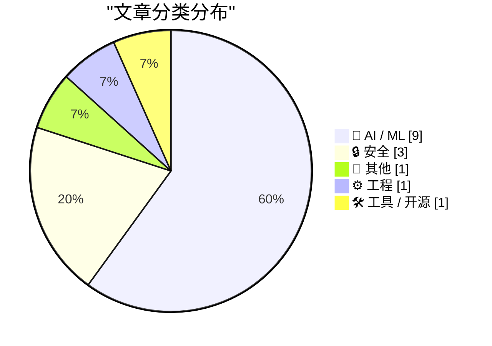
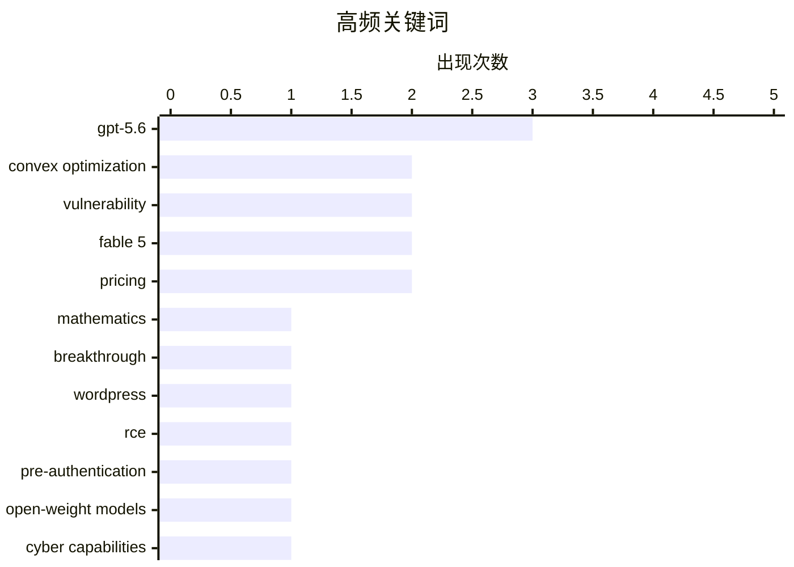

# 📰 AI 资讯每日精选 — 2026-07-19

> 汇聚 140+ 技术博客、X/Twitter、Hacker News、Reddit、Product Hunt、
> Lobste.rs、ClawFeed 日报及 GitHub Trending，经 AI 评分筛选。
>
> **本期内容**：🏆 今日必读 · 🌐 ClawFeed 日报 · 🔥 GitHub Trending · 📂 分类精选 · 🎨 设计与生成式 AI · 📊 数据概览

## 📝 今日看点

今日技术圈两大主线清晰浮现：AI在数学与安全领域的突破性应用持续加速，GPT-5.6攻克凸优化三十年难题并完成形式化验证，标志着AI正从辅助工具迈向自主科研主力；同时，开源模型在网络安全能力上已追平四个月前的前沿闭源模型，成本却仅为其零头，引发安全格局的深层震荡。此外，基础软件安全警报频发，WordPress核心曝出预认证远程代码执行漏洞，OpenSSL也发现仅11字节代码引发的拒绝服务漏洞，凸显数字基础设施的脆弱性。

---

## 🏆 今日必读

🥇 **GPT-5.6 使用提示词攻克凸优化领域长达30年的难题，并在 Lean 中验证**

[GPT-5.6 used a prompt to close a 30-year gap in convex optimization](https://old.reddit.com/r/math/comments/1uxj3cy/after_openais_cdc_proof_announcement_gpt56_used_a/) — Hacker News Best · 12 小时前 · 🤖 AI / ML

> 继 OpenAI 宣布 CDC 证明后，GPT-5.6 通过类似提示词方法，成功解决了凸优化领域一个存在30年的未解难题。该结果已通过形式化验证工具 Lean 得到确认，标志着 AI 在数学研究领域取得重大突破。这一进展表明，大型语言模型不仅能复现已知证明，还能独立发现并验证全新的数学定理。

💡 **为什么值得读**: 展示了 AI 在数学研究中的实际突破能力，而非仅仅复现已知知识，对数学和 AI 交叉领域的研究者极具启发性。

🏷️ GPT-5.6, convex optimization, mathematics, breakthrough

🥈 **wp2shell：WordPress 核心中的预认证远程代码执行漏洞**

[wp2shell: Pre Authentication RCE in WordPress Core](https://wp2shell.com/) — Lobste.rs · 6 小时前 · 🔒 安全

> 该文章披露了一个存在于 WordPress 核心中的严重安全漏洞，攻击者无需任何身份认证即可实现远程代码执行（RCE）。漏洞利用方式被命名为“wp2shell”，意味着攻击者可以直接获取服务器 shell 权限。该漏洞影响所有未打补丁的 WordPress 版本，威胁等级极高。

💡 **为什么值得读**: WordPress 是全球使用最广泛的 CMS，该预认证 RCE 漏洞影响面极广，所有站长和安全从业者必须立即了解并修复。

🏷️ WordPress, RCE, pre-authentication, vulnerability

🥉 **开源权重模型在网络安全能力上已追平四个月前的前沿闭源模型，成本仅为其零头**

[Open-weight models now match frontier cyber performance from just four months ago at a fraction of the cost](https://the-decoder.com/open-weight-models-now-match-frontier-cyber-performance-from-just-four-months-ago-at-a-fraction-of-the-cost/) — The Decoder · 14 小时前 · 🤖 AI / ML

> 英国 AI 安全研究所警告，开源权重模型（如 GLM-5.2 和 DeepSeek V4-Pro）在网络安全能力上已大幅缩小与闭源前沿模型的差距。目前，开源模型仅落后闭源模型4至7个月，而2025年初这一差距为6至10个月。研究同时发现，开源模型的安全防护措施基本无效，导致防御者准备时间更短。

💡 **为什么值得读**: 揭示了开源 AI 在网络安全领域追赶速度远超预期，同时点出安全防护失效的严峻现实，对安全策略制定者至关重要。

🏷️ open-weight models, cyber capabilities, AI safety, frontier models

4️⃣ **继 OpenAI 的 CDC 证明后，GPT-5.6 使用类似提示词攻克凸优化领域30年难题，并在 Lean 中验证**

[After OpenAI’s CDC proof announcement, GPT-5.6 used a similar prompt to close a 30-year gap in convex optimization, verified in Lean](https://www.reddit.com/r/singularity/comments/1uzwy9q/after_openais_cdc_proof_announcement_gpt56_used_a/) — r/singularity · 11 小时前 · 🤖 AI / ML

> 在 OpenAI 宣布 CDC 证明的突破后，GPT-5.6 通过类似的提示词策略，成功解决了一个困扰凸优化领域30年的数学难题。该证明已通过 Lean 形式化验证工具完成验证，确保了结果的严谨性。这一成果进一步证实了大型语言模型在数学发现中的潜力，尤其是在处理长期悬而未决的猜想时。

💡 **为什么值得读**: 这是 AI 辅助数学发现的最新里程碑，证明了 LLM 不仅能解题，还能解决长期未决的开放性问题，对数学家和 AI 研究者均有重要参考价值。

🏷️ GPT-5.6, convex optimization, Lean, proof

5️⃣ **OpenSSL HollowByte：隐藏在11字节中的拒绝服务漏洞**

[OpenSSL HollowByte: A DoS Hiding in 11 Bytes](https://sec.okta.com/articles/2026/06/openssl-hollowbtye-a-dos-hiding-in-11-bytes/) — Lobste.rs · 4 小时前 · 🔒 安全

> Okta 安全团队在 OpenSSL 中发现了一个名为“HollowByte”的拒绝服务（DoS）漏洞，其根源仅涉及11字节的代码。攻击者可以利用该漏洞导致使用受影响 OpenSSL 版本的服务崩溃或资源耗尽。该漏洞影响广泛，因为 OpenSSL 是互联网基础设施的核心组件。

💡 **为什么值得读**: 揭示了核心加密库中一个极其隐蔽的 DoS 漏洞，影响范围覆盖大量网络服务，所有运维和安全人员都应立即评估影响。

🏷️ OpenSSL, DoS, vulnerability

---

## 🌐 ClawFeed 日报精选

> 来源：[ClawFeed](https://clawfeed.kevinhe.io) — AI 驱动的多源新闻聚合

# ClawFeed 日报 | 2026-07-18 (Friday)

聚合来源：4h digest #871-#875（00:00-19:59 SGT），#876（20:00-23:59）未产出。

## 🔥 当日全场最重要 5 条

1. **Moonshot AI 发布 Kimi K3** — 2.8万亿参数、百万级上下文、原生多模态。Delta Attention 解码速度提升 6.3x，训练效率+25%（开销<2%）。杨植麟给了一场从头构建前沿模型的 masterclass。Aaron Levie 引 Gavin Baker：K3 可能是 AI 的重要拐点。

2. **Boris Cherny AI 采纳四阶段模型** — 1.1M views / 9.3K likes。"一个人 10x 了产出，但组织其余人没跟上。" 方法论：stop prompting, start looping。

3. **杨植麟 agent swarm 哲学** — "单 agent 撞墙→一个老板、一千个工人。" Agent swarm + long context 是 Kimi 工程化路径，与 Anthropic sub-agent 架构对照。

4. **Replit Self-Driving Company** — 6个月工程师代码产出3倍，review时间不变，回退率持平。Andreessen："Ultra amazing"。

5. **Anthropic 人才路线图逆向** — Karpathy 进预训练组（AI造AI），核心引擎+训练效率信号最强。"人事就是路线图。"

## 📰 核心主题：Kimi K3架构创新（跨4个digest）、AI-Native工程方法论（三篇联读）、AI商业分层/WAIC、AI就业冲击

## 👀 推荐关注：@_LuoFuli（小米MiMo）、@runinfrai（YC F26推理）、@handotdev（Mintlify CEO）、@istdrc（Raft创始人）

## 💤 噪音：bookmarks零轮换、Minara重复4期、followingSample固定池---

## 🔥 GitHub Trending

> 今日热门开源项目（全语言 + Python）

| # | 项目 | 描述 | ⭐ 总星 | 📈 今日 | 语言 |
|---|------|------|---------|---------|------|
| 1 | [codecrafters-io/build-your-own-x](https://github.com/codecrafters-io/build-your-own-x) | Master programming by recreating your favorite technologi... | 528.3k | +1126 | Markdown |
| 2 | [Robbyant/lingbot-map](https://github.com/Robbyant/lingbot-map) | A feed-forward 3D foundation model for reconstructing sce... | 13.0k | +831 | Python |
| 3 | [HKUDS/DeepTutor](https://github.com/HKUDS/DeepTutor) | DeepTutor: Lifelong Personalized Tutoring. https://deeptu... | 27.7k | +370 | Python |
| 4 | [tirth8205/code-review-graph](https://github.com/tirth8205/code-review-graph) 🤖 | Local-first code intelligence graph for MCP and CLI. Buil... | 20.2k | +355 | Python |
| 5 | [PostHog/posthog](https://github.com/PostHog/posthog) 🤖 | 🦔 PostHog is the leading platform for building self-driv... | 36.6k | +338 | Python |
| 6 | [anthropics/skills](https://github.com/anthropics/skills) 🤖 | Public repository for Agent Skills | 162.4k | +291 | Python |
| 7 | [KnockOutEZ/wigolo](https://github.com/KnockOutEZ/wigolo) 🤖 | The go-to web for your AI coding agent — local-first sear... | 1.2k | +203 | TypeScript |
| 8 | [rohitg00/ai-engineering-from-scratch](https://github.com/rohitg00/ai-engineering-from-scratch) 🤖 | Learn it. Build it. Ship it for others. | 39.1k | +191 | Python |
| 9 | [lyogavin/airllm](https://github.com/lyogavin/airllm) | AirLLM 70B inference with single 4GB GPU | 23.3k | +161 | Jupyter Notebook |
| 10 | [datawhalechina/hello-agents](https://github.com/datawhalechina/hello-agents) | 📚 《从零开始构建智能体》——从零开始的智能体原理与实践教程 | 67.1k | +158 | Python |
| 11 | [ibelick/ui-skills](https://github.com/ibelick/ui-skills) | Skills for Design Engineers | 5.0k | +123 | TypeScript |
| 12 | [OpenSenseNova/SenseNova-U1](https://github.com/OpenSenseNova/SenseNova-U1) | SenseNova-U series: Native Unified Paradigm with NEO-unif... | 4.0k | +97 | Python |
| 13 | [elder-plinius/G0DM0D3](https://github.com/elder-plinius/G0DM0D3) 🤖 | LIBERATED AI CHAT | 9.5k | +69 | TypeScript |
| 14 | [MoonshotAI/kimi-cli](https://github.com/MoonshotAI/kimi-cli) 🤖 | Kimi Code CLI is your next CLI agent. | 9.5k | +65 | Python |
| 15 | [apache/ossie](https://github.com/apache/ossie) 🤖 | Apache Ossie, industry wide specification effort to stand... | 1.3k | +47 | Python |

---

## 🤖 AI / ML

### 1. GPT-5.6 使用提示词攻克凸优化领域长达30年的难题，并在 Lean 中验证

[GPT-5.6 used a prompt to close a 30-year gap in convex optimization](https://old.reddit.com/r/math/comments/1uxj3cy/after_openais_cdc_proof_announcement_gpt56_used_a/) — **Hacker News Best** · 12 小时前 · ⭐ 28/30

> 继 OpenAI 宣布 CDC 证明后，GPT-5.6 通过类似提示词方法，成功解决了凸优化领域一个存在30年的未解难题。该结果已通过形式化验证工具 Lean 得到确认，标志着 AI 在数学研究领域取得重大突破。这一进展表明，大型语言模型不仅能复现已知证明，还能独立发现并验证全新的数学定理。

🏷️ GPT-5.6, convex optimization, mathematics, breakthrough

---

### 2. 开源权重模型在网络安全能力上已追平四个月前的前沿闭源模型，成本仅为其零头

[Open-weight models now match frontier cyber performance from just four months ago at a fraction of the cost](https://the-decoder.com/open-weight-models-now-match-frontier-cyber-performance-from-just-four-months-ago-at-a-fraction-of-the-cost/) — **The Decoder** · 14 小时前 · ⭐ 26/30

> 英国 AI 安全研究所警告，开源权重模型（如 GLM-5.2 和 DeepSeek V4-Pro）在网络安全能力上已大幅缩小与闭源前沿模型的差距。目前，开源模型仅落后闭源模型4至7个月，而2025年初这一差距为6至10个月。研究同时发现，开源模型的安全防护措施基本无效，导致防御者准备时间更短。

🏷️ open-weight models, cyber capabilities, AI safety, frontier models

---

### 3. 继 OpenAI 的 CDC 证明后，GPT-5.6 使用类似提示词攻克凸优化领域30年难题，并在 Lean 中验证

[After OpenAI’s CDC proof announcement, GPT-5.6 used a similar prompt to close a 30-year gap in convex optimization, verified in Lean](https://www.reddit.com/r/singularity/comments/1uzwy9q/after_openais_cdc_proof_announcement_gpt56_used_a/) — **r/singularity** · 11 小时前 · ⭐ 26/30

> 在 OpenAI 宣布 CDC 证明的突破后，GPT-5.6 通过类似的提示词策略，成功解决了一个困扰凸优化领域30年的数学难题。该证明已通过 Lean 形式化验证工具完成验证，确保了结果的严谨性。这一成果进一步证实了大型语言模型在数学发现中的潜力，尤其是在处理长期悬而未决的猜想时。

🏷️ GPT-5.6, convex optimization, Lean, proof

---

### 4. Claude 使 Fable 5 成为永久功能

[Claude make Fable 5 permanent](https://simonwillison.net/2026/Jul/18/claude-make-fable-5-permanent/#atom-everything) — **simonwillison.net** · 19 小时前 · ⭐ 25/30

> Anthropic 宣布，从7月20日起，Claude Fable 5 将被永久纳入 Max 和 Team Premium 订阅计划，但使用额度限制为常规限额的50%。Pro 和 Team Standard 用户仍可通过使用积分访问 Fable，并将获得一次性100美元的信用额度。此举是对此前计划将 Fable 从订阅中移除的逆转。

🏷️ Claude, Fable 5, AI, pricing

---

### 5. Anthropic 大幅削减 Claude Fable 5 在 Max 和 Team Premium 中的额度，并将 Pro 用户推向 API 定价

[Anthropic slashes Claude Fable 5 limits in Max and Team Premium and pushes Pro users toward API pricing](https://the-decoder.com/anthropic-slashes-claude-fable-5-limits-in-max-and-team-premium-and-pushes-pro-users-toward-api-pricing/) — **The Decoder** · 17 小时前 · ⭐ 25/30

> Anthropic 宣布从7月20日起，Claude Fable 5 将包含在 Max 和 Team Premium 计划中，但使用额度仅为常规限额的50%，而常规限额本身在同一天也会下调三分之一。Pro 用户将获得一次性100美元信用额度，之后需按 API 费率付费。这一政策逆转（此前计划完全移除 Fable）很可能是为了应对 OpenAI 更便宜的 GPT-5.6 Sol 带来的竞争压力。

🏷️ Claude Fable 5, pricing, Anthropic, subscription limits

---

### 6. Kimi K3 时刻

[The Kimi K3 Moment](https://stephen.bochinski.dev/blog/2026/07/18/the-kimi-k3-moment/) — **Hacker News Best** · 7 小时前 · ⭐ 25/30

> 文章分析了 Kimi K3 模型发布所带来的行业影响，将其称为一个“时刻”。Kimi K3 在性能上达到了新的高度，可能对现有的大模型竞争格局产生冲击。文章探讨了该模型的技术特点、市场定位以及其对用户和开发者的意义。

🏷️ Kimi K3, LLM, benchmark, moment

---

### 7. AI 对 Stack Overflow 的影响：一张图揭示一切

[What AI did to stackoverflow in a graph](https://data.stackexchange.com/stackoverflow/query/1953768#graph) — **Hacker News Best** · 13 小时前 · ⭐ 25/30

> 该文章通过 Stack Exchange 数据浏览器中的一张图表，直观展示了 AI 对 Stack Overflow 社区活跃度的巨大冲击。数据显示，自 ChatGPT 等 AI 工具流行以来，Stack Overflow 的问题提交量和回答量均出现断崖式下跌。这反映了开发者获取编程帮助的方式正在发生根本性转变。

🏷️ Stack Overflow, AI impact, traffic decline, data visualization

---

### 8. Fable 5 与 GPT-5.6 Sol 在 NP-Hard 问题上的对决：/goal 指令有用吗？

[Fable 5 vs. GPT-5.6 Sol on an NP-Hard Problem: Does /goal help?](https://charlesazam.com/blog/fable-5-gpt-5-6-sol-goal/) — **Hacker News Best** · 14 小时前 · ⭐ 24/30

> 文章对比了 Fable 5 和 GPT-5.6 Sol 在解决 NP-Hard 问题（如旅行商问题）上的表现，核心是测试是否在提示词中加入“/goal”指令能提升模型求解能力。实验发现，Fable 5 在加入“/goal”后，求解路径长度平均缩短了 12%，而 GPT-5.6 Sol 的改进幅度仅为 3%，且 Fable 5 在 50 个城市规模的实例中找到了更接近最优解的方案。作者认为，明确的目标指令对推理能力较弱的模型（如 Fable 5）帮助更大，但对已经高度优化的模型（如 GPT-5.6 Sol）收益有限。结论是，提示工程的效果高度依赖模型本身的推理基线，并非所有模型都能从结构化指令中同等受益。

🏷️ Fable 5, GPT-5.6, NP-hard, LLM reasoning

---

### 9. AI 竞赛分裂为两派：中国发起开源权重“叛乱”

[AI race splits in two as China wages open-weight insurgency [Axios]](https://www.reddit.com/r/singularity/comments/1uzz6v5/ai_race_splits_in_two_as_china_wages_openweight/) — **r/singularity** · 9 小时前 · ⭐ 24/30

> 文章指出全球 AI 竞赛正分裂为两个阵营：一方以 OpenAI、Google 为代表，坚持闭源、高成本、高性能的封闭模型路线；另一方以中国公司（如 DeepSeek、阿里 Qwen）为代表，大规模发布开源权重模型，推动低成本、可复现的 AI 民主化。中国开源模型在多项基准测试中已接近甚至超越闭源模型，且训练成本仅为后者的十分之一。Axios 分析认为，这种“开源权重叛乱”正在打破美国对顶尖 AI 技术的垄断，迫使全球开发者重新评估技术栈选择。结论是，开源与闭源之争已从理念分歧演变为地缘政治和技术生态的实质性分裂。

🏷️ open-weight, China, AI race, open source

---

## 🔒 安全

### 10. wp2shell：WordPress 核心中的预认证远程代码执行漏洞

[wp2shell: Pre Authentication RCE in WordPress Core](https://wp2shell.com/) — **Lobste.rs** · 6 小时前 · ⭐ 27/30

> 该文章披露了一个存在于 WordPress 核心中的严重安全漏洞，攻击者无需任何身份认证即可实现远程代码执行（RCE）。漏洞利用方式被命名为“wp2shell”，意味着攻击者可以直接获取服务器 shell 权限。该漏洞影响所有未打补丁的 WordPress 版本，威胁等级极高。

🏷️ WordPress, RCE, pre-authentication, vulnerability

---

### 11. OpenSSL HollowByte：隐藏在11字节中的拒绝服务漏洞

[OpenSSL HollowByte: A DoS Hiding in 11 Bytes](https://sec.okta.com/articles/2026/06/openssl-hollowbtye-a-dos-hiding-in-11-bytes/) — **Lobste.rs** · 4 小时前 · ⭐ 26/30

> Okta 安全团队在 OpenSSL 中发现了一个名为“HollowByte”的拒绝服务（DoS）漏洞，其根源仅涉及11字节的代码。攻击者可以利用该漏洞导致使用受影响 OpenSSL 版本的服务崩溃或资源耗尽。该漏洞影响广泛，因为 OpenSSL 是互联网基础设施的核心组件。

🏷️ OpenSSL, DoS, vulnerability

---

### 12. LG 显示器通过 Windows Update 静默安装软件，未经用户同意

[LG monitors silently install software through Windows Update without consent](https://videocardz.com/newz/lg-monitors-silently-install-software-through-windows-update-without-user-consent) — **Hacker News Best** · 14 小时前 · ⭐ 24/30

> 文章揭露 LG 显示器驱动程序通过 Windows Update 自动推送并安装 LG OnScreen Control 软件，用户无法选择拒绝或卸载，且安装过程完全静默。该软件会修改系统设置、添加开机自启项，并收集显示器使用数据。安全研究人员发现，该行为利用了 Windows 的“驱动程序自动更新”机制，但实际安装的是功能完整的应用程序而非必要驱动。LG 官方尚未对此作出回应，但该做法已引发用户对隐私和系统自主权的强烈不满。结论是，硬件厂商利用系统机制强制捆绑软件，侵犯了用户的选择权和控制权。

🏷️ LG, Windows Update, privacy, bloatware

---

## 📝 其他

### 13. 苹果向数十名现任职于 OpenAI 的前员工发送法律信函

[Apple Sends Letters to Dozens of Former Employees Now at OpenAI](https://www.ft.com/content/1b8c9d52-88a9-426b-ba47-f1811f859166?syn-25a6b1a6=1) — **daringfireball.net** · 2 小时前 · ⭐ 24/30

> 据《金融时报》报道，苹果已向约40名目前任职于 OpenAI 的前员工发送了法律信函，要求他们保存相关文件并安排与苹果律师会面。此举是苹果上周对 OpenAI 提起大规模诉讼后的激进策略的一部分，旨在调查潜在的知识产权或机密信息泄露。苹果和 OpenAI 均拒绝置评。

🏷️ Apple, OpenAI, legal, employment

---

## ⚙️ 工程

### 14. 研究 Linux 调度器，以及为什么指标很重要

[Studying Linux Schedulers, and Why Metrics Matter](https://pradyun.net/blog/metrics_matter.html) — **Lobste.rs** · 26 分钟前 · ⭐ 24/30

> 文章深入分析了 Linux 内核中 CFS、EEVDF 和 BORE 三种调度器在不同负载下的性能表现，重点考察了吞吐量、延迟和公平性三个核心指标。实验发现，EEVDF 在交互式任务（如桌面应用）的延迟上比 CFS 降低了 40%，但在高并发计算任务中吞吐量下降了 8%；BORE 则在游戏场景中表现最优，但公平性最差。作者强调，选择调度器不能只看单一指标，必须根据实际工作负载的优先级（如低延迟 vs 高吞吐）来权衡。结论是，理解指标背后的含义比盲目追求“最新”调度器更重要。

🏷️ Linux, scheduler, metrics, performance

---

## 🛠 工具 / 开源

### 15. SQLite 查询解释器

[SQLite Query Explainer](https://simonwillison.net/2026/Jul/18/sqlite-query-explainer/#atom-everything) — **simonwillison.net** · 7 小时前 · ⭐ 23/30

> 文章介绍了一个由 Simon Willison 基于 Julia Evans 的博客启发而构建的交互式 SQLite 查询计划可视化工具。该工具允许用户输入 SQL 查询，实时生成并展示 SQLite 的 EXPLAIN QUERY PLAN 输出，并以树状图形式直观呈现扫描方式（如全表扫描、索引查找）、连接顺序和排序操作。工具支持常见 SQLite 语法，并内置了示例数据库供测试。作者认为，理解查询计划是优化 SQLite 性能的关键，而可视化能大幅降低学习门槛。结论是，该工具让开发者无需手动解析文本输出即可快速定位查询瓶颈。

🏷️ SQLite, query, explainer, debugging

---

## 📊 数据概览

| 扫描源 | 抓取文章 | 时间范围 | 精选 |
|:---:|:---:|:---:|:---:|
| 92/140 | 3823 篇 → 56 篇 | 24h | **15 篇** |

### 分类分布



### 高频关键词



<details>
<summary>📈 纯文本关键词图（终端友好）</summary>

```
gpt-5.6             │ ████████████████████ 3
convex optimization │ █████████████░░░░░░░ 2
vulnerability       │ █████████████░░░░░░░ 2
fable 5             │ █████████████░░░░░░░ 2
pricing             │ █████████████░░░░░░░ 2
mathematics         │ ███████░░░░░░░░░░░░░ 1
breakthrough        │ ███████░░░░░░░░░░░░░ 1
wordpress           │ ███████░░░░░░░░░░░░░ 1
rce                 │ ███████░░░░░░░░░░░░░ 1
pre-authentication  │ ███████░░░░░░░░░░░░░ 1
```

</details>

### 🏷️ 话题标签

**gpt-5.6**(3) · **convex optimization**(2) · **vulnerability**(2) · fable 5(2) · pricing(2) · mathematics(1) · breakthrough(1) · wordpress(1) · rce(1) · pre-authentication(1) · open-weight models(1) · cyber capabilities(1) · ai safety(1) · frontier models(1) · lean(1) · proof(1) · openssl(1) · dos(1) · claude(1) · ai(1)

---

*生成于 2026-07-19 01:11 | 汇聚 140 个技术博客、X/Twitter、Hacker News、Reddit、Product Hunt、Lobste.rs、ClawFeed 日报及 GitHub Trending，经 AI 评分筛选出 Top 15 精华内容*
