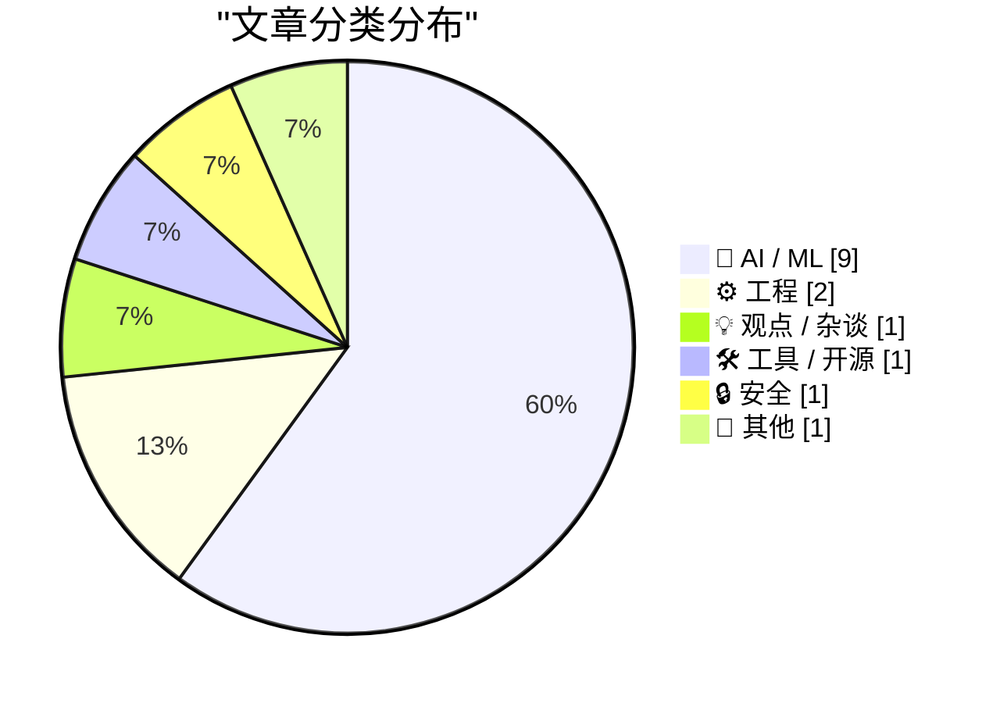
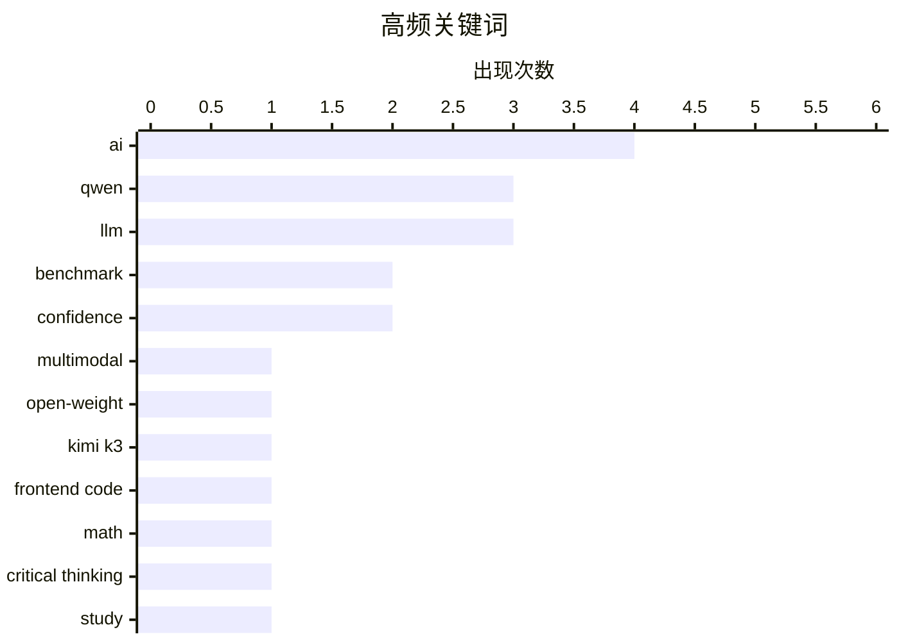

# 📰 AI 资讯每日精选 — 2026-07-20

> 汇聚 140+ 技术博客、X/Twitter、Hacker News、Reddit、Product Hunt、
> Lobste.rs、ClawFeed 日报及 GitHub Trending，经 AI 评分筛选。
>
> **本期内容**：🏆 今日必读 · 🌐 ClawFeed 日报 · 🔥 GitHub Trending · 📂 分类精选 · 🎨 设计与生成式 AI · 📊 数据概览

## 📝 今日看点

今日技术圈呈现两大核心趋势：一是国产大模型在特定领域实现突破，如阿里Qwen 3.8与月之暗面Kimi K3分别在多模态和前端代码上逼近或超越国际顶尖模型，但复杂推理与数学能力仍是明显短板；二是AI应用的“信任危机”持续发酵，多项研究揭示AI在医疗诊断、文本检测等场景中“自信犯错”的认知偏差，以及企业盲目跟风AI导致决策质量下降的行业乱象。与此同时，低成本硬件替代与个人硬件创业的成功案例，则展示了技术民主化浪潮下“小而美”的工程实践正在重塑传统行业。

---

## 🏆 今日必读

🥇 **阿里巴巴通义千问发布开源权重模型Qwen 3.8，称其性能仅次于Fable 5**

[Alibaba's Qwen takes on Kimi K3 with open-weight Qwen 3.8, says model is "second only to Fable 5"](https://the-decoder.com/alibabas-qwen-takes-on-kimi-k3-with-open-weight-qwen-3-8-says-model-is-second-only-to-fable-5/) — The Decoder · 15 小时前 · 🤖 AI / ML

> 阿里巴巴发布了Qwen 3.8，一个拥有2.4万亿参数的多模态AI模型。Qwen团队声称该模型性能可与领先模型媲美，仅落后于Fable 5。目前该模型已提供预览版。

💡 **为什么值得读**: 这是对阿里巴巴最新开源大模型Qwen 3.8的首次报道，直接点明了其参数规模、性能定位和开源策略，对于关注大模型竞争格局的读者极具价值。

🏷️ Qwen, multimodal, open-weight, LLM

🥈 **月之暗面Kimi K3在前端代码上超越Fable 5，但在复杂数学上大幅落后**

[Moonshot's Kimi K3 outperforms Fable 5 in frontend code but lags far behind in complex math](https://the-decoder.com/moonshots-kimi-k3-outperforms-fable-5-in-frontend-code-but-lags-far-behind-in-complex-math/) — The Decoder · 17 小时前 · 🤖 AI / ML

> 月之暗面的Kimi K3成为首个登顶Code Arena前端排行榜的中国模型，大幅领先Claude Fable 5和GPT-5.6 Sol。然而在高级数学推理上差距悬殊：Kimi K3在FrontierMath Tier 4上仅得约39%，而OpenAI和Anthropic的模型得分接近90%。

💡 **为什么值得读**: 文章揭示了Kimi K3在特定领域（前端代码）的突破性优势和在核心推理能力上的明显短板，为评估国产大模型的实际能力提供了关键对比数据。

🏷️ Kimi K3, frontend code, math, benchmark

🥉 **研究：AI建议让人更不准确但更自信**

[AI advice made people less accurate but more confident – sudy](https://thenextweb.com/news/ai-advice-suppresses-critical-thinking-wrong-answers-study) — Hacker News Best · 5 小时前 · 🤖 AI / ML

> 一项新研究表明，依赖AI建议会抑制用户的批判性思维。即使AI给出错误答案，用户也会变得更自信，但实际准确性反而下降。这揭示了AI辅助决策中一个危险的认知偏差。

💡 **为什么值得读**: 该研究直击AI辅助决策的核心风险——过度自信与准确性下降并存，对于任何在工作中使用AI工具的人都具有警示意义。

🏷️ AI, critical thinking, confidence, study

4️⃣ **AI狂热正在摧毁全球决策能力**

[AI Mania Is Eviscerating Global Decision-Making](https://simonwillison.net/2026/Jul/19/ai-mania/#atom-everything) — simonwillison.net · 22 小时前 · 💡 观点 / 杂谈

> Nik Suresh从咨询顾问的视角，用大量匿名爆料描述了AI狂热如何冲击大型企业的决策流程。文章指出，许多高管甚至从未使用过ChatGPT，却盲目推动AI项目，导致决策质量下降。

💡 **为什么值得读**: 文章以辛辣的匿名内幕和批判性视角，揭示了当前AI热潮中企业决策的荒诞现实，适合对AI泡沫持怀疑态度的读者。

🏷️ AI, decision-making, consulting, critique

5️⃣ **谷歌DeepMind：视频生成器已包含计算机视觉缺失的世界模型**

[Google Deepmind argues video generators already contain the world models computer vision has been missing](https://the-decoder.com/google-deepmind-argues-video-generators-already-contain-the-world-models-computer-vision-has-been-missing/) — The Decoder · 16 小时前 · 🤖 AI / ML

> 谷歌DeepMind的GenCeption方法将视频生成器重新用于深度估计、分割等经典视觉任务，仅用远少于传统方法的训练数据就达到了最先进水平。该模型几乎完全在合成视频上训练。其结果加剧了关于视频生成器是否已内嵌通用世界模型的争论。

💡 **为什么值得读**: 该研究挑战了计算机视觉的传统范式，提出视频生成器本身可能就是缺失的“世界模型”，对AI基础研究具有颠覆性意义。

🏷️ video generation, world model, computer vision, DeepMind

---

## 🌐 ClawFeed 日报精选

> 来源：[ClawFeed](https://clawfeed.kevinhe.io) — AI 驱动的多源新闻聚合

# ClawFeed 日报 | 2026-07-19 (Saturday)

> 聚合 6 期 4h digest (#875, #877, #878, #879, #880, #881)，覆盖 00:00-23:59 SGT。

---

## 🔥 当日全场最重要 5 条

1. **Kimi K3 正式发布** — Moonshot AI 发布 2.8 万亿参数模型，百万级上下文，原生多模态。Delta Attention 百万 token 解码加速 6.3x，Attention Residuals 训练效率提升 ~25%（额外开销 <2%）。杨植麟同步发布"如何从头构建前沿模型"masterclass，透明度罕见。260K+ 阅读。
   - 来源: https://x.com/cgtwts/status/2078271715155853331

2. **杨植麟 90 分钟 workshop 直击 Agent 路线之争** — "Claude 没赢在推理——他们赌在 agent 上，但跳过了最关键的一层：最好的 agent 需要最好的基座模型。" 472K 阅读，定义了当日 agent vs 基座模型的核心辩论。
   - 来源: https://x.com/0xCodila/status/2078545384587080105

3. **王煜全（海银资本）AI 投资前瞻** — "2029 年 AI 泡沫将破灭，2030 年遍地是黄金"。投资人中少见的直言派，提问和回答水平超一流。406K 阅读。
   - 来源: https://x.com/0xKevin00/status/2078466405369102834

4. **Boris Cherny（Claude Code 创造者）AI 采纳四阶段模型** — 多数公司卡在"一个人 10x 但全组没跟上"的阶段。1.1M views，痛点普遍引发共鸣。
   - 来源: https://x.com/bcherny/status/2077929379661844559

5. **Sebastian Raschka 长文 "Controlling Reasoning Effort in LLMs"** — 系统讲解 LLM 推理力度控制：inference-time 与 training-time 两个维度如何实现 low/medium/high 三档。直接关联 Claude thinking budget、DeepSeek reasoning token 等前沿工程实践。
   - 来源: https://x.com/dongxi_nlp/status/2078472633096585538

---

## 📰 当日核心主题

### 1. Kimi K3 发布生态（全天主线，6 期均覆盖）
- 2.8T 参数 / 百万上下文 / 原生多模态的技术规格
- 杨植麟 GTC 2026 演讲：重做 Transformer 三大基石（Adam / Attention / Residual Connection），全部开源
- Agent swarm + long context 工程化路径 vs Anthropic sub-agent 架构
- 杨新宇（月之暗面新成员）总结同行四大通病（傲慢/浮躁），321K 阅读

### 2. AI 采纳成熟度（Boris Cherny + mardehaym）
- Cherny 四阶段模型：个人 10x → 组织系统性采纳
- mardehaym AI-Native 工程五阶段：多数团队仍在零
- LimestoneHQ 完整 AI 转型方法论（非巨头公司适用）

### 3. LLM 推理强度控制（Raschka）
- 推理时切换 effort level + 训练时教模型"省着想"
- 直接关联 Claude extended thinking / budget tokens

### 4. AI 投资周期判断（王煜全）
- 2029 泡沫破灭 / 2030 黄金期的周期预测
- 科技投资前瞻的稀缺理性声音

### 5. 开源项目加速
- AI Agent Book（@bojie_li）一天翻倍至 2.6k stars，用 Claude Code + Kimi K3 + Opus 4.8 补全实验代码
- Archify（@t20000622yy）4.7k stars 上 GitHub Trending，Claude/Codex/opencode 上下文管理工具

---

## 🔖 Bookmarks 精选

本日无新增 bookmark，以下为持续在列：

- **@mardehaym** - "The Five Stages of AI-Native Engineering" — 188K views
  https://x.com/mardehaym/status/2070557674966573570
- **@LimestoneHQ** - "How to Make a Company AI-Native" — 104K views
  https://x.com/LimestoneHQ/status/2074483555510448582

---

## 👀 推荐关注汇总

- **@_LuoFuli** (Fuli Luo) — 前 DeepSeek 研究员，现小米 MiMo 核心成员。67.9K followers，底层模型研发一手信息源。https://x.com/_LuoFuli
- **@runinfrai** (RunInfra, YC F26) — 自动优化推理平台，inference infra 赛道早期项目。6.7K followers。https://x.com/runinfrai

⚠️ 未通过浏览器逐一核实是否已关注，操作前请先搜索 Following 避免重复。

---

## 💤 当日重复噪音模式

- **Kimi K3 跨窗口重复传播**：同一批推文（杨植麟演讲、K3 规格、杨新宇观点）在 #875→#881 六期中反复出现，属于大事件的自然衰减传播，非 spam。
- **Bookmarks 全天未刷新**：mardehaym + LimestoneHQ 两条贯穿 6 期，无新增。
- **凌晨窗口空转**（#878, 00:00-03:59 SGT）：周六凌晨 feed 零新增，全为缓存内容。
- **跨期重复标注**：#877/#878/#879/#880 中对同一推文的重复收录均已用 [续] 标记，去重有效。

---

*聚合自 digest #875, #877, #878, #879, #880, #881 | 生成时间: 2026-07-19 23:55 SGT*---

## 🔥 GitHub Trending

> 今日热门开源项目（全语言 + Python）

| # | 项目 | 描述 | ⭐ 总星 | 📈 今日 | 语言 |
|---|------|------|---------|---------|------|
| 1 | [bojieli/ai-agent-book](https://github.com/bojieli/ai-agent-book) 🤖 | 《深入理解 AI Agent：设计原理与工程实践》（李博杰 著）开源主仓库：全书正文、编译版 PDF 与按章配套代码 | 6.3k | +1734 | Python |
| 2 | [Robbyant/lingbot-map](https://github.com/Robbyant/lingbot-map) | A feed-forward 3D foundation model for reconstructing sce... | 13.7k | +865 | Python |
| 3 | [codecrafters-io/build-your-own-x](https://github.com/codecrafters-io/build-your-own-x) | Master programming by recreating your favorite technologi... | 529.0k | +754 | Markdown |
| 4 | [tirth8205/code-review-graph](https://github.com/tirth8205/code-review-graph) 🤖 | Local-first code intelligence graph for MCP and CLI. Buil... | 21.5k | +663 | Python |
| 5 | [jamiepine/voicebox](https://github.com/jamiepine/voicebox) 🤖 | The open-source AI voice studio. Clone, dictate, create. | 43.5k | +610 | TypeScript |
| 6 | [KnockOutEZ/wigolo](https://github.com/KnockOutEZ/wigolo) 🤖 | The go-to web for your AI coding agent — local-first sear... | 1.9k | +595 | TypeScript |
| 7 | [rohitg00/ai-engineering-from-scratch](https://github.com/rohitg00/ai-engineering-from-scratch) 🤖 | Learn it. Build it. Ship it for others. | 39.8k | +501 | Python |
| 8 | [PostHog/posthog](https://github.com/PostHog/posthog) 🤖 | 🦔 PostHog is the leading platform for building self-driv... | 37.0k | +411 | Python |
| 9 | [MoonshotAI/kimi-cli](https://github.com/MoonshotAI/kimi-cli) 🤖 | Kimi Code CLI is your next CLI agent. | 9.9k | +410 | Python |
| 10 | [kvcache-ai/ktransformers](https://github.com/kvcache-ai/ktransformers) 🤖 | A Flexible Framework for Experiencing Heterogeneous LLM I... | 18.4k | +360 | Python |
| 11 | [lyogavin/airllm](https://github.com/lyogavin/airllm) | AirLLM 70B inference with single 4GB GPU | 23.7k | +358 | Jupyter Notebook |
| 12 | [topoteretes/cognee](https://github.com/topoteretes/cognee) 🤖 | Cognee is the open-source AI memory platform for agents. ... | 28.5k | +303 | Python |
| 13 | [HKUDS/DeepTutor](https://github.com/HKUDS/DeepTutor) | DeepTutor: Lifelong Personalized Tutoring. https://deeptu... | 28.0k | +269 | Python |
| 14 | [1jehuang/jcode](https://github.com/1jehuang/jcode) 🤖 | Coding Agent Harness | 9.0k | +235 | Rust |
| 15 | [Comfy-Org/ComfyUI](https://github.com/Comfy-Org/ComfyUI) 🤖 | The most powerful and modular diffusion model GUI, api an... | 121.5k | +138 | Python |

---

## 🤖 AI / ML

### 1. 阿里巴巴通义千问发布开源权重模型Qwen 3.8，称其性能仅次于Fable 5

[Alibaba's Qwen takes on Kimi K3 with open-weight Qwen 3.8, says model is "second only to Fable 5"](https://the-decoder.com/alibabas-qwen-takes-on-kimi-k3-with-open-weight-qwen-3-8-says-model-is-second-only-to-fable-5/) — **The Decoder** · 15 小时前 · ⭐ 26/30

> 阿里巴巴发布了Qwen 3.8，一个拥有2.4万亿参数的多模态AI模型。Qwen团队声称该模型性能可与领先模型媲美，仅落后于Fable 5。目前该模型已提供预览版。

🏷️ Qwen, multimodal, open-weight, LLM

---

### 2. 月之暗面Kimi K3在前端代码上超越Fable 5，但在复杂数学上大幅落后

[Moonshot's Kimi K3 outperforms Fable 5 in frontend code but lags far behind in complex math](https://the-decoder.com/moonshots-kimi-k3-outperforms-fable-5-in-frontend-code-but-lags-far-behind-in-complex-math/) — **The Decoder** · 17 小时前 · ⭐ 26/30

> 月之暗面的Kimi K3成为首个登顶Code Arena前端排行榜的中国模型，大幅领先Claude Fable 5和GPT-5.6 Sol。然而在高级数学推理上差距悬殊：Kimi K3在FrontierMath Tier 4上仅得约39%，而OpenAI和Anthropic的模型得分接近90%。

🏷️ Kimi K3, frontend code, math, benchmark

---

### 3. 研究：AI建议让人更不准确但更自信

[AI advice made people less accurate but more confident – sudy](https://thenextweb.com/news/ai-advice-suppresses-critical-thinking-wrong-answers-study) — **Hacker News Best** · 5 小时前 · ⭐ 26/30

> 一项新研究表明，依赖AI建议会抑制用户的批判性思维。即使AI给出错误答案，用户也会变得更自信，但实际准确性反而下降。这揭示了AI辅助决策中一个危险的认知偏差。

🏷️ AI, critical thinking, confidence, study

---

### 4. 谷歌DeepMind：视频生成器已包含计算机视觉缺失的世界模型

[Google Deepmind argues video generators already contain the world models computer vision has been missing](https://the-decoder.com/google-deepmind-argues-video-generators-already-contain-the-world-models-computer-vision-has-been-missing/) — **The Decoder** · 16 小时前 · ⭐ 25/30

> 谷歌DeepMind的GenCeption方法将视频生成器重新用于深度估计、分割等经典视觉任务，仅用远少于传统方法的训练数据就达到了最先进水平。该模型几乎完全在合成视频上训练。其结果加剧了关于视频生成器是否已内嵌通用世界模型的争论。

🏷️ video generation, world model, computer vision, DeepMind

---

### 5. AI文本检测器在模型模仿作者风格时失效

[AI text detectors struggle when language models mimic an author's style](https://the-decoder.com/ai-text-detectors-struggle-when-language-models-mimic-an-authors-style/) — **The Decoder** · 18 小时前 · ⭐ 25/30

> Epoch AI使用风格模仿文本测试了三款主流AI检测器（Pangram、GPTZero、Originality.ai）。结果显示，高达18%的AI生成段落未被检测出。在科学写作领域，漏检率更是攀升至48%，而这正是检测器最可能被实际应用的场景。

🏷️ AI detection, style imitation, scientific writing, accuracy

---

### 6. AI聊天机器人读X光片：即使出错也极度自信，非常危险

[AI chatbots reading X-rays can be dangerously confident even when they're wrong](https://the-decoder.com/ai-chatbots-reading-x-rays-can-be-dangerously-confident-even-when-theyre-wrong/) — **The Decoder** · 19 小时前 · ⭐ 24/30

> RadLE 2.0基准测试评估了AI模型在放射学中判断何时应交给人类诊断的能力。结果显示，许多模型在给出错误结论时仍充满自信，而人类放射科医生的表现仍遥遥领先。结论是：AI在独立诊断前，必须先学会何时该保持沉默。

🏷️ AI, radiology, benchmark, confidence

---

### 7. Qwen 3.8 Max 预览版定价方案

[Qwen 3.8 Max Preview](https://www.qwencloud.com/pricing/token-plan) — **Hacker News Best** · 18 小时前 · ⭐ 24/30

> 阿里云发布了Qwen 3.8 Max预览版，并公布了其Token计费计划。该模型是Qwen系列的最新旗舰版本，旨在提供更强的推理和生成能力。定价方案可能涉及按Token计费或订阅制，具体细节需参考官方页面。该预览版允许用户提前体验模型性能，并为正式商用定价提供参考。

🏷️ Qwen, LLM, preview, pricing

---

### 8. Qwen 3.8 发布

[Qwen 3.8](https://twitter.com/Alibaba_Qwen/status/2078759124914098291) — **Hacker News Best** · 18 小时前 · ⭐ 24/30

> 阿里云通过官方推特宣布发布Qwen 3.8模型，并同步公开了其Token计费方案。该模型在性能上相比前代有显著提升，尤其在多语言理解和代码生成方面。定价页面显示了不同使用量下的费用结构，旨在为开发者和企业提供灵活的接入选择。此次发布引发了Hacker News社区的热烈讨论，共获得793个点赞和558条评论。

🏷️ Qwen, LLM, release, model

---

### 9. OpenAI 将 Codex 模型上下文大小从 372k 缩减至 272k

[OpenAI reduces Codex Model Context Size from 372k to 272k](https://github.com/openai/codex/pull/33972/files) — **Hacker News Best** · 19 小时前 · ⭐ 24/30

> OpenAI在Codex模型的Pull Request中，将上下文窗口大小从372,000个Token缩减至272,000个Token，减少了约27%。这一改动可能旨在降低推理成本或提升响应速度，但同时也限制了单次可处理的代码量。该PR引发了社区对模型效率与功能取舍的讨论，共获得321个点赞和151条评论。

🏷️ OpenAI, Codex, context window, model optimization

---

## ⚙️ 工程

### 10. Show HN：我用1600美元的ESP32替换了12万美元的保龄球中心系统

[Show HN: I replaced a $120k bowling center system with $1,600 in ESP32s](https://news.ycombinator.com/item?id=48968606) — **Hacker News Best** · 12 小时前 · ⭐ 24/30

> 一位SRE工程师分享了他如何用1600美元的ESP32微控制器，替换掉废弃保龄球中心原本价值12万美元的计分与控制系统。文章详细描述了在设备老旧、屋顶漏雨、电力不稳的极端条件下，如何用低成本硬件和软件工程思维重建整个系统。

🏷️ ESP32, SRE, bowling, DIY

---

### 11. 卖掉2500台MIDI录音机后我学到的事：硬件其实没那么难

[What I learned selling 2,500 MIDI recorders: Hardware is not so hard](https://chipweinberger.com/articles/20260719-hardware-is-not-so-hard) — **Hacker News Best** · 16 小时前 · ⭐ 24/30

> 作者分享了从零开始设计、制造并成功销售2500台MIDI录音机的完整经历。核心观点是：硬件创业的门槛被高估了，通过现代工具和供应链，个人开发者完全可以完成从原型到量产的全过程。

🏷️ hardware, MIDI, entrepreneurship, lessons

---

## 💡 观点 / 杂谈

### 12. AI狂热正在摧毁全球决策能力

[AI Mania Is Eviscerating Global Decision-Making](https://simonwillison.net/2026/Jul/19/ai-mania/#atom-everything) — **simonwillison.net** · 22 小时前 · ⭐ 25/30

> Nik Suresh从咨询顾问的视角，用大量匿名爆料描述了AI狂热如何冲击大型企业的决策流程。文章指出，许多高管甚至从未使用过ChatGPT，却盲目推动AI项目，导致决策质量下降。

🏷️ AI, decision-making, consulting, critique

---

## 🛠 工具 / 开源

### 13. Claude Code现在使用Rust编写的Bun运行时

[Claude Code uses Bun written in Rust now](https://simonwillison.net/2026/Jul/19/claude-code-in-bun-in-rust/) — **Hacker News Best** · 17 小时前 · ⭐ 24/30

> Anthropic的Claude Code工具已将其底层JavaScript运行时从Node.js切换为Bun，而Bun本身是用Rust语言编写的。这一变更旨在提升性能和启动速度，引发了社区关于技术栈选型和性能优化的广泛讨论。

🏷️ Claude Code, Bun, Rust, AI

---

## 🔒 安全

### 14. 9to5Mac 揭露巴西 App Store 中存在数十款伪装赌博应用

[9to5Mac Uncovers Dozens of Disguised Gambling Apps on the App Store in Brazil](https://9to5mac.com/2026/07/17/investigation-reveals-dozens-of-disguised-gambling-apps-on-the-app-store-in-brazil/) — **daringfireball.net** · 9 小时前 · ⭐ 22/30

> 9to5Mac的一项调查发现，巴西App Store的导航、旅行和天气等分类排行榜中，出现了大量低质量游戏，这些游戏使用AI生成的动物图标作为伪装。实际上，这些是“夹克应用”（jacket apps），背后隐藏着赌博和投注功能。调查已识别出超过60款此类应用，它们通过虚假描述通过审核，并利用排行榜操纵手段获取曝光。

🏷️ App Store, gambling, fraud, iOS

---

## 📝 其他

### 15. 最后一项 MPEG-4 Visual 专利已过期

[The Last MPEG-4 Visual Patent Has Expired](https://www.phoronix.com/news/Last-MPEG-4-Patent-Expired) — **Hacker News Best** · 10 小时前 · ⭐ 22/30

> Phoronix报道，最后一项与MPEG-4 Visual（即DivX/Xvid等使用的编码标准）相关的专利已正式到期。这意味着该视频编码格式在全球范围内完全进入公共领域，任何个人或企业均可自由使用而无需支付许可费。这一事件对开源视频编解码器、老旧视频存档以及依赖该格式的软件项目具有里程碑意义。

🏷️ MPEG-4, patent, expiration

---

## 🎨 Design & Generative AI

### 🖼️ 生成式图片

- **[JLC Flux2 ControlNet v1.0.0 发布：多 ControlNet、参考图、缓存与实验性内外补画](https://www.reddit.com/r/comfyui/comments/1v11k1x/i_released_jlc_flux2_controlnet_v100_for_comfyui/)** — r/comfyui · 6 小时前
  > 为 ComfyUI 推出的非递归多 ControlNet 插件，支持参考图像、缓存加速及实验性内外补画功能。

- **[ComfyUI 模型文件夹清理工具：告别重复与神秘文件](https://www.reddit.com/r/comfyui/comments/1v0rrs7/my_comfyui_models_folder_became_a_landfill_of/)** — r/comfyui · 12 小时前
  > 针对 ComfyUI 模型文件夹中重复下载和命名混乱问题，作者开发了免费清理工具。

- **[AMD 用户投票：ComfyUI 中哪个注意力后端最快最稳？](https://www.reddit.com/r/comfyui/comments/1v177ge/amd_which_attention_backend_do_you_prefer/)** — r/comfyui · 2 小时前
  > 针对 AMD RDNA4 显卡，社区讨论 SDPA、Flash Attention 与 Sage Attention 的性能与稳定性。

- **[ComfyUI 动态提示：一次运行生成所有 {a|b|c} 组合](https://www.reddit.com/r/comfyui/comments/1v0xhzv/comfyui_dynamic_prompts_generate_all_abc/)** — r/comfyui · 9 小时前
  > 从 Forge/A1111 迁移至 ComfyUI 后，利用动态提示节点实现组合提示词批量生成。

- **[Krea-2 Raw + Turbo LoRA + 真实感 LoRA：ComfyUI 中实现相机级皮肤质感](https://www.reddit.com/r/comfyui/comments/1v11qzy/krea2_raw_turbo_lora_realism_lora_finally_getting/)** — r/comfyui · 6 小时前
  > 通过组合 Krea-2 Raw、Turbo LoRA 和真实感 LoRA，在 ComfyUI 中获得接近真实相机的皮肤效果。

- **[从 FP8 模型切换至 INT8 Convrot 后输出异常](https://www.reddit.com/r/comfyui/comments/1v0zt4d/changed_from_fp8_model_to_int8_convrot_getting/)** — r/comfyui · 7 小时前
  > 用户升级 torch 后从 FP8 模型改为 INT8 Convrot，导致输出结果出现异常。

- **[ROCm 7.14.0 性能显著提升](https://www.reddit.com/r/comfyui/comments/1v0u1bx/rocm_7140_is_fast/)** — r/comfyui · 11 小时前
  > AMD ROCm 7.14.0 版本在 ComfyUI 上运行速度明显加快。

- **[Krea 2 通配符样式工作流：让风格在 ComfyUI 中生效](https://www.reddit.com/r/comfyui/comments/1v0n7w0/krea_2_wildcards_styles_workflow/)** — r/comfyui · 16 小时前
  > 提供工作流，使 Krea 2 的样式在 ComfyUI 中正常使用。

- **[动态 VRAM 问题何时修复？系统内存不再参与缓存](https://www.reddit.com/r/comfyui/comments/1v167ix/why_cant_we_get_a_fix_for_dynamic_vram/)** — r/comfyui · 2 小时前
  > 用户抱怨动态 VRAM 功能失效，系统内存不再缓存模型，每次运行都从磁盘重新加载。

- **[离开一段时间后回归：Flux Klein 之外还有更好的图像生成工具吗？](https://www.reddit.com/r/comfyui/comments/1v0vusb/ive_been_away_for_a_while_i_use_flux_klein_for/)** — r/comfyui · 10 小时前
  > 用户询问近期是否有比 Flux Klein 更优秀的图像生成或编辑工具发布。

- **[ComfyUI 控件过长问题：如何修复？](https://www.reddit.com/r/comfyui/comments/1v0ji57/not_sure_if_this_is_a_common_issue_but_is_there_a/)** — r/comfyui · 20 小时前
  > 用户遇到 ComfyUI 界面控件过长的问题，寻求解决方案。

### 🌍 世界模型 / 3D

- **[DeepMind：视频生成器已隐含世界模型，可替代传统视觉任务](https://the-decoder.com/google-deepmind-argues-video-generators-already-contain-the-world-models-computer-vision-has-been-missing/)** — The Decoder · 16 小时前
  > Google DeepMind 的 GenCeption 方法利用视频生成器完成深度估计和分割等视觉任务，训练数据更少但性能媲美现有系统。

### 🎬 生成式视频

- **[Wan 2.2 Animate 实现机器人舞者动作迁移：四窗口无缝衔接](https://www.reddit.com/r/comfyui/comments/1v0vozi/robot_dancer_motion_transfer_with_wan_22_animate/)** — r/comfyui · 10 小时前
  > 通过 Wan 2.2 Animate 工作流，在四个上下文窗口间实现无可见接缝的机器人舞者动作迁移。

- **[LTX-2.3 跨视角提示 LoRA 测试：8GB VRAM 即可运行](https://www.reddit.com/r/comfyui/comments/1v0i197/ltx23_crossview_prompt_lora_test_8gb_vram/)** — r/comfyui · 21 小时前
  > 在 8GB 显存下测试 LTX-2.3 的跨视角提示 LoRA，生成不同场景效果。

- **[求 Wan2.2 I2V 视频链式生成工作流](https://www.reddit.com/r/comfyui/comments/1v0m2ec/anyone_has_some_decent_wan22_i2v_workflow_for/)** — r/comfyui · 17 小时前
  > 用户寻求适用于 Wan2.2 图生视频的链式工作流，以生成连续视频片段。

---

## 📊 数据概览

| 扫描源 | 抓取文章 | 时间范围 | 精选 |
|:---:|:---:|:---:|:---:|
| 93/140 | 3848 篇 → 65 篇 | 24h | **15 篇** |

### 分类分布



### 高频关键词



<details>
<summary>📈 纯文本关键词图（终端友好）</summary>

```
ai            │ ████████████████████ 4
qwen          │ ███████████████░░░░░ 3
llm           │ ███████████████░░░░░ 3
benchmark     │ ██████████░░░░░░░░░░ 2
confidence    │ ██████████░░░░░░░░░░ 2
multimodal    │ █████░░░░░░░░░░░░░░░ 1
open-weight   │ █████░░░░░░░░░░░░░░░ 1
kimi k3       │ █████░░░░░░░░░░░░░░░ 1
frontend code │ █████░░░░░░░░░░░░░░░ 1
math          │ █████░░░░░░░░░░░░░░░ 1
```

</details>

### 🏷️ 话题标签

**ai**(4) · **qwen**(3) · **llm**(3) · benchmark(2) · confidence(2) · multimodal(1) · open-weight(1) · kimi k3(1) · frontend code(1) · math(1) · critical thinking(1) · study(1) · decision-making(1) · consulting(1) · critique(1) · video generation(1) · world model(1) · computer vision(1) · deepmind(1) · ai detection(1)

---

*生成于 2026-07-20 03:13 | 汇聚 140 个技术博客、X/Twitter、Hacker News、Reddit、Product Hunt、Lobste.rs、ClawFeed 日报及 GitHub Trending，经 AI 评分筛选出 Top 15 精华内容*
