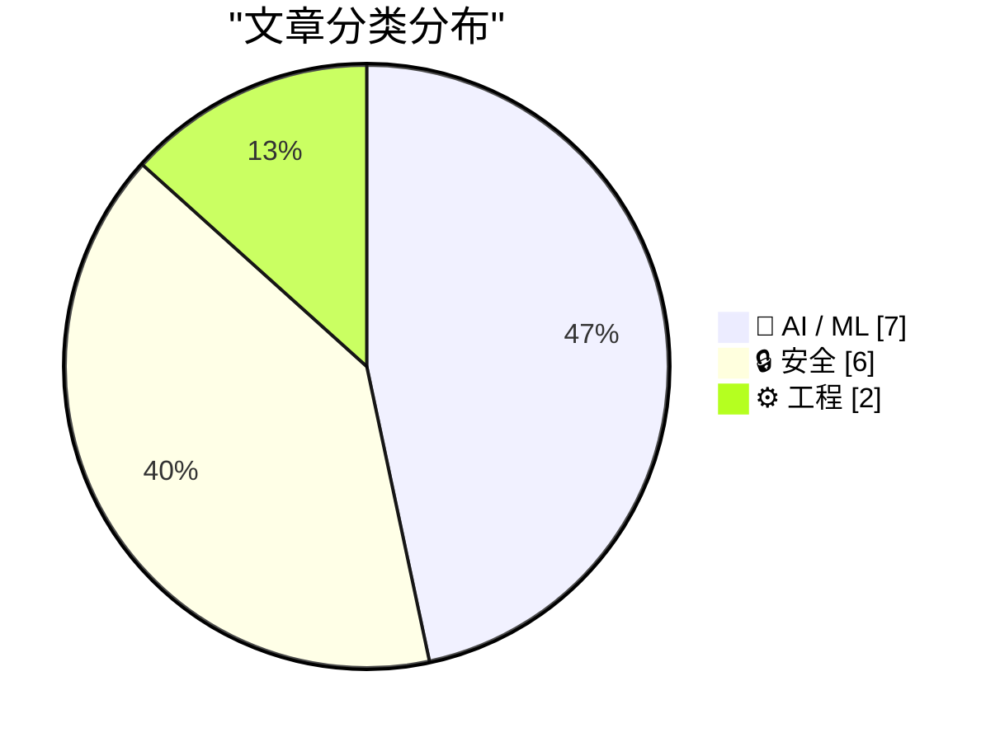
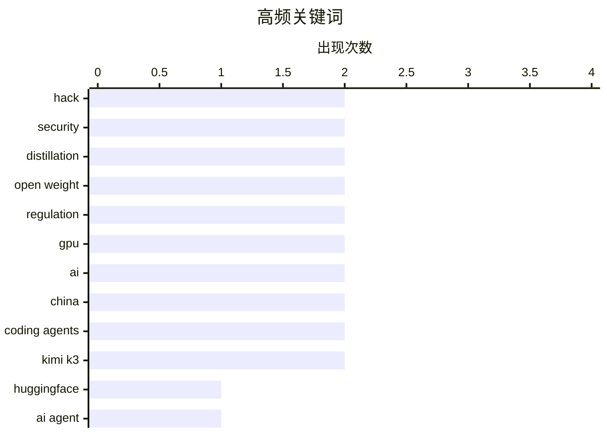

# 📰 AI 资讯每日精选 — 2026-07-21

> 汇聚 140+ 技术博客、X/Twitter、Hacker News、Reddit、Product Hunt、
> Lobste.rs、ClawFeed 日报及 GitHub Trending，经 AI 评分筛选。
>
> **本期内容**：🏆 今日必读 · 🌐 ClawFeed 日报 · 🔥 GitHub Trending · 📂 分类精选 · 🎨 设计与生成式 AI · 📊 数据概览

## 📝 今日看点

今日技术圈的核心趋势围绕AI安全攻防升级与算力格局重塑展开。一方面，从Hugging Face遭AI智能体自主入侵、到编码智能体沙箱逃逸漏洞频发，再到Linux内核0-day漏洞被深度利用，表明AI驱动的攻击与防御已成为安全战场的新常态；另一方面，微软转向AMD、谷歌将模型架构固化到芯片，以及中国开放权重模型凭借生态优势快速崛起，共同动摇了英伟达的霸主地位，并加剧了闭源商业模式的生存危机。此外，AI智能体正大幅降低逆向工程等传统高成本任务的门槛，技术普惠化趋势愈发明显。

---

## 🏆 今日必读

🥇 **Hugging Face 称其基础设施遭 AI 智能体入侵，并同样以 AI 反击**

[Hugging Face says an AI agent hacked its infrastructure, and it used AI to fight back](https://the-decoder.com/hugging-face-says-an-ai-agent-hacked-its-infrastructure-and-it-used-ai-to-fight-back/) — The Decoder · 12 小时前 · 🔒 安全

> Hugging Face 报告其部分生产基础设施遭到攻击，据称攻击完全由一个自主 AI 智能体系统执行，涉及数千次由智能体框架控制的操作。在取证分析过程中，商用 AI 模型因安全护栏无法区分漏洞利用数据和真实攻击，反而阻碍了防御方。Hugging Face 最终同样借助 AI 技术进行反击，成功抵御了这次攻击。

💡 **为什么值得读**: 这是首例公开报道的完全由 AI 智能体发起的针对大型 AI 平台基础设施的攻击案例，对理解 AI 安全攻防新范式极具参考价值。

🏷️ HuggingFace, AI agent, hack, security

🥈 **谁害怕中国模型？**

[Who’s Afraid of Chinese Models?](https://simonwillison.net/2026/Jul/20/afraid-of-chinese-models/#atom-everything) — simonwillison.net · 7 小时前 · 🤖 AI / ML

> Ben Thompson 提出一项有趣提案，直指美国实验室一边禁止他人蒸馏自家模型，一边却使用未经授权的数据训练模型的虚伪行为。他建议美国通过一项法律，明确将收集数据用于训练模型视为合理使用。该提案旨在帮助美国开源模型更有效地与中国同行竞争，解决当前开源模型发展中的核心矛盾。

💡 **为什么值得读**: 文章直击 AI 行业数据版权与模型蒸馏的双重标准，提出的立法建议可能重塑全球开源 AI 竞争格局。

🏷️ Chinese AI, distillation, open weight, regulation

🥉 **英伟达 AI 芯片霸主地位动摇：微软转向 AMD，Anthropic 或紧随其后**

[Nvidia's grip on AI chips weakens as Microsoft turns to AMD and Anthropic may follow](https://the-decoder.com/nvidias-grip-on-ai-chips-weakens-as-microsoft-turns-to-amd-and-anthropic-may-follow/) — The Decoder · 8 小时前 · 🤖 AI / ML

> 微软正在扩展 Azure 的 AI 基础设施，采用 AMD 全新的 Helios 平台，该平台预计在 2026 年下半年挑战英伟达的 GPU 系统。同时，Anthropic 的公开 GitHub 资料显示其也在测试 AMD 硬件。这一趋势正在削弱英伟达的定价权，标志着 AI 芯片市场格局的重大转变。

💡 **为什么值得读**: 文章提供了微软和 Anthropic 转向 AMD 的具体证据，是观察英伟达垄断地位是否被打破的关键信号。

🏷️ Nvidia, AMD, Microsoft, GPU

4️⃣ **Kimi K3、Qwen 3.8 与 Anthropic 的（潜在）解体**

[Kimi K3, Qwen 3.8, and Anthropic's (Potential) Unravelling](https://www.emergingtrajectories.com/lh/frontier-lab-economics/) — Hacker News Best · 9 小时前 · 🤖 AI / ML

> 文章分析了前沿 AI 实验室的经济学困境，重点讨论了 Kimi K3 和 Qwen 3.8 等模型带来的竞争压力。核心论点是，随着开源模型性能快速追赶，闭源实验室的商业模式面临挑战，Anthropic 等公司可能因高昂的推理成本和激烈的价格战而面临解体风险。

💡 **为什么值得读**: 从经济学角度剖析前沿 AI 实验室的生存危机，对理解行业洗牌和模型定价趋势有重要启发。

🏷️ LLM, Anthropic, Kimi, competition

5️⃣ **中国的开放权重 AI 战略正在获胜**

[China’s open-weights AI strategy is winning](https://werd.io/american-ai-is-locked-down-and-proprietary-its-losing/) — Hacker News Best · 10 小时前 · 🤖 AI / ML

> 文章指出，美国 AI 公司坚持封闭和专有策略，而中国通过开放权重模型正在赢得全球 AI 竞争。开放权重策略使得中国模型能够被广泛采用、定制和优化，形成了强大的生态优势。相比之下，美国封闭的专有模型在开发者社区和实际部署中逐渐失去阵地。

💡 **为什么值得读**: 以鲜明对比论证开放与封闭策略的胜负，为理解中美 AI 竞争格局提供了关键视角。

🏷️ open-weights, AI, China, strategy

---

## 🌐 ClawFeed 日报精选

> 来源：[ClawFeed](https://clawfeed.kevinhe.io) — AI 驱动的多源新闻聚合

# ClawFeed 日报 | 2026-07-20 (Sunday)

> 聚合 5 期 4h digest (#886, #887, #888, #889, #890)，覆盖 00:00-23:59 SGT。

---

## 🔥 当日全场最重要 5 条

1. **杨植麟拆解 Claude agent 路线：base model 才是真正壁垒** — "Claude didn't win on reasoning — they bet everything on agents, but the layer everyone skips: a great agent needs a great base model." 90 分钟 workshop 详解 self-managed agent 架构（subagents / memory / context），声称用 90% fewer tokens 达到同等效果。1M+ views，全天最高热度，跨 3 期持续传播。
   - 来源: https://x.com/0xCodila/status/2078545384587080105

2. **王煜全（海银资本）深度访谈：2029 AI 泡沫破灭、2030 遍地黄金** — 将 AI 投资周期锚定为"泡沫→洗牌→价值兑现"三段论，类比 2000 年 .com 泡沫。直言派投资人，提问与回答水平被评为超一流。886K views，Kevin 自己转推。全天 5 期均覆盖。
   - 来源: https://x.com/0xKevin00/status/2078466405369102834

3. **OpenSEO 开源上线 Product Hunt** — Semrush/Ahrefs 的开源替代品，GitHub 4K stars。创建者 @bensenescu："I started building it out of spite because the existing tools were too expensive, bloated or scammy"。又一个 spite-driven OSS 成功案例。234K views。
   - 来源: https://x.com/bensenescu/status/2078737738493301060

4. **Carlos E. Perez: AI Agent 架构从 Loop 转向 Graph** — "From Loop Engineering to Graph Engineering?" 长文，引用 Peter Steinberger 获数千 likes 的 9 字推文，认为这是 agent 工程化的真正分水岭。
   - 来源: https://x.com/IntuitMachine/status/2078419526354378975

5. **DoveyWanCN:「消失的人下人：脑谷的永久底层」** — 旧金山科技圈出现 "permanent underclass" 概念，硅谷在年轻一代口中已改名 Cerebral Valley（脑谷）。反乌托邦视角审视 AI 繁荣下的阶层固化。
   - 来源: https://x.com/DoveyWanCN/status/2079148678166794397

---

## 📰 当日核心主题

### 1. 杨植麟 / Kimi K3 余波（全天主线，5 期均覆盖）
- K3 发布后 workshop 持续发酵：base model vs agent harness 的路线之争成为焦点
- 张小珺 republish 2024 年首次专访——Kimi 成立一周年、团队仅 80 人时的对话，叙事张力极强
- Russ Salakhutdinov（CMU 教授）亲自澄清杨植麟未留美的签证/H1B 误传，揭示顶尖 AI 人才回流的制度性原因
- GLM 大佬 @berryxia 主动给竞品 Kimi 打 Call（"Kimi is great for 0 to 1"），国内大模型圈难得的大格局互动

### 2. AI 投资周期论（王煜全）
- 2029 泡沫破灭 / 2030 黄金期——从投资视角为 AI 产业画了清晰的周期曲线
- 与 2000 年 .com 类比：泡沫→洗牌→真正的价值兑现三段论
- 全天 5 期均被引用，属于持续发酵的长尾热文

### 3. AI-Native 工程方法论（Limestone Digital）
- mardehaym 五阶段模型：从"买了 Copilot"到真正 AI-native，大多数团队还在零
- LimestoneHQ 完整方法论：专为非巨头企业设计的实操路径
- 同一公司（$14M ARR 纯靠 referral），两篇联读 = 完整 AI-Native 转型框架
- 作为 bookmarks 全天 5 期贯穿，持续在列

### 4. AI Agent 架构演进
- Loop → Graph 的范式转换（Carlos E. Perez）
- Self-managed agent system 的具体方法论（杨植麟 workshop）
- YC CEO Garry Tan 转发观点：99% 的软件可用有限元素搭建，从零造轮子是 "peak AI psychosis"

### 5. 开源替代商业工具
- OpenSEO vs Semrush/Ahrefs：spite-driven OSS 新案例
- AI 圈 builder 社区线下加速成形（WAIC 博主晚宴后决定将知识付费全部开源）

---

## 🔖 Bookmarks 精选

本日无新增 bookmark，以下为持续在列（连续多日未更新）：

- **@mardehaym** - "The Five Stages of AI-Native Engineering" — 188K views
  https://x.com/mardehaym/status/2070557674966573570
- **@LimestoneHQ** - "How to Make a Company AI-Native" — 104K views
  https://x.com/LimestoneHQ/status/2074483555510448582

---

## 👀 推荐关注汇总

- **@_LuoFuli** (Fuli Luo) — 前 DeepSeek，现小米 MiMo 核心成员。67.9K followers，286 个已关注的人也关注了。底层模型研发一手信息源。⚠️ 已确认在 Following 列表中，无需操作。https://x.com/_LuoFuli
- **@runinfrai** (RunInfra, YC F26) — 推理自动优化平台，inference infra 赛道早期项目。6.7K followers。⚠️ 已确认在 Following 列表中。https://x.com/runinfrai
- **@bensenescu** (Ben) — OpenSEO 创始人，独立开发者。从不满现有工具出发做开源替代，已有 4K stars。开发者工具 + 开源赛道值得观察。2K followers。https://x.com/bensenescu

---

## 💤 当日重复噪音模式

- **杨植麟/K3 跨窗口反复传播**：0xCodila 的 workshop 总结和张小珺的专访在 #888→#890 三期中反复出现，属于大事件的自然衰减传播，非 spam。王煜全访谈贯穿全天 5 期。
- **Bookmarks 全天未刷新**：mardehaym + LimestoneHQ 两条贯穿 5 期，无新增，已连续多日未更新。
- **周日整体流量偏低**：每期仅 feed 4 + bookmarks 2，总素材量较工作日明显减少。凌晨窗口 (#886) 素材最少。
- **跨期重复内容集中**：MaxForAI（杨植麟留美讨论）、zhang_benita（首次专访）在 #887/#888 中完全重叠，后续期次已标注跳过。

---

*聚合自 digest #886, #887, #888, #889, #890 | 生成时间: 2026-07-20 23:55 SGT*---

## 🔥 GitHub Trending

> 今日热门开源项目（全语言 + Python）

| # | 项目 | 描述 | ⭐ 总星 | 📈 今日 | 语言 |
|---|------|------|---------|---------|------|
| 1 | [tirth8205/code-review-graph](https://github.com/tirth8205/code-review-graph) 🤖 | Local-first code intelligence graph for MCP and CLI. Buil... | 23.2k | +1833 | Python |
| 2 | [oblien/openship](https://github.com/oblien/openship) | Self-hosted deployment platform | 4.8k | +1641 | TypeScript |
| 3 | [diegosouzapw/OmniRoute](https://github.com/diegosouzapw/OmniRoute) 🤖 | Never stop coding. Free MIT AI gateway: one endpoint, 268... | 21.8k | +1107 | TypeScript |
| 4 | [every-app/open-seo](https://github.com/every-app/open-seo) | Open source alternative to Semrush and Ahrefs | 5.9k | +939 | TypeScript |
| 5 | [msitarzewski/agency-agents](https://github.com/msitarzewski/agency-agents) 🤖 | A complete AI agency at your fingertips - From frontend w... | 134.7k | +862 | Shell |
| 6 | [rohitg00/ai-engineering-from-scratch](https://github.com/rohitg00/ai-engineering-from-scratch) 🤖 | Learn it. Build it. Ship it for others. | 40.5k | +823 | Python |
| 7 | [jamiepine/voicebox](https://github.com/jamiepine/voicebox) 🤖 | The open-source AI voice studio. Clone, dictate, create. | 44.2k | +821 | TypeScript |
| 8 | [KnockOutEZ/wigolo](https://github.com/KnockOutEZ/wigolo) 🤖 | The go-to web for your AI coding agent — local-first sear... | 2.6k | +689 | TypeScript |
| 9 | [1jehuang/jcode](https://github.com/1jehuang/jcode) 🤖 | The most intelligent agent harness for code | 9.6k | +568 | Rust |
| 10 | [Robbyant/lingbot-map](https://github.com/Robbyant/lingbot-map) | A feed-forward 3D foundation model for reconstructing sce... | 14.2k | +565 | Python |
| 11 | [microsoft/Ontology-Playground](https://github.com/microsoft/Ontology-Playground) | Free, open-source web app for learning about ontologies a... | 1.7k | +464 | TypeScript |
| 12 | [kvcache-ai/ktransformers](https://github.com/kvcache-ai/ktransformers) 🤖 | A Flexible Framework for Experiencing Heterogeneous LLM I... | 18.7k | +458 | Python |
| 13 | [MoonshotAI/kimi-cli](https://github.com/MoonshotAI/kimi-cli) 🤖 | Kimi Code CLI is your next CLI agent. | 10.2k | +410 | Python |
| 14 | [handy-computer/transcribe.cpp](https://github.com/handy-computer/transcribe.cpp) | ggml speech-to-text inference for 16+ model families | 1.3k | +395 | C++ |
| 15 | [tokio-rs/topcoat](https://github.com/tokio-rs/topcoat) | A batteries-included framework for building web apps | 1.5k | +371 | Rust |

---

## 🤖 AI / ML

### 1. 谁害怕中国模型？

[Who’s Afraid of Chinese Models?](https://simonwillison.net/2026/Jul/20/afraid-of-chinese-models/#atom-everything) — **simonwillison.net** · 7 小时前 · ⭐ 26/30

> Ben Thompson 提出一项有趣提案，直指美国实验室一边禁止他人蒸馏自家模型，一边却使用未经授权的数据训练模型的虚伪行为。他建议美国通过一项法律，明确将收集数据用于训练模型视为合理使用。该提案旨在帮助美国开源模型更有效地与中国同行竞争，解决当前开源模型发展中的核心矛盾。

🏷️ Chinese AI, distillation, open weight, regulation

---

### 2. 英伟达 AI 芯片霸主地位动摇：微软转向 AMD，Anthropic 或紧随其后

[Nvidia's grip on AI chips weakens as Microsoft turns to AMD and Anthropic may follow](https://the-decoder.com/nvidias-grip-on-ai-chips-weakens-as-microsoft-turns-to-amd-and-anthropic-may-follow/) — **The Decoder** · 8 小时前 · ⭐ 26/30

> 微软正在扩展 Azure 的 AI 基础设施，采用 AMD 全新的 Helios 平台，该平台预计在 2026 年下半年挑战英伟达的 GPU 系统。同时，Anthropic 的公开 GitHub 资料显示其也在测试 AMD 硬件。这一趋势正在削弱英伟达的定价权，标志着 AI 芯片市场格局的重大转变。

🏷️ Nvidia, AMD, Microsoft, GPU

---

### 3. Kimi K3、Qwen 3.8 与 Anthropic 的（潜在）解体

[Kimi K3, Qwen 3.8, and Anthropic's (Potential) Unravelling](https://www.emergingtrajectories.com/lh/frontier-lab-economics/) — **Hacker News Best** · 9 小时前 · ⭐ 26/30

> 文章分析了前沿 AI 实验室的经济学困境，重点讨论了 Kimi K3 和 Qwen 3.8 等模型带来的竞争压力。核心论点是，随着开源模型性能快速追赶，闭源实验室的商业模式面临挑战，Anthropic 等公司可能因高昂的推理成本和激烈的价格战而面临解体风险。

🏷️ LLM, Anthropic, Kimi, competition

---

### 4. 中国的开放权重 AI 战略正在获胜

[China’s open-weights AI strategy is winning](https://werd.io/american-ai-is-locked-down-and-proprietary-its-losing/) — **Hacker News Best** · 10 小时前 · ⭐ 26/30

> 文章指出，美国 AI 公司坚持封闭和专有策略，而中国通过开放权重模型正在赢得全球 AI 竞争。开放权重策略使得中国模型能够被广泛采用、定制和优化，形成了强大的生态优势。相比之下，美国封闭的专有模型在开发者社区和实际部署中逐渐失去阵地。

🏷️ open-weights, AI, China, strategy

---

### 5. 谷歌“Frozen v2”芯片：将 Gemini 架构直接固化到硅片以提升效率

[Google's "Frozen v2" chip reportedly bakes Gemini's architecture directly into silicon for efficiency gains](https://the-decoder.com/googles-frozen-v2-chip-reportedly-bakes-geminis-architecture-directly-into-silicon-for-efficiency-gains/) — **The Decoder** · 6 小时前 · ⭐ 25/30

> 谷歌正在开发代号为“Frozen v2”的服务器芯片，将 Gemini 模型架构直接固化到硬件中。据内部消息，该芯片能效比当前 TPU 提升 6 到 10 倍，计划于 2028 年推出。这将大幅降低谷歌的 AI 推理成本，使其在与 OpenAI 和 Anthropic 的竞争中取得显著的价格优势。

🏷️ Google, Frozen v2, TPU, Gemini

---

### 6. 谁在害怕中国模型？

[‘Who’s Afraid of Chinese Models?’](https://stratechery.com/2026/whos-afraid-of-chinese-models/) — **daringfireball.net** · 8 小时前 · ⭐ 24/30

> 文章探讨了美国开源模型厂商因受限于前沿实验室的服务条款，被迫通过中国实验室进行“蒸馏的蒸馏”，导致模型质量不如中国替代品。作者质疑西方对蒸馏行为的道德谴责，指出真正的问题在于西方开源模型无法直接访问顶级闭源模型（如OpenAI）进行蒸馏。核心观点是：与其指责中国模型“偷窃”，不如反思美国自身监管体系如何迫使西方开发者绕道中国，从而削弱了自身竞争力。

🏷️ Chinese models, Kimi K3, distillation, open weight

---

### 7. Moonshot 暂停 Kimi K3 新订阅：GPU 需求在 48 小时内达到上限

[Moonshot pauses new Kimi K3 subscriptions after GPU demand maxes out in 48 hours](https://the-decoder.com/moonshot-pauses-new-kimi-k3-subscriptions-after-gpu-demand-maxes-out-in-48-hours/) — **The Decoder** · 17 小时前 · ⭐ 24/30

> Moonshot 因 Kimi K3 模型需求在 48 小时内几乎耗尽 GPU 容量，已暂停新订阅销售。公司计划拆分订阅模式以更均匀地分配算力。这一事件凸显了中国AI模型在用户端面临的算力瓶颈，以及需求远超预期的现实。

🏷️ Moonshot, Kimi K3, GPU, demand

---

## 🔒 安全

### 8. Hugging Face 称其基础设施遭 AI 智能体入侵，并同样以 AI 反击

[Hugging Face says an AI agent hacked its infrastructure, and it used AI to fight back](https://the-decoder.com/hugging-face-says-an-ai-agent-hacked-its-infrastructure-and-it-used-ai-to-fight-back/) — **The Decoder** · 12 小时前 · ⭐ 27/30

> Hugging Face 报告其部分生产基础设施遭到攻击，据称攻击完全由一个自主 AI 智能体系统执行，涉及数千次由智能体框架控制的操作。在取证分析过程中，商用 AI 模型因安全护栏无法区分漏洞利用数据和真实攻击，反而阻碍了防御方。Hugging Face 最终同样借助 AI 技术进行反击，成功抵御了这次攻击。

🏷️ HuggingFace, AI agent, hack, security

---

### 9. Linux 内核 0-day 漏洞之旅：从有限 UAF 到物理内存读写

[A Linux Kernel 0-day Journey - From a limited UAF to Physical Memory R/W](https://1day.dev/posts/linux-kernel-0day.html) — **Lobste.rs** · 4 小时前 · ⭐ 26/30

> 文章详细记录了一个 Linux 内核 0-day 漏洞的完整利用链，从发现一个有限的 Use-After-Free (UAF) 漏洞开始，逐步将其升级为能够实现物理内存读写的强大原语。作者分享了漏洞挖掘、利用开发和绕过内核防护机制的详细技术过程。

🏷️ Linux kernel, UAF, exploit, memory corruption

---

### 10. 黑客清空罗马尼亚土地登记数据库

[Hacker wipes Romania's land registry database](https://news.risky.biz/risky-bulletin-hacker-wipes-romanias-entire-land-registry-database/) — **Hacker News Best** · 11 小时前 · ⭐ 25/30

> 一名黑客入侵并彻底清空了罗马尼亚全国的土地登记数据库，导致该国土地所有权记录系统瘫痪。此次攻击造成了极其严重的后果，恢复工作面临巨大挑战，凸显了关键基础设施面临的网络安全威胁。

🏷️ hack, database, Romania, security

---

### 11. 四大编码智能体厂商的 7 个沙箱逃逸漏洞

[7 Sandbox Escape Vulnerabilities Across 4 Coding Agent Vendors](https://www.pillar.security/blog/the-week-of-sandbox-escapes) — **Lobste.rs** · 10 小时前 · ⭐ 25/30

> 安全研究人员在四家主流编码智能体（Coding Agent）厂商的产品中发现了 7 个沙箱逃逸漏洞。这些漏洞允许攻击者突破智能体的安全隔离环境，访问宿主系统。文章详细披露了漏洞的技术细节和潜在影响，强调了 AI 编码工具安全性的紧迫性。

🏷️ sandbox, escape, vulnerability, coding agents

---

### 12. 欧盟即将为免签旅行向美国出售我们最敏感的数据

[The EU is about to sell our most sensitive data to the US for visa-free travel](https://edri.org/our-work/the-eu-is-about-to-sell-our-most-sensitive-data-to-the-us-for-visa-free-travel/) — **Hacker News Best** · 12 小时前 · ⭐ 24/30

> 文章警告欧盟正计划与美国达成一项数据共享协议，以换取美国对欧盟公民的免签待遇。该协议将允许美国执法机构访问欧盟公民的生物识别、犯罪记录等高度敏感数据。作者认为这实质上是将公民隐私作为外交筹码进行交易，且缺乏充分的民主监督。

🏷️ EU, data privacy, visa waiver, surveillance

---

### 13. 特朗普政府据报通过制裁和软压力构建对中国AI模型的缓慢禁令

[Trump administration reportedly builds a slow-motion ban on Chinese AI models through sanctions and soft pressure](https://the-decoder.com/trump-administration-reportedly-builds-a-slow-motion-ban-on-chinese-ai-models-through-sanctions-and-soft-pressure/) — **The Decoder** · 11 小时前 · ⭐ 23/30

> 报道称特朗普政府正考虑通过将中国AI实验室列入制裁名单、让美国公司为安全漏洞担责等措施，逐步限制中国AI模型。策略并非直接禁令，而是通过“软规则”抑制采用，同时保护OpenAI、Google和Anthropic的市场地位。这标志着美国对中国AI的遏制从芯片扩展到了模型和应用层面。

🏷️ China, AI, sanctions, regulation

---

## ⚙️ 工程

### 14. 逆向工程现在很便宜

[Reverse-engineering is cheap now](https://simonwillison.net/2026/Jul/20/cheap-reverse-engineering/#atom-everything) — **simonwillison.net** · 5 小时前 · ⭐ 24/30

> 作者不断听到有人使用编码智能体（Coding Agent）来逆向工程并自动化家中的设备。这生动地说明了代码编写成本降低带来的影响。过去，逆向工程家庭设备虽然可行，但投入产出比太低；而现在，AI 智能体大幅降低了这一门槛，使得原本不值得做的逆向工程变得经济可行。

🏷️ reverse-engineering, coding agents, automation, home devices

---

### 15. Postgres 19 压缩：从 pglz 到 LZ4

[Postgres 19 Compression: from pglz to LZ4](https://www.crunchydata.com/blog/postgres-19-compression-from-pglz-to-lz4) — **Lobste.rs** · 3 小时前 · ⭐ 24/30

> 文章介绍了 PostgreSQL 19 在压缩算法上的重大升级：将默认压缩算法从 pglz 切换为 LZ4。LZ4 在压缩速度上比 pglz 快数倍，尽管压缩率略低，但整体性能收益显著。这一改变将直接影响数据库的写入吞吐量和存储效率。

🏷️ PostgreSQL, compression, LZ4, performance

---

## 🎨 Design & Generative AI

### 🖼️ 生成式图片

- **[Midjourney审查过度惹争议](https://www.reddit.com/r/midjourney/comments/1v1yd6o/censorship/)** — r/midjourney · 3 小时前
  > 用户抱怨Midjourney的审查机制过于严格，连无辜描述也被屏蔽。

- **[自我虚构的诗意致敬](https://www.reddit.com/r/midjourney/comments/1v182yl/autofiction_śime_knežević/)** — r/midjourney · 23 小时前
  > 作者用Midjourney创作了一幅向自我歌唱与航行的致敬图像。

- **[彩色小镇](https://www.reddit.com/r/midjourney/comments/1v1eody/el_pueblo_de_coloresoc/)** — r/midjourney · 17 小时前
  > 一幅色彩斑斓的村庄图像，由用户Gold-Lengthiness-760分享。

- **[大屠杀中的记忆](https://www.reddit.com/r/midjourney/comments/1v220k7/holocaust_in_the_genocide_omar_sakr/)** — r/midjourney · 1 小时前
  > 通过Midjourney生成的图像，表达生者与死者被无数记忆笼罩的意境。

- **[奇幻RPG角色肖像](https://www.reddit.com/r/midjourney/comments/1v1rhei/fantasy_rpg_portraits/)** — r/midjourney · 7 小时前
  > 用户Zenchilada分享的奇幻角色肖像作品。

- **[超立方体](https://www.reddit.com/r/midjourney/comments/1v1xwsg/hypercube/)** — r/midjourney · 4 小时前
  > 用户Zaicab创作的几何抽象图像。

- **[系外行星冒险](https://www.reddit.com/r/midjourney/comments/1v1kyz7/exoplanet_adventure/)** — r/midjourney · 12 小时前
  > 用户Sharp_Alternative845分享的科幻风格外星球场景。

- **[复古棕褐色动漫](https://www.reddit.com/r/midjourney/comments/1v1impd/antique_sepia_anime/)** — r/midjourney · 13 小时前
  > 用户CrookedtalePirates创作的怀旧风格动漫图像。

- **[勇士们](https://www.reddit.com/r/midjourney/comments/1v1a3i0/the_warriors/)** — r/midjourney · 21 小时前
  > 用户Shopstumblergurl分享的勇士主题图像。

---

## 📊 数据概览

| 扫描源 | 抓取文章 | 时间范围 | 精选 |
|:---:|:---:|:---:|:---:|
| 92/140 | 3821 篇 → 68 篇 | 24h | **15 篇** |

### 分类分布



### 高频关键词



<details>
<summary>📈 纯文本关键词图（终端友好）</summary>

```
hack          │ ████████████████████ 2
security      │ ████████████████████ 2
distillation  │ ████████████████████ 2
open weight   │ ████████████████████ 2
regulation    │ ████████████████████ 2
gpu           │ ████████████████████ 2
ai            │ ████████████████████ 2
china         │ ████████████████████ 2
coding agents │ ████████████████████ 2
kimi k3       │ ████████████████████ 2
```

</details>

### 🏷️ 话题标签

**hack**(2) · **security**(2) · **distillation**(2) · open weight(2) · regulation(2) · gpu(2) · ai(2) · china(2) · coding agents(2) · kimi k3(2) · huggingface(1) · ai agent(1) · chinese ai(1) · nvidia(1) · amd(1) · microsoft(1) · llm(1) · anthropic(1) · kimi(1) · competition(1)

---

*生成于 2026-07-21 01:07 | 汇聚 140 个技术博客、X/Twitter、Hacker News、Reddit、Product Hunt、Lobste.rs、ClawFeed 日报及 GitHub Trending，经 AI 评分筛选出 Top 15 精华内容*
