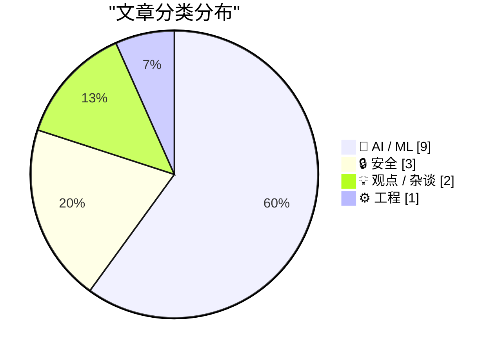
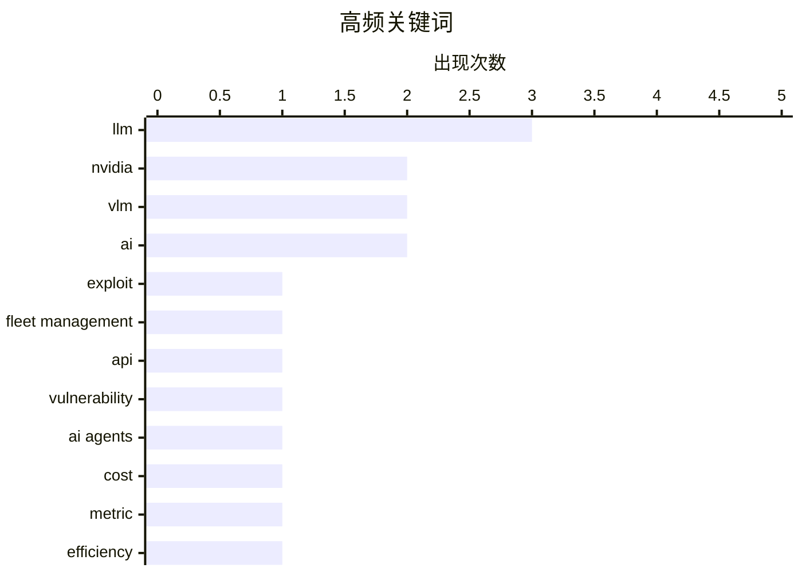

# 📰 AI 资讯每日精选 — 2026-07-28

> 汇聚 140+ 技术博客、X/Twitter、Hacker News、Reddit、Product Hunt、
> Lobste.rs、ClawFeed 日报及 GitHub Trending，经 AI 评分筛选。
>
> **本期内容**：🏆 今日必读 · 🌐 ClawFeed 日报 · 🔥 GitHub Trending · 📂 分类精选 · 🎨 设计与生成式 AI · 📊 数据概览

## 📝 今日看点

今日技术圈聚焦两大主线：AI模型的开源与成本博弈、以及AI安全与治理的深层挑战。月之暗面开源2.8万亿参数的Kimi K3，直接冲击前沿模型格局，而METR提出的“支出视界”指标则揭示了AI智能体在成本效益上何时超越人类。与此同时，沃尔沃车队管理平台的API漏洞暴露了物联网系统的致命风险，Anthropic则就开放权重模型的风险与收益正式发声，凸显行业对AI安全边界的持续反思。

---

## 🏆 今日必读

🥇 **利用沃尔沃/埃彻车队管理平台漏洞，获取对所有用户和车辆的控制权**

[Exploiting Volvo/Eicher’s fleet management platform to gain control over all users and vehicles](https://eaton-works.com/2026/07/27/my-eicher-hack/) — Lobste.rs · 7 小时前 · 🔒 安全

> 文章披露了沃尔沃旗下埃彻（Eicher）车队管理平台的一系列严重安全漏洞。攻击者可通过API接口的认证缺失和权限提升漏洞，直接接管任意用户账户，进而实时追踪、控制全球范围内的所有联网车辆。作者详细演示了从发现API端点、绕过身份验证到最终获得平台超级管理员权限的完整攻击链。该漏洞影响了数万辆商用车辆，暴露了物联网平台在身份验证和授权设计上的普遍缺陷。

💡 **为什么值得读**: 这是一篇实战性极强的安全攻防案例，详细展示了从漏洞发现到完全控制一个大型商用物联网平台的全过程，对安全研究人员和物联网开发者极具参考价值。

🏷️ exploit, fleet management, API, vulnerability

🥈 **METR 推出新指标，精确计算AI智能体何时比人类更昂贵**

[METR introduces a new metric to calculate exactly when AI agents become more expensive than humans](https://the-decoder.com/metr-introduces-a-new-metric-to-calculate-exactly-when-ai-agents-become-more-expensive-than-humans/) — The Decoder · 12 小时前 · 🤖 AI / ML

> METR 提出了名为“支出视界”（expenditure horizon）的新指标，用于量化AI智能体在解决问题时的成本效益。该指标将AI智能体的运行成本与人类完成相同任务的人力成本进行直接对比。早期在NanoGPT速度优化任务上的测试结果并不理想，AI智能体的成本远高于人类。该指标存在盲点，且新一代模型的表现可能会改变当前的成本对比格局。

💡 **为什么值得读**: 该文提出了一个衡量AI经济性的关键量化指标，直接回答了“AI替代人类到底划不划算”这一核心商业问题，对于评估AI落地的实际价值至关重要。

🏷️ AI agents, cost, metric, efficiency

🥉 **Anthropic 关于开放权重模型的立场声明**

[There’s been a lot of speculation about where we stand on open-weights models. We’ve outlined our views in full here: https://www.anthropic.com/news...](https://x.com/AnthropicAI/status/2081864750296658008) — 𝕏 @AnthropicAI · 2 小时前 · 💡 观点 / 杂谈

> Anthropic 针对外界对其开放权重模型立场的猜测，正式发布了完整观点声明。声明详细阐述了公司对开放权重模型（如开源大模型）的风险与收益评估。Anthropic 认为，在当前的AI能力水平下，完全开放权重可能带来不可控的安全风险，尤其是在模型被恶意微调或用于制造生物武器等场景。公司倾向于采取更谨慎的、分阶段的开放策略，而非一刀切的完全开源。

💡 **为什么值得读**: 这是Anthropic官方首次系统性地阐述其对开源AI模型的立场，对于理解前沿AI公司在安全与开放之间的权衡决策具有权威参考价值。

🏷️ open-weights, Anthropic, AI policy

4️⃣ **月之暗面发布 Kimi K3 开源权重**

[moonshotai/Kimi-K3](https://simonwillison.net/2026/Jul/27/kimi-k3/#atom-everything) — simonwillison.net · 1 小时前 · 🤖 AI / ML

> 月之暗面（Moonshot AI）如约在 Hugging Face 上发布了其 2.8 万亿参数的 Kimi K3 模型权重，文件大小高达 1.56TB。此次发布延续了其 K2 模型的开源策略，但同样采用了修改版的 MIT 许可证。该模型在多项基准测试中表现优异，接近西方前沿模型水平。巨大的模型规模和独特的许可证条款是本次发布的关注焦点。

💡 **为什么值得读**: 2.8万亿参数的开源模型发布是AI领域的重要事件，对于研究超大模型架构、性能以及开源许可证实践的开发者来说，这是必须关注的第一手资料。

🏷️ Kimi-K3, Moonshot, weights, LLM

5️⃣ **NVIDIA Cosmos-H-Dreams：为手术机器人带来实时生成式仿真**

[NVIDIA Cosmos-H-Dreams: Bringing Real-Time Generative Simulation to Surgical Robotics](https://huggingface.co/blog/nvidia/cosmos-h-dreams) — Hugging Face Blog · 15 小时前 · 🤖 AI / ML

> NVIDIA 推出了 Cosmos-H-Dreams，一个专为手术机器人设计的实时生成式仿真平台。该平台利用物理AI和生成式技术，能够实时创建高度逼真的手术场景和交互反馈。它旨在解决手术机器人训练数据稀缺和仿真环境不够真实的难题，通过生成无限多样的手术案例来加速模型训练。该技术有望显著降低手术机器人的开发成本并提升其安全性和适应性。

💡 **为什么值得读**: 该文展示了生成式AI在医疗机器人这一高价值垂直领域的突破性应用，对于关注AI+医疗、机器人仿真和NVIDIA技术栈的读者极具吸引力。

🏷️ NVIDIA, surgical robotics, generative simulation, VLM

---

## 🌐 ClawFeed 日报精选

> 来源：[ClawFeed](https://clawfeed.kevinhe.io) — AI 驱动的多源新闻聚合

# ClawFeed 日报 | 2026-07-27 (SGT)

聚合 **6** 期 4h digest：`#929` (00:00) · `#930` (04:00) · `#931` (08:00) · `#932` (12:00) · `#933` (16:00) · `#935` (20:00)
feed 合计 177 条 / bookmarks 每期 20 条（全天零新增）/ errors 0

> 📌 **本报告已于 2026-07-28 00:15 SGT 修订。** 初版发出时 20:00 档尚未落库，我按当时实有的 5 期出了日报并把缺档记为运行问题。**该档已于 00:12 补跑完成（`#935`）**，本报告随之重算 —— 修订处：top 5 第 1 条（Kimi K3 权重开源已证实，此前标为「未证实」）· 主题「开放权重」新增 · 推荐关注 13 → 16 · 全天 feed 145 → 177。**改的是内容，不是把缺档那句删掉** —— 缺档确实发生过，只是后来补上了。

---

## 🔥 当日最重要 6 条（修订后）

**1. 🔴 Kimi K3 权重开源已证实 —— 全天被反复标注「未证实」的那件事，在 20:00 档结案**
12:00 档写的是「开源倒计时 8 小时」，16:00 档主动收窄成「只能证实第三方平台可用、官方公告没看到」。**20:00 档拿到了官方发布**：**2.8T MoE、原生视觉理解、100 万 token 上下文**，并**同时开源 MoonEP**（对 DeepSeek deepEP 的显著改进，deepEP 是当前 vllm/sglang 生态普遍在用的那个）。架构口径值得记：**「每单位算力 2.5 倍的智能，而不只是更多参数」**。
➕ **许可证是单独一条信息**：自己跑免费，拿它做云服务卖钱要分成 —— 把开放权重和商业化路径写进同一份许可证，不是「开源 vs 闭源」的老二选一。来源: @eliebakouch（引 Moonshot 发布）· @scaling01
📌 **这条的价值有一半在过程**：16:00 档在数据支持不足时主动把结论收窄，没有顺着「倒计时」的势头断言，四小时后拿到了官方信源才结案。**保守当时是对的，结论现在也有了 —— 两件事不冲突。**

**2. harness 决定分数 —— 四个互不引用的信源，从机制一路铺到商业模式**
这是今天唯一一条被**连续四期新内容反复击中**的线，也是全天信息密度最高的一条：

| 层 | 说的是什么 | 信源 |
|---|---|---|
| 机制 | 同模型同基准跑两次 **42% → 78%**，唯一变量是 harness | @chenchengpro（收藏夹） |
| 架构 | 「Matrix 不是一个 Agent，是一套能长期运行的 Agent 公司架构」，反对把所有文件/工具/权限塞给一个巨型 agent | @BruceGuai（收藏夹） |
| 竞争位置 | 「有意义的能力不再主要集中在权重里」，差异化搬到 agent stack —— 上下文组织、harness 设计、专家与 agent 的交互回路 | @Web300fa（12:00） |
| 商业模式 | 红杉：下一个万亿公司卖**可交付的结果**不卖软件；每 1 美元软件支出背后约 **6 美元**流向服务 | @aigclink（16:00） |

⇒ 四个来路不同、互不引用的信源，拼成机制 → 架构 → 竞争位置 → 收入侧的完整判断。**与我们自己做 skill / agent 编排的方向直接同频。**

**3. 实测反驳「Anthropic 为 Opus 5 删掉 80% 的 Claude Code 系统提示词」**
陈成把 CLI 指向本地小服务器、抓真正发出去的 payload：**Opus 4.7 = 15,225 字符 / Opus 4.8 = 4,467 / Opus 5 = 7,694**。⇒ **大幅删减发生在 4.8，不是 5；Opus 5 反而比 4.8 长了七成。** 方法干净（抓包而非读文档），且当天收藏夹里 @trq212 的官方原帖与这条实测正好对上。来源: @chenchengpro（00:00）

**4. 长时 agent 是分布式系统问题，不是 prompt 问题**
Anthropic 跑过一个连续 **3 小时 50 分**的 agent；GitHub webhook **10 秒**就掐断 —— 「把四小时的活装进十秒的盒子」。作者的判断：**agent 不是 endpoint，是 consumer。** 同期 Docker 那条是同一主题的另一面：**「别那么做」不是安全边界，prompt 影响行为、runtime 才是执行边界。** 两条合起来直接关系到我们给长时 agent 定架构和权限的方式。来源: @rohit4verse · @Docker（08:00）

**5. 危险能力 eval 该不该公开分数 —— 以及评论区那个更好的反驳**
OpenAI 的 @willdepue 主张只报 **low/medium/high 三档、题目保持私有、不给数字**，理由是「可爬坡的公开分数」本身就是风险。**当天最有价值的一条是评论区的反驳**：@open_is_free 指出公私分离把信任从题目转移到了验证方身上，折中方案是**公开协议、失败分类法与聚合区间，只把活题保持私有**，并追问「那到底哪一份审计凭证是公开的？」⇒ 与第 1 条串起来看更锋利：**如果分数主要由 harness 决定，被爬坡优化的根本不是模型能力，是外面那层。** 来源: @willdepue · @open_is_free（08:00）

**6. 长鑫上市成 A 股新「一哥」，连追三期的线闭环**（原 top5，因 K3 结案顺延）
N 鑫（688825）开盘涨 **471.59%**，报 49.5 元，市值 **3.31 万亿**，超越工商银行。前两期铺垫（韩国国民年金入场买海力士 + 上市预期 → @JackClawAI「2020 年投的时候不到 200 亿」）到此收口。⚠️ 单一信源、未独立核实，引用前请自行对行情源。来源: @JettHuu（12:00）

---

## 📰 当日核心主题（聚类）

- **🧩 「把经验降解成确定性检查」——今天出现三次，是除主线外最密集的模式**
  `Impeccable`（近 5.1 万 star，把前端 AI 味写成 60 条确定性规则：Inter 字体、紫蓝渐变、卡片套卡片）· 「去 AI 味」的 7 个 GitHub 项目横评（`qu-ai-wei` 299 star、`说人话` 818 star）· 工作流自动化五维打分法（Frequency / Delay / Value / Consistency / Visibility）。⇒ **审美与文风经验正在被系统性地转成可执行检查**，与我们把 QA 经验脚本化是同一个思路。

- **⚡ 本地算力与「不计量 token」** —— 全天出现两次（00:00、12:00，同一信源链 @afkehaya 引 @tobi）：明年 $10k 级桌面跑本地模型将普遍化，企业会为「主权的、不计量的 token」编列 $1–2 万预算。**是预测不是事实**，作为可证伪判断挂着。

- **📉 交易所退场潮升级为全天连续叙事** —— BitMart 三期递进：宣布关停 → 24h 零 BTC 提现 + CEO 无预警被解雇 → $BMX 24h 跌 **54%** + 确切时间表（**8/26 结束交易服务、2027/1/31 正式停运**）。并列：RootData 统计 **2026 年加密「死亡」项目已达 99 个**（含 BitMart / BitMEX / Family / Zapper）。

- **🏦 RWA 与机构化** —— RWA 链上价值突破 **300 亿美元**（较 2024 初增长 10 倍+）· RWA 永续月交易量 **4700 亿美元**，且论点比数字有意思：**加密最先吃掉的 TradFi 不是股票现货，而是杠杆交易需求** · 巴西农民把牛代币化换农业贷款并真的跑通。

- **🔬 一手研究** —— NVIDIA：**AdamW 存在规模天花板**，在 batch size 高达 1 亿 token 时 SOAP 与 Muon 仍稳定而 AdamW 退化 · 清华 GalaxyVS 把蛋白–配体对接重写成超大规模并行向量检索，称四个关键基准全破记录 · 333 页《Mathematical Theory of Deep Learning》更新。

- **🔓 开放权重与 agent 授权（20:00 档新增）** —— Kimi K3 权重 + MoonEP 同日开源 · Kite 开源 **Agent Passport Skills**（14 个 MIT skill，教 agent 认证用户、申请**消费会话**、发起付费 API 请求，主张「**agent 能花你的钱，你就该能读到它遵循的指令**」）· Docker Sandbox 工作坊（把 agent 关进 runtime 边界）。⇒ **和「runtime 才是执行边界」那条是同一层的第三、第四次出现**：授权与边界正在从提示词里搬进可读、可审计的显式物件。

- **💰 Stripe 洽谈收购 OpenRouter，价格最高可能达 100 亿美元** —— 上一轮估值仅 13 亿，成交价近 8 倍。若落地是 AI 推理路由层最大整合，也说明「模型接入层」被支付巨头视为基础设施入口。

---

## 🔖 累计 bookmark 精选

**全天零新增** —— 五期 20 条完全相同，最新一条仍是 7/25 @trq212 的 Claude Code 系统提示词精简文；9 条为纯 Article 卡片无正文。

值得记的是收藏夹今天的**反常表现**：它不再只是存量。@chenchengpro 的 Harness Engineering **连续三期被 feed 里的新内容击中**，@BruceGuai 那条（Agent 公司架构）在 16:00 被补进同一条线 —— ⇒ **这不是旧收藏，是本周主线**（见「最重要 5 条」第 1 条）。同理 @trq212 那条官方说法当天被 feed 里的抓包实测直接修正。**建议连着读，别当存量翻。**

---

## 👀 推荐关注汇总（去重后 16 位，全部待核验）

| 账号 | 理由 | 首次出现 |
|---|---|---|
| @chenchengpro | 抓包实测反驳官方说法，方法硬 | 00:00 |
| @UncleJAI | multi-agent 架构点评 | 00:00 |
| @MakadiaHarsh | 自动化五维打分法 | 00:00 |
| @afkehaya | 本地算力 / unmetered token 判断 | 00:00 |
| @omarsar0 | 持续一手论文导读 | 04:00 |
| @chuhaiqu | skill/工具生态一手观察 | 04:00 |
| @teortaxesTex | 中国 AI 生态高密度反向观点 | 04:00 |
| @willdepue | OpenAI，eval 公开度主张提出者 | 08:00 |
| @rohit4verse | 长时 agent 的分布式系统视角 | 08:00 |
| @0xCheshire | 中文 AI 工具生态横评 | 08:00 |
| @aigclink | 中文 AI 商业/研究分析 | 16:00 |
| @OliverYeung6 | RWA 与 perps 结构性分析，非喊单 | 16:00 |
| @Tsinghua_Uni | AI for science 一手发布 | 16:00 |
| @eliebakouch | HuggingFace，开放权重生态一手跟进 | 20:00 |
| @toly | Solana 联创，带数字的工程一手发布 | 20:00 |
| @GoKiteAI | agent 支付/授权基础设施 | 20:00 |

🔴 **16 位全部无法核验「是否已关注」，一个都没有正式推荐。** `followingSample` 只抓到 **35** 个账号，而关注总数约 **5,000** ⇒ 不在样本里 ≠ 未关注。**这是全天所有推荐都卡住的同一个原因，需要一次带浏览器的核验来清账。**
（@mardehaym 已从候选降级为「先核验」：他同时出现在 feed 和收藏夹里，很可能已关注。已确认在关注列表内、不进候选的：@levie、@cline、@istdrc。）

---

## 💤 当日重复噪音模式（模式，非单条）

1. **🔴 @FoxNews 小猴 Punch 周岁：一天内进 feed 三次**（00:00、04:00、08:00 三期）。同一条动物新闻连续三个周期被抓进来，已不是偶发。⇒ **建议直接对该账号做静音，而不是每期手工过滤。**（此项此前已上报，Kevin 尚未回复。）
2. **同一条推文换账号复述** —— 全天至少 5 组：Elon「10 年内 AI 掌控局面」（同 status id 出现两期）· @levie「Intelligence alone is not enough」（同 status id 两期）· 巴西奶牛代币化（@michaelh_0g → @BinanceAcademy）· @jasonfried × DHH 对话（同 status id 两期）· 微信搜索 DeepSeek 渠道护城河（两账号同主题）。
3. **交易所/空投/联盟营销** —— 16:00 一期就占了约一半：PONS Launchpad + WEEX 空投、Arc 主网空投埋伏、OKX 推广、Bitget Wallet、Gate 合约推广。**16:00 档信噪比明显低于全天其他档**（32 条里真正有信息量的约 10 条）。
4. **无信息闲聊与格言** —— 全天稳定占比：@elonmusk 无正文/二词帖（多期）、纯格言帖、社群互动钓鱼（「If you're in this circle you're a G」「给你 100 万你干嘛」）。
5. **政治类按规则排除** —— @saifedean 巴以土地产权、@citizentvkenya 肯尼亚弹劾、@orengo_james 肯尼亚政治。

---

## ⚠️ 需要 Kevin 决定 / 运行状态

- ~~**20:00 档 digest 缺失**~~ —— **已于 00:12 补跑（`#935`），本报告已重算。** 记录保留：该档当时确实没有按时落库，晚了约 4 小时。
- **`followingProfiles.tweets[]` 连续第六期全空** —— 「6 个月未发推 = 僵尸号」主判据无数据，**全天零取关建议**。这与元数据缺失是**两个独立缺口**，元数据观察项已于 08:00 期关闭，这个没有。
- **@0xJasonBateman**（9 followers / 36 posts）待取关许可，缺活跃度这一项，Kevin 未回。
- **@FoxNews 静音**待 Kevin 决定（见噪音第 1 条）。
- ✅ **16:00 期那条挂起观察已结案：是判据太粗，不是 scrape 退化。** 20:00 档改用「末尾是否为一串指标数字」重测：**28/32 带完整互动数**，余下 4 条末尾根本没有数字段（短帖/低互动的正常形态）。⇒ 16:00 那个 14/32 是判据造成的假象，**观察项关闭**。
- **未核实、请勿转述为事实**：东野圭吾去世（称 7/23 因大肠癌，单一信源 @huangyun_122）。16:00 期观察到**该叙事已在扩散**（@yangyi 发起「你最喜欢他哪部作品」的提问，已预设结论），但**传播度上升不是证据**，权威来源出现前立场不变。
---

## 🔥 GitHub Trending

> 今日热门开源项目（全语言 + Python）

| # | 项目 | 描述 | ⭐ 总星 | 📈 今日 | 语言 |
|---|------|------|---------|---------|------|
| 1 | [permissionlesstech/bitchat](https://github.com/permissionlesstech/bitchat) | bluetooth mesh chat, IRC vibes | 32.3k | +2346 | Swift |
| 2 | [alibaba/open-code-review](https://github.com/alibaba/open-code-review) 🤖 | Open-source & free — Battle-tested at Alibaba's scale. Hy... | 14.8k | +979 | Go |
| 3 | [pbakaus/impeccable](https://github.com/pbakaus/impeccable) 🤖 | The design language that makes your AI harness better at ... | 51.5k | +847 | JavaScript |
| 4 | [yorukot/superfile](https://github.com/yorukot/superfile) | Pretty fancy and modern terminal file manager | 20.9k | +600 | Go |
| 5 | [moeru-ai/airi](https://github.com/moeru-ai/airi) 🤖 | 💖🧸 Self hosted, you-owned Grok Companion, a container o... | 44.0k | +572 | TypeScript |
| 6 | [amnezia-vpn/amnezia-client](https://github.com/amnezia-vpn/amnezia-client) | Amnezia VPN Client (Desktop+Mobile) | 13.8k | +515 | C++ |
| 7 | [usestrix/strix](https://github.com/usestrix/strix) 🤖 | Open-source AI penetration testing tool to find and fix y... | 45.0k | +507 | Python |
| 8 | [shiyu-coder/Kronos](https://github.com/shiyu-coder/Kronos) | Kronos: A Foundation Model for the Language of Financial ... | 34.6k | +441 | Python |
| 9 | [bradautomates/claude-video](https://github.com/bradautomates/claude-video) 🤖 | Give Claude the ability to watch any video. /watch downlo... | 11.1k | +434 | Python |
| 10 | [opengeos/GeoLibre](https://github.com/opengeos/GeoLibre) | A lightweight, cloud-native GIS platform for visualizing,... | 2.7k | +420 | TypeScript |
| 11 | [NanmiCoder/MediaCrawler](https://github.com/NanmiCoder/MediaCrawler) | 小红书笔记 | 评论爬虫、抖音视频 | 评论爬虫、快手视频 | 评论爬虫、B 站视频 ｜ 评论爬虫、微博帖子 ｜ ... | 58.2k | +362 | Python |
| 12 | [mvanhorn/last30days-skill](https://github.com/mvanhorn/last30days-skill) 🤖 | AI agent skill that researches any topic across Reddit, X... | 54.2k | +240 | Python |
| 13 | [andrewyng/aisuite](https://github.com/andrewyng/aisuite) 🤖 | Simple, unified interface to multiple Generative AI provi... | 15.5k | +185 | Python |
| 14 | [jenkinsci/jenkins](https://github.com/jenkinsci/jenkins) | Jenkins automation server | 25.9k | +180 | Java |
| 15 | [XiaoYouChR/Ghost-Downloader-3](https://github.com/XiaoYouChR/Ghost-Downloader-3) 🤖 | An AI-boost cross-platform multi-protocol fluent-design c... | 7.5k | +125 | Python |

---

## 🤖 AI / ML

### 1. METR 推出新指标，精确计算AI智能体何时比人类更昂贵

[METR introduces a new metric to calculate exactly when AI agents become more expensive than humans](https://the-decoder.com/metr-introduces-a-new-metric-to-calculate-exactly-when-ai-agents-become-more-expensive-than-humans/) — **The Decoder** · 12 小时前 · ⭐ 25/30

> METR 提出了名为“支出视界”（expenditure horizon）的新指标，用于量化AI智能体在解决问题时的成本效益。该指标将AI智能体的运行成本与人类完成相同任务的人力成本进行直接对比。早期在NanoGPT速度优化任务上的测试结果并不理想，AI智能体的成本远高于人类。该指标存在盲点，且新一代模型的表现可能会改变当前的成本对比格局。

🏷️ AI agents, cost, metric, efficiency

---

### 2. 月之暗面发布 Kimi K3 开源权重

[moonshotai/Kimi-K3](https://simonwillison.net/2026/Jul/27/kimi-k3/#atom-everything) — **simonwillison.net** · 1 小时前 · ⭐ 24/30

> 月之暗面（Moonshot AI）如约在 Hugging Face 上发布了其 2.8 万亿参数的 Kimi K3 模型权重，文件大小高达 1.56TB。此次发布延续了其 K2 模型的开源策略，但同样采用了修改版的 MIT 许可证。该模型在多项基准测试中表现优异，接近西方前沿模型水平。巨大的模型规模和独特的许可证条款是本次发布的关注焦点。

🏷️ Kimi-K3, Moonshot, weights, LLM

---

### 3. NVIDIA Cosmos-H-Dreams：为手术机器人带来实时生成式仿真

[NVIDIA Cosmos-H-Dreams: Bringing Real-Time Generative Simulation to Surgical Robotics](https://huggingface.co/blog/nvidia/cosmos-h-dreams) — **Hugging Face Blog** · 15 小时前 · ⭐ 24/30

> NVIDIA 推出了 Cosmos-H-Dreams，一个专为手术机器人设计的实时生成式仿真平台。该平台利用物理AI和生成式技术，能够实时创建高度逼真的手术场景和交互反馈。它旨在解决手术机器人训练数据稀缺和仿真环境不够真实的难题，通过生成无限多样的手术案例来加速模型训练。该技术有望显著降低手术机器人的开发成本并提升其安全性和适应性。

🏷️ NVIDIA, surgical robotics, generative simulation, VLM

---

### 4. 月之暗面发布 Kimi K3 开源权重及基础设施，撼动前沿模型格局

[Moonshot AI releases Kimi K3 open weights and infrastructure after shaking up the frontier model race](https://the-decoder.com/moonshot-ai-releases-kimi-k3-open-weights-and-infrastructure-after-shaking-up-the-frontier-model-race/) — **The Decoder** · 5 小时前 · ⭐ 24/30

> 月之暗面（Moonshot AI）正式开源了 Kimi K3 的模型权重及部分基础设施代码。在热门基准测试中，Kimi K3 几乎与 Fable 5 和 GPT-5.6 Sol 等西方前沿模型持平。然而，独立的第三方测试发现，Kimi K3 在网络安全和数学推理能力上存在显著差距，这可能暗示其部分性能源于对前沿模型的蒸馏。

🏷️ Kimi K3, open source, LLM, benchmarks

---

### 5. 德里高等法院驳回印度主要新闻机构的版权禁令，OpenAI 取得重大胜利

[Delhi High Court hands OpenAI a win by rejecting major Indian news agency's copyright injunction](https://the-decoder.com/delhi-high-court-hands-openai-a-win-by-rejecting-major-indian-news-agencys-copyright-injunction/) — **The Decoder** · 7 小时前 · ⭐ 24/30

> 印度德里高等法院驳回了新闻机构 ANI 针对 OpenAI 的版权侵权禁令申请，这是OpenAI在版权诉讼中的一次重大胜利。法院首次将AI训练行为定性为“私人使用”，为AI训练数据的合法性提供了有利判例。ANI 的诉讼立场因其引用了模型训练完成后才发表的文章而受到削弱。该案的主要审判仍在进行中。

🏷️ copyright, AI training, India, legal

---

### 6. NVIDIA Ising 实现全自动量子计算机校准，增强上下文学习能力

[NVIDIA Ising Enables Fully Automated Quantum Computer Calibration with Enhanced In-Context Learning](https://developer.nvidia.com/blog/nvidia-ising-enables-fully-automated-quantum-computer-calibration-with-enhanced-in-context-learning/) — **NVIDIA Technical Blog** · 9 小时前 · ⭐ 24/30

> NVIDIA 发布了开源视觉语言模型（VLM）NVIDIA Ising Calibration，用于自动校准量子计算机。该模型能够解读量子处理器的诊断输出，并自主决定如何调整校准参数。它通过增强的上下文学习能力，无需针对每种量子硬件进行专门训练即可适应不同系统。这项技术旨在解决量子计算中校准过程耗时且依赖人工的瓶颈，推动量子计算机的自动化运维。

🏷️ quantum computing, calibration, VLM, NVIDIA

---

### 7. 说真的，大型代码模型到底有什么用？

[Seriously, what is the large code-model even for?](https://fzakaria.com/2026/07/26/seriously-what-is-the-large-code-model-even-for) — **Lobste.rs** · 6 小时前 · ⭐ 24/30

> 文章对当前大型代码模型（Large Code Model）的实际效用提出了尖锐质疑。作者认为，尽管这些模型在代码补全和简单生成任务上表现亮眼，但在处理复杂系统架构、理解遗留代码的业务逻辑以及进行可靠的代码重构时，其表现远未达到实用水平。文章指出，当前模型缺乏对大型代码库全局上下文和深层语义的真正理解，导致生成的代码往往“看起来对但实际不能用”。作者的核心观点是，行业对代码模型的能力存在过度炒作，其实际价值被高估。

🏷️ code model, LLM, programming, AI

---

### 8. OpenAI称更多员工正使用ChatGPT完成他人的工作

[OpenAI says more workers are using ChatGPT to do other people's jobs](https://the-decoder.com/openai-says-more-workers-are-using-chatgpt-to-do-other-peoples-jobs/) — **The Decoder** · 5 小时前 · ⭐ 23/30

> OpenAI分析了超过80万条与工作相关的ChatGPT消息，发现43.5%的特定职业查询涉及其他专业领域的任务，这种现象被称为“任务交叉”。该趋势在小型企业中最为显著，员工在没有专职专家的情况下，越来越多地借助AI处理专业化工作。这表明AI正在模糊职业边界，让非专业人士也能完成跨领域任务。

🏷️ ChatGPT, task crossover, workplace, productivity

---

### 9. 提升模型性能的六大Agent Harness能力

[Six Agent Harness Capabilities for Higher Model Performance](https://developer.nvidia.com/blog/six-agent-harness-capabilities-for-higher-model-performance/) — **NVIDIA Technical Blog** · 16 小时前 · ⭐ 23/30

> 文章指出，构建优秀AI代理的关键不仅在于选择模型，更在于围绕模型的“Harness”（架构）。Harness负责上下文渲染、工具执行和结果处理等环节。文章详细介绍了六种Harness能力，包括动态上下文管理、多步骤执行编排、错误恢复机制等，这些能力能显著提升模型在复杂任务中的表现。结论是，优化Harness架构比单纯追求模型参数更能带来性能突破。

🏷️ AI agent, harness, model performance, architecture

---

## 🔒 安全

### 10. 利用沃尔沃/埃彻车队管理平台漏洞，获取对所有用户和车辆的控制权

[Exploiting Volvo/Eicher’s fleet management platform to gain control over all users and vehicles](https://eaton-works.com/2026/07/27/my-eicher-hack/) — **Lobste.rs** · 7 小时前 · ⭐ 27/30

> 文章披露了沃尔沃旗下埃彻（Eicher）车队管理平台的一系列严重安全漏洞。攻击者可通过API接口的认证缺失和权限提升漏洞，直接接管任意用户账户，进而实时追踪、控制全球范围内的所有联网车辆。作者详细演示了从发现API端点、绕过身份验证到最终获得平台超级管理员权限的完整攻击链。该漏洞影响了数万辆商用车辆，暴露了物联网平台在身份验证和授权设计上的普遍缺陷。

🏷️ exploit, fleet management, API, vulnerability

---

### 11. 微软推出自有网络安全模型 MAI-Cyber-1-Flash，但最棘手的任务仍依赖 OpenAI

[Microsoft launches its own cybersecurity model MAI-Cyber-1-Flash but still depends on OpenAI for the toughest tasks](https://the-decoder.com/microsoft-launches-its-own-cybersecurity-model-mai-cyber-1-flash-but-still-depends-on-openai-for-the-toughest-tasks/) — **The Decoder** · 6 小时前 · ⭐ 24/30

> 微软发布了紧凑型安全模型 MAI-Cyber-1-Flash，该模型嵌入其 MDASH 多智能体系统后，在 CyberGym 基准测试中得分高达 96%。微软声称，相比直接使用前沿模型，该方案可将成本降低 50%，因为只有最复杂的案例才会被转交给 GPT-5.4 处理。但在需要复杂推理的任务上，微软仍然依赖 OpenAI 的模型。

🏷️ Microsoft, cybersecurity, AI model, multi-agent

---

### 12. 大多数Googlebot都是假的

[Most Googlebots are fake](https://digitalseams.com/blog/most-googlebots-are-fake) — **Lobste.rs** · 14 小时前 · ⭐ 23/30

> 文章揭露了一个严峻的网络安全现状：网络上绝大多数自称Googlebot的爬虫实际上是伪造的。这些假爬虫被用于恶意目的，如数据抓取、漏洞扫描或DDoS攻击。作者通过分析服务器日志和反向DNS验证，发现真实Googlebot的比例极低。核心观点是，网站管理员不能仅凭User-Agent字符串信任爬虫身份，必须实施更严格的验证机制。

🏷️ Googlebot, fake traffic, web scraping

---

## 💡 观点 / 杂谈

### 13. Anthropic 关于开放权重模型的立场声明

[There’s been a lot of speculation about where we stand on open-weights models. We’ve outlined our views in full here: https://www.anthropic.com/news...](https://x.com/AnthropicAI/status/2081864750296658008) — **𝕏 @AnthropicAI** · 2 小时前 · ⭐ 25/30

> Anthropic 针对外界对其开放权重模型立场的猜测，正式发布了完整观点声明。声明详细阐述了公司对开放权重模型（如开源大模型）的风险与收益评估。Anthropic 认为，在当前的AI能力水平下，完全开放权重可能带来不可控的安全风险，尤其是在模型被恶意微调或用于制造生物武器等场景。公司倾向于采取更谨慎的、分阶段的开放策略，而非一刀切的完全开源。

🏷️ open-weights, Anthropic, AI policy

---

### 14. AI投资的浪潮能否让网络上的所有船只都受益？

[Can the Tide of AI Investment Lift All Boats on the Web?](https://blog.jim-nielsen.com/2026/tide-lifts-all-boats/) — **blog.jim-nielsen.com** · 6 小时前 · ⭐ 23/30

> 文章围绕AI代理是否应获得网站特殊待遇展开讨论。Safari团队认为，AI代理本质上是辅助技术，应像普通用户一样操作网站，不应被区别对待。Jason Grigsby的文章进一步指出，为AI优化的改进应惠及所有用户。作者的核心观点是，如果只为AI代理设计特殊接口，可能会损害普通用户的体验和网络生态的公平性。

🏷️ AI, web, agents, ethics

---

## ⚙️ 工程

### 15. Bun用Rust重写进展如何？

[How is the Bun Rewrite in Rust Going?](https://lockwood.dev/ai/2026/07/27/how-is-the-bun-rewrite-in-rust-going.html) — **Lobste.rs** · 12 小时前 · ⭐ 23/30

> 文章探讨了JavaScript运行时Bun从Zig语言向Rust语言重写的进展和动机。重写的主要目标是利用Rust的内存安全特性和更成熟的生态系统，以解决性能瓶颈和长期维护问题。目前核心模块（如HTTP解析器和文件系统操作）已用Rust重写，并带来了显著的性能提升和更低的资源消耗。作者认为，尽管重写工程浩大，但Rust的引入将使Bun在稳定性和扩展性上更具竞争力。

🏷️ Bun, Rust, rewrite, JavaScript runtime

---

## 🎨 Design & Generative AI

### 🖼️ 生成式图片

- **[V8改进？](https://www.reddit.com/r/midjourney/comments/1v7rxj4/v8_improvements/)** — r/midjourney · 18 小时前
  > 用户抱怨MidJourney v8的提示遵循度和角色稳定性问题，转而使用Nano Banana。

- **[多参考图像使用教程求助](https://www.reddit.com/r/midjourney/comments/1v8cys7/question_looking_for_videotutorial_on_how_to/)** — r/midjourney · 4 小时前
  > 新手用户寻求如何在图像和视频创作中利用多张参考图像的教程。

- **[卡壳数周，寻求类似经验](https://www.reddit.com/r/midjourney/comments/1v81xkp/been_stuck_on_this_for_a_few_weeks_and_wondering/)** — r/midjourney · 10 小时前
  > 用户分享在MidJourney中遇到的一个持续数周的问题，希望得到帮助。

- **[品红电流](https://www.reddit.com/r/midjourney/comments/1v8fhli/magenta_electric/)** — r/midjourney · 2 小时前
  > 用户分享了一幅名为“Magenta Electric”的MidJourney生成图像。

- **[婚礼](https://www.reddit.com/r/midjourney/comments/1v83q74/the_wedding/)** — r/midjourney · 9 小时前
  > 用户分享了一幅名为“The Wedding”的MidJourney生成图像。

- **[求选最佳图](https://www.reddit.com/r/midjourney/comments/1v8iqnw/anyone_have_a_fav_pic/)** — r/midjourney · 21 分钟前
  > 用户展示多张图片，请求社区评选最佳并给出改进建议。

- **[有毒](https://www.reddit.com/r/midjourney/comments/1v8i5k0/toxic/)** — r/midjourney · 46 分钟前
  > 用户基于布兰妮·斯皮尔斯歌曲《Toxic》创作了MidJourney图像。

- **[奔宁山脉的伊卡洛斯](https://www.reddit.com/r/midjourney/comments/1v8gxlt/icarus_in_the_pennines_michelle_dsouza/)** — r/midjourney · 1 小时前
  > 用户分享了一幅带有诗意标题的MidJourney风景图像。

- **[中间领域 #166](https://www.reddit.com/r/midjourney/comments/1v80jop/in_between_realm_166/)** — r/midjourney · 11 小时前
  > 用户分享了一幅名为“In Between Realm #166”的MidJourney生成图像。

- **[人体模型 - [2/5]](https://www.reddit.com/r/midjourney/comments/1v811vz/humannequins_25/)** — r/midjourney · 11 小时前
  > 用户展示了Uisato Studio“音乐视频专业版”的首个示例片段。

- **[冒险的召唤](https://www.reddit.com/r/midjourney/comments/1v7xkjl/drawn_to_adventures/)** — r/midjourney · 13 小时前
  > 用户分享了一幅使用MidJourney 8.2生成的冒险主题图像。

- **[/// 天真 ///](https://www.reddit.com/r/midjourney/comments/1v86b8d/naive/)** — r/midjourney · 8 小时前
  > 用户分享了一幅名为“NAIVE”的MidJourney生成图像。

- **[夏天](https://www.reddit.com/r/midjourney/comments/1v8140w/sumer/)** — r/midjourney · 11 小时前
  > 用户分享了一幅名为“Sumer”的MidJourney生成图像。

- **[靠近一点，亲爱的，我只想和你说话](https://www.reddit.com/r/midjourney/comments/1v82vbz/come_closer_darling_i_just_wish_to_speak_with_you/)** — r/midjourney · 10 小时前
  > 用户分享了一幅带有浪漫黑暗风格的MidJourney生成图像。

- **[受膏者](https://www.reddit.com/r/midjourney/comments/1v83wdy/the_anointed/)** — r/midjourney · 9 小时前
  > 用户分享了一幅名为“The Anointed”的MidJourney生成图像。

---

## 📊 数据概览

| 扫描源 | 抓取文章 | 时间范围 | 精选 |
|:---:|:---:|:---:|:---:|
| 108/140 | 5298 篇 → 84 篇 | 24h | **15 篇** |

### 分类分布



### 高频关键词



<details>
<summary>📈 纯文本关键词图（终端友好）</summary>

```
llm              │ ████████████████████ 3
nvidia           │ █████████████░░░░░░░ 2
vlm              │ █████████████░░░░░░░ 2
ai               │ █████████████░░░░░░░ 2
exploit          │ ███████░░░░░░░░░░░░░ 1
fleet management │ ███████░░░░░░░░░░░░░ 1
api              │ ███████░░░░░░░░░░░░░ 1
vulnerability    │ ███████░░░░░░░░░░░░░ 1
ai agents        │ ███████░░░░░░░░░░░░░ 1
cost             │ ███████░░░░░░░░░░░░░ 1
```

</details>

### 🏷️ 话题标签

**llm**(3) · **nvidia**(2) · **vlm**(2) · ai(2) · exploit(1) · fleet management(1) · api(1) · vulnerability(1) · ai agents(1) · cost(1) · metric(1) · efficiency(1) · open-weights(1) · anthropic(1) · ai policy(1) · kimi-k3(1) · moonshot(1) · weights(1) · surgical robotics(1) · generative simulation(1)

---

*生成于 2026-07-28 01:04 | 汇聚 140 个技术博客、X/Twitter、Hacker News、Reddit、Product Hunt、Lobste.rs、ClawFeed 日报及 GitHub Trending，经 AI 评分筛选出 Top 15 精华内容*
