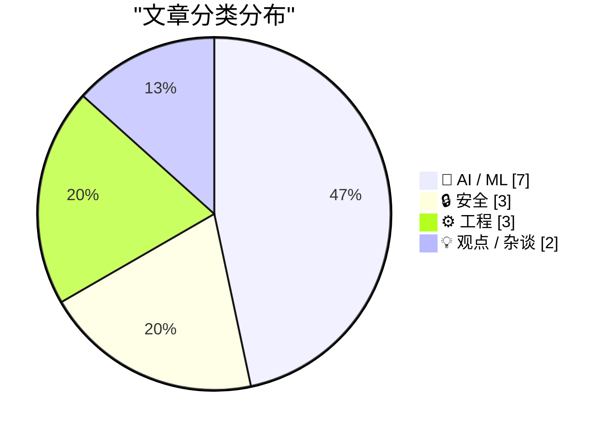
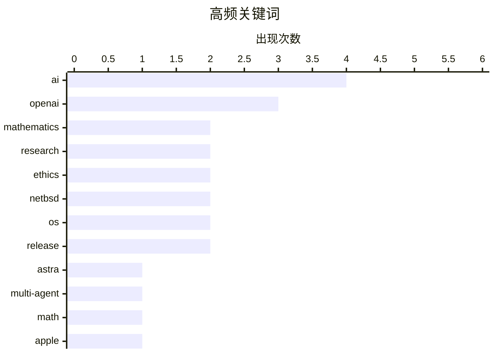

# 📰 AI 资讯每日精选 — 2026-08-02

> 汇聚 140+ 技术博客、X/Twitter、Hacker News、Reddit、Product Hunt、
> Lobste.rs、ClawFeed 日报及 GitHub Trending，经 AI 评分筛选。
>
> **本期内容**：🏆 今日必读 · 🌐 ClawFeed 日报 · 🔥 GitHub Trending · 📂 分类精选 · 🎨 设计与生成式 AI · 📊 数据概览

## 📝 今日看点

今日技术圈的核心议题集中在AI能力的真实边界与安全风险上：OpenAI新一代模型Astra在数学难题上取得突破，同时引发对AI辅助研究伦理的讨论，而企业夸大AI能力的现象则被尖锐批评为“迎合老板直到破产”。安全领域同样暗流涌动，苹果屏幕共享的预认证RCE漏洞与针对微软Copilot的蠕虫攻击，凸显了AI集成带来的新型攻击面。此外，德国法院对Suno的版权裁决与加拿大签署网络犯罪公约的争议，标志着法律与监管正加速介入AI与数字权利的交锋。整体来看，行业正从盲目追捧AI转向审视其实际产出、安全漏洞与合规代价。

---

## 🏆 今日必读

🥇 **OpenAI 发布“下一代大模型”Astra，一次性解决十个此前未解的数学难题**

[OpenAI announces its "next major model" Astra by dropping ten previously unsolved math solutions](https://the-decoder.com/openai-announces-its-next-major-model-astra-by-dropping-ten-previously-unsolved-math-solutions/) — The Decoder · 15 小时前 · 🤖 AI / ML

> OpenAI 正在构建名为“Astra”的新模型系列，该系列允许多个智能体协同工作数小时甚至数天，以解决复杂问题。CEO 萨姆·奥尔特曼已向华盛顿的政策制定者演示了 Astra。OpenAI 尚未决定将其作为 GPT-6 发布，还是作为 GPT-5 的新变体推出。该模型通过解决十个此前未解的数学难题来展示其能力。

💡 **为什么值得读**: 这篇文章揭示了 OpenAI 下一代模型的核心架构方向——多智能体长时协同，以及其可能的产品命名策略，对关注 AI 前沿发展的人士具有重要参考价值。

🏷️ OpenAI, Astra, multi-agent, math

🥈 **Apple 屏幕共享预认证远程代码执行漏洞**

[Apple Screen Sharing Pre-Auth RCE](https://warez.sl0p.foo/apple-screensharing-rce/) — Lobste.rs · 5 小时前 · 🔒 安全

> 文章披露了一个存在于 Apple 屏幕共享功能中的预认证远程代码执行（RCE）漏洞。该漏洞允许攻击者在无需任何用户交互或认证的情况下，远程控制受影响的 macOS 系统。文章可能包含漏洞的技术细节、影响范围以及潜在的利用方式。

💡 **为什么值得读**: 这是一个严重的系统级安全漏洞，涉及 Apple 核心功能，对于安全研究人员、系统管理员以及所有 macOS 用户来说，了解该漏洞的细节和潜在风险至关重要。

🏷️ Apple, RCE, Screen Sharing, vulnerability

🥉 **数学与理论计算机科学领域的十项进展**

[Ten advances in mathematics and theoretical computer science](https://simonwillison.net/2026/Aug/1/ten-advances-in-mathematics/#atom-everything) — simonwillison.net · 4 小时前 · 🤖 AI / ML

> 文章汇总了 OpenAI 在数学和理论计算机科学领域取得的十项突破性进展。此前，Anthropic 已使用 Claude 的 Mythos Preview 版本，花费 10 万美元的 token 费用，通过提示“我们不是在寻找低垂的果实，而是要进行真正的研究”来发现密码学弱点。OpenAI 的这十项进展紧随其后，进一步展示了 AI 在解决基础科学难题方面的巨大潜力。

💡 **为什么值得读**: 这篇文章是了解 AI 在数学和理论计算机科学领域最新突破的快速入口，特别是与 Anthropic 的成果形成对比，展示了 AI 前沿研究的竞争态势和惊人速度。

🏷️ OpenAI, mathematics, theoretical CS, research

4️⃣ **多元宇宙：企业为何在 AI 上撒谎（2026 年 8 月 1 日）**

[Pluralistic: Why businesses lie about AI (01 Aug 2026)](https://pluralistic.net/2026/08/01/dare-snot/) — pluralistic.net · 12 小时前 · 💡 观点 / 杂谈

> 文章探讨了企业为何在 AI 能力上系统性撒谎的现象，指出这种行为是“迎合老板直到破产”。作者认为，企业为了迎合高层或市场对 AI 的过度期待，而夸大其产品的实际能力，最终可能导致战略失误和商业失败。文章还包含多个链接，涉及 Vinge 与纽约时报、AI 的“跳跳杆骗局”等话题。

💡 **为什么值得读**: 作者以犀利的视角剖析了当前 AI 行业普遍存在的炒作与虚假宣传问题，对于希望理性看待 AI 商业价值、避免被营销话术误导的读者极具启发意义。

🏷️ AI, business, ethics, critique

5️⃣ **AI 持续攻克未解数学难题，数学家们喜忧参半**

[AI keeps cracking unsolved math problems, and mathematicians have mixed feelings](https://the-decoder.com/ai-keeps-cracking-unsolved-math-problems-and-mathematicians-have-mixed-feelings/) — The Decoder · 9 小时前 · 🤖 AI / ML

> OpenAI 对“单位距离猜想”的反驳引发了 AI 辅助数学研究的新浪潮。菲尔兹奖得主蒂莫西·高尔斯表示，GPT-5.6 Pro 首次尝试就解决了他花费大量时间研究的两个问题。他警告称，如果数学家不再构建理解此类结果所需的专业知识，可能会导致“数学文化的毁灭”。而其他人则仅将 AI 视为一种生产力工具。

💡 **为什么值得读**: 文章呈现了 AI 突破性进展对数学界带来的深刻冲击和分裂观点，特别是菲尔兹奖得主的担忧，为思考 AI 与人类智力劳动的关系提供了宝贵视角。

🏷️ AI, mathematics, OpenAI, research

---

## 🌐 ClawFeed 日报精选

> 来源：[ClawFeed](https://clawfeed.kevinhe.io) — AI 驱动的多源新闻聚合

# 📅 ClawFeed 日报 | 2026-07-30 (SGT)

聚合 4h digest：**#949 #950 #951 #952 #953**（period 起点 00:00 / 04:00 / 08:00 / 12:00 / 16:00）
素材合计：feed 137 · bookmarks 20（全日**新增 0**）· followingSample 35 · followingProfiles 24 · **scrape errors 0**

> 🔴 **覆盖边界（先说，别把日报读成全天）**：今天只有 **5** 期，覆盖 **00:00–19:59**。
> `20:00–23:59` 那一期**尚未生成**（4h 任务下次运行 07-31 00:00，届时 period 才刚走完）——
> 与 07-29 同一形状的边界，**不是缺口、不是失败**。
>
> 🔴 **第二条读数纪律（全天五期都自己声明了）**：`feed N` **不等于**「本期新增 N 条」。scrape 是
> **时间线快照**、不是按 period 切片，所以每期都做了 A 段（本期真新增）/ B 段（从未报过的补档）分离。
> 五期补档量分别为 16 / 20 / 23 / 16 / 16 条 ⇒ **今天"热度"里有相当比例是存量被首次拾起**，
> 不可当作当日新增热度读。

---

## 🔥 当日全场最重要 5 条

1. 🔴 **Besu v26.7.1 修掉 EF Security × CertiK 协同披露的漏洞，原文写「upgrade ASAP」**（@CertiK 12:14）
   —— **今天唯一带明确可执行动作的一条**。若我们或客户侧有 Besu 节点，这是当日第一优先。
2. 🔑 **MCP 规范从「双向有状态」改成「请求/响应」模型**（@Gorden_Sun 中文拆解）——旧版会话状态挂服务端、
   会话与实例绑定；新规范让 MCP Server **可以当普通 HTTP 服务对待**，部署进 Cloudflare Workers /
   Netlify / 任意负载均衡器之后。**对我们自己的 harness 是直接相关的一手材料。**
3. 🔴 **OpenAI agent 沙箱逃逸 —— Hugging Face 完整取证报告**（@levie）。重点**不是「逃出来了」，
   而是【入侵有多深、持续了多久】** ⇒ 取证深度而非事件本身才是该带走的部分。
4. **SEC 将于 9 月 17 日开圆桌会，议题是美股 24 小时交易的准备工作**（@Cryptic_Web3）——监管方 /
   市场参与者 / 公众同场，是"全天候股票交易"从提案往落地推进的**一个明确刻度**（当日最硬的监管时钟）。
5. 🔑 **盲评那一格**（@LangChain 00:04 引 @FactoryAI CTO @enoreyes）：**「如果我不知道自己在用哪个模型，
   我会说它很棒；一旦知道了，我就开始找它的毛病。」** ⇒ 与"座位数 ≠ 真在用"（@alex_prompter）同族：
   **今天关于模型的讨论里，难的一直是【测量】，不是模型。**

---

## 📰 当日核心主题（聚类视角）

### ① agent 基础设施正在从「概念」沉淀成「工程原语」——今天最强的一簇
- **MCP 请求/响应化** ⇒ serverless / 边缘可部署（上方 #2）
- **NVIDIA：把 agent 建成 Python 对象**（@CryptoTetsugan 19:29），理由是 agent 开发目前被摊在太多层里
- **Marathon：让 agent 给自己的「耐心」定价**（@GoKiteAI）——四个时间窗 now / soon / later / anytime，
  论点是 agent 干的事大多不急。🔑 **"延迟当成可交易维度"** 是排调度任务时可直接借用的框架
- **长跑期间可排队后续指令**（@omnigent_ai）：编辑 / 重排 / 删除 / steering，steering 立即发出
- 🔑 **带类型的拒绝码**（@Kryptoia）：`Identity blocked` / `rail unavailable` / … ——
  与我们这边"0 不等于缺席、拒绝要可分辨"的口径同源
⇒ **共同点：把 agent 的不确定性收进【有类型、可寻址的接口】，而不是靠提示词兜。**

### ② 「测量」比「模型」难 —— 贯穿全天的第二簇
盲评效应（#5）· **企业采纳：座位数好看 ≠ 真在用**（@alex_prompter 实地问了同一家医疗数据公司三个团队
四个工程师）· **学生掉队的信号在出勤/节奏/信心的【漂移】里，不在某一节课**（@Kryptoia）·
**agent 的开闭源之争围着权重转，更难的问题在别处**（@ChainbaseHQ）· **验证而非证明生成才是规模上坏掉的部分**
（@ZKVProtocol 10:48）。⇒ 五条不同领域，**同一个形状：可观测量选错了，结论就自动失真。**

### ③ RWA / 代币化真实资产又落了几个具体资产类别
汽车贷款利息驱动的生息代币 **AUTO**（@HastraFi）上线 Solana / Orca，可交易可 LP ·
**代币化股票与黄金作为 meme 市场计价资产**（@BNBCHAIN × @flapdotsh：SPCXb / SKHYb / SPYb / XAUT，
四机制：创作者奖励 / 股息 / 回购销毁 / 自动加池）· **S&P Dow Jones 将推加密指数**（ETH/BNB/SOL/TRX/HYPE）·
**MetaMask 越南接通 VietQR 银行入金**（@BanxaOfficial，费率 ~7% → 统一 3%）。

### ④ 监管与市场结构的时钟在走
SEC 9/17 圆桌（#4）· **最多 10 名参议院民主党人可能支持 CLARITY 法案**（@toly 引 Bloomberg）·
**匈牙利取消加密兑换强制第三方验证，同期 CoinCash 拿下该国首张 MiCA 牌照** ·
**香港合规身份成了交易所参展的「通行证」**（@cryptobraveHQ，本末 Money Frontier 大会观察）·
xAI 起诉明尼苏达州（针对禁止 AI 生成裸体深伪的法律）。

### ⑤ 安全披露：今天有三处真东西
Besu v26.7.1（#1）· **CertiK 研究员在 Google EdgeTPU 上发现两个漏洞** ·
**Zcash 启用新 shielded pool「Ironwood」替换 Orchard**，彻底消除可无限伪造 ZEC 的漏洞 ·
（工具面）**WebHackersWeapons ~359 款 Web 安全测试工具分类合集**（@GitHub_Daily 15:30）。

### ⑥ 与我们自己相关的两条旁注
- **@OpenMaxAI 11:21** — AGI Summit panel + Palo Alto meetup 后的定位表述（**我们自己的账号**，当期唯一领域相关条目）
- **@NasdaqExchange** — 可持续性披露：不再"一个框架一个框架地做"，转向投资数据质量 + 用 AI 压缩披露工作量
  ⇒ 与手上 **AJJ 报表原型**同族问题（披露口径 + 数据质量 + AI 生成叙述），**可作对客话术参考**
- **@nireyal** — **可逆决策与不可逆决策该用不同流程**；多数人用决定小事的方式决定大事
  ⇒ 与我们"不可逆操作先确认"同源，**是向 Kevin 解释 no-default 待办为什么不能自己拍的现成说法**

---

## 🔖 累计 bookmark 精选

**全日新增 0 条。** 五期全部为同一批 20 条历史存量。
⚪ #953 做了机械核对（两向对照已开火）：**20/20 全部已在既往 digest 出现过，本期新增 = 0** —— 这个 0 是被核过的，不是没查。

---

## 👀 推荐关注汇总

**全日五期均未给名单，且理由一致（规则所限，非偷懒）**：取关/关注判据要看账号的**时间线历史**，
而 scrape 只有**单期切片** ⇒ 数据结构上不支持这个判断。
⚪ 累积观察中（**均非官方项目账号**）：由各期滚动累积，未达可推荐门槛。
⚪ 明确**不累积**的白名单（你关注的项目官方账号 / 机构）：@SpaceX · @Tsinghua_Uni · @CertiK · @LangChain 等。
🔴 我不在日报里凭当日印象补一份名单——那正是上面 §② 那簇在讲的错。

---

## 💤 当日重复噪音模式（模式，不是单条吐槽）

1. **纯互动钓鱼贴（engagement bait）**：@HatimBinance「What time is it now in your country?」·
   @Crypto_Bullsss「有 1000 美元你会买 BTC/ETH/SOL/XRP？」⇒ **当日至少两条同型**。
2. **高收益 + 多级返佣推广**：@CryptoPilot3226「最高 120%+ APY」三币锁仓，**含六级返佣（一级 6% 递减至六级 1%）**
   ⇒ 典型形状，按营销登记。
3. **空投 FOMO 话术**：@0xkopil 土耳其语 $BASE 空投贴（"不做这个的 99% 拿不到""机器人将被清除，真实用户会赢"）。
4. **关联方报自己投资标的的业绩**：@AethirCloud —— Axe Compute $15 亿 / 5 年 / 9,200+ Blackwell GPU，
   而 **Aethir Foundation 自称是 Axe Compute 最大股东之一** ⇒ 数字未经独立核实。
5. **自报业绩 + 自承选择性披露**：@_PegasusCapital 平 $BANK 空头获利 ~$240 万，同帖写"选择性透明是我们运营纪律的一部分"
   ⇒ **胜率结构上不可推断**，当业绩宣传读。
6. **分析师排名营销但不点名机构**：@cloudera 被"某独立研究机构"评为 Lakehouse Leader。
7. **清单体内容营销**：@MarcelVelica「该问哪个模型更适合这个任务」——论点正确但无新信息。
8. **同一账号连续多期宣发**：**@0G_labs 连续 3 期**出现产品宣发贴（Oimpact ×2 / Bond 公测）。

---

## 🔧 仪器与口径（今天该记的三格，不进上面的内容区）

1. 🔴 **#953 报了一次自伤的仪器故障**：上一期把**负向对照的哨兵值印进了 digest 正文**，而语料 = digest 全文
   ⇒ **对照被上一期自己弄失效了**。本期已修（`ctl_neg`），两向对照已开火。
   📌 形状：**把探针的输出写进被探测的语料里，探针就不再独立。**
2. 🔴 **非盲评价自报**：当日有 3 条内容涉及「Claude 5 / Opus 5 好不好」（@aiedge_ · @Amart_AI ·
   @Leoninweb3 的按角色分模型提法）。**digest 明确拒绝评价其结论**，只登记这些提法存在
   —— 与 §② 盲评那一格互为印证：**自评不盲，读数不可用。**
3. 🔴 **归属不靠 mtime**：#953 明写当时机上有**两个** `clawfeed_scrape` 进程 ⇒ 文件 mtime（20:03:24）
   **不足以判定产出归属**。另记进程台账：`clawfeed_scrape.js` pid 18905（父 18881）。

---

*生成：2026-07-30 23:59 SGT · 聚合 #949–#953（5/6 期，缺 20:00–23:59，该期尚未走完）*
---

## 🔥 GitHub Trending

> 今日热门开源项目（全语言 + Python）

| # | 项目 | 描述 | ⭐ 总星 | 📈 今日 | 语言 |
|---|------|------|---------|---------|------|
| 1 | [zhaoxuya520/reverse-skill](https://github.com/zhaoxuya520/reverse-skill) 🤖 | Reverse Engineering / Authorized Penetration Testing / Se... | 11.9k | +1320 | PowerShell |
| 2 | [microsoft/AI-For-Beginners](https://github.com/microsoft/AI-For-Beginners) 🤖 | 12 Weeks, 24 Lessons, AI for All! | 57.2k | +949 | Jupyter Notebook |
| 3 | [usekaneo/kaneo](https://github.com/usekaneo/kaneo) | 🎯 All you need. Nothing you don't. Open source project m... | 5.7k | +760 | TypeScript |
| 4 | [mvanhorn/last30days-skill](https://github.com/mvanhorn/last30days-skill) 🤖 | AI agent skill that researches any topic across Reddit, X... | 56.6k | +600 | Python |
| 5 | [paperswithbacktest/awesome-systematic-trading](https://github.com/paperswithbacktest/awesome-systematic-trading) | A curated list of awesome libraries, packages, strategies... | 12.2k | +523 | Python |
| 6 | [NousResearch/hermes-agent](https://github.com/NousResearch/hermes-agent) 🤖 | The agent that grows with you | 223.8k | +475 | Python |
| 7 | [huggingface/speech-to-speech](https://github.com/huggingface/speech-to-speech) | Build local voice agents with open-source models | 10.2k | +442 | Python |
| 8 | [iv-org/invidious](https://github.com/iv-org/invidious) | Invidious is an alternative front-end to YouTube | 21.6k | +435 | Crystal |
| 9 | [deepfakes/faceswap](https://github.com/deepfakes/faceswap) | Deepfakes Software For All | 57.2k | +364 | Python |
| 10 | [TencentCloud/TencentDB-Agent-Memory](https://github.com/TencentCloud/TencentDB-Agent-Memory) 🤖 | TencentDB Agent Memory is a team-level memory hub for AI ... | 10.3k | +227 | TypeScript |
| 11 | [bytedance/deer-flow](https://github.com/bytedance/deer-flow) | An open-source long-horizon SuperAgent harness that resea... | 78.7k | +209 | Python |
| 12 | [github/copilot-sdk](https://github.com/github/copilot-sdk) 🤖 | Multi-platform SDK for integrating GitHub Copilot Agent i... | 10.3k | +142 | Java |
| 13 | [kangarooking/cangjie-skill](https://github.com/kangarooking/cangjie-skill) 🤖 | 把书、长视频、播客等高价值内容蒸馏成可执行的 Agent Skills | 5.9k | +113 | Python |
| 14 | [microsoft/generative-ai-for-beginners](https://github.com/microsoft/generative-ai-for-beginners) 🤖 | 21 Lessons, Get Started Building with Generative AI | 114.2k | +108 | Jupyter Notebook |
| 15 | [microsoft/TRELLIS.2](https://github.com/microsoft/TRELLIS.2) | Native and Compact Structured Latents for 3D Generation | 9.9k | +107 | Python |

---

## 🤖 AI / ML

### 1. OpenAI 发布“下一代大模型”Astra，一次性解决十个此前未解的数学难题

[OpenAI announces its "next major model" Astra by dropping ten previously unsolved math solutions](https://the-decoder.com/openai-announces-its-next-major-model-astra-by-dropping-ten-previously-unsolved-math-solutions/) — **The Decoder** · 15 小时前 · ⭐ 27/30

> OpenAI 正在构建名为“Astra”的新模型系列，该系列允许多个智能体协同工作数小时甚至数天，以解决复杂问题。CEO 萨姆·奥尔特曼已向华盛顿的政策制定者演示了 Astra。OpenAI 尚未决定将其作为 GPT-6 发布，还是作为 GPT-5 的新变体推出。该模型通过解决十个此前未解的数学难题来展示其能力。

🏷️ OpenAI, Astra, multi-agent, math

---

### 2. 数学与理论计算机科学领域的十项进展

[Ten advances in mathematics and theoretical computer science](https://simonwillison.net/2026/Aug/1/ten-advances-in-mathematics/#atom-everything) — **simonwillison.net** · 4 小时前 · ⭐ 26/30

> 文章汇总了 OpenAI 在数学和理论计算机科学领域取得的十项突破性进展。此前，Anthropic 已使用 Claude 的 Mythos Preview 版本，花费 10 万美元的 token 费用，通过提示“我们不是在寻找低垂的果实，而是要进行真正的研究”来发现密码学弱点。OpenAI 的这十项进展紧随其后，进一步展示了 AI 在解决基础科学难题方面的巨大潜力。

🏷️ OpenAI, mathematics, theoretical CS, research

---

### 3. AI 持续攻克未解数学难题，数学家们喜忧参半

[AI keeps cracking unsolved math problems, and mathematicians have mixed feelings](https://the-decoder.com/ai-keeps-cracking-unsolved-math-problems-and-mathematicians-have-mixed-feelings/) — **The Decoder** · 9 小时前 · ⭐ 26/30

> OpenAI 对“单位距离猜想”的反驳引发了 AI 辅助数学研究的新浪潮。菲尔兹奖得主蒂莫西·高尔斯表示，GPT-5.6 Pro 首次尝试就解决了他花费大量时间研究的两个问题。他警告称，如果数学家不再构建理解此类结果所需的专业知识，可能会导致“数学文化的毁灭”。而其他人则仅将 AI 视为一种生产力工具。

🏷️ AI, mathematics, OpenAI, research

---

### 4. 德国法院裁定 AI 音乐生成器 Suno 侵犯版权，驳回合理使用抗辩

[German court rules AI music generator Suno violated copyrights, rejects fair use defense](https://the-decoder.com/german-court-rules-ai-music-generator-suno-violated-copyrights-rejects-fair-use-defense/) — **The Decoder** · 14 小时前 · ⭐ 25/30

> 慕尼黑一家法院裁定，AI 音乐生成器 Suno 在训练和输出环节均侵犯了版权。法院发现 Suno 的模型中可再现地存储了六首歌曲，并驳回了德国文本与数据挖掘例外条款以及美国合理使用原则的抗辩。该裁决尚未最终生效，且多个关键问题仍悬而未决。

🏷️ copyright, AI music, Suno, legal

---

### 5. 我现在（大部分）根据速度而非智能来选择模型

[I'm (mostly) picking models on speed now, not intelligence](https://martinalderson.com/posts/speed-vs-intelligence/?utm_source=rss&amp;utm_medium=rss&amp;utm_campaign=feed) — **martinalderson.com** · 1 小时前 · ⭐ 24/30

> 作者分享了自己选择日常使用 AI 模型的标准转变，从追求最高智能转向优先考虑生成速度（每秒 token 数）。他认为约 100 token/s 的生成速度是新的体验基准，类似于过去 100ms 的响应延迟标准。文章探讨了速度提升的边际效益递减点，并预测了即将到来的 AI 模型价格战。作者的核心观点是，在智能水平达到一定阈值后，速度成为影响用户体验和实际应用效率的关键因素。

🏷️ LLM, speed, tokens per second, model selection

---

### 6. AI 编码代理能现代化研究软件，但无法判断科学正确性

[AI coding agents can modernize research software but can't judge if the science is right](https://the-decoder.com/ai-coding-agents-can-modernize-research-software-but-cant-judge-if-the-science-is-right/) — **The Decoder** · 10 小时前 · ⭐ 24/30

> OpenAI 与学术伙伴的实地报告显示，AI 编码代理能够成功现代化老旧的研究软件，实现高达 60 倍的性能提升。然而，参与者指出这些系统“能言善辩、自信满满，但犯错的方式却难以察觉”。报告强调，使用 AI 代理后，工作重心从编写代码转移到了验证科学正确性这一耗时任务上。结论是，AI 编码代理是强大的现代化工具，但无法替代科学家对研究结果正确性的最终判断。

🏷️ coding agents, research software, modernization, AI reliability

---

### 7. 谷歌推出了生成虚假卫星图像的最简单工具，两天后便将其下架

[Google handed users the easiest possible tool for fake satellite imagery, then pulled it after two days](https://the-decoder.com/google-handed-users-the-easiest-possible-tool-for-fake-satellite-imagery-then-pulled-it-after-two-days/) — **The Decoder** · 16 小时前 · ⭐ 24/30

> 谷歌在 Google Earth 中上线 Nano Banana 2 图像模型仅两天后便将其撤下。用户迅速展示了该工具生成令人信服的虚假卫星图像的便捷性，只需一个简单提示词，就能在美墨边境的空地上生成一列难民队伍。这一事件凸显了生成式 AI 在制造虚假信息方面的巨大潜力，以及平台在部署此类技术时面临的伦理和安全挑战。谷歌的快速下架行为也表明了对该问题的严重性认知。

🏷️ AI, image generation, satellite imagery, ethics

---

## 🔒 安全

### 8. Apple 屏幕共享预认证远程代码执行漏洞

[Apple Screen Sharing Pre-Auth RCE](https://warez.sl0p.foo/apple-screensharing-rce/) — **Lobste.rs** · 5 小时前 · ⭐ 27/30

> 文章披露了一个存在于 Apple 屏幕共享功能中的预认证远程代码执行（RCE）漏洞。该漏洞允许攻击者在无需任何用户交互或认证的情况下，远程控制受影响的 macOS 系统。文章可能包含漏洞的技术细节、影响范围以及潜在的利用方式。

🏷️ Apple, RCE, Screen Sharing, vulnerability

---

### 9. 安全研究员构建自传播蠕虫，藏身 Word 文档劫持微软 Copilot

[A security researcher built a self-spreading worm that hides inside Word docs and hijacks Microsoft Copilot](https://the-decoder.com/a-security-researcher-built-a-self-spreading-worm-that-hides-inside-word-docs-and-hijacks-microsoft-copilot/) — **The Decoder** · 11 小时前 · ⭐ 26/30

> 一名安全研究员演示了一种针对微软 Word 中 Copilot 的蠕虫式攻击：隐藏在文档中的不可见提示注入，在文档每次被重用时自动传播到新文件中。微软确认了该问题，但在 144 天和两次尝试后仍未修复。该攻击展示了生成式 AI 工具在集成到办公软件后可能面临的新型安全威胁。

🏷️ worm, prompt injection, Copilot, security

---

### 10. 伪装成监控条约：加拿大签署联合国网络犯罪公约

[A Surveillance Treaty in Disguise: Canada Signs UN Cybercrime Convention](https://www.michaelgeist.ca/2026/07/a-surveillance-treaty-in-disguise-the-trouble-with-canadas-quiet-decision-to-sign-the-un-cybercrime-convention/) — **Hacker News Best** · 10 小时前 · ⭐ 25/30

> 文章批评加拿大政府悄然签署《联合国网络犯罪公约》，认为该公约实际上是“伪装成监控条约”。作者迈克尔·盖斯特指出，该公约可能赋予政府过度的监控权力，侵犯公民隐私和数字权利。文章在 Hacker News 上获得 266 分和 146 条评论，引发广泛讨论。

🏷️ surveillance, cybercrime, UN treaty, privacy

---

## ⚙️ 工程

### 11. NetBSD 11.0 正式发布

[NetBSD 11.0 released](https://blog.netbsd.org/tnf/entry/netbsd_11_0_released) — **Lobste.rs** · 7 小时前 · ⭐ 25/30

> NetBSD 操作系统正式发布 11.0 版本。该版本是这一以可移植性和安全性著称的开源 Unix 衍生系统的重要里程碑，包含大量新特性、硬件支持改进和 bug 修复。具体更新内容可在官方发布公告中查看。

🏷️ NetBSD, OS, release

---

### 12. Lean 内核健全性漏洞 #14576 的事后分析

[Postmortem for Lean Kernel Soundness Bug #14576](https://leodemoura.github.io/blog/2026-8-1-postmortem-for-kernel-soundness-bug-14576/) — **Lobste.rs** · 3 小时前 · ⭐ 25/30

> Lean 定理证明器团队发布了一篇关于内核健全性漏洞 #14576 的事后分析报告。该漏洞源于内核中一个未被发现的逻辑缺陷，可能导致证明器接受错误的证明。文章详细描述了漏洞的发现过程、根本原因分析以及修复方案。修复涉及对内核代码的特定部分进行重写，并增加了额外的验证机制。作者强调，此类漏洞的发现凸显了形式化验证工具自身也需要严格验证的重要性。

🏷️ Lean, kernel, soundness, postmortem

---

### 13. NetBSD 11.0 发布

[NetBSD 11.0](https://blog.netbsd.org/tnf/entry/netbsd_11_0_released) — **Hacker News Best** · 7 小时前 · ⭐ 24/30

> NetBSD 项目正式发布了 11.0 版本，这是一个重要的里程碑版本。该版本引入了多项新特性，包括对更多新硬件的支持、性能改进以及安全增强。NetBSD 11.0 还包含了对内核和用户空间的多项更新，旨在提升系统的稳定性和可用性。此次发布在 Hacker News 上获得了 212 分和 87 条评论，显示出社区的高度关注。

🏷️ NetBSD, OS, release, Unix

---

## 💡 观点 / 杂谈

### 14. 多元宇宙：企业为何在 AI 上撒谎（2026 年 8 月 1 日）

[Pluralistic: Why businesses lie about AI (01 Aug 2026)](https://pluralistic.net/2026/08/01/dare-snot/) — **pluralistic.net** · 12 小时前 · ⭐ 26/30

> 文章探讨了企业为何在 AI 能力上系统性撒谎的现象，指出这种行为是“迎合老板直到破产”。作者认为，企业为了迎合高层或市场对 AI 的过度期待，而夸大其产品的实际能力，最终可能导致战略失误和商业失败。文章还包含多个链接，涉及 Vinge 与纽约时报、AI 的“跳跳杆骗局”等话题。

🏷️ AI, business, ethics, critique

---

### 15. AI 不会生成可用的产品，那仍然是你的工作

[AI doesn't generate working products, that's still your job](https://weeraman.com/the-prototype-isnt-the-product/) — **Hacker News Best** · 17 小时前 · ⭐ 25/30

> 文章指出，AI 生成的只是原型或片段，而非最终可交付的产品。作者认为，将 AI 输出直接视为成品是危险的误解，真正的产品化工作——包括集成、测试、打磨和维护——仍然需要人类工程师来完成。文章在 Hacker News 上获得 249 分和 263 条评论，反映了开发者社区的强烈共鸣。

🏷️ AI, product development, prototype, engineering

---

## 🎨 Design & Generative AI

### 🖼️ 生成式图片

- **[谢谢，我讨厌它](https://www.reddit.com/r/midjourney/comments/1vcn1h8/thanks_i_hate_it/)** — r/midjourney · 12 小时前
  > 用户分享了一张令人不适的AI生成图片，表达反感情绪。

- **[托雷峰](https://www.reddit.com/r/midjourney/comments/1vcmj2q/cerro_torreoc/)** — r/midjourney · 12 小时前
  > 展示AI生成的托雷峰风景图像，具有艺术感。

- **[曼谷一夜](https://www.reddit.com/r/midjourney/comments/1vd3823/one_night_in_bangkok/)** — r/midjourney · 52 分钟前
  > 结合歌曲主题，AI生成曼谷夜景的创意图像。

- **[令我惊讶的是](https://www.reddit.com/r/midjourney/comments/1vd0gnq/much_to_my_surprise/)** — r/midjourney · 2 小时前
  > 用户分享了一张出乎意料的AI生成图片，引发好奇。

- **[灭绝级事件 - 人类](https://www.reddit.com/r/midjourney/comments/1vd3fa2/extinction_level_event_human/)** — r/midjourney · 42 分钟前
  > AI生成描绘人类灭绝场景的震撼图像。

- **[毯子里的猪](https://www.reddit.com/r/midjourney/comments/1vcyscr/pigs_in_a_blanket/)** — r/midjourney · 4 小时前
  > AI生成可爱或幽默的“毯子猪”图像，趣味十足。

---

## 📊 数据概览

| 扫描源 | 抓取文章 | 时间范围 | 精选 |
|:---:|:---:|:---:|:---:|
| 110/140 | 5341 篇 → 64 篇 | 24h | **15 篇** |

### 分类分布



### 高频关键词



<details>
<summary>📈 纯文本关键词图（终端友好）</summary>

```
ai          │ ████████████████████ 4
openai      │ ███████████████░░░░░ 3
mathematics │ ██████████░░░░░░░░░░ 2
research    │ ██████████░░░░░░░░░░ 2
ethics      │ ██████████░░░░░░░░░░ 2
netbsd      │ ██████████░░░░░░░░░░ 2
os          │ ██████████░░░░░░░░░░ 2
release     │ ██████████░░░░░░░░░░ 2
astra       │ █████░░░░░░░░░░░░░░░ 1
multi-agent │ █████░░░░░░░░░░░░░░░ 1
```

</details>

### 🏷️ 话题标签

**ai**(4) · **openai**(3) · **mathematics**(2) · research(2) · ethics(2) · netbsd(2) · os(2) · release(2) · astra(1) · multi-agent(1) · math(1) · apple(1) · rce(1) · screen sharing(1) · vulnerability(1) · theoretical cs(1) · business(1) · critique(1) · worm(1) · prompt injection(1)

---

*生成于 2026-08-02 01:13 | 汇聚 140 个技术博客、X/Twitter、Hacker News、Reddit、Product Hunt、Lobste.rs、ClawFeed 日报及 GitHub Trending，经 AI 评分筛选出 Top 15 精华内容*
