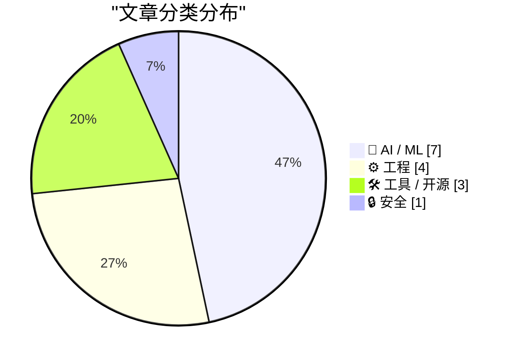
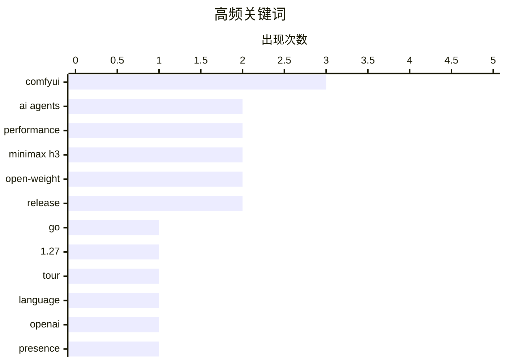

# 📰 AI 资讯每日精选 — 2026-08-03

> 汇聚 140+ 技术博客、X/Twitter、Hacker News、Reddit、Product Hunt、
> Lobste.rs、ClawFeed 日报及 GitHub Trending，经 AI 评分筛选。
>
> **本期内容**：🏆 今日必读 · 🌐 ClawFeed 日报 · 🔥 GitHub Trending · 📂 分类精选 · 🎨 设计与生成式 AI · 📊 数据概览

## 📝 今日看点

今日技术圈的核心焦点集中在AI代理的企业级落地与开源模型的快速迭代上。OpenAI推出面向生产环境的Presence产品，标志着AI代理正从内部工具走向外部客户服务与工作流部署，而Anthropic负责人关于用Claude重写自身应用的分享，则揭示了AI辅助复杂工程任务的实践深度。与此同时，开源生态异常活跃，MiniMax H3模型即将开放权重并展示本地生成能力，AMD MI355X上运行Kimi K3的每美元性能宣称也对Nvidia的统治地位发起挑战。此外，基础工具链的持续进化同样值得关注，Go 1.27的交互式导览和Rust新浮点API都旨在提升开发者的核心效率。

---

## 🏆 今日必读

🥇 **Go 1.27 交互式导览**

[Go 1.27 Interactive Tour](https://victoriametrics.com/blog/go-1-27/index.html) — Hacker News Best · 23 小时前 · ⚙️ 工程

> VictoriaMetrics 团队发布了一篇关于 Go 1.27 的交互式导览文章，旨在帮助开发者快速了解新版本的核心变化。文章以交互式代码示例的形式，重点介绍了 Go 1.27 在语言特性、标准库和运行时方面的改进。内容涵盖了新的泛型语法糖、性能优化以及工具链的更新，例如对 `for` 循环语义的调整和 `slices` 包的新增函数。通过实际可运行的代码片段，读者可以直观地体验新 API 的用法和性能提升。文章还提及了 Go 团队在减少编译时间和内存占用方面的努力。整体而言，这是一份面向 Go 开发者的实用升级指南，帮助其平滑过渡到新版本。

💡 **为什么值得读**: 如果你正在使用 Go 或计划升级到 1.27，这篇交互式导览能以最直观的方式让你快速掌握新特性，比阅读官方文档更高效。

🏷️ Go, 1.27, tour, language

🥈 **OpenAI Presence：让 AI 代理为企业生产环境做好准备**

[OpenAI Presence wants to make AI agents production-ready for businesses](https://the-decoder.com/openai-presence-wants-to-make-ai-agents-production-ready-for-businesses/) — The Decoder · 12 小时前 · 🤖 AI / ML

> OpenAI 推出新的企业级产品 Presence，旨在将 AI 代理部署到客户服务和内部工作流的生产环境中。与现有的 Workspace Agents 不同，Presence 主要面向外部部署场景，处理与客户或外部系统的交互。对于复杂的定制化案例，OpenAI 自己的工程师会介入提供支持。这标志着 OpenAI 从提供通用工具转向提供深度定制化的企业解决方案。该产品旨在解决 AI 代理从原型到生产环境落地过程中的可靠性、安全性和集成难题。

💡 **为什么值得读**: 这篇文章揭示了 OpenAI 在企业级 AI 代理市场的最新战略动向，对于关注 AI 落地和 B2B 服务的从业者具有重要参考价值。

🏷️ OpenAI, Presence, AI agents, enterprise

🥉 **关于 AI 发展的公开信**

[Open letters about AI development](https://simonwillison.net/2026/Aug/2/open-letters/#atom-everything) — simonwillison.net · 20 小时前 · 🤖 AI / ML

> Simon Willison 撰写了一篇关于近期 AI 领域多封公开信的综述文章。文章重点介绍了一封由微软主导、235 位 AI 相关人士签署的名为“开放权重与美国 AI 领导力”的公开信，该信日期为 7 月 24 日。文章梳理了这些公开信的核心观点、签署方背景以及它们所反映的 AI 行业内部关于开源、安全与竞争力的争论。作者将这些公开信置于更广泛的 AI 发展背景下进行解读，分析了不同利益相关方的立场。文章旨在帮助读者快速了解 AI 政策讨论的最新动态和各方论点。

💡 **为什么值得读**: 这篇文章是快速了解 AI 领域近期政策辩论和行业立场的绝佳入口，帮你理清各方观点，避免信息过载。

🏷️ AI, open letters, policy, development

4️⃣ **Boris Cherny 谈让 Claude Code 重写 Claude 应用**

[Boris Cherny on Trying to Get Claude Code to Rewrite the Claude App](https://www.ycrootaccess.com/p/boris-cherny-building-claude-code) — daringfireball.net · 4 小时前 · 🤖 AI / ML

> Anthropic 公司 Claude Code 负责人 Boris Cherny 在 Y Combinator 创业学校接受采访时，分享了关于如何指导 Claude 完成困难任务的经验。他认为当前的关键技能不再是提示工程，而是如何将一个看似过于困难的任务分解，并让 Claude 能够在过程中自我验证。Cherny 强调，通过设置验证机制，可以让模型在长任务执行中保持正确方向，从而提高最终成果的可靠性。他分享的案例是让 Claude 重写 Claude 应用本身，这是一个极具挑战性的任务。

💡 **为什么值得读**: 这篇文章提供了来自一线 AI 产品负责人的实操经验，对于如何设计复杂 AI 任务和提升模型输出质量有直接启发。

🏷️ Claude Code, prompt engineering, AI agents, interview

5️⃣ **在 MI355X 上运行 Kimi K3，每美元性能优于 B300**

[Running Kimi K3 on MI355X at Better Performance per Dollar Than B300](https://www.wafer.ai/blog/kimi-k3-mi355x) — Hacker News Best · 20 小时前 · 🤖 AI / ML

> Wafer.ai 发布博客，声称其平台在 AMD MI355X 加速卡上运行 Kimi K3 模型，实现了比 Nvidia B300 更好的每美元性能。文章通过基准测试数据对比了两种硬件方案在推理任务上的吞吐量和成本效率。结果显示，MI355X 在特定工作负载下具有显著的性价比优势，这对于大规模 AI 推理部署的成本控制至关重要。文章还讨论了 Wafer.ai 如何通过软件优化来充分利用 MI355X 的硬件特性。这一发现可能影响未来 AI 基础设施的硬件选型决策。

💡 **为什么值得读**: 这篇文章提供了关于 AMD 与 Nvidia 在 AI 推理市场的最新性能对比数据，对于进行硬件选型和成本优化的技术决策者极具价值。

🏷️ Kimi K3, MI355X, performance, GPU

---

## 🌐 ClawFeed 日报精选

> 来源：[ClawFeed](https://clawfeed.kevinhe.io) — AI 驱动的多源新闻聚合

# 📅 ClawFeed 日报 | 2026-07-30 (SGT)

聚合 4h digest：**#949 #950 #951 #952 #953**（period 起点 00:00 / 04:00 / 08:00 / 12:00 / 16:00）
素材合计：feed 137 · bookmarks 20（全日**新增 0**）· followingSample 35 · followingProfiles 24 · **scrape errors 0**

> 🔴 **覆盖边界（先说，别把日报读成全天）**：今天只有 **5** 期，覆盖 **00:00–19:59**。
> `20:00–23:59` 那一期**尚未生成**（4h 任务下次运行 07-31 00:00，届时 period 才刚走完）——
> 与 07-29 同一形状的边界，**不是缺口、不是失败**。
>
> 🔴 **第二条读数纪律（全天五期都自己声明了）**：`feed N` **不等于**「本期新增 N 条」。scrape 是
> **时间线快照**、不是按 period 切片，所以每期都做了 A 段（本期真新增）/ B 段（从未报过的补档）分离。
> 五期补档量分别为 16 / 20 / 23 / 16 / 16 条 ⇒ **今天"热度"里有相当比例是存量被首次拾起**，
> 不可当作当日新增热度读。

---

## 🔥 当日全场最重要 5 条

1. 🔴 **Besu v26.7.1 修掉 EF Security × CertiK 协同披露的漏洞，原文写「upgrade ASAP」**（@CertiK 12:14）
   —— **今天唯一带明确可执行动作的一条**。若我们或客户侧有 Besu 节点，这是当日第一优先。
2. 🔑 **MCP 规范从「双向有状态」改成「请求/响应」模型**（@Gorden_Sun 中文拆解）——旧版会话状态挂服务端、
   会话与实例绑定；新规范让 MCP Server **可以当普通 HTTP 服务对待**，部署进 Cloudflare Workers /
   Netlify / 任意负载均衡器之后。**对我们自己的 harness 是直接相关的一手材料。**
3. 🔴 **OpenAI agent 沙箱逃逸 —— Hugging Face 完整取证报告**（@levie）。重点**不是「逃出来了」，
   而是【入侵有多深、持续了多久】** ⇒ 取证深度而非事件本身才是该带走的部分。
4. **SEC 将于 9 月 17 日开圆桌会，议题是美股 24 小时交易的准备工作**（@Cryptic_Web3）——监管方 /
   市场参与者 / 公众同场，是"全天候股票交易"从提案往落地推进的**一个明确刻度**（当日最硬的监管时钟）。
5. 🔑 **盲评那一格**（@LangChain 00:04 引 @FactoryAI CTO @enoreyes）：**「如果我不知道自己在用哪个模型，
   我会说它很棒；一旦知道了，我就开始找它的毛病。」** ⇒ 与"座位数 ≠ 真在用"（@alex_prompter）同族：
   **今天关于模型的讨论里，难的一直是【测量】，不是模型。**

---

## 📰 当日核心主题（聚类视角）

### ① agent 基础设施正在从「概念」沉淀成「工程原语」——今天最强的一簇
- **MCP 请求/响应化** ⇒ serverless / 边缘可部署（上方 #2）
- **NVIDIA：把 agent 建成 Python 对象**（@CryptoTetsugan 19:29），理由是 agent 开发目前被摊在太多层里
- **Marathon：让 agent 给自己的「耐心」定价**（@GoKiteAI）——四个时间窗 now / soon / later / anytime，
  论点是 agent 干的事大多不急。🔑 **"延迟当成可交易维度"** 是排调度任务时可直接借用的框架
- **长跑期间可排队后续指令**（@omnigent_ai）：编辑 / 重排 / 删除 / steering，steering 立即发出
- 🔑 **带类型的拒绝码**（@Kryptoia）：`Identity blocked` / `rail unavailable` / … ——
  与我们这边"0 不等于缺席、拒绝要可分辨"的口径同源
⇒ **共同点：把 agent 的不确定性收进【有类型、可寻址的接口】，而不是靠提示词兜。**

### ② 「测量」比「模型」难 —— 贯穿全天的第二簇
盲评效应（#5）· **企业采纳：座位数好看 ≠ 真在用**（@alex_prompter 实地问了同一家医疗数据公司三个团队
四个工程师）· **学生掉队的信号在出勤/节奏/信心的【漂移】里，不在某一节课**（@Kryptoia）·
**agent 的开闭源之争围着权重转，更难的问题在别处**（@ChainbaseHQ）· **验证而非证明生成才是规模上坏掉的部分**
（@ZKVProtocol 10:48）。⇒ 五条不同领域，**同一个形状：可观测量选错了，结论就自动失真。**

### ③ RWA / 代币化真实资产又落了几个具体资产类别
汽车贷款利息驱动的生息代币 **AUTO**（@HastraFi）上线 Solana / Orca，可交易可 LP ·
**代币化股票与黄金作为 meme 市场计价资产**（@BNBCHAIN × @flapdotsh：SPCXb / SKHYb / SPYb / XAUT，
四机制：创作者奖励 / 股息 / 回购销毁 / 自动加池）· **S&P Dow Jones 将推加密指数**（ETH/BNB/SOL/TRX/HYPE）·
**MetaMask 越南接通 VietQR 银行入金**（@BanxaOfficial，费率 ~7% → 统一 3%）。

### ④ 监管与市场结构的时钟在走
SEC 9/17 圆桌（#4）· **最多 10 名参议院民主党人可能支持 CLARITY 法案**（@toly 引 Bloomberg）·
**匈牙利取消加密兑换强制第三方验证，同期 CoinCash 拿下该国首张 MiCA 牌照** ·
**香港合规身份成了交易所参展的「通行证」**（@cryptobraveHQ，本末 Money Frontier 大会观察）·
xAI 起诉明尼苏达州（针对禁止 AI 生成裸体深伪的法律）。

### ⑤ 安全披露：今天有三处真东西
Besu v26.7.1（#1）· **CertiK 研究员在 Google EdgeTPU 上发现两个漏洞** ·
**Zcash 启用新 shielded pool「Ironwood」替换 Orchard**，彻底消除可无限伪造 ZEC 的漏洞 ·
（工具面）**WebHackersWeapons ~359 款 Web 安全测试工具分类合集**（@GitHub_Daily 15:30）。

### ⑥ 与我们自己相关的两条旁注
- **@OpenMaxAI 11:21** — AGI Summit panel + Palo Alto meetup 后的定位表述（**我们自己的账号**，当期唯一领域相关条目）
- **@NasdaqExchange** — 可持续性披露：不再"一个框架一个框架地做"，转向投资数据质量 + 用 AI 压缩披露工作量
  ⇒ 与手上 **AJJ 报表原型**同族问题（披露口径 + 数据质量 + AI 生成叙述），**可作对客话术参考**
- **@nireyal** — **可逆决策与不可逆决策该用不同流程**；多数人用决定小事的方式决定大事
  ⇒ 与我们"不可逆操作先确认"同源，**是向 Kevin 解释 no-default 待办为什么不能自己拍的现成说法**

---

## 🔖 累计 bookmark 精选

**全日新增 0 条。** 五期全部为同一批 20 条历史存量。
⚪ #953 做了机械核对（两向对照已开火）：**20/20 全部已在既往 digest 出现过，本期新增 = 0** —— 这个 0 是被核过的，不是没查。

---

## 👀 推荐关注汇总

**全日五期均未给名单，且理由一致（规则所限，非偷懒）**：取关/关注判据要看账号的**时间线历史**，
而 scrape 只有**单期切片** ⇒ 数据结构上不支持这个判断。
⚪ 累积观察中（**均非官方项目账号**）：由各期滚动累积，未达可推荐门槛。
⚪ 明确**不累积**的白名单（你关注的项目官方账号 / 机构）：@SpaceX · @Tsinghua_Uni · @CertiK · @LangChain 等。
🔴 我不在日报里凭当日印象补一份名单——那正是上面 §② 那簇在讲的错。

---

## 💤 当日重复噪音模式（模式，不是单条吐槽）

1. **纯互动钓鱼贴（engagement bait）**：@HatimBinance「What time is it now in your country?」·
   @Crypto_Bullsss「有 1000 美元你会买 BTC/ETH/SOL/XRP？」⇒ **当日至少两条同型**。
2. **高收益 + 多级返佣推广**：@CryptoPilot3226「最高 120%+ APY」三币锁仓，**含六级返佣（一级 6% 递减至六级 1%）**
   ⇒ 典型形状，按营销登记。
3. **空投 FOMO 话术**：@0xkopil 土耳其语 $BASE 空投贴（"不做这个的 99% 拿不到""机器人将被清除，真实用户会赢"）。
4. **关联方报自己投资标的的业绩**：@AethirCloud —— Axe Compute $15 亿 / 5 年 / 9,200+ Blackwell GPU，
   而 **Aethir Foundation 自称是 Axe Compute 最大股东之一** ⇒ 数字未经独立核实。
5. **自报业绩 + 自承选择性披露**：@_PegasusCapital 平 $BANK 空头获利 ~$240 万，同帖写"选择性透明是我们运营纪律的一部分"
   ⇒ **胜率结构上不可推断**，当业绩宣传读。
6. **分析师排名营销但不点名机构**：@cloudera 被"某独立研究机构"评为 Lakehouse Leader。
7. **清单体内容营销**：@MarcelVelica「该问哪个模型更适合这个任务」——论点正确但无新信息。
8. **同一账号连续多期宣发**：**@0G_labs 连续 3 期**出现产品宣发贴（Oimpact ×2 / Bond 公测）。

---

## 🔧 仪器与口径（今天该记的三格，不进上面的内容区）

1. 🔴 **#953 报了一次自伤的仪器故障**：上一期把**负向对照的哨兵值印进了 digest 正文**，而语料 = digest 全文
   ⇒ **对照被上一期自己弄失效了**。本期已修（`ctl_neg`），两向对照已开火。
   📌 形状：**把探针的输出写进被探测的语料里，探针就不再独立。**
2. 🔴 **非盲评价自报**：当日有 3 条内容涉及「Claude 5 / Opus 5 好不好」（@aiedge_ · @Amart_AI ·
   @Leoninweb3 的按角色分模型提法）。**digest 明确拒绝评价其结论**，只登记这些提法存在
   —— 与 §② 盲评那一格互为印证：**自评不盲，读数不可用。**
3. 🔴 **归属不靠 mtime**：#953 明写当时机上有**两个** `clawfeed_scrape` 进程 ⇒ 文件 mtime（20:03:24）
   **不足以判定产出归属**。另记进程台账：`clawfeed_scrape.js` pid 18905（父 18881）。

---

*生成：2026-07-30 23:59 SGT · 聚合 #949–#953（5/6 期，缺 20:00–23:59，该期尚未走完）*
---

## 🔥 GitHub Trending

> 今日热门开源项目（全语言 + Python）

| # | 项目 | 描述 | ⭐ 总星 | 📈 今日 | 语言 |
|---|------|------|---------|---------|------|
| 1 | [microsoft/AI-For-Beginners](https://github.com/microsoft/AI-For-Beginners) 🤖 | 12 Weeks, 24 Lessons, AI for All! | 59.0k | +2629 | Jupyter Notebook |
| 2 | [zhaoxuya520/reverse-skill](https://github.com/zhaoxuya520/reverse-skill) 🤖 | Reverse Engineering / Authorized Penetration Testing / Se... | 13.5k | +1141 | PowerShell |
| 3 | [lyogavin/airllm](https://github.com/lyogavin/airllm) | AirLLM 70B inference with single 4GB GPU | 25.7k | +819 | Jupyter Notebook |
| 4 | [codecrafters-io/build-your-own-x](https://github.com/codecrafters-io/build-your-own-x) | Master programming by recreating your favorite technologi... | 534.9k | +674 | Markdown |
| 5 | [Panniantong/Agent-Reach](https://github.com/Panniantong/Agent-Reach) 🤖 | Give your AI agent eyes to see the entire internet. Read ... | 64.7k | +659 | Python |
| 6 | [TencentCloud/TencentDB-Agent-Memory](https://github.com/TencentCloud/TencentDB-Agent-Memory) 🤖 | TencentDB Agent Memory is a team-level memory hub for AI ... | 11.1k | +602 | TypeScript |
| 7 | [microsoft/generative-ai-for-beginners](https://github.com/microsoft/generative-ai-for-beginners) 🤖 | 21 Lessons, Get Started Building with Generative AI | 114.8k | +588 | Jupyter Notebook |
| 8 | [usekaneo/kaneo](https://github.com/usekaneo/kaneo) | 🎯 All you need. Nothing you don't. Open source project m... | 6.2k | +496 | TypeScript |
| 9 | [NousResearch/hermes-agent](https://github.com/NousResearch/hermes-agent) 🤖 | The agent that grows with you | 224.3k | +468 | Python |
| 10 | [sherlock-project/sherlock](https://github.com/sherlock-project/sherlock) | Hunt down social media accounts by username across social... | 88.0k | +462 | Python |
| 11 | [bytedance/deer-flow](https://github.com/bytedance/deer-flow) | An open-source long-horizon SuperAgent harness that resea... | 79.0k | +356 | Python |
| 12 | [abus-aikorea/voice-pro](https://github.com/abus-aikorea/voice-pro) 🤖 | Gradio WebUI for creators and developers, featuring key T... | 12.0k | +355 | Python |
| 13 | [esengine/DeepSeek-Reasonix](https://github.com/esengine/DeepSeek-Reasonix) 🤖 | DeepSeek-native AI coding agent for your terminal. Engine... | 29.1k | +333 | Go |
| 14 | [iv-org/invidious](https://github.com/iv-org/invidious) | Invidious is an alternative front-end to YouTube | 22.0k | +305 | Crystal |
| 15 | [different-ai/openwork](https://github.com/different-ai/openwork) 🤖 | The open-source alternative to Claude Cowork (powered by ... | 20.3k | +280 | TypeScript |

---

## 🤖 AI / ML

### 1. OpenAI Presence：让 AI 代理为企业生产环境做好准备

[OpenAI Presence wants to make AI agents production-ready for businesses](https://the-decoder.com/openai-presence-wants-to-make-ai-agents-production-ready-for-businesses/) — **The Decoder** · 12 小时前 · ⭐ 26/30

> OpenAI 推出新的企业级产品 Presence，旨在将 AI 代理部署到客户服务和内部工作流的生产环境中。与现有的 Workspace Agents 不同，Presence 主要面向外部部署场景，处理与客户或外部系统的交互。对于复杂的定制化案例，OpenAI 自己的工程师会介入提供支持。这标志着 OpenAI 从提供通用工具转向提供深度定制化的企业解决方案。该产品旨在解决 AI 代理从原型到生产环境落地过程中的可靠性、安全性和集成难题。

🏷️ OpenAI, Presence, AI agents, enterprise

---

### 2. 关于 AI 发展的公开信

[Open letters about AI development](https://simonwillison.net/2026/Aug/2/open-letters/#atom-everything) — **simonwillison.net** · 20 小时前 · ⭐ 25/30

> Simon Willison 撰写了一篇关于近期 AI 领域多封公开信的综述文章。文章重点介绍了一封由微软主导、235 位 AI 相关人士签署的名为“开放权重与美国 AI 领导力”的公开信，该信日期为 7 月 24 日。文章梳理了这些公开信的核心观点、签署方背景以及它们所反映的 AI 行业内部关于开源、安全与竞争力的争论。作者将这些公开信置于更广泛的 AI 发展背景下进行解读，分析了不同利益相关方的立场。文章旨在帮助读者快速了解 AI 政策讨论的最新动态和各方论点。

🏷️ AI, open letters, policy, development

---

### 3. Boris Cherny 谈让 Claude Code 重写 Claude 应用

[Boris Cherny on Trying to Get Claude Code to Rewrite the Claude App](https://www.ycrootaccess.com/p/boris-cherny-building-claude-code) — **daringfireball.net** · 4 小时前 · ⭐ 24/30

> Anthropic 公司 Claude Code 负责人 Boris Cherny 在 Y Combinator 创业学校接受采访时，分享了关于如何指导 Claude 完成困难任务的经验。他认为当前的关键技能不再是提示工程，而是如何将一个看似过于困难的任务分解，并让 Claude 能够在过程中自我验证。Cherny 强调，通过设置验证机制，可以让模型在长任务执行中保持正确方向，从而提高最终成果的可靠性。他分享的案例是让 Claude 重写 Claude 应用本身，这是一个极具挑战性的任务。

🏷️ Claude Code, prompt engineering, AI agents, interview

---

### 4. 在 MI355X 上运行 Kimi K3，每美元性能优于 B300

[Running Kimi K3 on MI355X at Better Performance per Dollar Than B300](https://www.wafer.ai/blog/kimi-k3-mi355x) — **Hacker News Best** · 20 小时前 · ⭐ 24/30

> Wafer.ai 发布博客，声称其平台在 AMD MI355X 加速卡上运行 Kimi K3 模型，实现了比 Nvidia B300 更好的每美元性能。文章通过基准测试数据对比了两种硬件方案在推理任务上的吞吐量和成本效率。结果显示，MI355X 在特定工作负载下具有显著的性价比优势，这对于大规模 AI 推理部署的成本控制至关重要。文章还讨论了 Wafer.ai 如何通过软件优化来充分利用 MI355X 的硬件特性。这一发现可能影响未来 AI 基础设施的硬件选型决策。

🏷️ Kimi K3, MI355X, performance, GPU

---

### 5. MiniMax H3 将在 6 小时内开放权重

[MiniMax H3 is going open-weight in under 6 hours](https://www.reddit.com/r/comfyui/comments/1vdfew8/minimax_h3_is_going_openweight_in_under_6_hours/) — **r/comfyui** · 13 小时前 · ⭐ 24/30

> Reddit 的 ComfyUI 社区发布消息，称 MiniMax H3 模型即将在 6 小时内开放权重。帖子基于 ComfyUI 仓库中已公开的 PR（拉取请求）信息，这些 PR 旨在为 H3 模型添加支持。社区成员正在根据这些 PR 推测 H3 的架构、参数规模和潜在能力。这一消息引发了关于该模型在本地视频生成领域应用前景的讨论。开放权重意味着用户可以在本地硬件上运行该模型，无需依赖云端 API。

🏷️ MiniMax H3, open-weight, release

---

### 6. MiniMax H3 本地生成视频示例

[Minimax H3](https://www.reddit.com/r/comfyui/comments/1vd82og/minimax_h3/) — **r/comfyui** · 20 小时前 · ⭐ 24/30

> Reddit 用户分享了一段使用 MiniMax H3 模型在本地生成的视频示例。该帖子展示了 H3 模型在本地硬件上的实际运行效果，引发了社区对模型生成质量和性能的讨论。用户对视频的细节、连贯性和整体视觉效果进行了评价。这为关注该模型的开发者提供了直观的视觉参考。帖子也暗示了 H3 模型可能已经可以通过某些途径在本地运行。

🏷️ MiniMax H3, open-weight, model

---

### 7. What the community quants of the 30B video MoE give you right now

[What the community quants of the 30B video MoE give you right now](https://www.reddit.com/r/comfyui/comments/1vdmv9i/what_the_community_quants_of_the_30b_video_moe/) — **r/comfyui** · 8 小时前 · ⭐ 23/30

> <!-- SC_OFF --><div class="md"><p>I went through every community quantization of LingBot-Video because I keep getting asked to set them up for people. Here's what each build of the 30B-A3B MoE gives y

🏷️ MoE, quantization, GGUF, video model

---

## ⚙️ 工程

### 8. Go 1.27 交互式导览

[Go 1.27 Interactive Tour](https://victoriametrics.com/blog/go-1-27/index.html) — **Hacker News Best** · 23 小时前 · ⭐ 27/30

> VictoriaMetrics 团队发布了一篇关于 Go 1.27 的交互式导览文章，旨在帮助开发者快速了解新版本的核心变化。文章以交互式代码示例的形式，重点介绍了 Go 1.27 在语言特性、标准库和运行时方面的改进。内容涵盖了新的泛型语法糖、性能优化以及工具链的更新，例如对 `for` 循环语义的调整和 `slices` 包的新增函数。通过实际可运行的代码片段，读者可以直观地体验新 API 的用法和性能提升。文章还提及了 Go 团队在减少编译时间和内存占用方面的努力。整体而言，这是一份面向 Go 开发者的实用升级指南，帮助其平滑过渡到新版本。

🏷️ Go, 1.27, tour, language

---

### 9. 使用 Rust 新 API 实现更快的浮点运算

[Faster floating point math with Rust’s new API](https://pythonspeed.com/articles/faster-float-math-rust/) — **Lobste.rs** · 4 小时前 · ⭐ 24/30

> 一篇关于 Rust 新浮点运算 API 的技术文章，探讨了如何利用这些新接口提升计算性能。文章通过具体示例展示了新 API 相较于旧方法的性能优势，并解释了其背后的实现原理。这些新 API 可能涉及 SIMD 指令集或更高效的算法实现。作者通过基准测试量化了性能提升的幅度。对于从事科学计算、游戏开发或任何需要高性能数值运算的 Rust 开发者来说，这是一份实用的优化指南。

🏷️ Rust, floating point, performance, API

---

### 10. Show HN：我是一名 15 岁的准工程师，这是我制造的摆线齿轮箱

[Show HN: I'm a 15 Year Old Wannabe Engineer, This Is a Cycloidal Gearbox I Built](https://github.com/tom-ilan/cycloidal_gearbox) — **Hacker News Best** · 23 小时前 · ⭐ 23/30

> 一位 15 岁的少年在 Hacker News 上展示了他自己设计和制造的摆线齿轮箱（Cycloidal Gearbox）。项目在 GitHub 上开源，包含了设计文件、3D 模型和制造说明。该齿轮箱展示了复杂的机械设计原理，并可能通过 3D 打印或 CNC 加工制造。帖子获得了大量社区关注和好评，赞扬了这位年轻创作者的工程能力和动手精神。该项目不仅是一个机械作品，也是一个鼓舞人心的开源硬件案例。

🏷️ cycloidal gearbox, mechanical, DIY, engineering

---

### 11. Text Generation is broken since v0.29.0

[Text Generation is broken since v0.29.0](https://www.reddit.com/r/comfyui/comments/1vdjibj/text_generation_is_broken_since_v0290/) — **r/comfyui** · 10 小时前 · ⭐ 23/30

> <!-- SC_OFF --><div class="md"><p>Posting this here to bring visibility to an issue reported on the official ComfyUI GitHub repository regarding prompt generation using Gemma 4.<br/> After updating to

🏷️ ComfyUI, bug, text generation, Gemma

---

## 🛠 工具 / 开源

### 12. 我构建了一个自托管工作室：一张参考照片即可完成 LoRA 训练全流程

[I built a self-hosted studio that turns one reference photo into a curated, captioned, trained and tested LoRA and a lot more , based on comfyui— one browser tab, open source, MIT no more node](https://www.reddit.com/r/comfyui/comments/1vdohic/i_built_a_selfhosted_studio_that_turns_one/) — **r/comfyui** · 7 小时前 · ⭐ 23/30

> 一位开发者分享了他基于 ComfyUI 构建的自托管 AI 工作室项目，该项目完全开源（MIT 许可）。用户只需提供一张参考照片，系统即可自动完成数据筛选、打标、训练、测试 LoRA 模型的全流程，并生成更多衍生内容。整个操作在一个浏览器标签页中完成，无需手动连接节点，大大降低了 LoRA 训练的门槛。该项目旨在将复杂的 AI 工作流封装为易用的工具。

🏷️ ComfyUI, LoRA, self-hosted, open-source

---

### 13. condense-json 1.0

[condense-json 1.0](https://simonwillison.net/2026/Aug/2/condense-json/#atom-everything) — **simonwillison.net** · 2 小时前 · ⭐ 22/30

> <p><strong>Release:</strong> <a href="https://github.com/simonw/condense-json/releases/tag/1.0">condense-json 1.0</a></p>
        <p>I'm trying to get braver at releasing 1.0 versions. This little lib

🏷️ condense-json, JSON, library, release

---

### 14. ComfyUI-ModelResolver — finds and downloads the models your workflow is missing

[ComfyUI-ModelResolver — finds and downloads the models your workflow is missing](https://www.reddit.com/r/comfyui/comments/1vd9o31/comfyuimodelresolver_finds_and_downloads_the/) — **r/comfyui** · 19 小时前 · ⭐ 22/30

> <table> <tr><td> <a href="https://www.reddit.com/r/comfyui/comments/1vd9o31/comfyuimodelresolver_finds_and_downloads_the/">  <p><a href="https://lobste.rs/s/pwarxx/rooting_firmware_analysis_hardcoded">Comments</a></p>

🏷️ TP-Link, firmware, hardcoded credentials, IoT

---

## 🎨 Design & Generative AI

### 🖼️ 生成式图片

- **[自托管ComfyUI工作室：一键生成LoRA模型](https://www.reddit.com/r/comfyui/comments/1vdohic/i_built_a_selfhosted_studio_that_turns_one/)** — r/comfyui · 7 小时前
  > 基于ComfyUI构建的开源浏览器端工作室，可从单张参考照片自动完成LoRA训练与测试。

- **[ComfyUI v0.29.0文本生成功能异常](https://www.reddit.com/r/comfyui/comments/1vdjibj/text_generation_is_broken_since_v0290/)** — r/comfyui · 10 小时前
  > 用户报告ComfyUI更新后Gemma 4提示词生成功能失效，引发社区关注。

- **[ComfyUI-ModelResolver：自动补全缺失模型](https://www.reddit.com/r/comfyui/comments/1vd9o31/comfyuimodelresolver_finds_and_downloads_the/)** — r/comfyui · 19 小时前
  > 该工具可自动识别并下载工作流中缺失的模型，简化ComfyUI使用流程。

- **[ComfyUI音乐生成工作流：Stable Audio 3与ACE-Step](https://www.reddit.com/r/comfyui/comments/1vdfagv/comfyui_one_workflow_for_instrumental_music_with/)** — r/comfyui · 14 小时前
  > 展示如何用ComfyUI结合Stable Audio 3和ACE-Step 1.5 XL生成器乐音乐。

- **[新节点发布：通配符集群与Power LoRA加载器](https://www.reddit.com/r/comfyui/comments/1vdnpnj/created_a_couple_new_nodes_for_the_ai_community/)** — r/comfyui · 7 小时前
  > 为AI社区创建两个新节点，支持通配符文件集群管理和类似Power LoRA的加载功能。

- **[HSWQ SDXL ConvRot INT8量化基准测试](https://www.reddit.com/r/comfyui/comments/1vddi6d/hswq_sdxl_convrot_int8_benchmark_test_results/)** — r/comfyui · 15 小时前
  > 独立开发的量化技术HSWQ在SDXL ConvRot INT8上的性能基准测试结果。

- **[ComfyUI移动应用新增可切换工作区与LoRA加载](https://www.reddit.com/r/comfyui/comments/1vd74u4/i_added_switchable_workspaces_and_applevel_lora/)** — r/comfyui · 21 小时前
  > 移动端ComfyUI应用更新，支持多工作区切换和应用级LoRA加载功能。

- **[ComfyUI更新公告](https://www.reddit.com/r/comfyui/comments/1vdvn5n/update/)** — r/comfyui · 2 小时前
  > 发布ComfyUI最新更新信息，包含界面或功能改进。

- **[关于非官方扩展的疑问](https://www.reddit.com/r/comfyui/comments/1vdj5l8/untwisting_rope/)** — r/comfyui · 11 小时前
  > 用户询问GitHub上发现的非官方ComfyUI扩展及其相关图片来源。

- **[区域提示：多角色图像生成工作流](https://www.reddit.com/r/comfyui/comments/1vd4tf3/regional_prompting/)** — r/comfyui · 23 小时前
  > 寻找支持在单张图像中生成多个角色的区域提示工作流，现有方法过时需更新。

- **[低显存环境下的室内设计图像生成求助](https://www.reddit.com/r/comfyui/comments/1vd4duf/low_vram_help/)** — r/comfyui · 23 小时前
  > 用户寻求在低VRAM笔记本上使用ComfyUI生成室内设计图像的解决方案。

### 🎬 生成式视频

- **[Blender到ComfyUI：LTX-2.3 IC-LoRA视频渲染](https://www.reddit.com/r/comfyui/comments/1vdqav7/blender_comfyui_ltx23_iclora/)** — r/comfyui · 6 小时前
  > 利用Blender预可视化结合ComfyUI与LTX-Video 2.3 IC-LoRA生成AI渲染视频。

- **[LTX-2.3图像转视频快速部署方案](https://www.reddit.com/r/comfyui/comments/1vd903n/i_built_a_fastonly_ltx23_imagetovideo_setup_for/)** — r/comfyui · 20 小时前
  > 为RunPod云GPU打包的ComfyUI快速配置，简化LTX-2.3图像转视频流程并寻求基准测试。

- **[Wan 2.2视频中面部静态化技巧探讨](https://www.reddit.com/r/comfyui/comments/1vdqw33/making_the_facehead_static_in_wan_22_video/)** — r/comfyui · 5 小时前
  > 用户寻求训练Wan 2.2运动LoRA以抑制眨眼或保持面部近乎静态的方法。

- **[PrunaVAED加速LTX 2.3 VAE处理](https://www.reddit.com/r/comfyui/comments/1vdew97/prunavaed_for_ltx_23_in_comfyui_faster_vae_speed/)** — r/comfyui · 14 小时前
  > 介绍PrunaVAED在ComfyUI中加速LTX 2.3 VAE的教程，提升视频生成速度。

---

## 📊 数据概览

| 扫描源 | 抓取文章 | 时间范围 | 精选 |
|:---:|:---:|:---:|:---:|
| 111/140 | 5360 篇 → 73 篇 | 24h | **15 篇** |

### 分类分布



### 高频关键词



<details>
<summary>📈 纯文本关键词图（终端友好）</summary>

```
comfyui     │ ████████████████████ 3
ai agents   │ █████████████░░░░░░░ 2
performance │ █████████████░░░░░░░ 2
minimax h3  │ █████████████░░░░░░░ 2
open-weight │ █████████████░░░░░░░ 2
release     │ █████████████░░░░░░░ 2
go          │ ███████░░░░░░░░░░░░░ 1
1.27        │ ███████░░░░░░░░░░░░░ 1
tour        │ ███████░░░░░░░░░░░░░ 1
language    │ ███████░░░░░░░░░░░░░ 1
```

</details>

### 🏷️ 话题标签

**comfyui**(3) · **ai agents**(2) · **performance**(2) · minimax h3(2) · open-weight(2) · release(2) · go(1) · 1.27(1) · tour(1) · language(1) · openai(1) · presence(1) · enterprise(1) · ai(1) · open letters(1) · policy(1) · development(1) · claude code(1) · prompt engineering(1) · interview(1)

---

*生成于 2026-08-03 01:14 | 汇聚 140 个技术博客、X/Twitter、Hacker News、Reddit、Product Hunt、Lobste.rs、ClawFeed 日报及 GitHub Trending，经 AI 评分筛选出 Top 15 精华内容*
