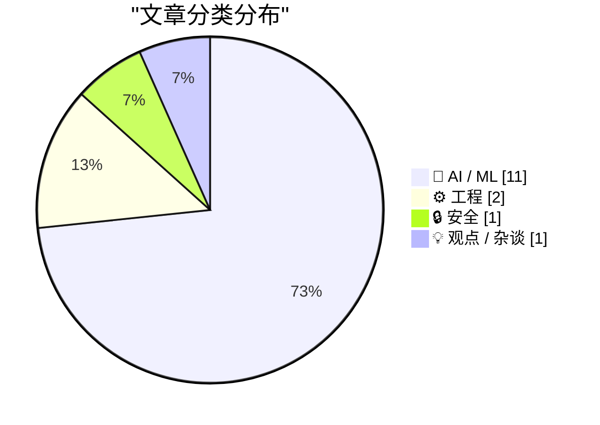
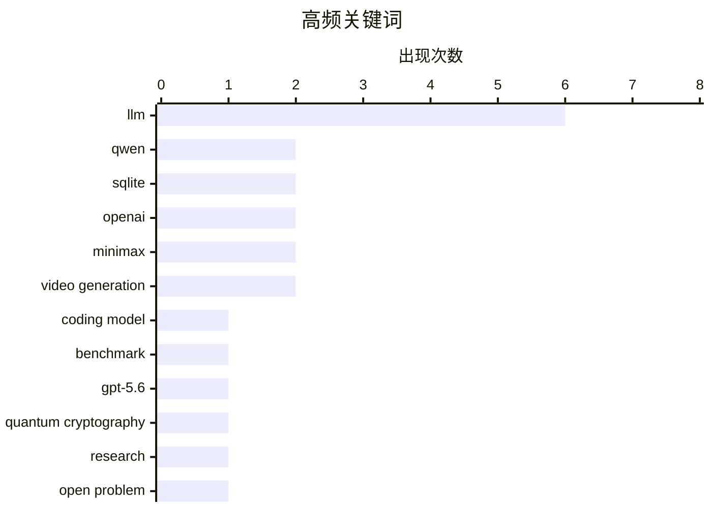

# 📰 AI 资讯每日精选 — 2026-08-04

> 汇聚 140+ 技术博客、X/Twitter、Hacker News、Reddit、Product Hunt、
> Lobste.rs、ClawFeed 日报及 GitHub Trending，经 AI 评分筛选。
>
> **本期内容**：🏆 今日必读 · 🌐 ClawFeed 日报 · 🔥 GitHub Trending · 📂 分类精选 · 🎨 设计与生成式 AI · 📊 数据概览

## 📝 今日看点

今日技术圈的核心焦点集中在AI模型的规模化与自主化上：阿里发布的2.4万亿参数旗舰模型Qwen3.8-Max，将AI从“辅助工具”推向可连续数天独立完成复杂科研与工程任务的“自主智能体”，同时OpenAI的GPT-5.6已能独立破解量子密码学难题，标志着AI在科研发现中的角色正从“工具”演变为“协作者”。与此同时，算力成本因模型智能提升而面临最高10倍的上涨压力，成为制约行业发展的核心经济议题。此外，社区对AI自我进化的讨论升温，而安全领域则出现对LLM生成虚假漏洞报告的警惕，提示技术狂热中需保持理性审视。

---

## 🏆 今日必读

🥇 **Qwen3.8-Max：编码与协作的新标杆**

[Qwen3.8-Max: A New Bar for Coding and Cowork](https://qwen.ai/blog?id=qwen3.8) — Hacker News Best · 22 小时前 · 🤖 AI / ML

> 阿里巴巴发布了旗舰模型Qwen3.8-Max，拥有2.4万亿参数，专为长周期自主任务设计，可连续数天独立完成从复现研究论文到自主设计芯片等复杂工作。该模型在编码和协作任务上树立了新标杆，团队计划于下周开源模型权重。文章详细介绍了其在长时程任务中的规划、执行与自我纠错能力，并展示了与同类模型的性能对比。

💡 **为什么值得读**: 如果你关注开源大模型的极限能力，尤其是长时程自主智能体方向，这篇文章能让你第一时间了解Qwen3.8-Max的真实水平与开源计划。

🏷️ Qwen, coding model, LLM, benchmark

🥈 **两个团队仅相隔三小时，用GPT-5.6解决了同一量子密码学难题**

[Two teams solved the same quantum crypto problem using GPT-5.6 just three hours apart](https://the-decoder.com/two-teams-solved-the-same-quantum-crypto-problem-using-gpt-5-6-just-three-hours-apart/) — The Decoder · 14 小时前 · 🤖 AI / ML

> 两个独立研究团队使用OpenAI的GPT-5.6 Sol Ultra，在仅相隔三小时内分别解决了同一个悬而未决的量子密码学问题，并提交了论文。一位研究者表示，现在遇到开放问题，第一反应是看GPT能否解决。这一事件引发了关于当所有人都使用相同模型时，“独立发现”究竟意味着什么的深刻讨论。

💡 **为什么值得读**: 这篇文章触及了AI时代科研范式变革的核心矛盾——当AI成为通用解题工具，科学发现的独立性与优先权该如何界定，值得每一位科研工作者深思。

🏷️ GPT-5.6, quantum cryptography, research, open problem

🥉 **阿里开源权重模型Qwen3.8-Max：2.4万亿参数挑战长时程AI任务**

[Alibaba’s open-weight Qwen3.8-Max takes on long-horizon AI tasks with 2.4 trillion parameters](https://the-decoder.com/alibabas-open-weight-qwen3-8-max-takes-on-long-horizon-ai-tasks-with-2-4-trillion-parameters/) — The Decoder · 14 小时前 · 🤖 AI / ML

> 阿里巴巴发布旗舰模型Qwen3.8-Max，拥有2.4万亿参数，专为长时程AI任务设计，能够自主连续工作数天，完成从复现研究论文到自主设计芯片等复杂任务。该模型展示了在长时间跨度内保持目标一致性、进行复杂规划与执行的能力。团队计划于下周发布模型权重，这将使其成为开源社区中参数规模最大、能力最强的模型之一。

💡 **为什么值得读**: 这篇文章是了解Qwen3.8-Max技术定位与开源价值的关键信息源，对于关注长时程自主智能体发展和开源大模型生态的读者极具参考价值。

🏷️ Qwen3.8-Max, open-weight, long-horizon, Alibaba

4️⃣ **为什么更智能的AI模型可能推动算力价格上涨10倍**

[Why smarter AI models could drive up compute prices 10x](https://www.dwarkesh.com/p/why-compute-might-get-10x-more-expensive-video) — dwarkesh.com · 7 小时前 · 🤖 AI / ML

> 文章探讨了一个核心问题：随着AI模型智能水平的提升，对算力的需求将呈指数级增长，这可能导致算力成本上涨10倍。作者分析了背后的经济与技术逻辑，包括模型规模扩大、训练数据需求增加以及推理成本上升等因素。文章认为，廉价算力时代可能即将结束，这将对AI产业的商业模式和竞争格局产生深远影响。

💡 **为什么值得读**: 这篇文章提出了一个关于AI产业未来成本结构的尖锐预测，对于AI创业者、投资者和算力使用者来说，是评估未来风险与机遇的重要参考。

🏷️ compute, AI, cost, scaling

5️⃣ **SQLite关键CVE还是LLM垃圾信息？**

[SQLite Critical CVEs or LLM Slop?](https://research.jfrog.com/post/sqlite-critical-cves-or-llm-slops/) — Hacker News Best · 13 小时前 · 🔒 安全

> JFrog研究团队对近期关于SQLite存在“关键CVE”的报道进行了深入调查，发现这些所谓的“关键漏洞”很可能是由LLM生成的错误信息或夸大其词的报告。文章分析了原始漏洞报告的内容，指出其中存在大量不准确的技术细节和误导性结论。研究结论提醒安全社区，在AI生成内容泛滥的背景下，需要对漏洞报告进行更严格的验证，避免被“LLM垃圾信息”误导。

💡 **为什么值得读**: 这篇文章揭示了AI生成内容对网络安全领域的潜在污染问题，提醒安全研究人员在依赖自动化工具时保持批判性思维，对漏洞报告的真实性进行严格把关。

🏷️ SQLite, CVE, LLM, security research

---

## 🌐 ClawFeed 日报精选

> 来源：[ClawFeed](https://clawfeed.kevinhe.io) — AI 驱动的多源新闻聚合

📅 ClawFeed 日报 | 2026-08-03（SGT）

🔴🔴 **先读这一段：本日报的覆盖率是 1/6，不是一天。**

```
今日应有 4h digest 窗口：00:00 · 04:00 · 08:00 · 12:00 · 16:00 · 20:00  = 6 个
今日实有                ：仅 #957（period 16:00-19:59，20:00 触发）      = 1 个
缺失原因                ：agent 侧上游限流停机 83h45m（07-31 06:14:11 → 08-03 17:59:02）
                          期间 4h digest 被调度 63 次、成功 0 次（scheduler task_history 实测）
```

📌 **所以这份文件是一份"4 小时快照"，只是文件名叫日报。** 它**不能**回答"今天整体如何"——
今天 00:00–15:59 这 16 个小时**没有任何素材被采集过**，那段时间的时间线已经过去、取不回来。
🔴 **缺的窗口我没有补做**：素材是实时抓取的，补做只能用今晚的快照冒充上午，那会产出一份看起来完整、实际是伪造时间归属的东西。
⇒ **下面每一节都受这条约束**，凡涉及"当日/全天/趋势"的措辞我都已降级或标注。

---

## 🔥 当日最重要（⚠️ 只有 3 条，不是 5 条）

⚠️ **任务模板要求"当日全场最重要 5 条（跨档排序、去重）"，而唯一的来源 digest 其"重要"区只有 3 条。**
凑到 5 条只能从 Feed 精选里提拔两条充数 ⇒ **我不凑**。下面 3 条是真·重要区全部内容：

1. **Grok Build 更新** — Auto mode 扩展、开发者可更细控制 **Bash 权限**、`/btw` 加速、长对话导航改善。Bash 权限粒度这条是 agent 编码工具从"能跑"走向"可授权管理"的方向。https://x.com/elonmusk/status/2084156097405849727
2. **微软折旧年限延长 + 资本开支指引下调，容易被误读成"微软控住了 AI 支出"** — 更准确是会计与经营同时给市场降温：AI 数据中心买完 GPU 才是开始，服务器/网络/土地/电力/租赁/冷却每一项都会变成未来数年的折旧与现金流压力。https://x.com/OliverYeung6/status/2084247915187359977
3. **EU AI 透明度规则已开始适用** — 特定 AI 系统与 AI 生成/篡改内容，基线现在包含披露与**机器可读标记**。合规面从"要不要标"变成"标成机器能读的格式"。https://x.com/brevis_zk/status/2084247917653807375

## 📰 当日核心主题

🔴 **本节按模板要求应做"聚类视角、把当天反复出现的话题 surface 出来"——而聚类需要跨窗口的重复出现，本日只有 1 个窗口 ⇒ 结构上做不了。**
⚪ 能诚实说的只是**该单一窗口内部**的共现（n=1 窗口，不构成"当日趋势"）：

- **「agent 写了码但没人能解释」这条线索在同一窗口出现两次、且是同一问题的两端**：
  @hasantoxr 主张付给 Claude 的 75% 花在 agent 重新发现它昨天已知的东西（⚠️ 该 75% 是厂商宣传数字、未见方法说明，当营销读）；
  @LimestoneHQ 报告 AI 写码快 10x 之后 code review 积压涨 3x、让人解释 agent 写了什么时人们的做法是**再跑一遍**。
  ⇒ 共同点：**agent 不留下可理解的痕迹**，一端是成本，一端是组织症状。
- **合规/权限颗粒度**：EU 机器可读标记 + Grok 的 Bash 权限控制，两者都指向"AI 行为需要可审计的边界"，但**这是我的归纳，不是数据里的重复出现**（各出现 1 次）。

## 🔖 累计 bookmark 精选

🔴 **本日 0 条新增**：#957 实测书签 20/20 全部已在历史语料（935 个 digest 文件）中，new = 0。
⚠️ 且 **9/20 书签正文为空**（scraper 未取到 body）⇒ 那 9 条**未被评估**，不等于"不值得收录"。
⇒ 本节不产出"精选"，避免把旧书签重新包装成今日产出。

## 👀 推荐关注汇总（去重后 3 个）

- **@OliverYeung6** — 唯一把 AI capex 拆到会计层面（折旧年限/租赁/电力）的中文分析，不堆 buzz 词。
- **@LimestoneHQ** — AI 工程落地后的组织症状观察（review 积压、可解释性缺失），一手客户视角。
- **@brevis_zk** — 把 EU AI 透明度规则拆成可执行的分层结构。

🔴 **操作前两条限制**：
1. **未逐一在浏览器核实是否已关注。** 可比对的 `followingSample` 只有 35 个，而关注数约 5,000 ⇒ **覆盖率 <1%，不在样本里完全不代表未关注。加之前请先在 Following 里搜。**
2. @LimestoneHQ 同时出现在 bookmarks 与 followingSample ⇒ **很可能已关注**。

## 💤 当日重复噪音模式

⚠️ 模板要求"模式，不是单条吐槽"。基于单一窗口（30 条 feed）能站住的只有两点：

- **领域外内容约占 30%**（30 条里 ~9 条）：清华污水处理膜、中缅媒体论坛、印尼宗教活动、古兰经每日经文、动物保护请愿、纯 airdrop 任务。⇒ 这是 feed 组成问题，不是某条推的问题。
- **同一账号同一活动连发**：@developer_dao 就一场 DevNTell 双集活动连发 3 条（预告 + 两集各 1 条）⇒ 单一事件占掉 10% 的窗口配额。
🔴 **不能说的**：这两条是否为"当日/长期模式"——**我只有一个窗口，n=1**。要成为模式判断需要跨窗口复现。

## 🔬 本日报自身的可信度边界（汇总）

| 项 | 状态 |
|---|---|
| 窗口覆盖 | **1/6**（缺 00:00/04:00/08:00/12:00/20:00 五档，未补做） |
| 重要条目 | 3 条（模板要 5，**不凑数**） |
| 跨窗口聚类 | **结构上不可能**（n=1 窗口） |
| bookmark 新增 | 0（20/20 为旧）· 9 条正文为空未评估 |
| 取关建议 | **无仪器** —— #957 实测 `followingProfiles` 24 条全部只抓到页面骨架（`body="To view keyboard shortcuts…"`、`tweets=[]`）⇒ 无法判断任何账号活跃度。**记为无量具，不记为"查无异常"。** |
| 关注建议核实 | 未核实（followingSample 覆盖率 <1%） |
| 来源 digest | `#957` 单一来源，dedup 双向对照已过（ctl_pos 命中 / ctl_neg 静默） |
---

## 🔥 GitHub Trending

> 今日热门开源项目（全语言 + Python）

| # | 项目 | 描述 | ⭐ 总星 | 📈 今日 | 语言 |
|---|------|------|---------|---------|------|
| 1 | [zhaoxuya520/reverse-skill](https://github.com/zhaoxuya520/reverse-skill) 🤖 | Reverse Engineering / Authorized Penetration Testing / Se... | 15.8k | +2446 | PowerShell |
| 2 | [microsoft/AI-For-Beginners](https://github.com/microsoft/AI-For-Beginners) 🤖 | 12 Weeks, 24 Lessons, AI for All! | 60.7k | +1902 | Jupyter Notebook |
| 3 | [firecrawl/pdf-inspector](https://github.com/firecrawl/pdf-inspector) | Fast Rust library for PDF inspection, classification, and... | 8.2k | +1699 | Rust |
| 4 | [TencentCloud/TencentDB-Agent-Memory](https://github.com/TencentCloud/TencentDB-Agent-Memory) 🤖 | TencentDB Agent Memory is a team-level memory hub for AI ... | 12.1k | +1090 | TypeScript |
| 5 | [lyogavin/airllm](https://github.com/lyogavin/airllm) | AirLLM 70B inference with single 4GB GPU | 27.1k | +1085 | Jupyter Notebook |
| 6 | [Panniantong/Agent-Reach](https://github.com/Panniantong/Agent-Reach) 🤖 | Give your AI agent eyes to see the entire internet. Read ... | 65.7k | +1057 | Python |
| 7 | [esengine/DeepSeek-Reasonix](https://github.com/esengine/DeepSeek-Reasonix) 🤖 | DeepSeek-native AI coding agent for your terminal. Engine... | 29.9k | +883 | Go |
| 8 | [Graphify-Labs/graphify](https://github.com/Graphify-Labs/graphify) 🤖 | Turn any codebase, with its docs, SQL schemas, configs, a... | 101.9k | +840 | Python |
| 9 | [microsoft/generative-ai-for-beginners](https://github.com/microsoft/generative-ai-for-beginners) 🤖 | 21 Lessons, Get Started Building with Generative AI | 115.6k | +775 | Jupyter Notebook |
| 10 | [usekaneo/kaneo](https://github.com/usekaneo/kaneo) | 🎯 All you need. Nothing you don't. Open source project m... | 6.9k | +665 | TypeScript |
| 11 | [NousResearch/hermes-agent](https://github.com/NousResearch/hermes-agent) 🤖 | The agent that grows with you | 224.9k | +622 | Python |
| 12 | [jamiepine/voicebox](https://github.com/jamiepine/voicebox) 🤖 | The open-source AI voice studio. Clone, dictate, create. | 48.7k | +412 | TypeScript |
| 13 | [iv-org/invidious](https://github.com/iv-org/invidious) | Invidious is an alternative front-end to YouTube | 22.3k | +402 | Crystal |
| 14 | [antirez/ds4](https://github.com/antirez/ds4) | DeepSeek 4 Flash and PRO local inference engine for Metal... | 20.4k | +384 | C |
| 15 | [Alishahryar1/free-claude-code](https://github.com/Alishahryar1/free-claude-code) 🤖 | Use Claude Code, Codex and Pi for free from your terminal... | 44.0k | +278 | Python |

---

## 🤖 AI / ML

### 1. Qwen3.8-Max：编码与协作的新标杆

[Qwen3.8-Max: A New Bar for Coding and Cowork](https://qwen.ai/blog?id=qwen3.8) — **Hacker News Best** · 22 小时前 · ⭐ 28/30

> 阿里巴巴发布了旗舰模型Qwen3.8-Max，拥有2.4万亿参数，专为长周期自主任务设计，可连续数天独立完成从复现研究论文到自主设计芯片等复杂工作。该模型在编码和协作任务上树立了新标杆，团队计划于下周开源模型权重。文章详细介绍了其在长时程任务中的规划、执行与自我纠错能力，并展示了与同类模型的性能对比。

🏷️ Qwen, coding model, LLM, benchmark

---

### 2. 两个团队仅相隔三小时，用GPT-5.6解决了同一量子密码学难题

[Two teams solved the same quantum crypto problem using GPT-5.6 just three hours apart](https://the-decoder.com/two-teams-solved-the-same-quantum-crypto-problem-using-gpt-5-6-just-three-hours-apart/) — **The Decoder** · 14 小时前 · ⭐ 27/30

> 两个独立研究团队使用OpenAI的GPT-5.6 Sol Ultra，在仅相隔三小时内分别解决了同一个悬而未决的量子密码学问题，并提交了论文。一位研究者表示，现在遇到开放问题，第一反应是看GPT能否解决。这一事件引发了关于当所有人都使用相同模型时，“独立发现”究竟意味着什么的深刻讨论。

🏷️ GPT-5.6, quantum cryptography, research, open problem

---

### 3. 阿里开源权重模型Qwen3.8-Max：2.4万亿参数挑战长时程AI任务

[Alibaba’s open-weight Qwen3.8-Max takes on long-horizon AI tasks with 2.4 trillion parameters](https://the-decoder.com/alibabas-open-weight-qwen3-8-max-takes-on-long-horizon-ai-tasks-with-2-4-trillion-parameters/) — **The Decoder** · 14 小时前 · ⭐ 27/30

> 阿里巴巴发布旗舰模型Qwen3.8-Max，拥有2.4万亿参数，专为长时程AI任务设计，能够自主连续工作数天，完成从复现研究论文到自主设计芯片等复杂任务。该模型展示了在长时间跨度内保持目标一致性、进行复杂规划与执行的能力。团队计划于下周发布模型权重，这将使其成为开源社区中参数规模最大、能力最强的模型之一。

🏷️ Qwen3.8-Max, open-weight, long-horizon, Alibaba

---

### 4. 为什么更智能的AI模型可能推动算力价格上涨10倍

[Why smarter AI models could drive up compute prices 10x](https://www.dwarkesh.com/p/why-compute-might-get-10x-more-expensive-video) — **dwarkesh.com** · 7 小时前 · ⭐ 26/30

> 文章探讨了一个核心问题：随着AI模型智能水平的提升，对算力的需求将呈指数级增长，这可能导致算力成本上涨10倍。作者分析了背后的经济与技术逻辑，包括模型规模扩大、训练数据需求增加以及推理成本上升等因素。文章认为，廉价算力时代可能即将结束，这将对AI产业的商业模式和竞争格局产生深远影响。

🏷️ compute, AI, cost, scaling

---

### 5. OpenAI：我们如何在六个月内构建实时语音AI响应系统

[OPEN AI: How we built a realtime system for responsive voice AI in six months](https://www.reddit.com/r/singularity/comments/1vepsbk/open_ai_how_we_built_a_realtime_system_for/) — **r/singularity** · 4 小时前 · ⭐ 26/30

> OpenAI团队分享了他们在六个月内构建GPT-Live实时语音交互系统的工程实践。文章详细介绍了系统架构设计，包括如何实现低延迟的语音识别、大模型推理与语音合成流水线，以及如何应对实时交互中的挑战，如中断处理、上下文管理与资源调度。团队强调了从原型到生产系统过程中在延迟优化、稳定性和用户体验方面的关键决策与权衡。

🏷️ OpenAI, voice AI, realtime, system design

---

### 6. 数学与理论计算机科学领域的十项进展

[Ten advances in mathematics and theoretical computer science](https://openai.com/index/ten-advances-in-mathematics/) — **Hacker News Best** · 8 小时前 · ⭐ 25/30

> OpenAI发布文章，总结了其AI模型在数学和理论计算机科学领域取得的十项重要进展。这些进展涵盖了从解决开放性问题、提出新猜想，到辅助证明复杂定理等多个方面。文章展示了AI在形式化推理和数学发现方面的潜力，并讨论了这些成果对数学研究范式可能带来的变革性影响。

🏷️ mathematics, theoretical CS, OpenAI, advances

---

### 7. 模型正在训练模型

[Models are now training models.](https://www.reddit.com/r/singularity/comments/1veje3t/models_are_now_training_models/) — **r/singularity** · 8 小时前 · ⭐ 25/30

> Reddit r/singularity 板块的一篇热帖，配图展示了AI模型正在训练另一个AI模型的场景。帖子引发了关于AI自我进化、递归自我改进以及这一趋势可能带来的加速发展（如智能爆炸）的广泛讨论。评论中既有对技术奇点临近的兴奋，也有对失控风险的担忧。

🏷️ self-training, AI models, recursive, LLM

---

### 8. Qwen3.8-Max

[Qwen3.8-Max](https://www.producthunt.com/products/qwen3) — **Product Hunt** · 21 小时前 · ⭐ 25/30

> Product Hunt上发布了阿里通义千问的最新旗舰模型Qwen3.8-Max，定位为“Qwen最强大的编码与协作模型”。该产品页面提供了模型的核心定位和功能简介，并附有讨论区和产品链接，供用户深入了解和体验。

🏷️ Qwen, coding, LLM, model

---

### 9. "My @Stripe career is divided into before and after Kai." Stripe built Kai, their Knowledge AI Platform, with Deep Agents in one week with just one en...

["My @Stripe career is divided into before and after Kai." Stripe built Kai, their Knowledge AI Platform, with Deep Agents in one week with just one en...](https://x.com/LangChain/status/2084353609115009531) — **𝕏 @LangChain** · 6 小时前 · ⭐ 25/30

> "My @Stripe career is divided into before and after Kai."<br><br>Stripe built Kai, their Knowledge AI Platform, with Deep Agents in one week with just one engineer.<br><br>Here’s the full story: https

🏷️ Stripe, Deep Agents, Knowledge AI, case study

---

### 10. China's MiniMax H3 is the first open model to top an AI video ranking

[China's MiniMax H3 is the first open model to top an AI video ranking](https://the-decoder.com/chinas-minimax-h3-is-the-first-open-model-to-top-an-ai-video-ranking/) — **The Decoder** · 11 小时前 · ⭐ 24/30

> MiniMax releases H3 video model weights, putting an open model at the top of a video ranking for the first time.
The article China's MiniMax H3 is the first open model to top an AI video ranking appea

🏷️ MiniMax, video generation, open model, H3

---

### 11. MiniMax H3 Day-0 Support in ComfyUI: Open Weights, Native Audio, and 2K Video

[MiniMax H3 Day-0 Support in ComfyUI: Open Weights, Native Audio, and 2K Video](https://blog.comfy.org/p/minimax-h3-day-0-support-in-comfyui) — **Hacker News Best** · 11 小时前 · ⭐ 24/30

> Article URL: https://blog.comfy.org/p/minimax-h3-day-0-support-in-comfyui
Comments URL: https://news.ycombinator.com/item?id=49155629
Points: 242
# Comments: 76

🏷️ MiniMax, ComfyUI, video generation, open weights

---

## ⚙️ 工程

### 12. 智能体编码技术

[Agentic coding techniques](https://micahflee.com/agentic-coding-techniques/) — **micahflee.com** · 9 小时前 · ⭐ 25/30

> 作者分享了自LLM可用以来，使用AI智能体进行编码的实践经验与技巧。与将AI强行塞入各种应用或生成大量低质内容不同，作者认为智能体编码是AI真正有用的场景之一。文章强调了正确使用智能体的关键：必须由理解代码并能够审查AI输出的开发者来主导，将AI作为辅助工具而非完全替代者。文中还介绍了多种具体的智能体编码工作流和提示词技巧。

🏷️ AI coding, agents, LLM, workflow

---

### 13. Reliability Lessons From SQLite

[Reliability Lessons From SQLite](https://www.youtube.com/watch?v=V_qzqY1bb7I) — **Lobste.rs** · 8 小时前 · ⭐ 25/30

> <p><a href="https://lobste.rs/s/kprcuc/reliability_lessons_from_sqlite">Comments</a></p>

🏷️ SQLite, reliability, testing

---

## 🔒 安全

### 14. SQLite关键CVE还是LLM垃圾信息？

[SQLite Critical CVEs or LLM Slop?](https://research.jfrog.com/post/sqlite-critical-cves-or-llm-slops/) — **Hacker News Best** · 13 小时前 · ⭐ 26/30

> JFrog研究团队对近期关于SQLite存在“关键CVE”的报道进行了深入调查，发现这些所谓的“关键漏洞”很可能是由LLM生成的错误信息或夸大其词的报告。文章分析了原始漏洞报告的内容，指出其中存在大量不准确的技术细节和误导性结论。研究结论提醒安全社区，在AI生成内容泛滥的背景下，需要对漏洞报告进行更严格的验证，避免被“LLM垃圾信息”误导。

🏷️ SQLite, CVE, LLM, security research

---

## 💡 观点 / 杂谈

### 15. Prevent cognitive debt by manually retyping LLM-generated code

[Prevent cognitive debt by manually retyping LLM-generated code](https://ankursethi.com/blog/prevent-cognitive-debt-by-manually-retyping-llm-generated-code/) — **Hacker News Best** · 15 小时前 · ⭐ 24/30

> Article URL: https://ankursethi.com/blog/prevent-cognitive-debt-by-manually-retyping-llm-generated-code/
Comments URL: https://news.ycombinator.com/item?id=49153374
Points: 364
# Comments: 302

🏷️ LLM, code quality, cognitive load, developer workflow

---

## 🎨 Design & Generative AI

### 🎬 生成式视频

- **[MiniMax H3 登陆 ComfyUI：开源权重、原生音频与 2K 视频支持](https://blog.comfy.org/p/minimax-h3-day-0-support-in-comfyui)** — Hacker News Best · 11 小时前
  > ComfyUI 即日支持 MiniMax H3 模型，带来开源权重、原生音频生成及 2K 视频输出能力。

---

## 📊 数据概览

| 扫描源 | 抓取文章 | 时间范围 | 精选 |
|:---:|:---:|:---:|:---:|
| 108/140 | 5304 篇 → 97 篇 | 24h | **15 篇** |

### 分类分布



### 高频关键词



<details>
<summary>📈 纯文本关键词图（终端友好）</summary>

```
llm                  │ ████████████████████ 6
qwen                 │ ███████░░░░░░░░░░░░░ 2
sqlite               │ ███████░░░░░░░░░░░░░ 2
openai               │ ███████░░░░░░░░░░░░░ 2
minimax              │ ███████░░░░░░░░░░░░░ 2
video generation     │ ███████░░░░░░░░░░░░░ 2
coding model         │ ███░░░░░░░░░░░░░░░░░ 1
benchmark            │ ███░░░░░░░░░░░░░░░░░ 1
gpt-5.6              │ ███░░░░░░░░░░░░░░░░░ 1
quantum cryptography │ ███░░░░░░░░░░░░░░░░░ 1
```

</details>

### 🏷️ 话题标签

**llm**(6) · **qwen**(2) · **sqlite**(2) · openai(2) · minimax(2) · video generation(2) · coding model(1) · benchmark(1) · gpt-5.6(1) · quantum cryptography(1) · research(1) · open problem(1) · qwen3.8-max(1) · open-weight(1) · long-horizon(1) · alibaba(1) · compute(1) · ai(1) · cost(1) · scaling(1)

---

*生成于 2026-08-04 01:07 | 汇聚 140 个技术博客、X/Twitter、Hacker News、Reddit、Product Hunt、Lobste.rs、ClawFeed 日报及 GitHub Trending，经 AI 评分筛选出 Top 15 精华内容*
