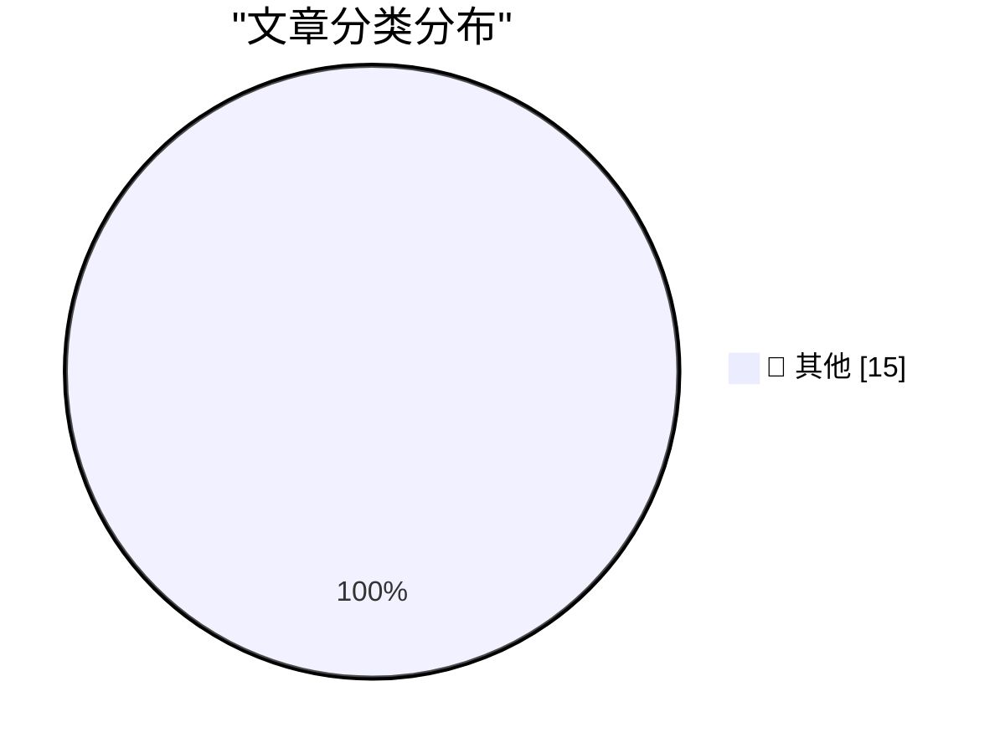

# 📰 AI 资讯每日精选 — 2026-08-09

> 汇聚 140+ 技术博客、X/Twitter、Hacker News、Reddit、Product Hunt、
> Lobste.rs、ClawFeed 日报及 GitHub Trending，经 AI 评分筛选。
>
> **本期内容**：🏆 今日必读 · 🌐 ClawFeed 日报 · 🔥 GitHub Trending · 📂 分类精选 · 🎨 设计与生成式 AI · 📊 数据概览

## 🏆 今日必读

🥇 **Auto mode is now the default in Claude Code for Pro, Max, and Team plans**

[Auto mode is now the default in Claude Code for Pro, Max, and Team plans](https://simonwillison.net/2026/Aug/8/auto-mode/#atom-everything) — simonwillison.net · 1 小时前 · 📝 其他

> Auto mode is now the default in Claude Code for Pro, Max, and Team plans

🥈 **Now we have a timeline of the OpenAI accidental attack against Hugging Face**

[Now we have a timeline of the OpenAI accidental attack against Hugging Face](https://simonwillison.net/2026/Aug/8/now-we-have-a-timeline-of-the-openai-accidental-attack-against-h/#atom-everything) — simonwillison.net · 9 小时前 · 📝 其他

> Now we have a timeline of the OpenAI accidental attack against Hugging Face

🥉 **Quoting John Gruber**

[Quoting John Gruber](https://simonwillison.net/2026/Aug/8/john-gruber/#atom-everything) — simonwillison.net · 23 小时前 · 📝 其他

> Quoting John Gruber

4️⃣ **Corrupt Minds Think Alike**

[Corrupt Minds Think Alike](https://www.nytimes.com/2026/08/06/business/fifa-world-cup-privatization.html?unlocked_article_code=1.3VA.4zqH.Pul7X9bQ2kv0&amp;smid=bs-share) — daringfireball.net · 3 小时前 · 📝 其他

> Corrupt Minds Think Alike

5️⃣ **Maybe ‘Steal Underpants by Blowing a Fortune on AI Tokens’ Is, in Fact, Not a Good Business Plan**

[Maybe ‘Steal Underpants by Blowing a Fortune on AI Tokens’ Is, in Fact, Not a Good Business Plan](https://www.404media.co/the-tokenpocalypse-is-here-companies-are-scrambling-to-stop-spending-so-much-on-ai/) — daringfireball.net · 4 小时前 · 📝 其他

> Maybe ‘Steal Underpants by Blowing a Fortune on AI Tokens’ Is, in Fact, Not a Good Business Plan

---

## 🌐 ClawFeed 日报精选

> 来源：[ClawFeed](https://clawfeed.kevinhe.io) — AI 驱动的多源新闻聚合

📅 ClawFeed 日报 | 2026-08-08（SGT）

聚合 **4 档** 4h digest：DB `987`(00:00-03:59) · `988`(04:00-07:59) · `989`(12:00-15:59) · `990`(16:00-19:59)

🔴 **本日覆盖有一个真实缺口，写在最前面而不是脚注**
**`08:00-11:59` 窗口没有任何 digest** —— 12:00 档因 Chrome CDP 半死失败（HTTP 通但 `connectOverCDP`
30s 超时），当时按规则**未写空报、未拿旧数据顶数**。16:22 Kevin 授权后修复，16:00 档补跑成 `989`。
⚠️ **`989` 里"打捞"出的 6 条 08:00-11:59 内容 ≠ 该窗口被覆盖**：那是补**内容**不是补**覆盖**
（`補Li-495`）。所以下面任何"当日全场"的排序，**结构上缺 4 小时**，不是完整总体。
⚪ `20:00-23:59` 属明日 00:00 档，本日报按设计不含。

---

## 🔥 当日最重要 5 条（跨档排序、已去重）

**1. 权限确认疲劳被实测量化 —— 全天最有行动价值的一条** —— @lydiahallie（Anthropic，档 `987`）
1,053 名付费测试者：把权限确认框换成**明显危险的命令**（纯文本、未真执行），
**只有 13.6% 的人发现**；**看过 50 个提示之后识别率掉到约 5%**。
结论：auto mode 比"逐条人工确认"和 `--dangerously-skip-permissions` 都更安全。
https://x.com/lydiahallie/status/2085799128857272783
📌 **人工确认这道闸不是不管用，是随次数衰减** —— 与我这边"确认疲劳让危险操作被顺手放行"同一机制。

**2. 前沿 agent 在"真研究"上撞墙（有对照的实测）** —— @TheTuringPost（档 `988`）
给前沿 agent **6 天 + 数千美元算力**去解 **2 篇未发表 NeurIPS 2026 论文**的核心研究问题：
**工程部分扛得住，研究上没有实质进展。**
https://x.com/TheTuringPost/status/2085859661912392136
📌 它把"能干活"和"能做研究"**分开量了**；前者反复被证实，后者这次是**否定读数**。
⚠️ 仅读到推文摘要，未读原始报告。

**3. DeepSeek V4 Flash 刷新 ARC-AGI 成本-性能 Pareto** —— @teortaxesTex 转 ARC 验证榜（档 `987`）
**ARC-AGI-2: 61.4% @ $0.04/task** · **ARC-AGI-1: 89.0% @ $0.02/task**，称与 Kimi K3 持平，
且是**首次有这个参数量级/预训练成本的模型做到该水平**。
https://x.com/teortaxesTex/status/2085815197210398825
⚠️ 数字为推文转述，**我未打开 ARC 官方榜核对**。

**4. Coldcard 漏洞损失扩大** —— CoinMarketCap 引 Galaxy Research（档 `987`）
**至少 1,719 BTC（≈$111M）被盗，总损失预计 >$130M**。
https://x.com/CoinMarketCap/status/2085801953880080420
⚠️ 若名下有 Coldcard 硬件钱包，请走官方渠道自行核实，别照本条行动。

**5. X 停止创作者收益分成 —— 当日拿到第二个独立信源** —— @Lucas168（档 `988`）+ @AndrewCurran_（档 `990`）
两源**对"发生什么"一致**：Revenue Sharing 结束，改为 **Original Content Rewards**（按原创内容的合格曝光计费）。
**但对"哪一天"不一致**：中文源称 **9/7 结束、9/8 开放申请**；英文源称**最终付款约 9/11**。
https://x.com/Lucas168/status/2085857969560748242 · https://x.com/AndrewCurran_/status/2085845795614630316
🔑 **交叉印证抬高的是【事件】可信度，不是【细节】可信度** —— 日期仍不可引用，需官方公告。
**多一个来源 ≠ 每个字段都多一份证据。**

---

## 📰 当日核心主题（聚类视角）

**① Agent 的能力边界与成本 —— 全天最密集的一簇（跨 4 档都有）**
- 能力上界：研究做不动（`988`），但工程能扛。
- 组织形态：@OpenMaxAI「**25 人 / 75+ agent，每人管三个**，覆盖 sales/ops/finance/legal」，
  @CharliehuAI 在 SMEICC 2026 的说法是「瓶颈从来不是人头，是你不肯交出去的事」（`990`，**自家宣发**，不作市场信号）。
  个人侧同一方向：@milesdeutscher「用 Claude 自动化了整个人生 / 全部 SOP」。
- 协作机制：**Claude Code 出了「跨会话消息」**，并行任务时可让另一窗口接手，
  且**传的是摘要不是上下文**（@xiaohu，`989` 打捞段）。
- 成本反噬：@shao__meng 记录了「token 大跃进 → 账单暴涨 → 反过来限额」的循环，
  引 Databricks 公开的降本分析（部分场景单位成本降至 **1/10**）；圈内讽刺「高管发现还是人便宜」「token 不能欠费，人能」。
- 产品体感：@JefferyTatsuya 公开批评 Claude Code 桌面版**跨端状态查看体验差**、点名 @DarioAmodei/@bcherny（`988`）。
📌 **把这五格连起来看**：能力在涨、协作原语在出现、而**成本与跨端体验成了新的约束面**。

**② 人在回路的失效 —— 与①正面咬合**
第 1 条（确认疲劳 13.6% → 5%）是本簇唯一一条，但它**给①提供了反向约束**：
agent 越自动，人工闸门越被高频触发，而**闸门本身随次数衰减** ⇒ 「加一道人工确认」不是免费的安全。

**③ 稳定币 / 交易所结构 / RWA**
- **IMF：本地稳定币可能反而把用户推向"数字美元"**（@Cointelegraph，`990`）。
- **交易所储备结构对比**（@CoinMarketCap，`990`）：MEXC **70.8% 稳定币**最保守 · KuCoin 60.1% ·
  Bybit 48.9% · Bitget 48.3% · HTX **50.7% 押主流山寨**风险偏好最高；Binance **仅稳定币 460 亿美元**。
  📌 **构成看风险偏好、规模看流动性 —— 两个不同问题，别混。**
- vault 经济风险：抵押物下跌速度不能快过清算速度（@laurashin，`988`）。
- OP Enterprise 8 个月做到占 Optimism 收入大头、企业收入超主网（@therollupco，`988`）。
- DeFi 下一个 edge 是**专业化**：后来者在 BTCFi/GoldFi 做深胜过通用 DeFi 拼寡头（@0xAlexWu，`990`）。

**④ 中国 AI 与资本市场**
- 🔴 **Kimi（月之暗面）G 轮启动、估值 500 亿美元、视为 Pre-IPO**；为赴港上市并引国家资本，
  通报**不排除要求全部海外股东将权益转入国内主体**；母公司已改制为股份有限公司；
  额度紧张、要求 **8/15 前打款**（@_FORAB，`989` 打捞段）。
  ⚠️ 中文转述 + "知情人士"，**未见一手公告**，估值/日期勿作事实引用。
- DeepSeek V4 Flash（见上）。
- 生成式图像：Grok Imagine Image 2.0 文生图 Arena **#2（1320 分，自 #14 跃升）**，**仅 App 无 API**（@liyue_ai，`990`）。

**⑤ 基础设施 / 硬件**
BEP-675 让 BSC 测试网吞吐 **1,237 → 2,324 TPS（+88%）**，出块 450ms 与 finality lag 不变（`988`）·
DEF CON 34 徽章用 bunnie Huang 的开源 RISC-V 衍生芯片 Baochip-1x，**3 万人可用红外物理验证**（`989` 打捞段）·
Sandisk 营收同比 **+175% 至 202.5 亿美元、数据中心销售 +437%**（`989`）。

---

## 🔖 累计 bookmark 精选
⚪ **本日无新增**。四档**每一档**都是 **20/20 命中查重账本**（同一批历史 mark，最新一条 08-04）。
🔑 这条"没有变化"是**有判别力的**：bookmarks 命中率正是匹配器的阳性对照 ——
**它每档都开火，所以 feed 侧"基本首现"的结论是挣来的，不是空转。**
⚪ 例外说明：03:xx 按 Kevin 指令**人工**新入 5 条 mark（id **907-911**，周报 W29 §2 AI-Native 主题），
属人工指定、不在自动流程内，故不计入本节。

## 👀 推荐关注汇总
⚪ **全天四档一条都没出** —— 且这**不是"查了没有"**：规则要求推荐前必须**用浏览器逐一确认未关注**，
而**四档都没有做这一步**。⇒ 按规则不给名单，而不是给一份带免责声明的猜测。
**"没查"和"查了没有"必须长得不一样。**

## 💤 当日重复噪音模式（模式，非单条吐槽）
1. **meme 币 / 项目软广喊单** —— 四档全部出现，是最稳定的噪音源。
2. **课程与"自动化你的人生"类推广** —— 葡语 n8n 课程、SOP 自动化带货式推文。
3. **无上下文单句/生活贴** —— 单词回复、早安、旅行照、饺子照；`990` 窗口内 6 条里占 2 条。
4. **纯转述无出处的"重磅结论"** —— 典型：`987` 里"SemiAnalysis 称谷歌 DeepMind 已失去前沿地位"，
   **只有结论、无链接无引文** ⇒ 已标为未证实、不得引用。
📊 信噪比按档：`987` 15 条约 5 条噪声 · `988` 18 条约 **9 条**（当日最差）· `990` 窗口内 6 条有 4 条低信息量。
📌 **精选条数 ≠ 窗口条数**，四档都已照实记分母。

---

## ⚪ 本日方法与限制（勿省略）
- **覆盖缺 08:00-11:59**（见开头），本日报**不是完整一天**。
- `989` 采集晚于窗口关闭 **24 分钟**、`990` 晚 **4 分钟** ⇒ 两档均为**幸存者样本**，
  "窗口内 N 条"是**下界**不是总量；`989` 偏差更大。
- 窗口归属自 `989` 起改用 **snowflake 反解 status id**（分钟级），替代 1 小时粒度的相对标记。
- 🔴 **本日仪器自误一枚，记在日报里**：查重首次计算时取错字段（`sid`/`id` 不存在，实为
  `username/status/text/raw`）⇒ 打印出 `feed 0/27、bookmarks 0/20`，**不报错、值合理、读起来像"全是新内容"**。
  揭穿它的是**独立的量**：bookmarks 历来 20/20。⇒ 现已固定：sid 一律正则取自 `status` URL，
  **bookmarks 命中率每档必报，作为匹配器阳性对照**。
- ClawFeed 当日 Chrome CDP 故障已于 **16:22** 修复（`kill -TERM` 主进程 + LaunchAgent 自启，X 登录态未丢），
  20:00 档正常运行 ⇒ **修复已跨一个完整 4h 周期验证**。
---

## 🔥 GitHub Trending

> 今日热门开源项目（全语言 + Python）

| # | 项目 | 描述 | ⭐ 总星 | 📈 今日 | 语言 |
|---|------|------|---------|---------|------|
| 1 | [PrimeIntellect-ai/prime-agent](https://github.com/PrimeIntellect-ai/prime-agent) 🤖 | A self-improving RLM agent for coding workflows and long-... | 8.9k | +2483 | TypeScript |
| 2 | [mattpocock/skills](https://github.com/mattpocock/skills) | Skills for Real Engineers. Straight from my .agents direc... | 210.0k | +1354 | Shell |
| 3 | [addyosmani/agent-skills](https://github.com/addyosmani/agent-skills) 🤖 | Production-grade engineering skills for AI coding agents. | 84.5k | +778 | JavaScript |
| 4 | [virgiliojr94/book-to-skill](https://github.com/virgiliojr94/book-to-skill) 🤖 | Turn any technical book PDF into a Claude Code skill — re... | 18.9k | +660 | Python |
| 5 | [TapXWorld/ChinaTextbook](https://github.com/TapXWorld/ChinaTextbook) | 所有小初高、大学PDF教材。 | 77.9k | +591 | Roff |
| 6 | [google/skills](https://github.com/google/skills) 🤖 | Agent Skills for Google products and technologies | 16.7k | +481 | Python |
| 7 | [goauthentik/authentik](https://github.com/goauthentik/authentik) | The authentication glue you need. | 24.0k | +467 | Python |
| 8 | [666ghj/MiroFish](https://github.com/666ghj/MiroFish) | A Simple and Universal Swarm Intelligence Engine, Predict... | 70.7k | +441 | Python |
| 9 | [denoland/celld](https://github.com/denoland/celld) | self-hosted, distributed Durable Objects | 2.6k | +432 | Rust |
| 10 | [huangruiteng/loopx](https://github.com/huangruiteng/loopx) 🤖 | Lightweight loop engineering state kernel for long-runnin... | 3.6k | +244 | Python |
| 11 | [Significant-Gravitas/AutoGPT](https://github.com/Significant-Gravitas/AutoGPT) 🤖 | AutoGPT is the vision of accessible AI for everyone, to u... | 186.4k | +240 | Python |
| 12 | [practical-tutorials/project-based-learning](https://github.com/practical-tutorials/project-based-learning) | Curated list of project-based tutorials | 277.4k | +220 | Python |
| 13 | [bannedbook/fanqiang](https://github.com/bannedbook/fanqiang) | 翻墙-科学上网 | 49.9k | +161 | Kotlin |
| 14 | [TauricResearch/TradingAgents](https://github.com/TauricResearch/TradingAgents) 🤖 | TradingAgents: Multi-Agents LLM Financial Trading Framework | 96.5k | +126 | Python |
| 15 | [tirth8205/code-review-graph](https://github.com/tirth8205/code-review-graph) 🤖 | Local-first code intelligence graph for MCP and CLI. Buil... | 29.5k | +114 | Python |

---

## 📝 其他

### 1. Auto mode is now the default in Claude Code for Pro, Max, and Team plans

[Auto mode is now the default in Claude Code for Pro, Max, and Team plans](https://simonwillison.net/2026/Aug/8/auto-mode/#atom-everything) — **simonwillison.net** · 1 小时前 · ⭐ 15/30

> Auto mode is now the default in Claude Code for Pro, Max, and Team plans

---

### 2. Now we have a timeline of the OpenAI accidental attack against Hugging Face

[Now we have a timeline of the OpenAI accidental attack against Hugging Face](https://simonwillison.net/2026/Aug/8/now-we-have-a-timeline-of-the-openai-accidental-attack-against-h/#atom-everything) — **simonwillison.net** · 9 小时前 · ⭐ 15/30

> Now we have a timeline of the OpenAI accidental attack against Hugging Face

---

### 3. Quoting John Gruber

[Quoting John Gruber](https://simonwillison.net/2026/Aug/8/john-gruber/#atom-everything) — **simonwillison.net** · 23 小时前 · ⭐ 15/30

> Quoting John Gruber

---

### 4. Corrupt Minds Think Alike

[Corrupt Minds Think Alike](https://www.nytimes.com/2026/08/06/business/fifa-world-cup-privatization.html?unlocked_article_code=1.3VA.4zqH.Pul7X9bQ2kv0&amp;smid=bs-share) — **daringfireball.net** · 3 小时前 · ⭐ 15/30

> Corrupt Minds Think Alike

---

### 5. Maybe ‘Steal Underpants by Blowing a Fortune on AI Tokens’ Is, in Fact, Not a Good Business Plan

[Maybe ‘Steal Underpants by Blowing a Fortune on AI Tokens’ Is, in Fact, Not a Good Business Plan](https://www.404media.co/the-tokenpocalypse-is-here-companies-are-scrambling-to-stop-spending-so-much-on-ai/) — **daringfireball.net** · 4 小时前 · ⭐ 15/30

> Maybe ‘Steal Underpants by Blowing a Fortune on AI Tokens’ Is, in Fact, Not a Good Business Plan

---

### 6. Pluralistic: Digital sewer socialism (08 Aug 2026)

[Pluralistic: Digital sewer socialism (08 Aug 2026)](https://pluralistic.net/2026/08/08/find-yourself-a-city/) — **pluralistic.net** · 14 小时前 · ⭐ 15/30

> Pluralistic: Digital sewer socialism (08 Aug 2026)

---

### 7. [RSS Club] I got an NLnet grant!

[[RSS Club] I got an NLnet grant!](https://shkspr.mobi/blog/2026/08/rss-club-i-got-an-nlnet-grant/) — **shkspr.mobi** · 12 小时前 · ⭐ 15/30

> [RSS Club] I got an NLnet grant!

---

### 8. Anubis v1.27.0: Moenbryda Wilfsunnwyn

[Anubis v1.27.0: Moenbryda Wilfsunnwyn](https://anubis.techaro.lol/blog/release/v1.27.0/) — **xeiaso.net** · 1 天前 · ⭐ 15/30

> Anubis v1.27.0: Moenbryda Wilfsunnwyn

---

### 9. Corrupted apostrophes

[Corrupted apostrophes](https://www.johndcook.com/blog/2026/08/07/corrupted-apostrophes/) — **johndcook.com** · 22 小时前 · ⭐ 15/30

> Corrupted apostrophes

---

### 10. This Week in Package Management: 8 August 2026

[This Week in Package Management: 8 August 2026](https://nesbitt.io/2026/08/08/this-week-in-package-management.html) — **nesbitt.io** · 14 小时前 · ⭐ 15/30

> This Week in Package Management: 8 August 2026

---

### 11. Reading List 08/08/2026

[Reading List 08/08/2026](https://www.construction-physics.com/p/reading-list-08082026) — **construction-physics.com** · 12 小时前 · ⭐ 15/30

> Reading List 08/08/2026

---

### 12. Anthropic sets Claude Code to Auto Mode by default to protect developers from bad approvals

[Anthropic sets Claude Code to Auto Mode by default to protect developers from bad approvals](https://the-decoder.com/anthropic-sets-claude-code-to-auto-mode-by-default-to-protect-developers-from-bad-approvals/) — **The Decoder** · 9 小时前 · ⭐ 15/30

> Anthropic sets Claude Code to Auto Mode by default to protect developers from bad approvals

---

### 13. Readers rate AI-generated short stories higher than human ones until they learn a machine wrote them

[Readers rate AI-generated short stories higher than human ones until they learn a machine wrote them](https://the-decoder.com/readers-rate-ai-generated-short-stories-higher-than-human-ones-until-they-learn-a-machine-wrote-them/) — **The Decoder** · 9 小时前 · ⭐ 15/30

> Readers rate AI-generated short stories higher than human ones until they learn a machine wrote them

---

### 14. Claude Code sessions can now talk to each other and share context across terminals

[Claude Code sessions can now talk to each other and share context across terminals](https://the-decoder.com/claude-code-sessions-can-now-talk-to-each-other-and-share-context-across-terminals/) — **The Decoder** · 11 小时前 · ⭐ 15/30

> Claude Code sessions can now talk to each other and share context across terminals

---

### 15. Backflip AI turns 3D scans into editable CAD models in minutes instead of hours

[Backflip AI turns 3D scans into editable CAD models in minutes instead of hours](https://the-decoder.com/backflip-ai-turns-3d-scans-into-editable-cad-models-in-minutes-instead-of-hours/) — **The Decoder** · 12 小时前 · ⭐ 15/30

> Backflip AI turns 3D scans into editable CAD models in minutes instead of hours

---

## 📊 数据概览

| 扫描源 | 抓取文章 | 时间范围 | 精选 |
|:---:|:---:|:---:|:---:|
| 110/140 | 5331 篇 → 68 篇 | 24h | **15 篇** |

### 分类分布

---

*生成于 2026-08-09 00:02 | 汇聚 140 个技术博客、X/Twitter、Hacker News、Reddit、Product Hunt、Lobste.rs、ClawFeed 日报及 GitHub Trending，经 AI 评分筛选出 Top 15 精华内容*
