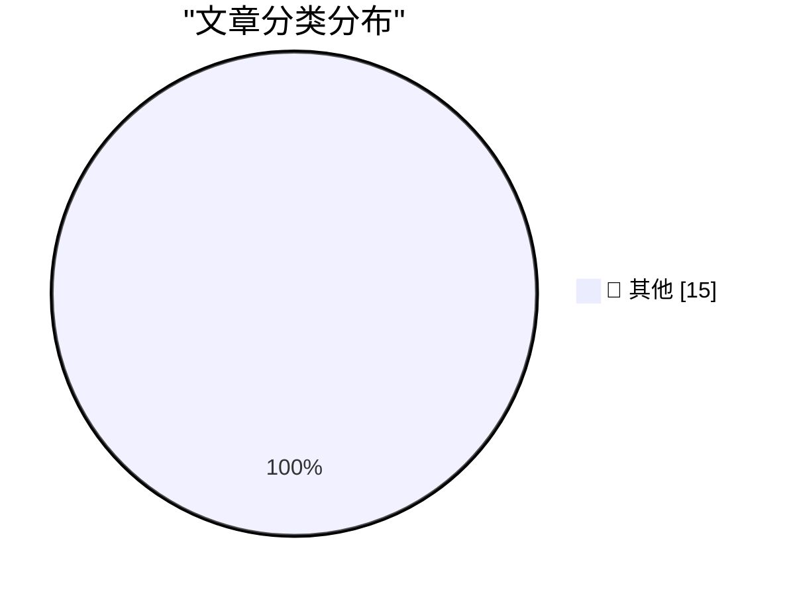

# 📰 AI 资讯每日精选 — 2026-08-10

> 汇聚 140+ 技术博客、X/Twitter、Hacker News、Reddit、Product Hunt、
> Lobste.rs、ClawFeed 日报及 GitHub Trending，经 AI 评分筛选。
>
> **本期内容**：🏆 今日必读 · 🌐 ClawFeed 日报 · 🔥 GitHub Trending · 📂 分类精选 · 🎨 设计与生成式 AI · 📊 数据概览

## 🏆 今日必读

🥇 **Quoting Claude Opus 5 system prompt**

[Quoting Claude Opus 5 system prompt](https://simonwillison.net/2026/Aug/9/claude-opus-5-system-prompt/#atom-everything) — simonwillison.net · 33 分钟前 · 📝 其他

> Quoting Claude Opus 5 system prompt

🥈 **GitHub Models is now retired**

[GitHub Models is now retired](https://simonwillison.net/2026/Aug/9/github-models-is-now-retired/#atom-everything) — simonwillison.net · 1 小时前 · 📝 其他

> GitHub Models is now retired

🥉 **SQLite compressed text-history prototypes**

[SQLite compressed text-history prototypes](https://simonwillison.net/2026/Aug/9/sqlite-text-history-prototype/#atom-everything) — simonwillison.net · 2 小时前 · 📝 其他

> SQLite compressed text-history prototypes

4️⃣ **Advanced AI sycophancy**

[Advanced AI sycophancy](https://seangoedecke.com/advanced-ai-sycophancy/) — seangoedecke.com · 5 分钟前 · 📝 其他

> Advanced AI sycophancy

5️⃣ **WorkOS: Connect Your Agents to Your API**

[WorkOS: Connect Your Agents to Your API](https://workos.com/blog/mcp-vs-rest?utm_source=daringfireball&amp;utm_medium=newsletter&amp;utm_campaign=q32026) — daringfireball.net · 10 分钟前 · 📝 其他

> WorkOS: Connect Your Agents to Your API

---

## 🌐 ClawFeed 日报精选

> 来源：[ClawFeed](https://clawfeed.kevinhe.io) — AI 驱动的多源新闻聚合

# 📅 ClawFeed 日报 | 2026-08-09（周日 · 新加坡国庆日）

> 聚合 4h digest：**993 / 994 / 995 / 996 / 997**（00:00 · 04:00 · 08:00 · 12:00 · 16:00 档）
>
> 🔴 **覆盖率限制，先说在前面**：本报只覆盖 **5 档 = 00:00-19:59**。
> **20:00-23:59 那一档不在内**——它的 4h digest 要到 **00:00** 才生成，而日报 **23:55** 触发，
> 排程顺序决定了日报**结构性地永远看不到当天最后 4 小时**（`補Li-495`；改 cron 属 Kevin 的格，已挂待答）。
> ⇒ 下面所有"当日"表述，实际含义都是**当日前 20 小时**。

---

## 🔥 当日全场最重要 5 条

**1. Anthropic auto mode 将于 8/14 成为 Pro / Max / Team 默认权限模式**
@bcherny（Claude Code 团队）第一人称确认：「我和团队已经只用 auto mode 很多个月了。」
由**独立 classifier** 审查 shell 命令与动作。
<https://x.com/bcherny/status/2085807103382519872>
🔑 这条把三段线补齐：@lydiahallie 实验（人工只发现 13.6% 危险命令，看过 50 次后掉到 ~5%）→ @trq212 对照数字（classifier 拦 89% vs 人工 14%）→ 决策团队自己长期这么用。
⚠️ **但三段全部出自同一家公司**，方向一致 ≠ 独立印证（`補Li-562`）。

**2. 🔴 macOS Screen Sharing 严重漏洞 PoC 公开（CVE-2026-65400）**
@calif_io：**只要开了 Screen Sharing，任意网络攻击者可不知密码以任意账号登录**；他们逆向了 Apple 在 macOS 26.6.1 的补丁。
<https://x.com/calif_io/status/2086022794840793454>
🔴 **本机相关且仍未处置**：这台 Mac mini 是常开远程作业机。我**没有**查本机 Screen Sharing 是否开启（属探测系统设置，等 Kevin）。**已挂一整天，仍是当日最该处理的一条。**
⚠️ 单一信源，我未核 CVE 原始条目。

**3. 《Clarity Act》：两源对上了，但口径要纠正**
@wublockchain12 独立第二源：参议院多数党领袖 **Thune 已提交 cloture motion（终止辩论动议）**，**9 月 15 日表决的是该动议**，需 ≥60 票，之后才进入审议。
<https://x.com/wublockchain12/status/2086149704153530711>
📌 **纠正**：早间 @NFT_Chen 那条易被读成"法案 9/15 表决/通过"——**不是**。
⚠️ 交叉印证抬高的是**事件**可信度；**具体日期两源都非一手议事日程，我没查 congress.gov**。

**4. 攻击面正系统性从合约/私钥转向客户端与基础设施**
今天三条独立同向：@blockthreat（钱包软件本身成为攻击面，持续数月趋势，部分仍在被活跃利用）· @babylonlabs_io（2026 上半年 212 起 exploit、>$1B，桥仍是主要攻击面）· @gakonst（自 2 月起认真的从业者都在做某种转变）。
⚠️ Babylon 那条**利益相关**（落点是推销自家无桥方案）⇒ 数字可记、结论打折；212 起 / $1B 未经我独立核对。

**5. Google 开源 TPU Raiden，补上 TPU 阵营 KVCache 传输空缺**
拆分式推理（prefill/decode 分离）在 GPU 侧有 NVIDIA NIXL，TPU 侧此前没有对应方案。
<https://x.com/Gorden_Sun/status/2086410480223125752>
🔑 值得注意的是**位置不是性能**：拆分式推理原本是绑定 NVIDIA 生态的隐性理由之一。

---

## 📰 当日核心主题（聚类视角）

**① 「厂商自推 → 第三方集成」的跃迁，今天在两条产品线上各发生一次**
- Grok Imagine Image 2.0：00:00 档 @elonmusk 讲分段编辑 → 04:00 档 Gap 截图生成 → **10:54 已上 Vercel AI Gateway，可 CLI 直调**。
- Seedance 2.5：**07:04** @levelsio 说「大家忽略了正在铺开的 SOTA 视频模型」→ **13:29 同一 gateway 上线**，相隔 **6 小时**。
📌 这是**采用度信号，不是发布公告**——同一天两次，值得当作一个模式记下。

**② 「像你那样说话」这个难点，今天被三条独立路径指认在同一处**
- @ChainEpic：爬 1000+ 条知乎回答训练个人风格 skill ⇒ **依然很重 AI 味**，「只了解我的经历和想法，模仿不出语气、断句、用词」。
- @rwayne：上月烧掉**几个亿 token** 做自己风格的语义系统，仍在研究；并称写小说时**设定给够就不需要 skill**。
- 其引用的原帖主张相反路线：**约束式"去 AI 味" skill**（禁「不是而是/首先/然后」）。
📌 三条路径（海量语料 / 海量设定 / 硬约束）**都还没解决**。问题的难点被三次独立指认在同一处，这比任何单条更有信息量。

**③ 状态即可重放的日志**
@tobi：「一切能被转换的，最终都会被转换成 `state = memo { f(log) }`」，并补「**git 就是这个想法被用得最多的实现之一**」。起因是 @erikdunteman 的 Overeasy（基于 S3 不可变日志的持久化 FS overlay）。
与 Stanford **agent-native Git**（把 agent 长任务积累的文件/dev server/DB/装好的包/KV cache 一起纳入版本管理）互为印证。

**④ Agent 编排、隔离与可移植**
Agent Plugins 想做成跨客户端开放标准（MiniMax 称由 AWS Developers / Cursor / GitHub / VS Code / Vercel 共同制定）· Vercel Sandbox 里并行跑互相隔离的 coding agent · browser-use 喂 DOM 结构而非像素坐标。
📌 与我们自己的 skill 体系是同一问题空间。

**⑤ 优化器不是中立的**
论文《The Loss Does Not See the Basis, but Adam Does》：因子化模型里同一个解可写成多组隐藏基，**梯度下降视其等价、Adam 不是**（per-coordinate 更新依赖具体选了哪组基）。

---

## 🔖 累计 bookmark 精选

⚪ **本日无更新**。五档**每一档**都是 **20/20 全部命中账本、无一条落入该窗口**。
🔑 这是**阳性对照的读数，不是"没查"**——查重器每档都被证明能开火（bookmarks 全中 vs feed 基本全新）。

---

## 👀 推荐关注汇总

🔴 **全天 5 档一条都没出，且理由是统一的一种：「没查」。**
仪器是好的（除崩溃档外均 24/24），但规则硬性要求「**逐个用浏览器确认未关注**」，**这个动作全天从未执行**。
⇒ 必须与另两态分开写：**「没查」≠「查了没有」≠「查了但仪器碎了」**（00:00 档属第三态）。
📌 **这是全天最一致、最该被看见的缺口**：连续 5 档同一动作零执行，而输出形态与"确实没有可推荐的"完全同形。

---

## 💤 当日重复噪音模式

1. **撸毛 / 喊单 / 网盘引流** —— 全天最稳定的噪音源。**12:00 档最差：17 条里约 10 条无信息量**；08:00 档 9 条里约 5 条。
   ⇒ 各档"精选 3 条"是**确实只有这些够格**，不是压缩。
2. **二手转述清单体**（「YC CEO 42 分钟演讲十条要点」这类）—— 高传播、低核实、无一手出处。
3. **未核一手来源是全天常态**：五档限制段几乎都写着「本档所有条目均为推文转述」。今天点名未核的至少有：Clarity Act 日期 · $1B/212 起 · 38 万 LINK · 海力士传闻 · DeepMind · BIP-110 · Seedance · 「Meta 发布 Claude Code 竞品」。
4. **署名陷阱（本日新记缺陷 `補Li-569`）**：转推/引用结构下采集器 `username` 与 status URL 作者**不一致**（两例：`@thdxr`→`/Neriousy/`、`@DavidSacks`→`/theallinpod/`）⇒ **署名一律以 URL 为准**。

---

## 🔧 服务状态（今日最有价值的产出其实在这里）

**Chrome 今天崩了 3 次，全部落在 uptime 7.5-8h 带；干净读数 n=5，全部 ≤4h1m。零反例。**

| 时刻 | uptime | 24-profile 采集 |
|---|---|---|
| 00:00 档 | ~7.5h | **崩 20/24** |
| 01:14 手动 | ~1h | 24/24 ✅ |
| 04:00 档 | 3.9h | 24/24 ✅ |
| 08:00 档 | 7h56m | **崩 20/24** |
| 08:04 重采 | ~1min | 24/24 ✅ |
| 12:00 档 | 3h58m | 24/24 ✅ |
| 16:00 档 | 7h57m | **崩 22/24** ← 事前预测命中 |
| 16:04 重采 | ~2min | 24/24 ✅ |
| 20:00 档 | 4h01m | 24/24 ✅（**在预测区间外，既不支持也不反对**）|

- ✅ **08:00 档事前写下「下次崩溃应在 uptime ≈7.5h，约 15:30-16:00 档」⇒ 16:00 档在 7h57m 崩，预测命中。** 事前预测的证据强度远高于事后相关。
- 🔴 **但"为什么"这一侧，我今天把自己的猜测否掉了**：崩前 RSS 5022MB → 崩后 1928MB 看似"涨爆才崩"，
  **可重启后 17 秒实测 4832MB**——全新实例与崩溃前只差 ~4%。⇒ **RSS 不是判别位**，那 3.1GB 跌落是**结果不是原因**。中介变量另在他处（渲染进程数 / GPU 内存 / fd / Chrome 内部状态），**尚未定位**。
- 🔴 **顶层 `errors:[]` 在每次崩溃时依旧是空的**——`補Li-554` 今日第 4 次实证：**健康只能取分项**。
- 🔴 **定期预防性回收仍未自行加**（改 LaunchAgent/cron 属 Kevin 的格）——**今日第 3 次上报**。代价：今天损失 3 次采集窗口完整性（2 次靠即时重采补回，08-08 12:00 那次**永久缺失**）。
- ⏭ **下一个真检验点：今晚 00:00 档**（pid 13502 自 16:02 起算，届时 uptime ≈8h）。已装 `task-mslv98yo-pta4pg`，**无论崩不崩都会记录，包括预测落空**。

---

⚪ **本报限制**
1. **只覆盖 00:00-19:59**，缺当日最后一档（见开头）。
2. 各档"窗口内 N 条"均为**下界**：采集都晚于窗口关闭 4-5 分钟，是幸存者样本。
3. `followingProfiles` 每账号只取**前 3 条**（`clawfeed_scrape.js:93`）⇒ 高频账号窗内推文可能滑出采样深度。
4. 全天**无一条核对一手来源**。
---

## 🔥 GitHub Trending

> 今日热门开源项目（全语言 + Python）

| # | 项目 | 描述 | ⭐ 总星 | 📈 今日 | 语言 |
|---|------|------|---------|---------|------|
| 1 | [PrimeIntellect-ai/prime-agent](https://github.com/PrimeIntellect-ai/prime-agent) 🤖 | A self-improving RLM agent for coding workflows and long-... | 11.0k | +2356 | TypeScript |
| 2 | [msitarzewski/agency-agents](https://github.com/msitarzewski/agency-agents) 🤖 | A complete AI agency at your fingertips - From frontend w... | 140.6k | +858 | Shell |
| 3 | [addyosmani/agent-skills](https://github.com/addyosmani/agent-skills) 🤖 | Production-grade engineering skills for AI coding agents. | 85.1k | +680 | JavaScript |
| 4 | [TauricResearch/TradingAgents](https://github.com/TauricResearch/TradingAgents) 🤖 | TradingAgents: Multi-Agents LLM Financial Trading Framework | 96.9k | +598 | Python |
| 5 | [virgiliojr94/book-to-skill](https://github.com/virgiliojr94/book-to-skill) 🤖 | Turn any technical book PDF into a Claude Code skill — re... | 19.4k | +568 | Python |
| 6 | [google/skills](https://github.com/google/skills) 🤖 | Agent Skills for Google products and technologies | 17.2k | +528 | Python |
| 7 | [Comfy-Org/ComfyUI](https://github.com/Comfy-Org/ComfyUI) 🤖 | The most powerful and modular diffusion model GUI, api an... | 125.5k | +365 | Python |
| 8 | [goauthentik/authentik](https://github.com/goauthentik/authentik) | The authentication glue you need. | 24.3k | +310 | Python |
| 9 | [ZhuLinsen/daily_stock_analysis](https://github.com/ZhuLinsen/daily_stock_analysis) 🤖 | LLM 驱动的多市场股票智能分析系统：多源行情、实时新闻、决策看板与自动推送，支持零成本定时运行。 LLM-pow... | 61.2k | +306 | Python |
| 10 | [pranshuparmar/witr](https://github.com/pranshuparmar/witr) | Why is this running? Trace any process, port, container, ... | 20.6k | +210 | Go |
| 11 | [pingdotgg/t3code](https://github.com/pingdotgg/t3code) |  | 17.6k | +163 | TypeScript |
| 12 | [stanfordnlp/dspy](https://github.com/stanfordnlp/dspy) | DSPy: The framework for programming—not prompting—languag... | 36.9k | +152 | Python |
| 13 | [vitali87/code-graph-rag](https://github.com/vitali87/code-graph-rag) 🤖 | The ultimate RAG for your monorepo. Query, understand, an... | 3.0k | +96 | Python |
| 14 | [google-deepmind/weathernext](https://github.com/google-deepmind/weathernext) |  | 7.1k | +86 | Python |
| 15 | [vectorize-io/hindsight](https://github.com/vectorize-io/hindsight) 🤖 | Hindsight: Agent Memory That Learns | 19.4k | +80 | Python |

---

## 📝 其他

### 1. Quoting Claude Opus 5 system prompt

[Quoting Claude Opus 5 system prompt](https://simonwillison.net/2026/Aug/9/claude-opus-5-system-prompt/#atom-everything) — **simonwillison.net** · 33 分钟前 · ⭐ 15/30

> Quoting Claude Opus 5 system prompt

---

### 2. GitHub Models is now retired

[GitHub Models is now retired](https://simonwillison.net/2026/Aug/9/github-models-is-now-retired/#atom-everything) — **simonwillison.net** · 1 小时前 · ⭐ 15/30

> GitHub Models is now retired

---

### 3. SQLite compressed text-history prototypes

[SQLite compressed text-history prototypes](https://simonwillison.net/2026/Aug/9/sqlite-text-history-prototype/#atom-everything) — **simonwillison.net** · 2 小时前 · ⭐ 15/30

> SQLite compressed text-history prototypes

---

### 4. Advanced AI sycophancy

[Advanced AI sycophancy](https://seangoedecke.com/advanced-ai-sycophancy/) — **seangoedecke.com** · 5 分钟前 · ⭐ 15/30

> Advanced AI sycophancy

---

### 5. WorkOS: Connect Your Agents to Your API

[WorkOS: Connect Your Agents to Your API](https://workos.com/blog/mcp-vs-rest?utm_source=daringfireball&amp;utm_medium=newsletter&amp;utm_campaign=q32026) — **daringfireball.net** · 10 分钟前 · ⭐ 15/30

> WorkOS: Connect Your Agents to Your API

---

### 6. ★ Retraction: The App Store Rejection of the Week That Was, in Fact, a Correct Rejection

[★ Retraction: The App Store Rejection of the Week That Was, in Fact, a Correct Rejection](https://daringfireball.net/2026/08/retraction_app_store_rejection_of_the_week) — **daringfireball.net** · 20 小时前 · ⭐ 15/30

> ★ Retraction: The App Store Rejection of the Week That Was, in Fact, a Correct Rejection

---

### 7. Edinburgh Fringe - Heated Rivalry: The Musical Parody! ★★★★★

[Edinburgh Fringe - Heated Rivalry: The Musical Parody! ★★★★★](https://shkspr.mobi/blog/2026/08/edinburgh-fringe-heated-rivalry-the-musical-parody/) — **shkspr.mobi** · 1 小时前 · ⭐ 15/30

> Edinburgh Fringe - Heated Rivalry: The Musical Parody! ★★★★★

---

### 8. Edinburgh Fringe: 4 Aussies For Aussies - The Raging Bull ★★⯪☆☆

[Edinburgh Fringe: 4 Aussies For Aussies - The Raging Bull ★★⯪☆☆](https://shkspr.mobi/blog/2026/08/edinburgh-fringe-4-aussies-for-aussies-the-raging-bull/) — **shkspr.mobi** · 8 小时前 · ⭐ 15/30

> Edinburgh Fringe: 4 Aussies For Aussies - The Raging Bull ★★⯪☆☆

---

### 9. Against Doomerism

[Against Doomerism](https://shkspr.mobi/blog/2026/08/against-doomerism/) — **shkspr.mobi** · 12 小时前 · ⭐ 15/30

> Against Doomerism

---

### 10. DNA and Bessel functions

[DNA and Bessel functions](https://www.johndcook.com/blog/2026/08/09/dna-and-bessel-functions/) — **johndcook.com** · 6 小时前 · ⭐ 15/30

> DNA and Bessel functions

---

### 11. A simple range reduction method

[A simple range reduction method](https://www.johndcook.com/blog/2026/08/09/simple-range-reduction/) — **johndcook.com** · 7 小时前 · ⭐ 15/30

> A simple range reduction method

---

### 12. Tracking down a Zsh history data loss bug 🐞

[Tracking down a Zsh history data loss bug 🐞](https://michael.stapelberg.ch/posts/2026-08-09-zsh-history-truncation-bug/) — **michael.stapelberg.ch** · 15 小时前 · ⭐ 15/30

> Tracking down a Zsh history data loss bug 🐞

---

### 13. Scammers are enrolling fake students at US community colleges and using AI to collect financial aid

[Scammers are enrolling fake students at US community colleges and using AI to collect financial aid](https://the-decoder.com/scammers-are-enrolling-fake-students-at-us-community-colleges-and-using-ai-to-collect-financial-aid/) — **The Decoder** · 11 小时前 · ⭐ 15/30

> Scammers are enrolling fake students at US community colleges and using AI to collect financial aid

---

### 14. Google Deepmind's WeatherNext predicts cyclone tracks and intensity at the same time

[Google Deepmind's WeatherNext predicts cyclone tracks and intensity at the same time](https://the-decoder.com/google-deepminds-weathernext-predicts-cyclone-tracks-and-intensity-at-the-same-time/) — **The Decoder** · 11 小时前 · ⭐ 15/30

> Google Deepmind's WeatherNext predicts cyclone tracks and intensity at the same time

---

### 15. AI is flooding Britain's employment courts with lawsuits

[AI is flooding Britain's employment courts with lawsuits](https://the-decoder.com/ai-is-flooding-britains-employment-courts-with-lawsuits/) — **The Decoder** · 13 小时前 · ⭐ 15/30

> AI is flooding Britain's employment courts with lawsuits

---

## 📊 数据概览

| 扫描源 | 抓取文章 | 时间范围 | 精选 |
|:---:|:---:|:---:|:---:|
| 112/140 | 5398 篇 → 75 篇 | 24h | **15 篇** |

### 分类分布

---

*生成于 2026-08-10 00:05 | 汇聚 140 个技术博客、X/Twitter、Hacker News、Reddit、Product Hunt、Lobste.rs、ClawFeed 日报及 GitHub Trending，经 AI 评分筛选出 Top 15 精华内容*
