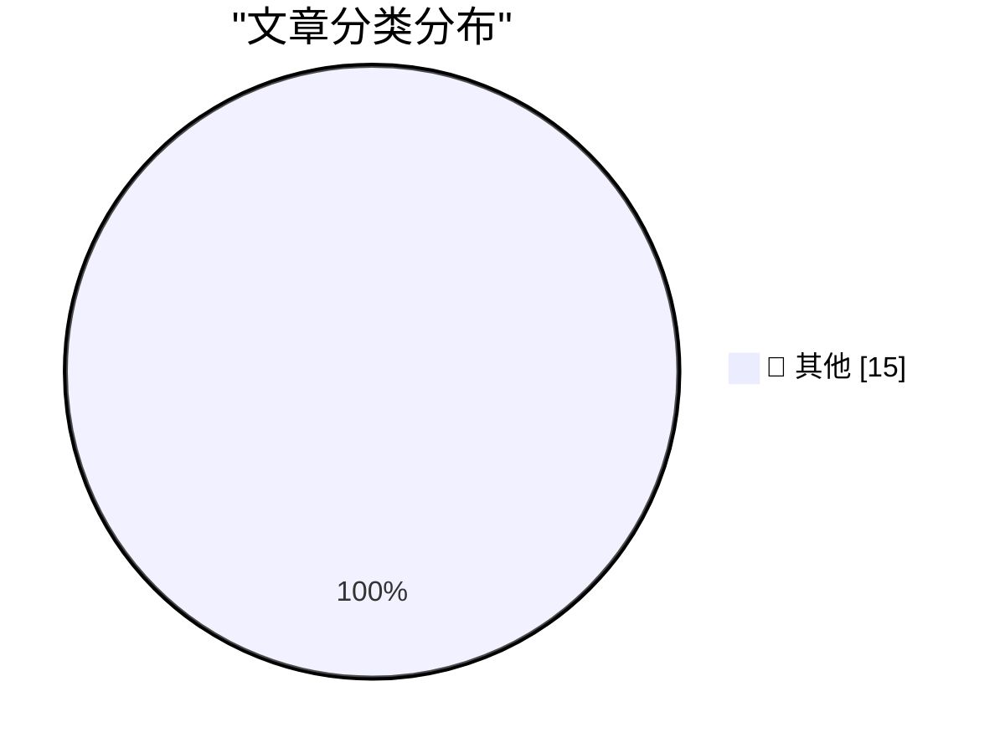

# 📰 AI 资讯每日精选 — 2026-08-17

> 汇聚 140+ 技术博客、X/Twitter、Hacker News、Reddit、Product Hunt、
> Lobste.rs、ClawFeed 日报及 GitHub Trending，经 AI 评分筛选。
>
> **本期内容**：🏆 今日必读 · 🌐 ClawFeed 日报 · 🔥 GitHub Trending · 📂 分类精选 · 🎨 设计与生成式 AI · 📊 数据概览

## 🏆 今日必读

🥇 **We Tracked a Shipment of Rare Books. It Ended at an Amazon AI Training Facility**

[We Tracked a Shipment of Rare Books. It Ended at an Amazon AI Training Facility](https://simonwillison.net/2026/Aug/17/we-tracked-a-shipment-of-rare-books-it-ended-at-an-amazon-ai-tra/) — simonwillison.net · 8 小时前 · 📝 其他

> We Tracked a Shipment of Rare Books. It Ended at an Amazon AI Training Facility

🥈 **Markdown SVG upgrades**

[Markdown SVG upgrades](https://simonwillison.net/2026/Aug/16/markdown-svg-upgrades/) — simonwillison.net · 23 小时前 · 📝 其他

> Markdown SVG upgrades

🥉 **Apple TV Still Has No Start Date for ‘The Savant’**

[Apple TV Still Has No Start Date for ‘The Savant’](https://daringfireball.net/linked/2026/04/19/chastain-says-the-savant-will-be-released) — daringfireball.net · 1 小时前 · 📝 其他

> Apple TV Still Has No Start Date for ‘The Savant’

4️⃣ **No Update Since Early July Regarding Siri AI Coming to the EU, Ever**

[No Update Since Early July Regarding Siri AI Coming to the EU, Ever](https://www.ft.com/content/807d25c3-f4ac-4402-b815-3aa91018237d) — daringfireball.net · 2 小时前 · 📝 其他

> No Update Since Early July Regarding Siri AI Coming to the EU, Ever

5️⃣ **Pluralistic: Jennifer Jenkins' 'Music Copyright, Creativity, and Culture' (17 Aug 2026)**

[Pluralistic: Jennifer Jenkins' 'Music Copyright, Creativity, and Culture' (17 Aug 2026)](https://pluralistic.net/2026/08/17/great-sousas-ghost/) — pluralistic.net · 16 小时前 · 📝 其他

> Pluralistic: Jennifer Jenkins' 'Music Copyright, Creativity, and Culture' (17 Aug 2026)

---

## 🌐 ClawFeed 日报精选

> 来源：[ClawFeed](https://clawfeed.kevinhe.io) — AI 驱动的多源新闻聚合

📅 ClawFeed 日报 | 2026-08-17 (SGT)

聚合 **2 期 4h digest**：DB `1016`(16:00-19:59) · `1017`(20:00-23:59)

🔴 **覆盖范围先说清楚：本日报只覆盖 16:00-23:59，即 24 小时里的 8 小时。**
08-12 至 08-17 15:59 期间 CDP 未持续运行（Chrome 崩溃+重启期间积累的停机），无 4h digest 数据。
本日报是**恢复后首日的部分快照**，不代表全天信息全貌。

---

## 🔥 当日最重要 3 条（跨档排序·已去重）

**1️⃣ Stripe 以 $7B 收购 OpenRouter——AI 路由/中间件被正式定价**（16:00 + 20:00 两档独立覆盖）
@aiandcloud 首发：70 亿美元估值（此前报价 100 亿，砍了 30%），OpenRouter 年化营收 $1.4 亿，毛利率 70%（比 OpenAI/Anthropic 的 40% 高得多）。
@TechFlowPost 补深度：创始人 Alex Atallah（前 OpenSea）曾自称要做"AI 界的 Stripe"，结果被 Stripe 本尊收购。Stripe 自身是支付基础设施，收一个 AI 路由基础设施 = 向 AI infra 纵深布局。
https://x.com/aiandcloud/status/2089148467843141964 · https://x.com/TechFlowPost/status/2089207340654264336
🔑 **中间件层从"规模大点的中转站"变成 $7B 生意，中立定位在并购后面临考验。**

**2️⃣ Cursor 发布 Origin——自研代码托管平台，IDE 厂商垂直整合 code hosting**（20:00 档）
@benln 报道：Cursor 团队发布 Origin，与 Cursor IDE 深度集成，支持从 GitHub 同步 repo。
GitHub 的代码托管垄断首次面临来自 AI-native 工具链的挑战。
https://x.com/benln/status/2089401249154072599
🔑 **从编辑器扩展到 hosting，AI IDE 开始全栈化。**

**3️⃣ Anthropic 水印技术——无质量损失实现，配合 EU AI Act 合规**（20:00 档，延续 08-11 水印讨论）
@trq212 (Thariq, Anthropic 工程师) 解释水印实现机制，主要 AI 厂商都已签署 EU AI Act Code of Practice，水印将成标配。做了一个互动 artifact 帮助理解原理。
https://x.com/trq212/status/2088721023223132213
🔑 与 08-11 日报的"人类文本被 Claude 编辑后也算 AI 生成"争议形成连续线：**技术可行性与归属判定是两个独立问题。**

---

## 📰 当日核心主题（聚类）

**① AI 基础设施并购与定价** — Stripe/OpenRouter $7B 收购是主线（两档独立覆盖）；Cursor Origin 代表 AI 工具链纵向整合。中间件和托管层正在被重新定价。

**② Harness 工程持续升温** — Patrick Collison (Stripe CEO)："agentic coding harness 不应该以终端为主"，终端信息密度低、UI affordance 最小（16:00）· @kirillk_web3 + @AnatoliKopadze：Loop Engineering → Graph Engineering，Claude Code 负责人原话"I'm not prompting my agents anymore, I'm building graphs and loops"（16:00，两条合计 1.5M+ views）· @NFT_Chen 发现 DSH 极简模式一行 bug 修复提速 70 倍（16:00）· @yanhua1010 引 Pi agent 框架设计哲学：核心压缩到 read/write/edit/bash 四个工具（20:00）。
📌 从"要不要用 harness"变成"怎么建 harness"——实操层的讨论密度今天最高。

**③ AI 采纳鸿沟** — @levie (Aaron Levie, Box CEO)：企业 AI 支出中位数 $12/员工/月 vs top 1% $7,500/员工/月，625 倍差距可能是 AI 时代最大的采纳鸿沟（16:00）· Andrew Ng AI Engineering Skills Map 基于 1 万+招聘需求拆解四大能力块（16:00 + 20:00 两档覆盖）。

**④ 安全 vs 进步** — @quxiaoyin 致 Dario Amodei 公开信：如果 Claude 能治癌症为什么要 pace the progress？455K views（16:00）· @elonmusk 回应 AI 风险消息争议（20:00）· Thariq 水印技术（20:00）。同一方向的三个切面：能力约束的合理性。

---

## 📰 Feed 精选补充（未入主题聚类的独立亮点）

• @MaxForAI - 失业工程师花 6 个月逆向 AMD/Taalas AI 推理芯片专利，声称 100x 更少 memfetch、更好量化，写了编译器直接吃 HuggingFace checkpoint（16:00）https://x.com/MaxForAI/status/2089132978953941448

• @gengdaJ - TW93 的 Kami：极简纸媒化设计（羊皮纸色 #f5f4ed，墨蓝 #1B365D），做简历/Slides 的美学标杆（16:00）https://x.com/gengdaJ/status/2089179069678260362

• @paulg - Paul Graham：经济不平等增长不是因为税收政策，是因为技术让创业越来越容易、公司增长越来越快（16:00）https://x.com/paulg/status/2089095591712506040

• @dotey - Codex 开启 1M 上下文方法：config.toml 设 model="gpt-5.6-sol"（20:00）https://x.com/dotey/status/2089094793078952339

• @xiaohu - Claude 账号被封后申诉一天解封，反向索要 3 个月 20x 会员补偿，社区热议 Anthropic 封号/申诉流程（20:00）https://x.com/xiaohu/status/2089198854935908637

## 🔖 累计 bookmark

🔴 16:00 档 bookmarks 19 条（非零），20:00 档 bookmarks 页面未能加载（Chrome 53 tabs 超载，CDP 导航上下文被销毁）⇒ **仅 1/2 档有 bookmark 数据。**
16:00 档 bookmark 精选已在该期 4h digest 中列出（@trq212 system prompt 精简、@BruceGuai Matrix Agent OS、@heynavtoor Harness Engineering、@mntruell 第三代 AI 开发、@levie 三篇长文）。

## 👀 推荐关注汇总（候选）

@plugyawn (Progyan) — 独立逆向 AMD/Taalas AI 芯片专利的工程师 · @JoeyDeepWorld (周.乙) — DSH 工程化深度分析。
🔴 **followingSample 只覆盖 35 个账号，无法证明"未关注"。且 20:00 档因 Chrome 超载未做关注分析。全部仅为候选。**

## 💤 当日噪音

过滤了：@RaminNasibov 纯转发 · @app_sail 段子 · @DRbitcoin36 生活感悟 · @leaf_sanren 育儿鸡汤 · @wey_gu 产品安利 · @elonmusk Grok 推广 · @binance 广告 · @justinsuntron 自演 · @ika_xbt airdrop 炒作 · @Saboo_Shubham_ 纯图片帖。

---

⚠️ **Chrome 状态注意：** 20:00 档运行时 53 tabs 超载导致 CDP 连接需 120s+，profile 导航全部 context destroyed，bookmarks 和 followingProfiles 均失败。建议下次 digest 前清理非必要标签页（参见 state.md 補Li-582 待 Kevin 裁决）。
---

## 🔥 GitHub Trending

> 今日热门开源项目（全语言 + Python）

| # | 项目 | 描述 | ⭐ 总星 | 📈 今日 | 语言 |
|---|------|------|---------|---------|------|
| 1 | [public-apis/public-apis](https://github.com/public-apis/public-apis) | A collective list of free APIs | 463.2k | +2035 | Python |
| 2 | [harry0703/MoneyPrinterTurbo](https://github.com/harry0703/MoneyPrinterTurbo) 🤖 | 利用 AI 大模型和自动化工作流，根据主题或关键词一键生成高清短视频。Generate HD short vide... | 106.0k | +1275 | Python |
| 3 | [cordiverse/cordis](https://github.com/cordiverse/cordis) | Meta-Framework of Spatiotemporal Composability | 5.6k | +959 | TypeScript |
| 4 | [unslothai/unsloth](https://github.com/unslothai/unsloth) 🤖 | Local UI to run and train LLMs and diffusion models, incl... | 73.2k | +784 | Python |
| 5 | [cactus-compute/needle](https://github.com/cactus-compute/needle) | 14MB foundation model for tiny devices; phones, wearables... | 7.1k | +729 | Python |
| 6 | [usestrix/strix](https://github.com/usestrix/strix) 🤖 | Open-source AI penetration testing tool to find and fix y... | 54.1k | +656 | Python |
| 7 | [titanwings/colleague-skill](https://github.com/titanwings/colleague-skill) | 将冰冷的离别化为温暖的 Skill，欢迎加入数字生命1.0！Transforming cold farewells... | 23.1k | +390 | Python |
| 8 | [D4Vinci/Scrapling](https://github.com/D4Vinci/Scrapling) | 🕷️ An adaptive Web Scraping framework that handles every... | 74.8k | +338 | Python |
| 9 | [immich-app/immich](https://github.com/immich-app/immich) | High performance self-hosted photo and video management s... | 111.1k | +337 | TypeScript |
| 10 | [agalwood/Motrix](https://github.com/agalwood/Motrix) | A full-featured download manager. | 53.1k | +295 | TypeScript |
| 11 | [yt-dlp/yt-dlp](https://github.com/yt-dlp/yt-dlp) | A feature-rich command-line audio/video downloader | 185.1k | +276 | Python |
| 12 | [volcengine/OpenViking](https://github.com/volcengine/OpenViking) 🤖 | Self-evolving Context Database for AI Agents. Unify Agent... | 28.9k | +254 | Python |
| 13 | [AlexsJones/llmfit](https://github.com/AlexsJones/llmfit) | Hundreds of models & providers. One command to find what ... | 32.2k | +239 | Rust |
| 14 | [akitaonrails/ai-memory](https://github.com/akitaonrails/ai-memory) 🤖 | Solution for long term memory for agent coding CLIs and t... | 2.0k | +207 | Rust |
| 15 | [anthropics/defending-code-reference-harness](https://github.com/anthropics/defending-code-reference-harness) | Skills for threat modeling, scanning, triage, patching, p... | 7.3k | +176 | Python |

---

## 📝 其他

### 1. We Tracked a Shipment of Rare Books. It Ended at an Amazon AI Training Facility

[We Tracked a Shipment of Rare Books. It Ended at an Amazon AI Training Facility](https://simonwillison.net/2026/Aug/17/we-tracked-a-shipment-of-rare-books-it-ended-at-an-amazon-ai-tra/) — **simonwillison.net** · 8 小时前 · ⭐ 15/30

> We Tracked a Shipment of Rare Books. It Ended at an Amazon AI Training Facility

---

### 2. Markdown SVG upgrades

[Markdown SVG upgrades](https://simonwillison.net/2026/Aug/16/markdown-svg-upgrades/) — **simonwillison.net** · 23 小时前 · ⭐ 15/30

> Markdown SVG upgrades

---

### 3. Apple TV Still Has No Start Date for ‘The Savant’

[Apple TV Still Has No Start Date for ‘The Savant’](https://daringfireball.net/linked/2026/04/19/chastain-says-the-savant-will-be-released) — **daringfireball.net** · 1 小时前 · ⭐ 15/30

> Apple TV Still Has No Start Date for ‘The Savant’

---

### 4. No Update Since Early July Regarding Siri AI Coming to the EU, Ever

[No Update Since Early July Regarding Siri AI Coming to the EU, Ever](https://www.ft.com/content/807d25c3-f4ac-4402-b815-3aa91018237d) — **daringfireball.net** · 2 小时前 · ⭐ 15/30

> No Update Since Early July Regarding Siri AI Coming to the EU, Ever

---

### 5. Pluralistic: Jennifer Jenkins' 'Music Copyright, Creativity, and Culture' (17 Aug 2026)

[Pluralistic: Jennifer Jenkins' 'Music Copyright, Creativity, and Culture' (17 Aug 2026)](https://pluralistic.net/2026/08/17/great-sousas-ghost/) — **pluralistic.net** · 16 小时前 · ⭐ 15/30

> Pluralistic: Jennifer Jenkins' 'Music Copyright, Creativity, and Culture' (17 Aug 2026)

---

### 6. And then the men with guns tell you to do it anyway

[And then the men with guns tell you to do it anyway](https://shkspr.mobi/blog/2026/08/and-then-the-men-with-guns-tell-you-to-do-it-anyway/) — **shkspr.mobi** · 12 小时前 · ⭐ 15/30

> And then the men with guns tell you to do it anyway

---

### 7. How do functions like alloca allocate memory from the stack?

[How do functions like alloca allocate memory from the stack?](https://devblogs.microsoft.com/oldnewthing/20260817-40/?p=112617) — **devblogs.microsoft.com/oldnewthing** · 7 小时前 · ⭐ 15/30

> How do functions like alloca allocate memory from the stack?

---

### 8. Proportion of 1s in a Hadamard matrix

[Proportion of 1s in a Hadamard matrix](https://www.johndcook.com/blog/2026/08/16/proportion-of-1s-in-a-hadamard-matrix/) — **johndcook.com** · 22 小时前 · ⭐ 15/30

> Proportion of 1s in a Hadamard matrix

---

### 9. When the Internet reached half of US households

[When the Internet reached half of US households](https://dfarq.homeip.net/when-the-internet-reached-half-of-us-households/?utm_source=rss&#038;utm_medium=rss&#038;utm_campaign=when-the-internet-reached-half-of-us-households) — **dfarq.homeip.net** · 12 小时前 · ⭐ 15/30

> When the Internet reached half of US households

---

### 10. Quake Shareware, a CD-ROM just a little too full

[Quake Shareware, a CD-ROM just a little too full](https://fabiensanglard.net/quake_shareware_cd/index.html) — **fabiensanglard.net** · 23 小时前 · ⭐ 15/30

> Quake Shareware, a CD-ROM just a little too full

---

### 11. Same Cluster, 33 Points More Utilization: What Changed Was the Order

[Same Cluster, 33 Points More Utilization: What Changed Was the Order](https://huggingface.co/blog/Dharma-AI/gpu-management-pt2) — **Hugging Face Blog** · 4 小时前 · ⭐ 15/30

> Same Cluster, 33 Points More Utilization: What Changed Was the Order

---

### 12. AirTag reveals how Amazon destroys rare books for AI training

[AirTag reveals how Amazon destroys rare books for AI training](https://the-decoder.com/airtag-reveals-how-amazon-destroys-rare-books-for-ai-training/) — **The Decoder** · 9 小时前 · ⭐ 15/30

> AirTag reveals how Amazon destroys rare books for AI training

---

### 13. OpenAI signs record Ohio data center lease with Nvidia backing up to $105 billion

[OpenAI signs record Ohio data center lease with Nvidia backing up to $105 billion](https://the-decoder.com/openai-signs-record-ohio-data-center-lease-with-nvidia-backing-up-to-105-billion/) — **The Decoder** · 9 小时前 · ⭐ 15/30

> OpenAI signs record Ohio data center lease with Nvidia backing up to $105 billion

---

### 14. AI video market has bounced back from Sora's false start

[AI video market has bounced back from Sora's false start](https://the-decoder.com/ai-video-market-has-bounced-back-from-soras-false-start/) — **The Decoder** · 10 小时前 · ⭐ 15/30

> AI video market has bounced back from Sora's false start

---

### 15. Anthropic watermarks Claude's output, but critics question the tradeoffs

[Anthropic watermarks Claude's output, but critics question the tradeoffs](https://the-decoder.com/anthropic-watermarks-claudes-output-but-critics-question-the-tradeoffs/) — **The Decoder** · 12 小时前 · ⭐ 15/30

> Anthropic watermarks Claude's output, but critics question the tradeoffs

---

## 🎨 Design & Generative AI

### 🖼️ 生成式图片

- **[AI video market has bounced back from Sora's false start](https://the-decoder.com/ai-video-market-has-bounced-back-from-soras-false-start/)** — The Decoder · 10 小时前
  > AI video market has bounced back from Sora's false start

---

## 📊 数据概览

| 扫描源 | 抓取文章 | 时间范围 | 精选 |
|:---:|:---:|:---:|:---:|
| 113/140 | 5420 篇 → 87 篇 | 24h | **15 篇** |

### 分类分布

---

*生成于 2026-08-17 23:54 | 汇聚 140 个技术博客、X/Twitter、Hacker News、Reddit、Product Hunt、Lobste.rs、ClawFeed 日报及 GitHub Trending，经 AI 评分筛选出 Top 15 精华内容*
