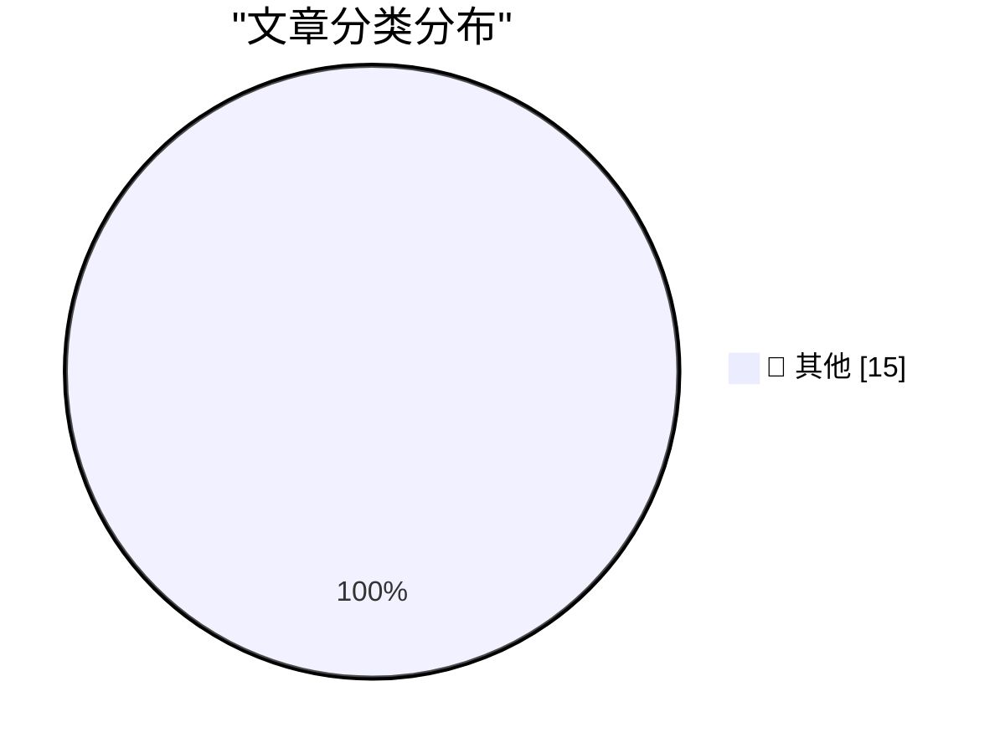

# 📰 AI 资讯每日精选 — 2026-08-18

> 汇聚 140+ 技术博客、X/Twitter、Hacker News、Reddit、Product Hunt、
> Lobste.rs、ClawFeed 日报及 GitHub Trending，经 AI 评分筛选。
>
> **本期内容**：🏆 今日必读 · 🌐 ClawFeed 日报 · 🔥 GitHub Trending · 📂 分类精选 · 🎨 设计与生成式 AI · 📊 数据概览

## 🏆 今日必读

🥇 **Mojo🔥 is now open source**

[Mojo🔥 is now open source](https://simonwillison.net/2026/Aug/18/mojo-is-now-open-source/) — simonwillison.net · 2 小时前 · 📝 其他

> Mojo🔥 is now open source

🥈 **Qwen 3.8 27B scores 52 on the Artificial Analysis Intelligence Index**

[Qwen 3.8 27B scores 52 on the Artificial Analysis Intelligence Index](https://simonwillison.net/2026/Aug/17/qwen-38-27b-scores-52/) — simonwillison.net · 23 小时前 · 📝 其他

> Qwen 3.8 27B scores 52 on the Artificial Analysis Intelligence Index

🥉 **Disney’s ABC Sues Trump’s FCC Over Challenge to Its Broadcast License**

[Disney’s ABC Sues Trump’s FCC Over Challenge to Its Broadcast License](https://www.wsj.com/business/media/disneys-abc-sues-fcc-over-challenge-to-its-broadcast-licenses-64e8f794?st=XTL4tA) — daringfireball.net · 1 小时前 · 📝 其他

> Disney’s ABC Sues Trump’s FCC Over Challenge to Its Broadcast License

4️⃣ **Apple Gives Legal Middle Finger to DOJ Challenge on Apple’s July Discovery Win**

[Apple Gives Legal Middle Finger to DOJ Challenge on Apple’s July Discovery Win](https://9to5mac.com/2026/08/17/apple-dojs-latest-challenge-in-antitrust-case-fails-at-every-level/) — daringfireball.net · 1 小时前 · 📝 其他

> Apple Gives Legal Middle Finger to DOJ Challenge on Apple’s July Discovery Win

5️⃣ **Organized Thieves Are Targeting AI Server Chips With Violent Highway Hijackings**

[Organized Thieves Are Targeting AI Server Chips With Violent Highway Hijackings](https://www.wired.com/story/the-worst-ive-ever-seen-cargo-thieves-are-turning-violent-in-pursuit-of-ai-hardware/) — daringfireball.net · 5 小时前 · 📝 其他

> Organized Thieves Are Targeting AI Server Chips With Violent Highway Hijackings

---

## 🔥 GitHub Trending

> 今日热门开源项目（全语言 + Python）

| # | 项目 | 描述 | ⭐ 总星 | 📈 今日 | 语言 |
|---|------|------|---------|---------|------|
| 1 | [harry0703/MoneyPrinterTurbo](https://github.com/harry0703/MoneyPrinterTurbo) 🤖 | 利用 AI 大模型和自动化工作流，根据主题或关键词一键生成高清短视频。Generate HD short vide... | 108.5k | +2306 | Python |
| 2 | [usestrix/strix](https://github.com/usestrix/strix) 🤖 | Open-source AI penetration testing tool to find and fix y... | 55.1k | +1218 | Python |
| 3 | [public-apis/public-apis](https://github.com/public-apis/public-apis) | A collective list of free APIs | 464.5k | +1139 | Python |
| 4 | [akitaonrails/ai-memory](https://github.com/akitaonrails/ai-memory) 🤖 | Solution for long term memory for agent coding CLIs and t... | 2.7k | +730 | Rust |
| 5 | [mukul975/Anthropic-Cybersecurity-Skills](https://github.com/mukul975/Anthropic-Cybersecurity-Skills) 🤖 | 817 structured cybersecurity skills for AI agents · Mappe... | 29.2k | +726 | Python |
| 6 | [agalwood/Motrix](https://github.com/agalwood/Motrix) | A full-featured download manager. | 53.6k | +607 | TypeScript |
| 7 | [bojieli/ai-agent-book](https://github.com/bojieli/ai-agent-book) 🤖 | 《深入理解 AI Agent：设计原理与工程实践》（李博杰 著）开源主仓库：全书正文、编译版 PDF 与按章配套代码 | 39.1k | +556 | Python |
| 8 | [genlayerlabs/genlayer-project-boilerplate](https://github.com/genlayerlabs/genlayer-project-boilerplate) |  | 15.9k | +543 | TypeScript |
| 9 | [unslothai/unsloth](https://github.com/unslothai/unsloth) 🤖 | Local UI to run and train LLMs and diffusion models, incl... | 73.6k | +443 | Python |
| 10 | [basecamp/omarchy](https://github.com/basecamp/omarchy) | Beautiful, Modern & Opinionated Linux | 26.4k | +411 | Shell |
| 11 | [jundot/omlx](https://github.com/jundot/omlx) 🤖 | LLM inference server with continuous batching & SSD cachi... | 19.4k | +366 | Python |
| 12 | [cactus-compute/needle](https://github.com/cactus-compute/needle) | 14MB foundation model for tiny devices; phones, wearables... | 7.5k | +365 | Python |
| 13 | [volcengine/OpenViking](https://github.com/volcengine/OpenViking) 🤖 | Self-evolving Context Database for AI Agents. Unify Agent... | 29.4k | +298 | Python |
| 14 | [OpenCut-app/OpenCut](https://github.com/OpenCut-app/OpenCut) | The open-source CapCut alternative | 84.8k | +288 | TypeScript |
| 15 | [chaitanyagiri/munder-difflin](https://github.com/chaitanyagiri/munder-difflin) 🤖 | local multi-agent harness | 2.0k | +256 | TypeScript |

---

## 📝 其他

### 1. Mojo🔥 is now open source

[Mojo🔥 is now open source](https://simonwillison.net/2026/Aug/18/mojo-is-now-open-source/) — **simonwillison.net** · 2 小时前 · ⭐ 15/30

> Mojo🔥 is now open source

---

### 2. Qwen 3.8 27B scores 52 on the Artificial Analysis Intelligence Index

[Qwen 3.8 27B scores 52 on the Artificial Analysis Intelligence Index](https://simonwillison.net/2026/Aug/17/qwen-38-27b-scores-52/) — **simonwillison.net** · 23 小时前 · ⭐ 15/30

> Qwen 3.8 27B scores 52 on the Artificial Analysis Intelligence Index

---

### 3. Disney’s ABC Sues Trump’s FCC Over Challenge to Its Broadcast License

[Disney’s ABC Sues Trump’s FCC Over Challenge to Its Broadcast License](https://www.wsj.com/business/media/disneys-abc-sues-fcc-over-challenge-to-its-broadcast-licenses-64e8f794?st=XTL4tA) — **daringfireball.net** · 1 小时前 · ⭐ 15/30

> Disney’s ABC Sues Trump’s FCC Over Challenge to Its Broadcast License

---

### 4. Apple Gives Legal Middle Finger to DOJ Challenge on Apple’s July Discovery Win

[Apple Gives Legal Middle Finger to DOJ Challenge on Apple’s July Discovery Win](https://9to5mac.com/2026/08/17/apple-dojs-latest-challenge-in-antitrust-case-fails-at-every-level/) — **daringfireball.net** · 1 小时前 · ⭐ 15/30

> Apple Gives Legal Middle Finger to DOJ Challenge on Apple’s July Discovery Win

---

### 5. Organized Thieves Are Targeting AI Server Chips With Violent Highway Hijackings

[Organized Thieves Are Targeting AI Server Chips With Violent Highway Hijackings](https://www.wired.com/story/the-worst-ive-ever-seen-cargo-thieves-are-turning-violent-in-pursuit-of-ai-hardware/) — **daringfireball.net** · 5 小时前 · ⭐ 15/30

> Organized Thieves Are Targeting AI Server Chips With Violent Highway Hijackings

---

### 6. ‘Dickover’ Makes It Into The Guardian

[‘Dickover’ Makes It Into The Guardian](https://www.theguardian.com/technology/2026/aug/18/dickovers-baggravation-botiquette-18-new-words-tech-hellscape) — **daringfireball.net** · 7 小时前 · ⭐ 15/30

> ‘Dickover’ Makes It Into The Guardian

---

### 7. OpenAI Pot Complains That Google Kettle Is Black

[OpenAI Pot Complains That Google Kettle Is Black](https://x.com/thsottiaux/status/2083373529081291076?s=12) — **daringfireball.net** · 9 小时前 · ⭐ 15/30

> OpenAI Pot Complains That Google Kettle Is Black

---

### 8. Nature Is Healing: MacOS 27 Golden Gate Beta 6 Adds Redesigned Traffic Light Window Controls

[Nature Is Healing: MacOS 27 Golden Gate Beta 6 Adds Redesigned Traffic Light Window Controls](https://9to5mac.com/2026/08/17/macos-27-golden-gate-beta-6-features-redesigned-traffic-light-window-controls/) — **daringfireball.net** · 11 小时前 · ⭐ 15/30

> Nature Is Healing: MacOS 27 Golden Gate Beta 6 Adds Redesigned Traffic Light Window Controls

---

### 9. MacOS 26.7 Tahoe Release Candidate Contains a Video Demonstrating Camera-Equipped AirPods in Action

[MacOS 26.7 Tahoe Release Candidate Contains a Video Demonstrating Camera-Equipped AirPods in Action](https://www.macrumors.com/2026/08/17/camera-equipped-airpods-macos-26-7/) — **daringfireball.net** · 20 小时前 · ⭐ 15/30

> MacOS 26.7 Tahoe Release Candidate Contains a Video Demonstrating Camera-Equipped AirPods in Action

---

### 10. ★ Follow-Up Thoughts on Watermarking Schemes for AI-Generated Text

[★ Follow-Up Thoughts on Watermarking Schemes for AI-Generated Text](https://daringfireball.net/2026/08/follow-up_thoughts_on_watermarking) — **daringfireball.net** · 22 小时前 · ⭐ 15/30

> ★ Follow-Up Thoughts on Watermarking Schemes for AI-Generated Text

---

### 11. Pluralistic: IP can't save you from AI (18 Aug 2026)

[Pluralistic: IP can't save you from AI (18 Aug 2026)](https://pluralistic.net/2026/08/18/enron-corpus/) — **pluralistic.net** · 9 小时前 · ⭐ 15/30

> Pluralistic: IP can't save you from AI (18 Aug 2026)

---

### 12. The imbalance theorem

[The imbalance theorem](https://www.johndcook.com/blog/2026/08/18/the-imbalance-theorem/) — **johndcook.com** · 7 小时前 · ⭐ 15/30

> The imbalance theorem

---

### 13. Mean distance to the sun

[Mean distance to the sun](https://www.johndcook.com/blog/2026/08/18/mean-distance-to-the-sun/) — **johndcook.com** · 10 小时前 · ⭐ 15/30

> Mean distance to the sun

---

### 14. Two-Factor Authentication Across Package Registries

[Two-Factor Authentication Across Package Registries](https://nesbitt.io/2026/08/18/two-factor-authentication-across-package-registries.html) — **nesbitt.io** · 13 小时前 · ⭐ 15/30

> Two-Factor Authentication Across Package Registries

---

### 15. Vim wants you to control, VSCode wants you to consume

[Vim wants you to control, VSCode wants you to consume](https://buttondown.com/hillelwayne/archive/vim-wants-you-to-control-vscode-wants-you-to/) — **buttondown.com/hillelwayne** · 7 小时前 · ⭐ 15/30

> Vim wants you to control, VSCode wants you to consume

---

## 📊 数据概览

| 扫描源 | 抓取文章 | 时间范围 | 精选 |
|:---:|:---:|:---:|:---:|
| 109/140 | 5324 篇 → 82 篇 | 24h | **15 篇** |

### 分类分布

---

*生成于 2026-08-18 23:54 | 汇聚 140 个技术博客、X/Twitter、Hacker News、Reddit、Product Hunt、Lobste.rs、ClawFeed 日报及 GitHub Trending，经 AI 评分筛选出 Top 15 精华内容*
