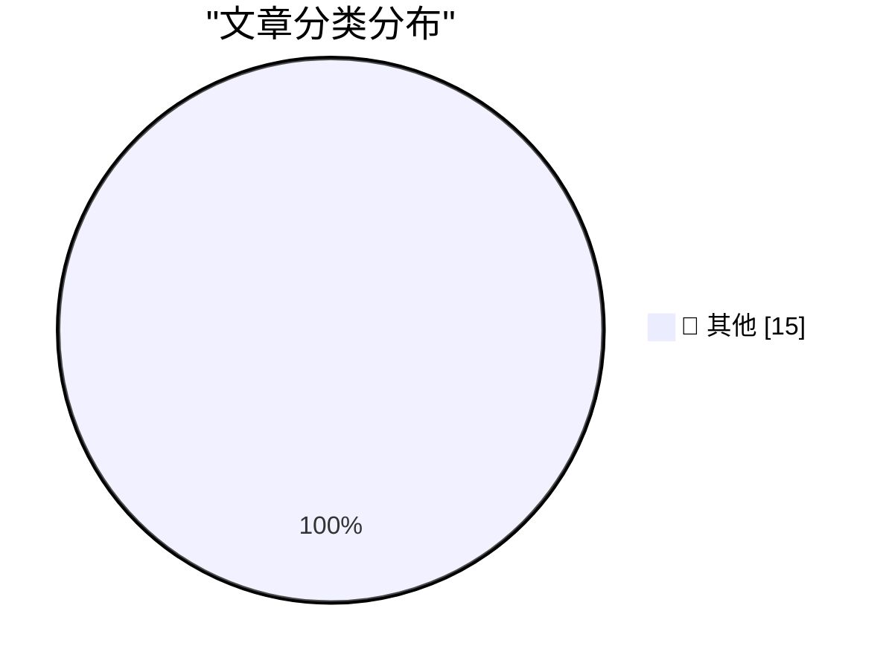

# 📰 AI 资讯每日精选 — 2026-08-19

> 汇聚 140+ 技术博客、X/Twitter、Hacker News、Reddit、Product Hunt、
> Lobste.rs、ClawFeed 日报及 GitHub Trending，经 AI 评分筛选。
>
> **本期内容**：🏆 今日必读 · 🌐 ClawFeed 日报 · 🔥 GitHub Trending · 📂 分类精选 · 🎨 设计与生成式 AI · 📊 数据概览

## 🏆 今日必读

🥇 **smolmachines / smolvm as a sandbox for untrusted Python & JavaScript**

[smolmachines / smolvm as a sandbox for untrusted Python & JavaScript](https://simonwillison.net/2026/Aug/19/smolmachines-untrusted-sandbox/) — simonwillison.net · 38 分钟前 · 📝 其他

> smolmachines / smolvm as a sandbox for untrusted Python & JavaScript

🥈 **Quoting Jeremy Morrell**

[Quoting Jeremy Morrell](https://simonwillison.net/2026/Aug/19/jeremy-morrell/) — simonwillison.net · 58 分钟前 · 📝 其他

> Quoting Jeremy Morrell

🥉 **Conceptual integrity and counting lines of code**

[Conceptual integrity and counting lines of code](https://simonwillison.net/2026/Aug/19/conceptual-integrity-and-counting-lines-of-code/) — simonwillison.net · 1 小时前 · 📝 其他

> Conceptual integrity and counting lines of code

4️⃣ **Hands-on with Raspberry Pi's CM5 Programming Jig**

[Hands-on with Raspberry Pi's CM5 Programming Jig](https://www.jeffgeerling.com/blog/2026/cm5-programming-jig/) — jeffgeerling.com · 16 小时前 · 📝 其他

> Hands-on with Raspberry Pi's CM5 Programming Jig

5️⃣ **Pluralistic: The ordinariness of evil (19 Aug 2026)**

[Pluralistic: The ordinariness of evil (19 Aug 2026)](https://pluralistic.net/2026/08/19/banaility/) — pluralistic.net · 16 小时前 · 📝 其他

> Pluralistic: The ordinariness of evil (19 Aug 2026)

---

## 🌐 ClawFeed 日报精选

> 来源：[ClawFeed](https://clawfeed.kevinhe.io) — AI 驱动的多源新闻聚合

# ClawFeed Daily Digest | 2026-08-18 (Mon)

> 覆盖 3 个 4h 周期 (00:00-11:59 SGT) · feed 89 条 · bookmarks 19 · 聚合自 digest #1020 #1021 #1022

---

## 🔥 当日 Top 5

1. **CFTC + CME AI 算力期货征求意见，10 月 5 日上线两个合约** — AI 算力正式进入金融衍生品市场，30-60 天审查期可能推迟。算力从基础设施变成可交易金融资产。(×2 档出现)

2. **黄仁勋：AI 瓶颈从 GPU 转向土地、电力和数据中心** — NVIDIA 联合 SB Energy 在俄亥俄锁定超大型 AI 基础设施项目，复制此前在晶圆/先进封装/HBM 上提前锁定供应链的打法。AI infra 竞争从算力层下沉到物理层。

3. **Anthropic Claude Code 系统提示词削减约 80%** — 工程师分享为 Claude 5 编写 system prompt / skills / CLAUDE.md 的新规则，harness 工程进入"做减法"阶段。(×2 档出现)

4. **美国电影协会与字节跳动签署 MOU，为 AI 视频设 IP 保护护栏** — 好莱坞与中国 AI 巨头之间首个正式知识产权协议，可能成为行业模板。

5. **Jane Street SEC 披露持有超 $9.9 亿美元比特币 ETF** — 华尔街做市巨头的大规模 BTC 配置，机构采纳加速的又一信号。

---

## 📰 核心主题

### AI 基础设施金融化与物理化
算力期货 (CFTC/CME)、GPU→土地/电力/数据中心 (黄仁勋/SB Energy)、核能创业数据集更新 — AI 竞争从模型层下沉到物理资源层，从技术竞赛变成资本和供应链竞赛。

### AI Agent 生态走向成熟
- Cloudflare `@cloudflare/computer`：给 Agent 配云端虚拟电脑，毫秒级启动
- Claude Code 系统提示词精简 80%：harness 工程做减法
- Matrix Agent "公司 OS" 架构：多 agent 长期协作
- GBrain 自动生成 SOUL.md + 70 个 agent skills
- 56,804 个公开 agent skills 争夺 ~100 个可靠触发位

### Crypto 监管与机构化
- Austin Campbell 解读财政部新规：Coinbase 可能不得不下架 Tether
- Jane Street $9.9 亿 BTC ETF 持仓
- Fireblocks 聘前 SEC 代理主席担任政策主管
- Bitcoin 期货 OI 超日成交量创历史新高，流动性风险

### 跨模型竞争与协作
- GPT Daybreak (Sol) 底层 tool call 调用 Claude Sonnet 5 — OpenAI 产品调用竞品模型
- 豆包客户端大改版：工作任务优先，体验类 Codex，整合飞书
- OpenAI 分享 GPT-5.6 构建低成本 agent 的经验

### 一人公司 / 独立开发者
- wanman.ai 开源：AI agent 团队辅助从零创办一人公司
- Anyway 全球收款：无需公司主体即可面向全球收款
- 腾讯云轻量服务器 $10/年

---

## 🔖 Bookmarks 精选 (去重)

| 来源 | 内容 |
|------|------|
| @AndrewYNg | AI Engineering Skills Map — 基于 10,000+ 招聘需求拆解四大能力块 |
| @xiaohu | Cloudflare @cloudflare/computer — Agent 云端虚拟电脑 |
| @trq212 | Claude Code 系统提示词削减 80% 实操经验 |
| 讲座 | "Claude for Finance" — 量化 AI 领域最值得看的免费 1 小时 |
| Matrix | Agent "公司 OS" 架构深度解析 |
| Chormex | GPT-Realtime-2 实时音频翻译 (YouTube/直播/会议) |
| @turingou | wanman.ai 开源 — AI 一人公司 + Codex 设计师 agent |
| @mntruell | Cursor CEO：AI 软件开发第三纪元 |
| @levie ×3 | Era of Context / Enterprise Software / Capability Overhang 系列 |
| Garry Tan | Demis Hassabis 做客 YC，展示 Google Gemma 创业项目 |

---

## 👀 推荐关注

本日 3 个 4h 周期均报告 followingProfiles 24/24 成功，未发现符合推荐关注标准的新账号。

---

## 💤 重复噪音模式

| 模式 | 出现频率 |
|------|----------|
| Crypto shill / pump 推广 ($onlymarms, $ALIGN, HTX 客服) | ×3 档 |
| 纯行情感叹 ("牛走别来"/"今天弱势收盘") | ×2 档 |
| 个人鸡汤 / 人生感悟 | ×2 档 |
| 纯图帖 / 空内容帖 | ×2 档 |
| 段子 / meme (deepfake, cat vs dog coin, 保安, 历史) | ×1 档 |

---

*Generated from 4h digests #1020, #1021, #1022 (00:00-11:59 SGT). 12:00-23:59 期间的 digest 尚未生成。*---

## 🔥 GitHub Trending

> 今日热门开源项目（全语言 + Python）

| # | 项目 | 描述 | ⭐ 总星 | 📈 今日 | 语言 |
|---|------|------|---------|---------|------|
| 1 | [harry0703/MoneyPrinterTurbo](https://github.com/harry0703/MoneyPrinterTurbo) 🤖 | 利用 AI 大模型和自动化工作流，根据主题或关键词一键生成高清短视频。Generate HD short vide... | 110.6k | +2221 | Python |
| 2 | [amadeusprotocol/node](https://github.com/amadeusprotocol/node) |  | 4.5k | +1415 | Rust |
| 3 | [mattpocock/skills](https://github.com/mattpocock/skills) | Skills for Real Engineers. Straight from my .agents direc... | 223.8k | +1214 | Shell |
| 4 | [volcengine/OpenViking](https://github.com/volcengine/OpenViking) 🤖 | Self-evolving Context Database for AI Agents. Unify Agent... | 30.2k | +803 | Python |
| 5 | [chaitanyagiri/munder-difflin](https://github.com/chaitanyagiri/munder-difflin) 🤖 | local multi-agent harness | 2.7k | +797 | TypeScript |
| 6 | [mukul975/Anthropic-Cybersecurity-Skills](https://github.com/mukul975/Anthropic-Cybersecurity-Skills) 🤖 | 817 structured cybersecurity skills for AI agents · Mappe... | 29.8k | +767 | Python |
| 7 | [akitaonrails/ai-memory](https://github.com/akitaonrails/ai-memory) 🤖 | Solution for long term memory for agent coding CLIs and t... | 3.2k | +609 | Rust |
| 8 | [usestrix/strix](https://github.com/usestrix/strix) 🤖 | Open-source AI penetration testing tool to find and fix y... | 55.7k | +590 | Python |
| 9 | [NousResearch/hermes-agent](https://github.com/NousResearch/hermes-agent) 🤖 | The agent that grows with you | 233.0k | +563 | Python |
| 10 | [obra/superpowers](https://github.com/obra/superpowers) | An agentic skills framework & software development method... | 274.3k | +514 | Shell |
| 11 | [jundot/omlx](https://github.com/jundot/omlx) 🤖 | LLM inference server with continuous batching & SSD cachi... | 19.8k | +467 | Python |
| 12 | [Graphify-Labs/graphify](https://github.com/Graphify-Labs/graphify) 🤖 | Turn any codebase, with its docs, SQL schemas, configs, a... | 108.4k | +454 | Python |
| 13 | [genlayerlabs/genlayer-project-boilerplate](https://github.com/genlayerlabs/genlayer-project-boilerplate) |  | 16.2k | +421 | TypeScript |
| 14 | [santifer/career-ops](https://github.com/santifer/career-ops) 🤖 | Open-source AI job search: scan job portals, evaluate lis... | 65.8k | +193 | JavaScript |
| 15 | [DrewThomasson/ebook2audiobook](https://github.com/DrewThomasson/ebook2audiobook) | Generate audiobooks from e-books, voice cloning & 1158+ l... | 19.9k | +141 | Python |

---

## 📝 其他

### 1. smolmachines / smolvm as a sandbox for untrusted Python & JavaScript

[smolmachines / smolvm as a sandbox for untrusted Python & JavaScript](https://simonwillison.net/2026/Aug/19/smolmachines-untrusted-sandbox/) — **simonwillison.net** · 38 分钟前 · ⭐ 15/30

> smolmachines / smolvm as a sandbox for untrusted Python & JavaScript

---

### 2. Quoting Jeremy Morrell

[Quoting Jeremy Morrell](https://simonwillison.net/2026/Aug/19/jeremy-morrell/) — **simonwillison.net** · 58 分钟前 · ⭐ 15/30

> Quoting Jeremy Morrell

---

### 3. Conceptual integrity and counting lines of code

[Conceptual integrity and counting lines of code](https://simonwillison.net/2026/Aug/19/conceptual-integrity-and-counting-lines-of-code/) — **simonwillison.net** · 1 小时前 · ⭐ 15/30

> Conceptual integrity and counting lines of code

---

### 4. Hands-on with Raspberry Pi's CM5 Programming Jig

[Hands-on with Raspberry Pi's CM5 Programming Jig](https://www.jeffgeerling.com/blog/2026/cm5-programming-jig/) — **jeffgeerling.com** · 16 小时前 · ⭐ 15/30

> Hands-on with Raspberry Pi's CM5 Programming Jig

---

### 5. Pluralistic: The ordinariness of evil (19 Aug 2026)

[Pluralistic: The ordinariness of evil (19 Aug 2026)](https://pluralistic.net/2026/08/19/banaility/) — **pluralistic.net** · 16 小时前 · ⭐ 15/30

> Pluralistic: The ordinariness of evil (19 Aug 2026)

---

### 6. Asymmetric Agents

[Asymmetric Agents](https://shkspr.mobi/blog/2026/08/asymmetric-agents/) — **shkspr.mobi** · 12 小时前 · ⭐ 15/30

> Asymmetric Agents

---

### 7. Anubis continues to expose new ways people configure webservers

[Anubis continues to expose new ways people configure webservers](https://xeiaso.net/notes/2026/anubis-csp-worker-hell/) — **xeiaso.net** · 23 小时前 · ⭐ 15/30

> Anubis continues to expose new ways people configure webservers

---

### 8. What Is Reasoning

[What Is Reasoning](https://lucumr.pocoo.org/2026/8/19/what-is-reasoning/) — **lucumr.pocoo.org** · 23 小时前 · ⭐ 15/30

> What Is Reasoning

---

### 9. Big little hexagon

[Big little hexagon](https://www.johndcook.com/blog/2026/08/18/big-little-hexagon/) — **johndcook.com** · 23 小时前 · ⭐ 15/30

> Big little hexagon

---

### 10. MOS Technology founded August 19, 1974

[MOS Technology founded August 19, 1974](https://dfarq.homeip.net/mos-technology-founded-august-19-1974/?utm_source=rss&#038;utm_medium=rss&#038;utm_campaign=mos-technology-founded-august-19-1974) — **dfarq.homeip.net** · 12 小时前 · ⭐ 15/30

> MOS Technology founded August 19, 1974

---

### 11. LFM2.5 Q4\_0 Checkpoints from Quantization-Aware Distillation

[LFM2.5 Q4\_0 Checkpoints from Quantization-Aware Distillation](https://huggingface.co/blog/LiquidAI/qad) — **Hugging Face Blog** · 10 小时前 · ⭐ 15/30

> LFM2.5 Q4\_0 Checkpoints from Quantization-Aware Distillation

---

### 12. Stripe declares we're living in the singularity and uses it as a reason not to IPO

[Stripe declares we're living in the singularity and uses it as a reason not to IPO](https://the-decoder.com/stripe-declares-were-living-in-the-singularity-and-uses-it-as-a-reason-not-to-ipo/) — **The Decoder** · 3 小时前 · ⭐ 15/30

> Stripe declares we're living in the singularity and uses it as a reason not to IPO

---

### 13. Attackers are using AI to build exploits for industrial control systems, U.S. agencies warn

[Attackers are using AI to build exploits for industrial control systems, U.S. agencies warn](https://the-decoder.com/attackers-are-using-ai-to-build-exploits-for-industrial-control-systems-u-s-agencies-warn/) — **The Decoder** · 4 小时前 · ⭐ 15/30

> Attackers are using AI to build exploits for industrial control systems, U.S. agencies warn

---

### 14. OpenAI fixes Codex bug that deleted real user files without permission

[OpenAI fixes Codex bug that deleted real user files without permission](https://the-decoder.com/openai-fixes-codex-bug-that-deleted-real-user-files-without-permission/) — **The Decoder** · 5 小时前 · ⭐ 15/30

> OpenAI fixes Codex bug that deleted real user files without permission

---

### 15. China lets Nvidia's H200 chips trickle onto the mainland to help its AI firms keep pace with the US

[China lets Nvidia's H200 chips trickle onto the mainland to help its AI firms keep pace with the US](https://the-decoder.com/china-lets-nvidias-h200-chips-trickle-onto-the-mainland-to-help-its-ai-firms-keep-pace-with-the-us/) — **The Decoder** · 9 小时前 · ⭐ 15/30

> China lets Nvidia's H200 chips trickle onto the mainland to help its AI firms keep pace with the US

---

## 📊 数据概览

| 扫描源 | 抓取文章 | 时间范围 | 精选 |
|:---:|:---:|:---:|:---:|
| 110/140 | 5363 篇 → 97 篇 | 24h | **15 篇** |

### 分类分布

---

*生成于 2026-08-19 23:54 | 汇聚 140 个技术博客、X/Twitter、Hacker News、Reddit、Product Hunt、Lobste.rs、ClawFeed 日报及 GitHub Trending，经 AI 评分筛选出 Top 15 精华内容*
