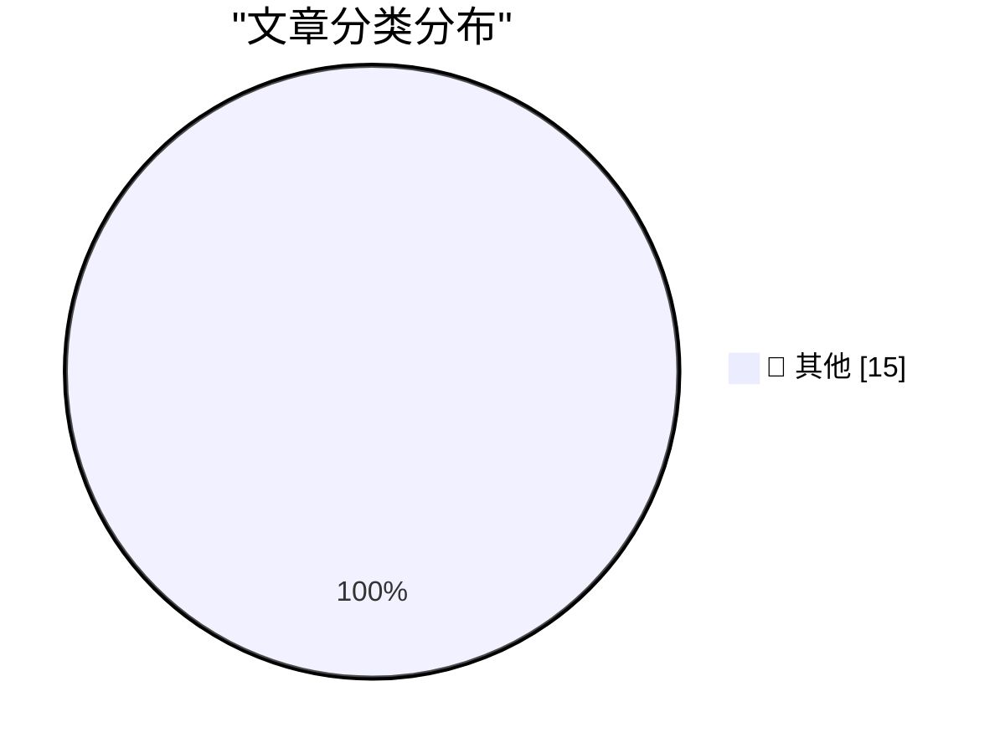

# 📰 AI 资讯每日精选 — 2026-08-20

> 汇聚 140+ 技术博客、X/Twitter、Hacker News、Reddit、Product Hunt、
> Lobste.rs、ClawFeed 日报及 GitHub Trending，经 AI 评分筛选。
>
> **本期内容**：🏆 今日必读 · 🌐 ClawFeed 日报 · 🔥 GitHub Trending · 📂 分类精选 · 🎨 设计与生成式 AI · 📊 数据概览

## 🏆 今日必读

🥇 **A shot-scraper-style JSON API on Bun 1.4's new Bun.WebView**

[A shot-scraper-style JSON API on Bun 1.4's new Bun.WebView](https://simonwillison.net/2026/Aug/20/bun-webview-json-api/) — simonwillison.net · 8 小时前 · 📝 其他

> A shot-scraper-style JSON API on Bun 1.4's new Bun.WebView

🥈 **Getting the Steam Deck LCD working on a Raspberry Pi**

[Getting the Steam Deck LCD working on a Raspberry Pi](https://www.jeffgeerling.com/blog/2026/steam-deck-lcd-pi-hat/) — jeffgeerling.com · 9 小时前 · 📝 其他

> Getting the Steam Deck LCD working on a Raspberry Pi

🥉 **Pluralistic: The actual epistemic crisis (20 Aug 2026)**

[Pluralistic: The actual epistemic crisis (20 Aug 2026)](https://pluralistic.net/2026/08/20/epistemic-void/) — pluralistic.net · 14 分钟前 · 📝 其他

> Pluralistic: The actual epistemic crisis (20 Aug 2026)

4️⃣ **AI-generated ASCII diagrams**

[AI-generated ASCII diagrams](https://www.johndcook.com/blog/2026/08/20/ai-generated-ascii-diagrams/) — johndcook.com · 10 小时前 · 📝 其他

> AI-generated ASCII diagrams

5️⃣ **Use the built-in GELU, don't roll your own!**

[Use the built-in GELU, don't roll your own!](https://www.gilesthomas.com/2026/08/built-in-gelu) — gilesthomas.com · 21 小时前 · 📝 其他

> Use the built-in GELU, don't roll your own!

---

## 🌐 ClawFeed 日报精选

> 来源：[ClawFeed](https://clawfeed.kevinhe.io) — AI 驱动的多源新闻聚合

# ClawFeed Daily Digest | 2026-08-20 (Wed)

> 覆盖 5 个 4h 周期 (00:00-19:59 SGT) · feed ~130 条 · bookmarks ~19 · 聚合自 digest #1024 #1025 #1026 #1027 #1028
> X 登录恢复后首个完整采集日（此前因 session 过期停摆约 36 小时）。

---

## 🔥 当日 Top 5

1. **Stripe 以超 80 亿美元收购 OpenRouter — 支付巨头吞并 AI 模型路由层** — Stripe 史上最大规模收购。"Stripe 管美元流动，OpenRouter 管 Token 流动"——AI 经济的支付网络与智能网络正式合并。有人已在做"OpenRouter for agent tools"（treg.to），模型路由之后是工具路由，agent 中间件层快速成形。(×2 档出现)

2. **Moderna/默沙东 mRNA 个性化癌症疫苗三期临床积极结果，Moderna 股价暴涨 100%** — 路线：取出肿瘤组织 → AI 筛选 ~20 个抗原 → 编码 mRNA 注射回去训练 T 细胞。mRNA + AI 在肿瘤免疫治疗的里程碑事件，多位大 V 称之为"智能与解题的黄金时代"。(×2 档出现)

3. **Etched 完成 7 亿美元融资，估值翻倍至 210 亿美元** — Jane Street 领投，已交付首个推理机架，约 15% 员工来自 Nvidia。Transformer 专用推理芯片赛道热度飙升，与 CoreWeave 用 ~25 个季度做到 AWS 第 40 季才达到的 $2.6B 单季收入形成呼应——AI 算力基础设施增速正在压缩云计算 20 年的增长曲线。

4. **Unitree 上市开盘近 $66B — 机器人赛道标志性定价事件** — 2021 年 Hyundai 以 $1.1B 收购 Boston Dynamics，如今 Unitree 开盘估值是上轮 VC 的 35 倍、IPO 价的 7 倍。同日，Generalist AI 发布机器人基础模型 GEN-1.5，首次将 One-shot In-context Learning 大规模搬进物理世界——演示一遍即可学会新任务，被称为机器人领域的"GPT-3 时刻"。世界机器人大会首日同期举行。

5. **Coinbase 宣布面向 AI Agent 开放加密现货和衍生品交易 API** — 下一步将开放 Tokenized Equities。Agent 金融基础设施加速落地，与 Stripe/OpenRouter 合并形成"Agent 经济栈"雏形。

---

## 📰 核心主题

### Agent 基础设施大整合
Stripe/OpenRouter ($8B+) 是今日最大信号——AI infra 的分发层正在被金融巨头吞并。同日还有：Coinbase Agent 交易 API、Cloudflare 给每个 Agent 配虚拟电脑（@cloudflare/computer，毫秒级启动）、腾讯开源 teamai-cli（Git 驱动的团队 AI 协作基础设施）、TrueForge 开源 agent harness。Agent 工具链从"各自为战"走向"标准化中间件"。

### AI 模型竞争白热化
- Grok 4.6 登陆 Amazon Bedrock — xAI 首次进入 AWS 生态，与 Claude/Llama 同台
- Qwen 3.8 27B 声称超越 Opus 4.8 和 GPT-5.6 Terra，可笔记本离线运行
- DeepSeek-V4-Flash 免费上线 48 小时，Token 吞吐 2200 亿，达 OpenRouter ~20% 流量
- Replit + OpenAI Free Mode（GPT-5.6 Luna 驱动）——"Agent 让软件变便宜，但让写代码变贵"
- Claude 设计蛋白质结合物命中率 22%-35%（行业平均 10%-15%），Opus 5 仅凭两句提示 23 分钟完成 NMR 和 LC-MS 分析

### AI × 生物医药加速
癌症 mRNA 疫苗三期积极 + Claude 蛋白质设计超行业均值 — AI 在湿实验室的落地速度明显加快。

### 机器人产业起飞
Unitree $66B IPO + GEN-1.5 one-shot 机器人基础模型 + 世界机器人大会"从秀技术到拼落地" — 估值和技术同步到达拐点。

### Claude Code / Harness 工程
Claude Code 团队将内置 claude-api Skill 从 200k+ tokens 压缩到 ~25k（Progressive Disclosure 实战），系统 prompt 精简约 80%。Claude Code Skills 最佳实践：放入 GitHub repo → Plugin → 团队 auto-update 安装。Dosu 推出 Drop Day：从 agent session 历史中自动提取团队知识。

---

## 🔖 Bookmarks 精选（去重）

- **@AndrewYNg** AI Engineering 最重要技能地图 — AI 工程师技能树全景图
- **@xiaohu** Cloudflare @cloudflare/computer — 给每个 Agent 配云端虚拟电脑
- **@trq212** Anthropic 精简 Claude Code 系统 prompt ~80% — system prompt / skills / CLAUDE.md 写法经验
- **@Av1dlive** Anthropic Claude for Finance 讲座 — "quant AI 目前最值得看的免费 1 小时"
- **@BruceGuai** Matrix Agent 公司架构详解 — 不是一个 Agent 而是长期运行的 Agent 公司 OS
- **@turingou** wanman.ai 开源 — 一人公司 AI 平台，第 14 款 vibe 产品
- **@gdb + @arrakis_ai** GPT-Realtime-2 实时翻译 — Chormex 集成，YouTube/直播/会议全场景
- **@demishassabis** DeepMind CEO 拜访 @garrytan (YC)，推广 @googlegemma 生态

---

## 👀 推荐关注汇总（去重）

- **@turingou** — wanman.ai 创始人，14 个 vibe 产品，AI agent 一人公司理念，building in public
- **@vmg** — 深度工程博客作者（git 基础设施/分布式系统），高质量低频
- **@askalphaxiv** — AlphaXiv 团队，把学术论文变成可消费的 feed 格式
- **@runinfrai** (YC F26) — 自动优化推理的 inference 平台
- **@_LuoFuli** (Fuli Luo) — 现在在小米 MiMo，此前 DeepSeek，中国 LLM 训练研究者

⚠️ 以上未通过浏览器逐一核实是否已关注，Kevin 操作前请先在 Following 里搜一下。

---

## 💤 当日重复噪音模式

- **Crypto 短线情绪帖**：@Bitwux, @Xeer, @AirdropFarid, @Eth527 等，偏交易情绪/行情预测，信噪比低
- **纯 token/ICO 推广**：@rtk17025 stockcoin 推广、LINERA/$LNRA 注册链接帖
- **Binance 营销/公告**：bStocks 七夕帖、ICX/SCRT/STORJ 下架公告、Binance Inside 系列软广
- **Grok Bot 营销**：重复相似内容出现 2 次
- **纯社交/情绪/不相关**：@MsMistySOL 纯社交、@rosarioborgesi 足球/健身、@RaminNasibov 空推文、棒球博彩
- **Chrome 稳定性影响采样**：多个周期 followingSample profile 因 page crash 无法加载（20/24 失败），影响关注/取关建议质量
---

## 🔥 GitHub Trending

> 今日热门开源项目（全语言 + Python）

| # | 项目 | 描述 | ⭐ 总星 | 📈 今日 | 语言 |
|---|------|------|---------|---------|------|
| 1 | [harry0703/MoneyPrinterTurbo](https://github.com/harry0703/MoneyPrinterTurbo) 🤖 | 利用 AI 大模型和自动化工作流，根据主题或关键词一键生成高清短视频。Generate HD short vide... | 112.9k | +2774 | Python |
| 2 | [mattpocock/skills](https://github.com/mattpocock/skills) | Skills for Real Engineers. Straight from my .agents direc... | 226.4k | +2267 | Shell |
| 3 | [AprilNEA/OpenLogi](https://github.com/AprilNEA/OpenLogi) | ⚡️A native, local-first alternative to Logitech Options+,... | 11.8k | +1540 | Rust |
| 4 | [volcengine/OpenViking](https://github.com/volcengine/OpenViking) 🤖 | Self-evolving Context Database for AI Agents. Unify Agent... | 31.0k | +955 | Python |
| 5 | [santifer/career-ops](https://github.com/santifer/career-ops) 🤖 | Open-source AI job search: scan job portals, evaluate lis... | 66.6k | +855 | JavaScript |
| 6 | [obra/superpowers](https://github.com/obra/superpowers) | An agentic skills framework & software development method... | 274.9k | +749 | Shell |
| 7 | [mukul975/Anthropic-Cybersecurity-Skills](https://github.com/mukul975/Anthropic-Cybersecurity-Skills) 🤖 | 817 structured cybersecurity skills for AI agents · Mappe... | 30.4k | +676 | Python |
| 8 | [marceloprates/prettymaps](https://github.com/marceloprates/prettymaps) | Draw pretty maps from OpenStreetMap data! Built with osmn... | 13.5k | +627 | Python |
| 9 | [mahlernim/google-timeline-visualizer](https://github.com/mahlernim/google-timeline-visualizer) | Visualize your year in travel using your Google Location ... | 1.5k | +575 | Kotlin |
| 10 | [usestrix/strix](https://github.com/usestrix/strix) 🤖 | Open-source AI penetration testing tool to find and fix y... | 56.2k | +541 | Python |
| 11 | [chaitanyagiri/munder-difflin](https://github.com/chaitanyagiri/munder-difflin) 🤖 | local multi-agent harness | 3.1k | +517 | TypeScript |
| 12 | [cursor/plugins](https://github.com/cursor/plugins) | Cursor plugin specification and official plugins | 4.1k | +473 | TypeScript |
| 13 | [jundot/omlx](https://github.com/jundot/omlx) 🤖 | LLM inference server with continuous batching & SSD cachi... | 20.1k | +350 | Python |
| 14 | [modular/modular](https://github.com/modular/modular) | The Modular Platform (includes MAX & Mojo) | 27.9k | +340 | Mojo |
| 15 | [akitaonrails/ai-memory](https://github.com/akitaonrails/ai-memory) 🤖 | Solution for long term memory for agent coding CLIs and t... | 3.6k | +335 | Rust |

---

## 📝 其他

### 1. A shot-scraper-style JSON API on Bun 1.4's new Bun.WebView

[A shot-scraper-style JSON API on Bun 1.4's new Bun.WebView](https://simonwillison.net/2026/Aug/20/bun-webview-json-api/) — **simonwillison.net** · 8 小时前 · ⭐ 15/30

> A shot-scraper-style JSON API on Bun 1.4's new Bun.WebView

---

### 2. Getting the Steam Deck LCD working on a Raspberry Pi

[Getting the Steam Deck LCD working on a Raspberry Pi](https://www.jeffgeerling.com/blog/2026/steam-deck-lcd-pi-hat/) — **jeffgeerling.com** · 9 小时前 · ⭐ 15/30

> Getting the Steam Deck LCD working on a Raspberry Pi

---

### 3. Pluralistic: The actual epistemic crisis (20 Aug 2026)

[Pluralistic: The actual epistemic crisis (20 Aug 2026)](https://pluralistic.net/2026/08/20/epistemic-void/) — **pluralistic.net** · 14 分钟前 · ⭐ 15/30

> Pluralistic: The actual epistemic crisis (20 Aug 2026)

---

### 4. AI-generated ASCII diagrams

[AI-generated ASCII diagrams](https://www.johndcook.com/blog/2026/08/20/ai-generated-ascii-diagrams/) — **johndcook.com** · 10 小时前 · ⭐ 15/30

> AI-generated ASCII diagrams

---

### 5. Use the built-in GELU, don't roll your own!

[Use the built-in GELU, don't roll your own!](https://www.gilesthomas.com/2026/08/built-in-gelu) — **gilesthomas.com** · 21 小时前 · ⭐ 15/30

> Use the built-in GELU, don't roll your own!

---

### 6. Better Batteries

[Better Batteries](https://matklad.github.io/2026/08/20/better-batteries.html) — **matklad.github.io** · 23 小时前 · ⭐ 15/30

> Better Batteries

---

### 7. Issues in the Repo

[Issues in the Repo](https://nesbitt.io/2026/08/20/issues-in-the-repo.html) — **nesbitt.io** · 14 小时前 · ⭐ 15/30

> Issues in the Repo

---

### 8. Our Servants Will Do That For Us

[Our Servants Will Do That For Us](https://borretti.me/article/our-servants-will-do-that-for-us) — **borretti.me** · 23 小时前 · ⭐ 15/30

> Our Servants Will Do That For Us

---

### 9. A Sloppy Interface Is a Security Liability 

[A Sloppy Interface Is a Security Liability ](https://blog.jim-nielsen.com/2026/sloppy-ui-is-security-liability/) — **blog.jim-nielsen.com** · 4 小时前 · ⭐ 15/30

> A Sloppy Interface Is a Security Liability 

---

### 10. Adobe Systems IPO August 20, 1986

[Adobe Systems IPO August 20, 1986](https://dfarq.homeip.net/adobe-systems-ipo-august-20-1986/?utm_source=rss&#038;utm_medium=rss&#038;utm_campaign=adobe-systems-ipo-august-20-1986) — **dfarq.homeip.net** · 12 小时前 · ⭐ 15/30

> Adobe Systems IPO August 20, 1986

---

### 11. Introducing Dashboard Touch, a build-your-own version of Touch ID

[Introducing Dashboard Touch, a build-your-own version of Touch ID](https://anildash.com/2026/08/20/introducing-dashboard-touch/) — **anildash.com** · 23 小时前 · ⭐ 15/30

> Introducing Dashboard Touch, a build-your-own version of Touch ID

---

### 12. Up to 3.2x Faster Inference with LFM2.5-DSpark

[Up to 3.2x Faster Inference with LFM2.5-DSpark](https://huggingface.co/blog/LiquidAI/lfm25-dspark) — **Hugging Face Blog** · 7 小时前 · ⭐ 15/30

> Up to 3.2x Faster Inference with LFM2.5-DSpark

---

### 13. Adobe Firefly adds AI audio tools and Google's Gemini Omni Flash

[Adobe Firefly adds AI audio tools and Google's Gemini Omni Flash](https://the-decoder.com/adobe-firefly-adds-ai-audio-tools-and-googles-gemini-omni-flash/) — **The Decoder** · 4 小时前 · ⭐ 15/30

> Adobe Firefly adds AI audio tools and Google's Gemini Omni Flash

---

### 14. LLMs could write like humans but post-training guardrails make their text detectable

[LLMs could write like humans but post-training guardrails make their text detectable](https://the-decoder.com/llms-could-write-like-humans-but-post-training-guardrails-make-their-text-detectable/) — **The Decoder** · 6 小时前 · ⭐ 15/30

> LLMs could write like humans but post-training guardrails make their text detectable

---

### 15. Frontier Radar #4: China has caught up, so what's left of the Western AI lead?

[Frontier Radar #4: China has caught up, so what's left of the Western AI lead?](https://the-decoder.com/frontier-radar-4-china-has-caught-up-so-whats-left-of-the-western-ai-lead/) — **The Decoder** · 9 小时前 · ⭐ 15/30

> Frontier Radar #4: China has caught up, so what's left of the Western AI lead?

---

## 🎨 Design & Generative AI

### 🖼️ 生成式图片

- **[Adobe Firefly adds AI audio tools and Google's Gemini Omni Flash](https://the-decoder.com/adobe-firefly-adds-ai-audio-tools-and-googles-gemini-omni-flash/)** — The Decoder · 4 小时前
  > Adobe Firefly adds AI audio tools and Google's Gemini Omni Flash

---

## 📊 数据概览

| 扫描源 | 抓取文章 | 时间范围 | 精选 |
|:---:|:---:|:---:|:---:|
| 111/140 | 5363 篇 → 76 篇 | 24h | **15 篇** |

### 分类分布

---

*生成于 2026-08-20 23:55 | 汇聚 140 个技术博客、X/Twitter、Hacker News、Reddit、Product Hunt、Lobste.rs、ClawFeed 日报及 GitHub Trending，经 AI 评分筛选出 Top 15 精华内容*
