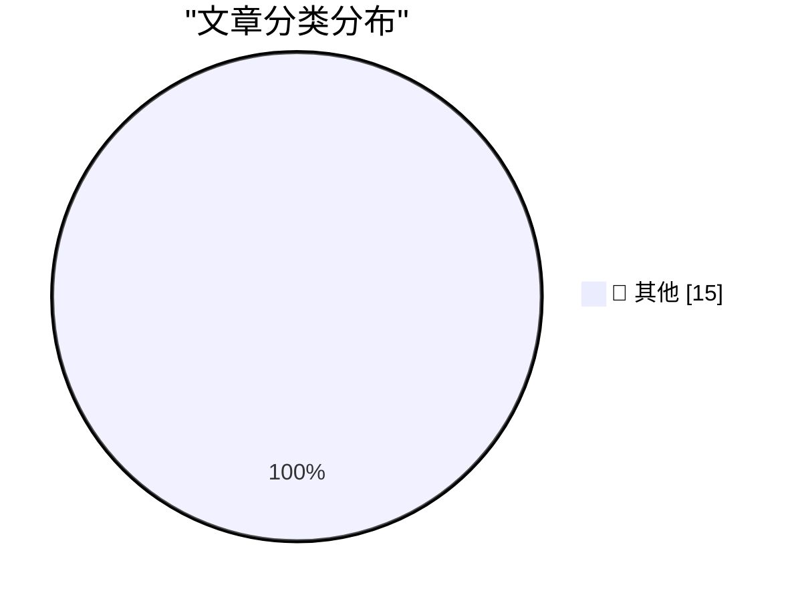

# 📰 AI 资讯每日精选 — 2026-08-21

> 汇聚 140+ 技术博客、X/Twitter、Hacker News、Reddit、Product Hunt、
> Lobste.rs、ClawFeed 日报及 GitHub Trending，经 AI 评分筛选。
>
> **本期内容**：🏆 今日必读 · 🌐 ClawFeed 日报 · 🔥 GitHub Trending · 📂 分类精选 · 🎨 设计与生成式 AI · 📊 数据概览

## 🏆 今日必读

🥇 **llm 0.32.1**

[llm 0.32.1](https://simonwillison.net/2026/Aug/21/llm/) — simonwillison.net · 6 小时前 · 📝 其他

> llm 0.32.1

🥈 **llm-openrouter 0.7**

[llm-openrouter 0.7](https://simonwillison.net/2026/Aug/21/llm-openrouter/) — simonwillison.net · 6 小时前 · 📝 其他

> llm-openrouter 0.7

🥉 **Stop Making TUIs**

[Stop Making TUIs](https://simonwillison.net/2026/Aug/21/stop-making-tuis/) — simonwillison.net · 7 小时前 · 📝 其他

> Stop Making TUIs

4️⃣ **Quoting Matt Webb**

[Quoting Matt Webb](https://simonwillison.net/2026/Aug/21/matt-webb/) — simonwillison.net · 8 小时前 · 📝 其他

> Quoting Matt Webb

5️⃣ **ChatGPT search now uses the site:operator at scale**

[ChatGPT search now uses the site:operator at scale](https://simonwillison.net/2026/Aug/20/chatgpt-search-now-uses-the-siteoperator-at-scale/) — simonwillison.net · 23 小时前 · 📝 其他

> ChatGPT search now uses the site:operator at scale

---

## 🌐 ClawFeed 日报精选

> 来源：[ClawFeed](https://clawfeed.kevinhe.io) — AI 驱动的多源新闻聚合

# ClawFeed Daily Digest | 2026-08-21 (Thu)

> 覆盖 4 个 4h 周期 (04:00-19:59 SGT) · feed ~117 条 · bookmarks ~19 · 聚合自 digest #1031 #1032 #1033 #1034
> 注：00:00-03:59 周期因 Chrome CDP 超时 + X session 过期跳过（Chrome 健康检查改进后已恢复）。

---

## 🔥 当日 Top 5

1. **X 正在谈判用 USDC 稳定币直接支付创作者** — 取消旧收入分成计划，推出新支付框架。Crypto 支付与社交平台的深度整合信号，可能影响整个 Creator Economy 支付基础设施。

2. **BTC 突破 $75,000，链上/交易所/ETF 三指标全面转多** — 链上活跃地址、交易所突破量、ETF 净流入同时转多。Arthur Hayes 称"没有 AI 模型就不会做这些交易"——AI 改变了顶级交易者的工作方式。白宫 Crypto Summit 持续发酵。

3. **OpenAI 增速实际已超 Anthropic** — Ramp Q3 数据：环比增长 82% vs 76%。GPT-5.6 Sol 成为更多开发者选择，Fable 5 因价格和数据保护受限。Codex 税务试点处理 7000 份报税，减少 1/3 准备时间——Agent 走向行业应用。

4. **Stripe/OpenRouter 收购持续发酵 + Binance Agent OS 亮相** — Erik Voorhees 播客讨论"谁真正控制了 AI 路由层"；Binance 推出 Agent OS，可在 Binance 上构建、部署和使用 AI agent；Brian Armstrong 称"是时候让美国成为 crypto 之都"。Agent 经济基础设施加速整合。

5. **MiniMax Design 发布 + Cindy Desktop 集成 iOS Simulator** — MiniMax 推出面向商业视频创作者的 AI Agent 客户端（策划→分镜→生成→剪辑→交付全流程）；Cindy Desktop 让 AI agent 直接操控 iOS 模拟器。Agent 的触达面从浏览器扩展到视频制作和移动端。

---

## 📰 核心主题

### Crypto 监管清晰化 + 市场暴力拉升
白宫 Crypto Summit 后续发酵全天贯穿：BTC 破 $75K、Brian Armstrong 喊话、Erik Voorhees 讨论 DeFi 融入传统金融、X 用 USDC 支付创作者、韩国监管清晰化案例。加密行业从"被监管"到"被整合"的叙事正在形成。Arthur Hayes 验证 AI+交易的融合。

### AI Agent 生态扩张
- Binance Agent OS — 在交易所内构建/部署 agent
- Cindy Desktop + iOS Simulator — agent 操控移动端
- MiniMax Design — agent 串联商业视频全流程
- Grok Bot — 独立远程电脑 + 视频制作能力 + 1 小时官方教程
- Claude Academy 上线 — Anthropic 的 Agent 教育平台
- treg.ai — $0.025 sourced 1000+ KOL
- Remotion skill — agent 制作视频

### Claude Code / Harness 工程
- Claude Academy 正式上线（多周期出现）
- Anthropic 水印不是监控而是溯源标记
- Anthropic discernment-nudge skill — AI 自我质疑工程化
- geekx-skills 合集 — 把工程方法沉淀为 skill（geekx-gate 砍过度设计 + geekx-grilling 问清关键问题）
- Claude Code vs Codex context portability 痛点

### AI 模型竞争
- OpenAI 增速超 Anthropic（Ramp Q3: 82% vs 76%）
- Grok Bot 持续进化（远程电脑、视频制作）
- Ox Alpha 模型生成 Voxel 场景
- 纯文本 agent 通过轻量适配器获得视觉能力

### 科技/工程
- MIT Git 内部机制专题讲座
- Kaito 从按曝光付费转为按真实转化付费
- John Maeda@YC："AGI 时代设计比以往更重要"
- NeoSoul AI $11M Pre-A 融资

---

## 🔖 Bookmarks 精选

本日 bookmarks 与 08-20 完全重叠，无新增。长期置顶：
- **@AndrewYNg** AI Engineering 技能地图
- **@trq212** Anthropic 精简 Claude Code 系统 prompt ~80%
- **@BruceGuai** Matrix Agent 公司架构
- **@Av1dlive** Anthropic Claude for Finance 讲座

---

## 👀 推荐关注汇总（去重）

- **@dani_avila7** — 追踪 Anthropic/Claude Code 内部 skill 动态（discernment-nudge 等）
- **@yacineMTB (kache)** — AI 系统工程实操，反编译/基础设施深度思考
- **@mardehaym** — Limestone Digital 创始人，AI 重建企业系统实战案例
- **@chaumian** — 量化金融 + AI 前沿论文（McKean-Vlasov 控制等）
- **@DougStandley** — AI policy/safety 角度解读 Anthropic 动态
- **@seekjourney** — Claude Code Skill 设计实践者（geekx-skills）
- **@making_cindy** — Cindy Desktop 开发者，Agent + iOS Simulator
- **@itsharmanjot** — 实操型 AI agent 用户，Claude Code/Codex 切换痛点

⚠️ 以上未通过浏览器逐一核实是否已关注，Kevin 操作前请先在 Following 里搜一下。

---

## 💤 当日重复噪音模式

- **@RaminNasibov**：每个 4h 周期 2-3 条，art 词源/品牌设计/城堡/iPod 怀旧/chairs——持续高频低相关
- **Justin Sun 营销**：TRON 增持公告、HTX 安全升级、TRON 嘉年华——纯运营推广
- **Binance 营销**：bStock 股息通知、Agent OS 问答、Clubhouse Bali 活动
- **PKU 非 tech 内容**：意大利面活动、地球温度科普
- **纯社交/meme**：健身帖、goat farmer、standing desk 段子、winrar T恤、佛像构图
- **Chrome profile 加载稳定性**：改进后 4 个周期均 24/24 成功，followingSample 质量恢复正常
---

## 🔥 GitHub Trending

> 今日热门开源项目（全语言 + Python）

| # | 项目 | 描述 | ⭐ 总星 | 📈 今日 | 语言 |
|---|------|------|---------|---------|------|
| 1 | [mattpocock/skills](https://github.com/mattpocock/skills) | Skills for Real Engineers. Straight from my .agents direc... | 229.4k | +3368 | Shell |
| 2 | [AprilNEA/OpenLogi](https://github.com/AprilNEA/OpenLogi) | ⚡️A native, local-first alternative to Logitech Options+,... | 12.9k | +1372 | Rust |
| 3 | [harry0703/MoneyPrinterTurbo](https://github.com/harry0703/MoneyPrinterTurbo) 🤖 | 利用 AI 大模型和自动化工作流，根据主题或关键词一键生成高清短视频。Generate HD short vide... | 113.9k | +1187 | Python |
| 4 | [mahlernim/google-timeline-visualizer](https://github.com/mahlernim/google-timeline-visualizer) | Visualize your year in travel using your Google Location ... | 2.2k | +1040 | Kotlin |
| 5 | [santifer/career-ops](https://github.com/santifer/career-ops) 🤖 | Open-source AI job search: scan job portals, evaluate lis... | 67.4k | +918 | JavaScript |
| 6 | [modular/modular](https://github.com/modular/modular) | The Modular Platform (includes MAX & Mojo) | 28.7k | +905 | Mojo |
| 7 | [obra/superpowers](https://github.com/obra/superpowers) | An agentic skills framework & software development method... | 275.6k | +789 | Shell |
| 8 | [volcengine/OpenViking](https://github.com/volcengine/OpenViking) 🤖 | Self-evolving Context Database for AI Agents. Unify Agent... | 31.7k | +659 | Python |
| 9 | [Tencent/AI-Infra-Guard](https://github.com/Tencent/AI-Infra-Guard) 🤖 | A full-stack AI Red Teaming platform securing AI ecosyste... | 5.3k | +435 | Python |
| 10 | [cursor/plugins](https://github.com/cursor/plugins) | Cursor plugin specification and official plugins | 4.4k | +391 | TypeScript |
| 11 | [affaan-m/ECC](https://github.com/affaan-m/ECC) 🤖 | The agent harness performance optimization system. Skills... | 241.8k | +348 | JavaScript |
| 12 | [PostHog/posthog](https://github.com/PostHog/posthog) 🤖 | 🦔 PostHog is the leading platform for building self-driv... | 38.3k | +334 | Python |
| 13 | [mukul975/Anthropic-Cybersecurity-Skills](https://github.com/mukul975/Anthropic-Cybersecurity-Skills) 🤖 | 817 structured cybersecurity skills for AI agents · Mappe... | 30.5k | +227 | Python |
| 14 | [MadsLorentzen/ai-job-search](https://github.com/MadsLorentzen/ai-job-search) 🤖 | The job search that runs on your machine. AI job applicat... | 32.8k | +225 | Python |
| 15 | [anthropics/claude-code](https://github.com/anthropics/claude-code) 🤖 | Claude Code is an agentic coding tool that lives in your ... | 142.3k | +173 | Python |

---

## 📝 其他

### 1. llm 0.32.1

[llm 0.32.1](https://simonwillison.net/2026/Aug/21/llm/) — **simonwillison.net** · 6 小时前 · ⭐ 15/30

> llm 0.32.1

---

### 2. llm-openrouter 0.7

[llm-openrouter 0.7](https://simonwillison.net/2026/Aug/21/llm-openrouter/) — **simonwillison.net** · 6 小时前 · ⭐ 15/30

> llm-openrouter 0.7

---

### 3. Stop Making TUIs

[Stop Making TUIs](https://simonwillison.net/2026/Aug/21/stop-making-tuis/) — **simonwillison.net** · 7 小时前 · ⭐ 15/30

> Stop Making TUIs

---

### 4. Quoting Matt Webb

[Quoting Matt Webb](https://simonwillison.net/2026/Aug/21/matt-webb/) — **simonwillison.net** · 8 小时前 · ⭐ 15/30

> Quoting Matt Webb

---

### 5. ChatGPT search now uses the site:operator at scale

[ChatGPT search now uses the site:operator at scale](https://simonwillison.net/2026/Aug/20/chatgpt-search-now-uses-the-siteoperator-at-scale/) — **simonwillison.net** · 23 小时前 · ⭐ 15/30

> ChatGPT search now uses the site:operator at scale

---

### 6. Readers can't identify watermarked AI text

[Readers can't identify watermarked AI text](https://seangoedecke.com/readers-cant-identify-watermarked-ai-text/) — **seangoedecke.com** · 23 小时前 · ⭐ 15/30

> Readers can't identify watermarked AI text

---

### 7. The Fourth Horseman of the File-Format-Hegemony Apocalypse

[The Fourth Horseman of the File-Format-Hegemony Apocalypse](https://techcommunity.microsoft.com/blog/onedriveblog/introducing-markdown-support-in-sharepoint-and-onedrive/4512174) — **daringfireball.net** · 36 分钟前 · ⭐ 15/30

> The Fourth Horseman of the File-Format-Hegemony Apocalypse

---

### 8. Walmart Finally Caves, Will Soon Support Apple Pay

[Walmart Finally Caves, Will Soon Support Apple Pay](https://corporate.walmart.com/news/2026/08/21/more-ways-to-pay-tap-to-pay-is-coming-to-walmart-and-sams-club) — **daringfireball.net** · 4 小时前 · ⭐ 15/30

> Walmart Finally Caves, Will Soon Support Apple Pay

---

### 9. ★ When New DF Posts Drop in a Forest and No One Is There to Read Them

[★ When New DF Posts Drop in a Forest and No One Is There to Read Them](https://daringfireball.net/2026/08/df_posts_drop_in_a_forest) — **daringfireball.net** · 7 小时前 · ⭐ 15/30

> ★ When New DF Posts Drop in a Forest and No One Is There to Read Them

---

### 10. Bluesky’s Active User Base Is Shrinking, and Remains Tiny Compared to Threads and Twitter/X

[Bluesky’s Active User Base Is Shrinking, and Remains Tiny Compared to Threads and Twitter/X](https://techcrunch.com/2026/08/11/blueskys-active-user-base-is-shrinking-as-its-focus-expands-beyond-the-app/) — **daringfireball.net** · 10 小时前 · ⭐ 15/30

> Bluesky’s Active User Base Is Shrinking, and Remains Tiny Compared to Threads and Twitter/X

---

### 11. Bluesky Is Full of Anti-AI Zealots

[Bluesky Is Full of Anti-AI Zealots](https://bsky.app/profile/masnick.com/post/3mtk7cuvbok2x) — **daringfireball.net** · 11 小时前 · ⭐ 15/30

> Bluesky Is Full of Anti-AI Zealots

---

### 12. How Bluesky and Threads Sneak Their Logos Into iOS Screenshots

[How Bluesky and Threads Sneak Their Logos Into iOS Screenshots](https://timmarinin.net/2026/bluesky-screenshots/) — **daringfireball.net** · 20 小时前 · ⭐ 15/30

> How Bluesky and Threads Sneak Their Logos Into iOS Screenshots

---

### 13. Book Review: An Immense World - How Animal Senses Reveal the Hidden Realms Around Us by Ed Yong ★★★☆☆

[Book Review: An Immense World - How Animal Senses Reveal the Hidden Realms Around Us by Ed Yong ★★★☆☆](https://shkspr.mobi/blog/2026/08/book-review-an-immense-world-how-animal-senses-reveal-the-hidden-realms-around-us-by-ed-yong/) — **shkspr.mobi** · 12 小时前 · ⭐ 15/30

> Book Review: An Immense World - How Animal Senses Reveal the Hidden Realms Around Us by Ed Yong ★★★☆☆

---

### 14. Reducing C++ template bloat by factoring out the type-dependent portions of the function, practical exam

[Reducing C++ template bloat by factoring out the type-dependent portions of the function, practical exam](https://devblogs.microsoft.com/oldnewthing/20260821-00/?p=112632) — **devblogs.microsoft.com/oldnewthing** · 9 小时前 · ⭐ 15/30

> Reducing C++ template bloat by factoring out the type-dependent portions of the function, practical exam

---

### 15. How would you know whether an ancient culture had zero?

[How would you know whether an ancient culture had zero?](https://www.johndcook.com/blog/2026/08/21/ancient-number-system/) — **johndcook.com** · 10 小时前 · ⭐ 15/30

> How would you know whether an ancient culture had zero?

---

## 🎨 Design & Generative AI

### 🖼️ 生成式图片

- **[New face rig for ComfyUI to control de expressions in NKD Basic Tools](https://www.reddit.com/r/comfyui/comments/1vujdnn/new_face_rig_for_comfyui_to_control_de/)** — r/comfyui · 8 小时前
  > New face rig for ComfyUI to control de expressions in NKD Basic Tools

- **[Turbo LoRA v1.1 for FL2VA released – Minimax H3 4-step (768p)](https://www.reddit.com/r/comfyui/comments/1vu7bkw/turbo_lora_v11_for_fl2va_released_minimax_h3/)** — r/comfyui · 18 小时前
  > Turbo LoRA v1.1 for FL2VA released – Minimax H3 4-step (768p)

- **[What is the current top local text-to-image model for uncensored SFW/NSFW image creation with or without Loras in ComfyUI?](https://www.reddit.com/r/comfyui/comments/1vucf11/what_is_the_current_top_local_texttoimage_model/)** — r/comfyui · 13 小时前
  > What is the current top local text-to-image model for uncensored SFW/NSFW image creation with or without Loras in ComfyUI?

- **[MiniMax H3 15-Second Multi-Shot Generation Template For ComfyUI For 12GB GPUs](https://www.reddit.com/r/comfyui/comments/1vu8q7c/minimax_h3_15second_multishot_generation_template/)** — r/comfyui · 17 小时前
  > MiniMax H3 15-Second Multi-Shot Generation Template For ComfyUI For 12GB GPUs

- **[Built an NVFP4 version of the LTX-2.5 Gemma-4 12B text encoder for ComfyUI.](https://www.reddit.com/r/comfyui/comments/1vuoa7i/built_an_nvfp4_version_of_the_ltx25_gemma4_12b/)** — r/comfyui · 5 小时前
  > Built an NVFP4 version of the LTX-2.5 Gemma-4 12B text encoder for ComfyUI.

- **[Is there a recommended best turbo lora for minimxH3 yet?](https://www.reddit.com/r/comfyui/comments/1vupdof/is_there_a_recommended_best_turbo_lora_for/)** — r/comfyui · 4 小时前
  > Is there a recommended best turbo lora for minimxH3 yet?

- **[ComfyUI version of diffusers-modular/MiniMax-H3-Pruned-Ref-Delta-Fused-r1024 ?](https://www.reddit.com/r/comfyui/comments/1vu2ct6/comfyui_version_of/)** — r/comfyui · 22 小时前
  > ComfyUI version of diffusers-modular/MiniMax-H3-Pruned-Ref-Delta-Fused-r1024 ?

- **[Does anyone use comfyui do basic vfx compositing task similar to Foundry Nuke or Davinci Resolve Fusion (roto, tracking, mattepaint etc2)? If yes, share your experience.](https://www.reddit.com/r/comfyui/comments/1vucnf0/does_anyone_use_comfyui_do_basic_vfx_compositing/)** — r/comfyui · 13 小时前
  > Does anyone use comfyui do basic vfx compositing task similar to Foundry Nuke or Davinci Resolve Fusion (roto, tracking, mattepaint etc2)? If yes, share your experience.

- **[Best ComfyUI model/workflow on RunPod for realistic Reality-TV scenes?](https://www.reddit.com/r/comfyui/comments/1vucl5z/best_comfyui_modelworkflow_on_runpod_for/)** — r/comfyui · 13 小时前
  > Best ComfyUI model/workflow on RunPod for realistic Reality-TV scenes?

- **[ComfyUI-ModelRouter: automatically install workflow models into the right folders](https://www.reddit.com/r/comfyui/comments/1vu9hku/comfyuimodelrouter_automatically_install_workflow/)** — r/comfyui · 16 小时前
  > ComfyUI-ModelRouter: automatically install workflow models into the right folders

---

## 📊 数据概览

| 扫描源 | 抓取文章 | 时间范围 | 精选 |
|:---:|:---:|:---:|:---:|
| 111/140 | 5306 篇 → 102 篇 | 24h | **15 篇** |

### 分类分布

---

*生成于 2026-08-21 23:55 | 汇聚 140 个技术博客、X/Twitter、Hacker News、Reddit、Product Hunt、Lobste.rs、ClawFeed 日报及 GitHub Trending，经 AI 评分筛选出 Top 15 精华内容*
