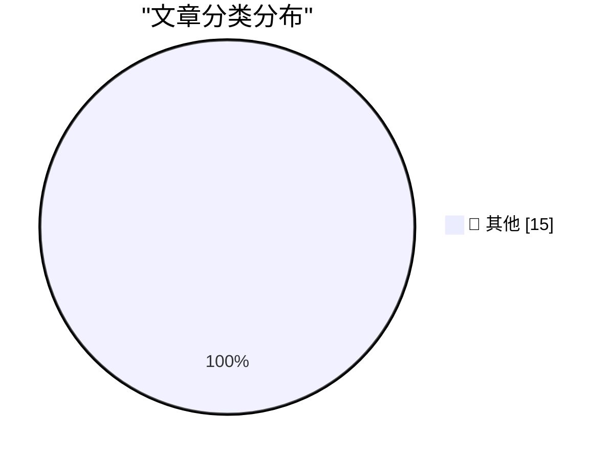

# 📰 AI 资讯每日精选 — 2026-08-22

> 汇聚 140+ 技术博客、X/Twitter、Hacker News、Reddit、Product Hunt、
> Lobste.rs、ClawFeed 日报及 GitHub Trending，经 AI 评分筛选。
>
> **本期内容**：🏆 今日必读 · 🌐 ClawFeed 日报 · 🔥 GitHub Trending · 📂 分类精选 · 🎨 设计与生成式 AI · 📊 数据概览

## 🏆 今日必读

🥇 **Quoting Linus Torvalds**

[Quoting Linus Torvalds](https://simonwillison.net/2026/Aug/22/linus-torvalds/) — simonwillison.net · 2 小时前 · 📝 其他

> Quoting Linus Torvalds

🥈 **llm 0.33**

[llm 0.33](https://simonwillison.net/2026/Aug/22/llm/) — simonwillison.net · 6 小时前 · 📝 其他

> llm 0.33

🥉 **More than just code review**

[More than just code review](https://simonwillison.net/2026/Aug/22/more-than-just-code-review/) — simonwillison.net · 7 小时前 · 📝 其他

> More than just code review

4️⃣ **Mark Carney on the U.S. Under Trump: ‘Sometimes, Its Signature Is Written in Pencil’**

[Mark Carney on the U.S. Under Trump: ‘Sometimes, Its Signature Is Written in Pencil’](https://www.nytimes.com/2026/08/22/world/canada/carney-tariffs-trade-trump.html?unlocked_article_code=1.7VA.r3Ue.GTc_tOhX0qSn) — daringfireball.net · 7 小时前 · 📝 其他

> Mark Carney on the U.S. Under Trump: ‘Sometimes, Its Signature Is Written in Pencil’

5️⃣ **WorkOS: Agents Can Now Sign Up for Your App**

[WorkOS: Agents Can Now Sign Up for Your App](https://workos.com/auth-md?utm_source=daringfireball&amp;utm_medium=newsletter&amp;utm_campaign=q32026) — daringfireball.net · 9 小时前 · 📝 其他

> WorkOS: Agents Can Now Sign Up for Your App

---

## 🌐 ClawFeed 日报精选

> 来源：[ClawFeed](https://clawfeed.kevinhe.io) — AI 驱动的多源新闻聚合

📋 ClawFeed Daily Digest | 2026-08-22 (Fri)

聚合 5 份 4h digest：#1037 (00:00-03:59) · #1038 (04:00-07:59) · #1039 (08:00-11:59) · #1040 (12:00-15:59) · #1041 (16:00-19:59)

素材总计：feed 152 + bookmarks 57 + followingSample 175（profiles 120/120 loaded，0 errored）。

---

🔥 当日全场最重要 5 条

1. **BTC 首次突破 $75,000 三个月来新高** — 本周涨幅约 20%，2024 年 3 月以来最大单周涨幅。Saylor 被迫出售 BTC，"never sell"人设破裂。Jim Cramer 喊"直接买 BTC"（反向指标？）。来源: @laurashin, @Tradermayne, @cryptorover

2. **AI 模型竞赛白热化** — Grok 4.6 登顶 #1（Elon 推荐 Grok Build / Cursor）；GPT-5.6 Sol 降价推进成本前沿；DeepSeek V4-Flash-Vision-Exp 发布（视觉能力接近 Opus 4.8）；Aaron Levie 断言 intelligence 正在变成 "too cheap to meter"，竞争壁垒从模型转向 workflow 和数据。来源: @elonmusk, @spitzbits, @heyshrutimishra, @levie

3. **Agentic AI 进入主流议程** — Berkeley Agentic AI Summit 5,000 现场 + 10 万线上，Steinberger 演讲 "No Doors for Agents"；Anthropic 发布 Claude Code 创业公司指南（15 家高增长初创复盘）；Grok Bot 新增邮件收发能力。来源: @steipete, @xiaohu, @elonmusk

4. **美国贸易/监管大动作** — US 对加拿大部分进口商品加征 50% 关税（即时生效）；CFTC Selig 指示起草加密市场结构备选规则；Paul Graham："阻止美国建数据中心不会减缓 AI 进步，只会减缓美国的 AI 进步。"；远程访问 NVIDIA 芯片也被禁止对中国出口。来源: @Tradermayne, @laurashin, @paulg, @JenksGuo

5. **AI 说服力已超越人类 + Series A 市场失灵** — Brian Roemmele 引研究：AI 说服力超越最强人类说服者；Richard Chen 指出 Series A 热叙事项目以 100-300x 估值融资（Series B 价格买 Seed 风险），非热门 5-7x 增长只拿 10-15x，叙事轮换后 compression 会很痛。来源: @BrianRoemmele, @richardchen39

---

📰 当日核心主题

**🤖 AI Agent 工具链爆发**
Grok Build 1.0.8（并发 subagent 改善）、Grok Bot 邮件能力、Grok Voice Think Fast 2.0 登顶 Speech Arena、OpenAI Codex + Exa 插件（1000 亿+ 网站检索）、Claude Code 创业公司指南、/scandinavian-design skill（86 RT, 2.4K likes）、Anthropic 内部 ELI5 skill、Wake 多 agent 会话统一工具、Frames2LoRA（EMNLP 接收）、DeepSeek V4-Flash-Vision-Exp。AI agent 从单模型能力竞争转向 workflow / skill / 集成层竞争。

**💰 BTC 与加密监管**
BTC $75K 新高 + Saylor 被迫出售 + Uniswap 代币化股票 $10 亿 + 韩国新韩资管 × Solana RWA 试点 + CFTC 备选规则 + Grayscale Zcash ETF 推进 + CME vs CFTC 预测市场操纵冲突 + Binance 员工 UAE 被拘 + Zama Confidential Vault $41M+ TVL。加密市场在价格飙升与监管收紧的双重张力中前进。

**🏗️ 基础设施与地缘**
DeepSeek 效应推动 Hyperscaler 债务可能从 $2880 亿升至 $6590 亿；NVIDIA 芯片远程访问也对中国禁出口；DeepSeek Harness 升级致 8000+ 插件挂掉（生态碎片化）；Paul Graham 数据中心冷判断。

**📱 Claude Code 生态**
Anthropic 创业公司指南、ELI5 skill、/scandinavian-design、Claude Code Concise Output Style 实战、Claude Academy 持续推广、omasnap 截图工具 ~70 PRs（Shopify CEO 维护）。Claude Code 社区进入"skill/workflow 分享"阶段。

---

🔖 Bookmarks 精选

• @AndrewYNg — AI Engineering Skills Map：系统梳理 AI 工程最重要技能的完整版图（420 RT, 22K likes, 5.6M views）。来源: https://x.com/AndrewYNg/status/2088302050706686198
• @trq212 — Anthropic 为 Claude 5 系列移除了 ~80% 的 Claude Code system prompt，详解新一代模型写 system prompt / skills / Claude.MD 的新规则。来源: https://x.com/trq212/status/2080710971228918066

---

👀 推荐关注汇总（去重）

• @DavidOndrej1 — AI agent 工作流重构的深度采访者，$75M exit + AI rebuild 案例。
• @aigclink — 关注 AI agent 工具链集成，Wake 工具解决多 agent 会话统一管理。
• @mardehaym — Limestone Digital 创始人，PE-backed 企业 AI agent 实战，$14M ARR 纯口碑。
• @istdrc — Raft 联合创始人 & CEO，前 Kimi CLI 作者，"Agent swarms 是错误方向"。
• @runinfrai — YC F26 推理平台，Ornith 1.5 35B 216 tok/s，DeepSeek V4 Pro 全精度 1M 上下文。
• @canghe — wesight.ai 创始人，AI 全球化增长 & AI-native Agents / Skills / MCP / 开源。

提醒：未通过浏览器核实是否已关注，**Kevin 操作前请先在 Following 里搜一下**。

---

🧹 建议取关

• @HeXiaobo — 最后一条推 2018-07-21（8 年），Instagram 签到，与 AI/crypto/tech 完全无关。（连续两档提及）
• @0xJasonBateman — 最后一条推 2026-04-10，Spotify/PUBG 链接，无 AI/crypto/tech 内容。（连续两档提及）

---

💤 当日重复噪音模式

• **RaminNasibov** — 跨 5 个周期持续输出空推文、设计作品、人生感悟、AI 调查，信噪比极低。出现频率最高的噪音源。
• **Justin Sun** — 每个周期均有 TRON/BTC/OTC/B.AI 营销或法律案件自卖自夸，纯推广。
• **大学宣传帖** — 清华/北大在多个周期出现校园宣传，非 tech 内容。
• **BNB/Binance 广告** — Binance Agent OS、度假广告、不丹支付、BNB meme 推广，跨周期重复。
• **行情喊单/鸡汤** — 各类 BTC 回调预测、人生感悟、"gn" 打卡，信息量为零。---

## 🔥 GitHub Trending

> 今日热门开源项目（全语言 + Python）

| # | 项目 | 描述 | ⭐ 总星 | 📈 今日 | 语言 |
|---|------|------|---------|---------|------|
| 1 | [mattpocock/skills](https://github.com/mattpocock/skills) | Skills for Real Engineers. Straight from my .agents direc... | 232.0k | +2684 | Shell |
| 2 | [openai/codex](https://github.com/openai/codex) 🤖 | Lightweight coding agent that runs in your terminal | 113.3k | +1978 | Rust |
| 3 | [AprilNEA/OpenLogi](https://github.com/AprilNEA/OpenLogi) | ⚡️A native, local-first alternative to Logitech Options+,... | 13.9k | +959 | Rust |
| 4 | [ripienaar/free-for-dev](https://github.com/ripienaar/free-for-dev) | A list of SaaS, PaaS and IaaS offerings that have free ti... | 133.9k | +915 | HTML |
| 5 | [obra/superpowers](https://github.com/obra/superpowers) | An agentic skills framework & software development method... | 276.2k | +592 | Shell |
| 6 | [Graphify-Labs/graphify](https://github.com/Graphify-Labs/graphify) 🤖 | Turn any codebase, with its docs, SQL schemas, configs, a... | 109.6k | +480 | Python |
| 7 | [NousResearch/hermes-agent](https://github.com/NousResearch/hermes-agent) 🤖 | The agent that grows with you | 234.4k | +443 | Python |
| 8 | [mahlernim/google-timeline-visualizer](https://github.com/mahlernim/google-timeline-visualizer) | Visualize your year in travel using your Google Location ... | 2.6k | +441 | Kotlin |
| 9 | [affaan-m/ECC](https://github.com/affaan-m/ECC) 🤖 | The agent harness performance optimization system. Skills... | 242.2k | +428 | JavaScript |
| 10 | [modular/modular](https://github.com/modular/modular) | The Modular Platform (includes MAX & Mojo) | 28.8k | +395 | Mojo |
| 11 | [multica-ai/andrej-karpathy-skills](https://github.com/multica-ai/andrej-karpathy-skills) 🤖 | A single CLAUDE.md file to improve Claude Code behavior, ... | 205.3k | +379 | - |
| 12 | [Panniantong/Agent-Reach](https://github.com/Panniantong/Agent-Reach) 🤖 | Give your AI agent eyes to see the entire internet. Read ... | 74.2k | +307 | Python |
| 13 | [PostHog/posthog](https://github.com/PostHog/posthog) 🤖 | 🦔 PostHog is the leading platform for building self-driv... | 38.6k | +288 | Python |
| 14 | [cursor/plugins](https://github.com/cursor/plugins) | Cursor plugin specification and official plugins | 4.7k | +286 | TypeScript |
| 15 | [Wei-Shaw/sub2api](https://github.com/Wei-Shaw/sub2api) 🤖 | Sub2API 一站式开源中转服务，让 Claude、Openai 、Gemini、Grok订阅统一接入，支持拼车... | 38.8k | +264 | Go |

---

## 📝 其他

### 1. Quoting Linus Torvalds

[Quoting Linus Torvalds](https://simonwillison.net/2026/Aug/22/linus-torvalds/) — **simonwillison.net** · 2 小时前 · ⭐ 15/30

> Quoting Linus Torvalds

---

### 2. llm 0.33

[llm 0.33](https://simonwillison.net/2026/Aug/22/llm/) — **simonwillison.net** · 6 小时前 · ⭐ 15/30

> llm 0.33

---

### 3. More than just code review

[More than just code review](https://simonwillison.net/2026/Aug/22/more-than-just-code-review/) — **simonwillison.net** · 7 小时前 · ⭐ 15/30

> More than just code review

---

### 4. Mark Carney on the U.S. Under Trump: ‘Sometimes, Its Signature Is Written in Pencil’

[Mark Carney on the U.S. Under Trump: ‘Sometimes, Its Signature Is Written in Pencil’](https://www.nytimes.com/2026/08/22/world/canada/carney-tariffs-trade-trump.html?unlocked_article_code=1.7VA.r3Ue.GTc_tOhX0qSn) — **daringfireball.net** · 7 小时前 · ⭐ 15/30

> Mark Carney on the U.S. Under Trump: ‘Sometimes, Its Signature Is Written in Pencil’

---

### 5. WorkOS: Agents Can Now Sign Up for Your App

[WorkOS: Agents Can Now Sign Up for Your App](https://workos.com/auth-md?utm_source=daringfireball&amp;utm_medium=newsletter&amp;utm_campaign=q32026) — **daringfireball.net** · 9 小时前 · ⭐ 15/30

> WorkOS: Agents Can Now Sign Up for Your App

---

### 6. Dutch Regulator Fines Uber $1 Billion for Suspending Dishonest Drivers

[Dutch Regulator Fines Uber $1 Billion for Suspending Dishonest Drivers](https://www.reuters.com/world/dutch-regulator-fines-uber-966-million-automating-driver-suspensions-document-2026-08-21/) — **daringfireball.net** · 9 小时前 · ⭐ 15/30

> Dutch Regulator Fines Uber $1 Billion for Suspending Dishonest Drivers

---

### 7. Pluralistic: Born on technology's third base (21 Aug 2026)

[Pluralistic: Born on technology's third base (21 Aug 2026)](https://pluralistic.net/2026/08/21/world-historic-forces/) — **pluralistic.net** · 22 小时前 · ⭐ 15/30

> Pluralistic: Born on technology's third base (21 Aug 2026)

---

### 8. Fast and Hard Code

[Fast and Hard Code](https://lucumr.pocoo.org/2026/8/22/fast-hard-code/) — **lucumr.pocoo.org** · 23 小时前 · ⭐ 15/30

> Fast and Hard Code

---

### 9. Coming soon

[Coming soon](https://www.johndcook.com/blog/2026/08/22/coming-soon/) — **johndcook.com** · 8 小时前 · ⭐ 15/30

> Coming soon

---

### 10. This Week in Package Management: 22 August 2026

[This Week in Package Management: 22 August 2026](https://nesbitt.io/2026/08/22/this-week-in-package-management.html) — **nesbitt.io** · 13 小时前 · ⭐ 15/30

> This Week in Package Management: 22 August 2026

---

### 11. Reading List 08/22/26

[Reading List 08/22/26](https://www.construction-physics.com/p/reading-list-082226) — **construction-physics.com** · 11 小时前 · ⭐ 15/30

> Reading List 08/22/26

---

### 12. A Syncthing and SQLite Gotcha

[A Syncthing and SQLite Gotcha](https://borretti.me/article/a-syncthing-and-sqlite-gotcha) — **borretti.me** · 9 小时前 · ⭐ 15/30

> A Syncthing and SQLite Gotcha

---

### 13. Concurrent Servers: Part 8 - Go

[Concurrent Servers: Part 8 - Go](https://eli.thegreenplace.net/2026/concurrent-servers-part-8-go/) — **eli.thegreenplace.net** · 9 小时前 · ⭐ 15/30

> Concurrent Servers: Part 8 - Go

---

### 14. Study explains why AI agents benefit from "skills" and when they fail

[Study explains why AI agents benefit from "skills" and when they fail](https://the-decoder.com/study-explains-why-ai-agents-benefit-from-skills-and-when-they-fail/) — **The Decoder** · 11 小时前 · ⭐ 15/30

> Study explains why AI agents benefit from "skills" and when they fail

---

### 15. World models that ignore human beliefs predict the wrong actions, new research shows

[World models that ignore human beliefs predict the wrong actions, new research shows](https://the-decoder.com/world-models-that-ignore-human-beliefs-predict-the-wrong-actions-new-research-shows/) — **The Decoder** · 14 小时前 · ⭐ 15/30

> World models that ignore human beliefs predict the wrong actions, new research shows

---

## 📊 数据概览

| 扫描源 | 抓取文章 | 时间范围 | 精选 |
|:---:|:---:|:---:|:---:|
| 109/140 | 5307 篇 → 42 篇 | 24h | **15 篇** |

### 分类分布

---

*生成于 2026-08-22 23:53 | 汇聚 140 个技术博客、X/Twitter、Hacker News、Reddit、Product Hunt、Lobste.rs、ClawFeed 日报及 GitHub Trending，经 AI 评分筛选出 Top 15 精华内容*
