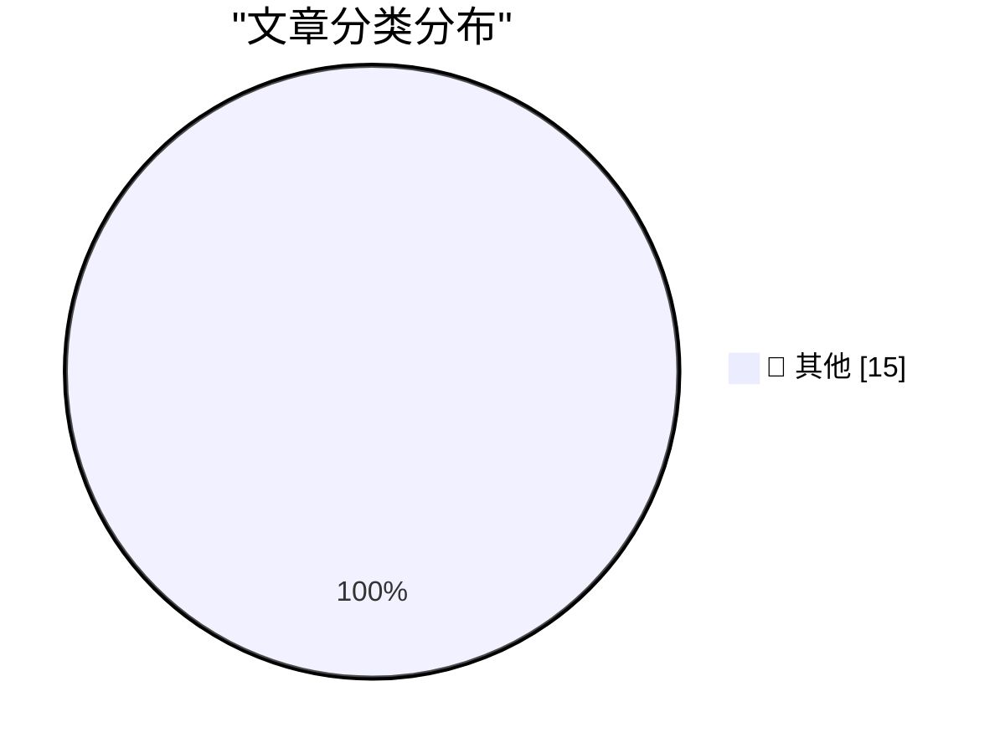

# 📰 AI 资讯每日精选 — 2026-08-23

> 汇聚 140+ 技术博客、X/Twitter、Hacker News、Reddit、Product Hunt、
> Lobste.rs、ClawFeed 日报及 GitHub Trending，经 AI 评分筛选。
>
> **本期内容**：🏆 今日必读 · 🌐 ClawFeed 日报 · 🔥 GitHub Trending · 📂 分类精选 · 🎨 设计与生成式 AI · 📊 数据概览

## 🏆 今日必读

🥇 **Anthropic’s best AI model struggles to attract users as cheaper tools thrive**

[Anthropic’s best AI model struggles to attract users as cheaper tools thrive](https://simonwillison.net/2026/Aug/23/anthropics-best-ai-model-struggles-to-attract-users-as-cheaper-t/) — simonwillison.net · 3 小时前 · 📝 其他

> Anthropic’s best AI model struggles to attract users as cheaper tools thrive

🥈 **Quoting Drew Breunig**

[Quoting Drew Breunig](https://simonwillison.net/2026/Aug/23/drew-breunig/) — simonwillison.net · 3 小时前 · 📝 其他

> Quoting Drew Breunig

🥉 **Cooper Sharp Proves That American Cheese Can Be Great Cheese**

[Cooper Sharp Proves That American Cheese Can Be Great Cheese](https://sixcolors.com/member/2026/08/this-week-in-apple-lets-fight/) — daringfireball.net · 6 小时前 · 📝 其他

> Cooper Sharp Proves That American Cheese Can Be Great Cheese

4️⃣ **Death to px, long live ch!**

[Death to px, long live ch!](https://shkspr.mobi/blog/2026/08/death-to-px-long-live-ch/) — shkspr.mobi · 12 小时前 · 📝 其他

> Death to px, long live ch!

5️⃣ **What exactly is modified about a modified Bessel function?**

[What exactly is modified about a modified Bessel function?](https://www.johndcook.com/blog/2026/08/23/modified-bessel-function/) — johndcook.com · 5 小时前 · 📝 其他

> What exactly is modified about a modified Bessel function?

---

## 🌐 ClawFeed 日报精选

> 来源：[ClawFeed](https://clawfeed.kevinhe.io) — AI 驱动的多源新闻聚合

📋 ClawFeed Daily Digest | 2026-08-23 (Sat)

聚合 5 份 4h digest：#1044 (00:00-03:59) · #1045 (04:00-07:59) · #1046 (08:00-11:59) · #1047 (12:00-15:59) · #1048 (16:00-19:59)

素材总计：feed 157 + bookmarks 95 + followingSample 175（profiles 120/120 loaded，0 errored）。

---

## 🔥 当日最重要 5 条

### 1. AI Agent 流量结构性翻转——Agent 已成主要 token 消费者
a16z 数据显示 Agent token 消耗是人类的近 5 倍，自 2 月以来增长 14 倍。Cloudflare 机器流量已超人类，OpenRouter agentic token 消耗超 7.3T。同时 Vercel AI Gateway 开源模型份额翻转至 62%（两月前仅 28.4%），闭源模型份额从 71.6% 跌至 38%。
来源: a16z · 0xSammy · rauchg

### 2. NVIDIA AI 服务器涨价 15%+ 与 AI 能源布局
NVIDIA 向微软等大客户通知涨价超 15%，AI 基础设施成本上行。同时 Peter Thiel 重注铀矿/核能，判断"AI 需要的是电力而非芯片"。Dylan Patel (SemiAnalysis) 指出每个有收入的 AI 创业者都在转型做 NeoCloud（GPU 专营云），CoreWeave/Lambda 模式被大规模复制。
来源: Techub_News · hamptonism · MaxForAI

### 3. Andrew Ng "Prompting 将在 6 个月内消亡" + AI 工具生态加速
Andrew Ng 斯坦福 100 分钟演讲深度剖析 Loops+Graphs 取代 Prompting，METR 数据显示 AI 能扛近 2 小时复杂任务。Codex CLI 启动速度优化 25 倍（uv 作者 Charlie Marsh 加入 OpenAI）。OpenAI 收购 Instant DB 团队（面向 Agent 的后端基础设施）。
来源: hanakoxbt · LinearUncle · MaxForAI

### 4. 收购逻辑演化与智能成本崩塌
Andrew Chen（a16z）断言："2012 年买用户，2021 年买工程师，2026 年买训练数据"。Erik Voorhees 指出智能成本正在崩塌——更多智能本应意味着更高价格，但实际相反。Coinbase 正式支持 AI agent 交易衍生品，AI×crypto 交叉落地里程碑。
来源: andrewchen · laurashin · Techub_News

### 5. Agent 架构方向争论——Skills/MCP/单体 vs 分布式
dotey 判断 Agent 架构走向 MCP/CLI 模式（"每个人常用 agent 就两三个"）。Skills 规模化暴露 "single-player mode" 问题（Khe Hy, 108K views）。Pi 数据库范式挑战长程 Agent 问题（连续跑 50 小时的状态管理）。Greg Brockman 谈 OpenAI 非营利转型逻辑。
来源: dotey · khemaridh · arvin17x · rohanpaul_ai

---

## 📰 当日核心主题

### Agent 经济体成型
Agent token 消耗 5x 人类、Cloudflare 机器流量超人类、开源模型份额翻转——三组数据共同指向 Agent 已从概念进入规模化生产阶段。Grok Bot 营销全家桶（13 个 AI worker）、Coinbase AI 衍生品交易、EvoTrace 训练 Agent 偏好数据等案例进一步佐证。

### AI 基础设施成本重构
NVIDIA 涨价 15%、Thiel 押注铀矿核能、每个 AI 创业者转型 NeoCloud、智能成本崩塌但硬件成本上升——供给侧出现"软件降价+硬件涨价"剪刀差。

### 工具链快速迭代
Codex CLI 25x 加速、Skills 标准库（mattpocock/skills 登顶 GitHub）、ELI5 Skill 刷屏（但信息密度递减）、Claude Academy 上线、Remote Control 可靠性改进。

### 中国 AI 三弹齐发
DeepSeek/腾讯/小米同日发力，腾讯 Hy3 登陆 B.AI 全量免费。Ox Alpha 疑为智谱 GLM-5.X。Google Search Central Live Shanghai 释出 SEO/AIO/GEO 框架。

### 加密市场回暖
BTC ETF 单周 $19.2 亿、Perp DEX 未平仓量 $200 亿创新高、Ray Dalio 看涨黄金和 BTC。但传统科技 ETF 吸金仍 6x 于 crypto。

---

## 🔖 Bookmarks 精选

• **@guruchahal** — AI 市场渗透率 vs $6T+ 知识工作者劳动力支出矩阵（Kevin 本周活跃引用）
• **@AndrewYNg** — AI Engineering 技能地图（5.7M views）
• **@trq212** — Anthropic 为 Claude 5 删掉 80% 系统 prompt 的经验
• **@BruceGuai** — Matrix Agent 公司架构：长期运行的 Agent 公司 OS
• **@xiaohu** — Cloudflare @cloudflare/computer：给 AI Agent 配虚拟电脑

---

## 👀 推荐关注汇总（去重）

| 账号 | 定位 | 来源 |
|------|------|------|
| @runinfrai (RunInfra, YC F26) | AI 推理优化平台 | #1044, #1047 |
| @canghe (苍何) | AI Agent/Skills/MCP/开源出海 | #1044 |
| @midscene_ai (Midscene) | AI Operator for Web/Android | #1045 |
| @raft_hq (Raft) | 人机协作 Agent 平台 | #1046, #1047 |
| @OkhayIea | EEMA 论文，AutoML 方向 | #1048 |

提醒：未通过浏览器核实是否已关注，Kevin 操作前请先在 Following 里搜一下。

---

## 💤 当日重复噪音模式

1. **ELI5 Skill 搬运潮** — 至少 5 个中文 KOL 几乎相同内容转发（MaxForAI/mylifcc/omarsar0/dotey/GitTrend0x），实际只是一句 prompt 生成 HTML 可视化页面，信息密度急剧递减。
2. **马斯克高频推广** — Tesla FSD + Grok Bot 交替推广，叙事重复度高。
3. **加密 meme/诉讼噪音** — Justin Sun 冻结资产、FARTCOIN 清算、Solana 治理投票等与 AI/tech 主线无关。
4. **"BTC 涨了"感叹帖** — 多个加密 KOL 情绪表达，无新增结构性信息。
---

## 🔥 GitHub Trending

> 今日热门开源项目（全语言 + Python）

| # | 项目 | 描述 | ⭐ 总星 | 📈 今日 | 语言 |
|---|------|------|---------|---------|------|
| 1 | [openai/codex](https://github.com/openai/codex) 🤖 | Lightweight coding agent that runs in your terminal | 115.1k | +2729 | Rust |
| 2 | [mattpocock/skills](https://github.com/mattpocock/skills) | Skills for Real Engineers. Straight from my .agents direc... | 233.8k | +2448 | Shell |
| 3 | [Alishahryar1/free-claude-code](https://github.com/Alishahryar1/free-claude-code) 🤖 | Use Claude Code, Codex, Pi, and OpenCode for free (1.3B+ ... | 47.9k | +1040 | Python |
| 4 | [AprilNEA/OpenLogi](https://github.com/AprilNEA/OpenLogi) | ⚡️A native, local-first alternative to Logitech Options+,... | 14.9k | +1008 | Rust |
| 5 | [basecamp/omarchy](https://github.com/basecamp/omarchy) | Beautiful, Modern & Opinionated Linux | 29.1k | +814 | Shell |
| 6 | [ripienaar/free-for-dev](https://github.com/ripienaar/free-for-dev) | A list of SaaS, PaaS and IaaS offerings that have free ti... | 134.4k | +593 | HTML |
| 7 | [NousResearch/hermes-agent](https://github.com/NousResearch/hermes-agent) 🤖 | The agent that grows with you | 235.0k | +519 | Python |
| 8 | [freestylefly/awesome-gpt-image-2](https://github.com/freestylefly/awesome-gpt-image-2) 🤖 | Prompt as Code | GPT-Image2 工业级提示词引擎与模板库，470+ 个案例逆向工程，20+... | 12.7k | +440 | JavaScript |
| 9 | [affaan-m/ECC](https://github.com/affaan-m/ECC) 🤖 | The agent harness performance optimization system. Skills... | 242.5k | +427 | JavaScript |
| 10 | [virgiliojr94/book-to-skill](https://github.com/virgiliojr94/book-to-skill) 🤖 | Turn any technical book PDF into a Claude Code skill — re... | 24.6k | +423 | Python |
| 11 | [anthropics/claude-code](https://github.com/anthropics/claude-code) 🤖 | Claude Code is an agentic coding tool that lives in your ... | 142.8k | +377 | Python |
| 12 | [block/buzz](https://github.com/block/buzz) | A hive mind communication platform | 30.1k | +349 | Rust |
| 13 | [PostHog/posthog](https://github.com/PostHog/posthog) 🤖 | 🦔 PostHog is the leading platform for building self-driv... | 38.8k | +328 | Python |
| 14 | [anthropics/claude-plugins-community](https://github.com/anthropics/claude-plugins-community) 🤖 | Community plugin marketplace for Claude Cowork and Claude... | 924 | +257 | Python |
| 15 | [VoltAgent/awesome-agent-skills](https://github.com/VoltAgent/awesome-agent-skills) 🤖 | A curated collection of 1000+ agent skills from official ... | 31.3k | +223 | - |

---

## 📝 其他

### 1. Anthropic’s best AI model struggles to attract users as cheaper tools thrive

[Anthropic’s best AI model struggles to attract users as cheaper tools thrive](https://simonwillison.net/2026/Aug/23/anthropics-best-ai-model-struggles-to-attract-users-as-cheaper-t/) — **simonwillison.net** · 3 小时前 · ⭐ 15/30

> Anthropic’s best AI model struggles to attract users as cheaper tools thrive

---

### 2. Quoting Drew Breunig

[Quoting Drew Breunig](https://simonwillison.net/2026/Aug/23/drew-breunig/) — **simonwillison.net** · 3 小时前 · ⭐ 15/30

> Quoting Drew Breunig

---

### 3. Cooper Sharp Proves That American Cheese Can Be Great Cheese

[Cooper Sharp Proves That American Cheese Can Be Great Cheese](https://sixcolors.com/member/2026/08/this-week-in-apple-lets-fight/) — **daringfireball.net** · 6 小时前 · ⭐ 15/30

> Cooper Sharp Proves That American Cheese Can Be Great Cheese

---

### 4. Death to px, long live ch!

[Death to px, long live ch!](https://shkspr.mobi/blog/2026/08/death-to-px-long-live-ch/) — **shkspr.mobi** · 12 小时前 · ⭐ 15/30

> Death to px, long live ch!

---

### 5. What exactly is modified about a modified Bessel function?

[What exactly is modified about a modified Bessel function?](https://www.johndcook.com/blog/2026/08/23/modified-bessel-function/) — **johndcook.com** · 5 小时前 · ⭐ 15/30

> What exactly is modified about a modified Bessel function?

---

### 6. Why special function terminology is arcane

[Why special function terminology is arcane](https://www.johndcook.com/blog/2026/08/23/arcane-terminology/) — **johndcook.com** · 5 小时前 · ⭐ 15/30

> Why special function terminology is arcane

---

### 7. The difference orbit inclination makes

[The difference orbit inclination makes](https://www.johndcook.com/blog/2026/08/22/inclination/) — **johndcook.com** · 23 小时前 · ⭐ 15/30

> The difference orbit inclination makes

---

### 8. Fixing an eMachines EL1200 BIOS bug with Claude

[Fixing an eMachines EL1200 BIOS bug with Claude](https://www.downtowndougbrown.com/2026/08/fixing-an-emachines-el1200-bios-bug-with-claude/) — **downtowndougbrown.com** · 4 小时前 · ⭐ 15/30

> Fixing an eMachines EL1200 BIOS bug with Claude

---

### 9. Welcoming the Sri Lankan Government to Have I Been Pwned

[Welcoming the Sri Lankan Government to Have I Been Pwned](https://www.troyhunt.com/welcoming-the-sri-lankan-government-to-have-i-been-pwned/) — **troyhunt.com** · 17 小时前 · ⭐ 15/30

> Welcoming the Sri Lankan Government to Have I Been Pwned

---

### 10. The summer of open weights

[The summer of open weights](https://martinalderson.com/posts/the-summer-of-open-weights/?utm_source=rss&amp;utm_medium=rss&amp;utm_campaign=feed) — **martinalderson.com** · 23 小时前 · ⭐ 15/30

> The summer of open weights

---

### 11. An AI boss fired its first employee but only after humans reminded it of its own rules

[An AI boss fired its first employee but only after humans reminded it of its own rules](https://the-decoder.com/an-ai-boss-fired-its-first-employee-but-only-after-humans-reminded-it-of-its-own-rules/) — **The Decoder** · 11 小时前 · ⭐ 15/30

> An AI boss fired its first employee but only after humans reminded it of its own rules

---

### 12. AI is becoming AI's biggest customer as agentic token usage jumps 14x on OpenRouter

[AI is becoming AI's biggest customer as agentic token usage jumps 14x on OpenRouter](https://the-decoder.com/ai-is-becoming-ais-biggest-customer-as-agentic-token-usage-jumps-14x-on-openrouter/) — **The Decoder** · 13 小时前 · ⭐ 15/30

> AI is becoming AI's biggest customer as agentic token usage jumps 14x on OpenRouter

---

### 13. AI could make scientists do more work less well, not less work better, study argues

[AI could make scientists do more work less well, not less work better, study argues](https://the-decoder.com/ai-could-make-scientists-do-more-work-less-well-not-less-work-better-study-argues/) — **The Decoder** · 14 小时前 · ⭐ 15/30

> AI could make scientists do more work less well, not less work better, study argues

---

### 14. Memory shortage reportedly drives Nvidia AI server prices up about 15 percent

[Memory shortage reportedly drives Nvidia AI server prices up about 15 percent](https://the-decoder.com/memory-shortage-reportedly-drives-nvidia-ai-server-prices-up-about-15-percent/) — **The Decoder** · 15 小时前 · ⭐ 15/30

> Memory shortage reportedly drives Nvidia AI server prices up about 15 percent

---

### 15. How China's gray market sells Claude tokens at a fraction of the price

[How China's gray market sells Claude tokens at a fraction of the price](https://the-decoder.com/how-chinas-gray-market-sells-claude-tokens-at-a-fraction-of-the-price/) — **The Decoder** · 16 小时前 · ⭐ 15/30

> How China's gray market sells Claude tokens at a fraction of the price

---

## 📊 数据概览

| 扫描源 | 抓取文章 | 时间范围 | 精选 |
|:---:|:---:|:---:|:---:|
| 110/140 | 5271 篇 → 63 篇 | 24h | **15 篇** |

### 分类分布

---

*生成于 2026-08-23 23:53 | 汇聚 140 个技术博客、X/Twitter、Hacker News、Reddit、Product Hunt、Lobste.rs、ClawFeed 日报及 GitHub Trending，经 AI 评分筛选出 Top 15 精华内容*
