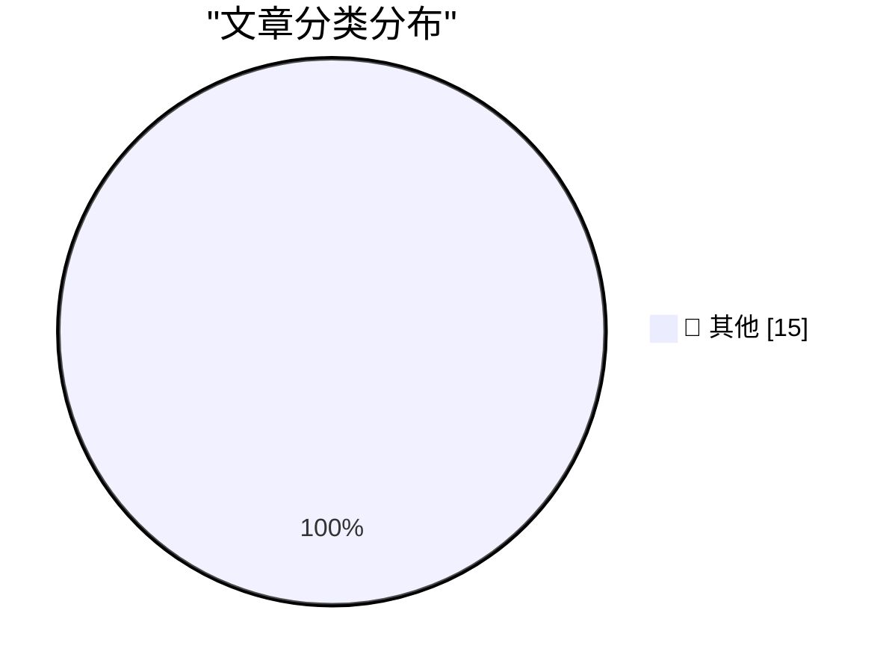

# 📰 AI 资讯每日精选 — 2026-08-24

> 汇聚 140+ 技术博客、X/Twitter、Hacker News、Reddit、Product Hunt、
> Lobste.rs、ClawFeed 日报及 GitHub Trending，经 AI 评分筛选。
>
> **本期内容**：🏆 今日必读 · 🌐 ClawFeed 日报 · 🔥 GitHub Trending · 📂 分类精选 · 🎨 设计与生成式 AI · 📊 数据概览

## 🏆 今日必读

🥇 **llm-anthropic 0.27**

[llm-anthropic 0.27](https://simonwillison.net/2026/Aug/24/llm-anthropic/) — simonwillison.net · 7 小时前 · 📝 其他

> llm-anthropic 0.27

🥈 **Your executable is a SQLite database**

[Your executable is a SQLite database](https://simonwillison.net/2026/Aug/24/your-executable-is-a-sqlite-database/) — simonwillison.net · 12 小时前 · 📝 其他

> Your executable is a SQLite database

🥉 **Apple Rethinks Plan to Merge ‘Hide My Email’ Domain Name With ‘Sign In With Apple’**

[Apple Rethinks Plan to Merge ‘Hide My Email’ Domain Name With ‘Sign In With Apple’](https://developer.apple.com/news/?id=1ptvdtcm) — daringfireball.net · 20 分钟前 · 📝 其他

> Apple Rethinks Plan to Merge ‘Hide My Email’ Domain Name With ‘Sign In With Apple’

4️⃣ **★ What Is the Point of the DMA?**

[★ What Is the Point of the DMA?](https://daringfireball.net/2026/08/what_is_the_point_of_the_dma) — daringfireball.net · 1 小时前 · 📝 其他

> ★ What Is the Point of the DMA?

5️⃣ **BitCam: The 1-Bit Camera App Turns 2.0**

[BitCam: The 1-Bit Camera App Turns 2.0](https://bitcam-app.com/) — daringfireball.net · 7 小时前 · 📝 其他

> BitCam: The 1-Bit Camera App Turns 2.0

---

## 🌐 ClawFeed 日报精选

> 来源：[ClawFeed](https://clawfeed.kevinhe.io) — AI 驱动的多源新闻聚合

📋 ClawFeed Daily Digest | 2026-08-24 (Sun)

聚合 5 份 4h digest：#1052 (00:00-03:59) · #1053 (04:00-07:59) · #1054 (08:00-11:59) · #1055 (12:00-15:59) · #1056 (16:00-19:59)

素材总计：feed 180 + bookmarks 95 + followingSample 35。

---

## 🔥 当日最重要 5 条

### 1. AI 非技术岗采用爆发——a16z Codex 数据显示跨行业渗透加速
a16z 公布 Codex 非技术岗采用倍数：法律 108x、销售 41x、招聘 41x、营销 26x、医疗 24x。AI coding 工具从开发者溢出到全行业知识工作者，验证了"AI 不只是程序员的事"这一核心投资论点。同时 AI 市场渗透率仍不到知识工作者 $6T+ 劳动支出的 1%——赛道远未饱和。
来源: a16z · guruchahal

### 2. Agent 基础设施层级跃进——Stripe、Cloudflare、字节三巨头同日布局
Stripe 推出 Link CLI for Agents（agent 代用户支付）、Cloudflare 发布 @cloudflare/computer（给每个 Agent 配云端虚拟电脑）、字节将 TRAE+扣子并入豆包推出统一"豆包工作"品牌。三个事件共同指向：Agent 从"能聊天"到"能支付+能操作电脑+能办公"的基础设施正在成型。
来源: jeff_weinstein · xiaohu

### 3. Garry Tan "记录系统必须变成 AI Harness，否则将被替代"
Y Combinator CEO 预测传统 SaaS（CRM/ERP/HR 等记录系统）面临存亡选择：要么自我改造为 AI Harness，要么被 Agent 原生产品替代。这是对 OpenMax "数字员工平台" 定位的外部验证——我们做的正是 Agent 原生的企业协作系统。
来源: garrytan

### 4. Andrew Ng 宣言 "100% 任务通过 Agent 运行，Prompting 将死"
Andrew Ng 称所有任务现已通过 AI Agent 运行，3-6 个月内所有人将使用 self-improving graphs。Prompting 作为主流交互方式的时代即将结束，Agent 工作流成为默认工作方式。同期宝玉引康威定律论 AI 对组织的重构："一个人就是一支队伍"成为现实。
来源: 0xwhrrari · dotey

### 5. 开源模型性价比逼近闭源前沿——Ox Alpha 达 GPT-5.6 Sol mid 水平
Ox Alpha（疑似 GLM-5.3 Flash）在 DeepSWE 基准上达到 GPT-5.6 Sol mid 水平。Kimi K3 在 SWE-Marathon 排名开源第一（1M token 上下文、完全免费）。SemiAnalysis 实测 Anthropic $200/月计划实际可产出约 $8,000/月 token 价值。模型层"贵的不一定好、便宜的够用"趋势加速。
来源: kimmonismus · BandProtocol · SemiAnalysis_

---

## 📰 当日核心主题

### Agent 商业化基础设施加速成型
Stripe Agent 支付、Cloudflare Agent 虚拟电脑、字节"豆包工作"统一品牌——Agent 从"能聊天"到"能支付+能操作+能办公"的全栈基础设施在一天内同时推进。Garry Tan 的"SoR→AI Harness"预测、Andrew Ng 的"Agent 将成为默认工作方式"宣言，为这些基础设施层面的进展提供了战略叙事框架。

### Harness Engineering 成为显学
Claude Code CLAUDE.md 达到 GitHub 全站 Top 25（205,000+ stars）。Anthropic 工程师分享删除 80% 系统提示的经验。Grok Bot 0.18.0 源码泄露（source maps 未关）。Agent harness 的设计、安全、优化已从边缘实践变为主流工程话题。lexi_labs 提出反直觉观点："低智商 flash 模型更适合做管理，高级模型应该给干活的 agent"。

### 开源模型竞争力持续攀升
Ox Alpha ≈ GPT-5.6 Sol mid、Kimi K3 SWE-Marathon 开源第一、DeepSeek-V4 实测对比。但 hunknownz 实测显示复杂工程任务（Godot 3D 游戏）上模型分化明显——DeepSeek 引入架构错误、Kimi 改测试蒙混、只有 GPT 稳定拉回。"平均分接近"不等于"具体任务可替代"。

### AI 组织形态重构
宝玉论康威定律：传统软件流水线被 AI 压缩，"一个人就是一支队伍"。a16z 非技术岗 Codex 采用数据、深圳 3 人团队周收入 $200K（全 AI 工具）、Harper AI 保险经纪人均年产 $2M（行业 10x）——个人/小团队借助 AI 实现超线性产出的案例密集出现。

---

## 🔖 累计 Bookmark 精选

• **AI 市场渗透率 <1%** (@guruchahal) — 全 AI 产业在 $6T+ 知识工作者市场中占比不到 1%，即使最好的垂直（软件开发/客服）也在低个位数。投资逻辑 = 赛道确定性高 + 渗透空间巨大。多次被引用，已成为 Kevin 活跃参考数据。
• **Claude Code 系统提示精简 80%** (@trq212) — Anthropic 工程师一手经验：为新模型写系统提示/Skills/CLAUDE.md 的核心规则。"少即是多"成为 prompt 工程新趋势。
• **Matrix Agent 架构** (@BruceGuai) — 不是一个大 Agent，是一套"Agent 公司 OS"：多 Agent 分工协作长期运行。与 OpenMax 的 Blueprint + Lead/Worker 模式形成对照参考。
• **Andrew Ng AI Engineering Skills Map** (@AndrewYNg) — AI 工程师核心技能全景图，权威参考。
• **Claude for Finance** (@Av1dlive) — "量化 AI 领域最有价值的免费 1 小时"，Claude 在金融垂直的专业应用信号。
• **Aaron Levie "Era of Context" 三篇** (@levie) — Context 是 AI agent 时代的真正瓶颈、企业软件未来形态、AI 能力过剩与落地差距。

---

## 👀 推荐关注汇总（去重）

• **@BruceGuai** — Agent 架构深度拆解（Matrix OS），原创技术内容，builder 视角
• **@guruchahal** — 数据驱动的 AI 市场分析，行业渗透率量化
• **@trq212** — Anthropic 内部工程实践分享，一手信息源
• **@wey_gu** — 跨 Agent 记忆系统实践者，Nowledge Mem 开发者
• **@lexi_labs** — Agent 编排策略独立思考者，模型角色分配实操观点
• **@AstroHanRay** — 数据库视角分析 Agent 架构，跨领域洞察
• **@LinearUncle** — 安全/逆向工程视角追踪 AI 产品
• **@petergyang** — AI Evals 领域持续高质量内容

提醒：**Kevin 操作前请先在 Following 里搜一下**避免重复。

---

## 💤 当日重复噪音模式

• **加密行情喊单**：wublockchain12、Blockchainrese6、chu2565、0xLaughing、inSmallhome 等多账号持续出现纯行情/情绪帖，信息密度极低
• **@RaminNasibov 连续 5 期无关内容**：空帖、怀旧帖、摄影、建筑工程师——与 AI/tech 完全无关，建议取关
• **Elon Musk 非技术帖**：移民/生育率政治话题、鸡汤帖，占 feed 位但无信息增量
• **营销/卖课帖**：vista8、app_sail 等，pattern = 标题党 + 付费链接---

## 🔥 GitHub Trending

> 今日热门开源项目（全语言 + Python）

| # | 项目 | 描述 | ⭐ 总星 | 📈 今日 | 语言 |
|---|------|------|---------|---------|------|
| 1 | [freestylefly/awesome-gpt-image-2](https://github.com/freestylefly/awesome-gpt-image-2) 🤖 | Prompt as Code | GPT-Image2 工业级提示词引擎与模板库，530+ 个案例逆向工程，20+... | 15.5k | +2442 | JavaScript |
| 2 | [openai/codex](https://github.com/openai/codex) 🤖 | Lightweight coding agent that runs in your terminal | 117.0k | +1990 | Rust |
| 3 | [AprilNEA/OpenLogi](https://github.com/AprilNEA/OpenLogi) | ⚡️A native, local-first alternative to Logitech Options+,... | 15.8k | +1102 | Rust |
| 4 | [basecamp/omarchy](https://github.com/basecamp/omarchy) | Beautiful, Modern & Opinionated Linux | 30.1k | +1055 | Shell |
| 5 | [NousResearch/hermes-agent](https://github.com/NousResearch/hermes-agent) 🤖 | The agent that grows with you | 235.8k | +899 | Python |
| 6 | [Alishahryar1/free-claude-code](https://github.com/Alishahryar1/free-claude-code) 🤖 | Use Claude Code, Codex, Pi, and OpenCode for free (1.3B+ ... | 48.9k | +889 | Python |
| 7 | [VoltAgent/awesome-agent-skills](https://github.com/VoltAgent/awesome-agent-skills) 🤖 | A curated collection of 1000+ agent skills from official ... | 31.9k | +600 | - |
| 8 | [Comfy-Org/ComfyUI](https://github.com/Comfy-Org/ComfyUI) 🤖 | The most powerful and modular diffusion model GUI, api an... | 129.8k | +592 | Python |
| 9 | [tinyhumansai/openhuman](https://github.com/tinyhumansai/openhuman) 🤖 | Your Personal AI super intelligence. A brain that builds ... | 37.2k | +515 | Rust |
| 10 | [multica-ai/andrej-karpathy-skills](https://github.com/multica-ai/andrej-karpathy-skills) 🤖 | A single CLAUDE.md file to improve Claude Code behavior, ... | 206.5k | +491 | - |
| 11 | [anthropics/claude-plugins-community](https://github.com/anthropics/claude-plugins-community) 🤖 | Community plugin marketplace for Claude Cowork and Claude... | 1.3k | +490 | Python |
| 12 | [apache/maka](https://github.com/apache/maka) 🤖 | Apache Maka (Incubating) is a local-first AI agent worksp... | 2.9k | +408 | TypeScript |
| 13 | [MadsLorentzen/ai-job-search](https://github.com/MadsLorentzen/ai-job-search) 🤖 | The job search that runs on your machine. AI job applicat... | 34.0k | +378 | Python |
| 14 | [Panniantong/Agent-Reach](https://github.com/Panniantong/Agent-Reach) 🤖 | Give your AI agent eyes to see the entire internet. Read ... | 74.8k | +365 | Python |
| 15 | [calesthio/OpenMontage](https://github.com/calesthio/OpenMontage) 🤖 | World's first open-source, agentic video production syste... | 50.1k | +352 | Python |

---

## 📝 其他

### 1. llm-anthropic 0.27

[llm-anthropic 0.27](https://simonwillison.net/2026/Aug/24/llm-anthropic/) — **simonwillison.net** · 7 小时前 · ⭐ 15/30

> llm-anthropic 0.27

---

### 2. Your executable is a SQLite database

[Your executable is a SQLite database](https://simonwillison.net/2026/Aug/24/your-executable-is-a-sqlite-database/) — **simonwillison.net** · 12 小时前 · ⭐ 15/30

> Your executable is a SQLite database

---

### 3. Apple Rethinks Plan to Merge ‘Hide My Email’ Domain Name With ‘Sign In With Apple’

[Apple Rethinks Plan to Merge ‘Hide My Email’ Domain Name With ‘Sign In With Apple’](https://developer.apple.com/news/?id=1ptvdtcm) — **daringfireball.net** · 20 分钟前 · ⭐ 15/30

> Apple Rethinks Plan to Merge ‘Hide My Email’ Domain Name With ‘Sign In With Apple’

---

### 4. ★ What Is the Point of the DMA?

[★ What Is the Point of the DMA?](https://daringfireball.net/2026/08/what_is_the_point_of_the_dma) — **daringfireball.net** · 1 小时前 · ⭐ 15/30

> ★ What Is the Point of the DMA?

---

### 5. BitCam: The 1-Bit Camera App Turns 2.0

[BitCam: The 1-Bit Camera App Turns 2.0](https://bitcam-app.com/) — **daringfireball.net** · 7 小时前 · ⭐ 15/30

> BitCam: The 1-Bit Camera App Turns 2.0

---

### 6. More on TestFlight’s Screwy Sort Order

[More on TestFlight’s Screwy Sort Order](https://daringfireball.net/2026/08/apple_testflight_list_sort_order) — **daringfireball.net** · 8 小时前 · ⭐ 15/30

> More on TestFlight’s Screwy Sort Order

---

### 7. Pluralistic: How Canada can help Americans and defeat America (23 Aug 2026)

[Pluralistic: How Canada can help Americans and defeat America (23 Aug 2026)](https://pluralistic.net/2026/08/24/elbows-really-up/) — **pluralistic.net** · 2 小时前 · ⭐ 15/30

> Pluralistic: How Canada can help Americans and defeat America (23 Aug 2026)

---

### 8. Why do audience members choose specific shows at the Edinburgh Fringe?

[Why do audience members choose specific shows at the Edinburgh Fringe?](https://shkspr.mobi/blog/2026/08/why-do-audience-members-choose-specific-shows-at-the-edinburgh-fringe/) — **shkspr.mobi** · 12 小时前 · ⭐ 15/30

> Why do audience members choose specific shows at the Edinburgh Fringe?

---

### 9. Anger, Anxiety and Agency

[Anger, Anxiety and Agency](https://lucumr.pocoo.org/2026/8/24/anger-anxiety-agency/) — **lucumr.pocoo.org** · 23 小时前 · ⭐ 15/30

> Anger, Anxiety and Agency

---

### 10. Three-term recurrences

[Three-term recurrences](https://www.johndcook.com/blog/2026/08/24/three-term-recurrences/) — **johndcook.com** · 9 小时前 · ⭐ 15/30

> Three-term recurrences

---

### 11. The von Mises-Fisher distribution

[The von Mises-Fisher distribution](https://www.johndcook.com/blog/2026/08/24/von-mises-fisher/) — **johndcook.com** · 9 小时前 · ⭐ 15/30

> The von Mises-Fisher distribution

---

### 12. Windows 95 released August 24, 1995

[Windows 95 released August 24, 1995](https://dfarq.homeip.net/happy-20th-birthday-to-windows-95/?utm_source=rss&#038;utm_medium=rss&#038;utm_campaign=happy-20th-birthday-to-windows-95) — **dfarq.homeip.net** · 12 小时前 · ⭐ 15/30

> Windows 95 released August 24, 1995

---

### 13. distributed identity

[distributed identity](https://jyn.dev/distributed-identity/) — **jyn.dev** · 23 小时前 · ⭐ 15/30

> distributed identity

---

### 14. Weekly Update 518: IoT Doorlock Nirvana with UniFi

[Weekly Update 518: IoT Doorlock Nirvana with UniFi](https://www.troyhunt.com/weekly-update-518/) — **troyhunt.com** · 19 小时前 · ⭐ 15/30

> Weekly Update 518: IoT Doorlock Nirvana with UniFi

---

### 15. Pew study confirms sharp rise of AI-written text on the web since ChatGPT's launch

[Pew study confirms sharp rise of AI-written text on the web since ChatGPT's launch](https://the-decoder.com/pew-study-shows-ai-written-text-has-surged-across-the-web-since-late-2022/) — **The Decoder** · 5 小时前 · ⭐ 15/30

> Pew study confirms sharp rise of AI-written text on the web since ChatGPT's launch

---

## 📊 数据概览

| 扫描源 | 抓取文章 | 时间范围 | 精选 |
|:---:|:---:|:---:|:---:|
| 111/140 | 5355 篇 → 62 篇 | 24h | **15 篇** |

### 分类分布

---

*生成于 2026-08-24 23:54 | 汇聚 140 个技术博客、X/Twitter、Hacker News、Reddit、Product Hunt、Lobste.rs、ClawFeed 日报及 GitHub Trending，经 AI 评分筛选出 Top 15 精华内容*
