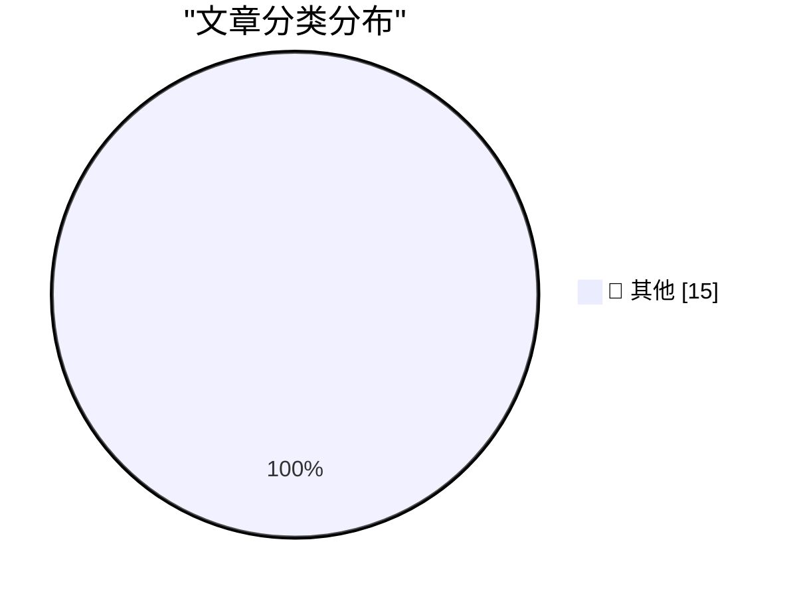

# 📰 AI 资讯每日精选 — 2026-08-25

> 汇聚 140+ 技术博客、X/Twitter、Hacker News、Reddit、Product Hunt、
> Lobste.rs、ClawFeed 日报及 GitHub Trending，经 AI 评分筛选。
>
> **本期内容**：🏆 今日必读 · 🌐 ClawFeed 日报 · 🔥 GitHub Trending · 📂 分类精选 · 🎨 设计与生成式 AI · 📊 数据概览

## 🏆 今日必读

🥇 **EVE Online: The Move to Python 3 Begins!**

[EVE Online: The Move to Python 3 Begins!](https://simonwillison.net/2026/Aug/25/eve-online-move-to-python-3/) — simonwillison.net · 55 分钟前 · 📝 其他

> EVE Online: The Move to Python 3 Begins!

🥈 **Debugging Ubiquiti's 5G Backup on AT&T**

[Debugging Ubiquiti's 5G Backup on AT&T](https://www.jeffgeerling.com/blog/2026/unifi-u5g-backup-debugging/) — jeffgeerling.com · 4 小时前 · 📝 其他

> Debugging Ubiquiti's 5G Backup on AT&T

🥉 **XCancel, the Twitter/X Mirror, Shuts Down After Cease and Desist From the Fine Folks at X Corp**

[XCancel, the Twitter/X Mirror, Shuts Down After Cease and Desist From the Fine Folks at X Corp](https://xcancel.com/) — daringfireball.net · 1 小时前 · 📝 其他

> XCancel, the Twitter/X Mirror, Shuts Down After Cease and Desist From the Fine Folks at X Corp

4️⃣ **Dolly Parton Dies at 80**

[Dolly Parton Dies at 80](https://www.nytimes.com/2026/08/25/arts/music/dolly-parton-dead.html) — daringfireball.net · 1 小时前 · 📝 其他

> Dolly Parton Dies at 80

5️⃣ **Update Regarding the Base Prices of the M5 Max Mac Studio**

[Update Regarding the Base Prices of the M5 Max Mac Studio](https://daringfireball.net/2026/08/configurations_and_pricing_for_new_mac_minis_and_mac_studios) — daringfireball.net · 1 小时前 · 📝 其他

> Update Regarding the Base Prices of the M5 Max Mac Studio

---

## 🌐 ClawFeed 日报精选

> 来源：[ClawFeed](https://clawfeed.kevinhe.io) — AI 驱动的多源新闻聚合

# ClawFeed 日报 | 2026-08-25 (Mon)

> 聚合 5 期 4h digest (#1059-#1063)，覆盖 00:00-19:59 SGT

---

## 🔥 当日全场最重要 5 条

1. **Agent Harness 工程成为核心学科** — 多源汇聚：DeepSeek Harness "一切都是插件"架构分析(@dotey)、实战者跑 1 亿 tokens 的教训(@frxiaobei, "agent 工程=分布式系统")、Matrix Agent 公司 OS(@BruceGuai)、Anthropic 系统提示精简 80%(@trq212)。结论一致：2026 下半年 AI 工程的核心战场不是模型，是 harness。

2. **GPT-5.6 Sol 降价 20%，模型定价战升级** — 3 个月内降价，社区预期 Anthropic 一个月内跟进否则意味着 Model 2 推理效率未改善。DeepSeek Flash Vision 同时登顶开源王座(比 Kimi K3 便宜 10x)，成本-性能比持续跳级。

3. **Bain CEO AI 指南：大部分企业 AI 在"假装进步"** — 试点很多但转化为竞争优势的极少，核心问题是从试点到规模化的路径缺失。提出七个关键决策框架。直接关系 OpenMax 的企业价值定位。

4. **Anthropic MCP 企业级托管认证正式 GA** — Claude Team/Enterprise 管理员可通过 IdP 集中管理 MCP 连接器授权，用户无需单独 OAuth。企业 agent 部署的关键基础设施补全。

5. **AI 市场渗透率不到 1%** — 知识工作者劳动力支出超 $6T，即使最好的垂直领域（软件开发、客服）也只有低个位数百分比。增长空间巨大但当前变现远未兑现。融资叙事的核心数据支撑。

---

## 📰 当日核心主题

### 🏗️ Agent Harness/架构（当日最热主题，5 期全覆盖）
- DeepSeek Harness "一切都是插件" 架构分析
- Matrix Agent 公司 OS：不是一个大 Agent，而是分层分权的 harness 架构
- 实战 1 亿 tokens 教训：幂等、状态机、回执、重试、可观测性才是难点
- Anthropic 系统提示精简 80%：模型能力提升让冗余指令反而有害
- Cursor "热核级" Code Review Skill：结构简化优先的审查哲学
- 斯坦福 CS329A 开课：Self-Improving AI Agents

### 💰 模型定价战
- GPT-5.6 Sol 降价 20%，Anthropic 定价压力升级
- DeepSeek Flash Vision 登顶开源（10x cheaper than Kimi K3）
- AgentSky.dev "OpenRouter for Agents"：同一任务 $150→$2

### 🏢 企业 AI 落地
- Bain CEO AI 指南：试点多→规模化难
- Anthropic MCP 企业认证 GA
- Porsche 以 €3.2 亿卖咨询部门给 Tata，签 €12.5 亿 AI 咨询合同

### 🗣️ 语音 Agent 赛道升温
- Grok Voice Think Fast 2.0 登顶语音对话排行榜
- GPT-Realtime-2 实时翻译 demo（YouTube/直播/会议）
- Soniox 实时通话翻译：法语⇔英语真实场景
- BMW Ventures 投资 Familiar（AI Voice Agent 做汽车销售）

### ☁️ Agent 基础设施
- Cloudflare @cloudflare/computer：给 Agent 配"虚拟电脑"
- LangChain Managed Deep Agent 一键部署 Slack app
- Darkbloom：250 台 Mac 拼成分布式 AI 推理云，已接入 OpenRouter

---

## 🔖 累计 Bookmark 精选

| 来源 | 内容 | 价值 |
|------|------|------|
| @guruchahal | AI 市场渗透率 <1%（$6T+） | 融资叙事核心数据 |
| @xiaohu | Cloudflare computer（Agent 虚拟电脑） | Agent infra 重要进展 |
| @trq212 | Claude Code 系统提示精简 80% | Skill 系统设计直接参考 |
| @BruceGuai | Matrix Agent 公司 OS 架构 | Agent 平台架构参考 |
| @gdb | GPT-Realtime-2 实时翻译 demo | 语音 agent 产品方向 |
| @turingou | wanman.ai 一人公司 OS | Builder 生态观察 |
| @Av1dlive | Claude for Finance 讲座 | 量化 AI 最值得的 1 小时 |
| @AndrewYNg | AI Engineering 技能图谱 | 工程学习路径参考 |
| @shengkunye | Agent 读私有公司数据（2000 万+） | 数据访问新范式 |
| @MaxForAI | Darkbloom 分布式推理已盈利 | 去中心化推理商业化 |

---

## 👀 推荐关注汇总

| 账号 | 理由 |
|------|------|
| @guruchahal | AI 市场渗透率量化分析，数据驱动 |
| @frxiaobei | Agent 工程实战（1 亿 tokens 踩坑），分布式系统视角 |
| @BruceGuai | Matrix Agent 架构，long-running agent 系统设计 |
| @omarsar0 (Elvis) | Agent harness/RSI/compound 迭代，核心声音 |
| @trq212 | Claude Code 内部团队，系统提示优化一手经验 |
| @teach_fireworks | 开源 Skill 工程实践，ELI5→fireworks-open-eli5 |
| @shaneguML | Mundo CEO，感知智能数据层，A 轮 $20M |

提醒：**Kevin 操作前请先在 Following 里搜一下**避免重复加关注。

---

## 💤 当日重复噪音模式

1. **加密行情转发**（~20% feed 占比）：BTC/ETH/HYPE 持仓数据、交易所公告、价格速报——信噪比低，建议静音相关列表
2. **摄影/艺术推文混入**：非 AI/tech 内容的摄影师作品帖持续出现
3. **空内容/低密度转发**：无文字的纯转发、follow-for-follow 列表帖
4. **Crypto shill/空投推广**：多个账号重复推广相同项目
---

## 🔥 GitHub Trending

> 今日热门开源项目（全语言 + Python）

| # | 项目 | 描述 | ⭐ 总星 | 📈 今日 | 语言 |
|---|------|------|---------|---------|------|
| 1 | [freestylefly/awesome-gpt-image-2](https://github.com/freestylefly/awesome-gpt-image-2) 🤖 | Prompt as Code | GPT-Image2 工业级提示词引擎与模板库，530+ 个案例逆向工程，20+... | 17.6k | +1698 | JavaScript |
| 2 | [MadsLorentzen/ai-job-search](https://github.com/MadsLorentzen/ai-job-search) 🤖 | The job search that runs on your machine. AI job applicat... | 35.2k | +1266 | Python |
| 3 | [openai/codex](https://github.com/openai/codex) 🤖 | Lightweight coding agent that runs in your terminal | 118.1k | +1183 | Rust |
| 4 | [Alishahryar1/free-claude-code](https://github.com/Alishahryar1/free-claude-code) 🤖 | Use Claude Code, Codex, Pi, and OpenCode for free (1.3B+ ... | 49.8k | +1170 | Python |
| 5 | [basecamp/omarchy](https://github.com/basecamp/omarchy) | Beautiful, Modern & Opinionated Linux | 31.2k | +1080 | Shell |
| 6 | [DietrichGebert/ponytail](https://github.com/DietrichGebert/ponytail) 🤖 | Makes your AI agent think like the laziest senior dev in ... | 111.0k | +944 | JavaScript |
| 7 | [multica-ai/andrej-karpathy-skills](https://github.com/multica-ai/andrej-karpathy-skills) 🤖 | A single CLAUDE.md file to improve Claude Code behavior, ... | 207.2k | +828 | - |
| 8 | [AgriciDaniel/claude-obsidian](https://github.com/AgriciDaniel/claude-obsidian) 🤖 | Self-organizing AI second brain for Obsidian + Claude Cod... | 12.7k | +810 | Python |
| 9 | [NousResearch/hermes-agent](https://github.com/NousResearch/hermes-agent) 🤖 | The agent that grows with you | 236.4k | +802 | Python |
| 10 | [rohitg00/ai-engineering-from-scratch](https://github.com/rohitg00/ai-engineering-from-scratch) 🤖 | Learn it. Build it. Ship it for others. | 48.9k | +572 | Python |
| 11 | [tinyhumansai/openhuman](https://github.com/tinyhumansai/openhuman) 🤖 | Your Personal AI super intelligence. A brain that builds ... | 37.8k | +541 | Rust |
| 12 | [apache/maka](https://github.com/apache/maka) 🤖 | Apache Maka (Incubating) is a local-first AI agent worksp... | 3.3k | +538 | TypeScript |
| 13 | [virgiliojr94/book-to-skill](https://github.com/virgiliojr94/book-to-skill) 🤖 | Turn any technical book PDF into a Claude Code skill — re... | 25.5k | +375 | Python |
| 14 | [anthropics/claude-plugins-community](https://github.com/anthropics/claude-plugins-community) 🤖 | Community plugin marketplace for Claude Cowork and Claude... | 1.7k | +350 | Python |
| 15 | [marin-community/marin](https://github.com/marin-community/marin) | Open-source framework for the research and development of... | 2.1k | +277 | Python |

---

## 📝 其他

### 1. EVE Online: The Move to Python 3 Begins!

[EVE Online: The Move to Python 3 Begins!](https://simonwillison.net/2026/Aug/25/eve-online-move-to-python-3/) — **simonwillison.net** · 55 分钟前 · ⭐ 15/30

> EVE Online: The Move to Python 3 Begins!

---

### 2. Debugging Ubiquiti's 5G Backup on AT&T

[Debugging Ubiquiti's 5G Backup on AT&T](https://www.jeffgeerling.com/blog/2026/unifi-u5g-backup-debugging/) — **jeffgeerling.com** · 4 小时前 · ⭐ 15/30

> Debugging Ubiquiti's 5G Backup on AT&T

---

### 3. XCancel, the Twitter/X Mirror, Shuts Down After Cease and Desist From the Fine Folks at X Corp

[XCancel, the Twitter/X Mirror, Shuts Down After Cease and Desist From the Fine Folks at X Corp](https://xcancel.com/) — **daringfireball.net** · 1 小时前 · ⭐ 15/30

> XCancel, the Twitter/X Mirror, Shuts Down After Cease and Desist From the Fine Folks at X Corp

---

### 4. Dolly Parton Dies at 80

[Dolly Parton Dies at 80](https://www.nytimes.com/2026/08/25/arts/music/dolly-parton-dead.html) — **daringfireball.net** · 1 小时前 · ⭐ 15/30

> Dolly Parton Dies at 80

---

### 5. Update Regarding the Base Prices of the M5 Max Mac Studio

[Update Regarding the Base Prices of the M5 Max Mac Studio](https://daringfireball.net/2026/08/configurations_and_pricing_for_new_mac_minis_and_mac_studios) — **daringfireball.net** · 1 小时前 · ⭐ 15/30

> Update Regarding the Base Prices of the M5 Max Mac Studio

---

### 6. Footnote Regarding the GDPR and Cookie Permission Prompts

[Footnote Regarding the GDPR and Cookie Permission Prompts](https://daringfireball.net/2026/08/what_is_the_point_of_the_dma#fn1-2026-08-24) — **daringfireball.net** · 8 小时前 · ⭐ 15/30

> Footnote Regarding the GDPR and Cookie Permission Prompts

---

### 7. ★ Memory and Storage Configurations and Pricing for the New Mac Minis (M6/M5 Pro) and Mac Studios (M5 Max/M5 Ultra)

[★ Memory and Storage Configurations and Pricing for the New Mac Minis (M6/M5 Pro) and Mac Studios (M5 Max/M5 Ultra)](https://daringfireball.net/2026/08/configurations_and_pricing_for_new_mac_minis_and_mac_studios) — **daringfireball.net** · 9 小时前 · ⭐ 15/30

> ★ Memory and Storage Configurations and Pricing for the New Mac Minis (M6/M5 Pro) and Mac Studios (M5 Max/M5 Ultra)

---

### 8. Apple Introduces M6 and M5 Ultra Chips, in New Mac Mini and Mac Studio

[Apple Introduces M6 and M5 Ultra Chips, in New Mac Mini and Mac Studio](https://www.apple.com/newsroom/2026/08/apple-introduces-m6-and-m5-ultra-for-a-big-leap-in-performance-and-ai-compute/) — **daringfireball.net** · 10 小时前 · ⭐ 15/30

> Apple Introduces M6 and M5 Ultra Chips, in New Mac Mini and Mac Studio

---

### 9. [Sponsor] Finalist 4: Inspired by Paper Day Planners

[[Sponsor] Finalist 4: Inspired by Paper Day Planners](https://www.finalist.works/?utm_source=df-aug-2026) — **daringfireball.net** · 23 小时前 · ⭐ 15/30

> [Sponsor] Finalist 4: Inspired by Paper Day Planners

---

### 10. Foot Guns for Sale

[Foot Guns for Sale](https://idiallo.com/blog/foot-gun-for-sale) — **idiallo.com** · 16 小时前 · ⭐ 15/30

> Foot Guns for Sale

---

### 11. Uranium from Příbram (Czechia)

[Uranium from Příbram (Czechia)](https://maurycyz.com/misc/rocks3/) — **maurycyz.com** · 23 小时前 · ⭐ 15/30

> Uranium from Příbram (Czechia)

---

### 12. Theatre Review: Cats at Regent's Park Open Air Theatre ★★★★☆

[Theatre Review: Cats at Regent's Park Open Air Theatre ★★★★☆](https://shkspr.mobi/blog/2026/08/theatre-review-cats-at-regents-park-open-air-theatre/) — **shkspr.mobi** · 12 小时前 · ⭐ 15/30

> Theatre Review: Cats at Regent's Park Open Air Theatre ★★★★☆

---

### 13. Numerical (in)stability of recurrence relations

[Numerical (in)stability of recurrence relations](https://www.johndcook.com/blog/2026/08/24/numerical-instability-recurrece/) — **johndcook.com** · 22 小时前 · ⭐ 15/30

> Numerical (in)stability of recurrence relations

---

### 14. Adding diagrams to my static site generator with D2

[Adding diagrams to my static site generator with D2](https://www.gilesthomas.com/2026/08/adding-d2) — **gilesthomas.com** · 55 分钟前 · ⭐ 15/30

> Adding diagrams to my static site generator with D2

---

### 15. Hardening the Override Flag

[Hardening the Override Flag](https://nesbitt.io/2026/08/25/hardening-the-override-flag.html) — **nesbitt.io** · 13 小时前 · ⭐ 15/30

> Hardening the Override Flag

---

## 🎨 Design & Generative AI

### 🖼️ 生成式图片

- **[Release studio 1939 lora for minimax h3](https://www.reddit.com/r/StableDiffusion/comments/1vxl2y1/release_studio_1939_lora_for_minimax_h3/)** — r/StableDiffusion · 23 小时前
  > Release studio 1939 lora for minimax h3

- **[Krea2 Turbo Distill 4 step LoRA - new checkpoint (chk26K) released (cuts 4-step error vs. the 8-step Turbo teacher by 46%, improves texture and detail vs previous checkpoints)](https://www.reddit.com/r/StableDiffusion/comments/1vxtizs/krea2_turbo_distill_4_step_lora_new_checkpoint/)** — r/StableDiffusion · 15 小时前
  > Krea2 Turbo Distill 4 step LoRA - new checkpoint (chk26K) released (cuts 4-step error vs. the 8-step Turbo teacher by 46%, improves texture and detail vs previous checkpoints)

- **[ComfyUI Universal Media Loader - One single interactive node to load Images, Videos, GIFs, Audio & Canvas Presets](https://www.reddit.com/r/StableDiffusion/comments/1vxm7no/comfyui_universal_media_loader_one_single/)** — r/StableDiffusion · 22 小时前
  > ComfyUI Universal Media Loader - One single interactive node to load Images, Videos, GIFs, Audio & Canvas Presets

- **[Krea 2 LoRA training on RTX 4090 too slow?](https://www.reddit.com/r/StableDiffusion/comments/1vxyyyq/krea_2_lora_training_on_rtx_4090_too_slow/)** — r/StableDiffusion · 11 小时前
  > Krea 2 LoRA training on RTX 4090 too slow?

---

## 📊 数据概览

| 扫描源 | 抓取文章 | 时间范围 | 精选 |
|:---:|:---:|:---:|:---:|
| 112/140 | 5411 篇 → 108 篇 | 24h | **15 篇** |

### 分类分布

---

*生成于 2026-08-25 23:55 | 汇聚 140 个技术博客、X/Twitter、Hacker News、Reddit、Product Hunt、Lobste.rs、ClawFeed 日报及 GitHub Trending，经 AI 评分筛选出 Top 15 精华内容*
