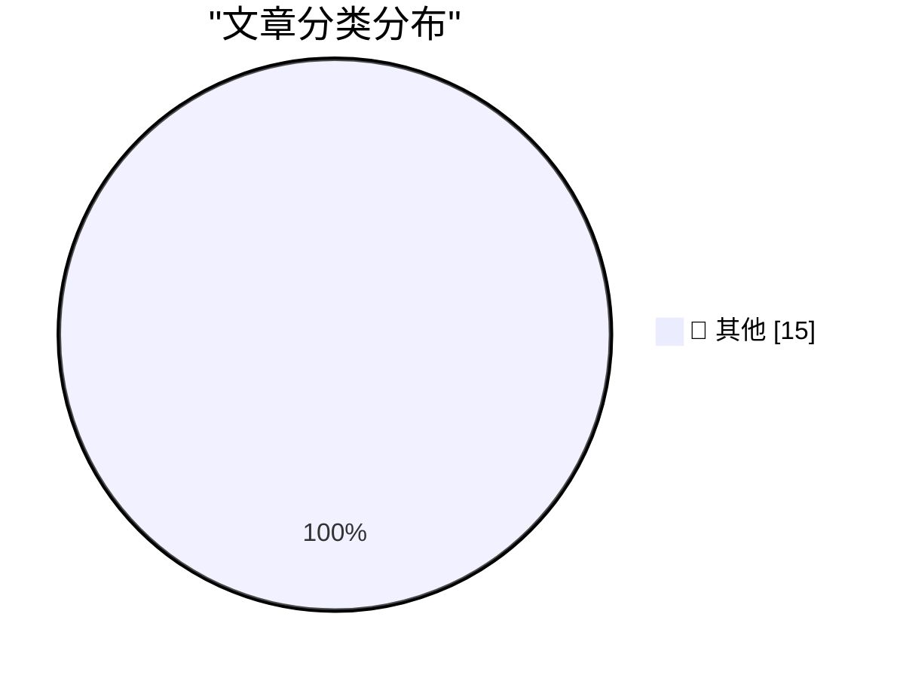

# 📰 AI 资讯每日精选 — 2026-08-27

> 汇聚 140+ 技术博客、X/Twitter、Hacker News、Reddit、Product Hunt、
> Lobste.rs、ClawFeed 日报及 GitHub Trending，经 AI 评分筛选。
>
> **本期内容**：🏆 今日必读 · 🌐 ClawFeed 日报 · 🔥 GitHub Trending · 📂 分类精选 · 🎨 设计与生成式 AI · 📊 数据概览

## 🏆 今日必读

🥇 **Qwen3.8-Flash-Next**

[Qwen3.8-Flash-Next](https://simonwillison.net/2026/Aug/26/qwen38-flash-next/) — simonwillison.net · 5 小时前 · 📝 其他

> Qwen3.8-Flash-Next

🥈 **Quoting Paul Dix**

[Quoting Paul Dix](https://simonwillison.net/2026/Aug/26/paul-dix/) — simonwillison.net · 20 小时前 · 📝 其他

> Quoting Paul Dix

🥉 **POSIWID: The Purpose of a System Is What It Does**

[POSIWID: The Purpose of a System Is What It Does](https://en.wikipedia.org/wiki/The_purpose_of_a_system_is_what_it_does) — daringfireball.net · 8 小时前 · 📝 其他

> POSIWID: The Purpose of a System Is What It Does

4️⃣ **Apple’s Polishing Cloth Is Now Just $9**

[Apple’s Polishing Cloth Is Now Just $9](https://9to5mac.com/2026/08/25/apple-releases-new-polishing-cloth-for-9/) — daringfireball.net · 9 小时前 · 📝 其他

> Apple’s Polishing Cloth Is Now Just $9

5️⃣ **‘Surprise and Shine’ Apple Event: Wednesday 9 September**

[‘Surprise and Shine’ Apple Event: Wednesday 9 September](https://9to5mac.com/2026/08/26/apple-officially-announces-iphone-18-pro-foldable-event/) — daringfireball.net · 9 小时前 · 📝 其他

> ‘Surprise and Shine’ Apple Event: Wednesday 9 September

---

## 🌐 ClawFeed 日报精选

> 来源：[ClawFeed](https://clawfeed.kevinhe.io) — AI 驱动的多源新闻聚合

# ClawFeed 日报 | 2026-08-26 (Tue)

> 聚合 5 期 4h digest (#1066-#1070)，覆盖 00:00-19:59 SGT

---

## 🔥 当日全场最重要 5 条

1. **量子计算威胁加密货币签名安全，迁移进入工程议程** — a16z crypto 发布 Stanford 密码学家 Dan Boneh 新讲座，指出 BTC/ETH 签名可被量子计算机伪造，SPHINCS 哈希签名成本过高，两大网络升级时间窗口紧迫。Laura Shin 同日报道后量子密码学方案对比，Bitcoin 未迁移的 Satoshi 时代币成为量子计算对 crypto 最大考验。(@a16zcrypto, @laurashin)

2. **Anthropic 发布 AI-native SDLC Playbook，重构软件开发流程** — 保留标准 SDLC 阶段但重构为 artifact-driven loop，不再是线性流程。同日 Claude 统一记忆上线(chat+Cowork 共享)、Claude Code 系统提示精简 80% 持续被引用(4.7M views)。Anthropic 本周在开发者工具链上多点推进。(@rseroter, @bcherny, @trq212)

3. **IPFS 核心基础设施面临断裂** — Shipyard 宣布 Protocol Labs 停止续资，Kubo、Helia、IPFS Desktop 等核心项目将于 9/30 停止维护。去中心化存储赛道的基础设施危机。(@wublockchain12)

4. **Skild AI S1 机器人基础模型：看一段视频就能学会新任务** — 无需微调，in-context learning 实时运行。机器人从"预编程执行"到"看一遍就会"的跨越，具身 AI 里程碑。(@guruchahal)

5. **AI agent 支付难题催生稳定币基础设施需求** — a16z 点出信用卡 1 分钱交易收 31 分手续费，agent 日跑成千上万笔微支付不可行。Casper x402 协议已实现生产级 agent 支付；稳定币卡累计充值 138 亿美元(年增近 100 亿)；Airwallex 开始拥抱稳定币。Agent 经济正在重构支付 rail。(@a16zcrypto, @laurashin, @zdxg119, @scott_shannon)

---

## 📰 当日核心主题

### 🏗️ Agent 架构与工程（当日最热主题，5 期持续覆盖）
- Anthropic AI-native SDLC Playbook：从线性流程到 artifact-driven loop
- Claude Code 系统提示精简 80% 持续被引——模型能力升级让冗余指令有害
- Claude 统一记忆上线：chat + Cowork 共享同一份记忆(@bcherny)
- Recuris 递归自进化：不改模型权重，通过 Experiential-Working Memory 双循环让 frozen LLM 持续改进(@LingYang_PU)
- Matrix Agent OS 架构(@BruceGuai)持续被引，harness 从工具演进为操作系统
- 自媒体全流水线 9 个 Claude Code skill 拼出完整闭环(@GoSailGlobal, 389 stars)
- Claude SEO 审计：18 个专家 agent 并行(@tom_doerr)

### 💰 Crypto/DeFi 生态（多维高密度）
- 量子计算 vs 加密签名安全：SPHINCS 成本问题 + 后量子方案对比
- IPFS 核心维护 9/30 停止，去中心化存储基础设施断裂
- Agent 微支付 → 稳定币成唯一可行 rail，多方验证
- BTC 突破 $81K 创 5 月新高；灰度 IBIT 实物转换破 $50 亿
- Cosmos EVM 共享漏洞三链被攻，KiiChain 损失 ~$9M
- 1inch 联创自曝被 MEV bot 在 LP 里夹，Aqua 单 owner 方案
- 代币化股票趋势：Coinbase Base 上线 24/7 全球可交易股票
- 灰度创始人：美股 5 年内 24 小时交易

### 🤖 AI 产业与市场
- AI 市场渗透率 <1%($6T+ 知识工作者市场)——增长空间巨大但落地远未到位(@guruchahal)
- Martin Casado(a16z) 定义 AI 为"计算的全新抽象层"，20 人团队可高效部署 $1B
- Dwarkesh 深聊 AI lab 经济学：RSI 临近，Anthropic/OpenAI 将控制全球大部分 FLOPs
- Google Gemini Enterprise 行业垂直方案首发法律金融，对标 Harvey 等
- Opus 5 输出风格调教成共性痛点(@vasuman, 324 回复)
- Anthropic 前线部署工程师面试指南泄露
- Stripe 3 天拦截 3 亿美元 AI 时代欺诈

### 🛠️ 开发者工具链
- Qwen3.8-Flash-Next 发布，开源模型竞争加速
- Grok 4.6 在 OpenCode 上线(每 5h 169 次)
- Opus 5 three.js 产品页生成能力极强(@MengTo)，ThreeUI 160+ 组件
- GPT Image 提示词合集开源项目登顶 GitHub #1
- EIP-8130 提案：统一所有 EVM 标准
- 微信开源 WeMM-Embedding 多模态嵌入模型

---

## 🔖 Bookmark 精选（当日高频被引）

1. **@trq212 (Thariq, Anthropic)** — Claude Code 系统提示精简 80% 实践，Claude 5 时代的 context engineering 新规则。4.7M views。5 期全引用。
2. **@AndrewYNg** — AI Engineering 技能地图，系统梳理 2026 AI 工程师核心能力。5.7M views。5 期全引用。
3. **@BruceGuai** — Matrix Agent OS 架构详解：Agent 公司 OS，角色隔离+权限+问责。4 期引用。
4. **@xiaohu** — Cloudflare @cloudflare/computer：给 AI Agent 配云端虚拟电脑，毫秒级启动。3 期引用。
5. **@mntruell (Cursor CEO)** — "软件开发的第三纪元"：从 Tab 到 Agent。7.2M views。2 期引用。
6. **@mardehaym** — AI-Native Engineering 五个阶段，大多数团队还在第零阶段。189K views。2 期引用。

---

## 👀 推荐关注汇总

| 账号 | 理由 |
|------|------|
| @raft_hq | Agent 协作平台，agents 有独立 desk/report/reminder，人机混合工作空间 |
| @khoa_solo | 正在构建 Parallels Desktop 开源替代 + AI VM spawning，builder in public |
| @rwayne | PhD，医学与经济学交叉，AI 知识库/GEO/本地模型持续开源，高质量中文 AI 实操 |
| @tom_doerr | 高频 AI 工具/开源项目推荐，Claude Skills、Agent 架构，内容密度高 |
| @LingYang_PU | 北大研究员，agent 递归自进化(Recuris)作者，harness 架构前沿 |
| @hackernews | HN 官方重返 X，开发者社区热点一手信息源 |

⚠️ 操作前请先在 Following 里搜一下避免重复。

---

## 💤 当日重复噪音模式

- **@RaminNasibov 纯视觉/meme 内容**：多期重复出现，无文字纯图帖、气动力学梗图、鹦鹉视频等，零信息密度
- **励志鸡汤/生活碎片**：@lynk0x 等多期出现，属于常驻低信号噪音源
- **低信息量 crypto 情绪帖**：市场结构争论、应援帖等，无实质分析
- **纯招聘/活动营销**：@SophieWeb3 等，无技术内容

---

*Generated from 5 × 4h digests (feed 154 + bookmarks 19/period) | ClawFeed Daily*---

## 🔥 GitHub Trending

> 今日热门开源项目（全语言 + Python）

| # | 项目 | 描述 | ⭐ 总星 | 📈 今日 | 语言 |
|---|------|------|---------|---------|------|
| 1 | [freestylefly/awesome-gpt-image-2](https://github.com/freestylefly/awesome-gpt-image-2) 🤖 | Prompt as Code | GPT-Image2 工业级提示词引擎与模板库，530+ 个案例逆向工程，20+... | 21.8k | +4050 | JavaScript |
| 2 | [DietrichGebert/ponytail](https://github.com/DietrichGebert/ponytail) 🤖 | Makes your AI agent think like the laziest senior dev in ... | 112.9k | +1598 | JavaScript |
| 3 | [MadsLorentzen/ai-job-search](https://github.com/MadsLorentzen/ai-job-search) 🤖 | The job search that runs on your machine. AI job applicat... | 36.6k | +1300 | Python |
| 4 | [tt-a1i/archify](https://github.com/tt-a1i/archify) 🤖 | Agent skill for beautiful, verifiable architecture, workf... | 18.7k | +1035 | HTML |
| 5 | [basecamp/omarchy](https://github.com/basecamp/omarchy) | Beautiful, Modern & Opinionated Linux | 32.1k | +1024 | Shell |
| 6 | [rohitg00/ai-engineering-from-scratch](https://github.com/rohitg00/ai-engineering-from-scratch) 🤖 | Learn it. Build it. Ship it for others. | 49.7k | +838 | Python |
| 7 | [AgriciDaniel/claude-obsidian](https://github.com/AgriciDaniel/claude-obsidian) 🤖 | Self-organizing AI second brain for Obsidian + Claude Cod... | 13.5k | +810 | Python |
| 8 | [TauricResearch/TradingAgents](https://github.com/TauricResearch/TradingAgents) 🤖 | TradingAgents: Multi-Agents LLM Financial Trading Framework | 100.8k | +707 | Python |
| 9 | [anthropics/claude-plugins-community](https://github.com/anthropics/claude-plugins-community) 🤖 | Community plugin marketplace for Claude Cowork and Claude... | 2.3k | +538 | Python |
| 10 | [Alishahryar1/free-claude-code](https://github.com/Alishahryar1/free-claude-code) 🤖 | Use Claude Code, Codex, Pi, and OpenCode for free (1.3B+ ... | 50.5k | +536 | Python |
| 11 | [tinyhumansai/openhuman](https://github.com/tinyhumansai/openhuman) 🤖 | Your Personal AI super intelligence. A brain that builds ... | 38.3k | +525 | Rust |
| 12 | [marin-community/marin](https://github.com/marin-community/marin) | Open-source framework for the research and development of... | 2.5k | +441 | Python |
| 13 | [Panniantong/Agent-Reach](https://github.com/Panniantong/Agent-Reach) 🤖 | Give your AI agent eyes to see the entire internet. Read ... | 75.7k | +367 | Python |
| 14 | [anthropics/claude-plugins-official](https://github.com/anthropics/claude-plugins-official) 🤖 | Official, Anthropic-managed directory of high quality Cla... | 34.4k | +308 | Python |
| 15 | [github/spec-kit](https://github.com/github/spec-kit) | 💫 Toolkit to help you get started with Spec-Driven Devel... | 131.7k | +301 | Python |

---

## 📝 其他

### 1. Qwen3.8-Flash-Next

[Qwen3.8-Flash-Next](https://simonwillison.net/2026/Aug/26/qwen38-flash-next/) — **simonwillison.net** · 5 小时前 · ⭐ 15/30

> Qwen3.8-Flash-Next

---

### 2. Quoting Paul Dix

[Quoting Paul Dix](https://simonwillison.net/2026/Aug/26/paul-dix/) — **simonwillison.net** · 20 小时前 · ⭐ 15/30

> Quoting Paul Dix

---

### 3. POSIWID: The Purpose of a System Is What It Does

[POSIWID: The Purpose of a System Is What It Does](https://en.wikipedia.org/wiki/The_purpose_of_a_system_is_what_it_does) — **daringfireball.net** · 8 小时前 · ⭐ 15/30

> POSIWID: The Purpose of a System Is What It Does

---

### 4. Apple’s Polishing Cloth Is Now Just $9

[Apple’s Polishing Cloth Is Now Just $9](https://9to5mac.com/2026/08/25/apple-releases-new-polishing-cloth-for-9/) — **daringfireball.net** · 9 小时前 · ⭐ 15/30

> Apple’s Polishing Cloth Is Now Just $9

---

### 5. ‘Surprise and Shine’ Apple Event: Wednesday 9 September

[‘Surprise and Shine’ Apple Event: Wednesday 9 September](https://9to5mac.com/2026/08/26/apple-officially-announces-iphone-18-pro-foldable-event/) — **daringfireball.net** · 9 小时前 · ⭐ 15/30

> ‘Surprise and Shine’ Apple Event: Wednesday 9 September

---

### 6. Gadget Review: Thermal Master P3 Macro Lens ★★★★⯪

[Gadget Review: Thermal Master P3 Macro Lens ★★★★⯪](https://shkspr.mobi/blog/2026/08/gadget-review-thermal-master-p3-macro-lens/) — **shkspr.mobi** · 17 小时前 · ⭐ 15/30

> Gadget Review: Thermal Master P3 Macro Lens ★★★★⯪

---

### 7. What is the quality of software that AI writes?

[What is the quality of software that AI writes?](https://www.johndcook.com/blog/2026/08/26/what-is-the-quality-of-software-that-ai-writes/) — **johndcook.com** · 10 小时前 · ⭐ 15/30

> What is the quality of software that AI writes?

---

### 8. Junk solutions

[Junk solutions](https://www.johndcook.com/blog/2026/08/26/junk-solutions/) — **johndcook.com** · 16 小时前 · ⭐ 15/30

> Junk solutions

---

### 9. Ultraspherical

[Ultraspherical](https://www.johndcook.com/blog/2026/08/26/ultraspherical/) — **johndcook.com** · 18 小时前 · ⭐ 15/30

> Ultraspherical

---

### 10. Can Self-Hosting Be Simple?

[Can Self-Hosting Be Simple?](https://feed.tedium.co/link/15204/17432610/self-hosting-third-place-strategy) — **tedium.co** · 1 小时前 · ⭐ 15/30

> Can Self-Hosting Be Simple?

---

### 11. Can Self-Hosting Be Simple?

[Can Self-Hosting Be Simple?](https://feed.tedium.co/link/15204/17432611/self-hosting-third-place-strategy-2) — **tedium.co** · 1 小时前 · ⭐ 15/30

> Can Self-Hosting Be Simple?

---

### 12. Digg v4 and lessons not learned

[Digg v4 and lessons not learned](https://dfarq.homeip.net/digg-v4-and-lessons-not-learned/?utm_source=rss&#038;utm_medium=rss&#038;utm_campaign=digg-v4-and-lessons-not-learned) — **dfarq.homeip.net** · 18 小时前 · ⭐ 15/30

> Digg v4 and lessons not learned

---

### 13. Sam Altman says OpenAI will have AGI by the end of 2026 if you accept his definition

[Sam Altman says OpenAI will have AGI by the end of 2026 if you accept his definition](https://the-decoder.com/sam-altman-says-openai-will-have-agi-by-the-end-of-2026-if-you-accept-his-definition/) — **The Decoder** · 11 小时前 · ⭐ 15/30

> Sam Altman says OpenAI will have AGI by the end of 2026 if you accept his definition

---

### 14. Alibaba releases Qwen3.8-Flash-Next, targeting "ultimate cost efficiency"

[Alibaba releases Qwen3.8-Flash-Next, targeting "ultimate cost efficiency"](https://the-decoder.com/alibaba-releases-qwen3-8-flash-next-targeting-ultimate-cost-efficiency/) — **The Decoder** · 14 小时前 · ⭐ 15/30

> Alibaba releases Qwen3.8-Flash-Next, targeting "ultimate cost efficiency"

---

### 15. Employee revolt and failing agents forced Meta to scrap its AI layoff plan

[Employee revolt and failing agents forced Meta to scrap its AI layoff plan](https://the-decoder.com/employee-revolt-and-failing-agents-forced-meta-to-scrap-its-ai-layoff-plan/) — **The Decoder** · 15 小时前 · ⭐ 15/30

> Employee revolt and failing agents forced Meta to scrap its AI layoff plan

---

## 📊 数据概览

| 扫描源 | 抓取文章 | 时间范围 | 精选 |
|:---:|:---:|:---:|:---:|
| 111/140 | 5364 篇 → 67 篇 | 24h | **15 篇** |

### 分类分布

---

*生成于 2026-08-27 05:00 | 汇聚 140 个技术博客、X/Twitter、Hacker News、Reddit、Product Hunt、Lobste.rs、ClawFeed 日报及 GitHub Trending，经 AI 评分筛选出 Top 15 精华内容*
