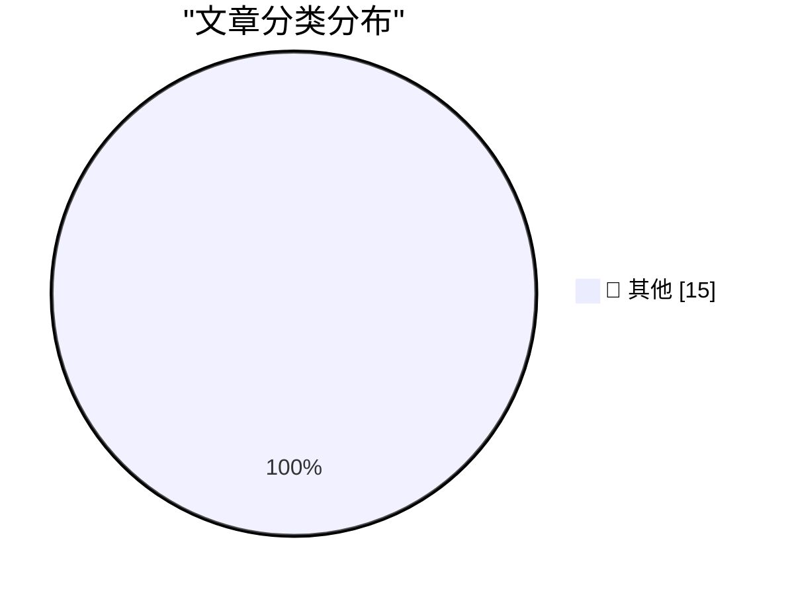

# 📰 AI 资讯每日精选 — 2026-08-29

> 汇聚 140+ 技术博客、X/Twitter、Hacker News、Reddit、Product Hunt、
> Lobste.rs、ClawFeed 日报及 GitHub Trending，经 AI 评分筛选。
>
> **本期内容**：🏆 今日必读 · 🌐 ClawFeed 日报 · 🔥 GitHub Trending · 📂 分类精选 · 🎨 设计与生成式 AI · 📊 数据概览

## 🏆 今日必读

🥇 **Just a rumour of a bug is enough to find a security exploit these days**

[Just a rumour of a bug is enough to find a security exploit these days](https://simonwillison.net/2026/Aug/28/just-a-rumour-of-a-bug/) — simonwillison.net · 6 小时前 · 📝 其他

> Just a rumour of a bug is enough to find a security exploit these days

🥈 **Building a mini Homelab that fits in my carry-on**

[Building a mini Homelab that fits in my carry-on](https://www.jeffgeerling.com/blog/2026/mini-homelab-network-fits-in-carry-on/) — jeffgeerling.com · 13 小时前 · 📝 其他

> Building a mini Homelab that fits in my carry-on

🥉 **Apple Announces Price Increase for Apple TV and Apple One Subscriptions**

[Apple Announces Price Increase for Apple TV and Apple One Subscriptions](https://9to5mac.com/2026/08/28/apple-announces-price-increase-for-apple-tv-and-apple-one-subscriptions/) — daringfireball.net · 6 小时前 · 📝 其他

> Apple Announces Price Increase for Apple TV and Apple One Subscriptions

4️⃣ **‘I’m the Guy Who Destroys Antique Books After We Scan Them Into Our Company’s Insatiable AI Platform’**

[‘I’m the Guy Who Destroys Antique Books After We Scan Them Into Our Company’s Insatiable AI Platform’](https://www.mcsweeneys.net/articles/im-the-guy-who-destroys-antique-books-after-we-scan-them-into-our-companys-insatiable-ai-platform) — daringfireball.net · 6 小时前 · 📝 其他

> ‘I’m the Guy Who Destroys Antique Books After We Scan Them Into Our Company’s Insatiable AI Platform’

5️⃣ **‘How Americans See E.U. Tech’**

[‘How Americans See E.U. Tech’](https://www.youtube.com/watch?v=gGlpBuW6ZFc) — daringfireball.net · 6 小时前 · 📝 其他

> ‘How Americans See E.U. Tech’

---

## 🌐 ClawFeed 日报精选

> 来源：[ClawFeed](https://clawfeed.kevinhe.io) — AI 驱动的多源新闻聚合

# ClawFeed Daily Digest | 2026-08-28 (SGT)

Aggregated from 5 × 4h digests (IDs: 1080, 1081, 1082, 1083, 1084)

---

## 🔥 Top 5 Most Important Items

**1. NVIDIA Q2 炸裂：收入 $96B（+106%），净利润 ~$60B，FY28 指引 +70%**
华尔街预期仅 +45%，NVIDIA 大幅超预期。Salesforce 当日涨 20%，"AI capex 是泡沫"和"SaaS 已死"两个叙事同时被击碎。Aaron Levie 长文强调软件是 AI 落地的护城河——数据治理、业务逻辑、权限管理都需要软件层。AI 基础设施投入正在转化为真实的收入增长。
*Sources: @levie, @DavidSacks*

**2. 腾讯混元 Hy4 Preview 开源：770B/49B MoE，1M 上下文，Apache-2.0**
又一个重量级开源前沿模型。主打生产力场景——长程写代码、改仓库、办公分析、游戏原型、科研推理。缓存输入仅 $0.042/M tokens。腾讯内部 WorkBuddy 已出现 Hy4-dev 选项，说明自家产品端已在使用。开源阵营实力再增。
*Source: @NFT_Chen*

**3. Charles Schwab 计划扩展至 SOL/AVAX/LINK**
传统券商巨头超越此前仅支持的 BTC/ETH，是 TradFi 对山寨币态度转变的里程碑。同日 DeFi Development Corp 以均价 $98.14 增持 1.9 万枚 SOL（总持仓 233 万枚），机构信心在消息前已有实质行动。
*Sources: @CoinMarketCap, @Techub_News*

**4. Qwen 3.8 Flash Next (125B-A6B) 在 Apple Silicon 本地运行：prefill ~700 tok/s**
通过 mlx-serve（纯 Zig + Metal，无需 Python），M4 Max 实测 prefill ~700 tok/s、输出 ~98 tok/s（MTP 加速）。本地跑 125B MoE 模型达到这个速度，对 AIPC 玩家和不依赖云端 API 的开发者是重大利好。
*Sources: @fankaishuoai, @ddalcu*

**5. Skild AI 发布 S1 机器人基础模型：看一段视频就学会 10 分钟长任务**
仅需一段视频示范即可学习从未见过的长任务，无需 fine-tuning，实时运行。从单一演示到通用操作的飞跃——机器人从"教一个动作"进化到"看一遍就会"。同日 Anthropic 发布 Model Hardware Standard，AI 进入物理世界的趋势加速。
*Sources: @guruchahal, @SkildAI, @AnthropicAI*

---

## 📰 Core Themes of the Day

### 1. AI 基础设施投入获得回报验证
NVIDIA Q2 收入翻倍，Salesforce +20%，Box 14 季度最高增速。"AI capex 泡沫论"正在被财报数据驳斥。Aaron Levie 的核心论点：AI 的价值需要软件层来释放——数据治理、权限管理、业务逻辑都是护城河。

### 2. Harness Engineering 从概念到工具链落地
Google 发布 9 页 Harness Engineering PDF（Agent = Model + Harness），Vercel 推出 HarnessAgent SDK 和 Workflow SDK（纯 TypeScript 编译工作流图），Mark Ajzenstadt 的比喻精准——"模型是涡扇发动机，harness 是驾驶舱"。Cursor 宣布 create → Origin → Vercel 一键部署闭环。Prompt engineering 之后，harness engineering 正在成为下一个核心技能。

### 3. 开源前沿模型加速追赶
腾讯 Hy4（770B/49B MoE）、Qwen 3.8 Flash Next 本地跑 125B、DeepSeek V4 Flash 以 $0.12 拿下 IMO 金牌。InferX 创始人称每周都有团队从 frontier API 转向开源，驱动力四合一：数据主权、成本、控制权、性能。开源正在从"性能妥协"变为"实用首选"。

### 4. TradFi-Crypto 加速融合
Schwab 扩展山寨币、Coinbase 在 Base 发行代币化股票、BNB Chain 加入 Mastercard Crypto Partner Program、Aerodrome 在 Base 年内交易量突破 $1000 亿。Ethena 解决 token/equity 错位难题——回购早期投资者锁定代币，Dankrad Feist 称之为 crypto 投资领域的关键突破。Forward Industries 公布 Solana 治理投票立场。链上金融从概念走向主流基础设施。

### 5. AI 向物理世界扩展
Anthropic 推出 Model Hardware Standard（AI Agent 安全操控物理硬件的规范），Skild AI S1 机器人基础模型从单段视频学习长任务，Bootoshi 实现 AI 语音通过 FaceTime Audio 呼叫 iPhone。AI 从纯数字交互进入物理操控和系统级集成阶段。

### 6. Agent 生态工具链成熟
RunInfra（YC F26）实测 93-98% cache hit rate、缓存输入 $0.01/M tokens；Agent Skills 生态出现排行榜工具，find-skills 超 310 万安装；Taste Skill 81.5K 安装推动 AI 从"能用"走向"好用"；LlamaIndex 新增 agentic 电子表格提取。

---

## 🔖 Cumulative Bookmark Highlights

本日所有 5 个 4h 周期均报告 bookmarks 为此前存量文章，无新增内容。

---

## 👀 Recommended Follows Summary

本日所有 5 个 4h 周期均未发现符合推荐标准的新账号。

---

## 💤 Noise Patterns of the Day

1. **孙宇晨/景甜八卦全天刷屏** — 从凌晨到深夜持续出现在各 4h 周期的噪音过滤中，多条转发评论，娱乐花边与 AI/crypto/tech 核心无关
2. **Ramin Nasibov 灌水常客** — 每个 4h 周期都出现，内容模式固定：纯视频/图片无实质文字、Adobe 吐槽、Batman 笑话、过誉景点提问等
3. **Elon Musk 政治评论** — 学校意识形态、暴力犯罪/死刑、Lake Ontario 改名等政治话题，Starlink 半价推广
4. **交易所/生态营销内容** — Binance 低信息量推文（"say less"/"you'll see it too"）、BNB Chain 活动汇总、BMT 交易锦标赛、Solana PSA Card + eBay 收藏品
5. **VPN 教程/个人里程碑/个人感悟类** — 低信息密度内容（DHH "New mood"、Lenny "I finished it"、各类个人感言）---

## 🔥 GitHub Trending

> 今日热门开源项目（全语言 + Python）

| # | 项目 | 描述 | ⭐ 总星 | 📈 今日 | 语言 |
|---|------|------|---------|---------|------|
| 1 | [tt-a1i/archify](https://github.com/tt-a1i/archify) 🤖 | Agent skill for beautiful, verifiable architecture, workf... | 28.0k | +4562 | JavaScript |
| 2 | [bilawalsidhu/gods-eye-view](https://github.com/bilawalsidhu/gods-eye-view) | A spy satellite simulator in your browser, except the dat... | 11.3k | +3829 | JavaScript |
| 3 | [freestylefly/awesome-gpt-image-2](https://github.com/freestylefly/awesome-gpt-image-2) 🤖 | Prompt as Code | GPT-Image2 工业级提示词引擎与模板库，530+ 个案例逆向工程，20+... | 24.4k | +1687 | JavaScript |
| 4 | [DietrichGebert/ponytail](https://github.com/DietrichGebert/ponytail) 🤖 | Makes your AI agent think like the laziest senior dev in ... | 115.5k | +1396 | JavaScript |
| 5 | [calesthio/OpenMontage](https://github.com/calesthio/OpenMontage) 🤖 | World's first open-source, agentic video production syste... | 53.4k | +1144 | Python |
| 6 | [tailscale/tailcat](https://github.com/tailscale/tailcat) | like netcat, but over Tailscale's data plane, without Tai... | 2.8k | +965 | Go |
| 7 | [K-Dense-AI/scientific-agent-skills](https://github.com/K-Dense-AI/scientific-agent-skills) 🤖 | Turn any AI agent into an AI Scientist. The #1 Agent Skil... | 36.8k | +720 | Python |
| 8 | [rohitg00/ai-engineering-from-scratch](https://github.com/rohitg00/ai-engineering-from-scratch) 🤖 | Learn it. Build it. Ship it for others. | 50.7k | +703 | Python |
| 9 | [JetBrains/go-modern-guidelines](https://github.com/JetBrains/go-modern-guidelines) 🤖 | Help AI coding agents write modern Go | 2.6k | +574 | Go |
| 10 | [Graphify-Labs/graphify](https://github.com/Graphify-Labs/graphify) 🤖 | Turn any codebase, with its docs, SQL schemas, configs, a... | 112.1k | +514 | Python |
| 11 | [anthropics/claude-plugins-official](https://github.com/anthropics/claude-plugins-official) 🤖 | Official, Anthropic-managed directory of high quality Cla... | 35.1k | +457 | Python |
| 12 | [tashfeenahmed/freellmapi](https://github.com/tashfeenahmed/freellmapi) 🤖 | 7.4 billion tokens per month. 34 free LLM providers. 635 ... | 21.7k | +433 | TypeScript |
| 13 | [mvanhorn/last30days-skill](https://github.com/mvanhorn/last30days-skill) 🤖 | AI agent skill that researches any topic across Reddit, X... | 60.0k | +394 | Python |
| 14 | [ComposioHQ/awesome-claude-skills](https://github.com/ComposioHQ/awesome-claude-skills) 🤖 | A curated list of awesome Claude Skills, resources, and t... | 73.8k | +343 | Python |
| 15 | [abi/screenshot-to-code](https://github.com/abi/screenshot-to-code) | Drop in a screenshot and convert it to clean code (HTML/T... | 75.6k | +326 | Python |

---

## 📝 其他

### 1. Just a rumour of a bug is enough to find a security exploit these days

[Just a rumour of a bug is enough to find a security exploit these days](https://simonwillison.net/2026/Aug/28/just-a-rumour-of-a-bug/) — **simonwillison.net** · 6 小时前 · ⭐ 15/30

> Just a rumour of a bug is enough to find a security exploit these days

---

### 2. Building a mini Homelab that fits in my carry-on

[Building a mini Homelab that fits in my carry-on](https://www.jeffgeerling.com/blog/2026/mini-homelab-network-fits-in-carry-on/) — **jeffgeerling.com** · 13 小时前 · ⭐ 15/30

> Building a mini Homelab that fits in my carry-on

---

### 3. Apple Announces Price Increase for Apple TV and Apple One Subscriptions

[Apple Announces Price Increase for Apple TV and Apple One Subscriptions](https://9to5mac.com/2026/08/28/apple-announces-price-increase-for-apple-tv-and-apple-one-subscriptions/) — **daringfireball.net** · 6 小时前 · ⭐ 15/30

> Apple Announces Price Increase for Apple TV and Apple One Subscriptions

---

### 4. ‘I’m the Guy Who Destroys Antique Books After We Scan Them Into Our Company’s Insatiable AI Platform’

[‘I’m the Guy Who Destroys Antique Books After We Scan Them Into Our Company’s Insatiable AI Platform’](https://www.mcsweeneys.net/articles/im-the-guy-who-destroys-antique-books-after-we-scan-them-into-our-companys-insatiable-ai-platform) — **daringfireball.net** · 6 小时前 · ⭐ 15/30

> ‘I’m the Guy Who Destroys Antique Books After We Scan Them Into Our Company’s Insatiable AI Platform’

---

### 5. ‘How Americans See E.U. Tech’

[‘How Americans See E.U. Tech’](https://www.youtube.com/watch?v=gGlpBuW6ZFc) — **daringfireball.net** · 6 小时前 · ⭐ 15/30

> ‘How Americans See E.U. Tech’

---

### 6. We Certainly Have Made a Hames Out of This

[We Certainly Have Made a Hames Out of This](https://daringfireball.net/linked/2026/08/28/trump-lake-ontario) — **daringfireball.net** · 8 小时前 · ⭐ 15/30

> We Certainly Have Made a Hames Out of This

---

### 7. ‘Not Sure How You Own Canada by Deleting Your Own History’

[‘Not Sure How You Own Canada by Deleting Your Own History’](https://x.com/MattWalshBlog/status/2093060290371870948) — **daringfireball.net** · 11 小时前 · ⭐ 15/30

> ‘Not Sure How You Own Canada by Deleting Your Own History’

---

### 8. From the DF Archive: ‘Golfo Del Gringo Loco’

[From the DF Archive: ‘Golfo Del Gringo Loco’](https://daringfireball.net/2025/02/golfo_del_gringo_loco) — **daringfireball.net** · 13 小时前 · ⭐ 15/30

> From the DF Archive: ‘Golfo Del Gringo Loco’

---

### 9. Trump Declares That Lake Ontario Is Now ‘Lake America’

[Trump Declares That Lake Ontario Is Now ‘Lake America’](https://www.notus.org/trump-white-house/lake-america-ontario-canada-trade-war-trump-executive-order-rename) — **daringfireball.net** · 14 小时前 · ⭐ 15/30

> Trump Declares That Lake Ontario Is Now ‘Lake America’

---

### 10. "iT woRKs BeTter in THe aPp!!"

["iT woRKs BeTter in THe aPp!!"](https://shkspr.mobi/blog/2026/08/it-works-better-in-the-app/) — **shkspr.mobi** · 16 小时前 · ⭐ 15/30

> "iT woRKs BeTter in THe aPp!!"

---

### 11. On forcing all derived classes to implement a specific non-virtual method, part 2

[On forcing all derived classes to implement a specific non-virtual method, part 2](https://devblogs.microsoft.com/oldnewthing/20260828-00/?p=112654) — **devblogs.microsoft.com/oldnewthing** · 14 小时前 · ⭐ 15/30

> On forcing all derived classes to implement a specific non-virtual method, part 2

---

### 12. Making the unnecessary easier

[Making the unnecessary easier](https://www.johndcook.com/blog/2026/08/28/making-the-unnecessary-easier/) — **johndcook.com** · 13 小时前 · ⭐ 15/30

> Making the unnecessary easier

---

### 13. Now Hiring: Senior Open Source Maintainer

[Now Hiring: Senior Open Source Maintainer](https://nesbitt.io/2026/08/28/now-hiring-senior-open-source-maintainer.html) — **nesbitt.io** · 18 小时前 · ⭐ 15/30

> Now Hiring: Senior Open Source Maintainer

---

### 14. Premium: The Hater's Guide To Circular Financing (Part One)

[Premium: The Hater's Guide To Circular Financing (Part One)](https://www.wheresyoured.at/premium-the-haters-guide-to-circular-financing-part-one/) — **wheresyoured.at** · 12 小时前 · ⭐ 15/30

> Premium: The Hater's Guide To Circular Financing (Part One)

---

### 15. This Week on The Analog Antiquarian

[This Week on The Analog Antiquarian](https://www.filfre.net/2026/08/this-week-on-the-analog-antiquarian/) — **filfre.net** · 12 小时前 · ⭐ 15/30

> This Week on The Analog Antiquarian

---

## 🎨 Design & Generative AI

### 🖼️ 生成式图片

- **[WTF is a World Model? [D]](https://www.reddit.com/r/MachineLearning/comments/1w16jwj/wtf_is_a_world_model_d/)** — r/MachineLearning · 4 小时前
  > WTF is a World Model? [D]

---

## 📊 数据概览

| 扫描源 | 抓取文章 | 时间范围 | 精选 |
|:---:|:---:|:---:|:---:|
| 109/140 | 5341 篇 → 77 篇 | 24h | **15 篇** |

### 分类分布

---

*生成于 2026-08-29 04:19 | 汇聚 140 个技术博客、X/Twitter、Hacker News、Reddit、Product Hunt、Lobste.rs、ClawFeed 日报及 GitHub Trending，经 AI 评分筛选出 Top 15 精华内容*
