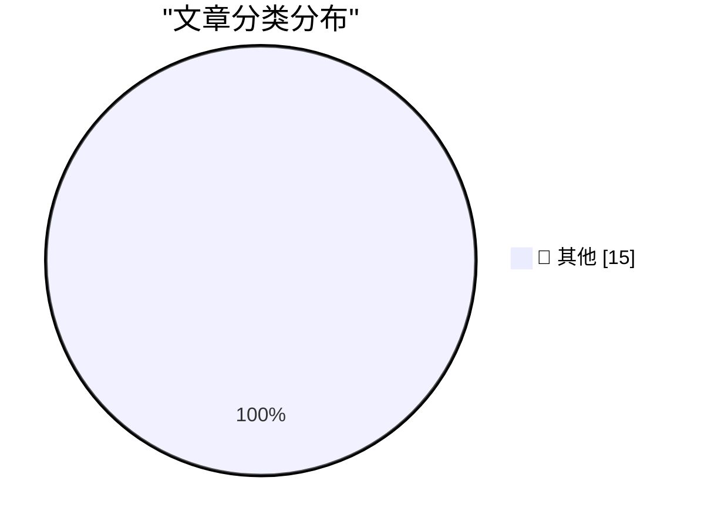

# 📰 AI 资讯每日精选 — 2026-08-30

> 汇聚 140+ 技术博客、X/Twitter、Hacker News、Reddit、Product Hunt、
> Lobste.rs、ClawFeed 日报及 GitHub Trending，经 AI 评分筛选。
>
> **本期内容**：🏆 今日必读 · 🌐 ClawFeed 日报 · 🔥 GitHub Trending · 📂 分类精选 · 🎨 设计与生成式 AI · 📊 数据概览

## 🏆 今日必读

🥇 **Introducing Hy4 Preview**

[Introducing Hy4 Preview](https://simonwillison.net/2026/Aug/29/hy4/) — simonwillison.net · 1 小时前 · 📝 其他

> Introducing Hy4 Preview

🥈 **★ Thoughts and Observations on Apple’s First Immersive MLB Broadcast, a Yankees 1-0 Win Over the Red Sox**

[★ Thoughts and Observations on Apple’s First Immersive MLB Broadcast, a Yankees 1-0 Win Over the Red Sox](https://daringfireball.net/2026/08/thoughts_and_observations_apple_immersive_mlb_broadcast) — daringfireball.net · 7 小时前 · 📝 其他

> ★ Thoughts and Observations on Apple’s First Immersive MLB Broadcast, a Yankees 1-0 Win Over the Red Sox

🥉 **A simple "copy this code" button in JavaScript**

[A simple "copy this code" button in JavaScript](https://shkspr.mobi/blog/2026/08/a-simple-copy-this-code-button-in-javascript/) — shkspr.mobi · 14 小时前 · 📝 其他

> A simple "copy this code" button in JavaScript

4️⃣ **The Server Called Paranoia: Defend Autistici/Inventati**

[The Server Called Paranoia: Defend Autistici/Inventati](https://micahflee.com/the-server-called-paranoia-defend-autistici-inventati/) — micahflee.com · 5 小时前 · 📝 其他

> The Server Called Paranoia: Defend Autistici/Inventati

5️⃣ **This Week in Package Management: 29 August 2026**

[This Week in Package Management: 29 August 2026](https://nesbitt.io/2026/08/29/this-week-in-package-management.html) — nesbitt.io · 15 小时前 · 📝 其他

> This Week in Package Management: 29 August 2026

---

## 🌐 ClawFeed 日报精选

> 来源：[ClawFeed](https://clawfeed.kevinhe.io) — AI 驱动的多源新闻聚合

📋 ClawFeed Daily | 2026-08-29 (SGT)

来源：5 期 4h digest (#1087 00:00, #1088 04:00, #1089 08:00, #1090 12:00, #1091 16:00)
feed 175 (5×35) · bookmarks 95 (5×19) · errors 0

---

🔥 当日全场最重要 5 条

1. **Claude Opus 5.1 灰度推送**：Dan McAteer 确认 Opus 5.1 已开始灰度推送，最大改进是回复风格——不再有冗长技术铺垫，直接回答。903 likes、81K views，社区反响强烈。(@daniel_mac8, #1087)

2. **NVIDIA Q2 财报碾压 "AI 泡沫" 叙事**：收入 $96B（+106%），净利润 ~$60B，毛利率 75%，FY28 指引 +70%（华尔街预期仅 45%）。Salesforce +20%。Aaron Levie / David Sacks 同时点评 "AI capex is a bubble" 和 "SaaS is dead" 两大叙事被击碎。(@levie, #1087)

3. **Grok Bot 接入 Stripe 支付 + 模板分享**：AI agent 直接闭环交易，从聊天到付款一步到位。Patrick Collison 亲推。随后又上线 Bot 模板分享功能，生态加速成型。1.3M views。(@elonmusk, #1088/#1089)

4. **AI 市场渗透率不到知识工作者劳动支出的 1%**：Guru Chahal（Lightspeed VP）粗算，整个 AI 行业在 $6T+ 市场连 1% 都没吃到，最好的垂直领域也才低个位数。增长空间巨大。(@guruchahal, #1089/#1090/#1091)

5. **Anthropic 移除 ~80% Claude Code system prompt**：trq212 分享一手经验——为新模型写 system prompt / skills / CLAUDE.md 的最佳实践。对所有 Claude Code 用户直接可用。(@trq212, #1090/#1091)

---

📰 当日核心主题

**🤖 Agent 基础设施加速**
全天最密集的主题。Grok Bot 接入 Stripe 支付并上线模板分享（#1088/#1089）；Cloudflare 发布 @cloudflare/computer 给 Agent 配虚拟电脑（#1089/#1090）；BruceGuai 拆解 Agent 公司 OS 的分层编排架构（#1090/#1091）；Elvis 谈前沿模型做编排、开源模型做执行的分层趋势（#1087）。Agent 从 demo 走向 production infrastructure。

**📊 AI 军备竞赛持续加速**
Claude Opus 5.1 灰度推送（#1087）；Gemini 3.8 Flash Preview 已在 Google 内部测试，距 3.7 仅两周（#1088/#1090）；Tencent Hy4 Preview 770B 参数 49B 激活（#1087）；RunInfra 跑 DeepSeek V4 Pro 到 296 tok/s（#1087/#1089）。模型发布节奏从大版本变成类 Chrome 持续交付。

**💰 Crypto/DeFi 治理与基础设施**
Solana 治理投票吸引 263M SOL（~$27.7B）参与（#1089/#1090）；xStocks 在 Solana 上 AUM 12 个月破 $5 亿（#1089）；Ethena USDe 在 Robinhood Chain 上 8 周破 $3.2 亿（#1087）；SBI Holdings $2.7 亿入股印尼券商推日元稳定币（#1088）。

**🏢 企业 AI 落地信号**
NVIDIA/Salesforce/Box 财报验证 AI 投资回报（#1087/#1088）；微软 $25 亿 + 6000 人做嵌入式 AI 工程（#1088）；Warp 分享 self-improving agents 实践（#1090）；6 周跑通保险理赔 AI agent（#1090）。

**🔧 开发者工具与生态**
MCP 生态持续扩展——Resend 月调用破百万、LangChain 支持新规范（#1087/#1088/#1089）；Claude Code 新增 Model Switch Hooks（#1088）；anydoc 新增 OCR <5ms（#1087）；Andrew Ng 发布 AI Engineering 技能图谱（#1089/#1090）。

---

🔖 累计 Bookmark 精选（当日新增/更新）

• @guruchahal — AI 市场渗透率 <1%，$6T+ 增长空间（#1089, 跨 3 期重复出现）
• @AndrewYNg — AI Engineering 核心技能图谱（#1089, 跨 3 期）
• @xiaohu — Cloudflare @cloudflare/computer 给 Agent 配虚拟电脑（#1089, 跨 3 期）
• @trq212 — Claude Code system prompt 精简 80% 实战经验（#1090, 跨 2 期）
• @BruceGuai — Matrix Agent 公司 OS 架构拆解（#1090, 跨 2 期）
• @arrakis_ai / @gdb — GPT-Realtime-2 实时音频翻译（#1089, 跨 3 期）
• @turingou — wanman.ai 一人公司 AI agents 框架持续迭代（#1089, 跨 3 期）
• @Av1dlive — Anthropic Claude for Finance 讲座（#1090, 跨 2 期）
• @demishassabis — DeepMind CEO 到 YC 做客，大量 startup 用 Gemma（#1090）

---

👀 推荐关注汇总（去重）

• @runinfrai (RunInfra, YC F26) — 推理优化平台，DeepSeek V4 Pro 296 tok/s，板上最便宜 V4 Pro 价格。https://x.com/runinfrai
• @trq212 — Anthropic 内部工程师，Claude Code system prompt 写作一手经验。https://x.com/trq212
• @_LuoFuli (Fuli Luo) — 小米 MiMo 构建者，前 DeepSeek 成员。https://x.com/_LuoFuli
• @sainingxie (Saining Xie) — AMI Labs 联合创始人，前 DeepMind / FAIR，顶级 CV/AI 研究者转创业。https://x.com/sainingxie
• @kalinowski007 (Caitlin Kalinowski) — Anthropic MTS，Axon 董事会成员。https://x.com/kalinowski007
• @istdrc (stdrc) — Raft 联合创始人 CEO，前 Kimi CLI 作者，Agent+编辑器方向。https://x.com/istdrc

提醒：上述未通过浏览器逐一核实是否已关注，操作前请先搜索确认。

---

💤 当日重复噪音模式

1. **Crypto 喊单/情绪帖**：@Btc_kking, @0xMoon, @AwbczBTC, @wolfyxbt, @andyyy 等，全天持续出现
2. **RaminNasibov**：每期都有纯图片/视频帖，无实质文字内容
3. **garrytan**：SF 本地政治话题反复出现（3 期），非核心领域
4. **vvxiaoyu8888**：Four.meme 香港线下聚会帖跨期重复（2 期）
5. **社交/活动签到帖**：线下聚会、晚宴照片、旅行日记等非信息帖跨多期出现
6. **binance/Coinbase**：官方账号发段子/互动帖，无实质内容（3 期）

—
本日 5 期 4h digest 全部正常产出，无中断、无 CDP 异常、无 scrape 错误。
---

## 🔥 GitHub Trending

> 今日热门开源项目（全语言 + Python）

| # | 项目 | 描述 | ⭐ 总星 | 📈 今日 | 语言 |
|---|------|------|---------|---------|------|
| 1 | [tt-a1i/archify](https://github.com/tt-a1i/archify) 🤖 | Agent skill for beautiful, verifiable architecture, workf... | 31.2k | +3902 | JavaScript |
| 2 | [bilawalsidhu/gods-eye-view](https://github.com/bilawalsidhu/gods-eye-view) | A spy satellite simulator in your browser, except the dat... | 12.7k | +1855 | JavaScript |
| 3 | [K-Dense-AI/scientific-agent-skills](https://github.com/K-Dense-AI/scientific-agent-skills) 🤖 | Turn any AI agent into an AI Scientist. The #1 Agent Skil... | 38.0k | +1587 | Python |
| 4 | [THU-MAIC/OpenMAIC](https://github.com/THU-MAIC/OpenMAIC) 🤖 | Open Multi-Agent Interactive Classroom — Get an immersive... | 22.3k | +907 | TypeScript |
| 5 | [calesthio/OpenMontage](https://github.com/calesthio/OpenMontage) 🤖 | World's first open-source, agentic video production syste... | 54.1k | +806 | Python |
| 6 | [tailscale/tailcat](https://github.com/tailscale/tailcat) | like netcat, but over Tailscale's data plane, without Tai... | 3.5k | +789 | Go |
| 7 | [abi/screenshot-to-code](https://github.com/abi/screenshot-to-code) | Drop in a screenshot and convert it to clean code (HTML/T... | 76.0k | +550 | Python |
| 8 | [every-app/open-seo](https://github.com/every-app/open-seo) | Open source alternative to Semrush and Ahrefs | 14.7k | +517 | TypeScript |
| 9 | [harry0703/MoneyPrinterTurbo](https://github.com/harry0703/MoneyPrinterTurbo) 🤖 | 利用 AI 大模型和自动化工作流，根据主题或关键词一键生成高清短视频。Generate HD short vide... | 118.5k | +385 | Python |
| 10 | [anthropics/claude-plugins-official](https://github.com/anthropics/claude-plugins-official) 🤖 | Official, Anthropic-managed directory of high quality Cla... | 35.4k | +358 | Python |
| 11 | [JetBrains/go-modern-guidelines](https://github.com/JetBrains/go-modern-guidelines) 🤖 | Help AI coding agents write modern Go | 2.9k | +303 | Go |
| 12 | [workweave/router](https://github.com/workweave/router) | Model router for agentic systems. Routes every prompt to ... | 2.7k | +284 | Go |
| 13 | [livekit/agents](https://github.com/livekit/agents) 🤖 | A framework for building realtime voice AI agents 🤖🎙️📹 | 13.6k | +254 | Python |
| 14 | [ayghri/i-have-adhd](https://github.com/ayghri/i-have-adhd) 🤖 | A skill to stop your coding agent from burying the answer... | 25.6k | +254 | Python |
| 15 | [addyosmani/agent-skills](https://github.com/addyosmani/agent-skills) 🤖 | Production-grade engineering skills for AI coding agents. | 90.7k | +196 | JavaScript |

---

## 📝 其他

### 1. Introducing Hy4 Preview

[Introducing Hy4 Preview](https://simonwillison.net/2026/Aug/29/hy4/) — **simonwillison.net** · 1 小时前 · ⭐ 15/30

> Introducing Hy4 Preview

---

### 2. ★ Thoughts and Observations on Apple’s First Immersive MLB Broadcast, a Yankees 1-0 Win Over the Red Sox

[★ Thoughts and Observations on Apple’s First Immersive MLB Broadcast, a Yankees 1-0 Win Over the Red Sox](https://daringfireball.net/2026/08/thoughts_and_observations_apple_immersive_mlb_broadcast) — **daringfireball.net** · 7 小时前 · ⭐ 15/30

> ★ Thoughts and Observations on Apple’s First Immersive MLB Broadcast, a Yankees 1-0 Win Over the Red Sox

---

### 3. A simple "copy this code" button in JavaScript

[A simple "copy this code" button in JavaScript](https://shkspr.mobi/blog/2026/08/a-simple-copy-this-code-button-in-javascript/) — **shkspr.mobi** · 14 小时前 · ⭐ 15/30

> A simple "copy this code" button in JavaScript

---

### 4. The Server Called Paranoia: Defend Autistici/Inventati

[The Server Called Paranoia: Defend Autistici/Inventati](https://micahflee.com/the-server-called-paranoia-defend-autistici-inventati/) — **micahflee.com** · 5 小时前 · ⭐ 15/30

> The Server Called Paranoia: Defend Autistici/Inventati

---

### 5. This Week in Package Management: 29 August 2026

[This Week in Package Management: 29 August 2026](https://nesbitt.io/2026/08/29/this-week-in-package-management.html) — **nesbitt.io** · 15 小时前 · ⭐ 15/30

> This Week in Package Management: 29 August 2026

---

### 6. Reading List 08/29/26

[Reading List 08/29/26](https://www.construction-physics.com/p/reading-list-082926) — **construction-physics.com** · 13 小时前 · ⭐ 15/30

> Reading List 08/29/26

---

### 7. The Rise and Fall of Agent Civilizations

[The Rise and Fall of Agent Civilizations](https://www.dwarkesh.com/p/openai-huggingface) — **dwarkesh.com** · 2 小时前 · ⭐ 15/30

> The Rise and Fall of Agent Civilizations

---

### 8. A Roku alternative streaming device

[A Roku alternative streaming device](https://dfarq.homeip.net/a-roku-alternative-streaming-device/?utm_source=rss&#038;utm_medium=rss&#038;utm_campaign=a-roku-alternative-streaming-device) — **dfarq.homeip.net** · 9 小时前 · ⭐ 15/30

> A Roku alternative streaming device

---

### 9. Dell Optiplex 3040 and 3050 micro

[Dell Optiplex 3040 and 3050 micro](https://dfarq.homeip.net/dell-optiplex-3040-and-3050-micro/?utm_source=rss&#038;utm_medium=rss&#038;utm_campaign=dell-optiplex-3040-and-3050-micro) — **dfarq.homeip.net** · 14 小时前 · ⭐ 15/30

> Dell Optiplex 3040 and 3050 micro

---

### 10. OpenAI cuts off Cursor after SpaceX acquisition, citing Musk's history of breaking contracts

[OpenAI cuts off Cursor after SpaceX acquisition, citing Musk's history of breaking contracts](https://the-decoder.com/openai-cuts-off-cursor-after-spacex-acquisition-citing-musks-history-of-breaking-contracts/) — **The Decoder** · 12 小时前 · ⭐ 15/30

> OpenAI cuts off Cursor after SpaceX acquisition, citing Musk's history of breaking contracts

---

### 11. AI-generated videos are already displacing actors and livestreamers across China's entertainment industry

[AI-generated videos are already displacing actors and livestreamers across China's entertainment industry](https://the-decoder.com/ai-generated-videos-are-already-displacing-actors-and-livestreamers-across-chinas-entertainment-industry/) — **The Decoder** · 12 小时前 · ⭐ 15/30

> AI-generated videos are already displacing actors and livestreamers across China's entertainment industry

---

### 12. Google's WikiSkill gives AI agents a persistent memory of past mistakes to sharpen future performance

[Google's WikiSkill gives AI agents a persistent memory of past mistakes to sharpen future performance](https://the-decoder.com/google-gives-ai-agents-their-own-wiki-so-they-can-learn-from-mistakes-and-successes/) — **The Decoder** · 12 小时前 · ⭐ 15/30

> Google's WikiSkill gives AI agents a persistent memory of past mistakes to sharpen future performance

---

### 13. LAION drops massive open video dataset with 10 million hours of footage for AI research

[LAION drops massive open video dataset with 10 million hours of footage for AI research](https://the-decoder.com/laion-drops-massive-open-video-dataset-with-10-million-hours-of-footage-for-ai-research/) — **The Decoder** · 16 小时前 · ⭐ 15/30

> LAION drops massive open video dataset with 10 million hours of footage for AI research

---

### 14. Anthropic wants to do for physical hardware what its Model Context Protocol did for software

[Anthropic wants to do for physical hardware what its Model Context Protocol did for software](https://the-decoder.com/anthropic-wants-to-do-for-physical-hardware-what-its-model-context-protocol-did-for-software/) — **The Decoder** · 16 小时前 · ⭐ 15/30

> Anthropic wants to do for physical hardware what its Model Context Protocol did for software

---

### 15. Delivery robots using humans to cross the street

[Delivery robots using humans to cross the street](https://www.reddit.com/r/singularity/comments/1w1fbvc/delivery_robots_using_humans_to_cross_the_street/) — **r/singularity** · 18 小时前 · ⭐ 15/30

> Delivery robots using humans to cross the street

---

## 📊 数据概览

| 扫描源 | 抓取文章 | 时间范围 | 精选 |
|:---:|:---:|:---:|:---:|
| 110/140 | 5284 篇 → 56 篇 | 24h | **15 篇** |

### 分类分布

---

*生成于 2026-08-30 01:37 | 汇聚 140 个技术博客、X/Twitter、Hacker News、Reddit、Product Hunt、Lobste.rs、ClawFeed 日报及 GitHub Trending，经 AI 评分筛选出 Top 15 精华内容*
