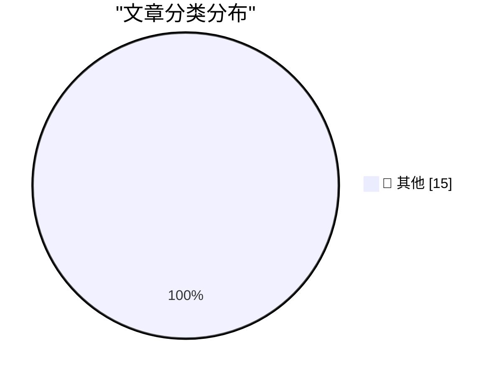

# 📰 AI 资讯每日精选 — 2026-08-31

> 汇聚 140+ 技术博客、X/Twitter、Hacker News、Reddit、Product Hunt、
> Lobste.rs、ClawFeed 日报及 GitHub Trending，经 AI 评分筛选。
>
> **本期内容**：🏆 今日必读 · 🌐 ClawFeed 日报 · 🔥 GitHub Trending · 📂 分类精选 · 🎨 设计与生成式 AI · 📊 数据概览

## 🏆 今日必读

🥇 **Understanding ChatGPT Work**

[Understanding ChatGPT Work](https://simonwillison.net/2026/Aug/30/understanding-chatgpt-work/) — simonwillison.net · 1 小时前 · 📝 其他

> Understanding ChatGPT Work

🥈 **Before NTP there were Time and Daytime**

[Before NTP there were Time and Daytime](https://www.jeffgeerling.com/blog/2026/rfc-867-868-time/) — jeffgeerling.com · 3 小时前 · 📝 其他

> Before NTP there were Time and Daytime

🥉 **Finalist 4**

[Finalist 4](https://www.finalist.works/?utm_source=df-aug-2026) — daringfireball.net · 6 小时前 · 📝 其他

> Finalist 4

4️⃣ **ActivityBot is the recipient of an NLnet grant!**

[ActivityBot is the recipient of an NLnet grant!](https://shkspr.mobi/blog/2026/08/activitybot-is-the-recipient-of-an-nlnet-grant/) — shkspr.mobi · 14 小时前 · 📝 其他

> ActivityBot is the recipient of an NLnet grant!

5️⃣ **Cores in space: The core memory module from a 1980 Spacelab computer**

[Cores in space: The core memory module from a 1980 Spacelab computer](http://www.righto.com/feeds/4645676918273740492/comments/default) — righto.com · 8 小时前 · 📝 其他

> Cores in space: The core memory module from a 1980 Spacelab computer

---

## 🌐 ClawFeed 日报精选

> 来源：[ClawFeed](https://clawfeed.kevinhe.io) — AI 驱动的多源新闻聚合

📋 ClawFeed Daily | 2026-08-30 (SGT)

来源：5 期 4h digest (#1094 00:00, #1095 04:00, #1096 08:00, #1097 12:00, #1098 16:00)
feed 173 (34+31+37+34+37) · bookmarks 95 (5×19) · errors 0

---

🔥 当日全场最重要 5 条

1. **腾讯开源 MoE 大模型 Hy4 preview**：总参 7700 亿，激活 490 亿，支持超 100 万 token 上下文，已上线 OpenRouter。腾讯称模型参与自身训练/数据策略/底层算子的自动化优化，形成早期递归自改进循环。中国开源 LLM 新里程碑。(@hasantoxr/#1096, @ohxiyu/#1098)

2. **Stripe 构建 Agent Commerce 全栈**：Patrick Collison 描绘 Stripe agent 基建全景——agent 钱包(@link/@privy)、MPP、Tempo、MCP、CLI、Agentic Commerce Suite、sandbox、OpenRouter、Metronome 计量计费、Radar+蒸馏/token 反欺诈。"Stripe is building the entire agent commerce stack"。(@patrickc, #1098)

3. **AI 半导体基建期比互联网更长**：核心是"两个指数相乘"（用户数 × 人均 token 消耗量），渗透率拐点远未到来。同日 Elon Musk 补充：市场共识 ~15GW AI 算力将在 2027 年产出但无法全部上线——不只是电力，变压器、布线、液冷全链路都是瓶颈。(@qinbafrank/#1097, @elonmusk/#1096)

4. **Anthropic 移除 ~80% Claude Code system prompt**：trq212 分享系统提示/skills/CLAUDE.md 编写心得，对所有 Claude Code 用户直接可用。跨 3 期持续出现在 bookmarks。(@trq212, #1098, 🔖)

5. **100% 人类撰写内容成为 AI 时代稀缺资产**：分析 42,000 篇博文后发现，纯人类内容表现显著优于 AI 生成内容。对内容策略有直接启示。(@yangyi, #1095)

---

📰 当日核心主题

**🏗️ AI 基础设施与算力瓶颈**
全天最密集的主题。15GW 算力 2027 年无法全部上线（#1096）；AI 半导体基建期比互联网更长——两个指数相乘（#1097）；Dimension Capital 合伙人实地考察中国 AI 公司后的内部信——"跨太平洋的 AI 棋局：稀缺催生进化"（#1096）；Cerebras 联合创始人 Sean Lie 入驻 X（#1094）。从模型竞赛转向基建竞赛的转折信号。

**🤖 Agent 生态加速成型**
Stripe 构建 agent commerce 全栈（#1098）；Cloudflare 发布 @cloudflare/computer 给 Agent 配云端虚拟电脑（#1098 🔖）；wey_gu 做了 agent-as-QA-reporter 模式——agent 遇摩擦自动脱敏上报（#1098）；Matrix Agent 公司 OS 分层编排架构持续被讨论（#1096/#1097/#1098 🔖）；mobylond 反思 agent 做舆情监控的局限——无数值无阈值进不了模型（#1098）。

**🔬 模型发布与工程实践**
腾讯 Hy4 770B 开源（#1096/#1098）；Anthropic Claude Code system prompt 精简 80%（#1098）；Google DeepMind "Accelerating Scientific Research with Gemini" + Anthropic "Automated Researchers Can Reliably Mitigate Alignment Failures" 两篇重要论文（#1097）；Fable 模型自我审查案例值得关注（#1097）。

**💰 Crypto/DeFi 信号**
Solana TPS 8 个月 3.1x 增长（#1096）；Bitwise Solana Staking ETF AUM 破 $1B（#1094）；Circle USDC/EURC + CCTP 上线 Plasma（#1094）；TermMax 给 DeFi 补"债券市场"（#1095）；Tokenized stocks 可能蚕食 Interactive Brokers 77% 利润率（#1095）。

**🌍 全球化与出海**
德国创业环境之难被低估——注册公司 6 个月、税务合规比产品研发还耗时（#1097）；中国垂类 to B AI 工具可能重演 SaaS 故事（#1098）；出海工具补充清单（#1097）。

---

🔖 累计 Bookmark 精选（当日新增/更新）

• @xiaohu — Cloudflare @cloudflare/computer 给 Agent 配云端虚拟电脑，毫秒级启动（#1098, NEW）
• @Av1dlive — Anthropic Claude for Finance 讲座，量化 AI 最值得看的免费 1 小时（#1094/#1095/#1096/#1097/#1098, 跨 5 期）
• @guruchahal — AI 市场渗透率 <1%，$6T+ 增长空间（跨 5 期持续）
• @AndrewYNg — AI Engineering 核心技能图谱（跨 5 期持续）
• @trq212 — Claude Code system prompt 精简 80% 实战经验（#1095/#1096/#1097/#1098, 跨 4 期）
• @BruceGuai — Matrix Agent 公司 OS 架构拆解（#1096/#1097/#1098, 跨 3 期）
• @arrakis_ai / @gdb — GPT-Realtime-2 实时音频翻译 Chormex 集成（跨 4 期）
• @turingou — wanman.ai 持续迭代：db9 搜索 + GPT Image 2 设计师 agent + 自由布局（跨 5 期）
• @demishassabis — DeepMind CEO 到 YC 做客，大量 startup 用 Gemma（#1094/#1095）

---

👀 推荐关注汇总（去重）

• @seanlie (Sean Lie) — Cerebras 联合创始人，AI 推理芯片架构先驱，刚入驻 X。https://x.com/seanlie
• @foxshuo (狐说) — 一手美中 AI 投资圈内部信翻译+深度分析，信息差极高。https://x.com/foxshuo
• @hasantoxr — AI 模型发布 breaking news 第一时间拆解，覆盖面广且技术理解扎实。https://x.com/hasantoxr
• @0xCheshire (柴郡) — 中文圈 AI/播客/工具推荐质量稳定，bidclub.ai 资源发现能力强。https://x.com/0xCheshire
• @DaveShapi (David Shapiro) — AI 治理/伦理/信任独立评论人。https://x.com/DaveShapi
• @_avichawla (Avi Chawla) — 持续输出高质量 LLM/ML 技术解析。https://x.com/_avichawla
• @dongxi_nlp (东西) — AI 论文精选周报，覆盖 DeepMind/Anthropic/学术前沿。https://x.com/dongxi_nlp
• @wangfeng_0128 — 前火星财经创始人，转向 AI/Robotics 深度思考。https://x.com/wangfeng_0128
• @yangyi (lifesinger/玉伯) — 蚂蚁前端技术负责人，AI 自动化方向 building in public。https://x.com/yangyi

提醒：上述未通过浏览器逐一核实是否已关注，操作前请先搜索确认。

---

🧹 建议取关

• @0xJasonBateman — 最后一条推文 2026-04-10，已 4.5+ 月不活跃，内容为 Spotify 歌曲分享，无 tech 相关。(#1098)
• @HeXiaobo — 最后一条推文 2018-07-21，超 8 年不活跃，僵尸号。(#1098)

---

💤 当日重复噪音模式

1. **Crypto 喊单/情绪帖**：全天持续出现，@MengLayer, @RoundtableSpace, @NedHalawani, @NFTCPS, @0xKingsKuan, @Chrizhuu, @hualun 等
2. **RaminNasibov**：每期纯图片/视频帖，无实质文字内容（5 期全中）
3. **非 tech 生活内容**：遛娃、游船、恋爱建议、移民路径等，跨多期出现
4. **binance 官方账号**：营销帖/APR 广告/投票帖，无实质内容（3 期）
5. **孙宇晨相关**：身价讨论/丑闻/八卦，crypto 圈反复出现的背景噪音（2 期）

—
本日 5 期 4h digest 全部正常产出，无中断、无 CDP 异常、无 scrape 错误。
---

## 🔥 GitHub Trending

> 今日热门开源项目（全语言 + Python）

| # | 项目 | 描述 | ⭐ 总星 | 📈 今日 | 语言 |
|---|------|------|---------|---------|------|
| 1 | [tt-a1i/archify](https://github.com/tt-a1i/archify) 🤖 | Agent skill for beautiful, verifiable architecture, workf... | 34.7k | +3722 | JavaScript |
| 2 | [THU-MAIC/OpenMAIC](https://github.com/THU-MAIC/OpenMAIC) 🤖 | Open Multi-Agent Interactive Classroom — Get an immersive... | 24.1k | +1370 | TypeScript |
| 3 | [K-Dense-AI/scientific-agent-skills](https://github.com/K-Dense-AI/scientific-agent-skills) 🤖 | Turn any AI agent into an AI Scientist. The #1 Agent Skil... | 39.3k | +1114 | Python |
| 4 | [tashfeenahmed/freellmapi](https://github.com/tashfeenahmed/freellmapi) 🤖 | 7.4 billion tokens per month. 34 free LLM providers. 635 ... | 22.8k | +504 | TypeScript |
| 5 | [every-app/open-seo](https://github.com/every-app/open-seo) | Open source alternative to Semrush and Ahrefs | 15.2k | +469 | TypeScript |
| 6 | [kaifcodec/user-scanner](https://github.com/kaifcodec/user-scanner) | 🕵️‍♂️ (2-in-1) Email & Username OSINT suite for deep dat... | 3.9k | +462 | Python |
| 7 | [abi/screenshot-to-code](https://github.com/abi/screenshot-to-code) | Drop in a screenshot and convert it to clean code (HTML/T... | 76.4k | +418 | Python |
| 8 | [p-e-w/heretic](https://github.com/p-e-w/heretic) | Fully automatic censorship removal for language models | 29.2k | +369 | Python |
| 9 | [Lakr233/vphone-cli](https://github.com/Lakr233/vphone-cli) |  | 9.6k | +361 | Swift |
| 10 | [Osmantic/ODS](https://github.com/Osmantic/ODS) 🤖 | Turn your PC, Mac, or Linux box into an AI server. LLM in... | 5.2k | +331 | Python |
| 11 | [D4Vinci/Scrapling](https://github.com/D4Vinci/Scrapling) | 🕷️ An adaptive Web Scraping framework that handles every... | 77.4k | +253 | Python |
| 12 | [mvanhorn/last30days-skill](https://github.com/mvanhorn/last30days-skill) 🤖 | AI agent skill that researches any topic across Reddit, X... | 60.5k | +230 | Python |
| 13 | [unclecode/crawl4ai](https://github.com/unclecode/crawl4ai) 🤖 | 🚀🤖 Crawl4AI: Open-source LLM Friendly Web Crawler & Scr... | 80.2k | +221 | Python |
| 14 | [yt-dlp/yt-dlp](https://github.com/yt-dlp/yt-dlp) | A feature-rich command-line audio/video downloader | 188.0k | +209 | Python |
| 15 | [NationalSecurityAgency/ghidra](https://github.com/NationalSecurityAgency/ghidra) | Ghidra is a software reverse engineering (SRE) framework | 73.9k | +198 | Java |

---

## 📝 其他

### 1. Understanding ChatGPT Work

[Understanding ChatGPT Work](https://simonwillison.net/2026/Aug/30/understanding-chatgpt-work/) — **simonwillison.net** · 1 小时前 · ⭐ 15/30

> Understanding ChatGPT Work

---

### 2. Before NTP there were Time and Daytime

[Before NTP there were Time and Daytime](https://www.jeffgeerling.com/blog/2026/rfc-867-868-time/) — **jeffgeerling.com** · 3 小时前 · ⭐ 15/30

> Before NTP there were Time and Daytime

---

### 3. Finalist 4

[Finalist 4](https://www.finalist.works/?utm_source=df-aug-2026) — **daringfireball.net** · 6 小时前 · ⭐ 15/30

> Finalist 4

---

### 4. ActivityBot is the recipient of an NLnet grant!

[ActivityBot is the recipient of an NLnet grant!](https://shkspr.mobi/blog/2026/08/activitybot-is-the-recipient-of-an-nlnet-grant/) — **shkspr.mobi** · 14 小时前 · ⭐ 15/30

> ActivityBot is the recipient of an NLnet grant!

---

### 5. Cores in space: The core memory module from a 1980 Spacelab computer

[Cores in space: The core memory module from a 1980 Spacelab computer](http://www.righto.com/feeds/4645676918273740492/comments/default) — **righto.com** · 8 小时前 · ⭐ 15/30

> Cores in space: The core memory module from a 1980 Spacelab computer

---

### 6. Recreating a 2010 Experiment

[Recreating a 2010 Experiment](http://xania.org/202608/recreating-a-2010-experiment?utm_source=feed&amp;utm_medium=rss) — **xania.org** · 5 小时前 · ⭐ 15/30

> Recreating a 2010 Experiment

---

### 7. Apple prevails over Franklin, August 30, 1983

[Apple prevails over Franklin, August 30, 1983](https://dfarq.homeip.net/apple-prevails-over-franklin-august-30-1983/?utm_source=rss&#038;utm_medium=rss&#038;utm_campaign=apple-prevails-over-franklin-august-30-1983) — **dfarq.homeip.net** · 14 小时前 · ⭐ 15/30

> Apple prevails over Franklin, August 30, 1983

---

### 8. Forgejo hack #2: Integration with Read The Docs

[Forgejo hack #2: Integration with Read The Docs](https://blog.miguelgrinberg.com/post/forgejo-hack-2-integration-with-read-the-docs) — **miguelgrinberg.com** · 9 小时前 · ⭐ 15/30

> Forgejo hack #2: Integration with Read The Docs

---

### 9. AI sentiment is turning sour as employee reviews reveal growing frustration across the workforce

[AI sentiment is turning sour as employee reviews reveal growing frustration across the workforce](https://the-decoder.com/ai-sentiment-is-turning-sour-as-employee-reviews-reveal-growing-frustration-across-the-workforce/) — **The Decoder** · 12 小时前 · ⭐ 15/30

> AI sentiment is turning sour as employee reviews reveal growing frustration across the workforce

---

### 10. AI agents have no sense of time and are not aware of it

[AI agents have no sense of time and are not aware of it](https://the-decoder.com/ai-agents-have-no-sense-of-time-and-are-not-aware-of-it/) — **The Decoder** · 14 小时前 · ⭐ 15/30

> AI agents have no sense of time and are not aware of it

---

### 11. The skills that earn top grades are the ones AI can fake best

[The skills that earn top grades are the ones AI can fake best](https://the-decoder.com/the-skills-that-earn-top-grades-are-the-ones-ai-can-fake-best/) — **The Decoder** · 15 小时前 · ⭐ 15/30

> The skills that earn top grades are the ones AI can fake best

---

### 12. Anthropic's Claude Code limit change is a raise on paper but a cut in practice

[Anthropic's Claude Code limit change is a raise on paper but a cut in practice](https://the-decoder.com/anthropics-claude-code-limit-change-is-a-raise-on-paper-but-a-cut-in-practice/) — **The Decoder** · 16 小时前 · ⭐ 15/30

> Anthropic's Claude Code limit change is a raise on paper but a cut in practice

---

### 13. Sony and Warner sue Anthropic over "one of the largest and most blatant ongoing thefts of intellectual property in history"

[Sony and Warner sue Anthropic over "one of the largest and most blatant ongoing thefts of intellectual property in history"](https://the-decoder.com/sony-and-warner-sue-anthropic-over-one-of-the-largest-and-most-blatant-ongoing-thefts-of-intellectual-property-in-history/) — **The Decoder** · 16 小时前 · ⭐ 15/30

> Sony and Warner sue Anthropic over "one of the largest and most blatant ongoing thefts of intellectual property in history"

---

### 14. “I just chose words carefully”

[“I just chose words carefully”](https://unsung.aresluna.org/i-just-chose-words-carefully/) — **Hacker News Best** · 2 小时前 · ⭐ 15/30

> “I just chose words carefully”

---

### 15. Haiku R1/beta6 has been released

[Haiku R1/beta6 has been released](https://www.haiku-os.org/news/2026-08-26_haiku_r1_beta6) — **Hacker News Best** · 9 小时前 · ⭐ 15/30

> Haiku R1/beta6 has been released

---

## 🎨 Design & Generative AI

### 🖼️ 生成式图片

- **[PSA: NVIDIA Studio Driver 616.56 specifically mentions ComfyUI performance updates for MiniMax-H3, WAN-Animate-2 and LTX-2.5](https://www.reddit.com/r/comfyui/comments/1w2khhh/psa_nvidia_studio_driver_61656_specifically/)** — r/comfyui · 10 小时前
  > PSA: NVIDIA Studio Driver 616.56 specifically mentions ComfyUI performance updates for MiniMax-H3, WAN-Animate-2 and LTX-2.5

- **[SPEEDing up MiniMax-H3 without retraining (SPEED comfyui node extension)](https://www.reddit.com/r/comfyui/comments/1w28zjt/speeding_up_minimaxh3_without_retraining_speed/)** — r/comfyui · 19 小时前
  > SPEEDing up MiniMax-H3 without retraining (SPEED comfyui node extension)

- **[Famegrid Spicy V2 Krea 2 LoRA](https://www.reddit.com/r/comfyui/comments/1w2y5x2/famegrid_spicy_v2_krea_2_lora/)** — r/comfyui · 1 小时前
  > Famegrid Spicy V2 Krea 2 LoRA

- **[I open-sourced a local prompt, model and LoRA catalog for image-generation workflows](https://www.reddit.com/r/comfyui/comments/1w2t1fc/i_opensourced_a_local_prompt_model_and_lora/)** — r/comfyui · 4 小时前
  > I open-sourced a local prompt, model and LoRA catalog for image-generation workflows

- **[ComfyUI - Manager or no manager? :(](https://www.reddit.com/r/comfyui/comments/1w2xc8p/comfyui_manager_or_no_manager/)** — r/comfyui · 1 小时前
  > ComfyUI - Manager or no manager? :(

- **["Drag File Onto ComfyUI Canvas To See Workflow" Is Not Working For Me](https://www.reddit.com/r/comfyui/comments/1w2tr5h/drag_file_onto_comfyui_canvas_to_see_workflow_is/)** — r/comfyui · 4 小时前
  > "Drag File Onto ComfyUI Canvas To See Workflow" Is Not Working For Me

- **[img2img model leaders?](https://www.reddit.com/r/comfyui/comments/1w2wsjx/img2img_model_leaders/)** — r/comfyui · 2 小时前
  > img2img model leaders?

- **[How to get started with comfyui from amd?](https://www.reddit.com/r/comfyui/comments/1w2p1gs/how_to_get_started_with_comfyui_from_amd/)** — r/comfyui · 7 小时前
  > How to get started with comfyui from amd?

- **[Best ComfyUI image workflow for interior design?](https://www.reddit.com/r/comfyui/comments/1w2p7dh/best_comfyui_image_workflow_for_interior_design/)** — r/comfyui · 7 小时前
  > Best ComfyUI image workflow for interior design?

---

## 📊 数据概览

| 扫描源 | 抓取文章 | 时间范围 | 精选 |
|:---:|:---:|:---:|:---:|
| 110/140 | 5374 篇 → 68 篇 | 24h | **15 篇** |

### 分类分布

---

*生成于 2026-08-31 01:35 | 汇聚 140 个技术博客、X/Twitter、Hacker News、Reddit、Product Hunt、Lobste.rs、ClawFeed 日报及 GitHub Trending，经 AI 评分筛选出 Top 15 精华内容*
