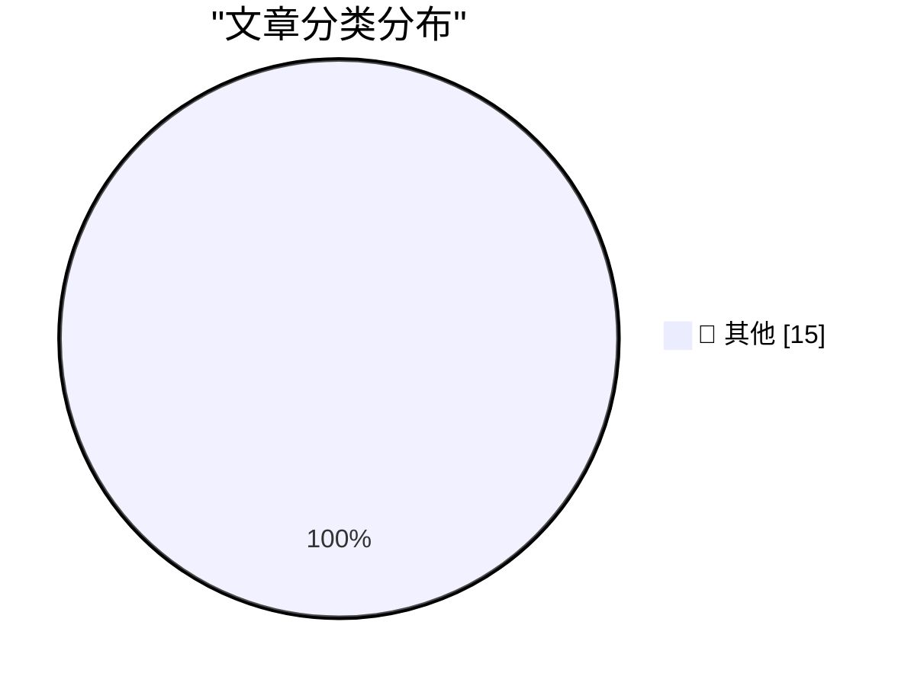

# 📰 AI 资讯每日精选 — 2026-09-01

> 汇聚 140+ 技术博客、X/Twitter、Hacker News、Reddit、Product Hunt、
> Lobste.rs、ClawFeed 日报及 GitHub Trending，经 AI 评分筛选。
>
> **本期内容**：🏆 今日必读 · 🌐 ClawFeed 日报 · 🔥 GitHub Trending · 📂 分类精选 · 🎨 设计与生成式 AI · 📊 数据概览

## 🏆 今日必读

🥇 **Introducing wrapture**

[Introducing wrapture](https://simonwillison.net/2026/Aug/31/introducing-wrapture/) — simonwillison.net · 2 小时前 · 📝 其他

> Introducing wrapture

🥈 **Quoting Andrew Digby**

[Quoting Andrew Digby](https://simonwillison.net/2026/Aug/31/andrew-digby/) — simonwillison.net · 3 小时前 · 📝 其他

> Quoting Andrew Digby

🥉 **Here's a good way to present AI videos**

[Here's a good way to present AI videos](https://idiallo.com/blog/a-good-way-to-present-ai-videos-on-youtube) — idiallo.com · 18 小时前 · 📝 其他

> Here's a good way to present AI videos

4️⃣ **Review: Ruined Theatre's A Midsummer Night's Dream ★★★★☆**

[Review: Ruined Theatre's A Midsummer Night's Dream ★★★★☆](https://shkspr.mobi/blog/2026/08/review-ruined-theatres-a-midsummer-nights-dream/) — shkspr.mobi · 14 小时前 · 📝 其他

> Review: Ruined Theatre's A Midsummer Night's Dream ★★★★☆

5️⃣ **AWE does not require PAE, though PAE makes it much more useful**

[AWE does not require PAE, though PAE makes it much more useful](https://devblogs.microsoft.com/oldnewthing/20260831-00/?p=112660) — devblogs.microsoft.com/oldnewthing · 12 小时前 · 📝 其他

> AWE does not require PAE, though PAE makes it much more useful

---

## 🌐 ClawFeed 日报精选

> 来源：[ClawFeed](https://clawfeed.kevinhe.io) — AI 驱动的多源新闻聚合

📋 ClawFeed Daily | 2026-08-31 (SGT)

来源：5 期 4h digest (#1102 00:00, #1103 04:00, #1104 08:00, #1105 12:00, #1106 16:00)
feed 162 (28+34+32+36+32) · bookmarks 95 (5×19) · errors 0

---

🔥 当日全场最重要 5 条

1. **Apple CEO 换帅：John Ternus 9月1日接任，AI 为第一优先**：Tim Cook 卸任，Ternus 接棒。苹果 AI 战略进入新阶段，对整个科技行业 AI 投入方向有风向标意义。(@Cointelegraph, #1105)

2. **OpenAI/Anthropic 大量采购 Mac 硬件训练 computer-use agent**：OpenAI 采购数万台 Mac mini 和 Mac Studio 用于强化学习训练，Anthropic 也在租用类似硬件。两大 AI 巨头同时押注 Mac 作为 agent 训练基础设施，信号极其明确。(@AndrewCurran_, #1104; @Cointelegraph, #1106)

3. **ECB 执行委员会成员：央行货币应搬上区块链**：用智能合约实时调整利率、抵押品要求和准入条件——欧央行最明确的 on-chain CBDC 信号之一。(@CoinDesk, #1103)

4. **吴恩达：Agentic Coding 时代基本功更重要而非过时**：以前学基本功为了自己写对代码，现在是为了判断 AI 写得对不对。软件工程教育定位从"执行者"变成"审计者"。(@frxiaobei, #1104)

5. **Stanford NLP 推出 DSPy："别再 prompt LLM，开始编程 LLM"**：从提示工程到编程范式的根本转变，对 agent 开发流程有直接影响。(@mdancho84, #1106)

---

📰 当日核心主题

**🤖 Agent 训练与基础设施**
全天最突出的主题。OpenAI/Anthropic 同时采购 Mac 硬件训练 computer-use agent（#1104/#1106）；Cloudflare @cloudflare/computer 给 Agent 配云端虚拟电脑（持续 🔖）；Codex 连续运行 5 天 13 小时无中断的实证（#1105）；Software Factory 基础设施从单人 AI 到多人 AI 需要大量投资（#1105）。从"造 agent"到"训练 agent"的基础设施层正在成型。

**🔬 AI 工程方法论演进**
吴恩达 Agentic Coding 基本功论（#1104）；Stanford DSPy "编程 LLM 而非 prompt LLM"（#1106）；Simon Willison 深度解读 ChatGPT Work 的 UX 困境（#1104/#1105）；Agentic Engineering Patterns 方法论——从知识资产复利到"认知债"系统性防御（#1105）。方法论层正在从零散经验向系统化框架收敛。

**🏗️ 开源与模型发布**
小红书开源 FireRedAudio 统一音频语言模型（#1106）；字节 Seed 开源 VeOmni + 腾讯混元开源 UniRL 双框架（#1104）；Qwen3.8-Flash Tech Report 被强烈推荐——不是新架构而是技术大阅兵式重组（#1106）；OpenROAD/IEDA 将颠覆 EDA 领域（#1103）。中国科技公司开源节奏加速。

**🔐 安全与漏洞**
JFrog Artifactory CVE-2026-82329 CVSS 9.8 关键认证绕过漏洞——影响广泛 CI/CD 基础设施（#1104）；针对 Claude 用户的恶意软件传播窃取密码和浏览器数据（#1104）；Bill Gates 提出保留 40% 人类岗位引发争论（#1103）。

**💰 Crypto/支付信号**
支付宝董事长韩歆毅：加密货币作为 AI 支付路径之一，四种全球探索路径并行（#1104）；Chainalysis 抗议 ICE 向 TRM Labs 授予 $9500 万独家合同（#1106）；a16z $1.1B Machine Age Fund 定向投注 AI 基础设施（#1102）。

---

🔖 累计 Bookmark 精选（当日新增/更新）

• @trq212 — Claude Code 最新模型移除约 80% 系统提示词，编写 system prompts/skills/CLAUDE.md 经验（跨 5 期持续）
• @xiaohu — Cloudflare @cloudflare/computer 给 Agent 配云端虚拟电脑，毫秒级启动（跨 5 期持续）
• @Av1dlive — Anthropic Claude for Finance 讲座，量化 AI 最值得看的免费 1 小时（跨 5 期持续）
• @guruchahal — AI 市场渗透率 <1%，$6T+ 增长空间（跨 5 期持续）
• @BruceGuai — Agent 公司 OS 架构 Matrix（跨 5 期持续）
• @turingou — wanman.ai 持续迭代：团队聊天自由布局 + Codex 调用 GPT image 2 自动创建设计师 agent（跨 5 期持续）
• @gdb — GPT-Realtime-2 实时音频翻译 Chormex 集成（跨 5 期持续）
• @AndrewYNg — AI Engineering 最重要技能地图（跨 5 期持续，#1106 新增引用）
• @Tao100086 — 张小珺×谢青池 36 篇 AI 经典论文下载地址（跨 5 期持续）

---

👀 推荐关注汇总（去重）

• @mardehaym (Mark Ajzenstadt) — Limestone Digital 创始人，PE portfolio AI 转型实操一手数据。https://x.com/mardehaym
• @bovensiepen (bovi) — 关注 OpenROAD/IEDA 等开源 EDA 生态与 AI 芯片设计创业，观点有深度。https://x.com/bovensiepen
• @balance0014 — 长期追踪中国 AI 大厂开源动态，信息结构化、密度高。https://x.com/balance0014
• @shao__meng — 对 Simon Willison 等头部 AI 工程方法论的中文深度解读，Agentic Engineering 方向。https://x.com/shao__meng
• @mdancho84 — Stanford DSPy 等 LLM 编程范式传播者，技术密度高。https://x.com/mdancho84

提醒：上述未通过浏览器逐一核实是否已关注，**Kevin 操作前请先在 Following 里搜一下**避免重复加关注。

---

💤 当日重复噪音模式

• **Crypto 喊单/交易信号**：全天各档均有大量 BTC/altcoin 价格预测、meme coin 推广、交易策略推荐，占过滤量最大比例
• **SpaceX/Tesla 非核心内容**：Falcon Heavy 着陆美图、FSD 推广、轨道成本讨论——与 AI/tech 核心无关
• **个人生活/旅行/美食**：马代餐厅评测、澳门夜景、台北活动、东京免税——非 tech 内容
• **NFT/域名交易**：allowlist 推广、NFT 销毁机制、域名销售——细分市场噪音
• **币安教育性/营销性内容**：区块链基础教程、bStocks AUM 宣传——品牌营销而非信息增量

---

📊 今日统计
• 总 feed: 162 条 · 总 bookmarks: 95 条 · 总 errors: 0
• 5 期 4h digest 全部正常产出，无遗漏
• 新增推荐关注 5 人 · 持续建议取关 2 人（@0xJasonBateman, @HeXiaobo）
---

## 🔥 GitHub Trending

> 今日热门开源项目（全语言 + Python）

| # | 项目 | 描述 | ⭐ 总星 | 📈 今日 | 语言 |
|---|------|------|---------|---------|------|
| 1 | [tt-a1i/archify](https://github.com/tt-a1i/archify) 🤖 | Agent skill for beautiful, verifiable architecture, workf... | 38.9k | +3991 | JavaScript |
| 2 | [THU-MAIC/OpenMAIC](https://github.com/THU-MAIC/OpenMAIC) 🤖 | Open Multi-Agent Interactive Classroom — Get an immersive... | 27.3k | +2824 | TypeScript |
| 3 | [K-Dense-AI/scientific-agent-skills](https://github.com/K-Dense-AI/scientific-agent-skills) 🤖 | Turn any AI agent into an AI Scientist. The #1 Agent Skil... | 40.8k | +1980 | Python |
| 4 | [zhaoxuya520/reverse-skill](https://github.com/zhaoxuya520/reverse-skill) 🤖 | Reverse Engineering / Authorized Penetration Testing / Se... | 33.2k | +1401 | PowerShell |
| 5 | [every-app/open-seo](https://github.com/every-app/open-seo) | Open source alternative to Semrush and Ahrefs | 15.8k | +610 | TypeScript |
| 6 | [browser-use/video-use](https://github.com/browser-use/video-use) | Edit videos with coding agents | 22.4k | +591 | Python |
| 7 | [k1tbyte/Wand-Enhancer](https://github.com/k1tbyte/Wand-Enhancer) | Advanced UX and interoperability extension for Wand (WeMo... | 23.4k | +582 | C# |
| 8 | [handsomestWei/patent-disclosure-skill](https://github.com/handsomestWei/patent-disclosure-skill) | 中国专利.skill：专利点挖掘与交底书（发明/实用/外观）编写，通俗解读专利，嗅探政策动向，辅助审查答复。 | 6.3k | +571 | Python |
| 9 | [p-e-w/heretic](https://github.com/p-e-w/heretic) | Fully automatic censorship removal for language models | 29.7k | +537 | Python |
| 10 | [unclecode/crawl4ai](https://github.com/unclecode/crawl4ai) 🤖 | 🚀🤖 Crawl4AI: Open-source LLM Friendly Web Crawler & Scr... | 80.6k | +516 | Python |
| 11 | [affaan-m/ECC](https://github.com/affaan-m/ECC) 🤖 | The agent harness performance optimization system. Skills... | 245.3k | +512 | JavaScript |
| 12 | [debpalash/VoiceStudio](https://github.com/debpalash/VoiceStudio) | VoiceStudio is the open-source, fully-local ElevenLabs al... | 12.7k | +509 | Python |
| 13 | [jingyaogong/minimind](https://github.com/jingyaogong/minimind) 🤖 | 🧠 Train a 64M-parameter LLM from scratch in just 2h! | 56.2k | +495 | Python |
| 14 | [calesthio/OpenMontage](https://github.com/calesthio/OpenMontage) 🤖 | World's first open-source, agentic video production syste... | 55.0k | +454 | Python |
| 15 | [mvanhorn/last30days-skill](https://github.com/mvanhorn/last30days-skill) 🤖 | AI agent skill that researches any topic across Reddit, X... | 60.8k | +429 | Python |

---

## 📝 其他

### 1. Introducing wrapture

[Introducing wrapture](https://simonwillison.net/2026/Aug/31/introducing-wrapture/) — **simonwillison.net** · 2 小时前 · ⭐ 15/30

> Introducing wrapture

---

### 2. Quoting Andrew Digby

[Quoting Andrew Digby](https://simonwillison.net/2026/Aug/31/andrew-digby/) — **simonwillison.net** · 3 小时前 · ⭐ 15/30

> Quoting Andrew Digby

---

### 3. Here's a good way to present AI videos

[Here's a good way to present AI videos](https://idiallo.com/blog/a-good-way-to-present-ai-videos-on-youtube) — **idiallo.com** · 18 小时前 · ⭐ 15/30

> Here's a good way to present AI videos

---

### 4. Review: Ruined Theatre's A Midsummer Night's Dream ★★★★☆

[Review: Ruined Theatre's A Midsummer Night's Dream ★★★★☆](https://shkspr.mobi/blog/2026/08/review-ruined-theatres-a-midsummer-nights-dream/) — **shkspr.mobi** · 14 小时前 · ⭐ 15/30

> Review: Ruined Theatre's A Midsummer Night's Dream ★★★★☆

---

### 5. AWE does not require PAE, though PAE makes it much more useful

[AWE does not require PAE, though PAE makes it much more useful](https://devblogs.microsoft.com/oldnewthing/20260831-00/?p=112660) — **devblogs.microsoft.com/oldnewthing** · 12 小时前 · ⭐ 15/30

> AWE does not require PAE, though PAE makes it much more useful

---

### 6. Patented application of linear algebra

[Patented application of linear algebra](https://www.johndcook.com/blog/2026/08/31/patented-application-of-linear-algebra/) — **johndcook.com** · 2 小时前 · ⭐ 15/30

> Patented application of linear algebra

---

### 7. Notes from August 2026

[Notes from August 2026](https://evanhahn.com/notes-from-august-2026/) — **evanhahn.com** · 20 小时前 · ⭐ 15/30

> Notes from August 2026

---

### 8. The rise and fall of agent civilizations

[The rise and fall of agent civilizations](https://www.dwarkesh.com/p/openai-huggingface-narration) — **dwarkesh.com** · 5 小时前 · ⭐ 15/30

> The rise and fall of agent civilizations

---

### 9. My Experience Has Nuance, Yours Is a Data Point

[My Experience Has Nuance, Yours Is a Data Point](https://blog.jim-nielsen.com/2026/nuance-for-me-none-for-you/) — **blog.jim-nielsen.com** · 7 小时前 · ⭐ 15/30

> My Experience Has Nuance, Yours Is a Data Point

---

### 10. Adobe’s August 1994 acquisition of Aldus

[Adobe’s August 1994 acquisition of Aldus](https://dfarq.homeip.net/adobes-august-1994-acquisition-of-aldus/?utm_source=rss&#038;utm_medium=rss&#038;utm_campaign=adobes-august-1994-acquisition-of-aldus) — **dfarq.homeip.net** · 15 小时前 · ⭐ 15/30

> Adobe’s August 1994 acquisition of Aldus

---

### 11. Bank of England chief warns that inflated AI valuations and rising leverage could trigger the next financial crisis

[Bank of England chief warns that inflated AI valuations and rising leverage could trigger the next financial crisis](https://the-decoder.com/bank-of-england-chief-warns-that-inflated-ai-valuations-and-rising-leverage-could-trigger-the-next-financial-crisis/) — **The Decoder** · 8 小时前 · ⭐ 15/30

> Bank of England chief warns that inflated AI valuations and rising leverage could trigger the next financial crisis

---

### 12. Instagram admits users often can't tell AI profiles from real people

[Instagram admits users often can't tell AI profiles from real people](https://the-decoder.com/instagram-admits-users-often-cant-tell-ai-profiles-from-real-people/) — **The Decoder** · 8 小时前 · ⭐ 15/30

> Instagram admits users often can't tell AI profiles from real people

---

### 13. OpenAI says its ChatGPT ad business hits a $1 billion annual run rate

[OpenAI says its ChatGPT ad business hits a $1 billion annual run rate](https://the-decoder.com/openai-says-its-chatgpt-ad-business-hits-a-1-billion-annual-run-rate/) — **The Decoder** · 10 小时前 · ⭐ 15/30

> OpenAI says its ChatGPT ad business hits a $1 billion annual run rate

---

### 14. China's CXMT makes its first HBM3E chips, closing the AI memory gap

[China's CXMT makes its first HBM3E chips, closing the AI memory gap](https://the-decoder.com/chinas-cxmt-makes-its-first-hbm3e-chips-closing-the-ai-memory-gap/) — **The Decoder** · 10 小时前 · ⭐ 15/30

> China's CXMT makes its first HBM3E chips, closing the AI memory gap

---

### 15. ChatGPT now faces stricter EU oversight as a very large search engine

[ChatGPT now faces stricter EU oversight as a very large search engine](https://the-decoder.com/chatgpt-now-faces-stricter-eu-oversight-as-a-very-large-search-engine/) — **The Decoder** · 11 小时前 · ⭐ 15/30

> ChatGPT now faces stricter EU oversight as a very large search engine

---

## 📊 数据概览

| 扫描源 | 抓取文章 | 时间范围 | 精选 |
|:---:|:---:|:---:|:---:|
| 101/140 | 4678 篇 → 80 篇 | 24h | **15 篇** |

### 分类分布

---

*生成于 2026-09-01 02:02 | 汇聚 140 个技术博客、X/Twitter、Hacker News、Reddit、Product Hunt、Lobste.rs、ClawFeed 日报及 GitHub Trending，经 AI 评分筛选出 Top 15 精华内容*
