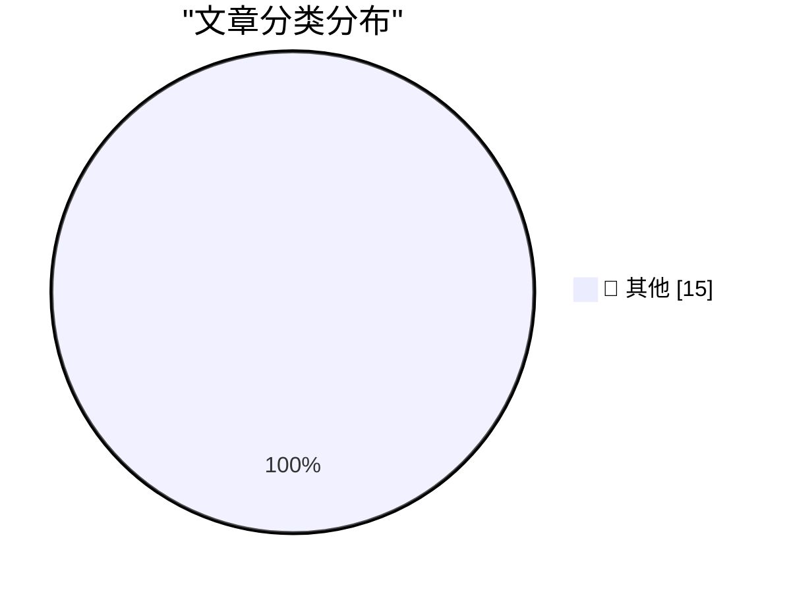

# 📰 AI 资讯每日精选 — 2026-09-02

> 汇聚 140+ 技术博客、X/Twitter、Hacker News、Reddit、Product Hunt、
> Lobste.rs、ClawFeed 日报及 GitHub Trending，经 AI 评分筛选。
>
> **本期内容**：🏆 今日必读 · 🌐 ClawFeed 日报 · 🔥 GitHub Trending · 📂 分类精选 · 🎨 设计与生成式 AI · 📊 数据概览

## 🏆 今日必读

🥇 **Claude Fable 5.1 made me a really nice animated pelican**

[Claude Fable 5.1 made me a really nice animated pelican](https://simonwillison.net/2026/Sep/1/claude-fable-5-1/) — simonwillison.net · 1 小时前 · 📝 其他

> Claude Fable 5.1 made me a really nice animated pelican

🥈 **Codex bundles LibreOffice**

[Codex bundles LibreOffice](https://simonwillison.net/2026/Sep/1/codex-libreoffice/) — simonwillison.net · 6 小时前 · 📝 其他

> Codex bundles LibreOffice

🥉 **GeoJSON Map Viewer**

[GeoJSON Map Viewer](https://simonwillison.net/2026/Sep/1/geojson/) — simonwillison.net · 7 小时前 · 📝 其他

> GeoJSON Map Viewer

4️⃣ **Quoting Tarn Adams**

[Quoting Tarn Adams](https://simonwillison.net/2026/Sep/1/tarn-adams/) — simonwillison.net · 8 小时前 · 📝 其他

> Quoting Tarn Adams

5️⃣ **Python 3.15.0 candidate 2 is here!**

[Python 3.15.0 candidate 2 is here!](https://simonwillison.net/2026/Sep/1/python-315-rc-2/) — simonwillison.net · 10 小时前 · 📝 其他

> Python 3.15.0 candidate 2 is here!

---

## 🌐 ClawFeed 日报精选

> 来源：[ClawFeed](https://clawfeed.kevinhe.io) — AI 驱动的多源新闻聚合

# 📋 ClawFeed Daily | 2026-09-01（周一）

> 聚合 5 份 4h digest：#1110(00:00) · #1111(04:00) · #1112(08:00) · #1113(12:00) · #1114(16:00)
> feed 158 · bookmarks 95（全部历史已报，无新增）· errors 0

---

## 🔥 当日全场最重要 5 条

### 1. Google WikiSkill 论文 + Grok Bot 购物 = Agent 技能化在学术和消费端同日得到验证

两条独立信号在同一天收敛：Google Research 发布 WikiSkill——Agent 自建"技能百科"，小模型+技能库击败 3 倍大的裸模型，删掉百科能力即消失（Voyager skill library 模式的学术验证，直接指向 OpenMax 自进化设计）。同时 Grok Bot 从对话界面直接购买+砍价+Stripe Link 支付（3.1M views）——Agent 从"会思考"到"能花钱"，「付钱」不再需要跳出对话。**技能积累（WikiSkill）+ 经济行为（Grok 购物）= Agent 作为经济主体的两个前提条件在同一天到位。**

### 2. Runway Solaris："接口由生成而非编码"——UI 范式可能正在翻转

Runway 首次公开 Solaris：视频即通用 UI，最终所有 UI 将是 chat+手势输入、chat+视频输出。@bilawalsidhu 评"WYSIWYG 编辑器的精细控制 + 生成模型的创造力与速度，两全其美"。这不是又一个 AI 工具——它在说 **UI 这个品类的生产方式本身要变**。如果接口可以被生成而非编码，前端工程的定义会改变。

### 3. Anthropic 品牌信任压力全天持续加码——三波独立信号

00:00 档：@kimmonismus 长帖（65K views）"Anthropic 与 power user 的关系正在实时崩塌"，叠加 Elon "Grok 某些任务比 Claude 好用"（18M views）；08:00 档：@DeryaTR_ 追击 Max 定价"scamthropic"；20:00 档：@kimmonismus 再爆 Max 20x 实际仅 ~1.7x 且 Anthropic 删除了公开数据（192K views）。**三波来自不同账号、不同时间，指向同一个结论：Anthropic 的定价透明度和产品体验正在同时受到质疑。**

### 4. 欧盟 AI 法案首批正式执法问询——全球首个对前沿模型的结构性监管行动

欧盟 AI 办公室向 OpenAI、Anthropic、Google 发出 AI 法案首批 RFI，GPAI 义务生效仅四周即启动执法，覆盖安全评估与监测两条轨道。**从"应该监管"到"开始执法"的分水岭——法规不再只是讨论。**

### 5. andrew chen (a16z) Before/After AI 对照表——竞争壁垒从技术转向分发

"硬件是 AI 唯一造不了的东西" · solo founders = 100x engineers · SaaS 100x ARR 倍数消失。**结论：AI 时代的壁垒从技术能力转向分发和数据。** 这是本日对 Kevin 融资叙事最直接相关的单条信号——如果技术壁垒被 AI 抹平，OpenMax 的护城河必须在工作流数据和客户关系里找。

---

## 📰 当日核心主题

### 1. Agent 工程化持续推进（全天 5 档均有信号）
- **Vercel fx 接入 HarnessAgent SDK**（08:00）——Harness 工程从方法论到工具链
- **OpenClaw 2.0 登 GitHub 官方推荐**（12:00）——"用 OpenClaw 构建 OpenClaw" dogfooding 实录
- **Hermes Agent v0.21.0**（20:00）——Bots Mode + Agent-to-Agent 持久通信 + 多网关
- **useAgent 开源**（00:00）——Claude Code/Codex 跑在隔离 Linux 云端
- **Andrew Ng Graph Engineering 2h 完整课程**（00:00）——从 1 prompt 到 100 agent 的全路径

### 2. Grok/xAI 攻势密集（覆盖 3 档）
- Grok Bot 接入 Microsoft 全套（Outlook/Calendar/OneDrive/Teams）——跨工具链操作（12:00）
- Grok Bot 购物+砍价+Stripe Link 支付——Agent commerce 可演示（16:00）
- X Money 向全美 Premium 用户开放（20:00）
- Elon 多次公开对比 Grok > Claude（00:00 + 12:00）

### 3. 开源模型竞赛加速
- **GLM-5.3 post-training 追平开源榜首**（00:00）
- **Tencent Hy4 "context monster" 百万上下文持续发酵**（12:00）
- **Gemini Flash 冲刺节奏**：3.6→3.7 三周，3.7→3.8 Preview 仅 15 天（16:00）
- **TimesFM 3.0**：时间序列基础模型支持多变量零样本预测（08:00 + 16:00）

### 4. Robinhood Chain / RWAFi 生态成形（覆盖 3 档）
- 代币化股票 + Memecoin 配对玩法（00:00 + 16:00）
- Robinhood Chain 翻转以太坊 24h 应用收入，但 ~89% 费用归 Robinhood（20:00）
- $BONER 逼空叙事暴涨 7000 万（16:00）
- a16z 阿根廷稳定币深度分析："不是避险工具，是替代金融基础设施"（08:00 + 12:00）

### 5. BTC 回调 + 宏观鹰派
- BTC 从 $81K 回落至 ~$78.8K（Fed Warsh Jackson Hole 鹰派）（00:00）
- 全球国债抛售加剧，政府借款成本飙至多十年高位（20:00）
- BTC 8 月整体表现：第三好的 8 月，Strategy +4,603 BTC，ETF 周净流入 $9.24 亿（08:00）

---

## 🔖 Bookmarks 精选

全天 5 档 bookmarks 均为 19 条历史已报内容，无新增。结构性 stale 延续（每档命中 19/19 去重）。

核心存量 bookmarks（持续被引用）：
- @Tao100086 36 篇 AI 经典论文精选
- @AndrewYNg AI Engineering Skills Map
- @trq212 Claude Code 系统提示精简 80%
- @levie Era of Context / Future of Enterprise Software / Capability Overhang
- @guruchahal AI 市场渗透率 <1%

---

## 👀 推荐关注汇总

本日 5 档均未执行浏览器逐一核实（followingSample 正常 20+/34 人），不出正式新推荐。

观察到的活跃信号源（非正式推荐，未核实是否已关注）：
- **@DavidOndrej1** — Agentic Engineering Setup 长文（195K views），实操向
- **@Saboo_Shubham_** — WikiSkill 论文一手拆解
- **@kimmonismus** — Anthropic 品牌追踪，本日最高信噪比的批评者

---

## 💤 当日重复噪音模式

| 噪音类型 | 频次 | 代表账号 |
|---------|------|---------|
| Crypto 价格喊单/情绪帖 | 每档 3-5 条 | @exitpumpBTC @cryptorover @0xMoon @RainFire09 |
| @RaminNasibov 纯图/空正文 | 3 档出现 | 常驻噪音源 |
| @binance 营销通稿 | 每档 1 条 | "More finance" / Weekly Market Watch / AMA 预告 |
| 娱乐/生活八卦 | 2 档 | @web3usb（景甜）@suwanyu7777（个人） |
| 一句话鸡汤 | 2 档 | @hamptonism @aidasio |
| @0xJasonBateman / @HeXiaobo | 全天 followingSample 出现 | 僵尸号，连续多周建议取关，待 Kevin 决定 |

---

*聚合自 4h digest #1110/#1111/#1112/#1113/#1114 · 覆盖 2026-09-01 00:00-19:59 SGT（20:00-23:59 待次日补入）· feed 158 · bookmarks 95（0 新增）· errors 0*
---

## 🔥 GitHub Trending

> 今日热门开源项目（全语言 + Python）

| # | 项目 | 描述 | ⭐ 总星 | 📈 今日 | 语言 |
|---|------|------|---------|---------|------|
| 1 | [THU-MAIC/OpenMAIC](https://github.com/THU-MAIC/OpenMAIC) 🤖 | Open Multi-Agent Interactive Classroom — Get an immersive... | 29.5k | +3128 | TypeScript |
| 2 | [jingyaogong/minimind](https://github.com/jingyaogong/minimind) 🤖 | 🧠 Train a 64M-parameter LLM from scratch in just 2h! | 57.1k | +1005 | Python |
| 3 | [K-Dense-AI/scientific-agent-skills](https://github.com/K-Dense-AI/scientific-agent-skills) 🤖 | Turn any AI agent into an AI Scientist. The #1 Agent Skil... | 41.5k | +912 | Python |
| 4 | [affaan-m/ECC](https://github.com/affaan-m/ECC) 🤖 | The agent harness performance optimization system. Skills... | 245.8k | +623 | JavaScript |
| 5 | [iv-org/invidious](https://github.com/iv-org/invidious) | Invidious is an alternative front-end to YouTube | 23.8k | +577 | Crystal |
| 6 | [firecrawl/pdf-inspector](https://github.com/firecrawl/pdf-inspector) | Fast Rust library for PDF inspection, classification, and... | 17.9k | +541 | Rust |
| 7 | [handsomestWei/patent-disclosure-skill](https://github.com/handsomestWei/patent-disclosure-skill) | 中国专利.skill：专利点挖掘与交底书（发明/实用/外观）编写，通俗解读专利，嗅探政策动向，辅助审查答复。 | 6.7k | +501 | Python |
| 8 | [Osmantic/ODS](https://github.com/Osmantic/ODS) 🤖 | Turn your PC, Mac, or Linux box into an AI server. LLM in... | 5.8k | +497 | Python |
| 9 | [browser-use/video-use](https://github.com/browser-use/video-use) | Edit videos with coding agents | 23.0k | +472 | Python |
| 10 | [VoltAgent/awesome-design-md](https://github.com/VoltAgent/awesome-design-md) | A collection of DESIGN.md files analysis by popular brand... | 112.8k | +323 | - |
| 11 | [MakazhanAlpamys/Soup](https://github.com/MakazhanAlpamys/Soup) | Fine-tune LLMs from one YAML. Layer streaming trains an 8... | 4.6k | +280 | Python |
| 12 | [D4Vinci/Scrapling](https://github.com/D4Vinci/Scrapling) | 🕷️ An adaptive Web Scraping framework that handles every... | 77.8k | +210 | Python |
| 13 | [HKUDS/DeepTutor](https://github.com/HKUDS/DeepTutor) | DeepTutor: Lifelong Personalized Tutoring. https://deeptu... | 38.3k | +197 | Python |
| 14 | [Imbad0202/academic-research-skills](https://github.com/Imbad0202/academic-research-skills) 🤖 | Academic Research Skills for Claude Code: research → writ... | 44.9k | +193 | Python |
| 15 | [unclecode/crawl4ai](https://github.com/unclecode/crawl4ai) 🤖 | 🚀🤖 Crawl4AI: Open-source LLM Friendly Web Crawler & Scr... | 80.9k | +145 | Python |

---

## 📝 其他

### 1. Claude Fable 5.1 made me a really nice animated pelican

[Claude Fable 5.1 made me a really nice animated pelican](https://simonwillison.net/2026/Sep/1/claude-fable-5-1/) — **simonwillison.net** · 1 小时前 · ⭐ 15/30

> Claude Fable 5.1 made me a really nice animated pelican

---

### 2. Codex bundles LibreOffice

[Codex bundles LibreOffice](https://simonwillison.net/2026/Sep/1/codex-libreoffice/) — **simonwillison.net** · 6 小时前 · ⭐ 15/30

> Codex bundles LibreOffice

---

### 3. GeoJSON Map Viewer

[GeoJSON Map Viewer](https://simonwillison.net/2026/Sep/1/geojson/) — **simonwillison.net** · 7 小时前 · ⭐ 15/30

> GeoJSON Map Viewer

---

### 4. Quoting Tarn Adams

[Quoting Tarn Adams](https://simonwillison.net/2026/Sep/1/tarn-adams/) — **simonwillison.net** · 8 小时前 · ⭐ 15/30

> Quoting Tarn Adams

---

### 5. Python 3.15.0 candidate 2 is here!

[Python 3.15.0 candidate 2 is here!](https://simonwillison.net/2026/Sep/1/python-315-rc-2/) — **simonwillison.net** · 10 小时前 · ⭐ 15/30

> Python 3.15.0 candidate 2 is here!

---

### 6. FBI Probes Service Selling 153M+ Drivers Licenses

[FBI Probes Service Selling 153M+ Drivers Licenses](https://krebsonsecurity.com/2026/09/fbi-probes-service-selling-153m-drivers-licenses/) — **krebsonsecurity.com** · 2 小时前 · ⭐ 15/30

> FBI Probes Service Selling 153M+ Drivers Licenses

---

### 7. Tim Cook’s Departure Memo on His Last Day as CEO

[Tim Cook’s Departure Memo on His Last Day as CEO](https://9to5mac.com/2026/08/31/read-tim-cooks-full-memo-to-apple-employees-on-his-last-day-as-ceo/) — **daringfireball.net** · 7 小时前 · ⭐ 15/30

> Tim Cook’s Departure Memo on His Last Day as CEO

---

### 8. Apple Reveals Forensic Evidence From Chang Liu’s MacBook in OpenAI Lawsuit

[Apple Reveals Forensic Evidence From Chang Liu’s MacBook in OpenAI Lawsuit](https://9to5mac.com/2026/08/31/apple-openai-forensic-macbook-evidence/) — **daringfireball.net** · 7 小时前 · ⭐ 15/30

> Apple Reveals Forensic Evidence From Chang Liu’s MacBook in OpenAI Lawsuit

---

### 9. [Sponsor] WorkOS: How to Give an Agent a Task Instead of a Token

[[Sponsor] WorkOS: How to Give an Agent a Task Instead of a Token](https://workos.com/blog/delegated-access-for-ai-agents?utm_source=daringfireball&amp;utm_medium=newsletter&amp;utm_campaign=q32026) — **daringfireball.net** · 17 小时前 · ⭐ 15/30

> [Sponsor] WorkOS: How to Give an Agent a Task Instead of a Token

---

### 10. Book Review: ActivityPub by Evan Prodromou ★★★★⯪

[Book Review: ActivityPub by Evan Prodromou ★★★★⯪](https://shkspr.mobi/blog/2026/09/book-review-activitypub-by-evan-prodromou/) — **shkspr.mobi** · 13 小时前 · ⭐ 15/30

> Book Review: ActivityPub by Evan Prodromou ★★★★⯪

---

### 11. Git Submodules as a Package Manager

[Git Submodules as a Package Manager](https://nesbitt.io/2026/09/01/git-submodules-as-a-package-manager.html) — **nesbitt.io** · 16 小时前 · ⭐ 15/30

> Git Submodules as a Package Manager

---

### 12. New Post: A Crash Course in Predicate Logic

[New Post: A Crash Course in Predicate Logic](https://buttondown.com/hillelwayne/archive/new-post-a-crash-course-in-predicate-logic/) — **buttondown.com/hillelwayne** · 6 小时前 · ⭐ 15/30

> New Post: A Crash Course in Predicate Logic

---

### 13. Ajeya Cotra – Inside the OpenAI agent swarm that hacked Hugging Face

[Ajeya Cotra – Inside the OpenAI agent swarm that hacked Hugging Face](https://www.dwarkesh.com/p/ajeya-cotra) — **dwarkesh.com** · 9 小时前 · ⭐ 15/30

> Ajeya Cotra – Inside the OpenAI agent swarm that hacked Hugging Face

---

### 14. Hyperscale Normalization

[Hyperscale Normalization](https://www.wheresyoured.at/hyperscale-normalization/) — **wheresyoured.at** · 7 小时前 · ⭐ 15/30

> Hyperscale Normalization

---

### 15. Commodore 64 released September 1, 1982

[Commodore 64 released September 1, 1982](https://dfarq.homeip.net/commodore-64-released-september-1-1982/?utm_source=rss&#038;utm_medium=rss&#038;utm_campaign=commodore-64-released-september-1-1982) — **dfarq.homeip.net** · 14 小时前 · ⭐ 15/30

> Commodore 64 released September 1, 1982

---

## 🎨 Design & Generative AI

### 🖼️ 生成式图片

- **[Runway's Solaris is an AI system that generates software interfaces in real time](https://the-decoder.com/runways-solaris-is-an-ai-system-that-generates-software-interfaces-in-real-time/)** — The Decoder · 12 小时前
  > Runway's Solaris is an AI system that generates software interfaces in real time

- **[World Labs just dropped Atlas: An omni world model that simulates space-time and accelerates physical AI](https://www.reddit.com/r/singularity/comments/1w4mai2/world_labs_just_dropped_atlas_an_omni_world_model/)** — r/singularity · 5 小时前
  > World Labs just dropped Atlas: An omni world model that simulates space-time and accelerates physical AI

---

## 📊 数据概览

| 扫描源 | 抓取文章 | 时间范围 | 精选 |
|:---:|:---:|:---:|:---:|
| 113/140 | 5430 篇 → 96 篇 | 24h | **15 篇** |

### 分类分布

---

*生成于 2026-09-02 01:22 | 汇聚 140 个技术博客、X/Twitter、Hacker News、Reddit、Product Hunt、Lobste.rs、ClawFeed 日报及 GitHub Trending，经 AI 评分筛选出 Top 15 精华内容*
