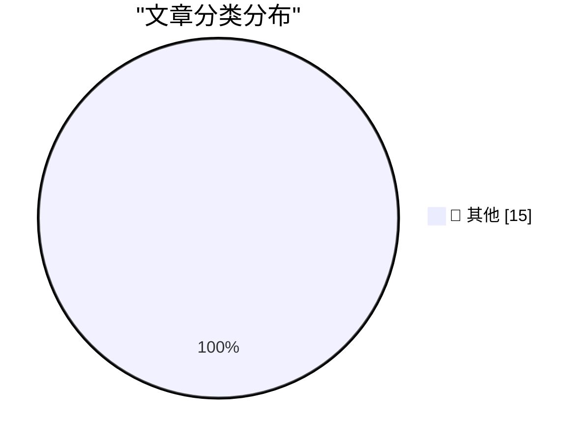

# 📰 AI 资讯每日精选 — 2026-09-03

> 汇聚 140+ 技术博客、X/Twitter、Hacker News、Reddit、Product Hunt、
> Lobste.rs、ClawFeed 日报及 GitHub Trending，经 AI 评分筛选。
>
> **本期内容**：🏆 今日必读 · 🌐 ClawFeed 日报 · 🔥 GitHub Trending · 📂 分类精选 · 🎨 设计与生成式 AI · 📊 数据概览

## 🏆 今日必读

🥇 **llm-gemini 0.34**

[llm-gemini 0.34](https://simonwillison.net/2026/Sep/2/llm-gemini/) — simonwillison.net · 8 小时前 · 📝 其他

> llm-gemini 0.34

🥈 **Claude's new system prompt really doesn't want to reproduce song lyrics**

[Claude's new system prompt really doesn't want to reproduce song lyrics](https://simonwillison.net/2026/Sep/2/claudes-new-system-prompt/) — simonwillison.net · 11 小时前 · 📝 其他

> Claude's new system prompt really doesn't want to reproduce song lyrics

🥉 **Quoting Rick Brewster**

[Quoting Rick Brewster](https://simonwillison.net/2026/Sep/2/rick-brewster/) — simonwillison.net · 19 小时前 · 📝 其他

> Quoting Rick Brewster

4️⃣ **iOS 27 Introduces New ‘iPhone Handoff’ Feature**

[iOS 27 Introduces New ‘iPhone Handoff’ Feature](https://www.macrumors.com/2026/09/02/ios-27-iphone-handoff-feature/) — daringfireball.net · 4 小时前 · 📝 其他

> iOS 27 Introduces New ‘iPhone Handoff’ Feature

5️⃣ **Pluralistic: Unpermissioned research (02 Sep 2026)**

[Pluralistic: Unpermissioned research (02 Sep 2026)](https://pluralistic.net/2026/09/02/scrape-scrope-scrap/) — pluralistic.net · 15 小时前 · 📝 其他

> Pluralistic: Unpermissioned research (02 Sep 2026)

---

## 🌐 ClawFeed 日报精选

> 来源：[ClawFeed](https://clawfeed.kevinhe.io) — AI 驱动的多源新闻聚合

# 📋 ClawFeed Daily | 2026-09-02（周二）

> 聚合 5 份 4h digest：#1117(00:00) · #1118(04:00) · #1119(08:00) · #1120(12:00) · #1121(16:00)
> feed 140 · bookmarks 95（全部历史已报，无新增）· errors 0

---

## 🔥 当日全场最重要 5 条

### 1. Claude Fable 5.1 + Mythos 5.1 正式发布——全天刷屏，缓存降价 75%，安全护栏拦截率降 6 成

Anthropic 官宣"世界最先进的编码和知识工作模型"。关键数字：缓存读取价格从 $1 降至 $0.25（降 75%），Claude Code 安全护栏拦截率降 60%，agent 同上下文场景可省 25-45%。隐藏升级：中途切换 effort 不再重写缓存——塞一条空 system 消息只带 effort 设定，前缀不动、缓存全命中，多档位任务成本直接砍下来。GitHub 官方同步宣布 Fable 5.1 进入 Copilot GA，Mythos 系列正式进入 IDE 主战场。**全天 5 档 4/5 档报道，中英文圈同步刷屏。**

### 2. 李飞飞 World Labs 发布 Atlas——世界模型从论文概念走向可用产品

首个从零训练的多模态世界模型，单张图片生成完整 3D 空间场景，支持自由运动和时间演变理解。两个 4h 档独立报道（12:00 + 16:00），与 Runway Solaris、MiniMax H3 Max 形成"构建虚拟世界的 N 种路径"对比。**标志着"世界模型"从研究方向升级为产品竞赛。**

### 3. Agent 成本管理成为核心工程问题——从 token 暴涨到 Grok Bot 云端常驻

三条独立信号同日收敛：@svpino 实测几周内 agent 成本 3x 暴涨（无故障纯费用膨胀）；Elon 宣布 Grok Bot 在云端 24/7 运行独立电脑，直击"代码在哪跑"痛点；Fable 5.1 缓存降价 75% 本质上也是成本回应。**Agent 经济从"能跑"进入"跑得起"的工程阶段。**

### 4. Graph Memory vs Flat Retrieval 首个严格对比论文——长期记忆架构实证出炉

将对话轮次抽取为类型化节点+属性化边，从两跳子图回答问题。为 long-term agent 记忆架构提供首个实证基准。**直接相关 OpenMax agent 记忆设计——graph 结构在多轮对话场景显著优于扁平检索。**

### 5. Andrew Chen (a16z) Before/After AI 范式翻转——AI 正在改写创业的每一条旧规则

"硬件不再难、独立创始人优于团队、非技术创始人可行、PhD 从实验室走向创业"。**核心结论：AI 时代的壁垒从技术能力转向分发和数据——如果所有人都能 build，差异化必须在工作流数据和客户关系里找。**

---

## 📰 当日核心主题

### 1. Claude/Anthropic 生态全面更新（全天 4/5 档信号）
- **Fable 5.1 + Mythos 5.1** 发布，缓存降价 75%，护栏降 60%
- **GitHub Copilot GA** 正式接入 Fable 5.1
- **Vercel AI Gateway** 上线 Fable 5.1
- **Claude token 省量技巧**：禁用 1M 上下文（CLAUDE_CODE_DISABLE_1M_CONTEXT=1）
- **effort 切换不重写缓存**：隐藏升级，多档位任务成本优化

### 2. 世界模型 / 界面生成竞赛（覆盖 3 档）
- **李飞飞 World Labs Atlas**——单图生成 3D 世界，从零训练
- **Runway Solaris**——界面世界模型，UI 实时生成而非编码
- **MiniMax H3 Max**——同一目标、不同技术路线
- 三者形成"构建虚拟世界的 N 种路径"对比

### 3. Grok / xAI 持续攻势（覆盖 3 档）
- Grok Bot 云端 24/7 运行，解决"代码在哪跑"问题
- Elon G20 演讲：电力/数据中心是 AI 瓶颈
- X 八月 App Store 下载破 1.03 亿次创历史新高
- X 开源算法持续更新 2 周+，已整合社区 PR
- Zuckerberg、Jensen、新 Apple CEO John Ternus 集体入驻 X

### 4. 推理速度 / 模型军备赛加速
- **OpenAI + Cerebras GPT 5.6 Sol** 跑到 750 tokens/s
- **Google Gemini 3.7 Flash** 发布
- **DeepSeek V4 Flash** 限时免费，V4 Pro 省 55%
- 推理速度从优化指标升级为架构级需求

### 5. RWA / 代币化证券持续渗透
- **ARB 单日暴涨 30%+**，Robinhood Chain 24h 收入 $1.92M
- **Bitfinex Securities** 首次上线代币化股票
- **萨尔瓦多** 233 个新代币登记项目，78% 集中在 7-8 月
- **Sberbank** 计划接受 ETH/USDT 作为贷款抵押品
- 加密行业 15 个项目从发币转向回购销毁模式

---

## 🔖 Bookmarks 精选

全天 5 档 bookmarks 均为 19 条历史已报内容，无新增。结构性 stale 延续。

核心存量 bookmarks（持续被引用）：
- @Tao100086 36 篇 AI 经典论文精选
- @AndrewYNg AI Engineering Skills Map
- @trq212 Claude Code 系统提示精简 80%
- @BruceGuai Matrix Agent 公司 OS 架构
- @guruchahal AI 市场渗透率 <1%

---

## 👀 推荐关注汇总

本日 5 档均未执行浏览器逐一核实，不出正式新推荐。

观察到的活跃信号源（非正式推荐，未核实是否已关注）：
- **@svpino** — Agent 成本工程实操，一手踩坑数据，从 token 优化到架构决策
- **@Gorden_Sun** — 中文 AI 产品深度解读（Solaris/Fable 5.1），视角独特信息密度高
- **@askalphaxiv (AlphaXiv)** — DeepWiki/研究论文搜索引擎，直接接入 agent 工具链
- **@servasyy_ai** — Fable 5.1 深度解读，价格/性能/护栏全维度拆解

---

## 💤 当日重复噪音模式

| 噪音类型 | 频次 | 代表账号 |
|---------|------|---------|
| @RaminNasibov 纯图/空正文 | 4 档出现 | 常驻噪音源，光盘笑话/行星动图/logo 设计广告 |
| Crypto 促销/活动帖 | 每档 2-4 条 | @BNBCHAIN 6 周年、@CoinMarketCap Ethena 广告、@binance 营销 |
| 纯 meme 币喊单 | 每档 1-2 条 | @CryptoOracle666 @biquanaishen @Forward_TD |
| 非领域内容 | 2 档 | @GetTheDailyDirt 政治新闻、@Meenerl4 宗教语录 |
| 空白/纯表情帖 | 2 档 | @binance @alex_prompter @indigox |

---

*聚合自 4h digest #1117/#1118/#1119/#1120/#1121 · 覆盖 2026-09-02 00:00-19:59 SGT（20:00-23:59 待次日补入）· feed 140 · bookmarks 95（0 新增）· errors 0*---

## 🔥 GitHub Trending

> 今日热门开源项目（全语言 + Python）

| # | 项目 | 描述 | ⭐ 总星 | 📈 今日 | 语言 |
|---|------|------|---------|---------|------|
| 1 | [DietrichGebert/ponytail](https://github.com/DietrichGebert/ponytail) 🤖 | Makes your AI agent think like the laziest senior dev in ... | 121.6k | +1354 | JavaScript |
| 2 | [mattpocock/skills](https://github.com/mattpocock/skills) | Skills for Real Engineers. Straight from my .agents direc... | 245.3k | +1166 | Shell |
| 3 | [pacifio/atlas](https://github.com/pacifio/atlas) | Source control for agents. Use multiple coding agents, tr... | 2.9k | +888 | Rust |
| 4 | [jingyaogong/minimind](https://github.com/jingyaogong/minimind) 🤖 | 🧠 Train a 64M-parameter LLM from scratch in just 2h! | 57.8k | +860 | Python |
| 5 | [debpalash/VoiceStudio](https://github.com/debpalash/VoiceStudio) | VoiceStudio is the open-source, fully-local ElevenLabs al... | 14.8k | +832 | Python |
| 6 | [Imbad0202/academic-research-skills](https://github.com/Imbad0202/academic-research-skills) 🤖 | Academic Research Skills for Claude Code: research → writ... | 45.6k | +799 | Python |
| 7 | [Gitlawb/openclaude](https://github.com/Gitlawb/openclaude) | runs anywhere. uses anything | 32.0k | +775 | TypeScript |
| 8 | [browser-use/video-use](https://github.com/browser-use/video-use) | Edit videos with coding agents | 23.6k | +733 | Python |
| 9 | [firecrawl/pdf-inspector](https://github.com/firecrawl/pdf-inspector) | Fast Rust library for PDF inspection, classification, and... | 18.5k | +586 | Rust |
| 10 | [NousResearch/hermes-agent](https://github.com/NousResearch/hermes-agent) 🤖 | The agent that grows with you | 240.1k | +533 | Python |
| 11 | [affaan-m/ECC](https://github.com/affaan-m/ECC) 🤖 | The agent harness performance optimization system. Skills... | 246.4k | +516 | JavaScript |
| 12 | [datawhalechina/hello-agents](https://github.com/datawhalechina/hello-agents) | 📚 《从零开始构建智能体》——从零开始的智能体原理与实践教程 | 76.5k | +446 | Python |
| 13 | [3b1b/manim](https://github.com/3b1b/manim) | Animation engine for explanatory math videos | 92.9k | +405 | Python |
| 14 | [blader/humanizer](https://github.com/blader/humanizer) 🤖 | Agent skill that removes signs of AI-generated writing fr... | 40.4k | +374 | Python |
| 15 | [google-research/timesfm](https://github.com/google-research/timesfm) | TimesFM (Time Series Foundation Model) is a pretrained ti... | 29.8k | +343 | Python |

---

## 📝 其他

### 1. llm-gemini 0.34

[llm-gemini 0.34](https://simonwillison.net/2026/Sep/2/llm-gemini/) — **simonwillison.net** · 8 小时前 · ⭐ 15/30

> llm-gemini 0.34

---

### 2. Claude's new system prompt really doesn't want to reproduce song lyrics

[Claude's new system prompt really doesn't want to reproduce song lyrics](https://simonwillison.net/2026/Sep/2/claudes-new-system-prompt/) — **simonwillison.net** · 11 小时前 · ⭐ 15/30

> Claude's new system prompt really doesn't want to reproduce song lyrics

---

### 3. Quoting Rick Brewster

[Quoting Rick Brewster](https://simonwillison.net/2026/Sep/2/rick-brewster/) — **simonwillison.net** · 19 小时前 · ⭐ 15/30

> Quoting Rick Brewster

---

### 4. iOS 27 Introduces New ‘iPhone Handoff’ Feature

[iOS 27 Introduces New ‘iPhone Handoff’ Feature](https://www.macrumors.com/2026/09/02/ios-27-iphone-handoff-feature/) — **daringfireball.net** · 4 小时前 · ⭐ 15/30

> iOS 27 Introduces New ‘iPhone Handoff’ Feature

---

### 5. Pluralistic: Unpermissioned research (02 Sep 2026)

[Pluralistic: Unpermissioned research (02 Sep 2026)](https://pluralistic.net/2026/09/02/scrape-scrope-scrap/) — **pluralistic.net** · 15 小时前 · ⭐ 15/30

> Pluralistic: Unpermissioned research (02 Sep 2026)

---

### 6. Atari Lynx: The first color handheld game console

[Atari Lynx: The first color handheld game console](https://dfarq.homeip.net/atari-lynx-the-first-color-handheld-game-console/?utm_source=rss&#038;utm_medium=rss&#038;utm_campaign=atari-lynx-the-first-color-handheld-game-console) — **dfarq.homeip.net** · 14 小时前 · ⭐ 15/30

> Atari Lynx: The first color handheld game console

---

### 7. Real-Time Intelligence with IBM Time Series Models on Confluent

[Real-Time Intelligence with IBM Time Series Models on Confluent](https://huggingface.co/blog/ibm-research/real-time-intelligence) — **Hugging Face Blog** · 11 小时前 · ⭐ 15/30

> Real-Time Intelligence with IBM Time Series Models on Confluent

---

### 8. US Department of Justice backs fair use for AI training in landmark copyright case

[US Department of Justice backs fair use for AI training in landmark copyright case](https://the-decoder.com/us-department-of-justice-backs-fair-use-for-ai-training-in-landmark-copyright-case/) — **The Decoder** · 7 小时前 · ⭐ 15/30

> US Department of Justice backs fair use for AI training in landmark copyright case

---

### 9. Gemini 3.8 Flash is Google's third budget model in six weeks while frontier models remain MIA

[Gemini 3.8 Flash is Google's third budget model in six weeks while frontier models remain MIA](https://the-decoder.com/gemini-3-8-flash-is-googles-third-budget-model-in-six-weeks-while-frontier-models-remain-mia/) — **The Decoder** · 8 小时前 · ⭐ 15/30

> Gemini 3.8 Flash is Google's third budget model in six weeks while frontier models remain MIA

---

### 10. US military adds ChatGPT and Grok to AI platform GenAI.mil

[US military adds ChatGPT and Grok to AI platform GenAI.mil](https://the-decoder.com/us-military-adds-chatgpt-and-grok-to-ai-platform-genai-mil/) — **The Decoder** · 10 小时前 · ⭐ 15/30

> US military adds ChatGPT and Grok to AI platform GenAI.mil

---

### 11. Protests against AI data centers play into China's hands, Trump says

[Protests against AI data centers play into China's hands, Trump says](https://the-decoder.com/protests-against-ai-data-centers-play-into-chinas-hands-trump-says/) — **The Decoder** · 11 小时前 · ⭐ 15/30

> Protests against AI data centers play into China's hands, Trump says

---

### 12. OpenAI calls Astra its most dangerous model yet - watching what it does is only getting harder

[OpenAI calls Astra its most dangerous model yet - watching what it does is only getting harder](https://the-decoder.com/openai-calls-astra-its-most-dangerous-model-yet-watching-what-it-does-is-only-getting-harder/) — **The Decoder** · 11 小时前 · ⭐ 15/30

> OpenAI calls Astra its most dangerous model yet - watching what it does is only getting harder

---

### 13. World Labs unveils Atlas, a single AI model that generates, reconstructs, and simulates 3D worlds from just a few photos

[World Labs unveils Atlas, a single AI model that generates, reconstructs, and simulates 3D worlds from just a few photos](https://the-decoder.com/world-labs-unveils-atlas-a-single-ai-model-that-generates-reconstructs-and-simulates-3d-worlds-from-just-a-few-photos/) — **The Decoder** · 12 小时前 · ⭐ 15/30

> World Labs unveils Atlas, a single AI model that generates, reconstructs, and simulates 3D worlds from just a few photos

---

### 14. Google Gemini's new agent-based video analysis cuts token usage by up to 88 percent

[Google Gemini's new agent-based video analysis cuts token usage by up to 88 percent](https://the-decoder.com/google-geminis-new-agent-based-video-analysis-cuts-token-usage-by-up-to-88-percent/) — **The Decoder** · 17 小时前 · ⭐ 15/30

> Google Gemini's new agent-based video analysis cuts token usage by up to 88 percent

---

### 15. The Modern CUDA Toolbox in Practice: A Step-by-Step Optimization Walkthrough

[The Modern CUDA Toolbox in Practice: A Step-by-Step Optimization Walkthrough](https://developer.nvidia.com/blog/the-modern-cuda-toolbox-in-practice-a-step-by-step-optimization-walkthrough/) — **NVIDIA Technical Blog** · 8 小时前 · ⭐ 15/30

> The Modern CUDA Toolbox in Practice: A Step-by-Step Optimization Walkthrough

---

## 📊 数据概览

| 扫描源 | 抓取文章 | 时间范围 | 精选 |
|:---:|:---:|:---:|:---:|
| 110/140 | 5361 篇 → 72 篇 | 24h | **15 篇** |

### 分类分布

---

*生成于 2026-09-03 01:25 | 汇聚 140 个技术博客、X/Twitter、Hacker News、Reddit、Product Hunt、Lobste.rs、ClawFeed 日报及 GitHub Trending，经 AI 评分筛选出 Top 15 精华内容*
