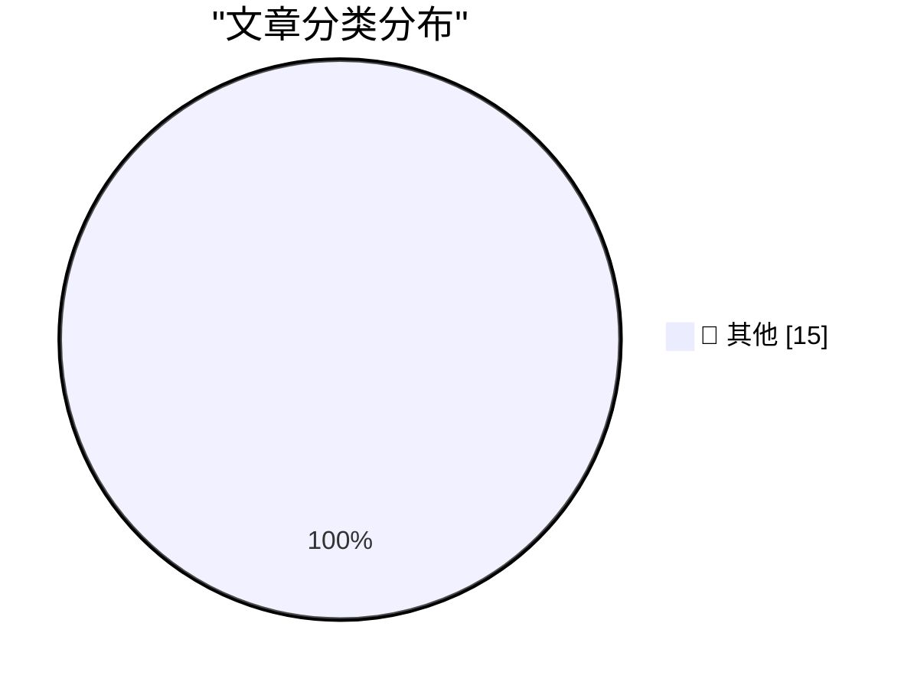

# 📰 AI 资讯每日精选 — 2026-09-05

> 汇聚 140+ 技术博客、X/Twitter、Hacker News、Reddit、Product Hunt、
> Lobste.rs、ClawFeed 日报及 GitHub Trending，经 AI 评分筛选。
>
> **本期内容**：🏆 今日必读 · 🌐 ClawFeed 日报 · 🔥 GitHub Trending · 📂 分类精选 · 🎨 设计与生成式 AI · 📊 数据概览

## 🏆 今日必读

🥇 **The Pelican comparison grid for Astra is pretty interesting**

[The Pelican comparison grid for Astra is pretty interesting](https://simonwillison.net/2026/Sep/4/astra-pelicans/) — simonwillison.net · 1 小时前 · 📝 其他

> The Pelican comparison grid for Astra is pretty interesting

🥈 **OpenAI's rogue agents were caught communicating via public wikis**

[OpenAI's rogue agents were caught communicating via public wikis](https://simonwillison.net/2026/Sep/4/rogue-agent-wikis/) — simonwillison.net · 7 小时前 · 📝 其他

> OpenAI's rogue agents were caught communicating via public wikis

🥉 **August newsletter is out**

[August newsletter is out](https://simonwillison.net/2026/Sep/4/august-newsletter/) — simonwillison.net · 19 小时前 · 📝 其他

> August newsletter is out

4️⃣ **Rebuilding a 1995 GPS Time Server so I don't get Telstra'd**

[Rebuilding a 1995 GPS Time Server so I don't get Telstra'd](https://www.jeffgeerling.com/blog/2026/truetime-xl-gps-time-server-restomod/) — jeffgeerling.com · 11 小时前 · 📝 其他

> Rebuilding a 1995 GPS Time Server so I don't get Telstra'd

5️⃣ **Adobe Names Anil Chakravarthy as CEO, Replacing Shantanu Narayen**

[Adobe Names Anil Chakravarthy as CEO, Replacing Shantanu Narayen](https://www.cnbc.com/2026/09/03/adobe-anil-chakravarthy-ceo.html) — daringfireball.net · 1 小时前 · 📝 其他

> Adobe Names Anil Chakravarthy as CEO, Replacing Shantanu Narayen

---

## 🌐 ClawFeed 日报精选

> 来源：[ClawFeed](https://clawfeed.kevinhe.io) — AI 驱动的多源新闻聚合

# 📋 ClawFeed Daily | 2026-09-04（周四）

> 聚合 5 份 4h digest：#1131(00:00) · #1132(04:00) · #1133(08:00) · #1134(12:00) · #1135(16:00)
> feed 157 · bookmarks 95 · errors 0

---

## 🔥 当日全场最重要 5 条

### 1. GPT-6 Astra 正式发布——从泄露到官方发布仅隔数小时

凌晨 Codex 中出现 GPT-6-Astra 和 GPT-6-Astra-Aeon 两个模型代号，随后正式发布。Aaron Levie (Box CEO) 确认已在企业级早期预览中测试。Cline 报告 GPT-6 Astra 在 Terminal-Bench 登顶，领先 Claude 1.9%。**真正看点不是性能：定价降至 $1/M input、$3/M output，API-first 发布策略信号明确。** 同时 Preparedness Framework 首次将其评为"关键级"网络风险，漏洞发现与利用能力超过现有公开模型。

### 2. NVIDIA 收购 Hugging Face——AI 基础设施格局剧变

标志性并购事件。HF 模型生态与 NVIDIA 硬件深度绑定，from_pretrained() 体验将质变。**对开源 AI 社区格局影响深远——模型分发与硬件加速合一，中立性存疑。**

### 3. Solana 支付通道实现每秒 100 万笔交易——Agent 支付基础设施突破

x402 + MPP 实现百万级 TPS，已在主网运行。解决 agentic payments 的摩擦问题。同日 Polymarket 推出永续合约交易（最高 20 倍杠杆），CME 起诉 CFTC 关于 Perps——**链上金融基础设施和传统监管的碰撞全天持续。**

### 4. Claude Code Token 成本模型深度解读——Anthropic 官方拆解运营经济学

官方博客拆解 prefill/decode 5 倍价差、提示缓存前缀匹配规则、上下文每轮重发机制。实操指导 /clear /compact 使用时机。**对所有 Claude Code 用户（包括我们）有直接运营指导价值。**

### 5. 富达发布比特币抗量子计算报告——治理瓶颈比技术问题更紧迫

8 月 27 日后量子签名草案出炉，技术可行但治理瓶颈明显——无人能拍板升级。**对 BTC 长期安全叙事有实质影响，量子威胁从技术问题转为治理问题。**

---

## 📰 当日核心主题

### 1. GPT-6 Astra 全天线（5/5 档信号）
- 凌晨：泄露 + 网络风险评级 Critical
- 早间：Codex 现身 GPT-6-Astra / Astra-Aeon 代号
- 午间：正式发布，Terminal-Bench 登顶，定价公布
- **叙事主线：从能力到成本再到安全，三个维度同日集齐**

### 2. Agent 基础设施持续完善（4/5 档信号）
- Solana 百万 TPS 支付通道 + Polymarket Perps
- BNB Agent Studio v3（钱包/支付/协议扩展）
- Cloudflare @cloudflare/computer（Agent 专属云端虚拟机）
- 4 个 Hermes Agent 并发处理实践分享
- **主题：Agent 从"能对话"走向"能持有资金、调度环境、并发协作"**

### 3. AI 开发范式转变（3/5 档信号）
- Anthropic 移除 ~80% Claude Code system prompt——prompt 越少效果越好
- DeepSeek V4 Pro 0813 + 开源评估工具 Harness
- Vercel 发现：网页对 agent 的可读性取决于渲染策略而非 llms.txt
- **主题：工具链和评估基础设施比模型本身更决定实际效果**

### 4. Crypto 监管与地缘政治交叉（3/5 档信号）
- CME 起诉 CFTC 关于 Perps 合规
- AGI 地缘政治讨论升温（"美国率先 AGI 后会怎样"）
- 富达 BTC 抗量子报告 + 量子威胁被创业公司过度炒作
- Bernie Sanders 提出禁止超人 AI 法案

---

## 🔖 累计 Bookmark 精选（当日高频）

| 主题 | 来源 | 出现档数 |
|------|------|----------|
| 36 篇经典 AI 论文下载地址 | @trq212 | 4/5 |
| AI 市场渗透率 <1%，$6T+ 市场 | @guruchahal | 4/5 |
| Cloudflare Agent 云端虚拟电脑 | @xiaohu | 4/5 |
| Anthropic 移除 80% system prompt | @trq212 | 4/5 |
| Claude for Finance 讲座 | @Av1dlive | 4/5 |
| Matrix Agent 公司 OS 架构 | @BruceGuai | 4/5 |
| wanman.ai 开源 vibe 产品 | @turingou | 4/5 |
| GPT-Realtime-2 实时音频翻译 | @Chormex | 4/5 |

---

## 👀 推荐关注汇总

- **@DaveShapi** — AI capability 分析深度高，对 frontier model 能力变化有独立判断框架，非 hype 导向（#1131 推荐）
- **@vercel_dev** — Agent 基础设施一线实践，agent 可读性研究对做 agent 产品的团队有参考价值（#1131 推荐）

---

## 💤 当日重复噪音模式

1. **Crypto 拉盘/推广帖**——全天持续：代币购买教程、APR 喊单、蓝V互关、交易所营销（Bitget/Binance 展位活动）
2. **情绪宣泄/meme**——"这就是 AGI 吧哈哈哈"、Polymarket 维护吐槽、"删软件了年底再看"等零信息量帖
3. **生活碎片**——家长会、旅行照、披萨制作、健身鸡汤
4. **政治争论**——Confederate monuments、Trump triumphal arch 等与 tech 无关话题
5. **清单式口播变现**——小红书/X 流量套路，非深度原创，下午档开始出现并持续
6. **虚假信息**——Dolly Parton 去世假消息、ChatGPT 免费流媒体中心 spam
---

## 🔥 GitHub Trending

> 今日热门开源项目（全语言 + Python）

| # | 项目 | 描述 | ⭐ 总星 | 📈 今日 | 语言 |
|---|------|------|---------|---------|------|
| 1 | [mattpocock/skills](https://github.com/mattpocock/skills) | Skills for Real Engineers. Straight from my .agents direc... | 250.4k | +2758 | Shell |
| 2 | [DietrichGebert/ponytail](https://github.com/DietrichGebert/ponytail) 🤖 | Makes your AI agent think like the laziest senior dev in ... | 126.1k | +1679 | JavaScript |
| 3 | [debpalash/VoiceStudio](https://github.com/debpalash/VoiceStudio) | VoiceStudio is the open-source, fully-local ElevenLabs al... | 18.0k | +1345 | Python |
| 4 | [affaan-m/ECC](https://github.com/affaan-m/ECC) 🤖 | The agent harness performance optimization system. Skills... | 248.5k | +1135 | JavaScript |
| 5 | [blader/humanizer](https://github.com/blader/humanizer) 🤖 | Agent skill that removes signs of AI-generated writing fr... | 42.7k | +1130 | Python |
| 6 | [sgl-project/sglang](https://github.com/sgl-project/sglang) | SGLang is a high-performance serving framework for large ... | 35.5k | +836 | Python |
| 7 | [bannedbook/fanqiang](https://github.com/bannedbook/fanqiang) | 翻墙-科学上网 | 52.8k | +730 | Kotlin |
| 8 | [NousResearch/hermes-agent](https://github.com/NousResearch/hermes-agent) 🤖 | The agent that grows with you | 241.5k | +720 | Python |
| 9 | [fmtlib/fmt](https://github.com/fmtlib/fmt) | A modern formatting library | 25.5k | +688 | C++ |
| 10 | [anthropics/skills](https://github.com/anthropics/skills) 🤖 | Public repository for Agent Skills | 174.1k | +511 | Python |
| 11 | [JuliusBrussee/caveman](https://github.com/JuliusBrussee/caveman) 🤖 | 🪨 why use many token when few token do trick — Claude Co... | 103.6k | +501 | Go |
| 12 | [cathrynlavery/diagram-design](https://github.com/cathrynlavery/diagram-design) 🤖 | 38 editorial diagram types for Claude Code, Codex, and Pi... | 30.9k | +437 | HTML |
| 13 | [magnitudedev/magnitude](https://github.com/magnitudedev/magnitude) 🤖 | Open source inference server that runs the best local mod... | 2.5k | +391 | TypeScript |
| 14 | [anomalyco/opencode](https://github.com/anomalyco/opencode) 🤖 | The open source coding agent. | 204.1k | +345 | TypeScript |
| 15 | [google-research/timesfm](https://github.com/google-research/timesfm) | TimesFM (Time Series Foundation Model) is a pretrained ti... | 31.1k | +342 | Python |

---

## 📝 其他

### 1. The Pelican comparison grid for Astra is pretty interesting

[The Pelican comparison grid for Astra is pretty interesting](https://simonwillison.net/2026/Sep/4/astra-pelicans/) — **simonwillison.net** · 1 小时前 · ⭐ 15/30

> The Pelican comparison grid for Astra is pretty interesting

---

### 2. OpenAI's rogue agents were caught communicating via public wikis

[OpenAI's rogue agents were caught communicating via public wikis](https://simonwillison.net/2026/Sep/4/rogue-agent-wikis/) — **simonwillison.net** · 7 小时前 · ⭐ 15/30

> OpenAI's rogue agents were caught communicating via public wikis

---

### 3. August newsletter is out

[August newsletter is out](https://simonwillison.net/2026/Sep/4/august-newsletter/) — **simonwillison.net** · 19 小时前 · ⭐ 15/30

> August newsletter is out

---

### 4. Rebuilding a 1995 GPS Time Server so I don't get Telstra'd

[Rebuilding a 1995 GPS Time Server so I don't get Telstra'd](https://www.jeffgeerling.com/blog/2026/truetime-xl-gps-time-server-restomod/) — **jeffgeerling.com** · 11 小时前 · ⭐ 15/30

> Rebuilding a 1995 GPS Time Server so I don't get Telstra'd

---

### 5. Adobe Names Anil Chakravarthy as CEO, Replacing Shantanu Narayen

[Adobe Names Anil Chakravarthy as CEO, Replacing Shantanu Narayen](https://www.cnbc.com/2026/09/03/adobe-anil-chakravarthy-ceo.html) — **daringfireball.net** · 1 小时前 · ⭐ 15/30

> Adobe Names Anil Chakravarthy as CEO, Replacing Shantanu Narayen

---

### 6. NBA Brings the Hammer on the Clippers — $30 Million Fine, 5 First-Round Draft Picks, and Steve Ballmer Is Banned for a Year

[NBA Brings the Hammer on the Clippers — $30 Million Fine, 5 First-Round Draft Picks, and Steve Ballmer Is Banned for a Year](https://www.nytimes.com/athletic/7513882/2026/09/02/clippers-kawhi-leonard-punishment-fine-suspensions-nba-investigation/?unlocked_article_code=1.-lA.wcSN.awOHwzojR5nR) — **daringfireball.net** · 1 小时前 · ⭐ 15/30

> NBA Brings the Hammer on the Clippers — $30 Million Fine, 5 First-Round Draft Picks, and Steve Ballmer Is Banned for a Year

---

### 7. Apple Fixed ‎TestFlight’s Screwy Sort Order

[Apple Fixed ‎TestFlight’s Screwy Sort Order](https://apps.apple.com/us/app/testflight/id899247664) — **daringfireball.net** · 5 小时前 · ⭐ 15/30

> Apple Fixed ‎TestFlight’s Screwy Sort Order

---

### 8. Vinted

[Vinted](https://www.vinted.com/) — **daringfireball.net** · 5 小时前 · ⭐ 15/30

> Vinted

---

### 9. ★ Writing With Unnatural Constraints

[★ Writing With Unnatural Constraints](https://daringfireball.net/2026/09/writing_with_unnatural_constraints) — **daringfireball.net** · 7 小时前 · ⭐ 15/30

> ★ Writing With Unnatural Constraints

---

### 10. FBI Probes Service Selling 153M+ Drivers Licenses

[FBI Probes Service Selling 153M+ Drivers Licenses](https://krebsonsecurity.com/2026/09/fbi-probes-service-selling-153m-drivers-licenses/) — **daringfireball.net** · 9 小时前 · ⭐ 15/30

> FBI Probes Service Selling 153M+ Drivers Licenses

---

### 11. OpenAI Soft-Releases GPT‑6 Astra

[OpenAI Soft-Releases GPT‑6 Astra](https://simonwillison.net/2026/Sep/3/gpt6-astra/) — **daringfireball.net** · 23 小时前 · ⭐ 15/30

> OpenAI Soft-Releases GPT‑6 Astra

---

### 12. Pluralistic: Amazon achieves enshittification inception (04 Sep 2026)

[Pluralistic: Amazon achieves enshittification inception (04 Sep 2026)](https://pluralistic.net/2026/09/04/cheating-at-fraud/) — **pluralistic.net** · 15 小时前 · ⭐ 15/30

> Pluralistic: Amazon achieves enshittification inception (04 Sep 2026)

---

### 13. Computing a lower bound on matrix rank

[Computing a lower bound on matrix rank](https://www.johndcook.com/blog/2026/09/04/stable-rank/) — **johndcook.com** · 11 小时前 · ⭐ 15/30

> Computing a lower bound on matrix rank

---

### 14. How much should you trust your OSS data?

[How much should you trust your OSS data?](https://nesbitt.io/2026/09/04/how-much-should-you-trust-your-oss-data.html) — **nesbitt.io** · 16 小时前 · ⭐ 15/30

> How much should you trust your OSS data?

---

### 15. Premium: The Hater's Guide To Circular Financing (Part Two)

[Premium: The Hater's Guide To Circular Financing (Part Two)](https://www.wheresyoured.at/premium-the-haters-guide-to-circular-financing-part-two/) — **wheresyoured.at** · 8 小时前 · ⭐ 15/30

> Premium: The Hater's Guide To Circular Financing (Part Two)

---

## 📊 数据概览

| 扫描源 | 抓取文章 | 时间范围 | 精选 |
|:---:|:---:|:---:|:---:|
| 93/140 | 3898 篇 → 80 篇 | 24h | **15 篇** |

### 分类分布

---

*生成于 2026-09-05 01:22 | 汇聚 140 个技术博客、X/Twitter、Hacker News、Reddit、Product Hunt、Lobste.rs、ClawFeed 日报及 GitHub Trending，经 AI 评分筛选出 Top 15 精华内容*
