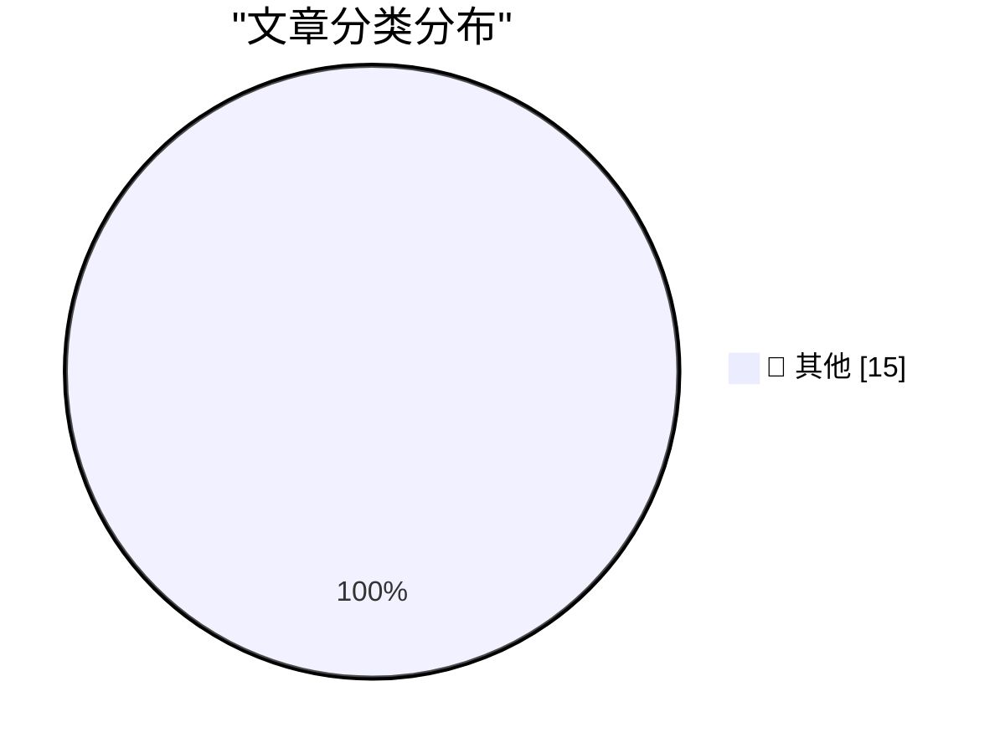

# 📰 AI 资讯每日精选 — 2026-09-08

> 汇聚 140+ 技术博客、X/Twitter、Hacker News、Reddit、Product Hunt、
> Lobste.rs、ClawFeed 日报及 GitHub Trending，经 AI 评分筛选。
>
> **本期内容**：🏆 今日必读 · 🌐 ClawFeed 日报 · 🔥 GitHub Trending · 📂 分类精选 · 🎨 设计与生成式 AI · 📊 数据概览

## 🏆 今日必读

🥇 **llm 0.35**

[llm 0.35](https://simonwillison.net/2026/Sep/7/llm/) — simonwillison.net · 1 小时前 · 📝 其他

> llm 0.35

🥈 **Creepy crawlies**

[Creepy crawlies](https://simonwillison.net/2026/Sep/7/creepy-crawlies/) — simonwillison.net · 2 小时前 · 📝 其他

> Creepy crawlies

🥉 **Quoting Jakub Pachocki**

[Quoting Jakub Pachocki](https://simonwillison.net/2026/Sep/7/jakub-pachocki/) — simonwillison.net · 2 小时前 · 📝 其他

> Quoting Jakub Pachocki

4️⃣ **Video compressor**

[Video compressor](https://simonwillison.net/2026/Sep/7/video-compressor/) — simonwillison.net · 6 小时前 · 📝 其他

> Video compressor

5️⃣ **Mercator ↔ Equal Earth**

[Mercator ↔ Equal Earth](https://simonwillison.net/2026/Sep/7/equal-earth/) — simonwillison.net · 8 小时前 · 📝 其他

> Mercator ↔ Equal Earth

---

## 🌐 ClawFeed 日报精选

> 来源：[ClawFeed](https://clawfeed.kevinhe.io) — AI 驱动的多源新闻聚合

📅 ClawFeed Daily | 2026-09-07（周日）

汇总：5 期 4h digest (#1153-#1157) | feed 187 / bookmarks 20 / errors 0

---

## 🔥 当日全场最重要 5 条

1. **NVIDIA 约 $129 亿收购 Hugging Face**——从硬件向开源软件基础设施延伸，承诺平台保持开放+多云。开源社区担忧集中化。年度最大 AI 并购之一。（#1154）

2. **OpenAI 内部数据：Coding Agent 倍增研究效率**——中位研究员每天消耗 >$600 AI 推理资源，每人 3.1 个"Agent 工作日"并行。Agent 从"辅助"变成"倍增器"，8 月已成日常。（#1157）

3. **Meta Muse Spark 1.3 Max 性能持平 Fable 5/GPT-5.6 Sol，价格低 4-8 倍**——Scale AI CEO 引用 Vals Index 数据。模型能力层价格战加速，"模型能力正在被补贴到零"。（#1156）

4. **Liquid Network 白帽事件——~4,000 BTC 一次性转出**——OP Return 留言"we are whitehats"。重大加密安全事件，后续待观察。（#1153）

5. **BTC spot ETF 本周净流入 ~$9.8 亿**——+12.69K BTC，4 绿 1 红，IBIT 独占 +8.9K BTC。持续的机构买盘信号。（#1153）

---

## 📰 当日核心主题

### 🤖 GPT-6 Astra 创意爆发（贯穿全天）
GPT-6 Astra 是当日最高频话题，横跨 4 期 digest：
- 自我分析动画肖像（#1153）
- 3D Roguelike 完整游戏关卡（#1153）
- 自动化产品 Demo 录制（#1154，LlamaIndex 创始人）
- Google Calendar 画 Michael Jackson（#1154）
- Codex 重构网站（#1156）
- 153 个 Astra 提示词合集（#1157，3D/游戏）
- 定制 LEGO 积木生成（#1157）

**判断**："3D 创作时代已然来临"不是 hype——Astra 在视觉/3D/自动化领域的能力跃迁是实质性的。

### 🔐 AI/Crypto 安全持续升温
- Liquid Network 白帽 4,000 BTC 事件（#1153）
- Twofold LP 资金抽取漏洞（#1153）
- SST/OpenRouter 遭大规模欺诈攻击（#1156）
- AI 安全书籍连续两本推荐（#1153 MLSecOps + #1154 AI-Native LLM Security + #1157 Agentic AI Cybersecurity）

### 💡 "AI 与人"的哲学反思
- "AI native 的内核是 Human native"（#1153，@lifesinger）
- "AI 无法取代的地方，真的很难找"（#1154，@rwayne）
- PG：创始人的力量来自经历过弱势（#1155）
- AI 助手跨平台整合日程——验证"AI 帮企业整理工作流"方向（#1155）

### 📊 MCP 路线持续被验证
- Blender MCP 效果优于 Computer Use（#1156）——MCP 作为 Agent 操控路线胜出
- Milvus + EverOS 集成——Agent 记忆基建新选项（#1157）

---

## 🔖 Bookmarks 精选
本日 bookmarks 从 19 增至 20（+1），新增 @mntruell 和 @heynavtoor 的 bookmark。热门延续见 #1145。

## 👀 推荐关注汇总
（本日无新推荐关注）

## 💤 当日重复噪音模式
- @KirkDBorne 每期推荐一本技术书（4/5 期），内容质量稳定但格式重复——建议对 Kirk 的书评做聚合而非逐条列出
- @RaminNasibov 多期出现空推文（图片推，无文字）
- SpaceX Starlink 部署（每期出现，已成常态新闻）

---

*基于 5 期 4h digest (#1153-#1157) | feed 总计 187 条 | 2026-09-07*
---

## 🔥 GitHub Trending

> 今日热门开源项目（全语言 + Python）

| # | 项目 | 描述 | ⭐ 总星 | 📈 今日 | 语言 |
|---|------|------|---------|---------|------|
| 1 | [affaan-m/ECC](https://github.com/affaan-m/ECC) 🤖 | The agent harness performance optimization system. Skills... | 252.9k | +1897 | JavaScript |
| 2 | [blader/humanizer](https://github.com/blader/humanizer) 🤖 | Agent skill that removes signs of AI-generated writing fr... | 45.0k | +903 | Python |
| 3 | [microsoft/markitdown](https://github.com/microsoft/markitdown) | Python tool for converting files and office documents to ... | 180.3k | +886 | Python |
| 4 | [NousResearch/hermes-agent](https://github.com/NousResearch/hermes-agent) 🤖 | The agent that grows with you | 243.1k | +638 | Python |
| 5 | [coreyhaines31/marketingskills](https://github.com/coreyhaines31/marketingskills) 🤖 | Marketing skills for Claude Code and AI agents. CRO, copy... | 48.1k | +580 | JavaScript |
| 6 | [The-Swarm-Corporation/AutoHedge](https://github.com/The-Swarm-Corporation/AutoHedge) 🤖 | Build your autonomous hedge fund in minutes. AutoHedge ha... | 5.3k | +517 | Python |
| 7 | [BraveOPotato/FckSignups](https://github.com/BraveOPotato/FckSignups) | A list of tools that are open-source, in-browser, and req... | 3.8k | +501 | TypeScript |
| 8 | [heygen-com/hyperframes](https://github.com/heygen-com/hyperframes) | Write HTML. Render video. Built for agents. | 46.0k | +474 | TypeScript |
| 9 | [ruvnet/ruflo](https://github.com/ruvnet/ruflo) 🤖 | 🌊 The original agent meta-harness. Deploy intelligent mu... | 71.4k | +394 | TypeScript |
| 10 | [openai/skills](https://github.com/openai/skills) 🤖 | Skills Catalog for Codex | 26.0k | +351 | Python |
| 11 | [vinta/awesome-python](https://github.com/vinta/awesome-python) | The definitive list that answers "I want to do X in Pytho... | 319.2k | +335 | Python |
| 12 | [browser-use/browser-use](https://github.com/browser-use/browser-use) 🤖 | 🌐 Make websites accessible for AI agents. Automate tasks... | 113.0k | +330 | Python |
| 13 | [k2-fsa/OmniVoice](https://github.com/k2-fsa/OmniVoice) | High-Quality Voice Cloning TTS for 600+ Languages | 10.5k | +329 | Python |
| 14 | [MoonTechLab/LunaTV](https://github.com/MoonTechLab/LunaTV) | 本项目采用 CC BY-NC-SA 协议，禁止任何商业化行为，任何衍生项目必须保留本项目地址并以相同协议开源 | 9.7k | +197 | TypeScript |
| 15 | [bytedance/deer-flow](https://github.com/bytedance/deer-flow) | An open-source long-horizon SuperAgent harness that resea... | 81.9k | +195 | Python |

---

## 📝 其他

### 1. llm 0.35

[llm 0.35](https://simonwillison.net/2026/Sep/7/llm/) — **simonwillison.net** · 1 小时前 · ⭐ 15/30

> llm 0.35

---

### 2. Creepy crawlies

[Creepy crawlies](https://simonwillison.net/2026/Sep/7/creepy-crawlies/) — **simonwillison.net** · 2 小时前 · ⭐ 15/30

> Creepy crawlies

---

### 3. Quoting Jakub Pachocki

[Quoting Jakub Pachocki](https://simonwillison.net/2026/Sep/7/jakub-pachocki/) — **simonwillison.net** · 2 小时前 · ⭐ 15/30

> Quoting Jakub Pachocki

---

### 4. Video compressor

[Video compressor](https://simonwillison.net/2026/Sep/7/video-compressor/) — **simonwillison.net** · 6 小时前 · ⭐ 15/30

> Video compressor

---

### 5. Mercator ↔ Equal Earth

[Mercator ↔ Equal Earth](https://simonwillison.net/2026/Sep/7/equal-earth/) — **simonwillison.net** · 8 小时前 · ⭐ 15/30

> Mercator ↔ Equal Earth

---

### 6. Automatically detecting AI text in my browser

[Automatically detecting AI text in my browser](https://seangoedecke.com/deckard/) — **seangoedecke.com** · 1 小时前 · ⭐ 15/30

> Automatically detecting AI text in my browser

---

### 7. [Sponsor] Glyphs 4

[[Sponsor] Glyphs 4](https://glyphsapp.com/) — **daringfireball.net** · 3 小时前 · ⭐ 15/30

> [Sponsor] Glyphs 4

---

### 8. Trackables 1.5

[Trackables 1.5](https://trackables.app/) — **daringfireball.net** · 3 小时前 · ⭐ 15/30

> Trackables 1.5

---

### 9. The Onion’s Exclusive Interview With Larry Ellison

[The Onion’s Exclusive Interview With Larry Ellison](https://theonion.com/the-onions-exclusive-interview-with-larry-ellison/) — **daringfireball.net** · 5 小时前 · ⭐ 15/30

> The Onion’s Exclusive Interview With Larry Ellison

---

### 10. McKinley 1.0

[McKinley 1.0](https://mckinleysymbols.com/) — **daringfireball.net** · 5 小时前 · ⭐ 15/30

> McKinley 1.0

---

### 11. Matt Birchler’s Folding iPhone Predictions

[Matt Birchler’s Folding iPhone Predictions](https://birchtree.me/blog/my-folding-iphone-predictions/) — **daringfireball.net** · 5 小时前 · ⭐ 15/30

> Matt Birchler’s Folding iPhone Predictions

---

### 12. ★ And It’s True That I Stole Your Lighter, and It’s Also True That I Lost the Map

[★ And It’s True That I Stole Your Lighter, and It’s Also True That I Lost the Map](https://daringfireball.net/2026/09/its_true_that_i_stole_your_lighter) — **daringfireball.net** · 8 小时前 · ⭐ 15/30

> ★ And It’s True That I Stole Your Lighter, and It’s Also True That I Lost the Map

---

### 13. I found an old interview mine (2017)

[I found an old interview mine (2017)](https://idiallo.com/byte-size/interviewing-with-thatsoftware-dude) — **idiallo.com** · 2 小时前 · ⭐ 15/30

> I found an old interview mine (2017)

---

### 14. Clickable whitespace

[Clickable whitespace](https://idiallo.com/blog/clickable-whitespace) — **idiallo.com** · 3 小时前 · ⭐ 15/30

> Clickable whitespace

---

### 15. Pluralistic: How corporate America built a better Roach Motel (07 Sep 2026)

[Pluralistic: How corporate America built a better Roach Motel (07 Sep 2026)](https://pluralistic.net/2026/09/06/hotels-california/) — **pluralistic.net** · 19 小时前 · ⭐ 15/30

> Pluralistic: How corporate America built a better Roach Motel (07 Sep 2026)

---

## 🎨 Design & Generative AI

### 🖼️ 生成式图片

- **[Unitree’s UnifoLM-X2-1.0 reads the opponent, predicts the next move and reacts instantly. For the first time a world model controls a fully autonomous humanoid fight in real time.](https://www.reddit.com/r/singularity/comments/1w9vdkb/unitrees_unifolmx210_reads_the_opponent_predicts/)** — r/singularity · 9 小时前
  > Unitree’s UnifoLM-X2-1.0 reads the opponent, predicts the next move and reacts instantly. For the first time a world model controls a fully autonomous humanoid fight in real time.

---

## 📊 数据概览

| 扫描源 | 抓取文章 | 时间范围 | 精选 |
|:---:|:---:|:---:|:---:|
| 93/140 | 3900 篇 → 82 篇 | 24h | **15 篇** |

### 分类分布

---

*生成于 2026-09-08 01:22 | 汇聚 140 个技术博客、X/Twitter、Hacker News、Reddit、Product Hunt、Lobste.rs、ClawFeed 日报及 GitHub Trending，经 AI 评分筛选出 Top 15 精华内容*
