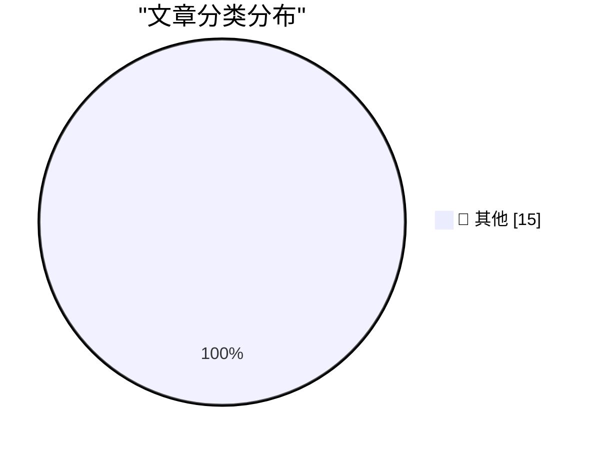

# 📰 AI 资讯每日精选 — 2026-09-09

> 汇聚 140+ 技术博客、X/Twitter、Hacker News、Reddit、Product Hunt、
> Lobste.rs、ClawFeed 日报及 GitHub Trending，经 AI 评分筛选。
>
> **本期内容**：🏆 今日必读 · 🌐 ClawFeed 日报 · 🔥 GitHub Trending · 📂 分类精选 · 🎨 设计与生成式 AI · 📊 数据概览

## 🏆 今日必读

🥇 **Quoting Terence Tao**

[Quoting Terence Tao](https://simonwillison.net/2026/Sep/9/terence-tao/) — simonwillison.net · 1 小时前 · 📝 其他

> Quoting Terence Tao

🥈 **On the Navier–Stokes Millennium Prize Problem**

[On the Navier–Stokes Millennium Prize Problem](https://simonwillison.net/2026/Sep/8/on-navier-stokes/) — simonwillison.net · 1 小时前 · 📝 其他

> On the Navier–Stokes Millennium Prize Problem

🥉 **Introducing ChatGPT Images 2.5**

[Introducing ChatGPT Images 2.5](https://simonwillison.net/2026/Sep/8/introducing-chatgpt-images-25/) — simonwillison.net · 2 小时前 · 📝 其他

> Introducing ChatGPT Images 2.5

4️⃣ **OpenNMC is an open replacement for expensive APC management cards**

[OpenNMC is an open replacement for expensive APC management cards](https://www.jeffgeerling.com/blog/2026/opennmc-apc-ups-replacement-card/) — jeffgeerling.com · 9 小时前 · 📝 其他

> OpenNMC is an open replacement for expensive APC management cards

5️⃣ **Microsoft Plugs Nearly 1,000 Security Holes**

[Microsoft Plugs Nearly 1,000 Security Holes](https://krebsonsecurity.com/2026/09/microsoft-plugs-nearly-1000-security-holes/) — krebsonsecurity.com · 3 小时前 · 📝 其他

> Microsoft Plugs Nearly 1,000 Security Holes

---

## 🌐 ClawFeed 日报精选

> 来源：[ClawFeed](https://clawfeed.kevinhe.io) — AI 驱动的多源新闻聚合

📅 ClawFeed Daily | 2026-09-08（周一）

汇总：5 期 4h digest (#1160-#1164) | feed 163 / bookmarks 20 / errors 0

---

## 🔥 当日全场最重要 5 条

1. **OpenAI 首席科学家 Pachocki 呼吁暂停扩展**——"没有任何 AI 实验室把 alignment 和 monitoring 做得足够好来全速扩展"，继早前 state of AI 长文后进一步明确立场。同日 Jakub 另一篇文章写道"we need to make choices to keep the future open"。AI 安全议题从学术圈升级到实验室核心管理层的公开表态。(#1164/#1161)

2. **Claude Code 系统提示词精简 80%**——Anthropic 官方分享最新模型下 system prompt / skills / CLAUDE.md 写法经验，"少即是多"。对我们自身 Agent 配置和 skill 设计直接相关——验证了 thinking-patterns 和 skill 精简的方向。(#1160/#1161)

3. **Cloudflare @cloudflare/computer**——给每个 AI Agent 配一台云端虚拟电脑（文件系统+多执行环境），Agent 自行决定命令派到哪个环境执行，毫秒级启动。Agent infra 层的新基建，标志着云厂商开始为 Agent 原生场景重建基础设施。(#1160/#1161)

4. **DeepSeek 大规模社招 150 HC**——Harness 团队技术骨干 Tianyi Cui 发文，"前所未有"的招聘规模，侧面印证 DeepSeek 在加速基建扩张。(#1162)

5. **3D Euler 方程发现稳定奇点**——anima-ai.org 宣布 "stable singularity on 3D Euler"，Euler 方程的 blow-up 问题是千禧年级别的开放问题之一，若成立将是数学/流体力学重大突破。(#1163)

---

## 📰 当日核心主题

**1. GPT-6 Astra 生态反应**
全天多条讨论围绕 Astra 展开：被称为"most AGI-like model"(#1161)；有人建议用它系统性学习商业/哲学而非只做开发(#1161)；Ram Ahluwalia 降温"not AGI yet"(#1164)；Fable 在 HR 场景表达优于 Astra(#1164)。市场对 Astra 的定位仍在摇摆。

**2. AI Agent 基础设施成熟化**
Cloudflare @cloudflare/computer(#1160)、Claude Code 系统提示词精简(#1160)、Matrix Agent 公司架构(#1161)、wanman.ai 开源一人公司框架(#1161)——Agent 从概念验证走向生产级基础设施的信号密集。

**3. AI 安全 + 实验室治理**
Pachocki 呼吁暂停扩展(#1164)、Jakub 长文论 AI 安全(#1161)、AI 实验室合作呼声(#1163)——安全议题正从边缘上升到行业核心议程。

**4. 对话式 vs GUI 界面之争**
"主要工作界面是 Telegram"的真实体感(#1162) vs "AI 释放了程序员，也说明了产品经理为什么存在"(#1164) vs Agentic commerce 先替代软件采购(#1162)——Agent 的交互范式尚未收敛。

**5. 中国互联网 + AI 动态**
野村证券研报：抖音月均使用时长首超微信(#1162)；百度 AI 云+昆仑芯片双引擎(#1162)；高德扫雷榜(#1163)；DeepSeek 150 HC(#1162)。

---

## 🔖 Bookmarks 精选（本日累计）

本日 bookmarks 20 条，全天无变化。精选：
- AI 市场渗透率 <1%（$6T+ knowledge worker 市场）
- AI Engineering 技能图谱
- 36 篇经典 AI 论文合集（谢青池精选）
- Claude Code 系统提示词精简 80% 经验
- Cloudflare @cloudflare/computer
- Matrix Agent 公司架构
- wanman.ai 开源一人公司框架
- GPT-Realtime-2 实时翻译

---

## 💤 当日重复噪音模式

- **Crypto 推广/Shill**：Binance earn、BNB Stonks Szn、token 回购数据、云挖矿指南——高频低信噪比，贯穿全天
- **政治争论**："far right" 定义辩论在多个时段反复出现（#1161/#1163/#1164），与 AI/tech 无关
- **Meme/低质内容**：gm tweets、rate my skills、forced marketplace blues 等零信息量内容

---

#daily-2026-09-08 · 5 期 4h (#1160-#1164) · feed 163 / bookmarks 20 / errors 0---

## 🔥 GitHub Trending

> 今日热门开源项目（全语言 + Python）

| # | 项目 | 描述 | ⭐ 总星 | 📈 今日 | 语言 |
|---|------|------|---------|---------|------|
| 1 | [heygen-com/hyperframes](https://github.com/heygen-com/hyperframes) | Write HTML. Render video. Built for agents. | 47.8k | +2627 | TypeScript |
| 2 | [microsoft/markitdown](https://github.com/microsoft/markitdown) | Python tool for converting files and office documents to ... | 181.7k | +2047 | Python |
| 3 | [affaan-m/ECC](https://github.com/affaan-m/ECC) 🤖 | The agent harness performance optimization system. Skills... | 254.3k | +1427 | JavaScript |
| 4 | [jo-inc/camofox-browser](https://github.com/jo-inc/camofox-browser) 🤖 | Stealth headless browser for AI agents — bypass Cloudflar... | 10.5k | +871 | JavaScript |
| 5 | [cathrynlavery/diagram-design](https://github.com/cathrynlavery/diagram-design) 🤖 | 38 editorial diagram types for Claude Code, Codex, and Pi... | 34.9k | +710 | HTML |
| 6 | [coreyhaines31/marketingskills](https://github.com/coreyhaines31/marketingskills) 🤖 | Marketing skills for Claude Code and AI agents. CRO, copy... | 48.8k | +666 | JavaScript |
| 7 | [ayghri/i-have-adhd](https://github.com/ayghri/i-have-adhd) 🤖 | A skill to stop your coding agent from burying the answer... | 30.6k | +656 | Python |
| 8 | [mksglu/context-mode](https://github.com/mksglu/context-mode) 🤖 | Context window optimization for AI coding agents. Sandbox... | 21.4k | +651 | TypeScript |
| 9 | [experientiallabs/experiential](https://github.com/experientiallabs/experiential) | Experiential is the open source, zero markup gateway for ... | 3.1k | +544 | Python |
| 10 | [TauricResearch/TradingAgents](https://github.com/TauricResearch/TradingAgents) 🤖 | TradingAgents: Multi-Agents LLM Financial Trading Framework | 103.4k | +506 | Python |
| 11 | [MoonTechLab/LunaTV](https://github.com/MoonTechLab/LunaTV) | 本项目采用 CC BY-NC-SA 协议，禁止任何商业化行为，任何衍生项目必须保留本项目地址并以相同协议开源 | 10.2k | +505 | TypeScript |
| 12 | [The-Swarm-Corporation/AutoHedge](https://github.com/The-Swarm-Corporation/AutoHedge) 🤖 | Build your autonomous hedge fund in minutes. AutoHedge ha... | 5.7k | +494 | Python |
| 13 | [openai/skills](https://github.com/openai/skills) 🤖 | Skills Catalog for Codex | 26.5k | +490 | Python |
| 14 | [obra/superpowers](https://github.com/obra/superpowers) | An agentic skills framework & software development method... | 283.4k | +452 | Shell |
| 15 | [rohitg00/ai-engineering-from-scratch](https://github.com/rohitg00/ai-engineering-from-scratch) 🤖 | Learn it. Build it. Ship it for others. | 53.2k | +356 | Python |

---

## 📝 其他

### 1. Quoting Terence Tao

[Quoting Terence Tao](https://simonwillison.net/2026/Sep/9/terence-tao/) — **simonwillison.net** · 1 小时前 · ⭐ 15/30

> Quoting Terence Tao

---

### 2. On the Navier–Stokes Millennium Prize Problem

[On the Navier–Stokes Millennium Prize Problem](https://simonwillison.net/2026/Sep/8/on-navier-stokes/) — **simonwillison.net** · 1 小时前 · ⭐ 15/30

> On the Navier–Stokes Millennium Prize Problem

---

### 3. Introducing ChatGPT Images 2.5

[Introducing ChatGPT Images 2.5](https://simonwillison.net/2026/Sep/8/introducing-chatgpt-images-25/) — **simonwillison.net** · 2 小时前 · ⭐ 15/30

> Introducing ChatGPT Images 2.5

---

### 4. OpenNMC is an open replacement for expensive APC management cards

[OpenNMC is an open replacement for expensive APC management cards](https://www.jeffgeerling.com/blog/2026/opennmc-apc-ups-replacement-card/) — **jeffgeerling.com** · 9 小时前 · ⭐ 15/30

> OpenNMC is an open replacement for expensive APC management cards

---

### 5. Microsoft Plugs Nearly 1,000 Security Holes

[Microsoft Plugs Nearly 1,000 Security Holes](https://krebsonsecurity.com/2026/09/microsoft-plugs-nearly-1000-security-holes/) — **krebsonsecurity.com** · 3 小时前 · ⭐ 15/30

> Microsoft Plugs Nearly 1,000 Security Holes

---

### 6. ★ The iPhone Air and iPhone 17 Pro

[★ The iPhone Air and iPhone 17 Pro](https://daringfireball.net/2026/09/the_iphone_air_and_iphone_17_pro) — **daringfireball.net** · 34 分钟前 · ⭐ 15/30

> ★ The iPhone Air and iPhone 17 Pro

---

### 7. ‘Modern Day Typographer’

[‘Modern Day Typographer’](https://www.youtube.com/watch?v=0Ck-NPqf2c8) — **daringfireball.net** · 2 小时前 · ⭐ 15/30

> ‘Modern Day Typographer’

---

### 8. ★ SuperDuper 4

[★ SuperDuper 4](https://daringfireball.net/2026/09/superduper_4) — **daringfireball.net** · 10 小时前 · ⭐ 15/30

> ★ SuperDuper 4

---

### 9. A sample use of the winstart.bat file in Windows 95

[A sample use of the winstart.bat file in Windows 95](https://devblogs.microsoft.com/oldnewthing/20260908-00/?p=112679) — **devblogs.microsoft.com/oldnewthing** · 11 小时前 · ⭐ 15/30

> A sample use of the winstart.bat file in Windows 95

---

### 10. Navier-Stokes in the news

[Navier-Stokes in the news](https://www.johndcook.com/blog/2026/09/08/navier-stokes-in-the-news/) — **johndcook.com** · 10 小时前 · ⭐ 15/30

> Navier-Stokes in the news

---

### 11. What’s new in git-pkgs

[What’s new in git-pkgs](https://nesbitt.io/2026/09/08/whats-new-in-git-pkgs.html) — **nesbitt.io** · 16 小时前 · ⭐ 15/30

> What’s new in git-pkgs

---

### 12. Pretraining progress is mostly coming from data

[Pretraining progress is mostly coming from data](https://www.dwarkesh.com/p/pretraining-progress-is-mostly-data) — **dwarkesh.com** · 9 小时前 · ⭐ 15/30

> Pretraining progress is mostly coming from data

---

### 13. Concentration Risk

[Concentration Risk](https://www.wheresyoured.at/concentration-risk/) — **wheresyoured.at** · 11 小时前 · ⭐ 15/30

> Concentration Risk

---

### 14. The Bulldozing of an Interface

[The Bulldozing of an Interface](https://blog.jim-nielsen.com/2026/bulldoze-ui/) — **blog.jim-nielsen.com** · 6 小时前 · ⭐ 15/30

> The Bulldozing of an Interface

---

### 15. What happened to Compuserve?

[What happened to Compuserve?](https://dfarq.homeip.net/what-happened-to-compuserve/?utm_source=rss&#038;utm_medium=rss&#038;utm_campaign=what-happened-to-compuserve) — **dfarq.homeip.net** · 14 小时前 · ⭐ 15/30

> What happened to Compuserve?

---

## 🎨 Design & Generative AI

### 🖼️ 生成式图片

- **[ComfyUI REF Fast VSA for MiniMax H3](https://www.reddit.com/r/StableDiffusion/comments/1wangfm/comfyui_ref_fast_vsa_for_minimax_h3/)** — r/StableDiffusion · 12 小时前
  > ComfyUI REF Fast VSA for MiniMax H3

- **[H3 6-step Turbo Lora Merge](https://www.reddit.com/r/StableDiffusion/comments/1waqfv8/h3_6step_turbo_lora_merge/)** — r/StableDiffusion · 10 小时前
  > H3 6-step Turbo Lora Merge

- **[Fallout 2 x Fallout: Bakersfield x H3 as Interactive \ Reactive World Model, Let's go!](https://www.reddit.com/r/StableDiffusion/comments/1walnzy/fallout_2_x_fallout_bakersfield_x_h3_as/)** — r/StableDiffusion · 14 小时前
  > Fallout 2 x Fallout: Bakersfield x H3 as Interactive \ Reactive World Model, Let's go!

- **[DLSS 5 Showcase in ComfyUI](https://www.reddit.com/r/StableDiffusion/comments/1wb5n57/dlss_5_showcase_in_comfyui/)** — r/StableDiffusion · 1 小时前
  > DLSS 5 Showcase in ComfyUI

- **[Paul Kidby/Discworld Style LoRA for Krea 2 CivitAI and HF links in description](https://www.reddit.com/r/StableDiffusion/comments/1waxe5f/paul_kidbydiscworld_style_lora_for_krea_2_civitai/)** — r/StableDiffusion · 6 小时前
  > Paul Kidby/Discworld Style LoRA for Krea 2 CivitAI and HF links in description

---

## 📊 数据概览

| 扫描源 | 抓取文章 | 时间范围 | 精选 |
|:---:|:---:|:---:|:---:|
| 92/140 | 3881 篇 → 91 篇 | 24h | **15 篇** |

### 分类分布

---

*生成于 2026-09-09 01:30 | 汇聚 140 个技术博客、X/Twitter、Hacker News、Reddit、Product Hunt、Lobste.rs、ClawFeed 日报及 GitHub Trending，经 AI 评分筛选出 Top 15 精华内容*
