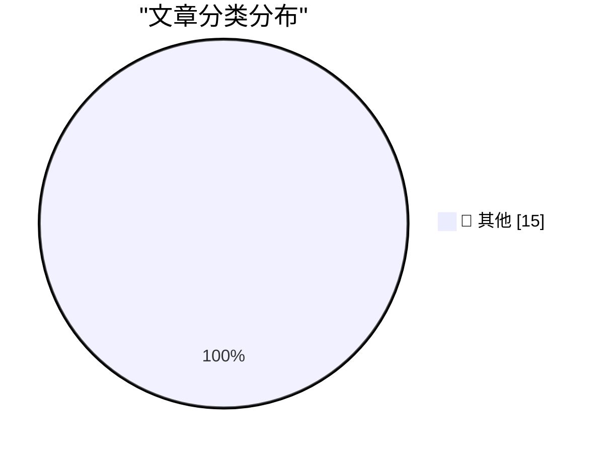

# 📰 AI 资讯每日精选 — 2026-09-10

> 汇聚 140+ 技术博客、X/Twitter、Hacker News、Reddit、Product Hunt、
> Lobste.rs、ClawFeed 日报及 GitHub Trending，经 AI 评分筛选。
>
> **本期内容**：🏆 今日必读 · 🌐 ClawFeed 日报 · 🔥 GitHub Trending · 📂 分类精选 · 🎨 设计与生成式 AI · 📊 数据概览

## 🏆 今日必读

🥇 **Quoting Calif Research**

[Quoting Calif Research](https://simonwillison.net/2026/Sep/10/calif-research/) — simonwillison.net · 29 分钟前 · 📝 其他

> Quoting Calif Research

🥈 **.blend URL Viewer**

[.blend URL Viewer](https://simonwillison.net/2026/Sep/9/blender-viewer/) — simonwillison.net · 1 小时前 · 📝 其他

> .blend URL Viewer

🥉 **We own the Glass**

[We own the Glass](https://idiallo.com/byte-size/) — idiallo.com · 4 小时前 · 📝 其他

> We own the Glass

4️⃣ **Pluralistic: Anti-vax/anti-trust (09 Sep 2026)**

[Pluralistic: Anti-vax/anti-trust (09 Sep 2026)](https://pluralistic.net/2026/09/09/when-it-dont-rain/) — pluralistic.net · 14 小时前 · 📝 其他

> Pluralistic: Anti-vax/anti-trust (09 Sep 2026)

5️⃣ **A 50-year-old computer-assisted proof**

[A 50-year-old computer-assisted proof](https://www.johndcook.com/blog/2026/09/09/four-colors/) — johndcook.com · 10 小时前 · 📝 其他

> A 50-year-old computer-assisted proof

---

## 🌐 ClawFeed 日报精选

> 来源：[ClawFeed](https://clawfeed.kevinhe.io) — AI 驱动的多源新闻聚合

📅 ClawFeed Daily | 2026-09-09（周二）

汇总：5 期 4h digest (#1167-#1171) | feed 154 / bookmarks 20 / errors 0

---

## 🔥 当日全场最重要 5 条

1. **Anthropic 研究员 Jacob Coxon 辞职事件全天发酵**——从早间第三方引述，到本人发布亲述长文"I resigned from Anthropic today. Neither company is acting responsibly"，再到 CoinDesk/Cointelegraph 跟进报道。继昨日 Pachocki 呼吁暂停后，AI 安全争议从内部呼吁升级为公开离职抗议，行业影响持续扩大。(#1169/#1170/#1171)

2. **Navier-Stokes 千禧年难题解法公开**——anima-ai 分享解法，随后 OpenAI 官宣"a group of AI agents using a next-generation model has produced a solution"，Lean 形式化验证已公开。AI 辅助数学证明从辅助工具升级为核心突破手段。(#1168/#1169)

3. **Cognition 融资 $2B+，估值 $48B**——Devin 背后的公司完成巨额融资，Scott Wu 将在直播中讨论。AI Agent 公司估值再创新高。(#1167)

4. **Meta 发布 Muse 个人 AI Agent 应用**——"gets things done across every part of life"，并已与 Link 支付集成实现任意网站购物。Meta 从社交平台正式向 Agent 产品迈步。(#1167/#1169)

5. **Andrew Ng 发布 AI Engineering 技能地图 + Karpathy 2 小时免费课**——Ng 系统梳理 AI 工程技能分布；Karpathy 将 8 年 OpenAI+Tesla 经验压缩成免费课，覆盖 Prompts→Harness→Loops→Graphs→Self-Improving Systems 全链路。行业教育基础设施集中释放。(#1171)

---

## 📰 当日核心主题

**1. AI 安全 + 实验室治理（全天主线）**
Coxon 辞职事件贯穿 3 个时段（#1169→#1170→#1171），从个人声明到行业新闻。@CharliehuAI 引出"AI 未来是混合模式"论点：开源与闭源共存，安全需行业协作而非单一实验室竞赛。承接昨日 Pachocki 呼吁，安全议题正从边缘升级为行业核心议程。

**2. AI Agent 产品化加速**
Cognition $48B 估值(#1167)、Meta Muse 发布+支付集成(#1167/#1169)、Manus 月访问量超 Genspark 两倍(#1167)、一人团队通过 Agent 效率提升 100x(#1167)——Agent 从技术 demo 进入商业化竞赛。

**3. Agent Harness 工程化**
Claude Code Skills 节省 3x tokens 实测(#1170)、Agent 评测框架实战"82%→89% 你敢发布吗?"(#1170)、"Harnesses 不只是脚手架"(#1167)、Anthropic 移除 80% system prompt 经验(#1171)——Harness 从配置项升级为核心工程能力。

**4. AI 辅助科学突破**
Navier-Stokes 解法(#1168/#1169)、AI 制药发现关键蛋白 TNIK(#1167)——AI 在基础科学和生物医药的突破从零星报道变为密集信号。

**5. Crypto + 稳定币落地**
TRX ETF 登陆 Cboe(#1168)、U.S. Bank USBDC 稳定币跨境支付测试(#1171)、MoneyGram 在 Solana 上的稳定币实践(#1169)、以太坊基金会设定 2029 量子抗性 deadline(#1171)——传统金融机构加速拥抱 crypto 基础设施。

---

## 🔖 Bookmarks 精选（本日累计）

本日 bookmarks 20 条，最后一期(#1171)有实质更新。精选：
- 36 篇经典 AI 论文合集（谢青池精选）
- AI 市场渗透率 <1%（$6T+ knowledge worker 市场）
- Cloudflare @cloudflare/computer：Agent 专用云端虚拟电脑
- Anthropic 移除 80% Claude Code system prompt 经验
- Matrix Agent 公司架构详解
- wanman.ai 一人公司开源框架（新增 db9 搜索 + Codex 调用）
- GPT-Realtime-2 实时音频翻译
- Andrew Ng AI Engineering 技能地图

---

## 👀 推荐关注汇总

- @trq212 - Anthropic 工程团队成员，Claude Code 内部 prompt 工程一手信息源
- @BruceGuai - Agent 架构深度输出者，Matrix 项目展示 harness 设计前沿

提醒：上述未通过浏览器逐一核实是否已关注，Kevin 操作前请先搜一下避免重复。

---

## 💤 当日重复噪音模式

- **Meme 币推广/交易分析**：$LAPTOP token 发行、$SPCX 交易分析等贯穿全天
- **低质内容/Meme**：薄肌/黄毛段子贴、follow-for-follow 列表帖、predict.fun 活动推广
- **政治/军事新闻溢出**：伊朗-美国军事冲突报道多次出现，与 AI/tech 主线无关

---

#daily-2026-09-09 · 5 期 4h (#1167-#1171) · feed 154 / bookmarks 20 / errors 0---

## 🔥 GitHub Trending

> 今日热门开源项目（全语言 + Python）

| # | 项目 | 描述 | ⭐ 总星 | 📈 今日 | 语言 |
|---|------|------|---------|---------|------|
| 1 | [ayghri/i-have-adhd](https://github.com/ayghri/i-have-adhd) 🤖 | A skill to stop your coding agent from burying the answer... | 34.7k | +4650 | Python |
| 2 | [cathrynlavery/diagram-design](https://github.com/cathrynlavery/diagram-design) 🤖 | 38 editorial diagram types for Claude Code, Codex, and Pi... | 36.6k | +2249 | HTML |
| 3 | [liquidslr/system-design-notes](https://github.com/liquidslr/system-design-notes) | Notes of the book System Desgin Interview - An Insider's ... | 18.0k | +1397 | - |
| 4 | [affaan-m/ECC](https://github.com/affaan-m/ECC) 🤖 | The agent harness performance optimization system. Skills... | 255.2k | +1133 | JavaScript |
| 5 | [freestylefly/awesome-gpt-image-2](https://github.com/freestylefly/awesome-gpt-image-2) 🤖 | Prompt as Code | GPT-Image2 工业级提示词引擎与模板库，530+ 个案例逆向工程，20+... | 30.1k | +705 | JavaScript |
| 6 | [browser-use/browser-use](https://github.com/browser-use/browser-use) | Agents that use the browser. | 114.0k | +705 | Python |
| 7 | [obra/superpowers](https://github.com/obra/superpowers) | An agentic skills framework & software development method... | 284.0k | +688 | Shell |
| 8 | [experientiallabs/experiential](https://github.com/experientiallabs/experiential) | Experiential is the open source, zero markup gateway for ... | 3.8k | +686 | Python |
| 9 | [public-apis/public-apis](https://github.com/public-apis/public-apis) | A collective list of free APIs | 478.1k | +580 | Python |
| 10 | [Tencent/teamai-cli](https://github.com/Tencent/teamai-cli) 🤖 | Make Every Team AI Native | 3.0k | +556 | TypeScript |
| 11 | [openai/plugins](https://github.com/openai/plugins) 🤖 | OpenAI Plugins | 6.2k | +498 | JavaScript |
| 12 | [vastsa/PI-Desktop](https://github.com/vastsa/PI-Desktop) 🤖 | Local-first AI coding agent desktop: Electron + Rust host... | 1.7k | +417 | TypeScript |
| 13 | [openai/skills](https://github.com/openai/skills) 🤖 | Skills Catalog for Codex | 26.8k | +381 | Python |
| 14 | [The-Swarm-Corporation/AutoHedge](https://github.com/The-Swarm-Corporation/AutoHedge) 🤖 | Build your autonomous hedge fund in minutes. AutoHedge ha... | 6.0k | +375 | Python |
| 15 | [TauricResearch/TradingAgents](https://github.com/TauricResearch/TradingAgents) 🤖 | TradingAgents: Multi-Agents LLM Financial Trading Framework | 104.0k | +367 | Python |

---

## 📝 其他

### 1. Quoting Calif Research

[Quoting Calif Research](https://simonwillison.net/2026/Sep/10/calif-research/) — **simonwillison.net** · 29 分钟前 · ⭐ 15/30

> Quoting Calif Research

---

### 2. .blend URL Viewer

[.blend URL Viewer](https://simonwillison.net/2026/Sep/9/blender-viewer/) — **simonwillison.net** · 1 小时前 · ⭐ 15/30

> .blend URL Viewer

---

### 3. We own the Glass

[We own the Glass](https://idiallo.com/byte-size/) — **idiallo.com** · 4 小时前 · ⭐ 15/30

> We own the Glass

---

### 4. Pluralistic: Anti-vax/anti-trust (09 Sep 2026)

[Pluralistic: Anti-vax/anti-trust (09 Sep 2026)](https://pluralistic.net/2026/09/09/when-it-dont-rain/) — **pluralistic.net** · 14 小时前 · ⭐ 15/30

> Pluralistic: Anti-vax/anti-trust (09 Sep 2026)

---

### 5. A 50-year-old computer-assisted proof

[A 50-year-old computer-assisted proof](https://www.johndcook.com/blog/2026/09/09/four-colors/) — **johndcook.com** · 10 小时前 · ⭐ 15/30

> A 50-year-old computer-assisted proof

---

### 6. AI is an intelligence multiplier

[AI is an intelligence multiplier](https://www.johndcook.com/blog/2026/09/09/ai-multiplier/) — **johndcook.com** · 11 小时前 · ⭐ 15/30

> AI is an intelligence multiplier

---

### 7. The part of Navier-Stokes no one is talking about

[The part of Navier-Stokes no one is talking about](https://www.johndcook.com/blog/2026/09/09/formal-method-revolution/) — **johndcook.com** · 12 小时前 · ⭐ 15/30

> The part of Navier-Stokes no one is talking about

---

### 8. Don’t Let Anyone Take Away Your Big Box of Cables

[Don’t Let Anyone Take Away Your Big Box of Cables](https://blog.jim-nielsen.com/2026/hands-off-my-cables/) — **blog.jim-nielsen.com** · 6 小时前 · ⭐ 15/30

> Don’t Let Anyone Take Away Your Big Box of Cables

---

### 9. The first VHS VCR: JVC HR-3300

[The first VHS VCR: JVC HR-3300](https://dfarq.homeip.net/the-first-vhs-vcr-jvc-hr-3300/?utm_source=rss&#038;utm_medium=rss&#038;utm_campaign=the-first-vhs-vcr-jvc-hr-3300) — **dfarq.homeip.net** · 14 小时前 · ⭐ 15/30

> The first VHS VCR: JVC HR-3300

---

### 10. IBM releases SOTA Granite Time Series PatchTST-FM-r2 model with commercial-friendly license

[IBM releases SOTA Granite Time Series PatchTST-FM-r2 model with commercial-friendly license](https://huggingface.co/blog/ibm-research/ibm-releases-sota-granite-time-series) — **Hugging Face Blog** · 9 小时前 · ⭐ 15/30

> IBM releases SOTA Granite Time Series PatchTST-FM-r2 model with commercial-friendly license

---

### 11. Anthropic built an economic model that frames its CEO's bleakest job forecasts as an outlier scenario

[Anthropic built an economic model that frames its CEO's bleakest job forecasts as an outlier scenario](https://the-decoder.com/anthropic-built-an-economic-model-that-frames-its-ceos-bleakest-job-forecasts-as-an-outlier-scenario/) — **The Decoder** · 5 小时前 · ⭐ 15/30

> Anthropic built an economic model that frames its CEO's bleakest job forecasts as an outlier scenario

---

### 12. Suno launches v6 music models built with Warner, BMG, and Believe

[Suno launches v6 music models built with Warner, BMG, and Believe](https://the-decoder.com/suno-launches-v6-music-models-built-with-warner-bmg-and-believe/) — **The Decoder** · 11 小时前 · ⭐ 15/30

> Suno launches v6 music models built with Warner, BMG, and Believe

---

### 13. Deepmind's AlphaGenome Atlas maps every possible DNA change in the human genome

[Deepmind's AlphaGenome Atlas maps every possible DNA change in the human genome](https://the-decoder.com/deepminds-alphagenome-atlas-maps-every-possible-dna-change-in-the-human-genome/) — **The Decoder** · 11 小时前 · ⭐ 15/30

> Deepmind's AlphaGenome Atlas maps every possible DNA change in the human genome

---

### 14. Anthropic scientist puts the odds of AI destroying humanity above ten percent this decade

[Anthropic scientist puts the odds of AI destroying humanity above ten percent this decade](https://the-decoder.com/anthropic-scientist-puts-the-odds-of-ai-destroying-humanity-above-ten-percent-this-decade/) — **The Decoder** · 12 小时前 · ⭐ 15/30

> Anthropic scientist puts the odds of AI destroying humanity above ten percent this decade

---

### 15. AWS is using Qualcomm for AI inference while Qualcomm uses AWS Bedrock to design the chips

[AWS is using Qualcomm for AI inference while Qualcomm uses AWS Bedrock to design the chips](https://the-decoder.com/aws-is-using-qualcomm-for-ai-inference-while-qualcomm-uses-aws-bedrock-to-design-the-chips/) — **The Decoder** · 12 小时前 · ⭐ 15/30

> AWS is using Qualcomm for AI inference while Qualcomm uses AWS Bedrock to design the chips

---

## 📊 数据概览

| 扫描源 | 抓取文章 | 时间范围 | 精选 |
|:---:|:---:|:---:|:---:|
| 90/140 | 3475 篇 → 65 篇 | 24h | **15 篇** |

### 分类分布

---

*生成于 2026-09-10 01:26 | 汇聚 140 个技术博客、X/Twitter、Hacker News、Reddit、Product Hunt、Lobste.rs、ClawFeed 日报及 GitHub Trending，经 AI 评分筛选出 Top 15 精华内容*
