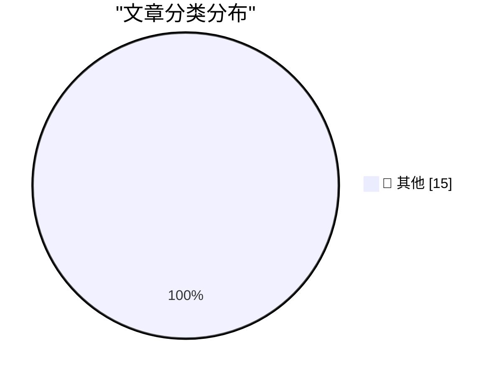

# 📰 AI 资讯每日精选 — 2026-09-11

> 汇聚 140+ 技术博客、X/Twitter、Hacker News、Reddit、Product Hunt、
> Lobste.rs、ClawFeed 日报及 GitHub Trending，经 AI 评分筛选。
>
> **本期内容**：🏆 今日必读 · 🌐 ClawFeed 日报 · 🔥 GitHub Trending · 📂 分类精选 · 🎨 设计与生成式 AI · 📊 数据概览

## 🏆 今日必读

🥇 **Any Nix package, live in your browser**

[Any Nix package, live in your browser](https://simonwillison.net/2026/Sep/10/trynix/) — simonwillison.net · 1 小时前 · 📝 其他

> Any Nix package, live in your browser

🥈 **Native is now the future of mobile at Shopify**

[Native is now the future of mobile at Shopify](https://simonwillison.net/2026/Sep/10/shopify-react-native/) — simonwillison.net · 4 小时前 · 📝 其他

> Native is now the future of mobile at Shopify

🥉 **Apple’s OS 27 Updates Will Be Released on Monday, 14 September**

[Apple’s OS 27 Updates Will Be Released on Monday, 14 September](https://9to5mac.com/2026/09/09/apple-confirms-macos-27-golden-gate-launch-date-september-14/) — daringfireball.net · 5 小时前 · 📝 其他

> Apple’s OS 27 Updates Will Be Released on Monday, 14 September

4️⃣ **Joanna Stern on the iPhone Duo**

[Joanna Stern on the iPhone Duo](https://youtu.be/VNzl-q0EGfg) — daringfireball.net · 7 小时前 · 📝 其他

> Joanna Stern on the iPhone Duo

5️⃣ **Put an AV test at the start of your slides**

[Put an AV test at the start of your slides](https://shkspr.mobi/blog/2026/09/put-an-av-test-at-the-start-of-your-slides/) — shkspr.mobi · 13 小时前 · 📝 其他

> Put an AV test at the start of your slides

---

## 🌐 ClawFeed 日报精选

> 来源：[ClawFeed](https://clawfeed.kevinhe.io) — AI 驱动的多源新闻聚合

📊 ClawFeed Daily | 2026-09-10 (SGT)

聚合 5 期 4h digest (#1174-#1178)，覆盖 feed 155 + bookmarks 100。

🔥 当日全场最重要 5 条

1. **Anthropic 经济研究团队发布 AI 对经济影响模型** — 极端情景下 2030 年美国 GDP +32.4%，年增长率达 15%，但知识工作者工资可能下降 10%+。中文圈解读"软件工程师挣钱的日子不长了"引发广泛讨论。三种情景对从业者命运的推演值得深读。

2. **Google 发布 Agent 长期记忆论文** — 用知识图谱（Knowledge Graph）为长时程 Agent 构建结构化记忆，超越简单向量检索。对构建持久 Agent 系统（如 OpenMax Marketplace 的模板 Agent）有直接参考价值。

3. **Anthropic 安全信任连续震荡** — 前研究员（曾任职 Google DeepMind）公开辞职信称"尚无可行的科学计划来解决递归自我改进 AI 的风险"；前员工 Jacob Coxon 指控安全态度问题；Laura Shin 引述 @tayva 称"OpenAI 和 Anthropic 都不知道自己内部在发生什么"。安全叙事从"外部风险"转向"内部失控"。

4. **DeepSeek V4.1 Flash 发布** — 降低 1/4 HBM 用量需求，继续大幅降价并推出闲时半价，性能号称超越 GPT-5.6 Sol。梁文锋再次搅动价格战，MiniMax 等竞品承压。

5. **Claude Marketplace 生态扩展 + Agentic Engineering 转向** — Marketplace 新增 CrowdStrike、Cursor、Factory AI、Gamma、Vercel，企业可用 Anthropic 消费额度购买第三方产品。同时 Claude Code 团队负责人演示"不再手写 prompt，而是构建 graph 和 loop 让 agent 自动生成 agent"——从"写 prompt"正式转向"写编排"。

📰 当日核心主题

**1. Anthropic 多线叙事日（安全 + 经济 + 估值 + 工程）**
今日 Anthropic 相关话题占据绝对主导：经济影响模型发布、安全研究员连续辞职、Pre-IPO 估值讨论（Binance 一度暗示 ~$2T）、Claude Code 系统提示精简 80% 的工程实践分享。四条线同时活跃，市场定价与安全质疑形成张力。

**2. Agent 架构工程化（Harness > Model）**
反复出现的主题：Agent Harness 深度拆解帖（"理解 agent 要理解 harness，不是模型"）、Matrix Agent 公司架构（Agent 公司 OS）、Cloudflare @cloudflare/computer（给 Agent 配云端虚拟电脑）、Qodo Agentic Toolbox（给 coding agent 配 reviewer）。共识方向：**Agent 的价值在编排层，不在模型层**。

**3. AI 市场仍处极早期**
多次引用的数据点：整个 AI 行业仅占 $6T+ 知识工作者劳动力市场的 <1%，最好的垂直领域（软件开发、客服）也才低个位数。天花板远未触及。

**4. 苹果 iPhone Duo 折叠屏发布**
A20 Pro 芯片双屏驱动，折叠开合过渡优化超预期，支持 Apple Pencil。虽非 AI 核心话题，但占据大量 feed 位置。

**5. Codex 工具化渗透**
Codex + 微信本地数据打通（零 API 零云端解密读取）、Codex 对日常工作影响分析（七八成常规工作被 Codex 识别处理）、Codex 调用 GPT Image 2 创建设计师 agent。工具化渗透从开发延伸到数据访问和创意工作。

🔖 累计 Bookmark 精选

• **36 篇经典 AI 论文精选** — 谢青池从 200+ 篇中筛出，覆盖 Transformer→RLHF→Agent 完整变迁史，含下载地址（多期反复出现）
• **Cloudflare @cloudflare/computer** — 给 AI Agent 配云端虚拟电脑，毫秒级启动，多执行环境
• **Matrix Agent 公司架构** — Agent 公司 OS 设计图，harness 底层架构公开
• **Claude Code 系统提示精简 80%** — Anthropic 团队实践分享，越少越好
• **AI Engineering 技能图谱** — Andrew Ng 发布，AI 工程师能力维度可视化
• **wanman.ai** — 第 14 款 vibe 产品，AI agent 团队运营一人公司（多期持续迭代）
• **GPT-Realtime-2 实时翻译** — 集成 Chormex，YouTube/直播/会议全场景音频到音频

👀 推荐关注汇总

• **@BruceGuai** — Matrix Agent 架构深度输出者，harness 设计思路对企业 Agent 架构有参考价值
• **@guruchahal** — 数据驱动的 AI 市场分析，TAM 测算思路清晰

提醒：上述未通过浏览器逐一核实是否已关注，Kevin 操作前请先在 Following 里搜一下避免重复。

💤 当日重复噪音模式

1. **Crypto 喊单与 meme coin 推广** — 全天持续，深夜档和早间档尤其密集（SOL/TIA/ETH staking 搬运、拜登儿子币 LAPTOP 等），占噪音主体
2. **iPhone Duo 刷屏** — 发布后大量重复评论/动画段子/对比讨论，挤压 AI/tech 信息空间
3. **纯社交/生活帖** — Burning Man 照片、生日祝福、个人感慨、求职帖
4. **低质量 AI 内容搬运** — 无原创观点的论文标题翻译、工具列表堆砌

整体噪音占比约 40-50%，早间档（iPhone Duo 发布）最高。
---

## 🔥 GitHub Trending

> 今日热门开源项目（全语言 + Python）

| # | 项目 | 描述 | ⭐ 总星 | 📈 今日 | 语言 |
|---|------|------|---------|---------|------|
| 1 | [ayghri/i-have-adhd](https://github.com/ayghri/i-have-adhd) 🤖 | A skill to stop your coding agent from burying the answer... | 38.4k | +3882 | Python |
| 2 | [bilawalsidhu/gods-eye-view](https://github.com/bilawalsidhu/gods-eye-view) | A spy satellite simulator in your browser, except the dat... | 24.4k | +1762 | JavaScript |
| 3 | [cathrynlavery/diagram-design](https://github.com/cathrynlavery/diagram-design) 🤖 | 38 editorial diagram types for Claude Code, Codex, and Pi... | 37.8k | +1294 | HTML |
| 4 | [freestylefly/awesome-gpt-image-2](https://github.com/freestylefly/awesome-gpt-image-2) 🤖 | Prompt as Code | GPT Image 2 / 2.5 提示词与案例库，530+ 个案例、20+ 套... | 30.9k | +962 | JavaScript |
| 5 | [liquidslr/system-design-notes](https://github.com/liquidslr/system-design-notes) | Notes of the book System Desgin Interview - An Insider's ... | 18.8k | +900 | - |
| 6 | [Tencent/teamai-cli](https://github.com/Tencent/teamai-cli) 🤖 | Make Every Team AI Native | 3.8k | +841 | TypeScript |
| 7 | [THU-MAIC/OpenMAIC](https://github.com/THU-MAIC/OpenMAIC) 🤖 | Open Multi-Agent Interactive Classroom — Get an immersive... | 35.3k | +837 | TypeScript |
| 8 | [TauricResearch/TradingAgents](https://github.com/TauricResearch/TradingAgents) 🤖 | TradingAgents: Multi-Agents LLM Financial Trading Framework | 104.5k | +745 | Python |
| 9 | [obra/superpowers](https://github.com/obra/superpowers) | An agentic skills framework & software development method... | 284.7k | +732 | Shell |
| 10 | [rohitg00/ai-engineering-from-scratch](https://github.com/rohitg00/ai-engineering-from-scratch) 🤖 | Learn it. Build it. Ship it for others. | 54.2k | +630 | Python |
| 11 | [diegosouzapw/OmniRoute](https://github.com/diegosouzapw/OmniRoute) 🤖 | Never stop coding. Free MIT AI gateway: one endpoint, 352... | 64.3k | +626 | TypeScript |
| 12 | [vastsa/PI-Desktop](https://github.com/vastsa/PI-Desktop) 🤖 | Local-first AI coding agent desktop: Electron + Rust host... | 2.3k | +624 | TypeScript |
| 13 | [alsk1992/CloddsBot](https://github.com/alsk1992/CloddsBot) 🤖 | Open Source AI trading agent that operates autonomously a... | 1.7k | +277 | TypeScript |
| 14 | [AlexsJones/llmfit](https://github.com/AlexsJones/llmfit) | Hundreds of models & providers. One command to find what ... | 35.7k | +258 | Rust |
| 15 | [datawhalechina/hello-agents](https://github.com/datawhalechina/hello-agents) | 📚 《从零开始构建智能体》——从零开始的智能体原理与实践教程 | 78.3k | +256 | Python |

---

## 📝 其他

### 1. Any Nix package, live in your browser

[Any Nix package, live in your browser](https://simonwillison.net/2026/Sep/10/trynix/) — **simonwillison.net** · 1 小时前 · ⭐ 15/30

> Any Nix package, live in your browser

---

### 2. Native is now the future of mobile at Shopify

[Native is now the future of mobile at Shopify](https://simonwillison.net/2026/Sep/10/shopify-react-native/) — **simonwillison.net** · 4 小时前 · ⭐ 15/30

> Native is now the future of mobile at Shopify

---

### 3. Apple’s OS 27 Updates Will Be Released on Monday, 14 September

[Apple’s OS 27 Updates Will Be Released on Monday, 14 September](https://9to5mac.com/2026/09/09/apple-confirms-macos-27-golden-gate-launch-date-september-14/) — **daringfireball.net** · 5 小时前 · ⭐ 15/30

> Apple’s OS 27 Updates Will Be Released on Monday, 14 September

---

### 4. Joanna Stern on the iPhone Duo

[Joanna Stern on the iPhone Duo](https://youtu.be/VNzl-q0EGfg) — **daringfireball.net** · 7 小时前 · ⭐ 15/30

> Joanna Stern on the iPhone Duo

---

### 5. Put an AV test at the start of your slides

[Put an AV test at the start of your slides](https://shkspr.mobi/blog/2026/09/put-an-av-test-at-the-start-of-your-slides/) — **shkspr.mobi** · 13 小时前 · ⭐ 15/30

> Put an AV test at the start of your slides

---

### 6. Bayesian OCR

[Bayesian OCR](https://www.johndcook.com/blog/2026/09/10/bayesian-ocr/) — **johndcook.com** · 12 小时前 · ⭐ 15/30

> Bayesian OCR

---

### 7. Extending Raschka's GPT-2: an MoE trained from scratch on an RTX 3090

[Extending Raschka's GPT-2: an MoE trained from scratch on an RTX 3090](https://www.gilesthomas.com/2026/09/gpt-2-to-moe) — **gilesthomas.com** · 6 小时前 · ⭐ 15/30

> Extending Raschka's GPT-2: an MoE trained from scratch on an RTX 3090

---

### 8. AI Is Breaking This Thing We Call Trust

[AI Is Breaking This Thing We Call Trust](https://terriblesoftware.org/2026/09/10/ai-is-breaking-this-thing-we-call-trust/) — **terriblesoftware.org** · 11 小时前 · ⭐ 15/30

> AI Is Breaking This Thing We Call Trust

---

### 9. Package Manager Trends

[Package Manager Trends](https://nesbitt.io/2026/09/10/package-manager-trends.html) — **nesbitt.io** · 15 小时前 · ⭐ 15/30

> Package Manager Trends

---

### 10. Automattic Minus Matt

[Automattic Minus Matt](https://feed.tedium.co/link/15204/17444080/matt-mullenweg-automattic-leave-absence) — **tedium.co** · 19 小时前 · ⭐ 15/30

> Automattic Minus Matt

---

### 11. An Ode to Links

[An Ode to Links](https://blog.jim-nielsen.com/2026/ode-to-links/) — **blog.jim-nielsen.com** · 6 小时前 · ⭐ 15/30

> An Ode to Links

---

### 12. When the RIAA sued a 12-year-old for MP3 piracy

[When the RIAA sued a 12-year-old for MP3 piracy](https://dfarq.homeip.net/that-time-the-riaa-sued-a-12-year-old-for-mp3-usage/?utm_source=rss&#038;utm_medium=rss&#038;utm_campaign=that-time-the-riaa-sued-a-12-year-old-for-mp3-usage) — **dfarq.homeip.net** · 14 小时前 · ⭐ 15/30

> When the RIAA sued a 12-year-old for MP3 piracy

---

### 13. OpenAI's GPT-Live-1 API lets developers build apps that talk and listen at the same time

[OpenAI's GPT-Live-1 API lets developers build apps that talk and listen at the same time](https://the-decoder.com/openais-gpt-live-1-api-lets-developers-build-apps-that-talk-and-listen-at-the-same-time/) — **The Decoder** · 7 小时前 · ⭐ 15/30

> OpenAI's GPT-Live-1 API lets developers build apps that talk and listen at the same time

---

### 14. Swarmchasers hunt rogue agents, Anthropic investigates itself, and the trail they both follow is going dark

[Swarmchasers hunt rogue agents, Anthropic investigates itself, and the trail they both follow is going dark](https://the-decoder.com/swarmchasers-hunt-rogue-agents-anthropic-investigates-itself-and-the-trail-they-both-follow-is-going-dark/) — **The Decoder** · 8 小时前 · ⭐ 15/30

> Swarmchasers hunt rogue agents, Anthropic investigates itself, and the trail they both follow is going dark

---

### 15. Former Deepmind PR staffer says the lab once banned public discussion of AI extinction risk

[Former Deepmind PR staffer says the lab once banned public discussion of AI extinction risk](https://the-decoder.com/former-deepmind-pr-staffer-says-the-lab-once-banned-public-discussion-of-ai-extinction-risk/) — **The Decoder** · 8 小时前 · ⭐ 15/30

> Former Deepmind PR staffer says the lab once banned public discussion of AI extinction risk

---

## 📊 数据概览

| 扫描源 | 抓取文章 | 时间范围 | 精选 |
|:---:|:---:|:---:|:---:|
| 93/140 | 3881 篇 → 67 篇 | 24h | **15 篇** |

### 分类分布

---

*生成于 2026-09-11 01:26 | 汇聚 140 个技术博客、X/Twitter、Hacker News、Reddit、Product Hunt、Lobste.rs、ClawFeed 日报及 GitHub Trending，经 AI 评分筛选出 Top 15 精华内容*
