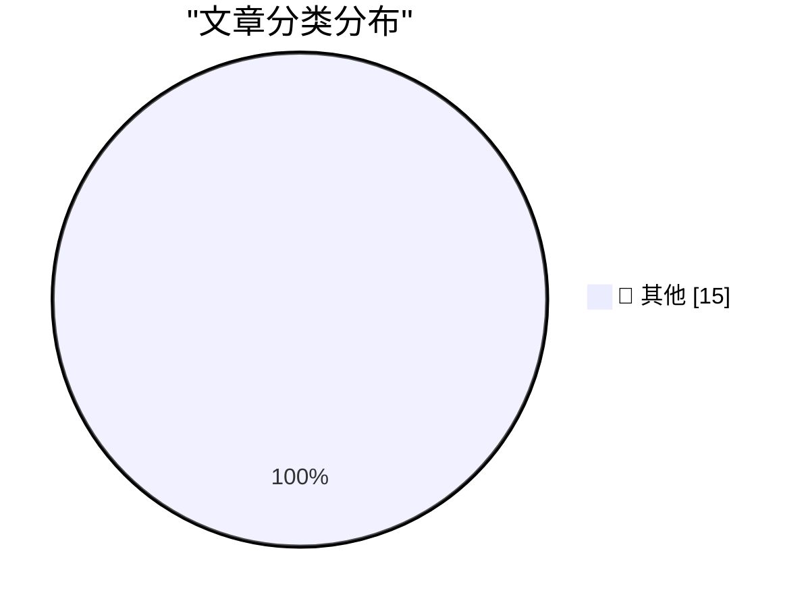

# 📰 AI 资讯每日精选 — 2026-09-12

> 汇聚 140+ 技术博客、X/Twitter、Hacker News、Reddit、Product Hunt、
> Lobste.rs、ClawFeed 日报及 GitHub Trending，经 AI 评分筛选。
>
> **本期内容**：🏆 今日必读 · 🌐 ClawFeed 日报 · 🔥 GitHub Trending · 📂 分类精选 · 🎨 设计与生成式 AI · 📊 数据概览

## 🏆 今日必读

🥇 **OpenAI agents attacked RubyGems back in May**

[OpenAI agents attacked RubyGems back in May](https://simonwillison.net/2026/Sep/12/openai-agents-rubygems/) — simonwillison.net · 48 分钟前 · 📝 其他

> OpenAI agents attacked RubyGems back in May

🥈 **So you want to use OpenRouter?**

[So you want to use OpenRouter?](https://simonwillison.net/2026/Sep/11/so-you-want-to-use-openrouter/) — simonwillison.net · 2 小时前 · 📝 其他

> So you want to use OpenRouter?

🥉 **Quoting Boris Cherny**

[Quoting Boris Cherny](https://simonwillison.net/2026/Sep/11/boris-cherny/) — simonwillison.net · 7 小时前 · 📝 其他

> Quoting Boris Cherny

4️⃣ **Feeling sad about AI**

[Feeling sad about AI](https://simonwillison.net/2026/Sep/11/feeling-sad-about-ai/) — simonwillison.net · 8 小时前 · 📝 其他

> Feeling sad about AI

5️⃣ **Quoting huggingface.co/security.txt**

[Quoting huggingface.co/security.txt](https://simonwillison.net/2026/Sep/11/hugging-face-security/) — simonwillison.net · 9 小时前 · 📝 其他

> Quoting huggingface.co/security.txt

---

## 🌐 ClawFeed 日报精选

> 来源：[ClawFeed](https://clawfeed.kevinhe.io) — AI 驱动的多源新闻聚合

📋 ClawFeed Daily | 2026-09-11 (Thu) | 5 期 4h digest (#1181-#1185)

feed 总计 151 / bookmarks 20 / errors 0

---

🔥 当日全场最重要 5 条

1. **Cursor 发布 Projects 模式** — 告别每个任务一个 chat，改为与 coordinator agent 在单一持久线程中工作。AI 编码工具架构从"对话"走向"项目"级别的持续编排。(#1185)

2. **ChatGPT for Financial Services 上线** — OpenAI 直接面向投行/股票研究推出工作台，集成 Daloopa/PitchBook/LSEG/Crunchbase/Quartr 等金融数据源。大量金融分析应用面临替代。(#1185)

3. **GPT-6 Astra 多模态能力爆发** — 从 YouTube 视频逆向工程 Cessna 337 起落架机械结构(#1183)；10 分钟将 4 小时旅行视频剪辑成 20 分钟短片(#1182)；Ottermind 发布 721 个 Astra 项目(#1183)。

4. **SpaceXAI Grok Bot Galaxy 直播** — 9/15-17 三天直播，三人团队全程用 Grok Bot 从零构建公司。AI 原生创业从概念走向公开挑战。(#1184, #1185)

5. **Fable 6TB 数据泄露事件** — 安全研究员从中国头部 LLM 中转商处获取含 7 家政府机构+19 家科技公司 SSH Key/VPN 配置/云凭证的数据集。数据供应链安全警报持续升级。(#1184, #1185)

---

📰 当日核心主题

**Agent Runtime 竞争时代开启**
OpenAI Agents API 将 harness+sandbox 打包成免费云托管服务(#1184)、Cursor Projects 引入持久线程 coordinator(#1185)、Notion MCP 开放记忆层(#1182)——行业从 token 工厂竞争全面转向 Agent Runtime 竞争。

**GPT-6 Astra 生态快速膨胀**
机械结构逆向工程、视频剪辑、721 个社区项目……Astra 的多模态能力在一天内从多个维度被验证，vibe coding 进入内容创作和工程设计领域。

**AI 安全与数据供应链**
FrontierMath 基准测试时代终结(#1181)、Anthropic/OpenAI 对模型内部机制缺乏理解(#1181)、Fable 数据集泄露含政府敏感信息(#1184-#1185)、0G Labs Stanford 论坛讨论"能否信任不理解的 AI"(#1183)。

**SaaS 估值压缩**
Miro $17.5B 被 Bending Spoons 低价收购(~2.3x ARR)，继 Airtable 之后又一协作工具巨头(#1184)。AI 对传统 SaaS 的冲击从用户流失走向并购压价。

**企业级 AI 工具化**
Anthropic 开源 oncall-kit(#1182)、Anthropic 删掉 Claude Code ~80% system prompt 的经验(#1181-#1182)、MIT 免费多模态 AI 课程(#1184)、会计事务所利润率 5%→70% 的 AI 原生重建(#1184)。

---

🔖 Bookmarks 精选（当日未刷新，汇总跨期重复项）
- @AndrewYNg — AI Engineering 最重要技能地图
- @trq212 — Anthropic 删掉 Claude Code ~80% system prompt 的经验
- @guruchahal — AI 市场渗透率 vs $6T+ 知识工作者劳动力支出（<1%）
- @xiaohu — Cloudflare @cloudflare/computer：AI Agent 云端虚拟电脑
- @BruceGuai — Matrix：长期运行的 Agent 公司架构（Agent Company OS）
- @turingou — wanman.ai 一人公司 AI agent 运营平台（开源）
- @gdb — GPT-Realtime-2 实时音频翻译

---

👀 推荐关注汇总
- （本日各期 digest 未新增推荐关注，跳过）

---

💤 当日重复噪音模式
- **Crypto meme 币/喊单**：每期均有大量 pump/dump/内盘/FOMO 帖，占 feed 15-25%
- **政治争议内容**：Elon Musk 非 AI/tech 政治评论每期出现
- **NSFW/低信息量生活帖**：健身/selfie/茶道/折叠屏讨论等非领域内容
- **VPN/工具推广**：伪装用户分享的商业推广帖

---

汇总自 5 期 4h digest: #1181(00:00-03:59) #1182(04:00-07:59) #1183(08:00-11:59) #1184(12:00-15:59) #1185(16:00-19:59)
⚠️ 20:00-23:59 档尚未生成（下一个 4h 窗口）
---

## 🔥 GitHub Trending

> 今日热门开源项目（全语言 + Python）

| # | 项目 | 描述 | ⭐ 总星 | 📈 今日 | 语言 |
|---|------|------|---------|---------|------|
| 1 | [bilawalsidhu/gods-eye-view](https://github.com/bilawalsidhu/gods-eye-view) | A spy satellite simulator in your browser, except the dat... | 27.2k | +3680 | JavaScript |
| 2 | [ayghri/i-have-adhd](https://github.com/ayghri/i-have-adhd) 🤖 | A skill to stop your coding agent from burying the answer... | 41.9k | +3463 | Python |
| 3 | [github/spec-kit](https://github.com/github/spec-kit) | 💫 Toolkit to help you get started with Spec-Driven Devel... | 135.8k | +1015 | Python |
| 4 | [obra/superpowers](https://github.com/obra/superpowers) | An agentic skills framework & software development method... | 285.4k | +729 | Shell |
| 5 | [nashsu/llm_wiki](https://github.com/nashsu/llm_wiki) 🤖 | LLM Wiki is a cross-platform desktop application that tur... | 18.7k | +647 | TypeScript |
| 6 | [alsk1992/CloddsBot](https://github.com/alsk1992/CloddsBot) 🤖 | Open Source AI trading agent that operates autonomously a... | 2.2k | +626 | TypeScript |
| 7 | [k2-fsa/OmniVoice](https://github.com/k2-fsa/OmniVoice) | High-Quality Voice Cloning TTS for 600+ Languages | 12.3k | +572 | Python |
| 8 | [vastsa/PI-Desktop](https://github.com/vastsa/PI-Desktop) 🤖 | Local-first AI coding agent desktop: Electron + Rust host... | 2.8k | +552 | TypeScript |
| 9 | [armory3d/armorpaint](https://github.com/armory3d/armorpaint) | Graphics Creation Tools | 4.7k | +350 | C |
| 10 | [D4Vinci/Scrapling](https://github.com/D4Vinci/Scrapling) | 🕷️ An adaptive Web Scraping framework that handles every... | 80.3k | +338 | Python |
| 11 | [bojieli/ai-agent-book](https://github.com/bojieli/ai-agent-book) 🤖 | 《深入理解 AI Agent：设计原理与工程实践》（李博杰 著）开源主仓库：全书正文、编译版 PDF 与按章配套代码 | 45.9k | +301 | Python |
| 12 | [donnemartin/system-design-primer](https://github.com/donnemartin/system-design-primer) | Learn how to design large-scale systems. Prep for the sys... | 369.5k | +268 | Python |
| 13 | [volcengine/OpenViking](https://github.com/volcengine/OpenViking) 🤖 | Self-evolving Context Database for AI Agents. Unify Agent... | 36.7k | +200 | Python |
| 14 | [p1neappleXpress/OpenFlux](https://github.com/p1neappleXpress/OpenFlux) | Network stack research tool. TCP tunnel with pluggable tr... | 1.2k | +198 | Go |
| 15 | [Sonarr/Sonarr](https://github.com/Sonarr/Sonarr) | Smart PVR for newsgroup and bittorrent users. | 15.7k | +191 | C# |

---

## 📝 其他

### 1. OpenAI agents attacked RubyGems back in May

[OpenAI agents attacked RubyGems back in May](https://simonwillison.net/2026/Sep/12/openai-agents-rubygems/) — **simonwillison.net** · 48 分钟前 · ⭐ 15/30

> OpenAI agents attacked RubyGems back in May

---

### 2. So you want to use OpenRouter?

[So you want to use OpenRouter?](https://simonwillison.net/2026/Sep/11/so-you-want-to-use-openrouter/) — **simonwillison.net** · 2 小时前 · ⭐ 15/30

> So you want to use OpenRouter?

---

### 3. Quoting Boris Cherny

[Quoting Boris Cherny](https://simonwillison.net/2026/Sep/11/boris-cherny/) — **simonwillison.net** · 7 小时前 · ⭐ 15/30

> Quoting Boris Cherny

---

### 4. Feeling sad about AI

[Feeling sad about AI](https://simonwillison.net/2026/Sep/11/feeling-sad-about-ai/) — **simonwillison.net** · 8 小时前 · ⭐ 15/30

> Feeling sad about AI

---

### 5. Quoting huggingface.co/security.txt

[Quoting huggingface.co/security.txt](https://simonwillison.net/2026/Sep/11/hugging-face-security/) — **simonwillison.net** · 9 小时前 · ⭐ 15/30

> Quoting huggingface.co/security.txt

---

### 6. Soft-deprecating re.match()

[Soft-deprecating re.match()](https://simonwillison.net/2026/Sep/11/soft-deprecating-re-match/) — **simonwillison.net** · 10 小时前 · ⭐ 15/30

> Soft-deprecating re.match()

---

### 7. Don't sleep on wrapture

[Don't sleep on wrapture](https://simonwillison.net/2026/Sep/11/wrapture/) — **simonwillison.net** · 11 小时前 · ⭐ 15/30

> Don't sleep on wrapture

---

### 8. Datasette 1.0a39 and 0.65.4 security releases

[Datasette 1.0a39 and 0.65.4 security releases](https://simonwillison.net/2026/Sep/11/datasette-security/) — **simonwillison.net** · 22 小时前 · ⭐ 15/30

> Datasette 1.0a39 and 0.65.4 security releases

---

### 9. datasette-publish-fly 1.4

[datasette-publish-fly 1.4](https://simonwillison.net/2026/Sep/11/datasette-publish-fly/) — **simonwillison.net** · 22 小时前 · ⭐ 15/30

> datasette-publish-fly 1.4

---

### 10. Don't build tools for AI agents

[Don't build tools for AI agents](https://seangoedecke.com/dont-build-tools-for-ai-agents/) — **seangoedecke.com** · 1 小时前 · ⭐ 15/30

> Don't build tools for AI agents

---

### 11. Last Year’s iPhone Share Amongst Users of Widgetsmith

[Last Year’s iPhone Share Amongst Users of Widgetsmith](https://mastodon.social/@_Davidsmith/117253170115740653) — **daringfireball.net** · 1 小时前 · ⭐ 15/30

> Last Year’s iPhone Share Amongst Users of Widgetsmith

---

### 12. Clarus the Dogcow Easter Egg in Apple’s OS 27 Settings

[Clarus the Dogcow Easter Egg in Apple’s OS 27 Settings](https://9to5mac.com/2026/09/11/apple-hid-a-classic-mac-easter-egg-in-the-ios-27-settings-app/) — **daringfireball.net** · 4 小时前 · ⭐ 15/30

> Clarus the Dogcow Easter Egg in Apple’s OS 27 Settings

---

### 13. XCancel Is Back

[XCancel Is Back](https://xcancel.com/cdclegal) — **daringfireball.net** · 6 小时前 · ⭐ 15/30

> XCancel Is Back

---

### 14. iPhone Duo Only Works With the $80 USB-C Apple Pencil, Not the $130 Apple Pencil Pro

[iPhone Duo Only Works With the $80 USB-C Apple Pencil, Not the $130 Apple Pencil Pro](https://www.macrumors.com/2026/09/09/apple-pencil-usb-c-iphone-duo/) — **daringfireball.net** · 8 小时前 · ⭐ 15/30

> iPhone Duo Only Works With the $80 USB-C Apple Pencil, Not the $130 Apple Pencil Pro

---

### 15. You Can Drop SEO

[You Can Drop SEO](https://idiallo.com/blog/you-can-drop-the-seo) — **idiallo.com** · 5 小时前 · ⭐ 15/30

> You Can Drop SEO

---

## 📊 数据概览

| 扫描源 | 抓取文章 | 时间范围 | 精选 |
|:---:|:---:|:---:|:---:|
| 94/140 | 3917 篇 → 67 篇 | 24h | **15 篇** |

### 分类分布

---

*生成于 2026-09-12 01:30 | 汇聚 140 个技术博客、X/Twitter、Hacker News、Reddit、Product Hunt、Lobste.rs、ClawFeed 日报及 GitHub Trending，经 AI 评分筛选出 Top 15 精华内容*
