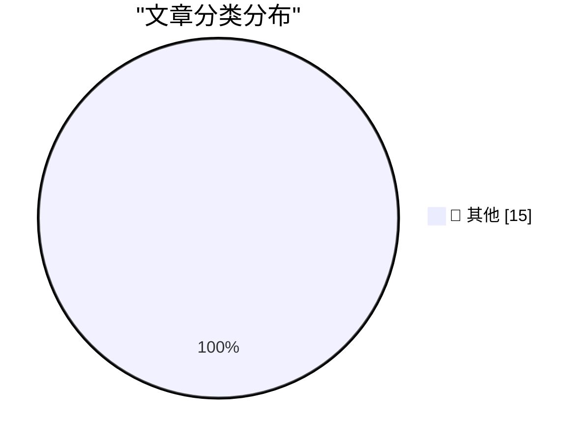

# 📰 AI 资讯每日精选 — 2026-09-13

> 汇聚 140+ 技术博客、X/Twitter、Hacker News、Reddit、Product Hunt、
> Lobste.rs、ClawFeed 日报及 GitHub Trending，经 AI 评分筛选。
>
> **本期内容**：🏆 今日必读 · 🌐 ClawFeed 日报 · 🔥 GitHub Trending · 📂 分类精选 · 🎨 设计与生成式 AI · 📊 数据概览

## 🏆 今日必读

🥇 **Generating running routes with GPT-6 Astra and ChatGPT Work**

[Generating running routes with GPT-6 Astra and ChatGPT Work](https://simonwillison.net/2026/Sep/12/astra-running-routes/) — simonwillison.net · 1 小时前 · 📝 其他

> Generating running routes with GPT-6 Astra and ChatGPT Work

🥈 **California Brown Pelican**

[California Brown Pelican](https://simonwillison.net/2026/Sep/12/sighting-399708714/) — simonwillison.net · 4 小时前 · 📝 其他

> California Brown Pelican

🥉 **Quoting Paul Ford**

[Quoting Paul Ford](https://simonwillison.net/2026/Sep/12/paul-ford/) — simonwillison.net · 7 小时前 · 📝 其他

> Quoting Paul Ford

4️⃣ **Unread 5.0**

[Unread 5.0](https://www.goldenhillsoftware.com/2026/09/unread-50/) — daringfireball.net · 5 小时前 · 📝 其他

> Unread 5.0

5️⃣ **Post Peek — Litterbox-Inspired Tweet Viewing Extension for Chrome**

[Post Peek — Litterbox-Inspired Tweet Viewing Extension for Chrome](https://github.com/tsvb/post-peek) — daringfireball.net · 7 小时前 · 📝 其他

> Post Peek — Litterbox-Inspired Tweet Viewing Extension for Chrome

---

## 🌐 ClawFeed 日报精选

> 来源：[ClawFeed](https://clawfeed.kevinhe.io) — AI 驱动的多源新闻聚合

📅 ClawFeed Daily | 2026-09-12 (5 期 4h 汇总)

Sources: #1188 (00:00-03:59) · #1189 (04:00-07:59) · #1190 (08:00-11:59) · #1191 (12:00-15:59) · #1192 (16:00-19:59)
Total: feed ~141 / bookmarks 20 / errors 0

---

🔥 当日全场 Top 5

1. **Kimi（月之暗面）16 人被带走含负责人** — 与 Anthropic 入侵报告中"非法蒸馏"指控直接相关：月之暗面将客户请求偷偷转给 Claude，再把 Claude 回答当作 Kimi 输出。AI 合规执法里程碑事件。(#1190)

2. **OpenAI 双重发布：Agents API + ChatGPT 语音系统开放** — Agents API 把 Codex 背后的 Agent harness 直接开放为一等公民 API，Agent 基础设施公司需重新审视护城河；语音系统覆盖 10 亿用户，全双工+工具调用。(#1189, #1190)

3. **Cursor Projects：协调 Agent 指挥成百上千子 Agent** — 不写代码的协调层，功能开发/PR 迁移/代码维护全覆盖，可靠性靠 PR+CI 兜底。与 Grok Bot（单 Agent 执行）形成差异化。(#1192)

4. **美国财政部长债回购信号反转 + 10 年期收益率冲 5%** — 扩大单次回购上限至 60 亿美元，但市场解读为财政部自己也担心长债不好卖。叠加特朗普称美伊战争将很快结束/油价暴跌。(#1191, #1192)

5. **RWA 永续交易量 8 月达 6020 亿美元创历史新高** — Binance 稳居首位（bStocks 3 个月 $300 亿），OKX 紧随，Gate 增长最快。Kalshi 计划申请美国监管批准约 60 种股票永续合约（Tesla/Apple/Nvidia），若获批将成美国首批受监管单一股票永续合约。(#1189, #1190, #1191)

---

📰 当日核心主题

**Agent 基础设施竞赛加速**
当天最密集的主题。OpenAI Agents API、Cursor Projects、Cloudflare @cloudflare/computer（Agent 虚拟电脑）、LangSmith Engine（Agent for Agent Engineering）、SkySynth（形式化验证 Agent 代码）、Agent harness 90 秒讲解、看板管理 Agent 任务——从平台到工具到方法论全线推进。"如果你不在做模型，你就在做 harness"成为当日金句。

**AI 合规与安全治理**
Kimi 非法蒸馏执法事件 + Anthropic 154 页武器化报告被批为 pre-IPO pitch + Nvidia CEO 称 AI 安全恐慌是"行业制造的歇斯底里" + David Sacks 拆解"doomer op" + 量子计算攻击 BTC/ETH 密钥基准减半 + 6TB Fable 数据集泄漏。安全叙事正在分裂为"真风险"和"叙事武器"两极。

**RWA/金融创新**
RWA 永续 $602B 新高 + Kalshi 60 种股票永续合约 + UniCredit 数字资产布局 + The Smarter Web 伦敦 IPO（2747 BTC） + SBF 最高法院请愿。传统金融和 crypto 的交叉点持续加深。

**开源/Builder 生态**
腾讯 AuK 语音全能模型开源 + Nous Research Hermes 技能中心 + wanman.ai 一人公司 OS 开源 + Meme Radar 开源 + Claude for Open Source Program。

---

🔖 Bookmarks 精选（全天未变，汇总）
• Claude Code 系统提示词为最新模型削减约 80%
• AI 市场渗透率 <1%（$6T+ 知识工作者市场）
• AI Engineering 最重要技能地图
• Cloudflare Agent 虚拟电脑
• Matrix Agent 公司 OS 架构
• GPT-Realtime-2 实时翻译音频
• wanman.ai 一人公司 OS 开源
• 谢青池 36 项经典 AI 论文精选

---

💤 当日重复噪音模式
• Crypto meme 币喊单/矩阵号推广（多期反复出现）
• VPN/免费节点聚合推广
• 纯政治军事讨论（佛州恐怖组织定性等）
• 生活方式/健身/旅行内容（与 AI/crypto/tech 无关）---

## 🔥 GitHub Trending

> 今日热门开源项目（全语言 + Python）

| # | 项目 | 描述 | ⭐ 总星 | 📈 今日 | 语言 |
|---|------|------|---------|---------|------|
| 1 | [ayghri/i-have-adhd](https://github.com/ayghri/i-have-adhd) 🤖 | A skill to stop your coding agent from burying the answer... | 43.5k | +2584 | Python |
| 2 | [bilawalsidhu/gods-eye-view](https://github.com/bilawalsidhu/gods-eye-view) | A spy satellite simulator in your browser, except the dat... | 30.0k | +2265 | JavaScript |
| 3 | [jordan-gibbs/hyperresearch](https://github.com/jordan-gibbs/hyperresearch) 🤖 | Agent-driven research knowledge base. Agents collect, sea... | 3.0k | +642 | Python |
| 4 | [k2-fsa/OmniVoice](https://github.com/k2-fsa/OmniVoice) | High-Quality Voice Cloning TTS for 600+ Languages | 12.8k | +534 | Python |
| 5 | [melgarafael/DeskcommCRM](https://github.com/melgarafael/DeskcommCRM) 🤖 | Open-source AI sales OS — self-hosted CRM with native AI ... | 1.8k | +504 | TypeScript |
| 6 | [alsk1992/CloddsBot](https://github.com/alsk1992/CloddsBot) 🤖 | Open Source AI trading agent that operates autonomously a... | 2.5k | +376 | TypeScript |
| 7 | [github/spec-kit](https://github.com/github/spec-kit) | 💫 Toolkit to help you get started with Spec-Driven Devel... | 136.1k | +375 | Python |
| 8 | [p1neappleXpress/OpenFlux](https://github.com/p1neappleXpress/OpenFlux) | Network stack research tool. TCP tunnel with pluggable tr... | 1.4k | +355 | Go |
| 9 | [virgiliojr94/book-to-skill](https://github.com/virgiliojr94/book-to-skill) 🤖 | Turn any technical book PDF into a Claude Code skill — re... | 30.3k | +288 | Python |
| 10 | [jihe520/MathModelAgent](https://github.com/jihe520/MathModelAgent) 🤖 | 🤖📐专为数学建模设计的 Agent & skills ,自动完成数学建模，生成一份完整的可以直接提交的论文。 ... | 5.1k | +262 | Python |
| 11 | [armory3d/armorpaint](https://github.com/armory3d/armorpaint) | Graphics Creation Tools | 4.9k | +237 | C |
| 12 | [Shubhamsaboo/awesome-llm-apps](https://github.com/Shubhamsaboo/awesome-llm-apps) 🤖 | 100+ AI Agents, Agent Skills and RAG Apps - Free and Open... | 137.6k | +230 | Python |
| 13 | [Sonarr/Sonarr](https://github.com/Sonarr/Sonarr) | Smart PVR for newsgroup and bittorrent users. | 15.9k | +227 | C# |
| 14 | [D4Vinci/Scrapling](https://github.com/D4Vinci/Scrapling) | 🕷️ An adaptive Web Scraping framework that handles every... | 80.5k | +226 | Python |
| 15 | [asgeirtj/system_prompts_leaks](https://github.com/asgeirtj/system_prompts_leaks) 🤖 | Extracted system prompts from Anthropic - Claude Fable 5.... | 65.4k | +217 | JavaScript |

---

## 📝 其他

### 1. Generating running routes with GPT-6 Astra and ChatGPT Work

[Generating running routes with GPT-6 Astra and ChatGPT Work](https://simonwillison.net/2026/Sep/12/astra-running-routes/) — **simonwillison.net** · 1 小时前 · ⭐ 15/30

> Generating running routes with GPT-6 Astra and ChatGPT Work

---

### 2. California Brown Pelican

[California Brown Pelican](https://simonwillison.net/2026/Sep/12/sighting-399708714/) — **simonwillison.net** · 4 小时前 · ⭐ 15/30

> California Brown Pelican

---

### 3. Quoting Paul Ford

[Quoting Paul Ford](https://simonwillison.net/2026/Sep/12/paul-ford/) — **simonwillison.net** · 7 小时前 · ⭐ 15/30

> Quoting Paul Ford

---

### 4. Unread 5.0

[Unread 5.0](https://www.goldenhillsoftware.com/2026/09/unread-50/) — **daringfireball.net** · 5 小时前 · ⭐ 15/30

> Unread 5.0

---

### 5. Post Peek — Litterbox-Inspired Tweet Viewing Extension for Chrome

[Post Peek — Litterbox-Inspired Tweet Viewing Extension for Chrome](https://github.com/tsvb/post-peek) — **daringfireball.net** · 7 小时前 · ⭐ 15/30

> Post Peek — Litterbox-Inspired Tweet Viewing Extension for Chrome

---

### 6. Where Are the AI-Generated Killer Apps?

[Where Are the AI-Generated Killer Apps?](https://www.nytimes.com/2026/09/12/opinion/ai-software-coding-apps.html?unlocked_article_code=1.AlE.C9EE.H2j5a1eHFUbQ&amp;smid=nytcore-ios-share) — **daringfireball.net** · 9 小时前 · ⭐ 15/30

> Where Are the AI-Generated Killer Apps?

---

### 7. Yours Truly on Off Protocol With Jim Ray

[Yours Truly on Off Protocol With Jim Ray](https://atproto.com/off-protocol/2026-09-11-make-your-own-thing-john-gruber) — **daringfireball.net** · 9 小时前 · ⭐ 15/30

> Yours Truly on Off Protocol With Jim Ray

---

### 8. T-Mobile Is Charging $5/Month for iPhone Handoff

[T-Mobile Is Charging $5/Month for iPhone Handoff](https://www.t-mobile.com/news/devices/iphone-18-pro-iphone-duo-apple-watch-release) — **daringfireball.net** · 9 小时前 · ⭐ 15/30

> T-Mobile Is Charging $5/Month for iPhone Handoff

---

### 9. Tristan Buckmaster’s Statement on Getting Scooped by OpenAI on the Navier-Stokes Problem

[Tristan Buckmaster’s Statement on Getting Scooped by OpenAI on the Navier-Stokes Problem](https://cims.nyu.edu/~tristanb/statement.pdf) — **daringfireball.net** · 10 小时前 · ⭐ 15/30

> Tristan Buckmaster’s Statement on Getting Scooped by OpenAI on the Navier-Stokes Problem

---

### 10. Gary Marcus on This Week in AI Drama

[Gary Marcus on This Week in AI Drama](https://garymarcus.substack.com/p/two-dire-warnings-one-from-terence) — **daringfireball.net** · 10 小时前 · ⭐ 15/30

> Gary Marcus on This Week in AI Drama

---

### 11. Pluralistic: LLMs are real, AI is fake (12 Sep 2026)

[Pluralistic: LLMs are real, AI is fake (12 Sep 2026)](https://pluralistic.net/2026/09/12/god-in-the-box/) — **pluralistic.net** · 14 小时前 · ⭐ 15/30

> Pluralistic: LLMs are real, AI is fake (12 Sep 2026)

---

### 12. ActivityPub - How to send an updated user profile to Mastodon and the Fediverse

[ActivityPub - How to send an updated user profile to Mastodon and the Fediverse](https://shkspr.mobi/blog/2026/09/activitypub-how-to-send-an-updated-user-profile-to-mastodon-and-the-fediverse/) — **shkspr.mobi** · 13 小时前 · ⭐ 15/30

> ActivityPub - How to send an updated user profile to Mastodon and the Fediverse

---

### 13. Microcode in Intel's 8087 floating-point chip: the scale instruction

[Microcode in Intel's 8087 floating-point chip: the scale instruction](http://www.righto.com/feeds/8196351266247635143/comments/default) — **righto.com** · 9 小时前 · ⭐ 15/30

> Microcode in Intel's 8087 floating-point chip: the scale instruction

---

### 14. This Week in Package Management: 12 September 2026

[This Week in Package Management: 12 September 2026](https://nesbitt.io/2026/09/12/this-week-in-package-management.html) — **nesbitt.io** · 15 小时前 · ⭐ 15/30

> This Week in Package Management: 12 September 2026

---

### 15. Reading List — 09/12/2026

[Reading List — 09/12/2026](https://www.construction-physics.com/p/reading-list-09122026) — **construction-physics.com** · 12 小时前 · ⭐ 15/30

> Reading List — 09/12/2026

---

## 📊 数据概览

| 扫描源 | 抓取文章 | 时间范围 | 精选 |
|:---:|:---:|:---:|:---:|
| 92/140 | 3854 篇 → 53 篇 | 24h | **15 篇** |

### 分类分布

---

*生成于 2026-09-13 01:24 | 汇聚 140 个技术博客、X/Twitter、Hacker News、Reddit、Product Hunt、Lobste.rs、ClawFeed 日报及 GitHub Trending，经 AI 评分筛选出 Top 15 精华内容*
