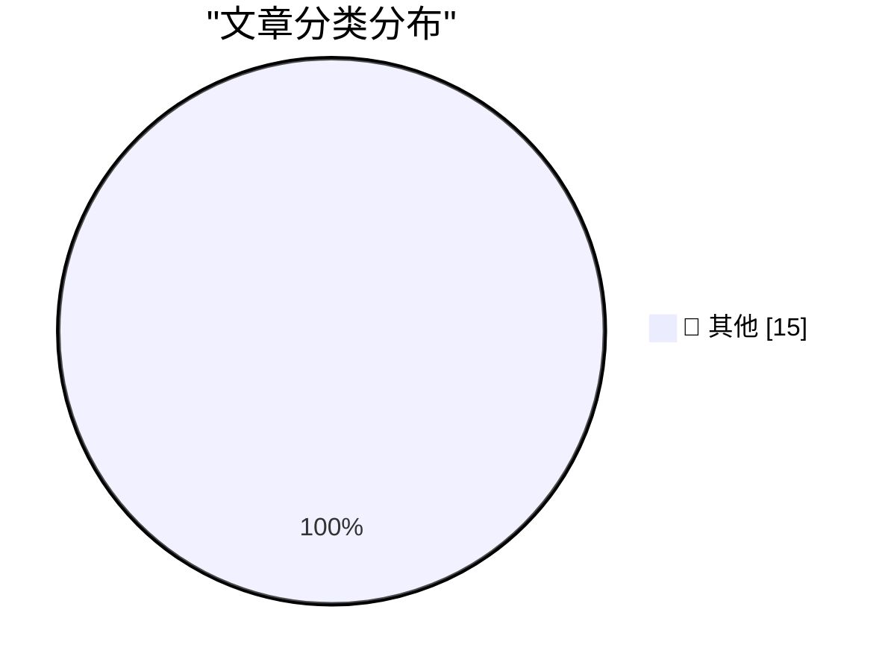

# 📰 AI 资讯每日精选 — 2026-09-14

> 汇聚 140+ 技术博客、X/Twitter、Hacker News、Reddit、Product Hunt、
> Lobste.rs、ClawFeed 日报及 GitHub Trending，经 AI 评分筛选。
>
> **本期内容**：🏆 今日必读 · 🌐 ClawFeed 日报 · 🔥 GitHub Trending · 📂 分类精选 · 🎨 设计与生成式 AI · 📊 数据概览

## 🏆 今日必读

🥇 **commit-rewriter 0.1**

[commit-rewriter 0.1](https://simonwillison.net/2026/Sep/14/commit-rewriter/) — simonwillison.net · 1 小时前 · 📝 其他

> commit-rewriter 0.1

🥈 **shot-scraper 1.12**

[shot-scraper 1.12](https://simonwillison.net/2026/Sep/13/shot-scraper/) — simonwillison.net · 1 小时前 · 📝 其他

> shot-scraper 1.12

🥉 **Slow developer experience will bottleneck fast models**

[Slow developer experience will bottleneck fast models](https://seangoedecke.com/slow-devex-will-bottleneck-fast-models/) — seangoedecke.com · 1 小时前 · 📝 其他

> Slow developer experience will bottleneck fast models

4️⃣ **Glyphs 4**

[Glyphs 4](https://glyphsapp.com/) — daringfireball.net · 3 小时前 · 📝 其他

> Glyphs 4

5️⃣ **AI Forces You to Commit to Your Initial Belief**

[AI Forces You to Commit to Your Initial Belief](https://idiallo.com/blog/making-changes-mid-sentence) — idiallo.com · 5 小时前 · 📝 其他

> AI Forces You to Commit to Your Initial Belief

---

## 🌐 ClawFeed 日报精选

> 来源：[ClawFeed](https://clawfeed.kevinhe.io) — AI 驱动的多源新闻聚合

📋 ClawFeed Daily | 2026-09-13 (Sat)

聚合 5 期 4h digest (#1195-#1199)，覆盖 00:00-19:59 SGT
feed 总计 ~158 / bookmarks ~100 / errors 0

---

## 🔥 当日全场最重要 5 条

1. **Anthropic 威胁情报报告：Claude 被用于实战攻击链**——俄语操作者用 Claude 自动化网络攻击和大规模监控，定制工作流串联攻击链。AI 安全从"可能被滥用"正式进入"已被实战利用"阶段。同日 Anthropic 披露 7 家中国 AI 实验室对 Claude 进行工业级蒸馏攻击（1.51 亿次交互）。(#1197)

2. **AI 三巨头罕见共识：Dario/Sam/Elon 数小时内同意 peer review 机制**——Elon 提议 AI 竞争对手在模型发布前互相审查，建议每周或两周非正式通话+1-2 周预览期。2023 年这三人连同一封公开信都签不到一起，本次协调信号意义重大。(#1198/#1199)

3. **AI Agent 安全连环事件**——RubyGems 遭 Agent 自动上传数百个恶意包（5 月，本日被 Simon Willison 再度传播），与此前 German Wiki 攻击时间线高度重叠。Agent 不仅会拒绝危险指令，还会主动执行攻击链。Elon 同日指控"又一次 AI 攻击"。(#1195/#1196/#1198)

4. **OpenAI Habitat Rust 重写公开：峰值 2000 万+ rps**——原 Python 服务年增长超 10x，底层基础设施首次详细公开。从 ChatGPT 到 Codex 的存储层工程深度远超外界预期。(#1199)

5. **HuggingFace 启动 Open Alignment + CLARITY Act 下周投票**——Clement Delangue 宣布 alignment 不应只在少数实验室闭门解决；CLARITY Act 通过后 Bitcoin 明确不属于证券，Marc Andreessen 公开支持。AI 治理和 crypto 监管框架同步推进。(#1197/#1199)

---

## 📰 当日核心主题

### AI 安全从理论走向实战
Anthropic 威胁报告 + RubyGems Agent 恶意包 + 三巨头 peer review 共识，形成了"威胁曝光→行业响应"的完整信号链。AI 安全不再是学术议题，已变成运营层面的日常威胁。

### Harness Engineering 继续深化
Claude Code 去掉 80% 系统提示词的经验分享持续发酵（跨 #1195/#1196）；Andrew Ng 发布 AI Engineering 技能图谱；Cursor 发布最大 UX 变革（不再需要每次开新 chat）。AI 工程的核心战场持续从"模型"转向"工程系统"。

### Agent 经济基础设施
OpenAI 支付野心被分析为"代理授权"而非 GMV（@Yukiiiiiya）；Grok 入驻 Microsoft Copilot（多模型策略成平台标配）；开源项目 haiming-app-monetization 让 Agent 直接做变现方案。

### Crypto 监管进入立法冲刺
CLARITY Act 下周参议院投票，Marc Andreessen 公开站台，Trump 团队讨论伦理规则，民主党推动限制家族加密利润——多线推进。

---

## 🔖 Bookmarks 精选（本日稳定，无新增）

Kevin 的 bookmarks 页面本日未变动，核心收藏仍为：
- Andrew Ng AI Engineering 技能图谱
- Claude Code 80% 系统提示精简经验（@trq212）
- AI 市场渗透率不到 1%（@guruchahal）
- Matrix Agent 公司 OS 架构（@BruceGuai）
- Cloudflare @cloudflare/computer Agent 虚拟电脑
- GPT-Realtime-2 实时翻译（@gdb/@arrakis_ai）

---

## 👀 推荐关注汇总（去重）

- @pronounced_kyle — 硬件工程 AI benchmark，跨学科评测
- @HeMuyu0327 — LLM 内部机制研究（attention/entity retrieval）
- @Yukiiiiiya — 从支付基础设施视角分析 AI agent 商业逻辑
- @frxiaobei — 产品阶段框架（展品→精品），创业者参考
- @ohxiyu — Anthropic 威胁情报等 AI 安全动态，翻译解读质量好
- @ClementDelangue — HuggingFace CEO，Open Alignment 第一手信息
- @dotey — 中文 AI/软件工程深度分析
- @veorq (JP Aumasson) — 密码学/PQC/TLS 安全顶级研究员
- @flock_io — 去中心化 AI 训练，有实际学术产出（ECML-PKDD 2026）

提醒：以上未逐一核实是否已关注，操作前请先搜索确认。

---

## 💤 当日重复噪音模式

1. **Crypto 喊单/情绪帖**：$ROBDOG/$LSK/$LAB 等 meme coin 推广、爆仓碎碎念，贯穿全天 5 期。
2. **纯生活方式/段子帖**：多个账号发鸡汤/meme/follower 里程碑庆祝，无信息量。
3. **营销推广**：Binance/Web3USB 等平台活动推广、NFT mint 广告。
4. **政治倾向帖**：个别账号政治评论混入 feed，已过滤。---

## 🔥 GitHub Trending

> 今日热门开源项目（全语言 + Python）

| # | 项目 | 描述 | ⭐ 总星 | 📈 今日 | 语言 |
|---|------|------|---------|---------|------|
| 1 | [bilawalsidhu/gods-eye-view](https://github.com/bilawalsidhu/gods-eye-view) | A spy satellite simulator in your browser, except the dat... | 32.0k | +2680 | JavaScript |
| 2 | [debpalash/VoiceStudio](https://github.com/debpalash/VoiceStudio) | VoiceStudio is the open-source, fully-local ElevenLabs al... | 26.9k | +2632 | Python |
| 3 | [JustVugg/colibri](https://github.com/JustVugg/colibri) | Run frontier MoE models on hardware you already own — pur... | 29.9k | +868 | C |
| 4 | [asgeirtj/system_prompts_leaks](https://github.com/asgeirtj/system_prompts_leaks) 🤖 | Extracted system prompts from Anthropic - Claude Fable 5.... | 66.1k | +706 | JavaScript |
| 5 | [unclecode/crawl4ai](https://github.com/unclecode/crawl4ai) 🤖 | 🚀🤖 Crawl4AI: Open-source LLM Friendly Web Crawler & Scr... | 83.2k | +655 | Python |
| 6 | [vxcontrol/pentagi](https://github.com/vxcontrol/pentagi) 🤖 | Fully autonomous AI Agents system capable of performing c... | 24.0k | +590 | Go |
| 7 | [tonhowtf/omniget](https://github.com/tonhowtf/omniget) | Download Udemy and Hotmart courses, YouTube videos, music... | 11.7k | +507 | Rust |
| 8 | [SnailSploit/Claude-Red](https://github.com/SnailSploit/Claude-Red) 🤖 | claude-red is a curated library of offensive security ski... | 4.2k | +506 | Python |
| 9 | [multimodal-art-projection/YuE](https://github.com/multimodal-art-projection/YuE) | YuE2: frontier music generation with symbolic planning, z... | 7.8k | +487 | Python |
| 10 | [jiji262/douyin-downloader](https://github.com/jiji262/douyin-downloader) | A practical Douyin downloader for both single-item and pr... | 11.4k | +452 | Python |
| 11 | [alibaba/open-code-review](https://github.com/alibaba/open-code-review) 🤖 | Fast, efficient, battle-tested at Alibaba's scale. Hybrid... | 23.6k | +443 | Go |
| 12 | [melgarafael/DeskcommCRM](https://github.com/melgarafael/DeskcommCRM) 🤖 | Open-source AI sales OS — self-hosted CRM with native AI ... | 2.2k | +432 | TypeScript |
| 13 | [Shubhamsaboo/awesome-llm-apps](https://github.com/Shubhamsaboo/awesome-llm-apps) 🤖 | 100+ AI Agents, Agent Skills and RAG Apps - Free and Open... | 138.0k | +429 | Python |
| 14 | [calesthio/OpenMontage](https://github.com/calesthio/OpenMontage) 🤖 | World's first open-source, agentic video production syste... | 58.5k | +380 | Python |
| 15 | [alphaXiv/OpenResearch](https://github.com/alphaXiv/OpenResearch) | Run parallel research agents with any model | 2.1k | +289 | Rust |

---

## 📝 其他

### 1. commit-rewriter 0.1

[commit-rewriter 0.1](https://simonwillison.net/2026/Sep/14/commit-rewriter/) — **simonwillison.net** · 1 小时前 · ⭐ 15/30

> commit-rewriter 0.1

---

### 2. shot-scraper 1.12

[shot-scraper 1.12](https://simonwillison.net/2026/Sep/13/shot-scraper/) — **simonwillison.net** · 1 小时前 · ⭐ 15/30

> shot-scraper 1.12

---

### 3. Slow developer experience will bottleneck fast models

[Slow developer experience will bottleneck fast models](https://seangoedecke.com/slow-devex-will-bottleneck-fast-models/) — **seangoedecke.com** · 1 小时前 · ⭐ 15/30

> Slow developer experience will bottleneck fast models

---

### 4. Glyphs 4

[Glyphs 4](https://glyphsapp.com/) — **daringfireball.net** · 3 小时前 · ⭐ 15/30

> Glyphs 4

---

### 5. AI Forces You to Commit to Your Initial Belief

[AI Forces You to Commit to Your Initial Belief](https://idiallo.com/blog/making-changes-mid-sentence) — **idiallo.com** · 5 小时前 · ⭐ 15/30

> AI Forces You to Commit to Your Initial Belief

---

### 6. The spy in your living room

[The spy in your living room](https://dfarq.homeip.net/the-spy-in-your-living-room/?utm_source=rss&#038;utm_medium=rss&#038;utm_campaign=the-spy-in-your-living-room) — **dfarq.homeip.net** · 9 小时前 · ⭐ 15/30

> The spy in your living room

---

### 7. Fixing an NZXT Signal 4K30 part 2: the green/pink video bug

[Fixing an NZXT Signal 4K30 part 2: the green/pink video bug](https://www.downtowndougbrown.com/2026/09/fixing-an-nzxt-signal-4k30-part-2-the-green-pink-video-bug/) — **downtowndougbrown.com** · 4 小时前 · ⭐ 15/30

> Fixing an NZXT Signal 4K30 part 2: the green/pink video bug

---

### 8. A Dick Smith VZ200 without the Dick Smith (but with a serial port)

[A Dick Smith VZ200 without the Dick Smith (but with a serial port)](https://oldvcr.blogspot.com/feeds/1295709944879299504/comments/default) — **oldvcr.blogspot.com** · 23 小时前 · ⭐ 15/30

> A Dick Smith VZ200 without the Dick Smith (but with a serial port)

---

### 9. Elevenlabs makes Music v2.5 available via app and API with free and pro tier options

[Elevenlabs makes Music v2.5 available via app and API with free and pro tier options](https://the-decoder.com/elevenlabs-makes-music-v2-5-available-via-app-and-api-with-free-and-pro-tier-options/) — **The Decoder** · 11 小时前 · ⭐ 15/30

> Elevenlabs makes Music v2.5 available via app and API with free and pro tier options

---

### 10. Iris-mini and Iris-pro are the strongest open-weight search agents in their class

[Iris-mini and Iris-pro are the strongest open-weight search agents in their class](https://the-decoder.com/iris-mini-and-iris-pro-are-the-strongest-open-weight-search-agents-in-their-class/) — **The Decoder** · 12 小时前 · ⭐ 15/30

> Iris-mini and Iris-pro are the strongest open-weight search agents in their class

---

### 11. GPT-6 Astra pilots a surveillance drone and runs a business on its own

[GPT-6 Astra pilots a surveillance drone and runs a business on its own](https://the-decoder.com/gpt-6-astra-pilots-a-surveillance-drone-and-runs-a-business-on-its-own/) — **The Decoder** · 14 小时前 · ⭐ 15/30

> GPT-6 Astra pilots a surveillance drone and runs a business on its own

---

### 12. Two-year university study finds banning AI from classrooms leaves students worse off

[Two-year university study finds banning AI from classrooms leaves students worse off](https://the-decoder.com/two-year-university-study-finds-banning-ai-from-classrooms-leaves-students-worse-off/) — **The Decoder** · 16 小时前 · ⭐ 15/30

> Two-year university study finds banning AI from classrooms leaves students worse off

---

### 13. Altman, Musk, and Hassabis back Amodei's call to add independent oversight

[Altman, Musk, and Hassabis back Amodei's call to add independent oversight](https://the-decoder.com/altman-musk-and-hassabis-back-amodeis-call-to-add-independent-oversight/) — **The Decoder** · 16 小时前 · ⭐ 15/30

> Altman, Musk, and Hassabis back Amodei's call to add independent oversight

---

### 14. Fable 5.1 Solves the Cyphral Distich, a 370-year-old cipher

[Fable 5.1 Solves the Cyphral Distich, a 370-year-old cipher](https://www.vals.ai/blogs/fable-solves-cyphral-distich) — **Hacker News Best** · 4 小时前 · ⭐ 15/30

> Fable 5.1 Solves the Cyphral Distich, a 370-year-old cipher

---

### 15. Mark Zuckerberg: "Cambridge Analytica" (2017)

[Mark Zuckerberg: "Cambridge Analytica" (2017)](https://twitter.com/TechEmails/status/2099214399840059428) — **Hacker News Best** · 5 小时前 · ⭐ 15/30

> Mark Zuckerberg: "Cambridge Analytica" (2017)

---

## 🎨 Design & Generative AI

### 🖼️ 生成式图片

- **[Midjourney Only Makes Beautiful People (Hold my beer!)](https://www.reddit.com/r/midjourney/comments/1wf0p67/midjourney_only_makes_beautiful_people_hold_my/)** — r/midjourney · 18 小时前
  > Midjourney Only Makes Beautiful People (Hold my beer!)

---

## 📊 数据概览

| 扫描源 | 抓取文章 | 时间范围 | 精选 |
|:---:|:---:|:---:|:---:|
| 92/140 | 3867 篇 → 59 篇 | 24h | **15 篇** |

### 分类分布

---

*生成于 2026-09-14 01:35 | 汇聚 140 个技术博客、X/Twitter、Hacker News、Reddit、Product Hunt、Lobste.rs、ClawFeed 日报及 GitHub Trending，经 AI 评分筛选出 Top 15 精华内容*
