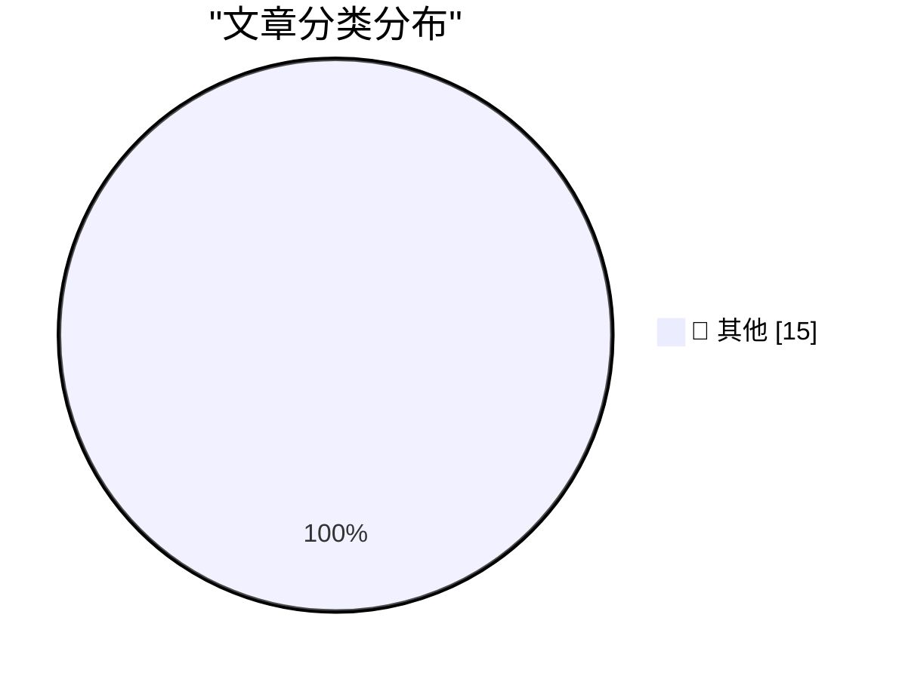

# 📰 AI 资讯每日精选 — 2026-09-16

> 汇聚 140+ 技术博客、X/Twitter、Hacker News、Reddit、Product Hunt、
> Lobste.rs、ClawFeed 日报及 GitHub Trending，经 AI 评分筛选。
>
> **本期内容**：🏆 今日必读 · 🌐 ClawFeed 日报 · 🔥 GitHub Trending · 📂 分类精选 · 🎨 设计与生成式 AI · 📊 数据概览

## 🏆 今日必读

🥇 **Gemini Live audio**

[Gemini Live audio](https://simonwillison.net/2026/Sep/15/gemini-live/) — simonwillison.net · 2 小时前 · 📝 其他

> Gemini Live audio

🥈 **FT: ‘Steve Bannon and Bernie Sanders Unite in AI Safety Call’**

[FT: ‘Steve Bannon and Bernie Sanders Unite in AI Safety Call’](https://www.ft.com/content/bab5c4c5-5377-4dd0-8b46-d8c4ce9a36d5?syn-25a6b1a6=1) — daringfireball.net · 6 小时前 · 📝 其他

> FT: ‘Steve Bannon and Bernie Sanders Unite in AI Safety Call’

🥉 **★ Thoughts and Observations on Apple’s ‘Surprise and Shine’ Event; the Announcements of the iPhones 18 Pro, AirPods 5, Apple Watches Series 12 and Ultra 4, and the iPhone Duo; and the Dawn of the Ternus, John Ternus Era at Apple**

[★ Thoughts and Observations on Apple’s ‘Surprise and Shine’ Event; the Announcements of the iPhones 18 Pro, AirPods 5, Apple Watches Series 12 and Ultra 4, and the iPhone Duo; and the Dawn of the Ternus, John Ternus Era at Apple](https://daringfireball.net/2026/09/thoughts_and_observations_on_apples_surprise_and_shine_event) — daringfireball.net · 7 小时前 · 📝 其他

> ★ Thoughts and Observations on Apple’s ‘Surprise and Shine’ Event; the Announcements of the iPhones 18 Pro, AirPods 5, Apple Watches Series 12 and Ultra 4, and the iPhone Duo; and the Dawn of the Ternus, John Ternus Era at Apple

4️⃣ **[Sponsor] WorkOS: How SSO Works and the Fastest Way to Add It**

[[Sponsor] WorkOS: How SSO Works and the Fastest Way to Add It](https://workos.com/guide/the-developers-guide-to-sso?utm_source=daringfireball&amp;utm_medium=newsletter&amp;utm_campaign=q32026) — daringfireball.net · 10 小时前 · 📝 其他

> [Sponsor] WorkOS: How SSO Works and the Fastest Way to Add It

5️⃣ **Pluralistic: Everybody pees (15 Sep 2026)**

[Pluralistic: Everybody pees (15 Sep 2026)](https://pluralistic.net/2026/09/15/bitter-lemon-energy-drink/) — pluralistic.net · 18 小时前 · 📝 其他

> Pluralistic: Everybody pees (15 Sep 2026)

---

## 🌐 ClawFeed 日报精选

> 来源：[ClawFeed](https://clawfeed.kevinhe.io) — AI 驱动的多源新闻聚合

# 📅 ClawFeed 日报 | 2026-09-14 (SGT)

> 聚合当日 5 档 4h digest（id 1203–1207，覆盖 00:00–19:59 SGT）。feed 合计 ~163 条 / bookmarks 20 / errors 0。

## 🔥 当日全场最重要 5 条

1. **「Pace the Frontier」辩论升级为政策博弈（当日主线，横跨 4 档）** — Anthropic CEO Dario Amodei 发长文呼吁放缓前沿模型开发、请政府协助，并承诺给第三方评估者永久访问权。David Sacks 公开回击「欢迎他们自己踩刹车，但别要求政府给所有人加速罚单」；Bloomberg 指出 Anthropic/OpenAI 的放缓主张正与科技行业、华尔街、特朗普政府正面冲突。辩论从学术层进入政策层。

2. **CLARITY Act 投票在即（明天）** — 加密市场结构立法关键时刻，参议院程序性投票逼近，通过需 60 票、三大分歧待解。通过后 Bitcoin 将被明确排除在证券定义之外，X 上「BC vs AC」（Before/After Clarity）叙事发酵。Lummis 表态支持。

3. **SWIFT 联合 17 家全球银行测试区块链跨境支付** — 「Swift Digital Ledger」参与方含花旗、三菱 UFJ、富国、UBS、法国巴黎银行；汇丰、渣打已完成实际交易。传统金融基础设施正式拥抱代币化存款。

4. **iOS 27 暗藏 Model Delegation API，开发者已把 Claude 接入 Siri** — 苹果预留第三方 AI 模型替换 Siri 后端的接口，Claude 直接出现在 Ask 菜单。模型接入从封闭走向平台化开放。

5. **AI 产出学术级数学成果 + 情感拐点** — Bittensor 子网矿工解出 16 年未解的 Green's Problem 51 近半密度解（Lean 形式化验证通过）；康奈尔数学教授 Strogatz 受访谈及 AI 数学飞跃时当场落泪（「支撑很多研究者的是优越感而非探索欲，AI 把这层戳破了」）。

## 📰 当日核心主题（聚类视角）

- **Agent 经济落地为「支付 + 岗位」**：Circle 上线 Agent Marketplace（Agent 用 USDC 发现并支付服务）；Brex 联创 Pedro「别造 AI agent，造 AI 员工」（有岗位/技能/上级/预算）；SpaceX 工程师晒 Grok agent 编排（Chief of Staff + PM + 15+ workers）；Meta Muse 被用户评「feels like AGI」，Muse+Link 支付几分钟买下 $400 演唱会门票。
- **模型平台化 / 开放接入**：iOS 27 Model Delegation、GPT-Live-1 语音 API 开放（边听边说）、GPT Images 2.5 品牌级设计、Claude 20x 账户用量吃紧（前沿模型使用强度攀升）。
- **TradFi 上链 / 代币化主线**：SWIFT 17 行、Uniswap 月量破 $70B（超二到四名之和）、RWA + 代币化股票、TradFi 结构化产品转向 Hyperliquid basis trade。
- **Skills / 工具生态到整合期**：Skill 注册表碎片化（10+ 平台）催生统一搜索；Claude Code 系统提示精简 80%；Cloudflare @cloudflare/computer 给 Agent 配云端虚拟机；GPT-6/Astra 官方 Skills 指南提倡「做减法」。
- **加密监管周**：CLARITY Act 投票 + 美联储利率决定（周三，加息概率 86.5%）叠加，短期市场承压。

## 🔖 累计 Bookmark 精选（全天高热，去重）

- **谢青池 36 篇经典 AI 论文合集** + Codex 整理下载地址（全天持续热门）。
- **AI 市场渗透率不到 1%** — $6T+ 知识工作者支出中 AI 捕获不足 1%，最好的垂直（软件开发/客服）也仅个位数。
- **Cloudflare @cloudflare/computer** — 每个 Agent 一台云端虚拟电脑（文件系统 + 多执行环境，自主调度）。
- **Claude Code 系统提示精简 80%** — Anthropic 分享 system prompt / Skills / CLAUDE.md 写作经验。
- **wanman.ai 开源**（第 14 款 vibe 产品）— AI Agent 团队零部署运营一人公司，支持 Codex 调 GPT Image 2 自动建设计师 Agent + 跨 Story 搜索。
- **Andrew Ng AI Engineering 技能图谱** · **Matrix Agent 公司 OS 架构**（多 Agent 编排 + 权限 + 长期运行）· **GPT-Realtime-2 浏览器内实时翻译**。

## 👀 推荐关注汇总（去重）

- **@bibryam** — Kubernetes/Cloud Native 老兵，做 Agent Skills 统一注册表。
- **@turingou** — wanman.ai 作者，高频 building in public。
- **@RebeccaRettig1** — 加密政策专家，跟踪 CLARITY Act 与预测市场监管。
- **@poteto** — Grok Bot 工程师 / React Compiler 核心，pstack 插件作者（支撑每月 2000 PR）。
- **@istdrc** — Raft 联合创始人兼 CEO，前 Kimi CLI 作者，AI coding 一线 builder。

## 💤 当日重复/噪音模式

- **加密 meme / perp 炒作**（$ROBDOG、$EMBER 转盘、MEMEPERPSZN、「纸手」/frontrun 叙事）— 全天约占 feed ~25%，周末散户活跃度上升，信噪比偏低。
- **币圈 KOL 自我营销 / 招聘帖**（Bitget 天使、Predict Fun BD、Predict.fun 等）— 信息密度低。
- **生活碎片类**（医生段子、同性恋新闻、海底烟花）混入 tech feed。

---
*聚合 4h digest ids: 1203, 1204, 1205, 1206, 1207 · 生成于 2026-09-14 23:59 SGT*
---

## 🔥 GitHub Trending

> 今日热门开源项目（全语言 + Python）

| # | 项目 | 描述 | ⭐ 总星 | 📈 今日 | 语言 |
|---|------|------|---------|---------|------|
| 1 | [alibaba/open-code-review](https://github.com/alibaba/open-code-review) 🤖 | Fast, efficient, battle-tested at Alibaba's scale. Hybrid... | 28.7k | +2756 | Go |
| 2 | [debpalash/VoiceStudio](https://github.com/debpalash/VoiceStudio) | VoiceStudio is the open-source, fully-local ElevenLabs al... | 31.0k | +2072 | Python |
| 3 | [JustVugg/colibri](https://github.com/JustVugg/colibri) | Run frontier MoE models on hardware you already own — pur... | 33.9k | +2026 | C |
| 4 | [Panniantong/Agent-Reach](https://github.com/Panniantong/Agent-Reach) 🤖 | Give your AI agent eyes to see the entire internet. Read ... | 82.1k | +960 | Python |
| 5 | [TauricResearch/TradingAgents](https://github.com/TauricResearch/TradingAgents) 🤖 | TradingAgents: Multi-Agents LLM Financial Trading Framework | 106.7k | +727 | Python |
| 6 | [NationalSecurityAgency/ghidra](https://github.com/NationalSecurityAgency/ghidra) | Ghidra is a software reverse engineering (SRE) framework | 76.7k | +725 | Java |
| 7 | [multimodal-art-projection/YuE](https://github.com/multimodal-art-projection/YuE) | YuE2: frontier music generation with symbolic planning, z... | 9.0k | +701 | Python |
| 8 | [SnailSploit/Claude-Red](https://github.com/SnailSploit/Claude-Red) 🤖 | claude-red is a curated library of offensive security ski... | 5.4k | +699 | Python |
| 9 | [bojieli/ai-agent-book](https://github.com/bojieli/ai-agent-book) 🤖 | 《深入理解 AI Agent：设计原理与工程实践》（李博杰 著）开源主仓库：全书正文、编译版 PDF 与按章配套代码 | 47.6k | +660 | Python |
| 10 | [ever-co/ever-gauzy](https://github.com/ever-co/ever-gauzy) | Ever® Gauzy™ - Open Business Management Platform (ERP/CRM... | 6.7k | +634 | TypeScript |
| 11 | [666ghj/MiroFish](https://github.com/666ghj/MiroFish) | A Simple and Universal Swarm Intelligence Engine, Predict... | 73.7k | +619 | Python |
| 12 | [alphaXiv/OpenResearch](https://github.com/alphaXiv/OpenResearch) | Turn your coding agents into research agents | 3.4k | +531 | Rust |
| 13 | [earendil-works/pi](https://github.com/earendil-works/pi) 🤖 | AI agent toolkit: unified LLM API, agent loop, TUI, codin... | 105.7k | +458 | TypeScript |
| 14 | [addyosmani/agent-skills](https://github.com/addyosmani/agent-skills) 🤖 | Production-grade engineering skills for AI coding agents. | 94.8k | +307 | JavaScript |
| 15 | [calesthio/OpenMontage](https://github.com/calesthio/OpenMontage) 🤖 | World's first open-source, agentic video production syste... | 59.3k | +273 | Python |

---

## 📝 其他

### 1. Gemini Live audio

[Gemini Live audio](https://simonwillison.net/2026/Sep/15/gemini-live/) — **simonwillison.net** · 2 小时前 · ⭐ 15/30

> Gemini Live audio

---

### 2. FT: ‘Steve Bannon and Bernie Sanders Unite in AI Safety Call’

[FT: ‘Steve Bannon and Bernie Sanders Unite in AI Safety Call’](https://www.ft.com/content/bab5c4c5-5377-4dd0-8b46-d8c4ce9a36d5?syn-25a6b1a6=1) — **daringfireball.net** · 6 小时前 · ⭐ 15/30

> FT: ‘Steve Bannon and Bernie Sanders Unite in AI Safety Call’

---

### 3. ★ Thoughts and Observations on Apple’s ‘Surprise and Shine’ Event; the Announcements of the iPhones 18 Pro, AirPods 5, Apple Watches Series 12 and Ultra 4, and the iPhone Duo; and the Dawn of the Ternus, John Ternus Era at Apple

[★ Thoughts and Observations on Apple’s ‘Surprise and Shine’ Event; the Announcements of the iPhones 18 Pro, AirPods 5, Apple Watches Series 12 and Ultra 4, and the iPhone Duo; and the Dawn of the Ternus, John Ternus Era at Apple](https://daringfireball.net/2026/09/thoughts_and_observations_on_apples_surprise_and_shine_event) — **daringfireball.net** · 7 小时前 · ⭐ 15/30

> ★ Thoughts and Observations on Apple’s ‘Surprise and Shine’ Event; the Announcements of the iPhones 18 Pro, AirPods 5, Apple Watches Series 12 and Ultra 4, and the iPhone Duo; and the Dawn of the Ternus, John Ternus Era at Apple

---

### 4. [Sponsor] WorkOS: How SSO Works and the Fastest Way to Add It

[[Sponsor] WorkOS: How SSO Works and the Fastest Way to Add It](https://workos.com/guide/the-developers-guide-to-sso?utm_source=daringfireball&amp;utm_medium=newsletter&amp;utm_campaign=q32026) — **daringfireball.net** · 10 小时前 · ⭐ 15/30

> [Sponsor] WorkOS: How SSO Works and the Fastest Way to Add It

---

### 5. Pluralistic: Everybody pees (15 Sep 2026)

[Pluralistic: Everybody pees (15 Sep 2026)](https://pluralistic.net/2026/09/15/bitter-lemon-energy-drink/) — **pluralistic.net** · 18 小时前 · ⭐ 15/30

> Pluralistic: Everybody pees (15 Sep 2026)

---

### 6. [RSS Club] Sorry for breaking your feed readers!

[[RSS Club] Sorry for breaking your feed readers!](https://shkspr.mobi/blog/2026/09/rss-club-sorry-for-breaking-your-feed-readers/) — **shkspr.mobi** · 14 小时前 · ⭐ 15/30

> [RSS Club] Sorry for breaking your feed readers!

---

### 7. Simple approximation for spherical cap area

[Simple approximation for spherical cap area](https://www.johndcook.com/blog/2026/09/15/simple-approximation-for-spherical-cap-area/) — **johndcook.com** · 3 小时前 · ⭐ 15/30

> Simple approximation for spherical cap area

---

### 8. What counts as a large cosine similarity?

[What counts as a large cosine similarity?](https://www.johndcook.com/blog/2026/09/15/cosine-similarity/) — **johndcook.com** · 9 小时前 · ⭐ 15/30

> What counts as a large cosine similarity?

---

### 9. Shadowing the Standard Library

[Shadowing the Standard Library](https://nesbitt.io/2026/09/15/shadowing-the-standard-library.html) — **nesbitt.io** · 16 小时前 · ⭐ 15/30

> Shadowing the Standard Library

---

### 10. alt.time-capsule.reopened

[alt.time-capsule.reopened](https://feed.tedium.co/link/15204/17462130/usenet-rewind-archive-revival-website) — **tedium.co** · 22 小时前 · ⭐ 15/30

> alt.time-capsule.reopened

---

### 11. Diamond Rio PMP300

[Diamond Rio PMP300](https://dfarq.homeip.net/diamond-rio-pmp300/?utm_source=rss&#038;utm_medium=rss&#038;utm_campaign=diamond-rio-pmp300) — **dfarq.homeip.net** · 14 小时前 · ⭐ 15/30

> Diamond Rio PMP300

---

### 12. There is no epidemic of loneliness, but there is an epidemic of scurvy

[There is no epidemic of loneliness, but there is an epidemic of scurvy](https://www.experimental-history.com/p/there-is-no-epidemic-of-loneliness) — **experimental-history.com** · 12 小时前 · ⭐ 15/30

> There is no epidemic of loneliness, but there is an epidemic of scurvy

---

### 13. Your Agent Aced the Task. Will It Do It Again?

[Your Agent Aced the Task. Will It Do It Again?](https://huggingface.co/blog/ibm-research/altk-evolve-consistency) — **Hugging Face Blog** · 9 小时前 · ⭐ 15/30

> Your Agent Aced the Task. Will It Do It Again?

---

### 14. Google launches Gemini 3.8 Live to take on OpenAI's GPT-Live-1 at a fraction of the cost

[Google launches Gemini 3.8 Live to take on OpenAI's GPT-Live-1 at a fraction of the cost](https://the-decoder.com/google-launches-gemini-3-8-live-to-take-on-openais-gpt-live-1-at-a-fraction-of-the-cost/) — **The Decoder** · 7 小时前 · ⭐ 15/30

> Google launches Gemini 3.8 Live to take on OpenAI's GPT-Live-1 at a fraction of the cost

---

### 15. AI labs have a data trust problem that their policies haven't solved

[AI labs have a data trust problem that their policies haven't solved](https://the-decoder.com/ai-labs-have-a-data-trust-problem-that-their-policies-havent-solved/) — **The Decoder** · 7 小时前 · ⭐ 15/30

> AI labs have a data trust problem that their policies haven't solved

---

## 📊 数据概览

| 扫描源 | 抓取文章 | 时间范围 | 精选 |
|:---:|:---:|:---:|:---:|
| 94/140 | 3914 篇 → 62 篇 | 24h | **15 篇** |

### 分类分布

---

*生成于 2026-09-16 01:37 | 汇聚 140 个技术博客、X/Twitter、Hacker News、Reddit、Product Hunt、Lobste.rs、ClawFeed 日报及 GitHub Trending，经 AI 评分筛选出 Top 15 精华内容*
