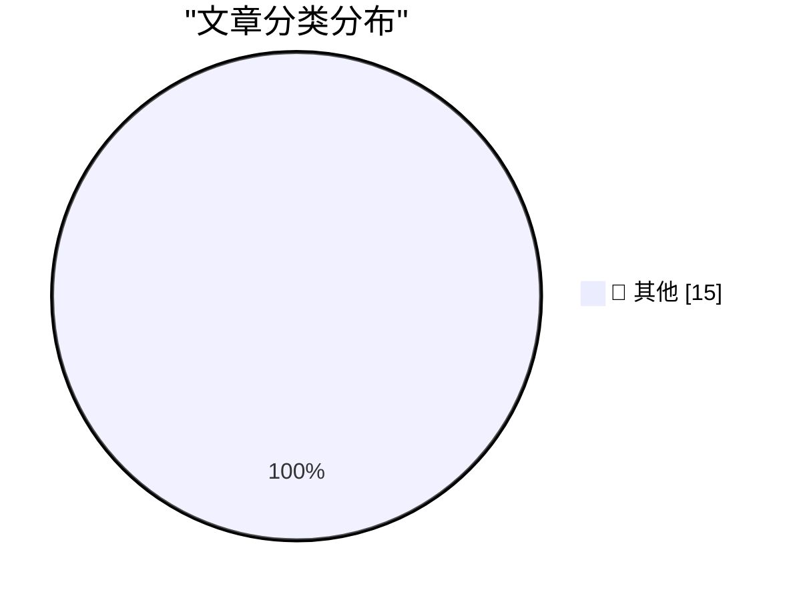

# 📰 AI 资讯每日精选 — 2026-09-17

> 汇聚 140+ 技术博客、X/Twitter、Hacker News、Reddit、Product Hunt、
> Lobste.rs、ClawFeed 日报及 GitHub Trending，经 AI 评分筛选。
>
> **本期内容**：🏆 今日必读 · 🌐 ClawFeed 日报 · 🔥 GitHub Trending · 📂 分类精选 · 🎨 设计与生成式 AI · 📊 数据概览

## 🏆 今日必读

🥇 **datasette 1.0a40**

[datasette 1.0a40](https://simonwillison.net/2026/Sep/16/datasette/) — simonwillison.net · 1 小时前 · 📝 其他

> datasette 1.0a40

🥈 **datasette 0.65.5**

[datasette 0.65.5](https://simonwillison.net/2026/Sep/16/datasette-2/) — simonwillison.net · 1 小时前 · 📝 其他

> datasette 0.65.5

🥉 **Claude Cowork and chat are now one Claude**

[Claude Cowork and chat are now one Claude](https://simonwillison.net/2026/Sep/16/one-claude/) — simonwillison.net · 7 小时前 · 📝 其他

> Claude Cowork and chat are now one Claude

4️⃣ **Quoting Mustafa Suleyman**

[Quoting Mustafa Suleyman](https://simonwillison.net/2026/Sep/16/mustafa-suleyman/) — simonwillison.net · 9 小时前 · 📝 其他

> Quoting Mustafa Suleyman

5️⃣ **Data Broker Radaris Loses Domains in Privacy Fight**

[Data Broker Radaris Loses Domains in Privacy Fight](https://krebsonsecurity.com/2026/09/data-broker-radaris-loses-domains-in-privacy-fight/) — krebsonsecurity.com · 7 小时前 · 📝 其他

> Data Broker Radaris Loses Domains in Privacy Fight

---

## 🌐 ClawFeed 日报精选

> 来源：[ClawFeed](https://clawfeed.kevinhe.io) — AI 驱动的多源新闻聚合

📊 ClawFeed 日报 | 2026-09-16 SGT

聚合 5 期 4h digest (#1214-#1221)，覆盖 00:00-19:59 SGT
feed 总计 ~25 / bookmarks ~25 / errors 0

---

## 🔥 当日全场最重要 5 条

1. **Anthropic 内部 Claude 写了 80% 代码**——Addy Osmani 披露：工程师每季度出码量 8x，副作用是测试量 10x、CI job 25x 增长。解法是 Test Impact Analysis 按需跑测试。**754K 浏览**，当日最高影响力数据点。https://x.com/addyosmani/status/2099577600159158765

2. **Karpathy 入职 Anthropic 后首次讲座**——主题直指 agent 工程四支柱：Agents / Loops / Harness / Self-Improving Systems。核心论点"Harness > Model"——harness（包裹模型的 rules/tools/skills/feedback loop）比模型本身更决定 agent 表现。**177K 浏览**。https://x.com/tspy/status/2099891676609470543

3. **Devin 获得 Mac 虚拟机**——Cognition 给 Devin 发了 Mac VM，可自主 Xcode → iOS Simulator → 录屏 → TestFlight。Agent 拥有自己的开发机器不再是概念——直接呼应 Instinct 的 persistent cloud desktop 架构。https://x.com/berryxia/status/2099895786423398830

4. **Thariq (Anthropic) 判断 MCP 已超越 CLI**——"MCP > CLI for most integrations"。模型 tool calling 能力大幅提升 + deferred tools + MCP 无状态化，使 MCP 成为大多数集成的更优选择。**404K 浏览**。https://x.com/trq212/status/2099958388230873165

5. **腾讯微信团队开源 WeKnora**——企业级知识框架（文档理解 + 语义检索 + 自主推理），GitHub 2.3万星，MIT 协议，被评价为"把 RAG 行业的桌子掀了"。**86K 浏览**。https://x.com/AYi_AInotes/status/2099858387928244547

---

## 📰 当日核心主题

### 主题 1：Agent 工程成为独立学科
Karpathy 的首讲、Anthropic 内部 80% AI 代码的副作用（测试/CI 爆炸）、Thariq 的 MCP>CLI 判断，三条信息指向同一结论：**Agent 工程（harness/scaffolding）正在从"AI 应用开发"中独立出来成为一个专门领域**，核心议题是 harness 架构、测试策略、工具编排。

### 主题 2：消费级 AI Agent 赛道加速
- Alexandr Wang (Scale AI CEO) 公开力挺 Muse："gap between Muse and everything else isn't small"。https://x.com/alexandr_wang/status/2099712619020202239
- Noah Shinn (Instinct) 继续高频发布：Trusted Person 网络全量开放 + Authenticator 自主 2FA (455K 浏览)。https://x.com/noahrshinn/status/2099358203121393851
- Elon Musk 表态做 Grok Bot："找到你生意最大瓶颈，每周 ping 你"。3.3M 浏览。https://x.com/elonmusk/status/2099989432925585534
- Aaron Levie 连续两天发长推更新 agentic workloads 判断：agent swarms + computer use + MCP + 新形态正在汇聚。https://x.com/levie/status/2099739019517235618

### 主题 3：模型多样化信号
- Vercel v0 宣布模型无关化：Claude/GPT/Kimi/GLM/Grok/DeepSeek 全支持。Guillermo Rauch："The future is multi-model"。https://x.com/rauchg/status/2099905740505055680
- ChatGPT 联合发明者 Diogo Almeida 出新公司 TypeSafe AI，发布 Jev 模型（RLCD 训练，20-200x 更快）——走"可组合小推理层"路线，和 scaling law 竞赛完全不同。https://x.com/willdepue/status/2099937498885464070

### 主题 4：企业 AI 落地方法论
- Anthropic FDE 101 (Kevin Bai)：前 Palantir/Rippling FDE 讲透前线部署工程师角色——介于 sales engineer 和 SRE 之间。https://x.com/dotey/status/2099982947394687156
- Google 工程师 WikiSkill：把 agent 执行历史转化为持久化知识再编译成可复用 skill——"agent 经验编译器"。https://x.com/beamnxw/status/2099920164397699464
- AI 行业对知识工作者 $6T+ 市场渗透率 <1%，最好的垂直领域也只在低个位数（Guru Chahal, Lightspeed VP）。https://x.com/guruchahal/status/2041207835082809728

---

## 🔖 累计 Bookmark 精选

• @trq212 (Thariq, Anthropic) - Claude 5 模型的 context engineering 新规则："去掉了 80% 的 system prompt"。**4.9M 浏览**。https://x.com/trq212/status/2080710971228918066
• @AndrewYNg - AI Engineering 技能图谱，定义 2026 年 AI 工程师核心技能栈。**6.7M 浏览**。https://x.com/AndrewYNg/status/2088302050706686198
• @AGTPinsights - Assistant Benchmark 上线：71 个 AI 个人助理在 15 维度上的评分卡。和团队 Top 10 调研直接吻合。https://x.com/AGTPinsights/status/2099783676661751974
• @guruchahal - AI 对 $6T+ 知识工作者市场渗透率 <1%。市场远未饱和。https://x.com/guruchahal/status/2041207835082809728
• @xiaohu - Cloudflare @cloudflare/computer：给每个 Agent 配云端虚拟电脑，毫秒级启动。https://x.com/xiaohu/status/2084549349997150643
• @Tao100086 - 200+ AI 论文精选 36 篇经典，附下载地址。https://x.com/Tao100086/status/2093980035829076189

---

## 👀 推荐关注汇总（去重）

| 账号 | 一句话理由 | Followers | 链接 |
|------|-----------|-----------|------|
| @DKokotajlo | AI 2027/2040 作者，前 OpenAI，AI safety 核心声音 | 49.9K | https://x.com/DKokotajlo |
| @gajesh | Darkbloom 创始人（分布式 Mac 推理网络），agent infra builder | — | https://x.com/gajesh |
| @_LuoFuli | 小米 MiMo 核心，前 DeepSeek，中国开源模型一手信源 | 67.7K | https://x.com/_LuoFuli |
| @shan3v | 独立开发者，80% 开源+20% frontier 模型消费模式转变的一手信号 | 12.8K | https://x.com/shan3v |
| @typesafeai | ChatGPT 联合发明者新公司，RLCD 新训练范式 | 37K | https://x.com/typesafeai |
| @cccyd_qwq | Hypit 创始人，AI agent 克隆病毒视频，HK builder | — | https://x.com/cccyd_qwq |
| @beamnxw | AI agent 工程高质量内容（WikiSkill 等），学术→实操 | — | https://x.com/beamnxw |
| @notkevinzhang | Jev/TypeSafe AI 核心团队，RLCD 一线参与者 | — | https://x.com/notkevinzhang |

提醒：上述未通过浏览器逐一核实是否已关注，**Kevin 操作前请先在 Following 里搜一下**。

---

## 🧹 取关建议

• **@caterpillarous (#endif)** — 全天 5 期连续观察，内容全是个人生活（魂游/海边/买菜），零 AI/tech/crypto 输出。3.3K followers，engagement 极低。**建议取关。**
• **@September9_9_9** — 最近帖子停留在 2024 年 1 月，超过 1.5 年不活跃。满足"僵尸号"标准。**强烈建议取关。**

---

## 💤 当日重复噪音模式

| 模式 | 账号 | 出现频率 |
|------|------|----------|
| PE/AI consulting 自我推广 | @LimestoneHQ / @mardehaym | 5/5 期 |
| Crypto 交易/meme | @Tradermayne | 5/5 期 |
| 无新内容（仅 pinned） | @runinfrai | 4/5 期 |
| 纯 K 线技术分析 | @Mr57814170 | 3/5 期 |

这些账号持续出现在噪音过滤中，可考虑在下一轮抽查时统一评估取关。---

## 🔥 GitHub Trending

> 今日热门开源项目（全语言 + Python）

| # | 项目 | 描述 | ⭐ 总星 | 📈 今日 | 语言 |
|---|------|------|---------|---------|------|
| 1 | [alibaba/open-code-review](https://github.com/alibaba/open-code-review) 🤖 | Fast, efficient, battle-tested at Alibaba's scale. Hybrid... | 32.0k | +3231 | Go |
| 2 | [JustVugg/colibri](https://github.com/JustVugg/colibri) | Run frontier MoE models on hardware you already own — pur... | 35.1k | +1546 | C |
| 3 | [debpalash/VoiceStudio](https://github.com/debpalash/VoiceStudio) | VoiceStudio is the open-source, fully-local ElevenLabs al... | 32.1k | +1416 | Python |
| 4 | [Tencent/WeKnora](https://github.com/Tencent/WeKnora) 🤖 | Open-source LLM knowledge platform: turn raw documents in... | 25.4k | +1197 | Go |
| 5 | [abue-ammar/tinycast](https://github.com/abue-ammar/tinycast) | Tinycast — a tiny, fully native macOS launcher, hotkeys, ... | 5.6k | +1179 | Swift |
| 6 | [NationalSecurityAgency/ghidra](https://github.com/NationalSecurityAgency/ghidra) | Ghidra is a software reverse engineering (SRE) framework | 77.8k | +1059 | Java |
| 7 | [affaan-m/ECC](https://github.com/affaan-m/ECC) 🤖 | The agent harness performance optimization system. Skills... | 260.3k | +1057 | JavaScript |
| 8 | [alphaXiv/OpenResearch](https://github.com/alphaXiv/OpenResearch) | Turn your coding agents into research agents | 4.4k | +1017 | Rust |
| 9 | [cloudflare/security-audit-skill](https://github.com/cloudflare/security-audit-skill) 🤖 | A coding-agent skill for multi-phase security audits with... | 7.3k | +927 | JavaScript |
| 10 | [ever-co/ever-gauzy](https://github.com/ever-co/ever-gauzy) | Ever® Gauzy™ - Open Business Management Platform (ERP/CRM... | 7.3k | +778 | TypeScript |
| 11 | [addyosmani/agent-skills](https://github.com/addyosmani/agent-skills) 🤖 | Production-grade engineering skills for AI coding agents. | 95.5k | +658 | JavaScript |
| 12 | [Lakr233/vphone-cli](https://github.com/Lakr233/vphone-cli) |  | 13.4k | +547 | Swift |
| 13 | [Panniantong/Agent-Reach](https://github.com/Panniantong/Agent-Reach) 🤖 | Give your AI agent eyes to see the entire internet. Read ... | 82.5k | +476 | Python |
| 14 | [jamiepine/voicebox](https://github.com/jamiepine/voicebox) 🤖 | The open-source AI voice studio. Clone, dictate, create. | 54.4k | +417 | TypeScript |
| 15 | [TencentCloud/Octop](https://github.com/TencentCloud/Octop) 🤖 | A smarter, self-hosted AI assistant — multi-user, multi-a... | 3.0k | +396 | Python |

---

## 📝 其他

### 1. datasette 1.0a40

[datasette 1.0a40](https://simonwillison.net/2026/Sep/16/datasette/) — **simonwillison.net** · 1 小时前 · ⭐ 15/30

> datasette 1.0a40

---

### 2. datasette 0.65.5

[datasette 0.65.5](https://simonwillison.net/2026/Sep/16/datasette-2/) — **simonwillison.net** · 1 小时前 · ⭐ 15/30

> datasette 0.65.5

---

### 3. Claude Cowork and chat are now one Claude

[Claude Cowork and chat are now one Claude](https://simonwillison.net/2026/Sep/16/one-claude/) — **simonwillison.net** · 7 小时前 · ⭐ 15/30

> Claude Cowork and chat are now one Claude

---

### 4. Quoting Mustafa Suleyman

[Quoting Mustafa Suleyman](https://simonwillison.net/2026/Sep/16/mustafa-suleyman/) — **simonwillison.net** · 9 小时前 · ⭐ 15/30

> Quoting Mustafa Suleyman

---

### 5. Data Broker Radaris Loses Domains in Privacy Fight

[Data Broker Radaris Loses Domains in Privacy Fight](https://krebsonsecurity.com/2026/09/data-broker-radaris-loses-domains-in-privacy-fight/) — **krebsonsecurity.com** · 7 小时前 · ⭐ 15/30

> Data Broker Radaris Loses Domains in Privacy Fight

---

### 6. Xcode 27.2 Is Out, but 27.1 Is Not, Which Means Developers Still Can’t Get Started on Duo-Adapted Apps

[Xcode 27.2 Is Out, but 27.1 Is Not, Which Means Developers Still Can’t Get Started on Duo-Adapted Apps](https://developer.apple.com/documentation/xcode-release-notes/xcode-27_2-release-notes) — **daringfireball.net** · 2 小时前 · ⭐ 15/30

> Xcode 27.2 Is Out, but 27.1 Is Not, Which Means Developers Still Can’t Get Started on Duo-Adapted Apps

---

### 7. Is That a Duo in Ternus’s Pocket or Was He Just Happy That Apple TV Shows Won 28 Emmys?

[Is That a Duo in Ternus’s Pocket or Was He Just Happy That Apple TV Shows Won 28 Emmys?](https://x.com/DEADLINE/status/2099645816361332775) — **daringfireball.net** · 3 小时前 · ⭐ 15/30

> Is That a Duo in Ternus’s Pocket or Was He Just Happy That Apple TV Shows Won 28 Emmys?

---

### 8. Woz Launches Merch Store

[Woz Launches Merch Store](https://x.com/stevewoz/status/2100074363605397658) — **daringfireball.net** · 4 小时前 · ⭐ 15/30

> Woz Launches Merch Store

---

### 9. Apple OS 27.2 Betas Are Out; Version 27.1 Is the Duo-Exclusive iOS Fork

[Apple OS 27.2 Betas Are Out; Version 27.1 Is the Duo-Exclusive iOS Fork](https://www.macrumors.com/2026/09/16/heres-why-apple-released-ios-27-2-beta/) — **daringfireball.net** · 7 小时前 · ⭐ 15/30

> Apple OS 27.2 Betas Are Out; Version 27.1 Is the Duo-Exclusive iOS Fork

---

### 10. AirPods 5 With Wireless Charging Case Works With MagSafe, But Not Magnetically

[AirPods 5 With Wireless Charging Case Works With MagSafe, But Not Magnetically](https://www.apple.com/airpods-5/specs/) — **daringfireball.net** · 11 小时前 · ⭐ 15/30

> AirPods 5 With Wireless Charging Case Works With MagSafe, But Not Magnetically

---

### 11. ‘Apple Reference Image: A New Approach for Verified Photography’

[‘Apple Reference Image: A New Approach for Verified Photography’](https://security.apple.com/blog/apple-reference-image/) — **daringfireball.net** · 23 小时前 · ⭐ 15/30

> ‘Apple Reference Image: A New Approach for Verified Photography’

---

### 12. Pluralistic: How an AI moratorium can save AI bosses (16 Sep 2026)

[Pluralistic: How an AI moratorium can save AI bosses (16 Sep 2026)](https://pluralistic.net/2026/09/16/beggar-thy-neighbor/) — **pluralistic.net** · 17 小时前 · ⭐ 15/30

> Pluralistic: How an AI moratorium can save AI bosses (16 Sep 2026)

---

### 13. How to get a DOI for your blog posts

[How to get a DOI for your blog posts](https://shkspr.mobi/blog/2026/09/how-to-get-a-doi-for-your-blog-posts/) — **shkspr.mobi** · 14 小时前 · ⭐ 15/30

> How to get a DOI for your blog posts

---

### 14. Converting between cosine similarity and concentration ratio

[Converting between cosine similarity and concentration ratio](https://www.johndcook.com/blog/2026/09/16/concentration-ratio/) — **johndcook.com** · 9 小时前 · ⭐ 15/30

> Converting between cosine similarity and concentration ratio

---

### 15. Coffee + milk ≠ latte

[Coffee + milk ≠ latte](https://www.johndcook.com/blog/2026/09/16/coffee-milk-latte/) — **johndcook.com** · 10 小时前 · ⭐ 15/30

> Coffee + milk ≠ latte

---

## 🎨 Design & Generative AI

### 🖼️ 生成式图片

- **[Is Midjourney still a thing?](https://www.reddit.com/r/singularity/comments/1wi7hcs/is_midjourney_still_a_thing/)** — r/singularity · 6 小时前
  > Is Midjourney still a thing?

---

## 📊 数据概览

| 扫描源 | 抓取文章 | 时间范围 | 精选 |
|:---:|:---:|:---:|:---:|
| 94/140 | 3934 篇 → 87 篇 | 24h | **15 篇** |

### 分类分布

---

*生成于 2026-09-17 01:40 | 汇聚 140 个技术博客、X/Twitter、Hacker News、Reddit、Product Hunt、Lobste.rs、ClawFeed 日报及 GitHub Trending，经 AI 评分筛选出 Top 15 精华内容*
