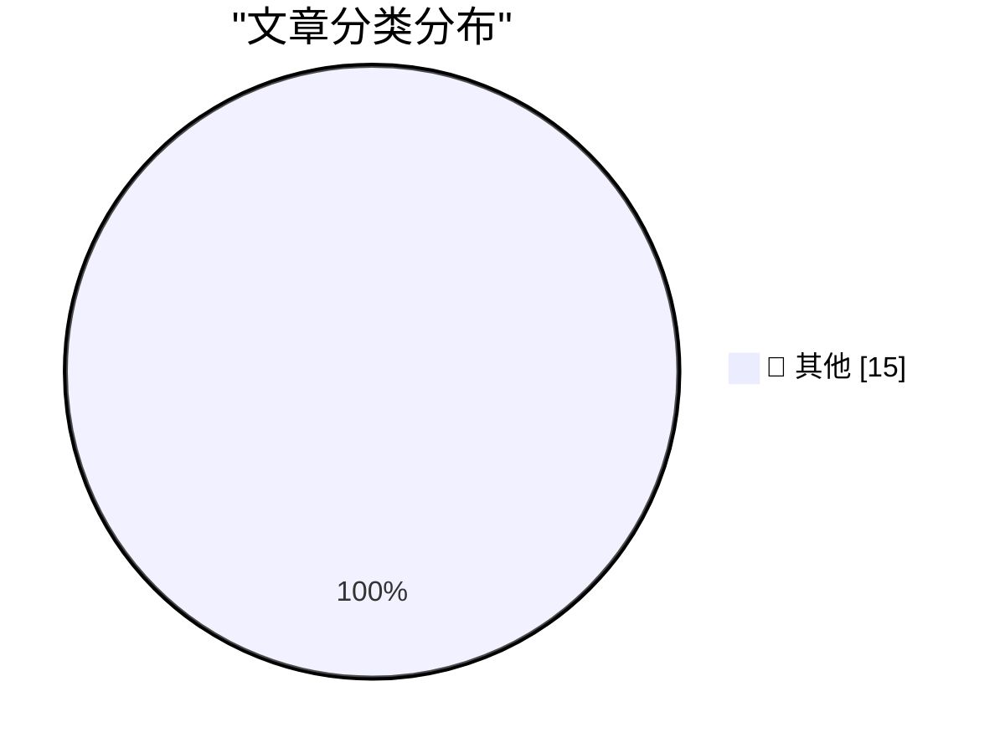

# 📰 AI 资讯每日精选 — 2026-09-18

> 汇聚 140+ 技术博客、X/Twitter、Hacker News、Reddit、Product Hunt、
> Lobste.rs、ClawFeed 日报及 GitHub Trending，经 AI 评分筛选。
>
> **本期内容**：🏆 今日必读 · 🌐 ClawFeed 日报 · 🔥 GitHub Trending · 📂 分类精选 · 🎨 设计与生成式 AI · 📊 数据概览

## 🏆 今日必读

🥇 **Be alert: targeted attacks on prominent Rustaceans**

[Be alert: targeted attacks on prominent Rustaceans](https://simonwillison.net/2026/Sep/17/targeted-attacks-on-rustaceans/) — simonwillison.net · 1 小时前 · 📝 其他

> Be alert: targeted attacks on prominent Rustaceans

🥈 **How To Write With An LLM**

[How To Write With An LLM](https://simonwillison.net/2026/Sep/17/how-to-write-with-an-llm/) — simonwillison.net · 1 小时前 · 📝 其他

> How To Write With An LLM

🥉 **Self-generated prompt injections in compaction summaries**

[Self-generated prompt injections in compaction summaries](https://simonwillison.net/2026/Sep/17/compaction-summaries/) — simonwillison.net · 4 小时前 · 📝 其他

> Self-generated prompt injections in compaction summaries

4️⃣ **Why Do U.S. Models of the iPhone 18 Pro Max, and Only U.S. Models of the 18 Pro Max, Use Qualcomm Cellular Modems Instead of Apple’s Own Superior C2 Modem?**

[Why Do U.S. Models of the iPhone 18 Pro Max, and Only U.S. Models of the 18 Pro Max, Use Qualcomm Cellular Modems Instead of Apple’s Own Superior C2 Modem?](https://www.macrumors.com/2026/09/12/iphone-18-pro-max-us-model-difference/) — daringfireball.net · 10 小时前 · 📝 其他

> Why Do U.S. Models of the iPhone 18 Pro Max, and Only U.S. Models of the 18 Pro Max, Use Qualcomm Cellular Modems Instead of Apple’s Own Superior C2 Modem?

5️⃣ **The Front Page of the Internet Is Up for Grabs**

[The Front Page of the Internet Is Up for Grabs](https://idiallo.com/byte-size/the-front-page-of-the-internet) — idiallo.com · 1 小时前 · 📝 其他

> The Front Page of the Internet Is Up for Grabs

---

## 🌐 ClawFeed 日报精选

> 来源：[ClawFeed](https://clawfeed.kevinhe.io) — AI 驱动的多源新闻聚合

📊 ClawFeed 日报 | 2026-09-17 SGT

聚合 5 期 4h digest (#1224-#1228)，覆盖 00:00-19:59 SGT
feed 总计 ~25 / bookmarks ~25 / followingProfiles ~75 / errors 0

---

## 🔥 当日全场最重要 5 条

1. **Deloitte 内部承认按小时计费的咨询模式已终结**——Mark Ajzenstadt 爆料 Deloitte 合伙人在内部 town hall 展示图表：到 2035 年小时制咨询将萎缩至专业服务市场边缘，AI agent 驱动的成果交付模式取而代之。"They explicitly told their consultants: the business model you've been trained on is ending." **40K+ 浏览**。https://x.com/mardehaym/status/2100283480382840867

2. **Samuel 加入 Anthropic 担任 Head of Frontier Compute Strategy**——与 Tom Brown 合作负责基础设施扩张、联盟建设和规划。此前在 Citadel、KKR、Google 和 Uber 的计算/基础设施领域有深厚背景。**华人在 AI frontier lab 的最高级别任命之一**。https://x.com/samuel_ys92/status/2100312395688141085

3. **Claude Design/Slides/Docs 正式进入 Claude Code**——@ClaudeDevs 宣布三款工具直接在 Claude Code 内可用，可基于 repo 文件和 RFC 生成设计评审 deck 或 UI mockup。同时 Claude Cowork 与 Chat 合并简化使用流程。https://x.com/ClaudeDevs/status/2100270861555228770

4. **Assistant Benchmark 上线：71 款 AI 个人助理横评**——15 个维度（速度/记忆/邮件/研究/购物/权限等）公开打分排名，assistantbenchmark.com。**和 OpenMax 产品定位及团队 OAB 竞品调研直接相关**。https://x.com/AGTPinsights/status/2099783676661751974

5. **小米 MiMo-V2.6 RL 大规模训练曝光**——前 DeepSeek 核心成员 Fuli Luo 沉默半年后首发："我们只研究了一个问题：RL 能 scale 到多远。"单步计算量 ~2B tokens（1568 prompts × 16 rollouts，全异步）。Harness 工程化叙事的中国一线视角。**39K 浏览**。https://x.com/_LuoFuli/status/2100296686719610932

---

## 📰 当日核心主题

### 主题 1：咨询/知识工作行业 AI 颠覆加速
Deloitte 内部承认小时制终结 + AI 市场对 $6T+ 知识工作者市场渗透率不到 1% + Limestone 论护城河转移（"生成廉价，拥有昂贵"）——三条信息指向同一结论：**传统知识工作的交付方式正在被 AI agent 重构**，但市场远未饱和，机会窗口仍然巨大。

### 主题 2：Anthropic/Claude 生态持续扩张
- Samuel 高级别加入（Frontier Compute Strategy）
- Claude Design/Slides/Docs 集成进 Claude Code
- Claude Cowork 与 Chat 合并
- Anthropic 13 页 Agent 记忆白皮书被解读（语义/情景/程序性记忆，据称可降低 90% 调用成本）——和我们 memory 体系直接相关
- Kevin Bai 讲 FDE 101——与 FDE KB 项目直接相关

### 主题 3：消费级 AI Agent 赛道持续升温
- Instinct Concierge 电话服务正式发布——Noah Shinn 继 TOTP/Trusted Person 后再出重磅。**419K 浏览**。白手套定位处理高接触线下场景
- ChatGPT 联合发明人发布 Jev 模型（RLCD 训练，20-200x 更快，40-400x 成本更低）
- Manus Pro 向新加坡公民免费开放（SkillsFuture 补贴，S$300）
- OpenRouter 2.5 年首次反转：用户在 OpenAI 模型上花费超过 Anthropic

### 主题 4：AI 教育/工程方法论
- Andrew Ng AI Engineering 技能图谱（**6.7M 浏览**，持续多期出现在 bookmark）
- 唐杰清华开课座无虚席（112人站满），判断"Chat 这仗打完了，2026 该让模型自己记忆、进化"
- 谢青池 200+ 篇 AI 论文精选 36 篇经典 + 下载地址

---

## 🔖 累计 Bookmark 精选

• @AGTPinsights - Assistant Benchmark：71 个 AI 个人助理 × 15 维度公开评分。https://x.com/AGTPinsights/status/2099783676661751974
• @levie - agentic 工作负载预判：agent swarms + computer use + MCP + Muse/Instinct 新形态汇聚加速。**111K 浏览**。https://x.com/levie/status/2099739019517235618
• @AndrewYNg - AI Engineering 技能图谱。**6.7M 浏览**。https://x.com/AndrewYNg/status/2088302050706686198
• @guruchahal - AI 对 $6T+ 知识工作者市场渗透率 <1%。https://x.com/guruchahal/status/2041207835082809728
• @Tao100086 - 200+ AI 论文精选 36 篇经典 + 下载地址。https://x.com/Tao100086/status/2093980035829076189

---

## 👀 推荐关注汇总（去重）

| 账号 | 一句话理由 | 链接 |
|------|-----------|------|
| @samuel_ys92 | 刚加入 Anthropic 任 Head of Frontier Compute Strategy，华人最高级别 | https://x.com/samuel_ys92 |
| @_LuoFuli | 前 DeepSeek，现小米 MiMo 核心，RL 大规模训练一线实践者 | https://x.com/_LuoFuli |
| @BethMayBarnes | METR 负责人，AI 安全评估深度输出 | https://x.com/BethMayBarnes |
| @gajesh | Darkbloom/OpenRouter infra，distributed Mac 推理网络实践者 | https://x.com/gajesh |
| @AGTPinsights | AI 助理赛道持续追踪，Assistant Benchmark 首发评论质量高 | https://x.com/AGTPinsights |

提醒：上述未通过浏览器逐一核实是否已关注，**Kevin 操作前请先在 Following 里搜一下**。

---

## 🧹 建议取关

• **@caterpillarous (#endif)** - 连续 5 期观察，内容全是个人生活（魂游、海边、买菜、赖床），最后一条 tech 相关内容已追溯不到。**正式建议取关。**
• **@ozvicng (VicTor)** - 内容主要是悉尼超算展会社交、红果短剧推广、风筝节。非 AI/tech builder 内容。

---

## 💤 当日重复噪音模式

1. **Crypto 喊单/K 线分析**——@LeonidasNFT（$DOG/BTC）、@Mr57814170（BTC/XAU 技术分析）、@Tradermayne（加拿大入欧+crypto），频繁出现但与 AI/tech 主线无关
2. **HubSpot 推广链接**——@mardehaym 多期出现第二条均为纯 HubSpot 推广
3. **咖啡因/生活科普**——@marquistrillx 多期出现非 AI/tech 内容（咖啡因睡眠、鸡尾酒冰块等）---

## 🔥 GitHub Trending

> 今日热门开源项目（全语言 + Python）

| # | 项目 | 描述 | ⭐ 总星 | 📈 今日 | 语言 |
|---|------|------|---------|---------|------|
| 1 | [cloudflare/security-audit-skill](https://github.com/cloudflare/security-audit-skill) 🤖 | A coding-agent skill for multi-phase security audits with... | 10.7k | +3607 | JavaScript |
| 2 | [alibaba/open-code-review](https://github.com/alibaba/open-code-review) 🤖 | Fast, efficient, battle-tested at Alibaba's scale. Hybrid... | 34.8k | +3286 | Go |
| 3 | [Tencent/BrowserSkill](https://github.com/Tencent/BrowserSkill) 🤖 | Let AI agents use your real, logged-in browser without in... | 4.2k | +1302 | TypeScript |
| 4 | [affaan-m/ECC](https://github.com/affaan-m/ECC) 🤖 | The agent harness performance optimization system. Skills... | 261.2k | +1171 | JavaScript |
| 5 | [Tencent/WeKnora](https://github.com/Tencent/WeKnora) 🤖 | Open-source LLM knowledge platform: turn raw documents in... | 26.3k | +1125 | Go |
| 6 | [alphaXiv/OpenResearch](https://github.com/alphaXiv/OpenResearch) | Turn your coding agents into research agents | 5.0k | +939 | Rust |
| 7 | [NationalSecurityAgency/ghidra](https://github.com/NationalSecurityAgency/ghidra) | Ghidra is a software reverse engineering (SRE) framework | 78.5k | +912 | Java |
| 8 | [JustVugg/colibri](https://github.com/JustVugg/colibri) | Run frontier MoE models on hardware you already own — pur... | 35.8k | +873 | C |
| 9 | [abue-ammar/tinycast](https://github.com/abue-ammar/tinycast) | Tinycast — a tiny, fully native macOS launcher, hotkeys, ... | 6.2k | +739 | Swift |
| 10 | [addyosmani/agent-skills](https://github.com/addyosmani/agent-skills) 🤖 | Production-grade engineering skills for AI coding agents. | 95.9k | +680 | JavaScript |
| 11 | [jamiepine/voicebox](https://github.com/jamiepine/voicebox) 🤖 | The open-source AI voice studio. Clone, dictate, create. | 54.9k | +667 | TypeScript |
| 12 | [arnegiacomo/fugleramme](https://github.com/arnegiacomo/fugleramme) 🤖 | E-ink bird frame for Raspberry Pi - real-time bird detect... | 2.9k | +592 | Python |
| 13 | [anthropics/claude-code](https://github.com/anthropics/claude-code) 🤖 | Claude Code is an agentic coding tool that lives in your ... | 145.9k | +538 | TypeScript |
| 14 | [ever-co/ever-gauzy](https://github.com/ever-co/ever-gauzy) | Ever® Gauzy™ - Open Business Management Platform (ERP/CRM... | 7.5k | +470 | TypeScript |
| 15 | [SnailSploit/Claude-Red](https://github.com/SnailSploit/Claude-Red) 🤖 | claude-red is a curated library of offensive security ski... | 6.0k | +440 | Python |

---

## 📝 其他

### 1. Be alert: targeted attacks on prominent Rustaceans

[Be alert: targeted attacks on prominent Rustaceans](https://simonwillison.net/2026/Sep/17/targeted-attacks-on-rustaceans/) — **simonwillison.net** · 1 小时前 · ⭐ 15/30

> Be alert: targeted attacks on prominent Rustaceans

---

### 2. How To Write With An LLM

[How To Write With An LLM](https://simonwillison.net/2026/Sep/17/how-to-write-with-an-llm/) — **simonwillison.net** · 1 小时前 · ⭐ 15/30

> How To Write With An LLM

---

### 3. Self-generated prompt injections in compaction summaries

[Self-generated prompt injections in compaction summaries](https://simonwillison.net/2026/Sep/17/compaction-summaries/) — **simonwillison.net** · 4 小时前 · ⭐ 15/30

> Self-generated prompt injections in compaction summaries

---

### 4. Why Do U.S. Models of the iPhone 18 Pro Max, and Only U.S. Models of the 18 Pro Max, Use Qualcomm Cellular Modems Instead of Apple’s Own Superior C2 Modem?

[Why Do U.S. Models of the iPhone 18 Pro Max, and Only U.S. Models of the 18 Pro Max, Use Qualcomm Cellular Modems Instead of Apple’s Own Superior C2 Modem?](https://www.macrumors.com/2026/09/12/iphone-18-pro-max-us-model-difference/) — **daringfireball.net** · 10 小时前 · ⭐ 15/30

> Why Do U.S. Models of the iPhone 18 Pro Max, and Only U.S. Models of the 18 Pro Max, Use Qualcomm Cellular Modems Instead of Apple’s Own Superior C2 Modem?

---

### 5. The Front Page of the Internet Is Up for Grabs

[The Front Page of the Internet Is Up for Grabs](https://idiallo.com/byte-size/the-front-page-of-the-internet) — **idiallo.com** · 1 小时前 · ⭐ 15/30

> The Front Page of the Internet Is Up for Grabs

---

### 6. Pluralistic: On the sincerity of AI bosses (17 Sep 2026)

[Pluralistic: On the sincerity of AI bosses (17 Sep 2026)](https://pluralistic.net/2026/09/17/porque-no-los-dos/) — **pluralistic.net** · 17 小时前 · ⭐ 15/30

> Pluralistic: On the sincerity of AI bosses (17 Sep 2026)

---

### 7. std::call_once vs. std::async

[std::call_once vs. std::async](https://devblogs.microsoft.com/oldnewthing/20260917-00/?p=112706) — **devblogs.microsoft.com/oldnewthing** · 11 小时前 · ⭐ 15/30

> std::call_once vs. std::async

---

### 8. Empirical fractal

[Empirical fractal](https://www.johndcook.com/blog/2026/09/17/empirical-fractal/) — **johndcook.com** · 8 小时前 · ⭐ 15/30

> Empirical fractal

---

### 9. Phone words

[Phone words](https://www.johndcook.com/blog/2026/09/17/phone-words/) — **johndcook.com** · 11 小时前 · ⭐ 15/30

> Phone words

---

### 10. Good Morning, Your Toaster Is Compromised

[Good Morning, Your Toaster Is Compromised](https://nesbitt.io/2026/09/17/good-morning-your-toaster-is-compromised.html) — **nesbitt.io** · 16 小时前 · ⭐ 15/30

> Good Morning, Your Toaster Is Compromised

---

### 11. How SpaceX Streamlined the Raptor Engine

[How SpaceX Streamlined the Raptor Engine](https://www.construction-physics.com/p/how-spacex-streamlined-the-raptor) — **construction-physics.com** · 13 小时前 · ⭐ 15/30

> How SpaceX Streamlined the Raptor Engine

---

### 12. Corporate Sunset

[Corporate Sunset](https://feed.tedium.co/link/15204/17464641/cox-charter-spectrum-brand-retirement-analysis) — **tedium.co** · 10 小时前 · ⭐ 15/30

> Corporate Sunset

---

### 13. Noam Brown – Agent swarms, alignment, & recursive self-improvement

[Noam Brown – Agent swarms, alignment, & recursive self-improvement](https://www.dwarkesh.com/p/noam-brown) — **dwarkesh.com** · 9 小时前 · ⭐ 15/30

> Noam Brown – Agent swarms, alignment, & recursive self-improvement

---

### 14. Computer Reset, Dallas

[Computer Reset, Dallas](https://dfarq.homeip.net/computer-reset-dallas/?utm_source=rss&#038;utm_medium=rss&#038;utm_campaign=computer-reset-dallas) — **dfarq.homeip.net** · 14 小时前 · ⭐ 15/30

> Computer Reset, Dallas

---

### 15. OpenAI reportedly closes in on solving the Hodge conjecture, its second Millennium Prize Problem

[OpenAI reportedly closes in on solving the Hodge conjecture, its second Millennium Prize Problem](https://the-decoder.com/openai-reportedly-closes-in-on-solving-the-hodge-conjecture-its-second-millennium-prize-problem/) — **The Decoder** · 6 小时前 · ⭐ 15/30

> OpenAI reportedly closes in on solving the Hodge conjecture, its second Millennium Prize Problem

---

## 🎨 Design & Generative AI

### 🖼️ 生成式图片

- **[I open-sourced my ComfyUI workflow for MiniMax H3 long-video generation — high-res, faster, and seamless](https://www.reddit.com/r/comfyui/comments/1wio4eg/i_opensourced_my_comfyui_workflow_for_minimax_h3/)** — r/comfyui · 17 小时前
  > I open-sourced my ComfyUI workflow for MiniMax H3 long-video generation — high-res, faster, and seamless

- **[ComfyUI Tutorial: Transform Videos with MiniMax H3 & LTX 2.5 Ripple](https://www.reddit.com/r/comfyui/comments/1wisyjd/comfyui_tutorial_transform_videos_with_minimax_h3/)** — r/comfyui · 12 小时前
  > ComfyUI Tutorial: Transform Videos with MiniMax H3 & LTX 2.5 Ripple

- **[Updated Video Enhancing Lora](https://www.reddit.com/r/comfyui/comments/1wir693/updated_video_enhancing_lora/)** — r/comfyui · 14 小时前
  > Updated Video Enhancing Lora

- **[Pixal3D Multiview in ComfyUI | Load & Save 3D Nodes (Ep34)](https://www.reddit.com/r/comfyui/comments/1wiwok3/pixal3d_multiview_in_comfyui_load_save_3d_nodes/)** — r/comfyui · 10 小时前
  > Pixal3D Multiview in ComfyUI | Load & Save 3D Nodes (Ep34)

- **[RTX 3070 monitor turns off when rendering AI videos with ComfyUI Minimax H3](https://www.reddit.com/r/comfyui/comments/1wiin9p/rtx_3070_monitor_turns_off_when_rendering_ai/)** — r/comfyui · 21 小时前
  > RTX 3070 monitor turns off when rendering AI videos with ComfyUI Minimax H3

- **[FastH3 by FastVideo is available in ComfyUI](https://www.reddit.com/r/comfyui/comments/1wj4yeo/fasth3_by_fastvideo_is_available_in_comfyui/)** — r/comfyui · 5 小时前
  > FastH3 by FastVideo is available in ComfyUI

- **[Implement Generic Loops (Candidate III - implemented ✅) (CORE-14) by rattus128 · Pull Request #16227 · Comfy-Org/ComfyUI](https://www.reddit.com/r/comfyui/comments/1wj7ek3/implement_generic_loops_candidate_iii_implemented/)** — r/comfyui · 3 小时前
  > Implement Generic Loops (Candidate III - implemented ✅) (CORE-14) by rattus128 · Pull Request #16227 · Comfy-Org/ComfyUI

- **[Simple Outpaint Mask editor](https://www.reddit.com/r/comfyui/comments/1wj4oqo/simple_outpaint_mask_editor/)** — r/comfyui · 5 小时前
  > Simple Outpaint Mask editor

- **[YuE2, how to make instrumental only with ComfyUI workflow?](https://www.reddit.com/r/comfyui/comments/1wikpbb/yue2_how_to_make_instrumental_only_with_comfyui/)** — r/comfyui · 20 小时前
  > YuE2, how to make instrumental only with ComfyUI workflow?

- **[Is the Civitai Anima and MiniMax Lora Trainers broken?](https://www.reddit.com/r/comfyui/comments/1wijk9y/is_the_civitai_anima_and_minimax_lora_trainers/)** — r/comfyui · 21 小时前
  > Is the Civitai Anima and MiniMax Lora Trainers broken?

- **[Flux 2 LORA workflow like Higgsfield Soul 2.0 ?](https://www.reddit.com/r/comfyui/comments/1wiwl2r/flux_2_lora_workflow_like_higgsfield_soul_20/)** — r/comfyui · 10 小时前
  > Flux 2 LORA workflow like Higgsfield Soul 2.0 ?

- **[Custom comfyui node for reframing 360 images.](https://www.reddit.com/r/comfyui/comments/1wise3k/custom_comfyui_node_for_reframing_360_images/)** — r/comfyui · 13 小时前
  > Custom comfyui node for reframing 360 images.

---

## 📊 数据概览

| 扫描源 | 抓取文章 | 时间范围 | 精选 |
|:---:|:---:|:---:|:---:|
| 94/140 | 3934 篇 → 82 篇 | 24h | **15 篇** |

### 分类分布

---

*生成于 2026-09-18 01:26 | 汇聚 140 个技术博客、X/Twitter、Hacker News、Reddit、Product Hunt、Lobste.rs、ClawFeed 日报及 GitHub Trending，经 AI 评分筛选出 Top 15 精华内容*
