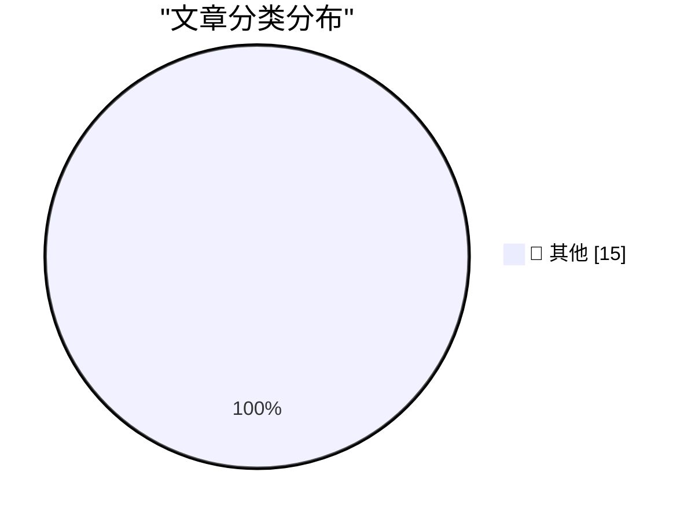

# 📰 AI 资讯每日精选 — 2026-09-19

> 汇聚 140+ 技术博客、X/Twitter、Hacker News、Reddit、Product Hunt、
> Lobste.rs、ClawFeed 日报及 GitHub Trending，经 AI 评分筛选。
>
> **本期内容**：🏆 今日必读 · 🌐 ClawFeed 日报 · 🔥 GitHub Trending · 📂 分类精选 · 🎨 设计与生成式 AI · 📊 数据概览

## 🏆 今日必读

🥇 **Gemini Hacked Three Companies in First Known Breakout by Google’s AI**

[Gemini Hacked Three Companies in First Known Breakout by Google’s AI](https://simonwillison.net/2026/Sep/18/gemini-hacked-three-companies/) — simonwillison.net · 1 小时前 · 📝 其他

> Gemini Hacked Three Companies in First Known Breakout by Google’s AI

🥈 **Note on 18th September 2026**

[Note on 18th September 2026](https://simonwillison.net/2026/Sep/18/probably-gonna-eat-you/) — simonwillison.net · 6 小时前 · 📝 其他

> Note on 18th September 2026

🥉 **Quoting Thariq Shihipar**

[Quoting Thariq Shihipar](https://simonwillison.net/2026/Sep/18/thariq-shihipar/) — simonwillison.net · 6 小时前 · 📝 其他

> Quoting Thariq Shihipar

4️⃣ **The Creative Spirit of Who Framed Roger Rabbit**

[The Creative Spirit of Who Framed Roger Rabbit](https://simonwillison.net/2026/Sep/18/the-creative-spirit-of-who-framed-roger-rabbit/) — simonwillison.net · 10 小时前 · 📝 其他

> The Creative Spirit of Who Framed Roger Rabbit

5️⃣ **NTP, an atomic clock, and having a great time at the world's largest VCF**

[NTP, an atomic clock, and having a great time at the world's largest VCF](https://www.jeffgeerling.com/blog/2026/vcf-midwest-21-ntp-time/) — jeffgeerling.com · 11 小时前 · 📝 其他

> NTP, an atomic clock, and having a great time at the world's largest VCF

---

## 🌐 ClawFeed 日报精选

> 来源：[ClawFeed](https://clawfeed.kevinhe.io) — AI 驱动的多源新闻聚合

📊 ClawFeed 日报 | 2026-09-18 SGT

聚合 5 期 4h digest (#1231-#1235)，覆盖 00:00-19:59 SGT
feed 总计 ~25 / bookmarks ~25 / errors 0

---

## 🔥 当日全场最重要 5 条

1. **Jev（TypeSafe AI）全面爆发——ChatGPT 联合发明人的决策专用模型**——用 RLCD 训练的分类/路由/排序模型，20-200x 速度、40-400x 成本优势，输出侧免费。名字源自 Jevons 悖论。Browser Use + Stagehand 集成实现单任务 $0.001。130+ 项目导航站上线（logicrw/awesome-jev-projects），LangChain 官方集成构建 Agent Harness。中文圈从"这是什么"进入"怎么用"阶段，实操教程涌现。

2. **Claude Code Projects 上线——多线程并行执行+上下文共享**——自动拆任务为多线程并行执行，线程间共享上下文，离开电脑后继续工作。从"对话辅助"到"项目自治"的跨越，对 OpenMax 多 agent 架构有直接参考价值。

3. **Rene 正式发布——iMessage 原生多人协作 AI agent**——像发短信一样用，能浏览网页/写代码/购物/做网站/做 PPT/做图片，multiplayer-first 设计，已内测四个月。代表个人助理赛道的新品类方向。

4. **Aaron Levie 论 agentic workload 质变拐点**——agent swarm + computer use + API/MCP + Muse/Instinct 新形态 + 垂直企业 agent = 企业级 AI 全面升级，"我们需要更新对即将到来的东西的认知"。

5. **Assistant Benchmark 正式上线**——公开评分卡排名 71 个 AI 个人助理，15 维度打分（速度/记忆/邮件/研究/购物/权限等），首个同类横评体系 assistantbenchmark.com。与 Jessie 的 OAB 工作直接相关。

---

## 📰 当日核心主题

### 🏷️ Jev / TypeSafe AI（全天主导，5 期 feed 几乎全覆盖）
- **技术本质**：不生成文本，只输出决策（Choice/Score/Bool schema），RLCD 训练+并行推理替代自回归
- **生态爆发**：Browser Use 集成、Cua Driver "jev-use" Fast Computer Use、jev-trader 开源、LangChain 官方集成、130+ 项目导航站
- **实操落地**：waitlist 当天过审、Codex 一键安装 TypeSafe skill、API Key 配置门槛极低
- **Harness 定位**：Agent = 观察→决策→行动→再观察循环，Jev 专注决策层，让 LLM 回归推理
- **创始人叙事**：ChatGPT 联合发明人两年隐身研发，核心问题"为什么超人级对话模型没有通向 AGI"

### 🏷️ 个人助理赛道
- Rene（iMessage 原生 multiplayer）、Instinct（"OpenClaw for normal people"，magic 级别体验）、Assistant Benchmark（71 助理横评）
- 赛道从硅谷早期用户扩展到大众化（帮家人设置）

### 🏷️ Agentic workload 拐点
- Aaron Levie 的四股力量汇聚判断（agent swarm / computer use / API+MCP / 新模型）
- Claude Code Projects 在 IDE 内实现多线程协作模式
- LangChain + Jev 构建 Agent Harness 范式

---

## 🔖 Bookmarks 精选

- **Rene**：iMessage 原生 AI agent 新品类，multiplayer-first
- **Instinct**："OpenClaw for normal people"，magic 级别体验，大众化验证
- **Assistant Benchmark**：71 AI 助理、15 维度首个公开横评
- **谢青池 AI 论文精选**：200+ 论文中选 36 篇经典，Codex 整理的下载地址
- **jev-trader**：@jarrodwatts 开源链上自动交易系统，14 小时实盘（亏 300% 但架构惊艳）

---

## 👀 推荐关注汇总

- **@typesafeai** — Jev 模型官方，RLCD 训练方法论持续输出
- **@jarrodwatts** — Monad 开发者，Jev 生态早期 builder，开源 demo 质量高
- **@reneiMessage** — Rene 官方，iMessage 原生 AI agent 新品类
- **@0xLogicrw** — Jev 生态整理者，130+ 项目导航站 + GitHub Actions 自动更新

---

## 💤 当日重复噪音模式

- **Jev 刷屏**：全天 5 期 feed 中 Jev 相关占比极高（约 20/25 条），属新模型发布后集中刷屏。内容有差异化角度（技术原理/实操教程/开源集成/项目导航/LangChain 集成），信息密度从第一天到第二天递减但不算无效重复。feed 多样性偏低。
- 1 条纯 crypto 交易推广（$ZEC@PhoenixTrade）为噪音。
---

## 🔥 GitHub Trending

> 今日热门开源项目（全语言 + Python）

| # | 项目 | 描述 | ⭐ 总星 | 📈 今日 | 语言 |
|---|------|------|---------|---------|------|
| 1 | [cloudflare/security-audit-skill](https://github.com/cloudflare/security-audit-skill) 🤖 | A coding-agent skill for multi-phase security audits with... | 13.8k | +3006 | JavaScript |
| 2 | [alibaba/open-code-review](https://github.com/alibaba/open-code-review) 🤖 | Secure, fast, efficient, battle-tested at Alibaba's scale... | 36.7k | +2704 | Go |
| 3 | [Tencent/BrowserSkill](https://github.com/Tencent/BrowserSkill) 🤖 | Let AI agents use your real, logged-in browser without in... | 5.3k | +1306 | TypeScript |
| 4 | [affaan-m/ECC](https://github.com/affaan-m/ECC) 🤖 | The agent harness performance optimization system. Skills... | 262.1k | +958 | JavaScript |
| 5 | [asciimoo/hister](https://github.com/asciimoo/hister) | Your own search engine | 5.0k | +889 | Go |
| 6 | [addyosmani/agent-skills](https://github.com/addyosmani/agent-skills) 🤖 | Production-grade engineering skills for AI coding agents. | 96.4k | +675 | JavaScript |
| 7 | [TencentCloud/Octop](https://github.com/TencentCloud/Octop) 🤖 | A smarter, self-hosted AI assistant — multi-user, multi-a... | 4.0k | +569 | Python |
| 8 | [coder/coder](https://github.com/coder/coder) | Secure environments for developers and their agents | 15.3k | +478 | Go |
| 9 | [anthropics/claude-code](https://github.com/anthropics/claude-code) 🤖 | Claude Code is an agentic coding tool that lives in your ... | 146.3k | +444 | TypeScript |
| 10 | [Graphify-Labs/graphify](https://github.com/Graphify-Labs/graphify) 🤖 | Turn any codebase, with its docs, SQL schemas, configs, a... | 119.4k | +387 | Python |
| 11 | [bobeff/open-source-games](https://github.com/bobeff/open-source-games) | A list of open source games. | 15.1k | +339 | Python |
| 12 | [D4Vinci/Scrapling](https://github.com/D4Vinci/Scrapling) | 🕷️ An adaptive Web Scraping framework that handles every... | 82.2k | +335 | Python |
| 13 | [anthropics/knowledge-work-plugins](https://github.com/anthropics/knowledge-work-plugins) 🤖 | Open source repository of plugins primarily intended for ... | 24.9k | +299 | Python |
| 14 | [Fission-AI/OpenSpec](https://github.com/Fission-AI/OpenSpec) 🤖 | Spec-driven development (SDD) for AI coding assistants. | 69.4k | +296 | TypeScript |
| 15 | [rustfs/rustfs](https://github.com/rustfs/rustfs) | RustFS is an open-source, S3-compatible high-performance ... | 33.2k | +267 | Rust |

---

## 📝 其他

### 1. Gemini Hacked Three Companies in First Known Breakout by Google’s AI

[Gemini Hacked Three Companies in First Known Breakout by Google’s AI](https://simonwillison.net/2026/Sep/18/gemini-hacked-three-companies/) — **simonwillison.net** · 1 小时前 · ⭐ 15/30

> Gemini Hacked Three Companies in First Known Breakout by Google’s AI

---

### 2. Note on 18th September 2026

[Note on 18th September 2026](https://simonwillison.net/2026/Sep/18/probably-gonna-eat-you/) — **simonwillison.net** · 6 小时前 · ⭐ 15/30

> Note on 18th September 2026

---

### 3. Quoting Thariq Shihipar

[Quoting Thariq Shihipar](https://simonwillison.net/2026/Sep/18/thariq-shihipar/) — **simonwillison.net** · 6 小时前 · ⭐ 15/30

> Quoting Thariq Shihipar

---

### 4. The Creative Spirit of Who Framed Roger Rabbit

[The Creative Spirit of Who Framed Roger Rabbit](https://simonwillison.net/2026/Sep/18/the-creative-spirit-of-who-framed-roger-rabbit/) — **simonwillison.net** · 10 小时前 · ⭐ 15/30

> The Creative Spirit of Who Framed Roger Rabbit

---

### 5. NTP, an atomic clock, and having a great time at the world's largest VCF

[NTP, an atomic clock, and having a great time at the world's largest VCF](https://www.jeffgeerling.com/blog/2026/vcf-midwest-21-ntp-time/) — **jeffgeerling.com** · 11 小时前 · ⭐ 15/30

> NTP, an atomic clock, and having a great time at the world's largest VCF

---

### 6. Just Me or Does This Argument Not Add Up?

[Just Me or Does This Argument Not Add Up?](https://www.nytimes.com/2026/09/16/opinion/university-of-california-sat.html?unlocked_article_code=1.CFE.bXBA.V6BFzBn1jlKG) — **daringfireball.net** · 4 小时前 · ⭐ 15/30

> Just Me or Does This Argument Not Add Up?

---

### 7. Will Oremus Is a Duo Doubter

[Will Oremus Is a Duo Doubter](https://www.theatlantic.com/technology/2026/09/apple-folding-iphone/688562/?gift=aQyUJR7AIw1mJWdQ6Ed6yE6RbvpIGGpQGFPIX827p48) — **daringfireball.net** · 4 小时前 · ⭐ 15/30

> Will Oremus Is a Duo Doubter

---

### 8. Apple Releases Xcode 27.1, First SDK With Support for iPhone Duo

[Apple Releases Xcode 27.1, First SDK With Support for iPhone Duo](https://developer.apple.com/news/?id=nyuppv9r) — **daringfireball.net** · 5 小时前 · ⭐ 15/30

> Apple Releases Xcode 27.1, First SDK With Support for iPhone Duo

---

### 9. Warren Buffett, at 96, Steps Down as Chairman at Berkshire Hathaway

[Warren Buffett, at 96, Steps Down as Chairman at Berkshire Hathaway](https://www.berkshirehathaway.com/news/sep1826.pdf) — **daringfireball.net** · 6 小时前 · ⭐ 15/30

> Warren Buffett, at 96, Steps Down as Chairman at Berkshire Hathaway

---

### 10. Trump Says He’s Banning MS NOW, CNN, and Politico From White House

[Trump Says He’s Banning MS NOW, CNN, and Politico From White House](https://truthsocial.com/@realDonaldTrump/posts/117293599348325006) — **daringfireball.net** · 6 小时前 · ⭐ 15/30

> Trump Says He’s Banning MS NOW, CNN, and Politico From White House

---

### 11. Hollywood Wants the Duo

[Hollywood Wants the Duo](https://pagesix.com/2026/09/16/hollywood/mysterious-apple-ceo-charms-hollywood-following-big-emmys-night-by-showing-off-new-iphone/) — **daringfireball.net** · 8 小时前 · ⭐ 15/30

> Hollywood Wants the Duo

---

### 12. Gauging Interest in the iPhone Duo

[Gauging Interest in the iPhone Duo](https://maxfrequency.net/2026/09/17/iphone-duo-mkbhd-popularity-or-curiosity/) — **daringfireball.net** · 8 小时前 · ⭐ 15/30

> Gauging Interest in the iPhone Duo

---

### 13. ★ One More Thing About the iPhones 18 Pro: the Bigger/Smaller Dynamic Island

[★ One More Thing About the iPhones 18 Pro: the Bigger/Smaller Dynamic Island](https://daringfireball.net/2026/09/iphone_18_pro_dynamic_island) — **daringfireball.net** · 8 小时前 · ⭐ 15/30

> ★ One More Thing About the iPhones 18 Pro: the Bigger/Smaller Dynamic Island

---

### 14. YouTube Changed How It Counts ‘Views’ Last Month, Inflating New Numbers

[YouTube Changed How It Counts ‘Views’ Last Month, Inflating New Numbers](https://support.google.com/youtube/thread/433409976/an-update-to-how-we-count-public-views-across-youtube?hl=en) — **daringfireball.net** · 9 小时前 · ⭐ 15/30

> YouTube Changed How It Counts ‘Views’ Last Month, Inflating New Numbers

---

### 15. ★ The iPhones 18 Pro

[★ The iPhones 18 Pro](https://daringfireball.net/2026/09/the_iphones_18_pro) — **daringfireball.net** · 23 小时前 · ⭐ 15/30

> ★ The iPhones 18 Pro

---

## 🎨 Design & Generative AI

### 🖼️ 生成式图片

- **[Yue2 LoRA of Samuel L. Jackson's voice - trained in just 400 steps w/ AI-Toolkit (credit to gueykhalamari)](https://www.reddit.com/r/StableDiffusion/comments/1wjtlj8/yue2_lora_of_samuel_l_jacksons_voice_trained_in/)** — r/StableDiffusion · 9 小时前
  > Yue2 LoRA of Samuel L. Jackson's voice - trained in just 400 steps w/ AI-Toolkit (credit to gueykhalamari)

- **[Enjoy a Yue2 Chanson Francaise (French Ballads) Lora](https://www.reddit.com/r/StableDiffusion/comments/1wk4o8l/enjoy_a_yue2_chanson_francaise_french_ballads_lora/)** — r/StableDiffusion · 2 小时前
  > Enjoy a Yue2 Chanson Francaise (French Ballads) Lora

- **[Enjoy a Yu2 Italian 80s/90s style Canzone Lora](https://www.reddit.com/r/StableDiffusion/comments/1wk3r7o/enjoy_a_yu2_italian_80s90s_style_canzone_lora/)** — r/StableDiffusion · 3 小时前
  > Enjoy a Yu2 Italian 80s/90s style Canzone Lora

---

## 📊 数据概览

| 扫描源 | 抓取文章 | 时间范围 | 精选 |
|:---:|:---:|:---:|:---:|
| 94/140 | 3936 篇 → 94 篇 | 24h | **15 篇** |

### 分类分布

---

*生成于 2026-09-19 01:33 | 汇聚 140 个技术博客、X/Twitter、Hacker News、Reddit、Product Hunt、Lobste.rs、ClawFeed 日报及 GitHub Trending，经 AI 评分筛选出 Top 15 精华内容*
