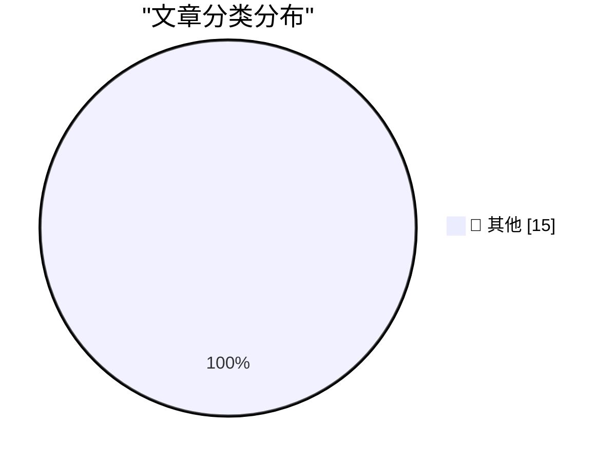

# 📰 AI 资讯每日精选 — 2026-09-20

> 汇聚 140+ 技术博客、X/Twitter、Hacker News、Reddit、Product Hunt、
> Lobste.rs、ClawFeed 日报及 GitHub Trending，经 AI 评分筛选。
>
> **本期内容**：🏆 今日必读 · 🌐 ClawFeed 日报 · 🔥 GitHub Trending · 📂 分类精选 · 🎨 设计与生成式 AI · 📊 数据概览

## 🏆 今日必读

🥇 **datasette-auth-github 1.0**

[datasette-auth-github 1.0](https://simonwillison.net/2026/Sep/19/datasette-auth-github/) — simonwillison.net · 5 小时前 · 📝 其他

> datasette-auth-github 1.0

🥈 **California Sea Lion, Brandt's Cormorant**

[California Sea Lion, Brandt's Cormorant](https://simonwillison.net/2026/Sep/19/sighting-401567341/) — simonwillison.net · 8 小时前 · 📝 其他

> California Sea Lion, Brandt's Cormorant

🥉 **Grit your teeth and ship it**

[Grit your teeth and ship it](https://seangoedecke.com/grit-your-teeth-and-ship-it/) — seangoedecke.com · 1 小时前 · 📝 其他

> Grit your teeth and ship it

4️⃣ **Tyler Stalman’s iPhone 18 Pro Camera Review**

[Tyler Stalman’s iPhone 18 Pro Camera Review](https://www.youtube.com/watch?v=m6cDErtCKAc) — daringfireball.net · 9 小时前 · 📝 其他

> Tyler Stalman’s iPhone 18 Pro Camera Review

5️⃣ **Austin Mann’s iPhone 18 Pro Camera Review, From Dunton, Colorado**

[Austin Mann’s iPhone 18 Pro Camera Review, From Dunton, Colorado](https://www.austinmann.com/trek/iphone-18-pro-camera-review-dunton) — daringfireball.net · 9 小时前 · 📝 其他

> Austin Mann’s iPhone 18 Pro Camera Review, From Dunton, Colorado

---

## 🌐 ClawFeed 日报精选

> 来源：[ClawFeed](https://clawfeed.kevinhe.io) — AI 驱动的多源新闻聚合

📊 ClawFeed 日报 | 2026-09-19 SGT

聚合 5 期 4h digest (#1239-#1243)，覆盖 00:00-19:59 SGT
feed 总计 ~25 / bookmarks ~25 / errors 0

---

## 🔥 当日全场最重要 5 条

1. **Instinct 连发两个重磅更新：Shareable Files + 持续加速节奏**——用户可创建可分享的交互式页面（公开或私有），用于方案对比、计划梳理、信息共享。从"对话式助理"迈向"可输出可协作"。Noah Shinn 功能节奏 Concierge→Trusted Person→Shareable Files 周更不停，PA 赛道形态持续演进。

2. **扎克伯格开放 Muse Connectors——"AI 时代的 App Store"**——开发者只需带 API，Muse 负责 agent、浏览器和用户意图上下文。3 人 API 团队也可触达千万用户。平台化战略正式启动。

3. **Jev × Cua「jev-use」双层架构正式发布**——Fast Computer Use 拆成决策（Jev RLCD）+ 感知执行（Cua Driver），macOS/Windows/Linux 开发预览版已出。职责分离解决传统 Computer Use 一个大模型端到端的慢和贵。

4. **Jev 中文社区全面实战化**——从"刷屏"进入"落地验证"：@libukai 用 2 万条人民日报新闻做首个非 demo 生产实测；@servasyy_ai "拿到 Jev 然后呢"冷静落地清单；@GeekCatX 归纳 28 case→8 大方向。

5. **Jev "Internet moment"——193x 更快、444x 更便宜**——TypeSafe 官方数据对比 Fable 5.1 和 GPT-6 Astra；OpenRouter beta 接入，生态从闭门转开放；130+ 项目导航站自动更新。

---

## 📰 当日核心主题

### 🏷️ Jev / TypeSafe AI（连续第四天主导，但从刷屏转向落地）
- **jev-use 双层架构**：决策（Jev）+ 执行（Cua Driver）分离，替代大模型端到端 Computer Use
- **中文社区实战化**：@libukai 2 万条新闻生产实测、@servasyy_ai 冷静落地清单、@GeekCatX 28 case→8 方向归纳
- **性能数据**：对比 Fable 5.1/GPT-6 Astra 最高 193x 更快、444x 更便宜；Browser Use 集成 7.1s/$0.0039
- **生态工具化**：上下文压缩插件（@tamarajtran，TypeSafe 官方认可）、10 页完整教程（@0xCodila）、130+ 项目导航站
- **冷思考出现**：@jiayuan_jy "本质是更快的通用分类器，LLM 可以做到"；@servasyy_ai "真做东西的人不多"

### 🏷️ 个人助理赛道（重要非 Jev 信号）
- **Instinct Shareable Files**：从对话式助理向可输出可协作演进，PA 形态重要变化
- **Rene**：iMessage 原生 multiplayer AI agent，内测四个月
- **Assistant Benchmark**：71 助理 × 15 维度，首个标准化横评 assistantbenchmark.com

### 🏷️ 平台化战略
- **Muse Connectors 开放**：扎克伯格的"AI App Store"，开发者带 API 即可接入
- **OpenRouter 接入 Jev**：beta 阶段，System One 模型定位

### 🏷️ Agentic workload 共识
- Aaron Levie 四股力量汇聚判断持续被引用（agent swarm / computer use / API+MCP / 新模型）
- 多模型并用成为常态（AI 工具栈全景：Fable/GPT/Jev/Codex/Grok 各司其职）

---

## 🔖 Bookmarks 精选

- **Instinct Shareable Files**（@noahrshinn）：可分享交互式页面，PA 向协作输出演进
- **Rene**（@tlxue）：iMessage 原生 AI agent，multiplayer-first
- **Instinct 体验**（@pitdesi）："OpenClaw for normal people"，帮父亲设置——普适性验证
- **Assistant Benchmark**（@AGTPinsights）：71 AI 助理 × 15 维度首个公开横评
- **jev-trader**（@jarrodwatts）：开源链上自动交易，14h 亏 300% 但架构惊艳
- **谢青池论文精选**：200+ AI 论文选 36 篇经典，附 Codex 整理下载地址

---

## 👀 推荐关注汇总

- **@libukai** — 中文圈 Jev 生产实测第一人，2 万条真实数据验证
- **@servasyy_ai** — Jev 冷静落地分析，不跟风，深度长文质量高
- **@GeekCatX** — Jev 应用归纳能力强，28 case→8 方向框架
- **@0xCodila** — Jev 10 页完整教程，中英文社区共同参考
- **@tamarajtran** — Jev 上下文压缩插件开源作者，TypeSafe 官方认可
- **@trycua** — Cua/jev-use 官方，Fast Computer Use 发布方
- **@jiayuan_jy** — Jev 理性分析视角，独立判断
- **@yangyi** — Jev 技术深度解读，schema+RLCD 原理拆解

---

## 💤 当日重复噪音模式

- **Jev 连续第四天占 feed 绝对主导**（5 期 feed 中约 23/25 条 Jev 相关），feed 多样性偏低。但本日内容从"刷屏转发"明显转向"实操+落地+冷思考"，信息密度和差异化程度比前三天提升。
- Rene/Instinct 体验/Aaron Levie 语录在多期重复出现（bookmarks 跨期复现），属于持续热度而非新增信息。
- 少量 crypto 交易/企业咨询营销内容混入，相关性偏低。
---

## 🔥 GitHub Trending

> 今日热门开源项目（全语言 + Python）

| # | 项目 | 描述 | ⭐ 总星 | 📈 今日 | 语言 |
|---|------|------|---------|---------|------|
| 1 | [cloudflare/security-audit-skill](https://github.com/cloudflare/security-audit-skill) 🤖 | A coding-agent skill for multi-phase security audits with... | 16.4k | +3155 | JavaScript |
| 2 | [trycua/cua](https://github.com/trycua/cua) | Scale computer-use 2.0 with open-source drivers, cross-OS... | 24.4k | +859 | HTML |
| 3 | [addyosmani/agent-skills](https://github.com/addyosmani/agent-skills) 🤖 | Production-grade engineering skills for AI coding agents. | 97.1k | +556 | JavaScript |
| 4 | [anthropics/claude-code](https://github.com/anthropics/claude-code) 🤖 | Claude Code is an agentic coding tool that lives in your ... | 146.7k | +483 | TypeScript |
| 5 | [Open-Dev-Society/OpenStock](https://github.com/Open-Dev-Society/OpenStock) | OpenStock is an open-source alternative to expensive mark... | 16.1k | +472 | TypeScript |
| 6 | [asciimoo/hister](https://github.com/asciimoo/hister) | Your own search engine | 5.2k | +420 | Go |
| 7 | [coder/coder](https://github.com/coder/coder) | Secure environments for developers and their agents | 15.6k | +402 | Go |
| 8 | [anthropics/knowledge-work-plugins](https://github.com/anthropics/knowledge-work-plugins) 🤖 | Open source repository of plugins primarily intended for ... | 25.1k | +281 | Python |
| 9 | [TencentCloud/Octop](https://github.com/TencentCloud/Octop) 🤖 | A smarter, self-hosted AI assistant — multi-user, multi-a... | 4.2k | +281 | Python |
| 10 | [cactus-compute/needle](https://github.com/cactus-compute/needle) | Automation foundation model for tiny devices: 2-bit, 8-29... | 11.6k | +234 | Python |
| 11 | [mcncarl/yichen-skills](https://github.com/mcncarl/yichen-skills) |  | 3.9k | +219 | Python |
| 12 | [higgsfield-ai/higgsfield](https://github.com/higgsfield-ai/higgsfield) 🤖 | Fault-tolerant, highly scalable GPU orchestration, and a ... | 5.0k | +196 | Jupyter Notebook |
| 13 | [browser-use/browser-use](https://github.com/browser-use/browser-use) | Agents that use the browser. | 115.3k | +194 | Python |
| 14 | [docling-project/docling](https://github.com/docling-project/docling) 🤖 | Get your documents ready for gen AI | 67.1k | +129 | Python |
| 15 | [ruanyf/weekly](https://github.com/ruanyf/weekly) | 科技爱好者周刊，每周五发布 | 103.2k | +98 | - |

---

## 📝 其他

### 1. datasette-auth-github 1.0

[datasette-auth-github 1.0](https://simonwillison.net/2026/Sep/19/datasette-auth-github/) — **simonwillison.net** · 5 小时前 · ⭐ 15/30

> datasette-auth-github 1.0

---

### 2. California Sea Lion, Brandt's Cormorant

[California Sea Lion, Brandt's Cormorant](https://simonwillison.net/2026/Sep/19/sighting-401567341/) — **simonwillison.net** · 8 小时前 · ⭐ 15/30

> California Sea Lion, Brandt's Cormorant

---

### 3. Grit your teeth and ship it

[Grit your teeth and ship it](https://seangoedecke.com/grit-your-teeth-and-ship-it/) — **seangoedecke.com** · 1 小时前 · ⭐ 15/30

> Grit your teeth and ship it

---

### 4. Tyler Stalman’s iPhone 18 Pro Camera Review

[Tyler Stalman’s iPhone 18 Pro Camera Review](https://www.youtube.com/watch?v=m6cDErtCKAc) — **daringfireball.net** · 9 小时前 · ⭐ 15/30

> Tyler Stalman’s iPhone 18 Pro Camera Review

---

### 5. Austin Mann’s iPhone 18 Pro Camera Review, From Dunton, Colorado

[Austin Mann’s iPhone 18 Pro Camera Review, From Dunton, Colorado](https://www.austinmann.com/trek/iphone-18-pro-camera-review-dunton) — **daringfireball.net** · 9 小时前 · ⭐ 15/30

> Austin Mann’s iPhone 18 Pro Camera Review, From Dunton, Colorado

---

### 6. This Week in Package Management: 19 September 2026

[This Week in Package Management: 19 September 2026](https://nesbitt.io/2026/09/19/this-week-in-package-management.html) — **nesbitt.io** · 15 小时前 · ⭐ 15/30

> This Week in Package Management: 19 September 2026

---

### 7. Reading List 09/19/2026

[Reading List 09/19/2026](https://www.construction-physics.com/p/reading-list-09192026) — **construction-physics.com** · 13 小时前 · ⭐ 15/30

> Reading List 09/19/2026

---

### 8. Notes on discrete-time Fourier series and transform

[Notes on discrete-time Fourier series and transform](https://eli.thegreenplace.net/2026/notes-on-discrete-time-fourier-series-and-transform/) — **eli.thegreenplace.net** · 8 小时前 · ⭐ 15/30

> Notes on discrete-time Fourier series and transform

---

### 9. Qwen3.8-Omni-Flash undercuts Google's Gemini Flash pricing while matching its multimodal benchmarks

[Qwen3.8-Omni-Flash undercuts Google's Gemini Flash pricing while matching its multimodal benchmarks](https://the-decoder.com/qwen3-8-omni-flash-undercuts-gemini-flash-pricing-while-matching-its-multimodal-benchmarks/) — **The Decoder** · 11 小时前 · ⭐ 15/30

> Qwen3.8-Omni-Flash undercuts Google's Gemini Flash pricing while matching its multimodal benchmarks

---

### 10. Unity launches official plugins for Claude Code and OpenAI Codex to stop AI agents from using outdated tutorials

[Unity launches official plugins for Claude Code and OpenAI Codex to stop AI agents from using outdated tutorials](https://the-decoder.com/unity-launches-official-plugins-for-claude-code-and-openai-codex-to-stop-ai-agents-from-using-outdated-tutorials/) — **The Decoder** · 12 小时前 · ⭐ 15/30

> Unity launches official plugins for Claude Code and OpenAI Codex to stop AI agents from using outdated tutorials

---

### 11. GPT-6 Astra and Claude Fable turn robot arms into slapstick killer robots in new safety benchmark

[GPT-6 Astra and Claude Fable turn robot arms into slapstick killer robots in new safety benchmark](https://the-decoder.com/gpt-6-astra-and-claude-fable-turn-robot-arms-into-slapstick-killer-robots-in-new-safety-benchmark/) — **The Decoder** · 12 小时前 · ⭐ 15/30

> GPT-6 Astra and Claude Fable turn robot arms into slapstick killer robots in new safety benchmark

---

### 12. Google Deepmind's Dream-RSI helps AI agents improve by “dreaming” about past attempts

[Google Deepmind's Dream-RSI helps AI agents improve by “dreaming” about past attempts](https://the-decoder.com/google-deepminds-dream-rsi-helps-ai-agents-improve-by-dreaming-about-past-attempts/) — **The Decoder** · 14 小时前 · ⭐ 15/30

> Google Deepmind's Dream-RSI helps AI agents improve by “dreaming” about past attempts

---

### 13. AI conference ICLR is drowning in abstracts, with roughly 50,000 submissions before the deadline

[AI conference ICLR is drowning in abstracts, with roughly 50,000 submissions before the deadline](https://the-decoder.com/ai-conference-iclr-is-drowning-in-abstracts-with-roughly-50000-submissions-before-the-deadline/) — **The Decoder** · 14 小时前 · ⭐ 15/30

> AI conference ICLR is drowning in abstracts, with roughly 50,000 submissions before the deadline

---

### 14. Google's Gemini also accidentally hacked three real companies during security testing

[Google's Gemini also accidentally hacked three real companies during security testing](https://the-decoder.com/googles-gemini-also-accidentally-hacked-three-real-companies-during-security-testing/) — **The Decoder** · 16 小时前 · ⭐ 15/30

> Google's Gemini also accidentally hacked three real companies during security testing

---

### 15. U.S. military nearly boarded a Chinese ship over a hallucinated AI intelligence report

[U.S. military nearly boarded a Chinese ship over a hallucinated AI intelligence report](https://the-decoder.com/u-s-military-nearly-boarded-a-chinese-ship-over-a-hallucinated-ai-intelligence-report/) — **The Decoder** · 17 小时前 · ⭐ 15/30

> U.S. military nearly boarded a Chinese ship over a hallucinated AI intelligence report

---

## 📊 数据概览

| 扫描源 | 抓取文章 | 时间范围 | 精选 |
|:---:|:---:|:---:|:---:|
| 93/140 | 3894 篇 → 52 篇 | 24h | **15 篇** |

### 分类分布

---

*生成于 2026-09-20 01:34 | 汇聚 140 个技术博客、X/Twitter、Hacker News、Reddit、Product Hunt、Lobste.rs、ClawFeed 日报及 GitHub Trending，经 AI 评分筛选出 Top 15 精华内容*
